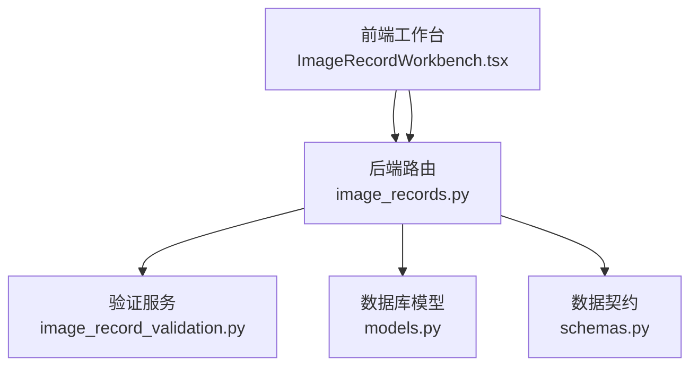
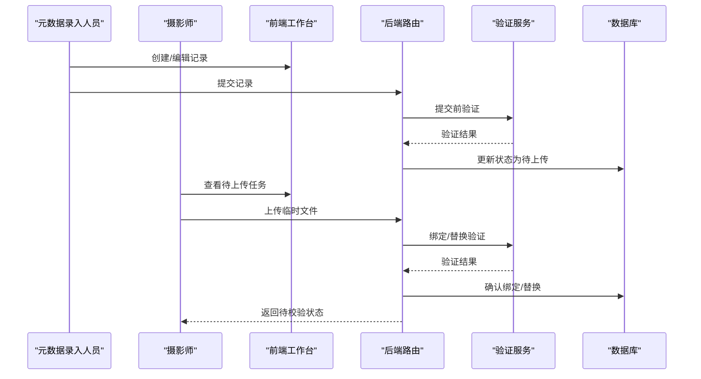
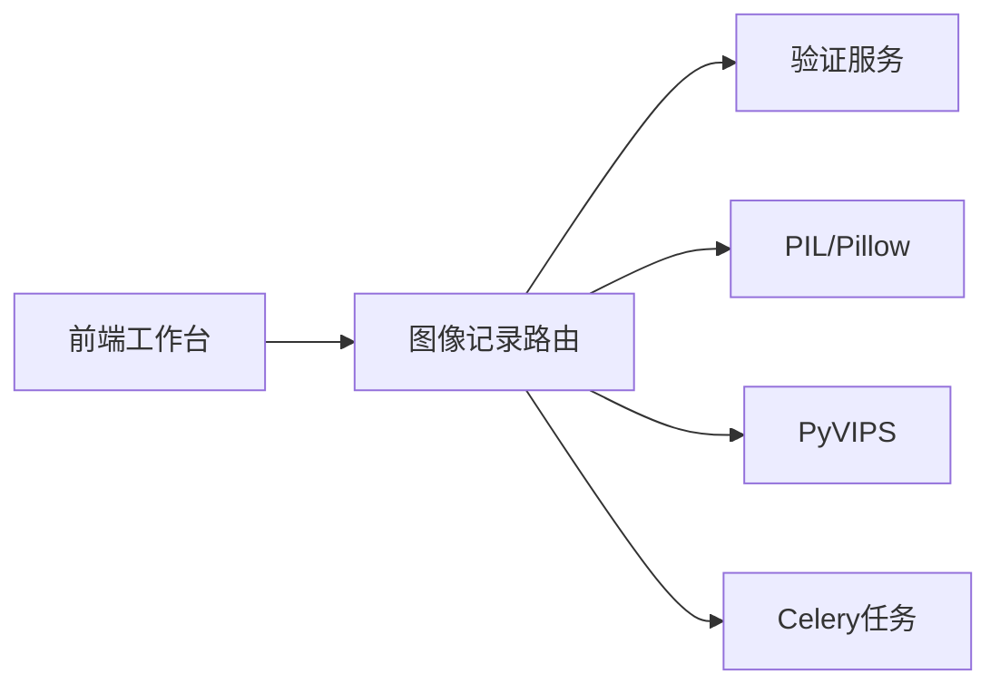
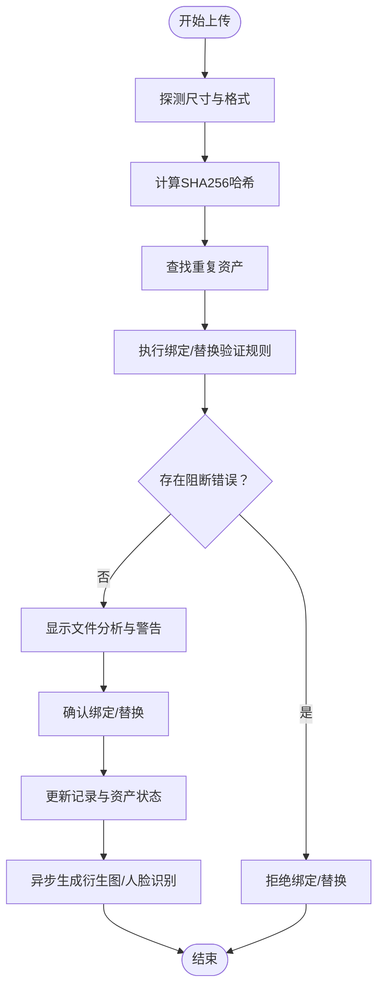

# 图像记录管理

<cite>
**本文引用的文件**
- [IMAGE_RECORD_WORKBENCH_GUIDE.md](file://docs/03-产品与流程/IMAGE_RECORD_WORKBENCH_GUIDE.md)
- [IMAGE_RECORD_VALIDATION_PHASE1_PLAN.md](file://docs/04-实施方案/IMAGE_RECORD_VALIDATION_PHASE1_PLAN.md)
- [IMAGE_RECORD_MATCHING_PHASE1_PLAN.md](file://docs/04-实施方案/IMAGE_RECORD_MATCHING_PHASE1_PLAN.md)
- [image_records.py](file://backend/app/routers/image_records.py)
- [image_record_validation.py](file://backend/app/services/image_record_validation.py)
- [ImageRecordWorkbench.tsx](file://frontend/src/components/ImageRecordWorkbench.tsx)
- [ImageRecordForm.tsx](file://frontend/src/components/ImageRecordForm.tsx)
- [models.py](file://backend/app/models.py)
- [schemas.py](file://backend/app/schemas.py)
</cite>

## 目录
1. [简介](#简介)
2. [项目结构](#项目结构)
3. [核心组件](#核心组件)
4. [架构总览](#架构总览)
5. [详细组件分析](#详细组件分析)
6. [依赖分析](#依赖分析)
7. [性能考虑](#性能考虑)
8. [故障排查指南](#故障排查指南)
9. [结论](#结论)
10. [附录](#附录)

## 简介
本文件面向MDAMS原型项目的图像记录管理工作台，系统性阐述图像记录的录入、验证、文件匹配与校验、审核与状态流转、数据模型与字段约束、以及前后端交互流程。文档同时给出最佳实践、常见问题与解决方案，并提供API接口说明与可视化流程图，帮助开发者与运营人员高效理解与使用。

## 项目结构
图像记录管理工作台由前后端协同实现：
- 后端采用FastAPI路由与服务层，提供图像记录、文件上传与匹配、验证与状态管理等能力。
- 前端提供工作台界面，支持元数据录入、提交、退回、摄影师上传与绑定、替换等操作。
- 数据模型与序列化定义在后端统一管理，确保前后端契约一致。

图表来源
- [image_records.py:1-120](file://backend/app/routers/image_records.py#L1-120)
- [image_record_validation.py:1-60](file://backend/app/services/image_record_validation.py#L1-60)
- [models.py:144-174](file://backend/app/models.py#L144-174)
- [schemas.py:220-333](file://backend/app/schemas.py#L220-333)
- [ImageRecordWorkbench.tsx:1-120](file://frontend/src/components/ImageRecordWorkbench.tsx#L1-120)

章节来源
- [IMAGE_RECORD_WORKBENCH_GUIDE.md:1-115](file://docs/03-产品与流程/IMAGE_RECORD_WORKBENCH_GUIDE.md#L1-L115)
- [image_records.py:1-120](file://backend/app/routers/image_records.py#L1-L120)
- [models.py:144-174](file://backend/app/models.py#L144-L174)
- [schemas.py:220-333](file://backend/app/schemas.py#L220-L333)
- [ImageRecordWorkbench.tsx:1-120](file://frontend/src/components/ImageRecordWorkbench.tsx#L1-L120)

## 核心组件
- 图像记录路由与控制器：负责记录的创建、查询、提交、退回、上传临时文件、确认绑定与替换等。
- 验证服务：提供提交前与绑定后的验证规则与结果模型。
- 前端工作台：提供元数据录入、提交、退回、上传与确认绑定/替换的交互界面。
- 数据模型与序列化：统一记录、资产、摄录单等实体与响应模型。

章节来源
- [image_records.py:1110-1608](file://backend/app/routers/image_records.py#L1110-L1608)
- [image_record_validation.py:163-563](file://backend/app/services/image_record_validation.py#L163-L563)
- [ImageRecordWorkbench.tsx:235-800](file://frontend/src/components/ImageRecordWorkbench.tsx#L235-L800)
- [models.py:144-174](file://backend/app/models.py#L144-L174)
- [schemas.py:220-333](file://backend/app/schemas.py#L220-L333)

## 架构总览
图像记录工作台遵循“先建记录、后传文件”的拆分流程，元数据录入人员与摄影上传人员分别承担不同职责，系统通过严格的权限控制与状态机保证流程可控。

图表来源
- [IMAGE_RECORD_WORKBENCH_GUIDE.md:56-98](file://docs/03-产品与流程/IMAGE_RECORD_WORKBENCH_GUIDE.md#L56-L98)
- [image_records.py:1393-1608](file://backend/app/routers/image_records.py#L1393-L1608)
- [image_record_validation.py:163-563](file://backend/app/services/image_record_validation.py#L163-L563)

## 详细组件分析

### 工作台角色与职责
- 元数据录入人员：创建记录、填写结构化信息、提交记录、退回后继续修改。
- 摄影上传人员：查看已分配的待上传记录、上传文件、绑定/替换资产。
- 系统管理员：可作为调试与演示角色进入工作台。

章节来源
- [IMAGE_RECORD_WORKBENCH_GUIDE.md:14-55](file://docs/03-产品与流程/IMAGE_RECORD_WORKBENCH_GUIDE.md#L14-L55)

### 录入界面与交互流程
- 前端工作台包含录入单列表、录入单头信息、明细列表与上传确认区域。
- 支持新建/保存录入单、新建/保存明细、提交/退回、上传临时文件、确认绑定/替换。
- 表单字段根据profile动态展示，支持文物号查询与样例展示。

章节来源
- [ImageRecordWorkbench.tsx:235-800](file://frontend/src/components/ImageRecordWorkbench.tsx#L235-L800)
- [ImageRecordForm.tsx:1-246](file://frontend/src/components/ImageRecordForm.tsx#L1-L246)

### 提交与退回流程
- 提交：仅当记录满足提交验证规则时允许进入“待上传”状态。
- 退回：仅“待上传”状态可退回，退回后记录回到“已退回”，并记录退回原因。

章节来源
- [image_records.py:1393-1462](file://backend/app/routers/image_records.py#L1393-L1462)
- [image_record_validation.py:163-370](file://backend/app/services/image_record_validation.py#L163-L370)

### 文件上传与匹配机制
- 上传临时文件：系统进行基础分析（扩展名、尺寸、格式、哈希），并生成临时上传载荷。
- 显式确认绑定/替换：摄影师需显式点击确认按钮，避免自动绑定。
- 重复检测：基于文件哈希与现有资产进行重复检测，阻止同一内容的二次有效绑定。

章节来源
- [image_records.py:1464-1608](file://backend/app/routers/image_records.py#L1464-L1608)
- [image_record_validation.py:372-563](file://backend/app/services/image_record_validation.py#L372-L563)

### 审核与状态管理
- 状态机：草稿、已退回、待上传、已上传待校验等。
- 审核动作：提交、退回、确认绑定、确认替换。
- 审计轨迹：每次关键操作均写入审计日志，包含操作人、时间、备注等。

章节来源
- [image_records.py:154-178](file://backend/app/routers/image_records.py#L154-L178)
- [image_records.py:1393-1608](file://backend/app/routers/image_records.py#L1393-L1608)

### 数据模型与字段约束
- 图像记录：包含记录号、标题、状态、资源类型、可见范围、关联对象、profile键、元数据信息等。
- 资产：文件名、路径、大小、MIME类型、可见范围、绑定记录、技术元数据等。
- 摄录单：批次化管理多条记录，支持项目类型、摄影师、拍摄时间、版权归属等。

章节来源
- [models.py:6-26](file://backend/app/models.py#L6-L26)
- [models.py:144-174](file://backend/app/models.py#L144-L174)
- [models.py:113-142](file://backend/app/models.py#L113-L142)

### 验证规则与约束
- 提交验证：必填字段、唯一性、状态允许、profile必填字段、标题合理性等。
- 绑定/替换验证：文件类型、可读性、哈希有效性、尺寸提取、重复哈希、命名规范、风险提示等。
- 结果模型：包含状态、摘要、报告、阻断错误、警告与是否需要确认等。

章节来源
- [image_record_validation.py:163-563](file://backend/app/services/image_record_validation.py#L163-L563)
- [schemas.py:220-248](file://backend/app/schemas.py#L220-L248)

### 重复检测机制
- 基于文件哈希：若目标哈希已在系统中存在且为有效资产，则阻断绑定。
- 替换场景：若新旧哈希相同，阻断替换；替换成功后旧资产标记为“已替代”，并保留审计历史。
- 多层次策略：技术层面（哈希）、命名层面（包含记录号/对象号）、风险提示（TIFF/PSD多页/图层风险）。

章节来源
- [image_record_validation.py:463-480](file://backend/app/services/image_record_validation.py#L463-L480)
- [image_records.py:434-464](file://backend/app/routers/image_records.py#L434-L464)

### API接口说明
- 列表与详情
  - GET /image-records/sheets：列出摄录单
  - GET /image-records/sheets/{sheet_id}：摄录单详情
  - GET /image-records：列出记录
  - GET /image-records/{record_id}：记录详情
- 摄录单与明细
  - POST /image-records/sheets：创建摄录单
  - PATCH /image-records/sheets/{sheet_id}：更新摄录单
  - POST /image-records/sheets/{sheet_id}/items：创建明细
  - PATCH /image-records/sheets/items/{record_id}：更新明细
- 记录操作
  - POST /image-records/{record_id}/submit：提交记录
  - POST /image-records/{record_id}/return：退回记录
- 文件上传与匹配
  - POST /image-records/{record_id}/upload-temp：上传临时文件
  - POST /image-records/{record_id}/confirm-bind：确认绑定
  - POST /image-records/{record_id}/confirm-replace：确认替换
- 辅助接口
  - GET /image-records/artifact-lookup：文物号查询
  - GET /image-records/artifact-samples：文物号样例列表
  - GET /image-records/ready-for-upload：摄影师待上传记录池

章节来源
- [image_records.py:1110-1608](file://backend/app/routers/image_records.py#L1110-L1608)

## 依赖分析
- 组件耦合
  - 路由依赖验证服务与元数据层，以统一规则驱动提交与绑定行为。
  - 前端通过Axios调用后端接口，按权限与状态渲染UI与可用操作。
- 外部依赖
  - PIL/Pillow用于图像探测与尺寸提取。
  - PyVIPS用于大图尺寸探测回退。
  - Celery任务队列用于衍生图生成与人脸识别。

图表来源
- [image_records.py:868-904](file://backend/app/routers/image_records.py#L868-L904)
- [image_records.py:913-973](file://backend/app/routers/image_records.py#L913-L973)

章节来源
- [image_records.py:868-973](file://backend/app/routers/image_records.py#L868-L973)

## 性能考虑
- 大文件处理：对异常大的文件发出警告，避免长时间处理。
- 并发与IO：上传采用分块写入，降低内存占用。
- 异步衍生图：绑定后异步生成IIIF访问衍生图，避免阻塞请求。
- 探测回退：优先使用Pillow，失败时回退至PyVIPS，提升兼容性。

章节来源
- [image_record_validation.py:24-25](file://backend/app/services/image_record_validation.py#L24-L25)
- [image_records.py:826-833](file://backend/app/routers/image_records.py#L826-L833)
- [image_records.py:913-916](file://backend/app/routers/image_records.py#L913-L916)

## 故障排查指南
- 提交失败
  - 现象：提交时报缺失字段或验证不通过。
  - 排查：检查必填字段、唯一性、状态是否允许、profile必填字段。
  - 参考：提交验证规则与返回的缺失字段列表。
- 上传失败
  - 现象：上传临时文件后无法确认绑定。
  - 排查：确认文件类型、可读性、哈希有效性、尺寸提取、重复哈希。
  - 参考：绑定/替换验证结果与警告列表。
- 权限不足
  - 现象：无法查看或操作某些记录。
  - 排查：确认用户角色与权限，摄影师仅能看到分配给自己的“待上传”记录。
- 替换问题
  - 现象：替换后旧资产仍被视为有效。
  - 排查：确认替换流程是否正确执行，旧资产应标记为“已替代”。

章节来源
- [image_record_validation.py:163-563](file://backend/app/services/image_record_validation.py#L163-L563)
- [image_records.py:1464-1608](file://backend/app/routers/image_records.py#L1464-L1608)

## 结论
图像记录管理工作台通过清晰的角色分工、严格的验证规则与显式的确认流程，实现了从元数据录入到文件绑定的完整闭环。系统在技术上具备可扩展性与可观测性，建议持续完善批量操作、智能推荐与跨记录匹配能力，以支撑更大规模的采集与管理需求。

## 附录

### 验证规则与约束（摘要）
- 提交验证
  - 必填：记录号唯一、标题、可见范围、profile键、项目名称、影像类别、分配摄影人员、状态允许。
  - profile必填字段：依据profile键确定。
  - 建议：标题长度与占位符检测、标签/记录账户/记录时间等信息提示。
- 绑定/替换验证
  - 技术：文件类型、可读性、哈希有效性、尺寸提取、重复哈希。
  - 命名：文件名包含记录号/对象号为强警告。
  - 风险：TIFF多页/PSD图层风险、超大文件、PSB预览转换提示。
  - 替换：禁止与当前有效资产内容相同，替换后旧资产审计历史保留。

章节来源
- [IMAGE_RECORD_VALIDATION_PHASE1_PLAN.md:48-162](file://docs/04-实施方案/IMAGE_RECORD_VALIDATION_PHASE1_PLAN.md#L48-L162)
- [image_record_validation.py:163-563](file://backend/app/services/image_record_validation.py#L163-L563)

### 文件匹配与校验流程

图表来源
- [image_records.py:975-1044](file://backend/app/routers/image_records.py#L975-L1044)
- [image_record_validation.py:372-563](file://backend/app/services/image_record_validation.py#L372-L563)