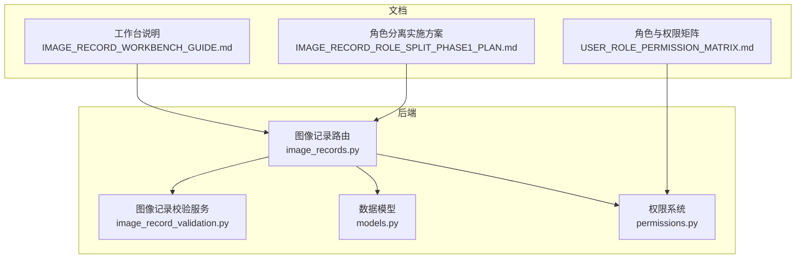
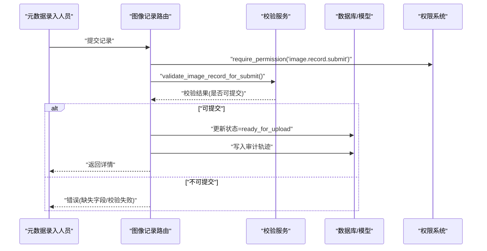
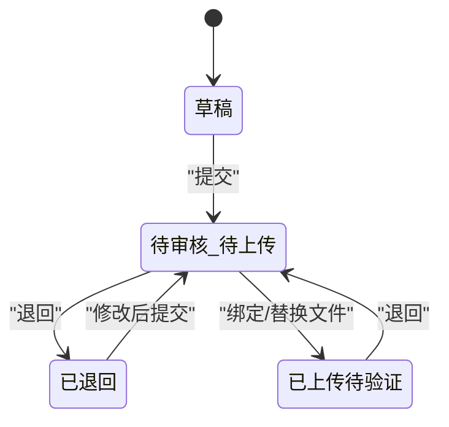
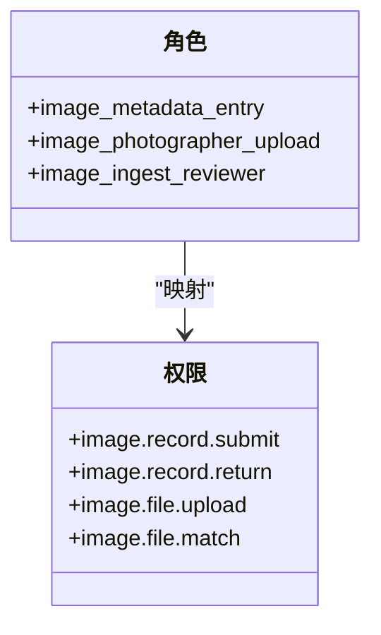
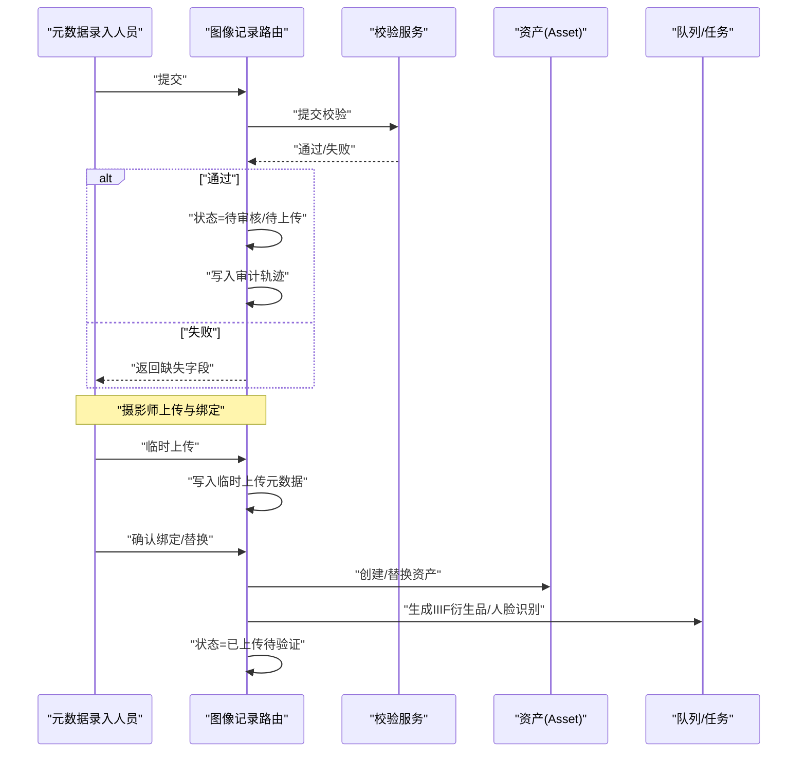
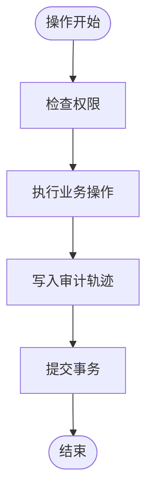
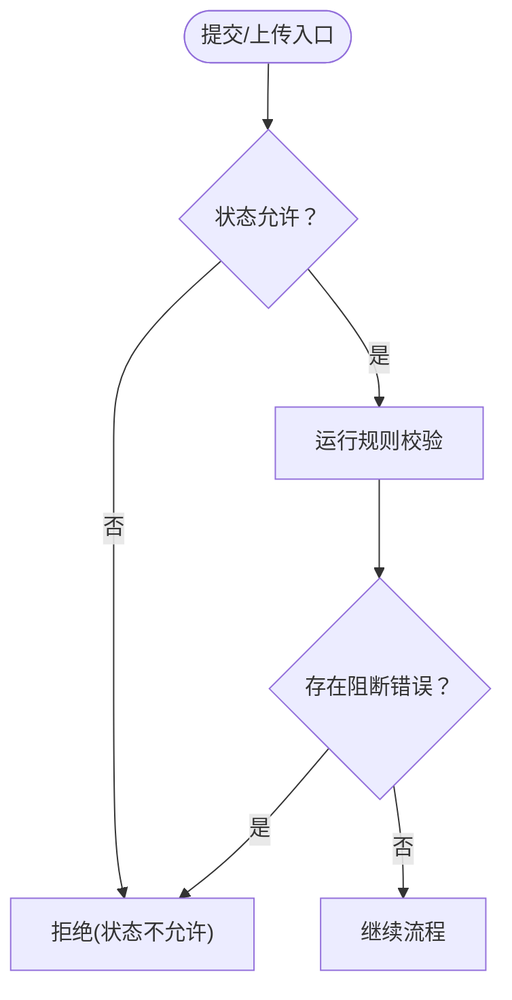
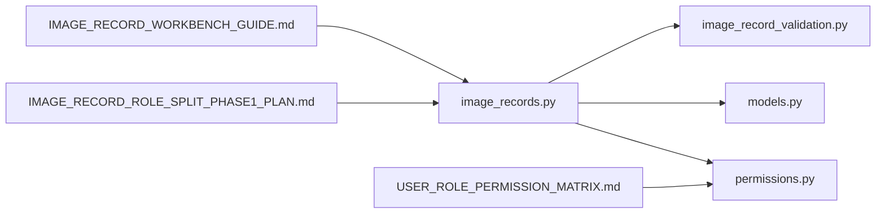

# 审核流程管理

<cite>
**本文引用的文件**
- [backend/app/routers/image_records.py](file://backend/app/routers/image_records.py)
- [backend/app/services/image_record_validation.py](file://backend/app/services/image_record_validation.py)
- [backend/app/models.py](file://backend/app/models.py)
- [backend/app/permissions.py](file://backend/app/permissions.py)
- [docs/03-产品与流程/IMAGE_RECORD_WORKBENCH_GUIDE.md](file://docs/03-产品与流程/IMAGE_RECORD_WORKBENCH_GUIDE.md)
- [docs/03-产品与流程/USER_ROLE_PERMISSION_MATRIX.md](file://docs/03-产品与流程/USER_ROLE_PERMISSION_MATRIX.md)
- [docs/04-实施方案/IMAGE_RECORD_ROLE_SPLIT_PHASE1_PLAN.md](file://docs/04-实施方案/IMAGE_RECORD_ROLE_SPLIT_PHASE1_PLAN.md)
- [backend/tests/test_image_records.py](file://backend/tests/test_image_records.py)
</cite>

## 目录
1. [简介](#简介)
2. [项目结构](#项目结构)
3. [核心组件](#核心组件)
4. [架构总览](#架构总览)
5. [详细组件分析](#详细组件分析)
6. [依赖分析](#依赖分析)
7. [性能考虑](#性能考虑)
8. [故障排查指南](#故障排查指南)
9. [结论](#结论)
10. [附录](#附录)

## 简介
本文件面向MDAMS原型项目的“图像记录审核流程管理”，聚焦于图像记录在工作台内的状态流转、权限控制、操作流程、历史追踪与策略配置现状，并结合现有实现给出可视化流程与时序图，帮助研发与运营人员快速理解与落地。

## 项目结构
- 审核流程相关的核心后端模块集中在图像记录路由与服务层：
  - 路由层：负责HTTP接口、权限校验、状态转换与审计日志写入
  - 服务层：负责提交校验、上传绑定校验、重复检测与规则判定
  - 数据模型：承载ImageRecord、Asset、User、Role等实体及状态字段
  - 权限系统：集中定义角色到权限映射，接口层通过装饰器强制校验
- 文档侧提供了角色与工作台边界、权限矩阵以及阶段化实施方案，支撑审核流程的产品化落地

**图表来源**
- [backend/app/routers/image_records.py:1-200](file://backend/app/routers/image_records.py#L1-L200)
- [backend/app/services/image_record_validation.py:1-120](file://backend/app/services/image_record_validation.py#L1-L120)
- [backend/app/models.py:144-174](file://backend/app/models.py#L144-L174)
- [backend/app/permissions.py:17-94](file://backend/app/permissions.py#L17-L94)
- [docs/03-产品与流程/IMAGE_RECORD_WORKBENCH_GUIDE.md:1-115](file://docs/03-产品与流程/IMAGE_RECORD_WORKBENCH_GUIDE.md#L1-L115)
- [docs/03-产品与流程/USER_ROLE_PERMISSION_MATRIX.md:1-194](file://docs/03-产品与流程/USER_ROLE_PERMISSION_MATRIX.md#L1-L194)
- [docs/04-实施方案/IMAGE_RECORD_ROLE_SPLIT_PHASE1_PLAN.md:1-255](file://docs/04-实施方案/IMAGE_RECORD_ROLE_SPLIT_PHASE1_PLAN.md#L1-L255)

**章节来源**
- [backend/app/routers/image_records.py:1-200](file://backend/app/routers/image_records.py#L1-L200)
- [backend/app/services/image_record_validation.py:1-120](file://backend/app/services/image_record_validation.py#L1-L120)
- [backend/app/models.py:144-174](file://backend/app/models.py#L144-L174)
- [backend/app/permissions.py:17-94](file://backend/app/permissions.py#L17-L94)
- [docs/03-产品与流程/IMAGE_RECORD_WORKBENCH_GUIDE.md:1-115](file://docs/03-产品与流程/IMAGE_RECORD_WORKBENCH_GUIDE.md#L1-L115)
- [docs/03-产品与流程/USER_ROLE_PERMISSION_MATRIX.md:1-194](file://docs/03-产品与流程/USER_ROLE_PERMISSION_MATRIX.md#L1-L194)
- [docs/04-实施方案/IMAGE_RECORD_ROLE_SPLIT_PHASE1_PLAN.md:1-255](file://docs/04-实施方案/IMAGE_RECORD_ROLE_SPLIT_PHASE1_PLAN.md#L1-L255)

## 核心组件
- 状态常量与状态机
  - 草稿：draft
  - 待审核/待上传：ready_for_upload
  - 已退回：returned
  - 已上传待验证：uploaded_pending_validation
  - 草稿/进行中/完成：draft、in_progress、completed（用于采集表单）
- 审核关键接口
  - 提交：POST /image-records/{id}/submit
  - 退回：POST /image-records/{id}/return
  - 临时上传：POST /image-records/{id}/upload-temp
  - 确认绑定：POST /image-records/{id}/confirm-bind
  - 确认替换：POST /image-records/{id}/confirm-replace
- 审核权限
  - 提交：image.record.submit
  - 退回：image.record.return
  - 上传：image.file.upload
  - 匹配：image.file.match
- 审核历史
  - 通过在记录的元数据层写入审计轨迹，包含操作、操作人、时间戳与备注

**章节来源**
- [backend/app/routers/image_records.py:54-62](file://backend/app/routers/image_records.py#L54-L62)
- [backend/app/routers/image_records.py:1393-1461](file://backend/app/routers/image_records.py#L1393-L1461)
- [backend/app/routers/image_records.py:1464-1608](file://backend/app/routers/image_records.py#L1464-L1608)
- [backend/app/permissions.py:22-32](file://backend/app/permissions.py#L22-L32)
- [backend/app/routers/image_records.py:154-178](file://backend/app/routers/image_records.py#L154-L178)

## 架构总览
图像记录审核流程围绕“元数据录入人员—摄影师—审核人员”的角色分工展开，状态机在路由层驱动，校验规则在服务层执行，权限在接口层强制，审计日志写入记录元数据层。

**图表来源**
- [backend/app/routers/image_records.py:1393-1430](file://backend/app/routers/image_records.py#L1393-L1430)
- [backend/app/services/image_record_validation.py:163-370](file://backend/app/services/image_record_validation.py#L163-L370)
- [backend/app/permissions.py:214-236](file://backend/app/permissions.py#L214-L236)

**章节来源**
- [backend/app/routers/image_records.py:1393-1430](file://backend/app/routers/image_records.py#L1393-L1430)
- [backend/app/services/image_record_validation.py:163-370](file://backend/app/services/image_record_validation.py#L163-L370)
- [backend/app/permissions.py:214-236](file://backend/app/permissions.py#L214-L236)

## 详细组件分析

### 状态管理与状态机
- 状态定义与转换
  - 草稿(draft) → 待审核/待上传(ready_for_upload)：提交成功
  - 待审核/待上传(ready_for_upload) → 已退回(returned)：退回修改
  - 已退回(returned) → 待审核/待上传(ready_for_upload)：修改后重新提交
  - 待上传(ready_for_upload) → 已上传待验证(uploaded_pending_validation)：绑定文件后进入
  - 已上传待验证(uploaded_pending_validation) → 待审核/待上传(ready_for_upload)：退回修改
- 状态机约束
  - 仅当记录处于草稿或已退回时允许提交
  - 仅当记录处于待审核/待上传时允许退回
  - 仅当记录处于待审核/待上传或已上传待验证时允许临时上传
  - 绑定/替换文件后进入已上传待验证状态

**图表来源**
- [backend/app/routers/image_records.py:54-62](file://backend/app/routers/image_records.py#L54-L62)
- [backend/app/routers/image_records.py:1413-1461](file://backend/app/routers/image_records.py#L1413-L1461)
- [backend/app/routers/image_records.py:1471-1549](file://backend/app/routers/image_records.py#L1471-L1549)
- [backend/app/routers/image_records.py:1558-1607](file://backend/app/routers/image_records.py#L1558-L1607)

**章节来源**
- [backend/app/routers/image_records.py:54-62](file://backend/app/routers/image_records.py#L54-L62)
- [backend/app/routers/image_records.py:1413-1461](file://backend/app/routers/image_records.py#L1413-L1461)
- [backend/app/routers/image_records.py:1471-1607](file://backend/app/routers/image_records.py#L1471-L1607)

### 权限控制与角色矩阵
- 角色与权限
  - 元数据录入人员(image_metadata_entry)：创建、查看、编辑、提交、退回、列表
  - 摄影上传人员(image_photographer_upload)：查看、查看待上传、上传、匹配
  - 审核人员(image_ingest_reviewer)：查看、审核入库准备
- 接口权限
  - 提交：image.record.submit
  - 退回：image.record.return
  - 上传：image.file.upload
  - 匹配：image.file.match
- 可见范围
  - open：具备查看权限即可
  - owner_only：系统管理员或在责任范围内

**图表来源**
- [docs/03-产品与流程/USER_ROLE_PERMISSION_MATRIX.md:16-96](file://docs/03-产品与流程/USER_ROLE_PERMISSION_MATRIX.md#L16-L96)
- [backend/app/permissions.py:17-94](file://backend/app/permissions.py#L17-L94)

**章节来源**
- [docs/03-产品与流程/USER_ROLE_PERMISSION_MATRIX.md:16-96](file://docs/03-产品与流程/USER_ROLE_PERMISSION_MATRIX.md#L16-L96)
- [backend/app/permissions.py:17-94](file://backend/app/permissions.py#L17-L94)

### 审核操作流程
- 提交审核
  - 元数据录入人员在满足最低必填字段后提交
  - 路由层调用校验服务，若通过则状态置为待审核/待上传，并写入审计轨迹
- 退回修改
  - 审核人员或管理员退回，状态置为已退回，并记录退回原因
- 上传与绑定
  - 摄影师临时上传文件，系统进行基础校验
  - 确认绑定/替换后进入已上传待验证状态，触发衍生品生成与人脸识别等异步任务
- 发布
  - 已上传待验证状态在后续流程中可能再次退回或进入下一阶段（如审核通过）

**图表来源**
- [backend/app/routers/image_records.py:1393-1430](file://backend/app/routers/image_records.py#L1393-L1430)
- [backend/app/routers/image_records.py:1464-1608](file://backend/app/routers/image_records.py#L1464-L1608)
- [backend/app/services/image_record_validation.py:372-563](file://backend/app/services/image_record_validation.py#L372-L563)

**章节来源**
- [backend/app/routers/image_records.py:1393-1430](file://backend/app/routers/image_records.py#L1393-L1430)
- [backend/app/routers/image_records.py:1464-1608](file://backend/app/routers/image_records.py#L1464-L1608)
- [backend/app/services/image_record_validation.py:372-563](file://backend/app/services/image_record_validation.py#L372-L563)

### 审核历史追踪
- 审计轨迹写入位置
  - 记录元数据层的raw_metadata.audit_trail数组
  - 每条记录包含：操作类型、操作人、用户ID、时间戳、备注
- 关键操作审计
  - draft_created/draft_updated/submitted/returned/temp_upload_created/asset_bound/asset_replaced

**图表来源**
- [backend/app/routers/image_records.py:154-178](file://backend/app/routers/image_records.py#L154-L178)
- [backend/app/routers/image_records.py:1386-1427](file://backend/app/routers/image_records.py#L1386-L1427)
- [backend/app/routers/image_records.py:1457-1458](file://backend/app/routers/image_records.py#L1457-L1458)
- [backend/app/routers/image_records.py:1489-1490](file://backend/app/routers/image_records.py#L1489-L1490)
- [backend/app/routers/image_records.py:1541-1542](file://backend/app/routers/image_records.py#L1541-L1542)
- [backend/app/routers/image_records.py:1599-1600](file://backend/app/routers/image_records.py#L1599-L1600)

**章节来源**
- [backend/app/routers/image_records.py:154-178](file://backend/app/routers/image_records.py#L154-L178)
- [backend/app/routers/image_records.py:1386-1427](file://backend/app/routers/image_records.py#L1386-L1427)
- [backend/app/routers/image_records.py:1457-1458](file://backend/app/routers/image_records.py#L1457-L1458)
- [backend/app/routers/image_records.py:1489-1490](file://backend/app/routers/image_records.py#L1489-L1490)
- [backend/app/routers/image_records.py:1541-1542](file://backend/app/routers/image_records.py#L1541-L1542)
- [backend/app/routers/image_records.py:1599-1600](file://backend/app/routers/image_records.py#L1599-L1600)

### 审核策略配置与规则
- 提交策略
  - 仅当状态为草稿或已退回时允许提交
  - 必填字段校验：记录编号、标题、可见范围、profile、项目名称、图片类别、摄影师、部分profile特定字段
- 上传绑定策略
  - 仅当状态为待审核/待上传或已上传待验证时允许临时上传
  - 文件类型、尺寸、哈希、命名规范、重复检测等规则
- 替换策略
  - 已绑定资产可替换，禁止相同文件重复绑定，替换需写入替换历史

**图表来源**
- [backend/app/services/image_record_validation.py:163-370](file://backend/app/services/image_record_validation.py#L163-L370)
- [backend/app/services/image_record_validation.py:372-563](file://backend/app/services/image_record_validation.py#L372-L563)
- [backend/app/routers/image_records.py:1471-1476](file://backend/app/routers/image_records.py#L1471-L1476)

**章节来源**
- [backend/app/services/image_record_validation.py:163-370](file://backend/app/services/image_record_validation.py#L163-L370)
- [backend/app/services/image_record_validation.py:372-563](file://backend/app/services/image_record_validation.py#L372-L563)
- [backend/app/routers/image_records.py:1471-1476](file://backend/app/routers/image_records.py#L1471-L1476)

### 监控与统计（基于现有实现）
- 现状
  - 记录元数据层包含raw_metadata.audit_trail，可用于统计操作次数、操作人分布、退回率等
  - 上传绑定后进入已上传待验证状态，可作为上传完成率统计的依据
- 建议
  - 在审计轨迹中增加更多上下文字段（如IP、UA、耗时），便于审计与问题定位
  - 基于状态字段与时间戳构建趋势图与漏斗图（草稿→待上传→已上传待验证→完成）

**章节来源**
- [backend/app/routers/image_records.py:154-178](file://backend/app/routers/image_records.py#L154-L178)
- [backend/app/routers/image_records.py:1537-1549](file://backend/app/routers/image_records.py#L1537-L1549)

## 依赖分析
- 路由层依赖
  - 权限系统：require_permission、require_any_permission
  - 校验服务：提交校验、上传绑定校验
  - 数据模型：ImageRecord、Asset、User
- 服务层依赖
  - 元数据层工具：构建分层元数据、提取固定哈希
  - 角色与profile定义：必填字段集合
- 文档依赖
  - 角色与权限矩阵、工作台边界、阶段化实施方案

**图表来源**
- [backend/app/routers/image_records.py:1-60](file://backend/app/routers/image_records.py#L1-L60)
- [backend/app/services/image_record_validation.py:1-25](file://backend/app/services/image_record_validation.py#L1-L25)
- [backend/app/models.py:144-174](file://backend/app/models.py#L144-L174)
- [backend/app/permissions.py:17-94](file://backend/app/permissions.py#L17-L94)
- [docs/03-产品与流程/IMAGE_RECORD_WORKBENCH_GUIDE.md:1-115](file://docs/03-产品与流程/IMAGE_RECORD_WORKBENCH_GUIDE.md#L1-L115)
- [docs/03-产品与流程/USER_ROLE_PERMISSION_MATRIX.md:1-194](file://docs/03-产品与流程/USER_ROLE_PERMISSION_MATRIX.md#L1-L194)
- [docs/04-实施方案/IMAGE_RECORD_ROLE_SPLIT_PHASE1_PLAN.md:1-255](file://docs/04-实施方案/IMAGE_RECORD_ROLE_SPLIT_PHASE1_PLAN.md#L1-L255)

**章节来源**
- [backend/app/routers/image_records.py:1-60](file://backend/app/routers/image_records.py#L1-L60)
- [backend/app/services/image_record_validation.py:1-25](file://backend/app/services/image_record_validation.py#L1-L25)
- [backend/app/models.py:144-174](file://backend/app/models.py#L144-L174)
- [backend/app/permissions.py:17-94](file://backend/app/permissions.py#L17-L94)
- [docs/03-产品与流程/IMAGE_RECORD_WORKBENCH_GUIDE.md:1-115](file://docs/03-产品与流程/IMAGE_RECORD_WORKBENCH_GUIDE.md#L1-L115)
- [docs/03-产品与流程/USER_ROLE_PERMISSION_MATRIX.md:1-194](file://docs/03-产品与流程/USER_ROLE_PERMISSION_MATRIX.md#L1-L194)
- [docs/04-实施方案/IMAGE_RECORD_ROLE_SPLIT_PHASE1_PLAN.md:1-255](file://docs/04-实施方案/IMAGE_RECORD_ROLE_SPLIT_PHASE1_PLAN.md#L1-L255)

## 性能考虑
- 上传绑定阶段涉及文件校验与衍生品生成，建议：
  - 异步任务队列处理衍生品生成与人脸识别，避免阻塞请求
  - 对大文件上传进行限速与进度反馈
  - 重复检测使用哈希索引，确保查询效率
- 审计轨迹写入为轻量JSON数组追加，建议：
  - 控制审计条目数量，定期归档或清理
  - 分页查询与索引优化，避免大文档读写开销

[本节为通用指导，无需具体文件来源]

## 故障排查指南
- 提交被拒
  - 检查记录状态是否允许提交
  - 查看缺失字段与校验报告
  - 参考测试用例定位必填字段
- 退回后无法再次提交
  - 确认退回后状态已更新为已退回
  - 修改后重新提交，确保满足最低必填字段
- 上传绑定失败
  - 检查文件类型、尺寸、哈希与命名规范
  - 确认未重复绑定相同文件
- 权限不足
  - 核对当前用户角色与所需权限
  - 确认接口权限装饰器已正确应用

**章节来源**
- [backend/tests/test_image_records.py:89-128](file://backend/tests/test_image_records.py#L89-L128)
- [backend/app/routers/image_records.py:1401-1411](file://backend/app/routers/image_records.py#L1401-L1411)
- [backend/app/routers/image_records.py:1440-1442](file://backend/app/routers/image_records.py#L1440-L1442)
- [backend/app/services/image_record_validation.py:372-563](file://backend/app/services/image_record_validation.py#L372-L563)
- [backend/app/permissions.py:214-236](file://backend/app/permissions.py#L214-L236)

## 结论
MDAMS原型的图像记录审核流程以“角色分离+状态机+权限控制+审计追踪”为核心，实现了从元数据录入到上传绑定的清晰分层。现有实现提供了可验证的工作流骨架，建议在后续阶段补充更细粒度的审核角色、时限与意见管理、批量操作与高级统计能力，以满足生产级需求。

[本节为总结性内容，无需具体文件来源]

## 附录

### 审核流程权限矩阵（示例）
- 元数据录入人员
  - 权限：image.record.create、image.record.view、image.record.edit、image.record.submit、image.record.return、image.record.list
  - 职责：创建与维护图像记录、提交、退回后修改
- 摄影上传人员
  - 权限：image.record.view、image.record.view_ready_for_upload、image.file.upload、image.file.match
  - 职责：查看待上传记录、上传文件、绑定/替换
- 审核人员
  - 权限：image.view、image.ingest_review
  - 职责：审核入库准备情况

**章节来源**
- [docs/03-产品与流程/USER_ROLE_PERMISSION_MATRIX.md:80-96](file://docs/03-产品与流程/USER_ROLE_PERMISSION_MATRIX.md#L80-L96)
- [docs/03-产品与流程/IMAGE_RECORD_WORKBENCH_GUIDE.md:19-55](file://docs/03-产品与流程/IMAGE_RECORD_WORKBENCH_GUIDE.md#L19-L55)