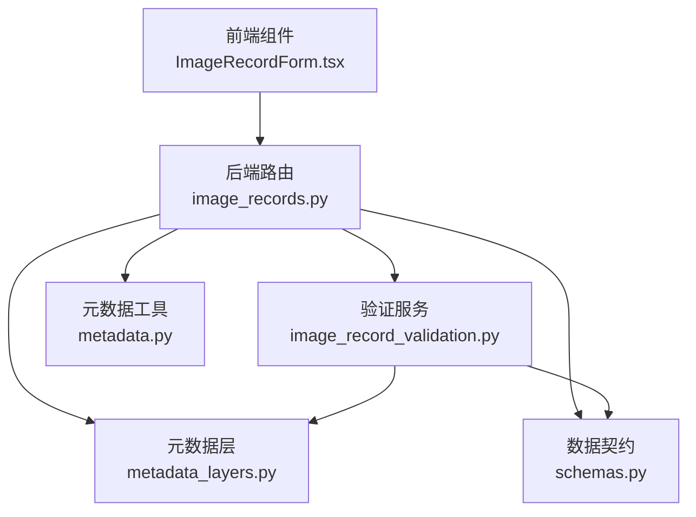
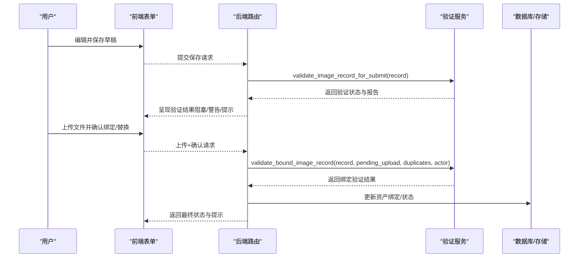
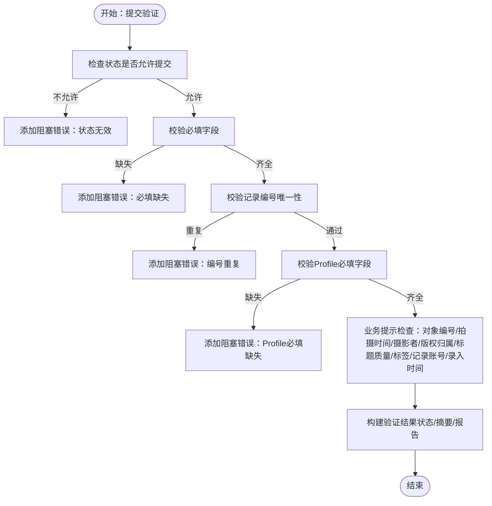
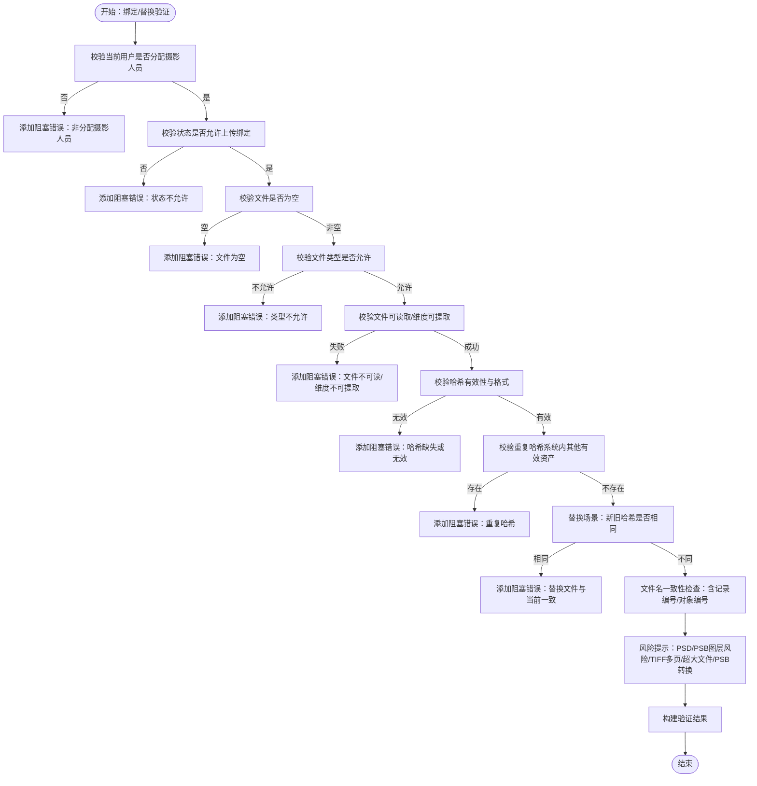
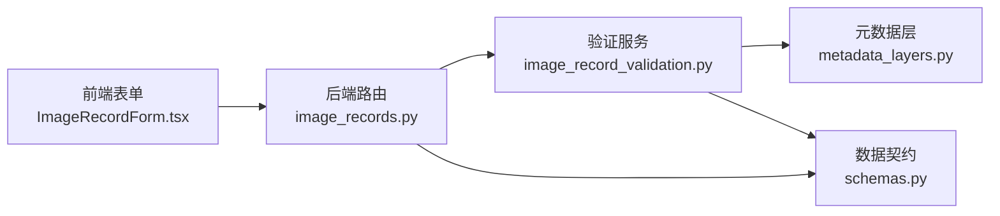

# 数据验证规则

<cite>
**本文引用的文件列表**
- [image_record_validation.py](file://backend/app/services/image_record_validation.py)
- [image_records.py](file://backend/app/routers/image_records.py)
- [schemas.py](file://backend/app/schemas.py)
- [metadata_layers.py](file://backend/app/services/metadata_layers.py)
- [metadata.py](file://backend/app/utils/metadata.py)
- [ImageRecordForm.tsx](file://frontend/src/components/ImageRecordForm.tsx)
- [IMAGE_RECORD_VALIDATION_PHASE1_PLAN.md](file://docs/04-实施方案/IMAGE_RECORD_VALIDATION_PHASE1_PLAN.md)
- [OBJECT_PROFILE_RULES.md](file://docs/03-产品与流程/OBJECT_PROFILE_RULES.md)
- [test_image_records.py](file://backend/tests/test_image_records.py)
</cite>

## 目录
1. [简介](#简介)
2. [项目结构与角色分工](#项目结构与角色分工)
3. [核心组件与职责](#核心组件与职责)
4. [架构总览](#架构总览)
5. [详细组件分析](#详细组件分析)
6. [依赖关系分析](#依赖关系分析)
7. [性能与可靠性考量](#性能与可靠性考量)
8. [故障排查指南](#故障排查指南)
9. [结论](#结论)
10. [附录：验证规则表与最佳实践](#附录验证规则表与最佳实践)

## 简介
本文件面向MDAMS原型项目的图像记录数据验证规则，系统化阐述验证规则的设计原理、实现机制与使用方式。重点覆盖：
- 必填字段验证、格式验证、业务规则验证
- 字段层面的验证要求（记录编号、标题、项目名称、拍摄者、可见性范围、对象编号等）
- 前端与后端协同验证、级联验证与状态回退
- 错误处理与用户反馈（错误消息、错误位置标记、修复建议）
- 扩展机制（自定义验证器、动态规则配置、规则继承）
- 配置示例与最佳实践

## 项目结构与角色分工
- 后端服务层负责验证逻辑与结果聚合，路由层负责触发与呈现。
- 前端负责基础交互与提示，配合后端返回的验证状态进行引导。
- 元数据层与派生策略为验证提供上下文与辅助能力。

图表来源
- [image_records.py:1-120](file://backend/app/routers/image_records.py#L1-L120)
- [image_record_validation.py:1-60](file://backend/app/services/image_record_validation.py#L1-L60)
- [metadata_layers.py:1-60](file://backend/app/services/metadata_layers.py#L1-L60)
- [schemas.py:220-275](file://backend/app/schemas.py#L220-L275)
- [metadata.py:1-79](file://backend/app/utils/metadata.py#L1-L79)
- [ImageRecordForm.tsx:1-120](file://frontend/src/components/ImageRecordForm.tsx#L1-L120)

章节来源
- [image_records.py:1-120](file://backend/app/routers/image_records.py#L1-L120)
- [image_record_validation.py:1-60](file://backend/app/services/image_record_validation.py#L1-L60)
- [metadata_layers.py:1-60](file://backend/app/services/metadata_layers.py#L1-L60)
- [schemas.py:220-275](file://backend/app/schemas.py#L220-L275)
- [metadata.py:1-79](file://backend/app/utils/metadata.py#L1-L79)
- [ImageRecordForm.tsx:1-120](file://frontend/src/components/ImageRecordForm.tsx#L1-L120)

## 核心组件与职责
- 验证服务：集中实现两类验证（提交验证、绑定/替换验证），并输出统一的验证结果模型。
- 路由层：在提交、上传、确认绑定/替换等关键节点调用验证服务，并根据结果更新状态与返回信息。
- 元数据层：提供profile定义、必填字段集合、字段标签、固定校验（如SHA256）等支撑。
- 前端表单：基于profile动态渲染字段，提交时显示验证状态与建议。

章节来源
- [image_record_validation.py:162-370](file://backend/app/services/image_record_validation.py#L162-L370)
- [image_records.py:473-560](file://backend/app/routers/image_records.py#L473-L560)
- [metadata_layers.py:88-191](file://backend/app/services/metadata_layers.py#L88-L191)
- [ImageRecordForm.tsx:22-44](file://frontend/src/components/ImageRecordForm.tsx#L22-L44)

## 架构总览
验证流程分为两个阶段：
- 提交验证：在从草稿/退回转为“待上传”时执行，确保关键字段与profile必填项齐全。
- 绑定/替换验证：在摄影师上传文件并确认绑定/替换时执行，确保文件可读、格式合法、哈希有效、无重复占用等。

图表来源
- [image_records.py:473-560](file://backend/app/routers/image_records.py#L473-L560)
- [image_records.py:996-1039](file://backend/app/routers/image_records.py#L996-L1039)
- [image_record_validation.py:162-370](file://backend/app/services/image_record_validation.py#L162-L370)
- [image_record_validation.py:371-563](file://backend/app/services/image_record_validation.py#L371-L563)

## 详细组件分析

### 提交验证（validate_image_record_for_submit）
- 触发时机：从草稿/退回提交为“待上传”。
- 关键点：
  - 状态检查：仅允许特定状态提交。
  - 必填字段：记录编号、标题、可见范围、profile_key、项目名称、影像类别、分配摄影人员。
  - 唯一性：记录编号唯一性校验。
  - Profile必填字段：依据profile定义的必填字段集合进行校验。
  - 业务提示：对象编号缺失、拍摄时间/摄影者/版权归属缺失、标题过短或占位符、标签/记录账号/录入时间缺失等作为提示或警告。
- 结果模型：统一的验证状态、摘要、报告、阻塞错误数、警告数、是否需要二次确认等。

图表来源
- [image_record_validation.py:162-370](file://backend/app/services/image_record_validation.py#L162-L370)

章节来源
- [image_record_validation.py:162-370](file://backend/app/services/image_record_validation.py#L162-L370)
- [image_records.py:473-478](file://backend/app/routers/image_records.py#L473-L478)
- [IMAGE_RECORD_VALIDATION_PHASE1_PLAN.md:48-96](file://docs/04-实施方案/IMAGE_RECORD_VALIDATION_PHASE1_PLAN.md#L48-L96)

### 绑定/替换验证（validate_bound_image_record）
- 触发时机：摄影师上传文件并确认绑定/替换。
- 关键点：
  - 身份与权限：当前用户必须是分配摄影人员。
  - 状态检查：仅允许处于“待上传”状态的记录进行绑定/替换。
  - 文件与技术参数：文件非空、格式允许、可读取、维度可提取、哈希有效且符合SHA256格式。
  - 去重策略：若系统中已存在相同有效资产且哈希一致，则阻塞；替换时若新旧哈希相同也阻塞。
  - 文件名一致性：文件名不含记录编号或对象编号时给出强警告。
  - 风险提示：PSD/PSB图层风险、多页TIFF风险、异常大文件、PSB预览需后台转换等给出警告或提示。
- 结果模型：统一验证结果，阻塞错误禁用确认按钮，强警告需要二次确认。

图表来源
- [image_record_validation.py:371-563](file://backend/app/services/image_record_validation.py#L371-L563)

章节来源
- [image_record_validation.py:371-563](file://backend/app/services/image_record_validation.py#L371-L563)
- [image_records.py:996-1039](file://backend/app/routers/image_records.py#L996-L1039)
- [IMAGE_RECORD_VALIDATION_PHASE1_PLAN.md:97-141](file://docs/04-实施方案/IMAGE_RECORD_VALIDATION_PHASE1_PLAN.md#L97-L141)

### 验证结果模型与状态
- 统一模型：包含验证状态、摘要、报告、阻塞错误数、警告数、是否需要二次确认等。
- 状态枚举：未运行、通过、警告、失败。
- 等级：阻塞错误、强警告（需二次确认）、信息提示。
- 前端呈现：阻塞问题置顶，字段锚定，强警告需要二次确认，提示信息用于引导完善。

章节来源
- [schemas.py:220-248](file://backend/app/schemas.py#L220-L248)
- [image_record_validation.py:98-127](file://backend/app/services/image_record_validation.py#L98-L127)
- [IMAGE_RECORD_VALIDATION_PHASE1_PLAN.md:163-186](file://docs/04-实施方案/IMAGE_RECORD_VALIDATION_PHASE1_PLAN.md#L163-L186)

### 字段与规则详解
- 记录编号（record_no）
  - 必填且唯一；提交验证阻塞；绑定/替换验证中若文件名不含记录编号给出强警告。
- 标题（title）
  - 必填；若过短或疑似占位符给出强警告。
- 可见性范围（visibility_scope）
  - 必填且有效（open/owner_only）；无效则阻塞。
- Profile键（profile_key）
  - 必填且有效；无效则阻塞；同时校验该profile的必填字段。
- 项目名称（project_name）
  - 提交时必填；缺失阻塞。
- 影像类别（image_category）
  - 提交时必填；缺失阻塞。
- 分配摄影人员（assigned_photographer_user_id）
  - 提交时必填；缺失阻塞。
- 对象编号（object_number）
  - 提交时非必填但强烈建议；缺失给出强警告；若为可移动文物且未临时对象号但对象名称缺失，给出强警告。
- 拍摄时间（capture_time）、摄影者（photographer）、版权归属（copyright_owner）
  - 提交时非必填但建议；缺失给出强警告。
- 标签（tags）、记录账号（record_account）、影像录入时间（image_record_time）
  - 提交时非必填但建议；缺失给出信息提示。

章节来源
- [image_record_validation.py:162-370](file://backend/app/services/image_record_validation.py#L162-L370)
- [metadata_layers.py:88-191](file://backend/app/services/metadata_layers.py#L88-L191)
- [IMAGE_RECORD_VALIDATION_PHASE1_PLAN.md:48-96](file://docs/04-实施方案/IMAGE_RECORD_VALIDATION_PHASE1_PLAN.md#L48-L96)

### 前后端协同与级联验证
- 前端：根据profile动态渲染字段，提交时显示验证状态与建议；绑定/替换前展示文件分析与验证摘要。
- 后端：提交验证与绑定/替换验证分别执行，前者决定能否进入“待上传”，后者决定能否完成绑定/替换。
- 级联与回退：替换后使先前成功的验证失效并回退到“上传待验证”。

章节来源
- [ImageRecordForm.tsx:22-44](file://frontend/src/components/ImageRecordForm.tsx#L22-L44)
- [image_records.py:473-560](file://backend/app/routers/image_records.py#L473-L560)
- [image_records.py:996-1039](file://backend/app/routers/image_records.py#L996-L1039)
- [IMAGE_RECORD_VALIDATION_PHASE1_PLAN.md:40-47](file://docs/04-实施方案/IMAGE_RECORD_VALIDATION_PHASE1_PLAN.md#L40-L47)

## 依赖关系分析
- 验证服务依赖元数据层提供的profile定义与必填字段集合。
- 路由层在关键节点调用验证服务，并将结果写入记录的raw_metadata以供后续展示。
- 前端依赖后端返回的验证状态与字段标签，动态渲染表单与提示。

图表来源
- [image_record_validation.py:1-60](file://backend/app/services/image_record_validation.py#L1-L60)
- [metadata_layers.py:1-60](file://backend/app/services/metadata_layers.py#L1-L60)
- [schemas.py:220-275](file://backend/app/schemas.py#L220-L275)
- [image_records.py:1-120](file://backend/app/routers/image_records.py#L1-L120)
- [ImageRecordForm.tsx:1-120](file://frontend/src/components/ImageRecordForm.tsx#L1-L120)

章节来源
- [image_record_validation.py:1-60](file://backend/app/services/image_record_validation.py#L1-L60)
- [metadata_layers.py:1-60](file://backend/app/services/metadata_layers.py#L1-L60)
- [schemas.py:220-275](file://backend/app/schemas.py#L220-L275)
- [image_records.py:1-120](file://backend/app/routers/image_records.py#L1-L120)
- [ImageRecordForm.tsx:1-120](file://frontend/src/components/ImageRecordForm.tsx#L1-L120)

## 性能与可靠性考量
- 文件读取与哈希计算：避免对超大文件进行不必要的重复处理；对PSB等特殊格式给出预处理提示。
- 去重查询：基于哈希快速定位系统内已存在的有效资产，减少冲突。
- 元数据提取：通过外部工具提取技术元数据，失败时降级为空集，保证流程可用性。

章节来源
- [image_record_validation.py:421-449](file://backend/app/services/image_record_validation.py#L421-L449)
- [metadata.py:19-79](file://backend/app/utils/metadata.py#L19-L79)

## 故障排查指南
- 提交被拒
  - 症状：状态码400，返回缺失字段列表。
  - 排查：确认记录编号唯一、标题、可见范围、profile_key、项目名称、影像类别、分配摄影人员均填写；检查profile必填字段是否齐全。
- 绑定/替换失败
  - 症状：阻塞错误，无法确认。
  - 排查：确认当前用户为分配摄影人员；确认记录状态允许上传；确认文件类型允许、可读、维度可提取、哈希有效；检查是否存在重复哈希或替换文件与当前一致。
- 文件名不匹配
  - 症状：强警告，仍可确认。
  - 排查：确保文件名包含记录编号与对象编号，遵循推荐命名规范。
- 重复哈希
  - 症状：阻塞错误。
  - 排查：确认系统内无其他有效资产使用相同哈希；替换时避免上传与当前一致的内容。

章节来源
- [test_image_records.py:113-160](file://backend/tests/test_image_records.py#L113-L160)
- [test_image_records.py:736-800](file://backend/tests/test_image_records.py#L736-L800)
- [image_record_validation.py:471-480](file://backend/app/services/image_record_validation.py#L471-L480)
- [IMAGE_RECORD_VALIDATION_PHASE1_PLAN.md:142-162](file://docs/04-实施方案/IMAGE_RECORD_VALIDATION_PHASE1_PLAN.md#L142-L162)

## 结论
本验证体系以“两阶段、三层级”的设计实现了从元数据录入到文件绑定/替换的全链路质量控制。通过前后端协同与统一的结果模型，既保障了数据完整性，又提供了清晰的用户反馈与修复建议。后续可在现有基础上引入更丰富的业务规则与动态配置能力，持续提升系统的可扩展性与可维护性。

## 附录：验证规则表与最佳实践

### 字段验证规则表
- 记录编号（record_no）
  - 类别：必填
  - 规则：非空且唯一；提交验证阻塞；文件名不含记录编号强警告
  - 状态：阻塞/强警告
- 标题（title）
  - 类别：必填
  - 规则：非空；过短或疑似占位符强警告
  - 状态：阻塞/强警告
- 可见性范围（visibility_scope）
  - 类别：必填
  - 规则：open或owner_only；无效阻塞
  - 状态：阻塞
- Profile键（profile_key）
  - 类别：必填
  - 规则：有效profile；无效阻塞；同时校验该profile必填字段
  - 状态：阻塞
- 项目名称（project_name）
  - 类别：必填
  - 规则：提交时必填；缺失阻塞
  - 状态：阻塞
- 影像类别（image_category）
  - 类别：必填
  - 规则：提交时必填；缺失阻塞
  - 状态：阻塞
- 分配摄影人员（assigned_photographer_user_id）
  - 类别：必填
  - 规则：提交时必填；缺失阻塞
  - 状态：阻塞
- 对象编号（object_number）
  - 类别：建议
  - 规则：缺失强警告；可移动文物且非临时对象号但对象名称缺失强警告
  - 状态：强警告
- 拍摄时间（capture_time）、摄影者（photographer）、版权归属（copyright_owner）
  - 类别：建议
  - 规则：缺失强警告
  - 状态：强警告
- 标签（tags）、记录账号（record_account）、影像录入时间（image_record_time）
  - 类别：建议
  - 规则：缺失信息提示
  - 状态：信息提示

章节来源
- [image_record_validation.py:162-370](file://backend/app/services/image_record_validation.py#L162-L370)
- [metadata_layers.py:88-191](file://backend/app/services/metadata_layers.py#L88-L191)
- [IMAGE_RECORD_VALIDATION_PHASE1_PLAN.md:48-96](file://docs/04-实施方案/IMAGE_RECORD_VALIDATION_PHASE1_PLAN.md#L48-L96)

### 错误处理示例
- 提交被拒（缺失必填字段）
  - 场景：缺少项目名称、影像类别
  - 结果：HTTP 400，返回缺失字段列表
- 绑定失败（重复哈希）
  - 场景：系统内已有相同有效资产使用该哈希
  - 结果：阻塞错误，无法确认
- 文件名不匹配（强警告）
  - 场景：文件名不含记录编号或对象编号
  - 结果：强警告，仍可确认

章节来源
- [test_image_records.py:113-160](file://backend/tests/test_image_records.py#L113-L160)
- [test_image_records.py:736-800](file://backend/tests/test_image_records.py#L736-L800)

### 扩展机制与最佳实践
- 自定义验证器
  - 在验证服务中新增规则函数，使用统一规则构造器生成规则条目，纳入结果汇总。
- 动态规则配置
  - 通过元数据层的profile定义与必填字段集合实现动态生效；未来可考虑将规则配置化存储于系统配置。
- 规则继承
  - 不同profile共享通用规则，针对特定字段增加额外约束；通过profile定义的必填字段集合实现继承与覆盖。
- 最佳实践
  - 前端尽早提示与锚定字段，后端严格校验并返回统一结果模型。
  - 替换流程中先回退状态再重新验证，确保一致性。
  - 对风险文件（PSD/PSB、多页TIFF、超大文件）给出明确提示与建议。

章节来源
- [image_record_validation.py:81-96](file://backend/app/services/image_record_validation.py#L81-L96)
- [metadata_layers.py:266-272](file://backend/app/services/metadata_layers.py#L266-L272)
- [IMAGE_RECORD_VALIDATION_PHASE1_PLAN.md:187-218](file://docs/04-实施方案/IMAGE_RECORD_VALIDATION_PHASE1_PLAN.md#L187-L218)