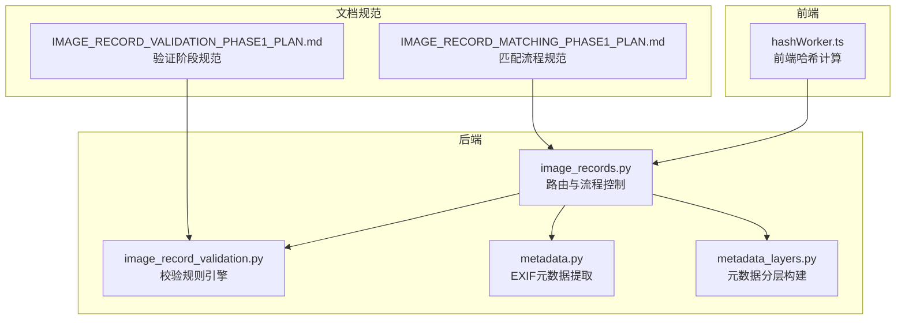
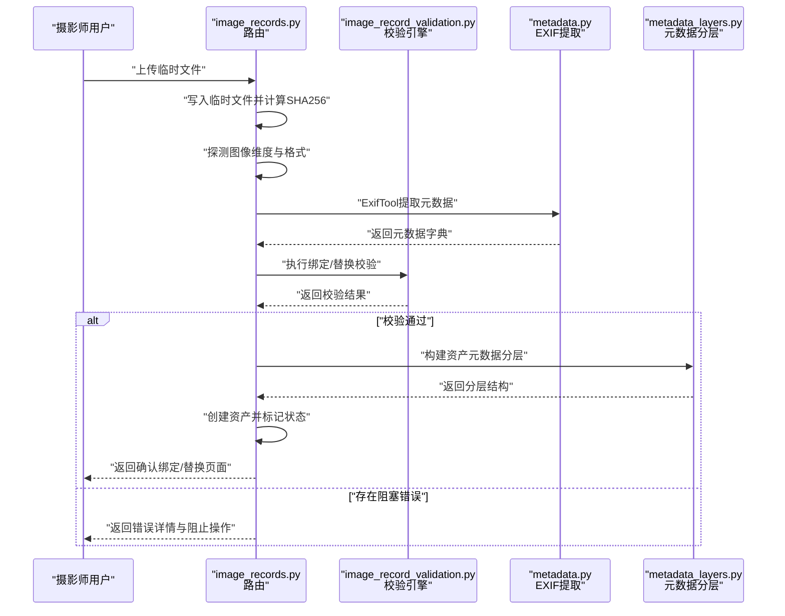
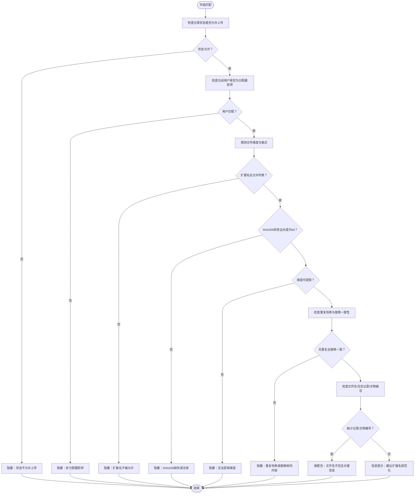
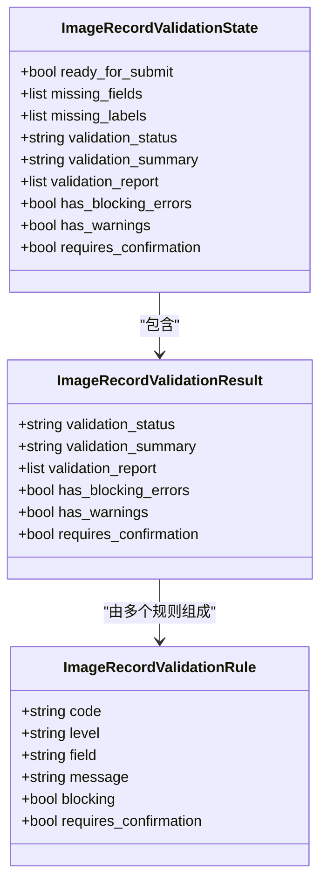
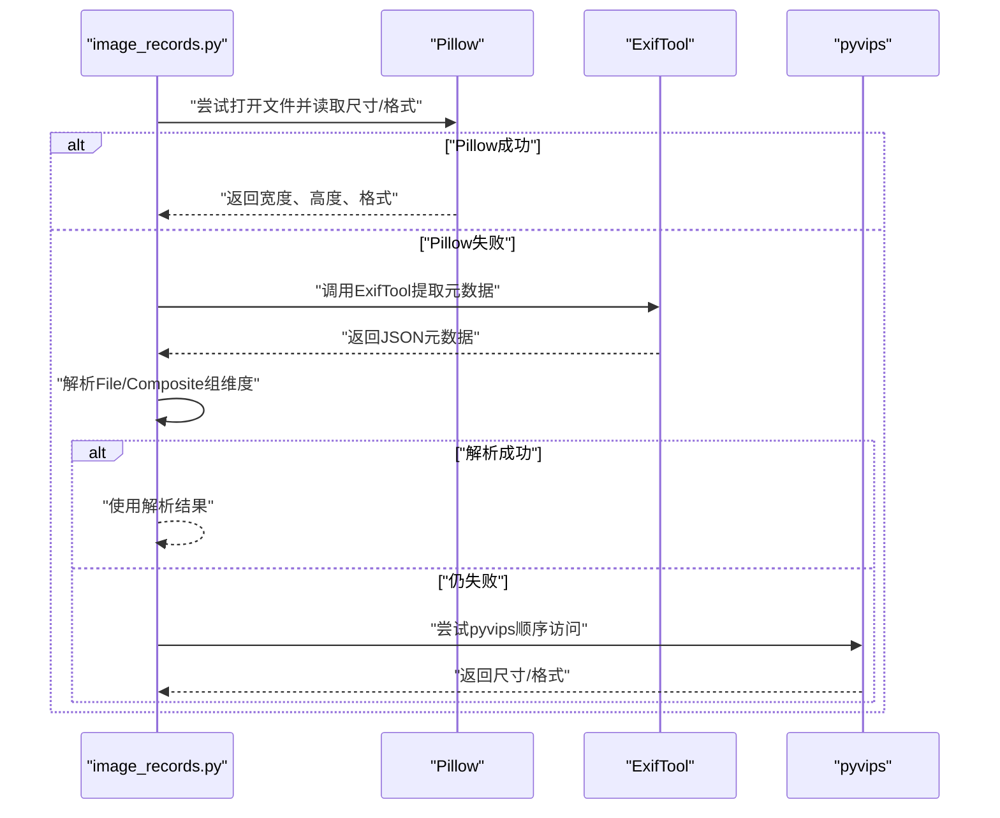
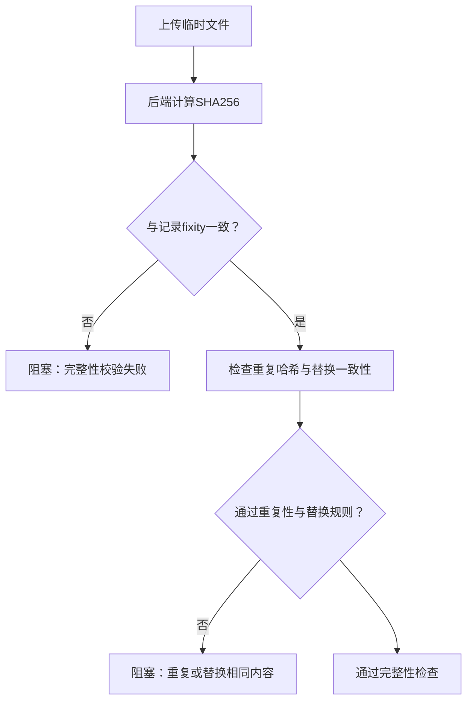
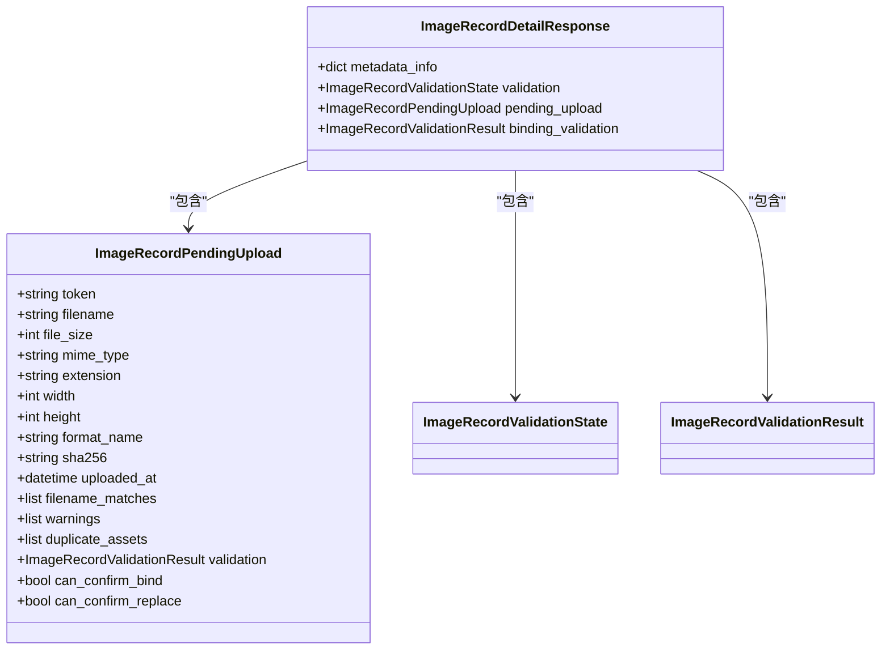
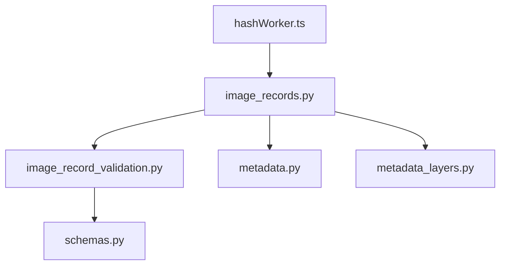

# 文件匹配与校验

<cite>
**本文档引用的文件**
- [image_record_validation.py](file://backend/app/services/image_record_validation.py)
- [metadata.py](file://backend/app/utils/metadata.py)
- [image_records.py](file://backend/app/routers/image_records.py)
- [metadata_layers.py](file://backend/app/services/metadata_layers.py)
- [hashWorker.ts](file://frontend/src/workers/hashWorker.ts)
- [IMAGE_RECORD_MATCHING_PHASE1_PLAN.md](file://docs/04-实施方案/IMAGE_RECORD_MATCHING_PHASE1_PLAN.md)
- [IMAGE_RECORD_VALIDATION_PHASE1_PLAN.md](file://docs/04-实施方案/IMAGE_RECORD_VALIDATION_PHASE1_PLAN.md)
- [schemas.py](file://backend/app/schemas.py)
</cite>

## 目录
1. [简介](#简介)
2. [项目结构](#项目结构)
3. [核心组件](#核心组件)
4. [架构概览](#架构概览)
5. [详细组件分析](#详细组件分析)
6. [依赖分析](#依赖分析)
7. [性能考虑](#性能考虑)
8. [故障排除指南](#故障排除指南)
9. [结论](#结论)
10. [附录](#附录)

## 简介
本文件针对MDAMS原型项目的图像记录文件匹配与校验机制进行全面技术文档化，重点覆盖以下方面：
- 文件匹配算法：基于文件名规则、扩展名验证、文件大小检查等
- 数据校验规则：必填字段检查、格式验证、业务规则验证等
- 元数据提取与验证：EXIF信息解析、自动元数据填充、手动编辑校验
- 文件完整性检查：SHA256哈希计算、文件修复、损坏检测
- 校验结果处理：错误提示、警告信息、验证状态标记
- 最佳实践与常见问题解决方案
- 具体的校验规则示例与错误处理机制

## 项目结构
MDAMS原型项目采用前后端分离架构，图像记录匹配与校验涉及后端服务、前端工具以及文档规范。关键模块分布如下：
- 后端服务层：负责文件绑定校验、元数据处理、状态管理
- 前端工具层：负责文件哈希计算、元数据提取辅助
- 文档规范层：定义匹配与验证的阶段划分、规则集与验收标准

**图表来源**
- [image_records.py:1464-1599](file://backend/app/routers/image_records.py#L1464-L1599)
- [image_record_validation.py:372-562](file://backend/app/services/image_record_validation.py#L372-L562)
- [metadata.py:19-79](file://backend/app/utils/metadata.py#L19-L79)
- [metadata_layers.py:412-540](file://backend/app/services/metadata_layers.py#L412-L540)
- [hashWorker.ts:1-45](file://frontend/src/workers/hashWorker.ts#L1-L45)

**章节来源**
- [image_records.py:1464-1599](file://backend/app/routers/image_records.py#L1464-L1599)
- [image_record_validation.py:372-562](file://backend/app/services/image_record_validation.py#L372-L562)
- [metadata.py:19-79](file://backend/app/utils/metadata.py#L19-L79)
- [metadata_layers.py:412-540](file://backend/app/services/metadata_layers.py#L412-L540)
- [hashWorker.ts:1-45](file://frontend/src/workers/hashWorker.ts#L1-L45)
- [IMAGE_RECORD_MATCHING_PHASE1_PLAN.md:1-247](file://docs/04-实施方案/IMAGE_RECORD_MATCHING_PHASE1_PLAN.md#L1-L247)
- [IMAGE_RECORD_VALIDATION_PHASE1_PLAN.md:1-278](file://docs/04-实施方案/IMAGE_RECORD_VALIDATION_PHASE1_PLAN.md#L1-L278)

## 核心组件
本节概述与文件匹配、校验直接相关的核心组件及其职责：
- 校验规则引擎：提供提交阶段与绑定/替换阶段的统一校验结果模型
- 匹配流程控制器：负责临时上传、文件分析、确认绑定/替换的状态流转
- 元数据提取器：通过ExifTool提取EXIF信息，支持维度与格式推断
- 元数据分层构建器：将原始元数据与技术元数据整合为分层结构
- 前端哈希计算：在浏览器侧生成SHA256，用于完整性比对与快速校验

关键职责与交互：
- 提交阶段校验：确保记录具备必要字段与配置，避免无效提交
- 绑定/替换阶段校验：确保文件可读、格式合法、哈希有效、无重复占用
- 元数据提取与维度探测：优先使用Pillow，失败时回退至ExifTool与pyvips
- 前后端哈希一致性：前端计算与后端存储一致，保障完整性

**章节来源**
- [image_record_validation.py:163-369](file://backend/app/services/image_record_validation.py#L163-L369)
- [image_records.py:1464-1599](file://backend/app/routers/image_records.py#L1464-L1599)
- [metadata.py:19-79](file://backend/app/utils/metadata.py#L19-L79)
- [metadata_layers.py:412-540](file://backend/app/services/metadata_layers.py#L412-L540)
- [hashWorker.ts:1-45](file://frontend/src/workers/hashWorker.ts#L1-L45)

## 架构概览
下图展示了从文件上传到绑定确认的完整流程，涵盖文件分析、校验、状态变更与衍生品生成。

**图表来源**
- [image_records.py:1464-1599](file://backend/app/routers/image_records.py#L1464-L1599)
- [image_record_validation.py:372-562](file://backend/app/services/image_record_validation.py#L372-L562)
- [metadata.py:19-79](file://backend/app/utils/metadata.py#L19-L79)
- [metadata_layers.py:412-540](file://backend/app/services/metadata_layers.py#L412-L540)

**章节来源**
- [image_records.py:1464-1599](file://backend/app/routers/image_records.py#L1464-L1599)
- [image_record_validation.py:372-562](file://backend/app/services/image_record_validation.py#L372-L562)
- [metadata.py:19-79](file://backend/app/utils/metadata.py#L19-L79)
- [metadata_layers.py:412-540](file://backend/app/services/metadata_layers.py#L412-L540)

## 详细组件分析

### 文件匹配算法
文件匹配算法围绕“先选记录、后上传”的严格顺序，结合文件名、扩展名、文件大小与哈希值进行多维校验，确保唯一绑定与风险提示。

- 文件名匹配规则
  - 必须包含记录编号：若文件名不包含记录编号，产生强警告但允许继续
  - 可选包含文物编号：若记录配置了文物编号且文件名不含该编号，产生强警告
  - 推荐命名约定：不遵循推荐命名约定时给出信息提示
- 扩展名验证
  - 仅允许特定扩展名集合，超出范围则阻塞
- 文件大小检查
  - 大于阈值时发出强警告，提醒处理可能较慢
- 哈希与重复性检查
  - SHA256必须为64位十六进制字符串
  - 若当前记录已绑定且替换文件与现有有效资产哈希相同，则阻塞
  - 若新文件哈希与系统中其他有效资产重复，则阻塞

**图表来源**
- [image_record_validation.py:372-562](file://backend/app/services/image_record_validation.py#L372-L562)
- [image_records.py:1464-1599](file://backend/app/routers/image_records.py#L1464-L1599)

**章节来源**
- [image_record_validation.py:421-562](file://backend/app/services/image_record_validation.py#L421-L562)
- [image_records.py:1464-1599](file://backend/app/routers/image_records.py#L1464-L1599)
- [IMAGE_RECORD_MATCHING_PHASE1_PLAN.md:187-207](file://docs/04-实施方案/IMAGE_RECORD_MATCHING_PHASE1_PLAN.md#L187-L207)

### 数据校验规则
数据校验分为两个阶段：提交阶段与绑定/替换阶段。两阶段均采用统一的结果模型，包含状态、摘要与规则报告。

- 提交阶段（Metadata Entry）
  - 阻塞性错误：记录编号缺失或重复、标题缺失、可见范围无效、配置文件缺失、分配摄影师缺失、状态不允许提交、配置文件必填字段缺失
  - 强警告：文物编号缺失、拍摄时间缺失、摄影师缺失、版权归属缺失、标题过短或占位符
  - 信息提示：标签缺失、记录账号缺失、影像录入时间缺失
- 绑定/替换阶段（Photographer）
  - 阻塞性错误：非分配摄影师、状态不允许上传、文件为空、格式不被允许、文件不可读、维度无法提取、哈希无效、重复哈希、替换内容与当前有效资产相同
  - 强警告：文件名缺少记录/文物编号、TIFF层或多页风险、PSD/PSB层风险、文件异常大、PSB预览需背景转换
  - 信息提示：命名约定不符、建议生成IIIF访问衍生品、建议标准化扩展名

**图表来源**
- [image_record_validation.py:163-369](file://backend/app/services/image_record_validation.py#L163-L369)
- [schemas.py:220-248](file://backend/app/schemas.py#L220-L248)

**章节来源**
- [image_record_validation.py:163-369](file://backend/app/services/image_record_validation.py#L163-L369)
- [IMAGE_RECORD_VALIDATION_PHASE1_PLAN.md:48-141](file://docs/04-实施方案/IMAGE_RECORD_VALIDATION_PHASE1_PLAN.md#L48-L141)
- [schemas.py:220-274](file://backend/app/schemas.py#L220-L274)

### 元数据提取与验证流程
元数据提取采用多源回退策略，优先使用Pillow获取维度与格式，其次使用ExifTool解析EXIF，最后尝试pyvips进行探测。

- 维度与格式探测
  - 首选：Pillow打开文件并读取尺寸与格式
  - 回退：ExifTool提取File/Composite组中的ImageWidth/ImageHeight与ImageSize
  - 再回退：pyvips按顺序访问文件
- EXIF信息解析
  - 使用ExifTool命令行工具，输出JSON并解析
  - 支持结构化XMP与二进制数据过滤
- 自动元数据填充
  - 将探测到的维度、格式、哈希等信息填充到资产元数据分层
  - 生成技术元数据与分层结构，供后续衍生品生成与访问策略选择使用

**图表来源**
- [image_records.py:868-904](file://backend/app/routers/image_records.py#L868-L904)
- [metadata.py:19-79](file://backend/app/utils/metadata.py#L19-L79)

**章节来源**
- [image_records.py:868-904](file://backend/app/routers/image_records.py#L868-L904)
- [metadata.py:19-79](file://backend/app/utils/metadata.py#L19-L79)
- [metadata_layers.py:412-540](file://backend/app/services/metadata_layers.py#L412-L540)

### 文件完整性检查
文件完整性检查以SHA256为核心，贯穿上传、绑定与替换全流程，确保内容未被篡改或损坏。

- 前端哈希计算
  - 使用Web Crypto API计算SHA256，避免大文件内存溢出
  - 仅用于前端展示与快速比对，不替代后端校验
- 后端哈希计算与校验
  - 临时文件写入后立即计算SHA256
  - 与记录元数据中的fixity_sha256保持一致
  - 校验失败或格式不合法时阻塞绑定
- 重复性与替换一致性
  - 若新文件哈希与系统中其他有效资产重复，阻塞绑定
  - 替换文件与当前有效资产哈希相同，阻塞替换

**图表来源**
- [image_records.py:985-1030](file://backend/app/routers/image_records.py#L985-L1030)
- [image_record_validation.py:431-461](file://backend/app/services/image_record_validation.py#L431-L461)

**章节来源**
- [image_records.py:985-1030](file://backend/app/routers/image_records.py#L985-L1030)
- [image_record_validation.py:431-461](file://backend/app/services/image_record_validation.py#L431-L461)
- [hashWorker.ts:1-45](file://frontend/src/workers/hashWorker.ts#L1-L45)

### 校验结果处理
校验结果以统一的数据结构返回，前端据此展示错误提示、强警告与状态标记，指导用户完成确认或修正。

- 结果模型
  - validation_status：not_run/passed/warning/failed
  - validation_summary：简要汇总（如“1 blocking, 2 warning, 1 hint”）
  - validation_report：规则条目列表，含code、level、field、message
- 前端呈现
  - 阻塞性错误：禁用确认按钮，突出显示
  - 强警告：要求二次确认，允许继续
  - 信息提示：作为补充说明，不影响操作
- 状态标记
  - 绑定/替换成功后，记录状态进入uploaded_pending_validation
  - 替换会撤销之前的绑定验证，重新触发校验

**图表来源**
- [schemas.py:257-274](file://backend/app/schemas.py#L257-L274)
- [schemas.py:328-333](file://backend/app/schemas.py#L328-L333)

**章节来源**
- [schemas.py:220-274](file://backend/app/schemas.py#L220-L274)
- [image_records.py:374-417](file://backend/app/routers/image_records.py#L374-L417)

## 依赖分析
文件匹配与校验机制的关键依赖关系如下：

**图表来源**
- [image_records.py:36-48](file://backend/app/routers/image_records.py#L36-L48)
- [image_record_validation.py:1-10](file://backend/app/services/image_record_validation.py#L1-L10)
- [metadata.py:1-7](file://backend/app/utils/metadata.py#L1-L7)
- [metadata_layers.py:1-7](file://backend/app/services/metadata_layers.py#L1-L7)
- [schemas.py:1-6](file://backend/app/schemas.py#L1-L6)

**章节来源**
- [image_records.py:36-48](file://backend/app/routers/image_records.py#L36-L48)
- [image_record_validation.py:1-10](file://backend/app/services/image_record_validation.py#L1-L10)
- [metadata.py:1-7](file://backend/app/utils/metadata.py#L1-L7)
- [metadata_layers.py:1-7](file://backend/app/services/metadata_layers.py#L1-L7)
- [schemas.py:1-6](file://backend/app/schemas.py#L1-L6)

## 性能考虑
- 前端哈希计算
  - 使用Web Crypto API进行流式哈希，避免大文件导致浏览器崩溃
  - 对于超大文件（>1GB），建议采用分块读取策略（如hash-wasm）以提升稳定性
- 元数据提取
  - Pillow优先，ExifTool次之，pyvips作为兜底；合理选择可减少IO与CPU开销
  - ExifTool启用结构化输出与二进制过滤，避免过大JSON影响解析性能
- 校验与状态流转
  - 临时上传与确认绑定分离，避免一次性全量校验带来的延迟
  - 重复哈希检查与替换一致性校验在后端执行，保证数据一致性

[本节为通用性能建议，无需特定文件引用]

## 故障排除指南
- 上传文件为空或不可读
  - 检查文件是否成功写入临时目录
  - 确认文件格式受支持且可被Pillow识别
- 维度提取失败
  - 回退至ExifTool与pyvips；若仍失败，检查文件是否损坏
- SHA256不一致或无效
  - 确认前端与后端哈希计算一致
  - 检查是否存在网络传输或存储过程中的文件变更
- 重复哈希阻塞
  - 确认目标文件是否已被其他有效资产使用
  - 替换场景下，确认新旧文件哈希不同
- 文件名不包含记录/文物编号
  - 属于强警告，可二次确认继续；建议按推荐命名约定重命名
- 扩展名不受支持
  - 更换为允许的扩展名或进行格式转换后再上传

**章节来源**
- [image_records.py:985-1030](file://backend/app/routers/image_records.py#L985-L1030)
- [image_record_validation.py:421-562](file://backend/app/services/image_record_validation.py#L421-L562)
- [metadata.py:19-79](file://backend/app/utils/metadata.py#L19-L79)

## 结论
MDAMS原型项目的图像记录文件匹配与校验机制通过严格的阶段划分、多源回退的元数据提取策略与统一的校验结果模型，实现了从提交到绑定/替换的全流程质量保障。其核心优势在于：
- 明确的阻塞性与强警告规则，降低误绑定与重复占用风险
- 前后端一致性校验（哈希）确保文件完整性
- 分层元数据结构便于后续衍生品生成与访问策略选择
- 清晰的错误提示与状态标记提升用户体验与可追溯性

[本节为总结性内容，无需特定文件引用]

## 附录
- 最佳实践
  - 上传前建议在本地进行基本格式与尺寸检查
  - 严格遵循文件命名约定，包含记录编号与文物编号
  - 对于TIFF/PSD/PSB等复杂格式，提前了解潜在层风险
  - 大文件上传建议分块处理，避免浏览器崩溃
- 常见问题
  - 问：为什么替换失败？
    - 答：可能是新旧文件哈希相同或目标文件已在系统中作为有效资产使用
  - 问：如何修复损坏文件？
    - 答：重新生成或从备份恢复，确保SHA256与原始记录一致
  - 问：文件名不符合命名约定会怎样？
    - 答：仅产生强警告，仍可确认绑定，但建议尽快更正

[本节为通用指导，无需特定文件引用]