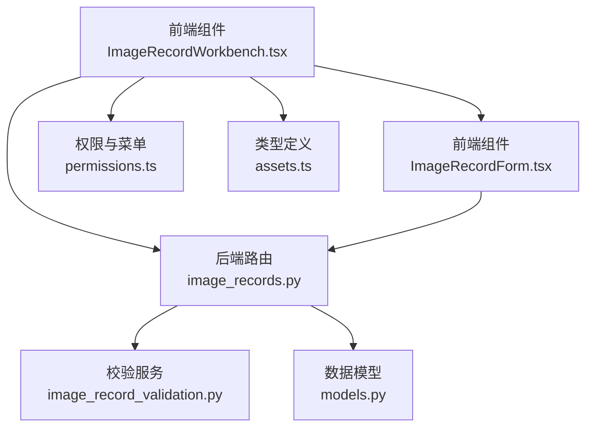
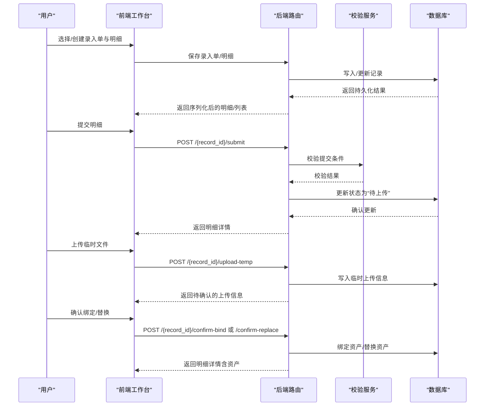
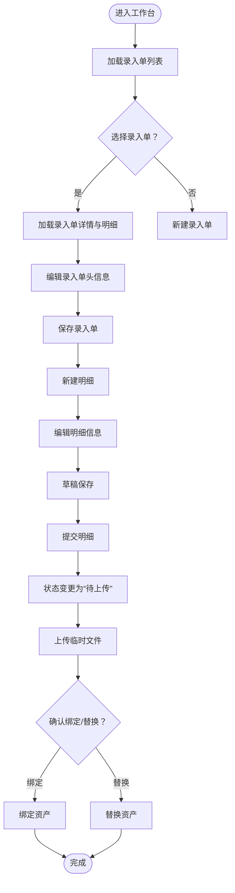
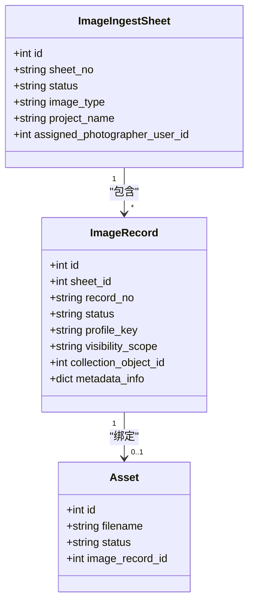
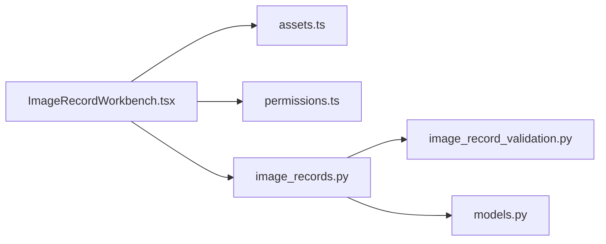

# 记录录入工作台

<cite>
**本文引用的文件**
- [IMAGE_RECORD_WORKBENCH_GUIDE.md](file://docs/03-产品与流程/IMAGE_RECORD_WORKBENCH_GUIDE.md)
- [WORKFLOW_GUIDE.md](file://docs/03-产品与流程/WORKFLOW_GUIDE.md)
- [USER_ROLE_PERMISSION_MATRIX.md](file://docs/03-产品与流程/USER_ROLE_PERMISSION_MATRIX.md)
- [ImageRecordWorkbench.tsx](file://frontend/src/components/ImageRecordWorkbench.tsx)
- [ImageRecordForm.tsx](file://frontend/src/components/ImageRecordForm.tsx)
- [permissions.ts](file://frontend/src/auth/permissions.ts)
- [assets.ts](file://frontend/src/types/assets.ts)
- [image_records.py](file://backend/app/routers/image_records.py)
- [image_record_validation.py](file://backend/app/services/image_record_validation.py)
- [models.py](file://backend/app/models.py)
</cite>

## 目录
1. [简介](#简介)
2. [项目结构](#项目结构)
3. [核心组件](#核心组件)
4. [架构概览](#架构概览)
5. [详细组件分析](#详细组件分析)
6. [依赖分析](#依赖分析)
7. [性能考虑](#性能考虑)
8. [故障排查指南](#故障排查指南)
9. [结论](#结论)
10. [附录](#附录)

## 简介
本文件面向MDAMS原型项目的“图像记录工作台”，系统性说明其用户界面设计、功能流程、业务逻辑与权限控制。工作台支持“先建记录、后传文件”的拆分工作流，服务于两类角色：元数据录入人员与摄影上传人员，并通过前后端协作实现草稿保存、提交审核、文件上传与绑定、状态流转与验证等关键能力。

## 项目结构
- 前端组件
  - 图像记录工作台：负责录入单与明细的创建、编辑、提交、退回、文件上传与绑定等全流程。
  - 图像记录表单：面向单一记录的元数据编辑与草稿保存。
  - 权限与菜单：基于权限矩阵控制菜单可见性与入口。
  - 类型定义：统一描述记录、明细、待上传、绑定资产等数据结构。
- 后端路由与服务
  - 路由：提供录入单与记录的CRUD、提交、退回、临时上传、确认绑定/替换等接口。
  - 服务：提供提交前校验、文件上传校验、状态治理、审计日志等能力。
  - 模型：定义数据库实体及字段约束，支撑状态与关系管理。

图表来源
- [ImageRecordWorkbench.tsx:235-800](file://frontend/src/components/ImageRecordWorkbench.tsx#L235-L800)
- [ImageRecordForm.tsx:81-246](file://frontend/src/components/ImageRecordForm.tsx#L81-L246)
- [permissions.ts:84-98](file://frontend/src/auth/permissions.ts#L84-L98)
- [assets.ts:50-95](file://frontend/src/types/assets.ts#L50-L95)
- [image_records.py:50-1608](file://backend/app/routers/image_records.py#L50-L1608)
- [image_record_validation.py:163-563](file://backend/app/services/image_record_validation.py#L163-L563)
- [models.py:113-174](file://backend/app/models.py#L113-L174)

章节来源
- [IMAGE_RECORD_WORKBENCH_GUIDE.md:1-115](file://docs/03-产品与流程/IMAGE_RECORD_WORKBENCH_GUIDE.md#L1-L115)
- [WORKFLOW_GUIDE.md:59-84](file://docs/03-产品与流程/WORKFLOW_GUIDE.md#L59-L84)

## 核心组件
- 前端工作台组件
  - 录入单列表与详情：支持搜索、加载、切换、保存录入单。
  - 明细列表与表单：支持新建/编辑记录、草稿保存、提交、退回、上传临时文件、确认绑定/替换。
  - 字段组织：按“核心信息、管理信息、Profile信息”三大板块组织，动态渲染不同Profile下的专属字段。
  - 交互流程：权限驱动的按钮可用性、状态标签与颜色、提示消息与加载态。
- 后端路由与服务
  - 状态管理：草稿、进行中、已完成、待上传、已退回、已上传待校验等状态及其流转。
  - 校验规则：提交前校验、文件上传校验、重复检测、命名规范提示等。
  - 审计与衍生：记录操作审计、IIIF衍生生成、人脸识别等后续流程触发。

章节来源
- [ImageRecordWorkbench.tsx:235-800](file://frontend/src/components/ImageRecordWorkbench.tsx#L235-L800)
- [ImageRecordForm.tsx:81-246](file://frontend/src/components/ImageRecordForm.tsx#L81-L246)
- [image_records.py:52-1608](file://backend/app/routers/image_records.py#L52-L1608)
- [image_record_validation.py:163-563](file://backend/app/services/image_record_validation.py#L163-L563)

## 架构概览
工作台采用前后端分离架构：前端负责UI与交互、状态展示与权限裁剪；后端负责业务规则、状态治理、校验与持久化。两者通过REST接口通信，数据结构由前端类型定义与后端响应模型共同约束。

图表来源
- [image_records.py:1393-1608](file://backend/app/routers/image_records.py#L1393-L1608)
- [image_record_validation.py:163-563](file://backend/app/services/image_record_validation.py#L163-L563)
- [ImageRecordWorkbench.tsx:521-593](file://frontend/src/components/ImageRecordWorkbench.tsx#L521-L593)

## 详细组件分析

### 前端工作台组件（ImageRecordWorkbench）
- 表单布局与字段组织
  - 录入单头信息：影像类型、项目类型、项目名称、摄影师、拍摄时间、版权归属、标题、备注等。
  - 明细信息：标题、可见范围、关联对象、管理信息（项目名称、影像类别、摄影者、拍摄时间、备注等）、Profile专属字段。
  - 动态渲染：根据影像类型切换Profile字段集合，部分字段在提交时必填。
- 交互流程
  - 新建/编辑：支持草稿保存与提交；提交前进行字段完整性校验。
  - 上传与绑定：上传临时文件后，系统进行基础分析与校验，用户确认后绑定或替换资产。
  - 状态展示：使用标签与颜色直观反映记录状态，支持退回与重新编辑。
- 权限控制
  - 按权限显示按钮与入口，如“保存录入单”“保存明细”“提交”“退回”“上传”“确认绑定/替换”。

图表来源
- [ImageRecordWorkbench.tsx:293-593](file://frontend/src/components/ImageRecordWorkbench.tsx#L293-L593)

章节来源
- [ImageRecordWorkbench.tsx:235-800](file://frontend/src/components/ImageRecordWorkbench.tsx#L235-L800)

### 前端表单组件（ImageRecordForm）
- 适用场景：独立编辑单一记录，适合在弹窗或独立页面中使用。
- 字段组织：核心信息（记录号、标题、可见范围、关联对象、Profile）、管理信息（项目名称、影像类别、摄影者、拍摄时间、备注等）、Profile专属字段。
- 行为特性：草稿保存尽量宽松；提交时进行严格校验。

章节来源
- [ImageRecordForm.tsx:81-246](file://frontend/src/components/ImageRecordForm.tsx#L81-L246)

### 后端路由与服务（image_records.py 与 image_record_validation.py）
- 状态管理
  - 草稿、进行中、已完成、待上传、已退回、已上传待校验等状态；状态变更受权限与前置条件约束。
- 校验规则
  - 提交前校验：记录号唯一性、标题、可见范围、Profile键、项目名称、影像类别、摄影师、Profile必填字段等。
  - 文件上传校验：扩展名限制、文件大小、维度提取、哈希校验、重复检测、命名规范提示等。
- 审计与衍生
  - 记录操作审计（提交、退回、绑定、替换等）。
  - 绑定后触发IIIF衍生生成、人脸识别等后续流程。

图表来源
- [models.py:113-174](file://backend/app/models.py#L113-L174)

章节来源
- [image_records.py:52-1608](file://backend/app/routers/image_records.py#L52-L1608)
- [image_record_validation.py:163-563](file://backend/app/services/image_record_validation.py#L163-L563)

### 权限与菜单（permissions.ts 与 USER_ROLE_PERMISSION_MATRIX.md）
- 菜单入口：图像记录工作台入口条件为“image.record.list”或“image.record.view_ready_for_upload”。
- 角色分工：
  - 元数据录入人员：创建、编辑、提交、退回。
  - 摄影上传人员：查看待上传记录、上传文件、确认绑定/替换。
  - 系统管理员：全量调试与演示。
- 可见范围：open与owner_only两种可见范围，后端按权限与责任范围判定。

章节来源
- [permissions.ts:84-98](file://frontend/src/auth/permissions.ts#L84-L98)
- [USER_ROLE_PERMISSION_MATRIX.md:98-127](file://docs/03-产品与流程/USER_ROLE_PERMISSION_MATRIX.md#L98-L127)

## 依赖分析
- 前端依赖
  - 组件间：工作台依赖权限模块控制入口与按钮可用性；类型定义贯穿前后端交互。
  - 数据流：从列表到详情、从草稿到提交、从上传到绑定，形成闭环。
- 后端依赖
  - 路由依赖服务进行校验与状态治理；服务依赖模型进行持久化与关系维护。
  - 任务队列：绑定后触发衍生生成与人脸识别等异步任务。

图表来源
- [ImageRecordWorkbench.tsx:1-40](file://frontend/src/components/ImageRecordWorkbench.tsx#L1-L40)
- [assets.ts:50-95](file://frontend/src/types/assets.ts#L50-L95)
- [permissions.ts:84-98](file://frontend/src/auth/permissions.ts#L84-L98)
- [image_records.py:50-1608](file://backend/app/routers/image_records.py#L50-L1608)
- [image_record_validation.py:1-50](file://backend/app/services/image_record_validation.py#L1-L50)
- [models.py:1-50](file://backend/app/models.py#L1-L50)

章节来源
- [IMAGE_RECORD_WORKBENCH_GUIDE.md:1-115](file://docs/03-产品与流程/IMAGE_RECORD_WORKBENCH_GUIDE.md#L1-L115)
- [WORKFLOW_GUIDE.md:59-84](file://docs/03-产品与流程/WORKFLOW_GUIDE.md#L59-L84)

## 性能考虑
- 前端
  - 列表与详情加载采用懒加载与分页策略，避免一次性渲染大量数据。
  - 表单字段按Profile动态渲染，减少无关DOM节点。
- 后端
  - 上传临时文件后立即进行基础分析与校验，降低后续绑定失败概率。
  - 绑定后异步生成IIIF衍生文件，避免阻塞主线程。
- 存储与索引
  - 关键字段建立索引（如record_no、status、visibility_scope），提升查询效率。

## 故障排查指南
- 提交失败
  - 现象：提交时报错，提示缺失字段或校验不通过。
  - 排查：检查记录号是否唯一、标题/可见范围/项目名称/影像类别/摄影师/Profile必填字段是否完整。
  - 参考：提交校验规则与错误信息。
- 上传失败
  - 现象：临时上传成功但无法确认绑定。
  - 排查：确认文件扩展名、尺寸、哈希、重复检测与命名规范；检查当前状态是否允许上传。
- 绑定/替换失败
  - 现象：确认绑定/替换时报错。
  - 排查：确认当前用户是否为分配的摄影师；检查当前状态与文件有效性；避免相同文件替换。
- 权限不足
  - 现象：无法看到工作台入口或按钮不可用。
  - 排查：确认用户是否具备相应权限；检查菜单可见性矩阵。

章节来源
- [image_record_validation.py:163-370](file://backend/app/services/image_record_validation.py#L163-L370)
- [image_records.py:1393-1608](file://backend/app/routers/image_records.py#L1393-L1608)
- [USER_ROLE_PERMISSION_MATRIX.md:98-127](file://docs/03-产品与流程/USER_ROLE_PERMISSION_MATRIX.md#L98-L127)

## 结论
图像记录工作台通过清晰的界面布局、严格的字段校验与状态治理、完善的权限控制，实现了“先建记录、后传文件”的高效协作流程。前端以工作台为核心串联录入单与明细，后端以路由与服务保障业务规则与数据一致性。建议在后续迭代中进一步增强批量操作、更细粒度的状态机与审核能力。

## 附录

### 字段作用与输入规范
- 核心信息
  - 记录号：系统唯一标识，提交时必填且唯一。
  - 标题：记录标题，建议避免占位符。
  - 可见范围：开放/责任人可见。
  - 关联对象：可选，关联到藏品对象。
  - Profile：影像类型，决定专属字段集合。
- 管理信息
  - 项目名称：提交时必填。
  - 影像类别：提交时必填。
  - 摄影者：可选。
  - 摄影者单位：可选。
  - 拍摄时间：建议格式为YYYY-MM-DD。
  - 备注：可选。
- Profile专属字段
  - 根据影像类型动态呈现，部分字段在提交时必填。

章节来源
- [ImageRecordWorkbench.tsx:171-196](file://frontend/src/components/ImageRecordWorkbench.tsx#L171-L196)
- [assets.ts:84-95](file://frontend/src/types/assets.ts#L84-L95)
- [image_record_validation.py:163-370](file://backend/app/services/image_record_validation.py#L163-L370)

### 用户操作流程示例
- 新建记录
  - 步骤：选择录入单 → 新建明细 → 填写核心信息与管理信息 → 草稿保存 → 提交。
- 编辑记录
  - 步骤：选择明细 → 修改字段 → 草稿保存 → 提交。
- 保存草稿
  - 步骤：在表单中点击“保存草稿”，系统提示保存成功。
- 提交审核
  - 步骤：点击“提交”，系统进行校验，通过后状态变为“待上传”。

章节来源
- [ImageRecordWorkbench.tsx:488-540](file://frontend/src/components/ImageRecordWorkbench.tsx#L488-L540)
- [image_records.py:1393-1430](file://backend/app/routers/image_records.py#L1393-L1430)

### 最佳实践
- 字段填写
  - 使用明确的标题与拍摄时间，避免占位符。
  - 项目名称与影像类别务必准确填写。
- 文件上传
  - 遵循命名规范（记录号前缀），确保文件扩展名在允许列表内。
  - 注意文件大小与格式风险提示。
- 状态管理
  - 退回后及时修订并重新提交，避免长时间停留在草稿状态。
- 权限与协作
  - 元数据录入人员与摄影上传人员明确分工，避免越权操作。

章节来源
- [IMAGE_RECORD_WORKBENCH_GUIDE.md:1-115](file://docs/03-产品与流程/IMAGE_RECORD_WORKBENCH_GUIDE.md#L1-L115)
- [image_record_validation.py:20-563](file://backend/app/services/image_record_validation.py#L20-L563)