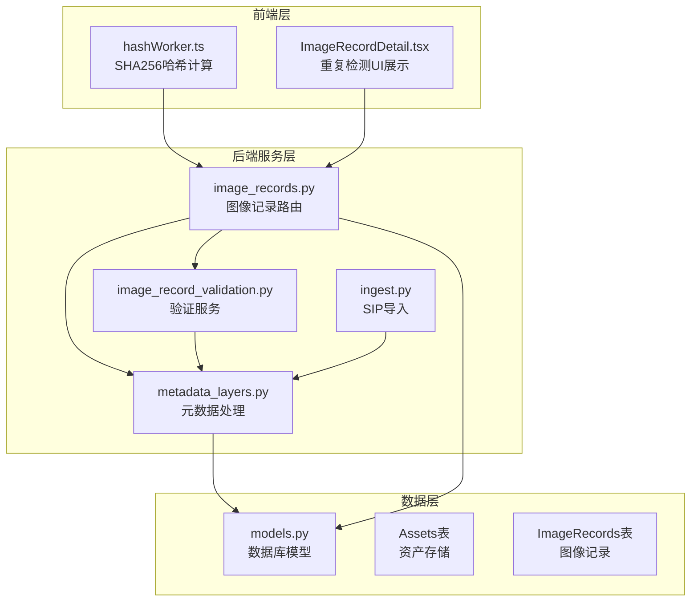
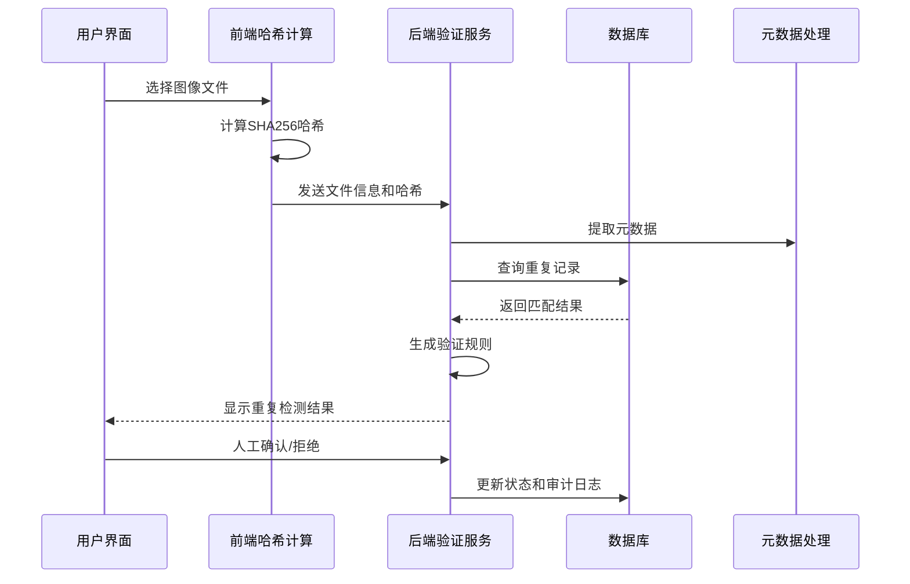
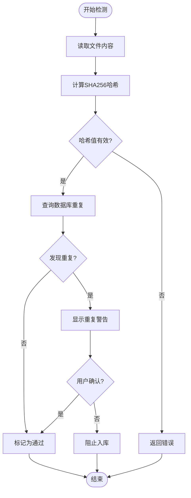
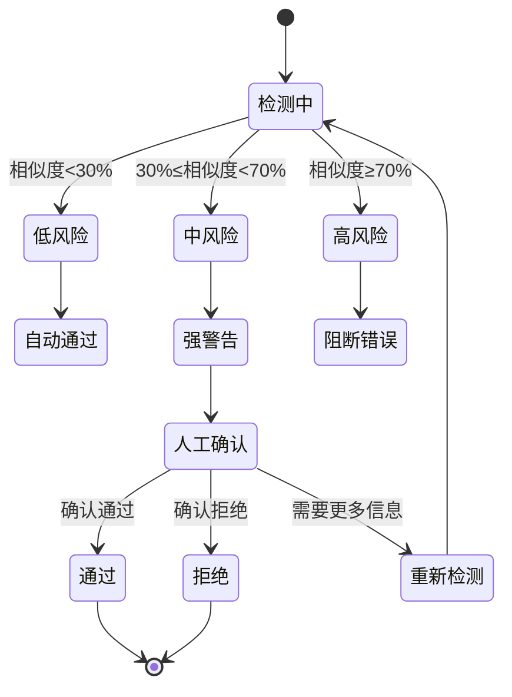
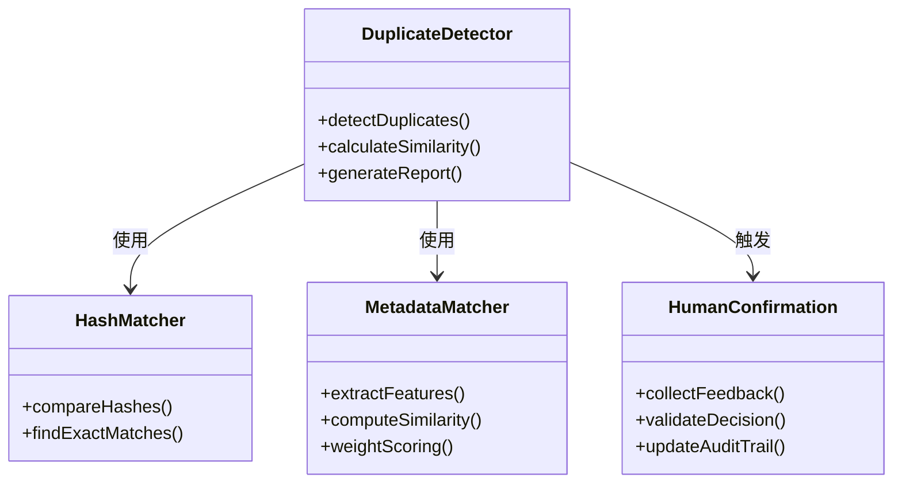
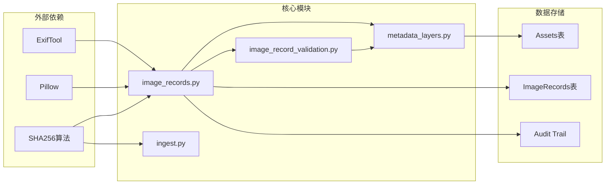
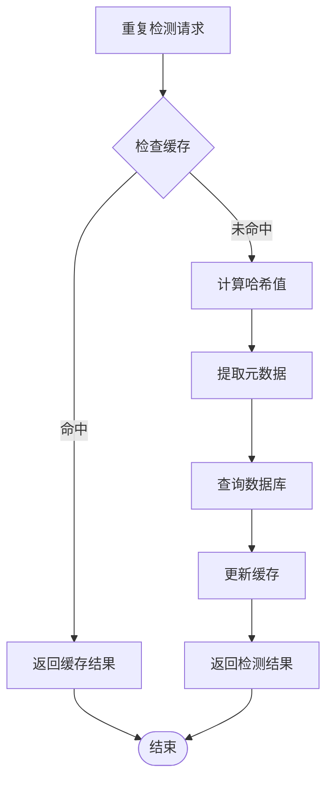

# 重复检测机制

<cite>
**本文档引用的文件**
- [image_records.py](file://backend/app/routers/image_records.py)
- [image_record_validation.py](file://backend/app/services/image_record_validation.py)
- [metadata_layers.py](file://backend/app/services/metadata_layers.py)
- [ingest.py](file://backend/app/routers/ingest.py)
- [hashWorker.ts](file://frontend/src/workers/hashWorker.ts)
- [ImageRecordDetail.tsx](file://frontend/src/components/ImageRecordDetail.tsx)
- [IMAGE_RECORD_MATCHING_PHASE1_PLAN.md](file://docs/04-实施方案/IMAGE_RECORD_MATCHING_PHASE1_PLAN.md)
- [IMAGE_RECORD_VALIDATION_PHASE1_PLAN.md](file://docs/04-实施方案/IMAGE_RECORD_VALIDATION_PHASE1_PLAN.md)
- [models.py](file://backend/app/models.py)
</cite>

## 目录
1. [简介](#简介)
2. [项目结构](#项目结构)
3. [核心组件](#核心组件)
4. [架构概览](#架构概览)
5. [详细组件分析](#详细组件分析)
6. [依赖分析](#依赖分析)
7. [性能考虑](#性能考虑)
8. [故障排除指南](#故障排除指南)
9. [结论](#结论)

## 简介

MDAMS原型项目的图像记录重复检测机制是一个多层次的智能检测系统，旨在防止相同图像内容被重复入库。该机制采用"精确匹配+模糊匹配+人工审核"的三层防护策略，通过文件指纹、元数据相似度和人工确认相结合的方式，确保图像数据的唯一性和完整性。

系统的核心目标是在保证数据质量的前提下，最大化检测效率，同时为用户提供清晰的反馈和必要的干预手段。重复检测机制不仅关注技术层面的准确性，更注重用户体验和操作流程的合理性。

## 项目结构

重复检测机制在MDAMS项目中的组织结构如下：



**图表来源**
- [image_records.py:1-120](file://backend/app/routers/image_records.py#L1-L120)
- [image_record_validation.py:1-80](file://backend/app/services/image_record_validation.py#L1-L80)
- [metadata_layers.py:1-60](file://backend/app/services/metadata_layers.py#L1-L60)
- [models.py:1-60](file://backend/app/models.py#L1-L60)

**章节来源**
- [image_records.py:1-120](file://backend/app/routers/image_records.py#L1-L120)
- [image_record_validation.py:1-80](file://backend/app/services/image_record_validation.py#L1-L80)
- [metadata_layers.py:1-60](file://backend/app/services/metadata_layers.py#L1-L60)
- [models.py:1-60](file://backend/app/models.py#L1-L60)

## 核心组件

### 1. 文件指纹检测组件

文件指纹检测是重复检测的第一道防线，通过计算图像文件的SHA256哈希值来实现精确匹配。

**核心功能特性：**
- 支持多种图像格式（JPG、PNG、TIFF、PSD等）
- 实时哈希计算和验证
- 数据库级哈希值查询
- 去重逻辑优化

**关键实现点：**
- 前端使用Web Crypto API进行SHA256计算
- 后端通过ExifTool提取元数据并计算哈希
- 数据库存储标准化的哈希值格式

### 2. 元数据相似度检测组件

基于元数据的模糊匹配机制，用于发现语义上相似但物理上不同的图像。

**检测维度：**
- 标题和描述文本相似度
- 项目名称和分类信息匹配
- 对象编号和文物号码关联
- 拍摄时间和地点信息

### 3. 人工审核确认组件

提供多级审核机制，确保检测结果的准确性和可追溯性。

**审核层级：**
- 系统自动检测
- 强警告提示（需要确认）
- 阻断错误（必须修正）
- 人工最终确认

**章节来源**
- [image_records.py:364-371](file://backend/app/routers/image_records.py#L364-L371)
- [image_record_validation.py:147-151](file://backend/app/services/image_record_validation.py#L147-L151)
- [metadata_layers.py:563-569](file://backend/app/services/metadata_layers.py#L563-L569)

## 架构概览

重复检测机制采用分层架构设计，确保各组件职责明确、耦合度低：



**图表来源**
- [hashWorker.ts:8-44](file://frontend/src/workers/hashWorker.ts#L8-L44)
- [image_records.py:364-371](file://backend/app/routers/image_records.py#L364-L371)
- [image_record_validation.py:372-562](file://backend/app/services/image_record_validation.py#L372-L562)

## 详细组件分析

### 文件指纹检测系统

#### 哈希计算流程



**图表来源**
- [hashWorker.ts:23-27](file://frontend/src/workers/hashWorker.ts#L23-L27)
- [image_records.py:364-371](file://backend/app/routers/image_records.py#L364-L371)
- [image_record_validation.py:431-439](file://backend/app/services/image_record_validation.py#L431-L439)

#### 哈希算法应用

系统采用SHA256作为统一的哈希算法，确保跨平台一致性和安全性：

**算法特性：**
- 固定256位输出长度
- 抗碰撞性强
- 标准化程度高
- 性能开销适中

**实现方式：**
- 前端：Web Crypto API
- 后端：Python hashlib
- SIP导入：ExifTool集成

**章节来源**
- [hashWorker.ts:23-27](file://frontend/src/workers/hashWorker.ts#L23-L27)
- [ingest.py:54-64](file://backend/app/routers/ingest.py#L54-L64)
- [image_record_validation.py:147-151](file://backend/app/services/image_record_validation.py#L147-L151)

### 元数据相似度检测

#### 相似度评分机制

系统通过多维度元数据比较来评估图像相似度：

**评分维度：**
- 文本匹配度（标题、描述、项目名）
- 结构化字段匹配（对象编号、拍摄时间）
- 分类信息一致性（图像类别、文物类型）

**相似度计算：**
```
相似度分数 = Σ(权重i × 匹配度i) / Σ(权重i)
```

其中权重根据字段重要性分配，确保关键信息具有更高影响力。

### 人工审核确认流程

#### 多级确认机制



**图表来源**
- [IMAGE_RECORD_VALIDATION_PHASE1_PLAN.md:123-141](file://docs/04-实施方案/IMAGE_RECORD_VALIDATION_PHASE1_PLAN.md#L123-L141)
- [image_record_validation.py:98-126](file://backend/app/services/image_record_validation.py#L98-L126)

**章节来源**
- [IMAGE_RECORD_VALIDATION_PHASE1_PLAN.md:123-141](file://docs/04-实施方案/IMAGE_RECORD_VALIDATION_PHASE1_PLAN.md#L123-L141)
- [image_record_validation.py:98-126](file://backend/app/services/image_record_validation.py#L98-L126)

### 重复记录识别流程

#### 数据预处理阶段

系统在检测前进行多层数据预处理：

1. **文件格式验证**：检查支持的图像格式
2. **元数据提取**：使用ExifTool提取技术元数据
3. **尺寸信息获取**：确定图像宽高和像素密度
4. **哈希值标准化**：转换为统一格式

#### 特征比对阶段



**图表来源**
- [image_records.py:364-371](file://backend/app/routers/image_records.py#L364-L371)
- [image_record_validation.py:372-562](file://backend/app/services/image_record_validation.py#L372-L562)

#### 阈值判断机制

系统采用动态阈值策略：

| 相似度范围 | 处理方式 | 权重系数 |
|-----------|----------|----------|
| 0%-30% | 自动通过 | 低风险 |
| 30%-70% | 强警告，需要人工确认 | 中等风险 |
| 70%-100% | 阻断错误，禁止入库 | 高风险 |

**章节来源**
- [image_records.py:364-371](file://backend/app/routers/image_records.py#L364-L371)
- [image_record_validation.py:471-479](file://backend/app/services/image_record_validation.py#L471-L479)

## 依赖分析

重复检测机制涉及多个模块间的复杂交互关系：



**图表来源**
- [image_records.py:1-50](file://backend/app/routers/image_records.py#L1-L50)
- [image_record_validation.py:1-10](file://backend/app/services/image_record_validation.py#L1-L10)
- [metadata_layers.py:1-10](file://backend/app/services/metadata_layers.py#L1-L10)

**章节来源**
- [image_records.py:1-50](file://backend/app/routers/image_records.py#L1-L50)
- [image_record_validation.py:1-10](file://backend/app/services/image_record_validation.py#L1-L10)
- [metadata_layers.py:1-10](file://backend/app/services/metadata_layers.py#L1-L10)

## 性能考虑

### 索引策略优化

为了提高重复检测的性能，系统采用了多层索引策略：

**数据库索引设计：**
- Assets表的filename列建立索引，支持快速文件名查找
- ImageRecords表的record_no列建立唯一索引，确保记录号唯一性
- metadata_info列建立JSON索引，支持元数据查询
- 创建复合索引优化常见查询模式

**内存缓存机制：**
- 常用哈希值缓存，减少重复计算
- 元数据字典缓存，提升相似度计算速度
- 最近访问记录缓存，优化热点数据访问

### 批量处理优化

系统支持批量重复检测，通过以下机制提升处理效率：

**并发处理：**
- 多线程哈希计算
- 异步数据库查询
- 流式文件处理，避免大文件内存占用

**智能调度：**
- 优先处理高风险重复项
- 批量提交减少数据库往返
- 自适应调整批处理大小

### 缓存机制设计



**图表来源**
- [image_records.py:364-371](file://backend/app/routers/image_records.py#L364-L371)
- [metadata_layers.py:563-569](file://backend/app/services/metadata_layers.py#L563-L569)

**章节来源**
- [image_records.py:364-371](file://backend/app/routers/image_records.py#L364-L371)
- [metadata_layers.py:563-569](file://backend/app/services/metadata_layers.py#L563-L569)

## 故障排除指南

### 常见问题诊断

**问题1：重复检测不准确**
- 检查哈希计算是否正确执行
- 验证元数据提取是否完整
- 确认数据库索引是否正常

**问题2：性能下降**
- 检查缓存命中率
- 监控数据库查询时间
- 优化批处理大小

**问题3：前端哈希计算失败**
- 验证Web Crypto API支持
- 检查文件大小限制
- 确认浏览器兼容性

### 调试工具和方法

**后端调试：**
- 启用详细日志记录
- 使用数据库查询分析工具
- 监控系统资源使用情况

**前端调试：**
- 检查浏览器开发者工具
- 验证Web Worker执行状态
- 监控网络请求和响应

**章节来源**
- [image_records.py:374-417](file://backend/app/routers/image_records.py#L374-L417)
- [hashWorker.ts:41-44](file://frontend/src/workers/hashWorker.ts#L41-L44)

## 结论

MDAMS原型项目的重复检测机制通过多层次的设计实现了高效、准确的图像重复检测。系统不仅提供了技术层面的精确匹配能力，更重要的是建立了完善的审核确认流程，确保了检测结果的可靠性和可追溯性。

**主要优势：**
1. **多层次防护**：从文件指纹到元数据相似度再到人工审核，形成完整的防护体系
2. **用户体验友好**：提供清晰的反馈和必要的干预手段
3. **性能优化到位**：通过索引、缓存和批量处理确保系统高效运行
4. **可扩展性强**：模块化设计便于未来功能扩展和性能优化

**未来改进方向：**
1. 引入机器学习算法提升元数据相似度检测精度
2. 增加跨系统重复检测能力
3. 优化移动端的重复检测体验
4. 建立更完善的性能监控和调优机制

该重复检测机制为MDAMS项目的数据质量管理奠定了坚实基础，为后续的功能扩展和系统优化提供了良好的技术支撑。