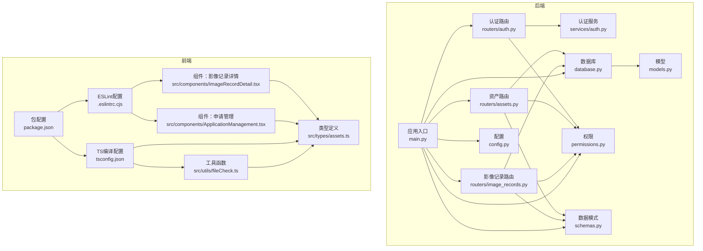
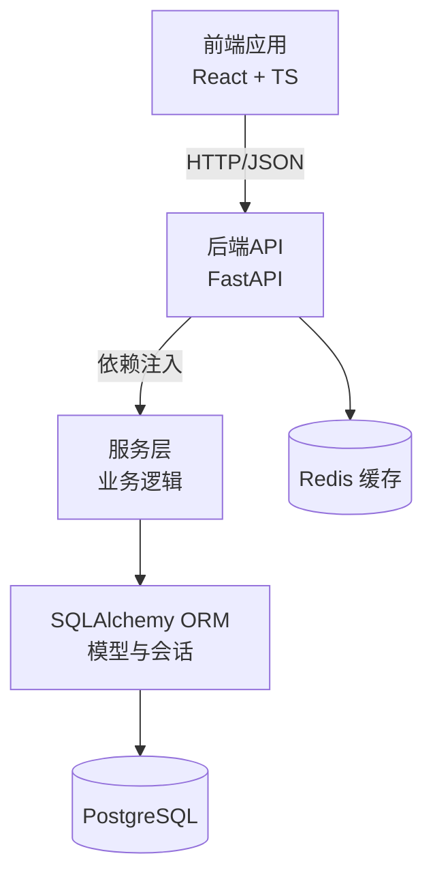
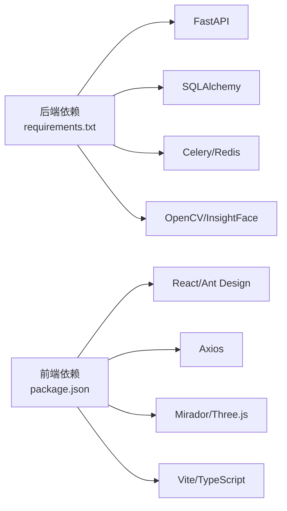

# 代码规范与最佳实践

<cite>
**本文引用的文件**
- [backend/app/main.py](file://backend/app/main.py)
- [backend/app/config.py](file://backend/app/config.py)
- [backend/app/database.py](file://backend/app/database.py)
- [backend/app/models.py](file://backend/app/models.py)
- [backend/app/schemas.py](file://backend/app/schemas.py)
- [backend/app/permissions.py](file://backend/app/permissions.py)
- [backend/app/routers/auth.py](file://backend/app/routers/auth.py)
- [backend/app/routers/assets.py](file://backend/app/routers/assets.py)
- [backend/app/routers/image_records.py](file://backend/app/routers/image_records.py)
- [backend/app/services/auth.py](file://backend/app/services/auth.py)
- [backend/requirements.txt](file://backend/requirements.txt)
- [frontend/package.json](file://frontend/package.json)
- [frontend/.eslintrc.cjs](file://frontend/.eslintrc.cjs)
- [frontend/tsconfig.json](file://frontend/tsconfig.json)
- [frontend/src/types/assets.ts](file://frontend/src/types/assets.ts)
- [frontend/src/utils/fileCheck.ts](file://frontend/src/utils/fileCheck.ts)
- [frontend/src/components/ImageRecordDetail.tsx](file://frontend/src/components/ImageRecordDetail.tsx)
- [frontend/src/components/ApplicationManagement.tsx](file://frontend/src/components/ApplicationManagement.tsx)
- [pytest.ini](file://pytest.ini)
</cite>

## 目录
1. [简介](#简介)
2. [项目结构](#项目结构)
3. [核心组件](#核心组件)
4. [架构总览](#架构总览)
5. [详细组件分析](#详细组件分析)
6. [依赖关系分析](#依赖关系分析)
7. [性能考虑](#性能考虑)
8. [故障排查指南](#故障排查指南)
9. [结论](#结论)
10. [附录：代码审查检查清单与质量保证流程](#附录代码审查检查清单与质量保证流程)

## 简介
本指南面向MDAMS原型项目的Python后端与TypeScript/JavaScript前端团队，提供统一的代码规范与最佳实践，覆盖风格与命名、函数设计、异常处理、日志记录、数据库设计、API设计、代码审查与质量保证流程，以及性能优化建议。文档以仓库现有实现为依据，结合可扩展性与可维护性目标，给出正向示例与反面案例的对比指引。

## 项目结构
项目采用前后端分离架构，后端基于FastAPI + SQLAlchemy，前端基于React + TypeScript，配合Vite构建与Playwright测试。后端模块化清晰，按功能域划分为routers、services、models、schemas、permissions等；前端按功能组件与类型定义组织。

图表来源
- [backend/app/main.py:1-86](file://backend/app/main.py#L1-L86)
- [backend/app/config.py:1-72](file://backend/app/config.py#L1-L72)
- [backend/app/database.py:1-17](file://backend/app/database.py#L1-L17)
- [backend/app/models.py:1-307](file://backend/app/models.py#L1-L307)
- [backend/app/schemas.py:1-652](file://backend/app/schemas.py#L1-L652)
- [backend/app/permissions.py:1-255](file://backend/app/permissions.py#L1-L255)
- [backend/app/routers/auth.py:1-83](file://backend/app/routers/auth.py#L1-L83)
- [backend/app/routers/assets.py:1-292](file://backend/app/routers/assets.py#L1-L292)
- [backend/app/routers/image_records.py:1-800](file://backend/app/routers/image_records.py#L1-L800)
- [backend/app/services/auth.py:1-143](file://backend/app/services/auth.py#L1-L143)
- [frontend/package.json:1-42](file://frontend/package.json#L1-L42)
- [frontend/.eslintrc.cjs:1-21](file://frontend/.eslintrc.cjs#L1-L21)
- [frontend/tsconfig.json:1-23](file://frontend/tsconfig.json#L1-L23)
- [frontend/src/types/assets.ts:1-621](file://frontend/src/types/assets.ts#L1-L621)
- [frontend/src/utils/fileCheck.ts:1-97](file://frontend/src/utils/fileCheck.ts#L1-L97)
- [frontend/src/components/ImageRecordDetail.tsx:1-261](file://frontend/src/components/ImageRecordDetail.tsx#L1-L261)
- [frontend/src/components/ApplicationManagement.tsx:1-293](file://frontend/src/components/ApplicationManagement.tsx#L1-L293)

章节来源
- [backend/app/main.py:1-86](file://backend/app/main.py#L1-L86)
- [frontend/package.json:1-42](file://frontend/package.json#L1-L42)

## 核心组件
- 应用入口与中间件：初始化数据库、迁移兼容字段、注册路由、CORS配置。
- 配置管理：环境变量加载、数据库/Redis/上传目录/API公开地址等。
- 数据库与模型：ORM基类、会话工厂、核心实体（用户、角色、资产、影像记录等）。
- 数据模式：Pydantic模型用于请求/响应序列化与校验。
- 权限与认证：基于角色的权限矩阵、会话令牌校验、集合范围控制。
- 路由层：认证、资产、影像记录等API路由，职责单一、依赖注入明确。
- 服务层：认证、元数据层构建、预览图生成、IIIF派生等业务逻辑封装。
- 前端类型与组件：强类型接口、组件职责划分、状态与交互设计。

章节来源
- [backend/app/main.py:21-63](file://backend/app/main.py#L21-L63)
- [backend/app/config.py:1-72](file://backend/app/config.py#L1-L72)
- [backend/app/database.py:1-17](file://backend/app/database.py#L1-L17)
- [backend/app/models.py:1-307](file://backend/app/models.py#L1-L307)
- [backend/app/schemas.py:1-652](file://backend/app/schemas.py#L1-L652)
- [backend/app/permissions.py:1-255](file://backend/app/permissions.py#L1-L255)
- [backend/app/routers/auth.py:1-83](file://backend/app/routers/auth.py#L1-L83)
- [backend/app/routers/assets.py:1-292](file://backend/app/routers/assets.py#L1-L292)
- [backend/app/routers/image_records.py:1-800](file://backend/app/routers/image_records.py#L1-L800)
- [backend/app/services/auth.py:1-143](file://backend/app/services/auth.py#L1-L143)
- [frontend/src/types/assets.ts:1-621](file://frontend/src/types/assets.ts#L1-L621)
- [frontend/src/components/ImageRecordDetail.tsx:1-261](file://frontend/src/components/ImageRecordDetail.tsx#L1-L261)
- [frontend/src/components/ApplicationManagement.tsx:1-293](file://frontend/src/components/ApplicationManagement.tsx#L1-L293)

## 架构总览
后端采用分层架构：路由层负责HTTP协议与参数解析，服务层承载业务规则，模型层抽象持久化，模式层约束输入输出。前端通过Axios调用后端API，组件内聚状态与UI逻辑，类型定义保障跨层契约一致性。

图表来源
- [backend/app/routers/assets.py:1-292](file://backend/app/routers/assets.py#L1-L292)
- [backend/app/routers/image_records.py:1-800](file://backend/app/routers/image_records.py#L1-L800)
- [backend/app/services/auth.py:1-143](file://backend/app/services/auth.py#L1-L143)
- [backend/app/database.py:1-17](file://backend/app/database.py#L1-L17)
- [backend/app/config.py:42-46](file://backend/app/config.py#L42-L46)

## 详细组件分析

### Python后端代码规范

- PEP8风格与命名约定
  - 变量与函数使用下划线命名；类名使用帕斯卡命名；常量使用全大写。
  - 导入顺序：标准库、第三方库、项目内模块，分组清晰。
  - 行长度不超过100字符，必要时使用括号换行。
  - 函数与类之间空两行，方法之间空一行，模块内逻辑分段空一行。

- 函数设计
  - 单一职责：路由处理仅做参数校验与依赖注入，复杂逻辑下沉到服务层。
  - 参数与返回值：使用类型注解与Pydantic模型，避免裸字典。
  - 异常处理：对可预期错误抛出HTTP异常，不吞掉异常；对不可预期错误记录日志并返回通用错误码。

- 异常处理与错误码
  - 使用HTTPException返回语义化状态码与消息，便于前端统一处理。
  - 对会话过期、权限不足、资源不存在等场景，分别返回401/403/404。
  - 服务层内部错误应向上抛出或包装为HTTP异常，避免静默失败。

- 日志记录
  - 使用标准库logging模块记录关键路径与错误堆栈，避免print调试。
  - 在任务执行与文件操作中增加上下文信息，便于定位问题。

- 数据库设计规范
  - 字段设计：使用合适的数据类型与默认值；对常用查询字段建立索引。
  - 外键约束：明确删除策略（如RESTRICT/SET NULL），避免悬挂数据。
  - 索引策略：对过滤、排序、连接字段建立复合索引，减少全表扫描。
  - 查询优化：优先使用ORM关系查询与批量操作，避免N+1查询；对大结果集分页或限制数量。

- API设计规范
  - RESTful设计：资源名词化、动词使用HTTP方法表达动作；幂等性与状态转移清晰。
  - 错误码定义：统一错误码区间与含义，响应体包含错误码、消息与可选详情。
  - 响应格式：统一使用JSON，嵌套结构清晰，字段命名一致。
  - 分页与过滤：提供limit/offset或cursor分页，支持常见过滤条件。

- 示例与反面案例
  - 正例：路由中仅做参数校验与权限检查，业务逻辑在服务层实现，返回Pydantic模型。
  - 反例：在路由中直接进行复杂计算或数据库操作，导致路由臃肿、难以测试。

章节来源
- [backend/app/routers/assets.py:54-133](file://backend/app/routers/assets.py#L54-L133)
- [backend/app/routers/image_records.py:702-758](file://backend/app/routers/image_records.py#L702-L758)
- [backend/app/permissions.py:214-236](file://backend/app/permissions.py#L214-L236)
- [backend/app/models.py:6-26](file://backend/app/models.py#L6-L26)
- [backend/app/schemas.py:7-20](file://backend/app/schemas.py#L7-L20)

### TypeScript/JavaScript前端代码规范

- ESLint规则
  - 推荐启用：@typescript-eslint/recommended、eslint:recommended、react-hooks/recommended。
  - 禁止any或严格any使用，未使用变量报warn，避免未使用禁用指令滥用。
  - react-refresh插件用于热更新，保持开发体验。

- 组件设计
  - 单一职责：每个组件聚焦一个功能区域，props向下传递，状态尽量局部化。
  - 类型安全：所有对外接口使用TypeScript接口，避免any。
  - 可访问性：按钮、模态框等交互元素具备键盘可达性与语义化标签。

- 状态管理
  - 将全局状态与UI状态分离，组件内部状态使用useState/useReducer。
  - 跨组件共享的状态上提到最近公共父组件或使用Context，避免深层回调地狱。

- 类型定义
  - 后端响应模型映射到前端类型，字段命名与后端保持一致，便于联调。
  - 对可选字段使用联合类型，渲染时进行判空处理。

- 示例与反面案例
  - 正例：组件通过props接收回调函数，内部仅处理UI状态，不直接发起网络请求。
  - 反例：组件内直接拼接URL与发送请求，缺乏类型约束与错误处理。

章节来源
- [frontend/.eslintrc.cjs:1-21](file://frontend/.eslintrc.cjs#L1-L21)
- [frontend/tsconfig.json:1-23](file://frontend/tsconfig.json#L1-L23)
- [frontend/src/types/assets.ts:1-621](file://frontend/src/types/assets.ts#L1-L621)
- [frontend/src/utils/fileCheck.ts:1-97](file://frontend/src/utils/fileCheck.ts#L1-L97)
- [frontend/src/components/ImageRecordDetail.tsx:1-261](file://frontend/src/components/ImageRecordDetail.tsx#L1-L261)
- [frontend/src/components/ApplicationManagement.tsx:1-293](file://frontend/src/components/ApplicationManagement.tsx#L1-L293)

### 数据库设计规范

- 表结构设计
  - 主键与自增：整型自增主键，唯一性约束明确。
  - 外键：使用明确的ON DELETE策略，避免孤儿数据。
  - JSON字段：用于存储非结构化元数据，注意查询与索引策略。

- 索引策略
  - 对高频过滤字段建立单列索引；对多字段组合查询建立复合索引。
  - 对时间戳字段建立索引，支持排序与范围查询。

- 查询优化
  - 使用select_related/joinedload减少查询次数。
  - 对大表分页查询，避免一次性加载全部数据。
  - 使用批量插入/更新提升写入性能。

- 兼容性与迁移
  - 启动时自动检测与补充缺失列，保证Schema演进兼容。

章节来源
- [backend/app/main.py:21-60](file://backend/app/main.py#L21-L60)
- [backend/app/models.py:1-307](file://backend/app/models.py#L1-L307)
- [backend/app/database.py:1-17](file://backend/app/database.py#L1-L17)

### API设计规范

- 路由组织
  - 按功能域划分路由模块，统一前缀与标签，便于文档生成与维护。
  - 路由函数职责单一，依赖注入明确，异常处理集中在路由层。

- 认证与授权
  - 支持Header与Cookie两种方式获取会话令牌，过期自动清理。
  - 权限矩阵集中定义，权限检查通过依赖函数实现，避免重复代码。

- 响应与错误
  - 使用Pydantic模型统一响应结构，字段命名与后端一致。
  - 对401/403/404等常见错误返回标准化错误体。

章节来源
- [backend/app/routers/auth.py:1-83](file://backend/app/routers/auth.py#L1-L83)
- [backend/app/permissions.py:179-204](file://backend/app/permissions.py#L179-L204)
- [backend/app/schemas.py:622-652](file://backend/app/schemas.py#L622-L652)

### 性能优化最佳实践

- 缓存策略
  - Redis用于会话与热点数据缓存，降低数据库压力。
  - 对静态资源与衍生图使用CDN与浏览器缓存头。

- 并发处理
  - Celery异步任务处理耗时操作（如生成IIIF派生、人脸识别），路由快速返回。
  - 上传文件分块写入，避免内存峰值过高。

- 内存管理
  - 图像处理使用流式读取与及时释放资源，避免长时间占用内存。
  - 对大对象序列化与传输，优先使用流式响应。

章节来源
- [backend/requirements.txt:1-18](file://backend/requirements.txt#L1-L18)
- [backend/app/routers/assets.py:68-71](file://backend/app/routers/assets.py#L68-L71)
- [frontend/src/utils/fileCheck.ts:13-23](file://frontend/src/utils/fileCheck.ts#L13-L23)

## 依赖关系分析

图表来源
- [backend/requirements.txt:1-18](file://backend/requirements.txt#L1-L18)
- [frontend/package.json:13-26](file://frontend/package.json#L13-L26)

章节来源
- [backend/requirements.txt:1-18](file://backend/requirements.txt#L1-L18)
- [frontend/package.json:1-42](file://frontend/package.json#L1-L42)

## 性能考虑
- 后端
  - 使用连接池与事务批处理，减少数据库开销。
  - 对热点接口增加缓存，合理设置TTL。
  - 异步任务队列处理耗时流程，避免阻塞请求线程。
- 前端
  - 组件懒加载与虚拟滚动优化长列表渲染。
  - 图像与模型资源按需加载，避免一次性加载过多资源。
  - 使用Web Workers处理重型计算，避免阻塞UI线程。

## 故障排查指南
- 后端
  - 检查数据库连接字符串与权限，确认表结构与索引存在。
  - 查看任务队列状态与日志，确认异步任务是否正常执行。
  - 校验CORS配置与Cookie安全属性，避免跨域与会话问题。
- 前端
  - 使用开发者工具查看网络请求与响应，核对类型定义与后端一致。
  - 检查ESLint与TS编译错误，确保类型安全。
  - 对大文件上传与图像处理，关注前端超时与内存占用。

章节来源
- [backend/app/config.py:42-72](file://backend/app/config.py#L42-L72)
- [backend/app/main.py:66-73](file://backend/app/main.py#L66-L73)
- [frontend/.eslintrc.cjs:1-21](file://frontend/.eslintrc.cjs#L1-L21)
- [frontend/tsconfig.json:1-23](file://frontend/tsconfig.json#L1-L23)

## 结论
本指南基于MDAMS原型项目的现有实现，总结了后端与前端的代码规范、数据库设计、API设计与性能优化要点，并提供了可操作的质量保证流程与审查清单。建议在后续迭代中持续完善测试覆盖率与文档，确保代码一致性与可维护性。

## 附录：代码审查检查清单与质量保证流程

- 代码审查检查清单
  - 是否遵循PEP8与项目命名约定？
  - 函数是否单一职责？是否过度耦合？
  - 是否正确使用类型注解与Pydantic模型？
  - 异常处理是否完整且语义化？
  - 数据库字段与索引是否合理？
  - 路由是否仅做参数与权限处理？
  - 前端组件是否类型安全、职责清晰？
  - ESLint与TS配置是否启用推荐规则？

- 质量保证流程
  - 提交前运行：后端pytest、前端ESLint与TypeScript检查、Playwright测试。
  - CI流水线：自动运行单元/集成测试，生成覆盖率报告。
  - 审查流程：双人审查，重点关注安全性、性能与可维护性。
  - 发布前：回归测试与性能基准测试，确保无破坏性变更。

章节来源
- [pytest.ini:1-9](file://pytest.ini#L1-L9)
- [frontend/package.json:6-11](file://frontend/package.json#L6-L11)
- [frontend/.eslintrc.cjs:12-19](file://frontend/.eslintrc.cjs#L12-L19)
- [frontend/tsconfig.json:10-11](file://frontend/tsconfig.json#L10-L11)