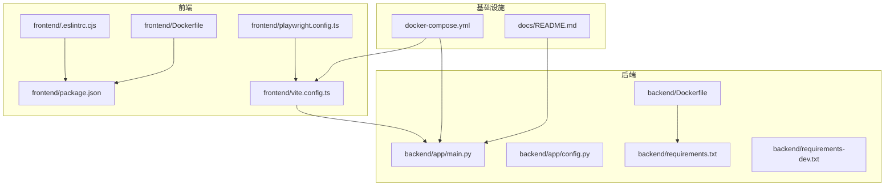
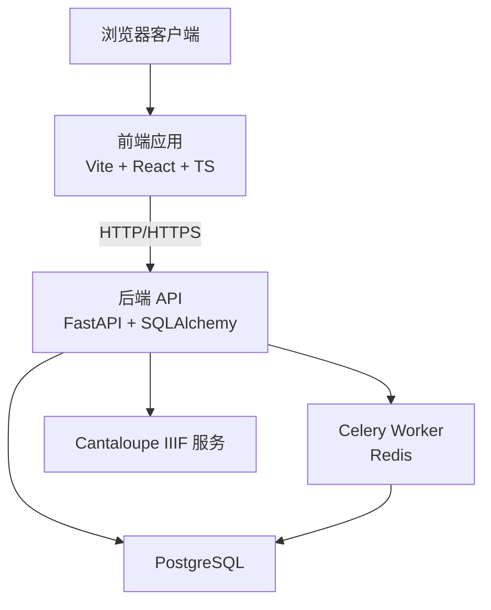
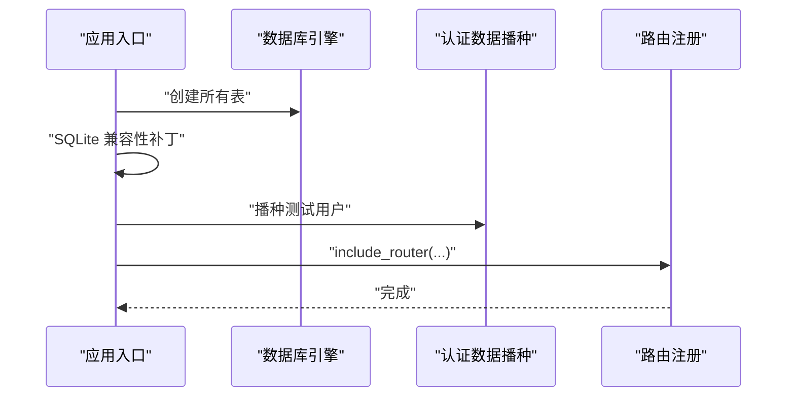
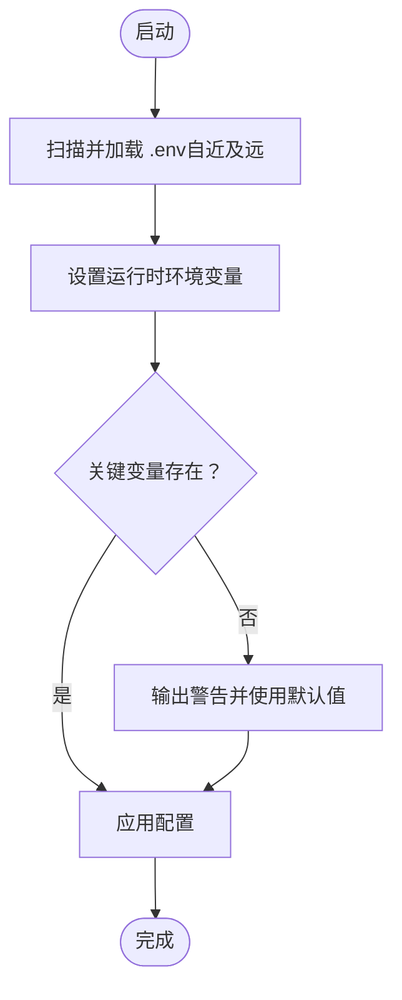
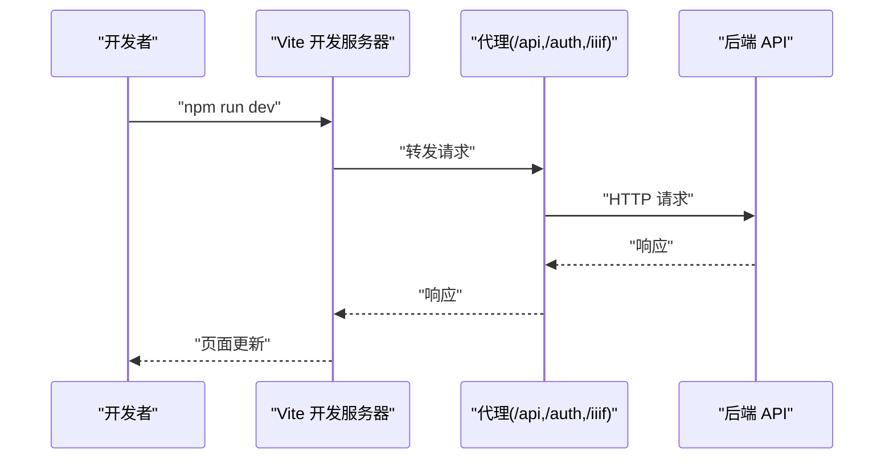
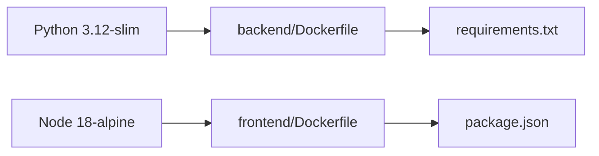
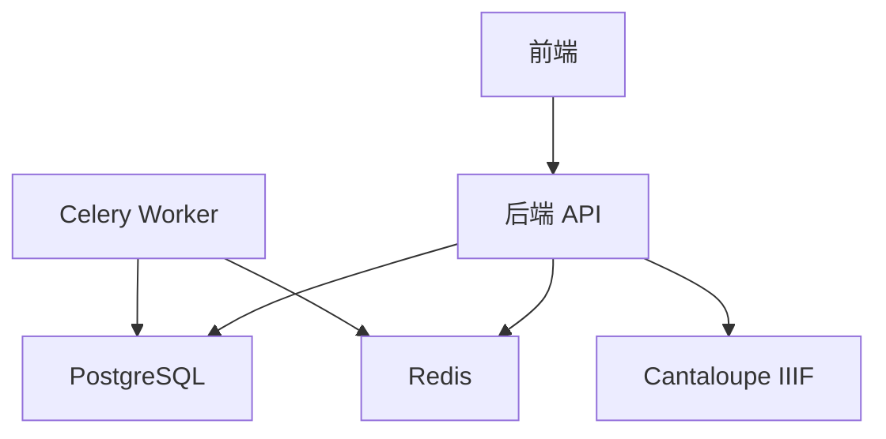

# 开发指南

<cite>
**本文引用的文件**
- [README.md](file://README.md)
- [docs/README.md](file://docs/README.md)
- [backend/app/main.py](file://backend/app/main.py)
- [backend/app/config.py](file://backend/app/config.py)
- [backend/Dockerfile](file://backend/Dockerfile)
- [backend/requirements.txt](file://backend/requirements.txt)
- [backend/requirements-dev.txt](file://backend/requirements-dev.txt)
- [frontend/Dockerfile](file://frontend/Dockerfile)
- [frontend/package.json](file://frontend/package.json)
- [frontend/vite.config.ts](file://frontend/vite.config.ts)
- [frontend/.eslintrc.cjs](file://frontend/.eslintrc.cjs)
- [frontend/playwright.config.ts](file://frontend/playwright.config.ts)
- [docker-compose.yml](file://docker-compose.yml)
- [pytest.ini](file://pytest.ini)
- [tasks/backlog.md](file://tasks/backlog.md)
- [tasks/current_task.md](file://tasks/current_task.md)
</cite>

## 目录
1. [简介](#简介)
2. [项目结构](#项目结构)
3. [核心组件](#核心组件)
4. [架构总览](#架构总览)
5. [详细组件分析](#详细组件分析)
6. [依赖关系分析](#依赖关系分析)
7. [性能考虑](#性能考虑)
8. [故障排查指南](#故障排查指南)
9. [结论](#结论)
10. [附录](#附录)

## 简介
本开发指南面向 MDAMS 原型项目的开发者与新成员，目标是帮助团队建立一致的开发环境、编码规范、测试与质量保障流程、版本控制与协作机制，以及文档维护与更新机制。项目采用前后端分离架构，后端基于 FastAPI + SQLAlchemy + Celery，前端基于 React 18 + Vite + TypeScript，辅以 Mirador 与 @google/model-viewer 实现二维与三维资源的浏览与预览；图像服务采用 Cantaloupe IIIF Server，数据库为 PostgreSQL，异步任务通过 Redis 驱动 Celery。

## 项目结构
项目采用多模块分层组织方式：
- backend：后端应用、路由、服务、模型、工具、脚本与测试
- frontend：前端应用、组件、类型定义、工作线程与测试
- docs：项目正式文档（总览、架构、产品与流程、实施方案、部署与运维、参考资料、图示、研究）
- cantaloupe：Cantaloupe 构建与配置
- docker-compose 与环境变量：统一编排与运行时配置
- tasks：任务看板与当前任务说明

图表来源
- [backend/app/main.py:1-86](file://backend/app/main.py#L1-L86)
- [backend/app/config.py:1-72](file://backend/app/config.py#L1-L72)
- [backend/requirements.txt:1-18](file://backend/requirements.txt#L1-L18)
- [backend/requirements-dev.txt:1-3](file://backend/requirements-dev.txt#L1-L3)
- [backend/Dockerfile:1-52](file://backend/Dockerfile#L1-L52)
- [frontend/package.json:1-42](file://frontend/package.json#L1-L42)
- [frontend/vite.config.ts:1-42](file://frontend/vite.config.ts#L1-L42)
- [frontend/.eslintrc.cjs:1-21](file://frontend/.eslintrc.cjs#L1-L21)
- [frontend/playwright.config.ts:1-36](file://frontend/playwright.config.ts#L1-L36)
- [frontend/Dockerfile:1-28](file://frontend/Dockerfile#L1-L28)
- [docker-compose.yml:1-131](file://docker-compose.yml#L1-L131)
- [docs/README.md:1-76](file://docs/README.md#L1-L76)

章节来源
- [README.md:67-79](file://README.md#L67-L79)
- [docs/README.md:9-27](file://docs/README.md#L9-L27)

## 核心组件
- 应用入口与路由注册：后端通过应用入口集中注册健康检查、认证、资产、申请、AI、下载、IIIF、摄录、图像记录、三维、平台等路由，统一挂载中间件（如 CORS）。
- 配置加载：后端通过自研 .env 加载逻辑，支持向外部扩散的就近覆盖策略，确保在不同层级目录下优先使用最近的 .env。
- 前端开发与构建：Vite 提供开发服务器与代理，支持对 /api、/auth、/iiif 的代理转发；ESLint 与 TypeScript ESLint 插件保障代码风格；Playwright 用于端到端测试。
- 编排与镜像：后端与前端分别提供 Dockerfile，配合 docker-compose 统一编排，包含数据库、Redis、Cantaloupe IIIF 服务、Celery Worker 等。

章节来源
- [backend/app/main.py:1-86](file://backend/app/main.py#L1-L86)
- [backend/app/config.py:1-72](file://backend/app/config.py#L1-L72)
- [frontend/vite.config.ts:1-42](file://frontend/vite.config.ts#L1-L42)
- [frontend/.eslintrc.cjs:1-21](file://frontend/.eslintrc.cjs#L1-L21)
- [frontend/playwright.config.ts:1-36](file://frontend/playwright.config.ts#L1-L36)
- [docker-compose.yml:1-131](file://docker-compose.yml#L1-L131)

## 架构总览
系统采用前后端分离与微服务化思路，后端提供 REST API，前端负责页面与交互，Cantaloupe 提供 IIIF 图像服务，Redis 与 Celery 负责异步任务，PostgreSQL 存储业务数据。

图表来源
- [backend/app/main.py:64-86](file://backend/app/main.py#L64-L86)
- [docker-compose.yml:1-131](file://docker-compose.yml#L1-L131)

## 详细组件分析

### 后端应用入口与路由
- 职责：初始化数据库表与兼容性迁移、注入测试用户数据、注册全部路由、设置 CORS。
- 关键点：在 SQLite 场景下进行列与索引的兼容性补丁；集中 include_router 注册健康检查、认证、资产、申请、AI、下载、IIIF、摄录、图像记录、三维、平台等路由。
- 错误处理：未显式捕获异常，依赖 FastAPI 默认异常处理与中间件；建议在新增路由中补充统一异常处理器与日志埋点。

图表来源
- [backend/app/main.py:21-63](file://backend/app/main.py#L21-L63)
- [backend/app/main.py:75-86](file://backend/app/main.py#L75-L86)

章节来源
- [backend/app/main.py:1-86](file://backend/app/main.py#L1-L86)

### 配置加载与环境变量
- 职责：就近加载 .env，支持多层级目录覆盖，确保关键运行参数（数据库、Redis、上传目录、公开 URL、人脸识别等）可按需定制。
- 关键点：OPENAI/Moonshot 兼容命名、人脸识别开关与模型路径、严格本地模型模式等。
- 最佳实践：建议在 CI/CD 中显式注入环境变量，避免 .env 泄露；本地开发使用 .env.example 生成 .env 并仅存放本地覆盖项。

图表来源
- [backend/app/config.py:5-37](file://backend/app/config.py#L5-L37)
- [backend/app/config.py:42-72](file://backend/app/config.py#L42-L72)

章节来源
- [backend/app/config.py:1-72](file://backend/app/config.py#L1-L72)

### 前端开发与测试
- 开发服务器与代理：Vite 提供 3000 端口开发服务器，对 /api、/auth、/iiif 代理到后端 8000 端口，便于联调。
- 代码规范：ESLint 推荐规则 + TypeScript ESLint + React Hooks 规则；禁用过宽的 any，强调未使用变量告警。
- 端到端测试：Playwright 支持多浏览器并行，CI 下启用重试与 HTML 报告；webServer 复用 npm run dev。
- 构建优化：手动分包策略将 react、antd、mirador 等拆分为独立 vendor chunk，降低缓存失效影响。

图表来源
- [frontend/vite.config.ts:22-41](file://frontend/vite.config.ts#L22-L41)
- [frontend/playwright.config.ts:1-36](file://frontend/playwright.config.ts#L1-L36)
- [frontend/.eslintrc.cjs:1-21](file://frontend/.eslintrc.cjs#L1-L21)

章节来源
- [frontend/vite.config.ts:1-42](file://frontend/vite.config.ts#L1-L42)
- [frontend/.eslintrc.cjs:1-21](file://frontend/.eslintrc.cjs#L1-L21)
- [frontend/playwright.config.ts:1-36](file://frontend/playwright.config.ts#L1-L36)

### 依赖与镜像构建
- 后端镜像：基于 Python slim，替换 APT 与 PyPI 镜像，安装 libvips 及相关工具，放宽 ImageMagick 资源限制以适配大图；使用 Uvicorn 启动。
- 前端镜像：Node 构建产物拷贝至 Nginx，使用阿里云镜像源；设置 Node 内存上限以避免 N100 内存不足。
- 依赖清单：后端 requirements.txt 明确 FastAPI、SQLAlchemy、Celery、Redis、OpenCV、ONNXRuntime、InsightFace 等；requirements-dev.txt 继承并添加 pytest。

图表来源
- [backend/Dockerfile:1-52](file://backend/Dockerfile#L1-L52)
- [frontend/Dockerfile:1-28](file://frontend/Dockerfile#L1-L28)
- [backend/requirements.txt:1-18](file://backend/requirements.txt#L1-L18)
- [frontend/package.json:1-42](file://frontend/package.json#L1-L42)

章节来源
- [backend/Dockerfile:1-52](file://backend/Dockerfile#L1-L52)
- [frontend/Dockerfile:1-28](file://frontend/Dockerfile#L1-L28)
- [backend/requirements.txt:1-18](file://backend/requirements.txt#L1-L18)
- [backend/requirements-dev.txt:1-3](file://backend/requirements-dev.txt#L1-L3)
- [frontend/package.json:1-42](file://frontend/package.json#L1-L42)

### 测试与标记
- pytest 标记：unit、contract、integration、smoke、system，便于分层执行与结果定位。
- 建议：为每个路由与服务模块增加对应标记的测试用例，确保关键路径具备 contract/smoke 覆盖。

章节来源
- [pytest.ini:1-9](file://pytest.ini#L1-L9)

## 依赖关系分析
- 组件耦合：前端通过代理与后端解耦；后端通过 Celery 与 Redis 解耦异步任务；Cantaloupe 与后端通过公开 URL 解耦。
- 外部依赖：PostgreSQL、Redis、Cantaloupe IIIF、Node/Nginx、Python/Alpine。
- 潜在风险：ImageMagick 策略放宽可能带来安全风险，建议在受控环境中使用并定期审计；镜像源切换需关注稳定性。

图表来源
- [docker-compose.yml:1-131](file://docker-compose.yml#L1-L131)
- [backend/app/main.py:64-86](file://backend/app/main.py#L64-L86)

章节来源
- [docker-compose.yml:1-131](file://docker-compose.yml#L1-L131)

## 性能考虑
- 大图处理：后端镜像放宽 ImageMagick 资源限制，适配超大 TIFF/PSB；建议在生产环境结合磁盘空间与并发策略调整阈值。
- 内存优化：前端构建设置 Node 内存上限；Vite 分包策略降低缓存失效；后端 Celery concurrency 控制与 Redis 连接池配置。
- I/O 与网络：Cantaloupe 直接挂载 NAS 读取图像；前端通过 Nginx 代理避免 CORS 与端口暴露；建议在高并发场景下启用连接复用与缓存头优化。

## 故障排查指南
- 启动失败：检查 .env 是否正确生成与赋值；确认 HOST_MUSEUM_PATH、DATABASE_URL、REDIS_URL、API_PUBLIC_URL、CANTALOUPE_PUBLIC_URL 等关键变量。
- 前端无法访问后端：确认 Vite 代理配置与后端端口映射；查看浏览器 Network 面板与后端日志。
- 图像无法加载：确认 Cantaloupe 日志与挂载路径；检查 IIIF 公共 URL 与代理设置。
- Celery 无任务：确认 Redis 可达与队列名称；检查 Celery worker 日志与并发设置。
- 测试失败：根据 pytest 标记选择性执行；在 CI 环境下启用重试与 HTML 报告定位问题。

章节来源
- [README.md:83-118](file://README.md#L83-L118)
- [frontend/vite.config.ts:22-41](file://frontend/vite.config.ts#L22-L41)
- [docker-compose.yml:1-131](file://docker-compose.yml#L1-L131)
- [pytest.ini:1-9](file://pytest.ini#L1-L9)

## 结论
本指南提供了 MDAMS 原型项目的开发环境搭建、代码规范、测试与质量保障、版本控制与协作、文档维护与更新机制的系统性说明。建议团队在日常开发中遵循统一的 IDE 配置、提交规范与代码审查流程，持续完善测试覆盖与文档同步，确保原型的可演进性与可维护性。

## 附录

### 开发环境搭建清单
- 前端
  - Node 18 + npm（使用阿里云镜像源）
  - Vite + React + TypeScript + Ant Design
  - ESLint + TypeScript ESLint + React Hooks 规则
  - Playwright（端到端测试）
- 后端
  - Python 3.12 + pip（使用阿里云镜像源）
  - FastAPI + SQLAlchemy + Celery + Redis
  - Pillow + pyvips + OpenCV + ONNXRuntime + InsightFace
- 基础设施
  - Docker + docker-compose
  - PostgreSQL + Redis + Nginx + Cantaloupe IIIF
- 文档
  - docs/README.md 作为正式文档入口

章节来源
- [frontend/package.json:1-42](file://frontend/package.json#L1-L42)
- [backend/requirements.txt:1-18](file://backend/requirements.txt#L1-L18)
- [docker-compose.yml:1-131](file://docker-compose.yml#L1-L131)
- [docs/README.md:1-76](file://docs/README.md#L1-L76)

### 代码规范与最佳实践
- 命名约定
  - Python：模块与类使用 PascalCase，函数与变量使用 snake_case；常量使用 UPPER_SNAKE_CASE。
  - TypeScript/TSX：组件使用 PascalCase，变量与函数使用 camelCase；类型接口以 I 前缀或 -interface 后缀。
- 注释规范
  - 公共 API 与复杂逻辑需提供清晰注释；TODO/FIXME 标注需明确负责人与截止日期。
- 错误处理
  - 新增路由与服务需统一异常处理与日志埋点；对外返回结构保持一致。
- 性能优化
  - 前端：合理分包、禁用 SourceMap、控制 chunkSize 警告阈值。
  - 后端：合理设置 Celery 并发与 Redis 连接池；对大图处理放宽资源限制但需受控。
- 版本控制
  - 分支策略：feature/*、release/*、hotfix/*；主干仅允许合并请求。
  - 提交规范：类型: 概述；正文描述动机与影响；关闭 Issue。
  - 代码审查：至少一名 reviewer；通过 CI 与测试；避免大改动无审查。
  - 合并流程：squash 合并，保留清晰提交历史。

### 版本控制流程
- 分支策略
  - develop：集成开发分支
  - feature/<name>：功能开发
  - release/<version>：发布准备
  - hotfix/<name>：紧急修复
- 提交规范
  - 类型：feat、fix、docs、style、refactor、perf、test、chore
  - 示例：feat(auth): 添加用户登录接口
- 代码审查
  - PR 描述包含背景、变更点、测试与风险评估
  - CI 通过 + 代码审查 + 合并
- 合并流程
  - rebase 或 squash 合并，保持线性历史

### 项目结构与模块划分
- backend
  - app/routers：按领域划分路由（auth、assets、applications、downloads、health、iiif、ingest、image-records、platform、three-d、ai）
  - app/services：业务服务层（如 face_recognition、metadata_layers、three_d_production 等）
  - app/utils：通用工具（如 metadata）
  - scripts：数据导入与校验脚本
  - tests：pytest 测试集
- frontend
  - src/components：页面与组件
  - src/types：类型声明（如 mirador.d.ts、model-viewer.d.ts）
  - src/workers：Web Workers（如 hashWorker）
  - tests：Playwright 测试
- docs
  - 按主题分区：总览、架构设计、产品与流程、实施方案、部署与运维、参考资料、图示、研究

章节来源
- [README.md:170-186](file://README.md#L170-L186)
- [docs/README.md:9-27](file://docs/README.md#L9-L27)

### 开发工作流程
- 任务管理
  - backlog.md：规划与阻塞项
  - current_task.md：当前目标、输入输出、完成标准
- 进度跟踪
  - 使用任务看板与里程碑；每日站会同步进展
- 协作机制
  - 统一分支与提交规范；PR 审查与 CI 集成
- 质量保证
  - 单测(unit)、契约(contract)、集成(integration)、冒烟(smoke)、系统(system)分层测试

章节来源
- [tasks/backlog.md:1-20](file://tasks/backlog.md#L1-L20)
- [tasks/current_task.md:1-36](file://tasks/current_task.md#L1-L36)
- [pytest.ini:1-9](file://pytest.ini#L1-L9)

### 文档维护与更新机制
- 文档规范
  - 以 docs/README.md 为唯一正式入口；各主题分区独立维护
- 版本管理
  - 重要变更在文档更新计划中记录；与代码同步更新
- 内容同步
  - 通过任务与评审确保文档与实现一致；避免根目录与 docs/ 重复入口

章节来源
- [docs/README.md:1-76](file://docs/README.md#L1-L76)
- [README.md:188-213](file://README.md#L188-L213)

### 新成员入职指南与培训材料
- 快速开始
  - 环境变量准备与 docker-compose 启动
  - 前端与后端常用命令
  - 默认测试账号与登录接口
- 培训材料
  - 文档总入口与建议阅读顺序
  - 部署与运维、权限与菜单矩阵、工作流指南、架构设计等专题

章节来源
- [README.md:81-142](file://README.md#L81-L142)
- [docs/README.md:28-38](file://docs/README.md#L28-L38)

### 开发模板与检查清单
- 后端路由模板
  - 路由定义、依赖注入、异常处理、返回结构
- 前端组件模板
  - TSX 结构、类型定义、样式、国际化占位
- 测试模板
  - unit：纯函数与规则测试
  - contract：Schema 与响应契约测试
  - integration：路由/数据库/文件系统集成测试
  - smoke：关键路径冒烟测试
  - system：多步骤子系统测试
- 检查清单
  - 代码风格通过 ESLint/TypeScript
  - 单测覆盖率达标
  - CI 通过
  - 文档同步更新
  - 无 TODO/FIXME 遗留

章节来源
- [pytest.ini:1-9](file://pytest.ini#L1-L9)
- [frontend/.eslintrc.cjs:1-21](file://frontend/.eslintrc.cjs#L1-L21)
- [frontend/playwright.config.ts:1-36](file://frontend/playwright.config.ts#L1-L36)