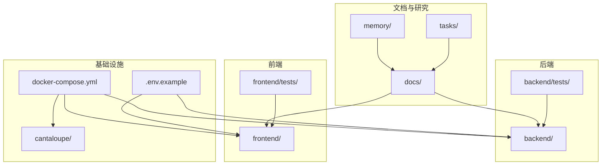
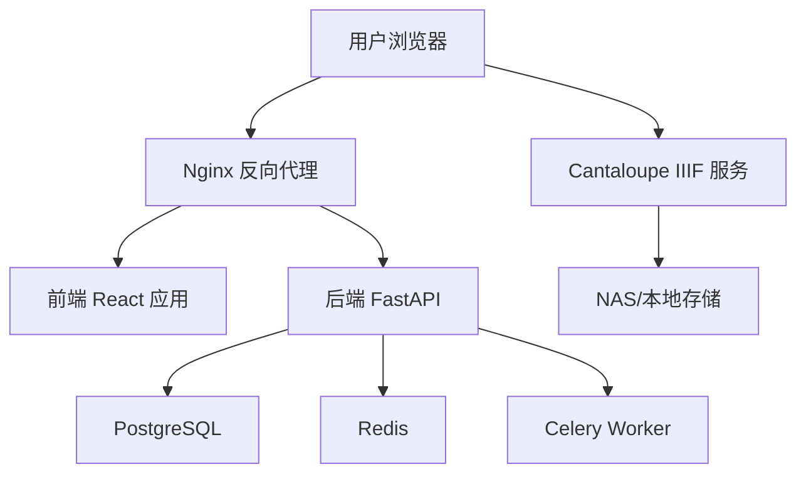
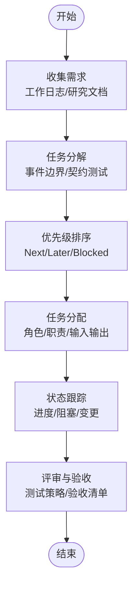
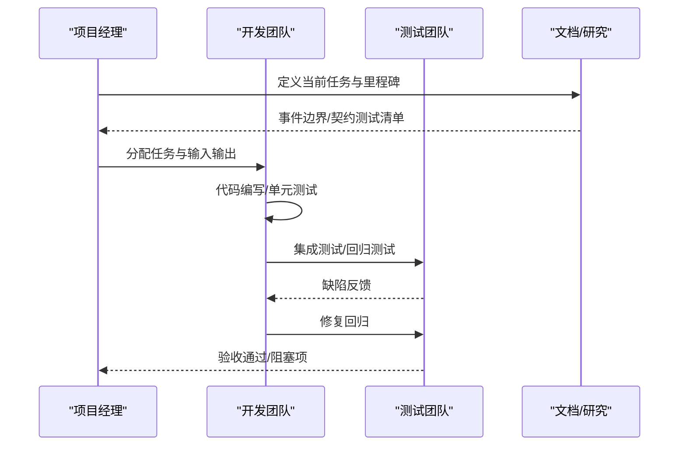
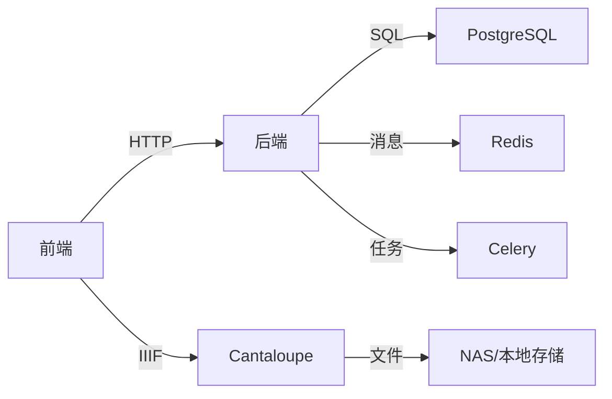

# 开发流程与任务管理

<cite>
**本文引用的文件**
- [README.md](file://README.md)
- [PROJECT_STATUS.md](file://docs/01-总览/PROJECT_STATUS.md)
- [WORK_LOG.md](file://docs/01-总览/WORK_LOG.md)
- [TESTING_STRATEGY.md](file://docs/01-总览/TESTING_STRATEGY.md)
- [ACCEPTANCE_CHECKLIST.md](file://docs/01-总览/ACCEPTANCE_CHECKLIST.md)
- [AI_DEVELOPMENT_GUIDE.md](file://docs/01-总览/AI_DEVELOPMENT_GUIDE.md)
- [IMAGE_RECORD_WORKBENCH_GUIDE.md](file://docs/03-产品与流程/IMAGE_RECORD_WORKBENCH_GUIDE.md)
- [SYSTEM_ARCHITECTURE.md](file://docs/02-架构设计/SYSTEM_ARCHITECTURE.md)
- [backlog.md](file://tasks/backlog.md)
- [current_task.md](file://tasks/current_task.md)
- [COLLAB_METHOD_FOR_REVIEW_AND_SKILLS.md](file://docs/08-研究/协作复盘与能力共建方法（COLLAB_METHOD_FOR_REVIEW_AND_SKILLS）.md)
- [DESIGN_DECISIONS.md](file://docs/08-研究/设计决策（DESIGN_DECISIONS）.md)
- [CURRENT_PROJECT_FACTS.md](file://docs/08-研究/当前项目事实（CURRENT_PROJECT_FACTS）.md)
- [PAPER_OUTLINE.md](file://docs/08-研究/论文大纲（PAPER_OUTLINE）.md)
- [.env.example](file://.env.example)
- [docker-compose.yml](file://docker-compose.yml)
</cite>

## 目录
1. [简介](#简介)
2. [项目结构](#项目结构)
3. [核心组件](#核心组件)
4. [架构总览](#架构总览)
5. [详细组件分析](#详细组件分析)
6. [依赖分析](#依赖分析)
7. [性能考量](#性能考量)
8. [故障排查指南](#故障排查指南)
9. [结论](#结论)
10. [附录](#附录)

## 简介
本文件面向MDAMS原型项目的开发流程与任务管理体系，基于仓库现有的工作日志、测试策略、项目状态、任务记忆与研究文档，系统化梳理从需求到交付的全流程规范，涵盖任务管理、开发周期、日常活动、质量保证、状态跟踪、风险与问题升级、跨团队协作与沟通机制，并配套模板与检查清单，帮助团队在原型阶段保持高可验证性与可复用性。

## 项目结构
仓库采用前后端分离与容器化架构，文档与任务记忆层清晰，测试策略与验收清单完备，支持可持续开发与演示验证。

**图表来源**
- [README.md:1-213](file://README.md#L1-L213)
- [docker-compose.yml](file://docker-compose.yml)
- [.env.example](file://.env.example)

**章节来源**
- [README.md:67-80](file://README.md#L67-L80)
- [docs/README.md:9-27](file://docs/README.md#L9-L27)

## 核心组件
- 任务与需求管理：通过任务记忆层（tasks/backlog.md、tasks/current_task.md）沉淀需求、分解任务、明确优先级与阻塞条件。
- 开发与测试：后端pytest分层测试、前端Playwright回归测试、工作日志驱动的变更记录与验证。
- 质量与验收：测试策略、验收清单、文档与测试命令一致性校验。
- 部署与环境：容器化编排、环境变量、图像服务配置与本地联调。
- 研究与协作：设计决策、协作复盘方法、论文大纲与项目事实，支撑持续对齐与知识沉淀。

**章节来源**
- [backlog.md:1-20](file://tasks/backlog.md#L1-L20)
- [current_task.md:1-36](file://tasks/current_task.md#L1-L36)
- [WORK_LOG.md:1-381](file://docs/01-总览/WORK_LOG.md#L1-L381)
- [TESTING_STRATEGY.md:1-192](file://docs/01-总览/TESTING_STRATEGY.md#L1-L192)
- [ACCEPTANCE_CHECKLIST.md:1-96](file://docs/01-总览/ACCEPTANCE_CHECKLIST.md#L1-L96)
- [AI_DEVELOPMENT_GUIDE.md:1-120](file://docs/01-总览/AI_DEVELOPMENT_GUIDE.md#L1-L120)

## 架构总览
系统采用前后端分离与容器化部署，后端以FastAPI提供REST API，前端React+AntD提供交互界面，Cantaloupe提供IIIF图像服务，PostgreSQL存储数据，Redis+Celery处理异步任务。

**图表来源**
- [SYSTEM_ARCHITECTURE.md:22-34](file://docs/02-架构设计/SYSTEM_ARCHITECTURE.md#L22-L34)
- [docker-compose.yml](file://docker-compose.yml)

**章节来源**
- [SYSTEM_ARCHITECTURE.md:16-68](file://docs/02-架构设计/SYSTEM_ARCHITECTURE.md#L16-L68)

## 详细组件分析

### 任务管理流程
- 需求收集：通过工作日志与研究文档沉淀事实与问题，形成“当前任务”与“待办清单”。
- 任务分解：将“跨子系统最小事件边界”等研究产出转化为detail层与contract tests可落地的实现点。
- 优先级排序：基于“Next/Later/Blocked”三段式清单，结合阻塞条件与输入输出明确优先级。
- 任务分配：结合角色权限矩阵与工作台职责，明确责任人与协作边界。

**图表来源**
- [WORK_LOG.md:1-381](file://docs/01-总览/WORK_LOG.md#L1-L381)
- [backlog.md:1-20](file://tasks/backlog.md#L1-L20)
- [current_task.md:1-36](file://tasks/current_task.md#L1-L36)
- [DESIGN_DECISIONS.md:16-40](file://docs/08-研究/设计决策（DESIGN_DECISIONS）.md#L16-L40)

**章节来源**
- [backlog.md:3-20](file://tasks/backlog.md#L3-L20)
- [current_task.md:3-36](file://tasks/current_task.md#L3-L36)
- [WORK_LOG.md:322-357](file://docs/01-总览/WORK_LOG.md#L322-L357)

### 开发周期管理
- 迭代计划：以“当前任务”为迭代目标，明确期望输出与完成标准，限定范围避免扩新功能与大规模重构。
- 里程碑设定：以阶段性研究产出（如“跨子系统最小事件边界”）为里程碑节点，推动从研究到实现的证据落点。
- 进度跟踪：通过工作日志记录每日变更范围、验证结果与备注，配合测试策略与验收清单进行回归验证。

**图表来源**
- [current_task.md:10-20](file://tasks/current_task.md#L10-L20)
- [TESTING_STRATEGY.md:78-96](file://docs/01-总览/TESTING_STRATEGY.md#L78-L96)
- [ACCEPTANCE_CHECKLIST.md:75-96](file://docs/01-总览/ACCEPTANCE_CHECKLIST.md#L75-L96)

**章节来源**
- [current_task.md:16-20](file://tasks/current_task.md#L16-L20)
- [TESTING_STRATEGY.md:146-173](file://docs/01-总览/TESTING_STRATEGY.md#L146-L173)
- [ACCEPTANCE_CHECKLIST.md:75-96](file://docs/01-总览/ACCEPTANCE_CHECKLIST.md#L75-L96)

### 日常开发活动
- 代码编写：遵循测试策略，新增功能至少补一个契约或集成测试；缺陷修复必须补回归测试。
- 单元测试：后端pytest分层（单元/契约/集成/smoke/子系统），前端eslint、构建与Playwright回归。
- 集成测试：覆盖关键happy path与跨模块行为，如权限、统一平台、图像记录、三维链路。
- 文档更新：工作日志与文档命令一致性校验，确保文档可执行且与实现对齐。

**章节来源**
- [TESTING_STRATEGY.md:80-96](file://docs/01-总览/TESTING_STRATEGY.md#L80-L96)
- [WORK_LOG.md:11-19](file://docs/01-总览/WORK_LOG.md#L11-L19)

### 质量保证流程
- 代码审查：通过测试覆盖率与回归用例保障质量，前端lint与构建检查作为门禁。
- 测试验证：按分层策略执行，重点覆盖配置、健康检查、权限与资源可见范围、图像记录拆分工作流、统一平台聚合、三维生产链路与AI交互基础行为。
- 性能评估：通过工作日志记录性能相关修复（如缩略图缓存失效、浏览器缓存切断、直连Cantaloupe优化）。

**章节来源**
- [TESTING_STRATEGY.md:134-192](file://docs/01-总览/TESTING_STRATEGY.md#L134-L192)
- [WORK_LOG.md:268-296](file://docs/01-总览/WORK_LOG.md#L268-L296)

### 任务状态跟踪与报告机制
- 状态跟踪：每日工作日志记录变更范围、验证结果与备注；任务记忆层维护Backlog与Current Task。
- 报告机制：项目状态文档定期核对范围与阶段定位，验收清单作为演示前检查基线。

**章节来源**
- [WORK_LOG.md:3-19](file://docs/01-总览/WORK_LOG.md#L3-L19)
- [PROJECT_STATUS.md:1-153](file://docs/01-总览/PROJECT_STATUS.md#L1-L153)
- [ACCEPTANCE_CHECKLIST.md:75-96](file://docs/01-总览/ACCEPTANCE_CHECKLIST.md#L75-L96)

### 风险管理与问题升级
- 风险识别：通过“Blocked”清单与协作复盘方法，识别目标层、对象层、边界层、流程层与表达层的偏差。
- 升级流程：当错误重复出现或影响范围扩大，通过设计决策记录与研究文档对齐，必要时形成技能化模板或工作清单。

**章节来源**
- [backlog.md:13-20](file://tasks/backlog.md#L13-L20)
- [COLLAB_METHOD_FOR_REVIEW_AND_SKILLS.md:82-116](file://docs/08-研究/协作复盘与能力共建方法（COLLAB_METHOD_FOR_REVIEW_AND_SKILLS）.md#L82-L116)
- [DESIGN_DECISIONS.md:16-40](file://docs/08-研究/设计决策（DESIGN_DECISIONS）.md#L16-L40)

### 跨团队协作与沟通
- 协作方法：每周复盘、soul讨论与技能化设计，确保错误转化为能力建设。
- 沟通机制：以“先目标，后细节；先对象，后字段；先边界，后标准落点”为讨论框架，避免陷入局部细节。

**章节来源**
- [COLLAB_METHOD_FOR_REVIEW_AND_SKILLS.md:118-147](file://docs/08-研究/协作复盘与能力共建方法（COLLAB_METHOD_FOR_REVIEW_AND_SKILLS）.md#L118-L147)

## 依赖分析
- 后端依赖：FastAPI、SQLAlchemy、Pydantic、Celery、Redis、PostgreSQL。
- 前端依赖：React、Vite、TypeScript、Ant Design、Mirador、model-viewer。
- 图像服务：Cantaloupe IIIF Server，依赖OpenJDK与多种底层处理器。
- 测试依赖：pytest、Playwright、eslint、构建工具链。

**图表来源**
- [SYSTEM_ARCHITECTURE.md:22-34](file://docs/02-架构设计/SYSTEM_ARCHITECTURE.md#L22-L34)
- [AI_DEVELOPMENT_GUIDE.md:22-38](file://docs/01-总览/AI_DEVELOPMENT_GUIDE.md#L22-L38)

**章节来源**
- [AI_DEVELOPMENT_GUIDE.md:11-38](file://docs/01-总览/AI_DEVELOPMENT_GUIDE.md#L11-L38)

## 性能考量
- 缓存与预览：缩略图缓存键与URL版本化、响应头禁用缓存，确保一致性与新鲜度。
- 直连优化：Mirador直连Cantaloupe减少代理绕行，预检请求白名单避免跨域干扰。
- 存储与处理：混合存储架构、SSD缓存与NAS大容量结合，针对N100内存限制优化。

**章节来源**
- [WORK_LOG.md:280-291](file://docs/01-总览/WORK_LOG.md#L280-L291)
- [WORK_LOG.md:268-279](file://docs/01-总览/WORK_LOG.md#L268-L279)
- [SYSTEM_ARCHITECTURE.md:62-68](file://docs/02-架构设计/SYSTEM_ARCHITECTURE.md#L62-L68)

## 故障排查指南
- 环境与依赖：确认系统级依赖（libvips、ffmpeg、GraphicsMagick）与Docker环境。
- 配置与URL：核对API_PUBLIC_URL、CANTALOUPE_PUBLIC_URL与Nginx代理路径。
- 数据库连接：检查容器健康、网络连通与TEST_DATABASE_URL。
- 图像服务：确认Cantaloupe处理器配置、缓存策略与NFS挂载。

**章节来源**
- [AI_DEVELOPMENT_GUIDE.md:46-63](file://docs/01-总览/AI_DEVELOPMENT_GUIDE.md#L46-L63)
- [AI_DEVELOPMENT_GUIDE.md:106-120](file://docs/01-总览/AI_DEVELOPMENT_GUIDE.md#L106-L120)

## 结论
MDAMS原型项目已形成以“可演示核心工作流”为核心的开发与任务管理体系，配合测试策略、验收清单与研究文档，实现了从需求到实现再到论文表达的闭环。建议在现有基础上进一步固化任务卡片模板、进度报告模板与问题升级流程，持续提升工程可复用性与研究可解释性。

## 附录

### 任务卡片模板
- 标题：简明描述要达成的目标
- 目标：明确期望输出（如detail层事件摘要、contract tests清单、论文方法说明）
- 为什么现在：说明推进时机与价值
- 输入：列出依赖的文档/代码/测试
- 范围：明确“不在本任务范围内”的事项
- 完成标准：可验证的交付物与映射关系
- 风险与阻塞：列出阻塞条件与缓解措施

**章节来源**
- [current_task.md:3-36](file://tasks/current_task.md#L3-L36)

### 进度报告模板
- 日期：YYYY-MM-DD
- 本周进展：按任务维度总结完成情况
- 下周计划：基于Backlog与当前任务规划
- 阻塞事项：列出阻塞项与责任人
- 验收状态：对照测试策略与验收清单

**章节来源**
- [TESTING_STRATEGY.md:184-192](file://docs/01-总览/TESTING_STRATEGY.md#L184-L192)
- [ACCEPTANCE_CHECKLIST.md:75-96](file://docs/01-总览/ACCEPTANCE_CHECKLIST.md#L75-L96)

### 验收检查清单（演示前）
- 环境与登录：compose健康、API/Health/Ready、登录上下文
- 二维影像：列表、详情、Manifest、Mirador、申请车与导出
- 三维资源：列表、聚合视图、Web查看器、对象关联
- 统一平台：目录筛选、详情跳转、角色可见性
- 权限与范围：菜单与资源可见性差异

**章节来源**
- [ACCEPTANCE_CHECKLIST.md:13-96](file://docs/01-总览/ACCEPTANCE_CHECKLIST.md#L13-L96)

### 测试执行顺序与命令
- 后端：pytest（统一PostgreSQL）、单文件测试
- 前端：lint → build → test
- 常用命令：见测试策略文档与README

**章节来源**
- [TESTING_STRATEGY.md:97-133](file://docs/01-总览/TESTING_STRATEGY.md#L97-L133)
- [README.md:143-168](file://README.md#L143-L168)

### 部署与环境配置要点
- 环境变量：API_PUBLIC_URL、CANTALOUPE_PUBLIC_URL、DATABASE_URL、VIPS_DISC_THRESHOLD
- 配置文件映射：Nginx与Cantaloupe配置
- 一键启动：docker-compose up -d --build

**章节来源**
- [AI_DEVELOPMENT_GUIDE.md:64-83](file://docs/01-总览/AI_DEVELOPMENT_GUIDE.md#L64-L83)
- [README.md:81-118](file://README.md#L81-L118)

### 论文与研究对齐
- 论文大纲：明确章节与贡献
- 当前项目事实：可验证的实现与演示链路
- 设计决策：支撑研究问题的工程取舍
- 协作复盘：将错误转化为能力建设

**章节来源**
- [PAPER_OUTLINE.md:1-59](file://docs/08-研究/论文大纲（PAPER_OUTLINE）.md#L1-L59)
- [CURRENT_PROJECT_FACTS.md:1-173](file://docs/08-研究/当前项目事实（CURRENT_PROJECT_FACTS）.md#L1-L173)
- [DESIGN_DECISIONS.md:1-110](file://docs/08-研究/设计决策（DESIGN_DECISIONS）.md#L1-L110)
- [COLLAB_METHOD_FOR_REVIEW_AND_SKILLS.md:1-281](file://docs/08-研究/协作复盘与能力共建方法（COLLAB_METHOD_FOR_REVIEW_AND_SKILLS）.md#L1-L281)