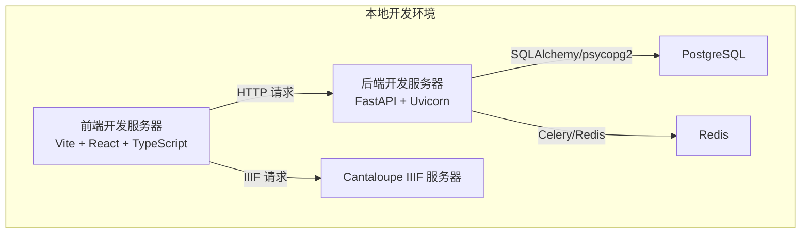
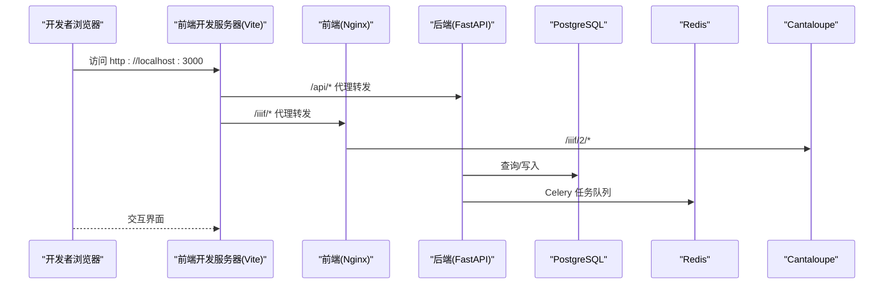
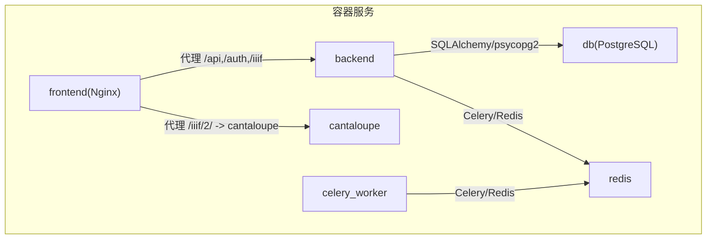

# 开发环境搭建

<cite>
**本文引用的文件**
- [README.md](file://README.md)
- [.env.example](file://.env.example)
- [docker-compose.yml](file://docker-compose.yml)
- [backend/Dockerfile](file://backend/Dockerfile)
- [frontend/Dockerfile](file://frontend/Dockerfile)
- [backend/requirements.txt](file://backend/requirements.txt)
- [frontend/package.json](file://frontend/package.json)
- [docs/05-部署与运维/SETUP_AND_DEPLOYMENT.md](file://docs/05-部署与运维/SETUP_AND_DEPLOYMENT.md)
- [docs/05-部署与运维/TROUBLESHOOTING.md](file://docs/05-部署与运维/TROUBLESHOOTING.md)
- [setup_git_local.ps1](file://setup_git_local.ps1)
- [manage_local_postgres.ps1](file://manage_local_postgres.ps1)
- [pytest.ini](file://pytest.ini)
- [frontend/playwright.config.ts](file://frontend/playwright.config.ts)
- [frontend/vite.config.ts](file://frontend/vite.config.ts)
</cite>

## 目录
1. [简介](#简介)
2. [项目结构](#项目结构)
3. [核心组件](#核心组件)
4. [架构概览](#架构概览)
5. [详细组件分析](#详细组件分析)
6. [依赖分析](#依赖分析)
7. [性能考虑](#性能考虑)
8. [故障排查指南](#故障排查指南)
9. [结论](#结论)
10. [附录](#附录)

## 简介
本指南面向MDAMS原型项目的本地开发环境搭建，目标是帮助开发者快速完成从零到可运行的开发环境准备，涵盖必需软件安装、项目克隆与初始化、IDE配置、容器化开发环境使用、开发服务器启动与停止、常见问题排查以及开发环境验证清单。

## 项目结构
该项目采用前后端分离与容器化服务编排的结构：
- 前端：React 18 + Vite + TypeScript + Ant Design，使用Playwright进行回归测试
- 后端：FastAPI + SQLAlchemy + Pydantic，异步任务使用Celery + Redis
- 数据库：PostgreSQL
- 图像服务：Cantaloupe IIIF Server
- 容器编排：Docker Compose，包含后端、Celery Worker、Redis、前端(Nginx)、PostgreSQL、Cantaloupe等服务

**图表来源**
- [docker-compose.yml:1-131](file://docker-compose.yml#L1-L131)
- [frontend/vite.config.ts:22-41](file://frontend/vite.config.ts#L22-L41)
- [backend/Dockerfile:1-52](file://backend/Dockerfile#L1-L52)

**章节来源**
- [README.md:56-66](file://README.md#L56-L66)
- [docker-compose.yml:1-131](file://docker-compose.yml#L1-L131)

## 核心组件
- 环境变量与配置
  - 使用 .env.example 作为模板，复制为 .env 并根据本机环境调整关键变量（数据库、Redis、API_PUBLIC_URL、CANTALOUPE_PUBLIC_URL、HOST_MUSEUM_PATH 等）
  - 关键变量参考：[环境变量定义:1-77](file://.env.example#L1-L77)
- 容器编排
  - 服务包括 backend、celery_worker、redis、frontend(Nginx)、db(PostgreSQL)、cantaloupe
  - 端口映射与卷挂载均在 docker-compose.yml 中定义
  - 参考：[服务与端口映射:1-131](file://docker-compose.yml#L1-L131)
- 前端
  - Vite 开发服务器，代理 /api、/auth、/iiif 到后端
  - Playwright 测试配置，支持多浏览器设备
  - 参考：[Vite 代理配置:22-41](file://frontend/vite.config.ts#L22-L41)，[Playwright 配置:1-36](file://frontend/playwright.config.ts#L1-L36)
- 后端
  - Python 3.12 基础镜像，安装 libvips、ImageMagick 等图像处理依赖
  - uvicorn 启动 FastAPI 应用
  - 参考：[后端 Dockerfile:1-52](file://backend/Dockerfile#L1-L52)，[依赖清单:1-18](file://backend/requirements.txt#L1-L18)
- 数据库与测试
  - PostgreSQL 16；提供本地独立 Postgres 管理脚本
  - 参考：[本地 Postgres 管理脚本:1-98](file://manage_local_postgres.ps1#L1-L98)
- 测试与标记
  - pytest.ini 定义测试标记，便于分类执行
  - 参考：[pytest 标记:1-9](file://pytest.ini#L1-L9)

**章节来源**
- [.env.example:1-77](file://.env.example#L1-L77)
- [docker-compose.yml:1-131](file://docker-compose.yml#L1-L131)
- [frontend/vite.config.ts:1-42](file://frontend/vite.config.ts#L1-L42)
- [frontend/playwright.config.ts:1-36](file://frontend/playwright.config.ts#L1-L36)
- [backend/Dockerfile:1-52](file://backend/Dockerfile#L1-L52)
- [backend/requirements.txt:1-18](file://backend/requirements.txt#L1-L18)
- [manage_local_postgres.ps1:1-98](file://manage_local_postgres.ps1#L1-L98)
- [pytest.ini:1-9](file://pytest.ini#L1-L9)

## 架构概览
下图展示了本地开发时的请求流向与服务交互：

**图表来源**
- [docker-compose.yml:72-82](file://docker-compose.yml#L72-L82)
- [frontend/vite.config.ts:22-41](file://frontend/vite.config.ts#L22-L41)
- [frontend/nginx.conf](file://frontend/nginx.conf)

## 详细组件分析

### 1) 必需软件与前置条件
- Python 3.9+（推荐使用 3.12，容器中使用 3.12-slim）
- Node.js 18（前端使用）
- Docker 与 Docker Compose（容器化）
- PostgreSQL（本地或容器）
- Git（版本控制）

上述技术栈与组件在项目 README 与容器配置中有明确说明。

**章节来源**
- [README.md:56-66](file://README.md#L56-L66)
- [backend/Dockerfile:1-1](file://backend/Dockerfile#L1-L1)
- [frontend/Dockerfile:2-2](file://frontend/Dockerfile#L2-L2)

### 2) 项目克隆与初始化
- 克隆仓库后，复制环境变量模板为 .env，并按需修改关键变量
  - 参考：[复制与检查环境变量:113-128](file://docs/05-部署与运维/SETUP_AND_DEPLOYMENT.md#L113-L128)
- 初始化 Git 仓库（可选）
  - 参考：[本地 Git 初始化脚本:1-29](file://setup_git_local.ps1#L1-L29)

**章节来源**
- [docs/05-部署与运维/SETUP_AND_DEPLOYMENT.md:113-128](file://docs/05-部署与运维/SETUP_AND_DEPLOYMENT.md#L113-L128)
- [setup_git_local.ps1:1-29](file://setup_git_local.ps1#L1-L29)

### 3) 依赖安装与环境变量设置
- 后端依赖
  - 使用 requirements.txt 安装 Python 依赖
  - 参考：[依赖清单:1-18](file://backend/requirements.txt#L1-L18)
- 前端依赖
  - 使用 package.json 安装 Node 依赖
  - 参考：[前端依赖:1-42](file://frontend/package.json#L1-L42)
- 环境变量
  - 至少确认以下变量：HOST_MUSEUM_PATH、DATABASE_URL、REDIS_URL、API_PUBLIC_URL、CANTALOUPE_PUBLIC_URL
  - 参考：[环境变量模板:1-77](file://.env.example#L1-L77)

**章节来源**
- [backend/requirements.txt:1-18](file://backend/requirements.txt#L1-L18)
- [frontend/package.json:1-42](file://frontend/package.json#L1-L42)
- [.env.example:1-77](file://.env.example#L1-L77)

### 4) IDE 配置推荐
- VS Code
  - 插件：TypeScript/JavaScript、Python、ESLint、Prettier、EditorConfig、Docker、PostgreSQL
  - 调试：为后端配置 Python 调试，为前端配置 Vite 开发服务器调试
  - 代码格式化：ESLint + Prettier，保存时自动格式化
- PyCharm
  - 使用 Python 解释器（容器内或本地）
  - 配置 pytest 为测试框架，启用标记过滤
  - 代码风格：遵循项目 ESLint/TS 配置

注：本节为通用实践建议，不直接引用具体文件。

### 5) Docker 容器化开发环境
- 启动
  - 使用 docker compose 启动所有服务并后台运行
  - 参考：[启动命令:137-141](file://docs/05-部署与运维/SETUP_AND_DEPLOYMENT.md#L137-L141)
- 停止
  - 停止并移除容器：docker compose down
  - 参考：[停止命令:137-141](file://docs/05-部署与运维/SETUP_AND_DEPLOYMENT.md#L137-L141)
- 日志查看
  - 后端：docker compose logs backend
  - 前端：docker compose logs frontend
  - 数据库：docker compose logs db
  - Redis：docker compose logs redis
  - 参考：[日志命令:28-84](file://docs/05-部署与运维/TROUBLESHOOTING.md#L28-L84)

**章节来源**
- [docs/05-部署与运维/SETUP_AND_DEPLOYMENT.md:137-141](file://docs/05-部署与运维/SETUP_AND_DEPLOYMENT.md#L137-L141)
- [docs/05-部署与运维/TROUBLESHOOTING.md:28-84](file://docs/05-部署与运维/TROUBLESHOOTING.md#L28-L84)

### 6) 开发服务器启动与停止
- 前端开发服务器
  - 在 frontend 目录执行 npm run dev，监听 3000 端口
  - Vite 代理 /api、/auth、/iiif 到后端
  - 参考：[Vite 配置:22-41](file://frontend/vite.config.ts#L22-L41)
- 后端开发服务器
  - 在 backend 目录执行 uvicorn（容器内由 Dockerfile 指定 CMD）
  - 参考：[后端 Dockerfile CMD:51-52](file://backend/Dockerfile#L51-L52)
- 停止
  - 前端：Ctrl+C 停止 Vite
  - 后端：容器内 Ctrl+C 或 docker compose stop

**章节来源**
- [frontend/vite.config.ts:22-41](file://frontend/vite.config.ts#L22-L41)
- [backend/Dockerfile:51-52](file://backend/Dockerfile#L51-L52)

### 7) 本地独立 PostgreSQL（可选）
- 使用提供的 PowerShell 脚本启动/停止/查看状态/查看日志/重置本地测试库
- 参考：[本地 Postgres 管理脚本:1-98](file://manage_local_postgres.ps1#L1-L98)

**章节来源**
- [manage_local_postgres.ps1:1-98](file://manage_local_postgres.ps1#L1-L98)

### 8) 测试与验证
- 后端测试
  - 使用 pytest，支持标记过滤（unit、contract、integration、smoke、system）
  - 参考：[pytest.ini:1-9](file://pytest.ini#L1-L9)
- 前端测试
  - 使用 Playwright，支持多浏览器设备，自动启动本地开发服务器
  - 参考：[Playwright 配置:1-36](file://frontend/playwright.config.ts#L1-L36)

**章节来源**
- [pytest.ini:1-9](file://pytest.ini#L1-L9)
- [frontend/playwright.config.ts:1-36](file://frontend/playwright.config.ts#L1-L36)

## 依赖分析
- 组件耦合
  - 前端通过代理访问后端 API 与 IIIF 资源，后端依赖数据库与 Redis
  - 前端 Nginx 代理将 /iiif/2/* 转发至 Cantaloupe
- 外部依赖
  - PostgreSQL、Redis、Cantaloupe、Node 18、Python 3.12
- 端口与卷
  - 端口映射与卷挂载在 docker-compose.yml 中集中管理
  - 参考：[端口与卷:6-127](file://docker-compose.yml#L6-L127)

**图表来源**
- [docker-compose.yml:1-131](file://docker-compose.yml#L1-L131)

**章节来源**
- [docker-compose.yml:1-131](file://docker-compose.yml#L1-L131)

## 性能考虑
- 图像处理优化
  - 容器内对 ImageMagick 安全策略放宽，提升大图处理能力
  - libvips 并发与磁盘阈值参数可在 .env 中调整
  - 参考：[后端 Dockerfile 中的 ImageMagick 与 libvips 配置:18-41](file://backend/Dockerfile#L18-L41)，[VIPS 参数:65-67](file://.env.example#L65-L67)
- JVM 参数
  - Cantaloupe 使用 JAVA_OPTS 控制内存上限与熵源
  - 参考：[JAVA_OPTS:67-67](file://.env.example#L67-L67)
- 前端构建内存
  - Vite 构建时通过 NODE_OPTIONS 提升内存上限
  - 参考：[前端 Dockerfile 中的 NODE_OPTIONS:15-17](file://frontend/Dockerfile#L15-L17)

**章节来源**
- [backend/Dockerfile:18-41](file://backend/Dockerfile#L18-L41)
- [.env.example:65-67](file://.env.example#L65-L67)
- [frontend/Dockerfile:15-17](file://frontend/Dockerfile#L15-L17)

## 故障排查指南
- 建议排查顺序
  - 阅读部署与配置文档，确认 .env 与当前机器环境一致
  - 执行 docker compose ps 检查服务状态
  - 访问后端健康检查与就绪检查接口
  - 查看具体模块日志
  - 参考：[建议排查顺序:6-15](file://docs/05-部署与运维/TROUBLESHOOTING.md#L6-L15)
- 常见问题
  - 前端打不开：检查前端容器状态与端口占用
  - 后端健康检查失败：检查 DATABASE_URL、REDIS_URL、后端日志
  - 数据库连不上：检查 db 容器状态、认证信息与端口占用
  - Redis 或 worker 异常：检查 redis 状态与 worker 日志
  - 上传后文件找不到：检查 HOST_MUSEUM_PATH 与挂载路径
  - 预览失败：检查 CANTALOUPE_PUBLIC_URL、Nginx 代理、Cantaloupe 状态
  - 参考：[常见问题:16-242](file://docs/05-部署与运维/TROUBLESHOOTING.md#L16-L242)

**章节来源**
- [docs/05-部署与运维/TROUBLESHOOTING.md:6-15](file://docs/05-部署与运维/TROUBLESHOOTING.md#L6-L15)
- [docs/05-部署与运维/TROUBLESHOOTING.md:16-242](file://docs/05-部署与运维/TROUBLESHOOTING.md#L16-L242)

## 结论
通过本指南，您可以基于 Docker Compose 快速搭建 MDAMS 原型的本地开发环境，理解前后端服务的交互方式与关键配置项，并掌握常见问题的排查流程。建议在完成初始搭建后，按照“开发环境验证清单”逐项验证功能，确保开发体验顺畅。

## 附录

### A. 开发环境验证清单
- 环境变量
  - 已复制 .env.example 为 .env
  - 已检查并确认以下变量：HOST_MUSEUM_PATH、DATABASE_URL、REDIS_URL、API_PUBLIC_URL、CANTALOUPE_PUBLIC_URL
  - 参考：[环境变量模板:1-77](file://.env.example#L1-L77)
- 容器服务
  - docker compose ps 显示所有服务处于运行状态
  - 健康检查：http://localhost:8000/health 与 http://localhost:8000/ready 返回成功
  - 参考：[启动与验证步骤:153-165](file://docs/05-部署与运维/SETUP_AND_DEPLOYMENT.md#L153-L165)
- 前端
  - 访问 http://localhost:3000，页面可正常加载
  - 代理 /api、/auth、/iiif 正常转发
  - 参考：[Vite 代理配置:22-41](file://frontend/vite.config.ts#L22-L41)
- 后端
  - 后端服务可响应 API 文档与健康检查
  - 参考：[后端 Dockerfile:51-52](file://backend/Dockerfile#L51-L52)
- 数据库与 Redis
  - 数据库连接正常，Redis 可用
  - 参考：[日志查看命令:28-84](file://docs/05-部署与运维/TROUBLESHOOTING.md#L28-L84)
- IIIF 与 Cantaloupe
  - 访问 http://localhost:8182，IIIF 服务可访问
  - 前端通过 /iiif/2/ 代理访问 IIIF 资源
  - 参考：[Cantaloupe 服务:103-128](file://docker-compose.yml#L103-L128)

**章节来源**
- [.env.example:1-77](file://.env.example#L1-L77)
- [docs/05-部署与运维/SETUP_AND_DEPLOYMENT.md:153-165](file://docs/05-部署与运维/SETUP_AND_DEPLOYMENT.md#L153-L165)
- [frontend/vite.config.ts:22-41](file://frontend/vite.config.ts#L22-L41)
- [backend/Dockerfile:51-52](file://backend/Dockerfile#L51-L52)
- [docker-compose.yml:103-128](file://docker-compose.yml#L103-L128)
- [docs/05-部署与运维/TROUBLESHOOTING.md:28-84](file://docs/05-部署与运维/TROUBLESHOOTING.md#L28-L84)