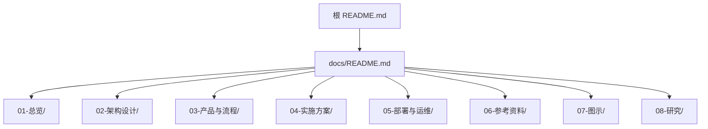
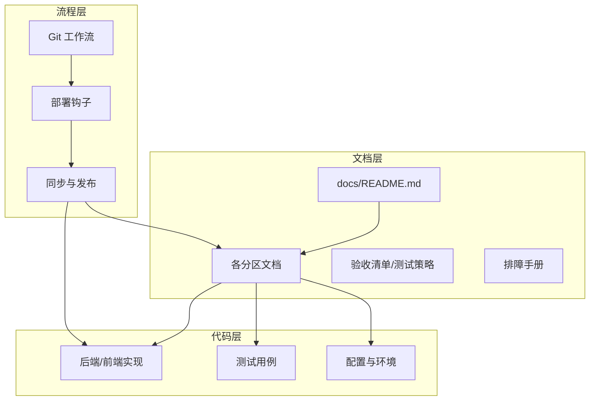
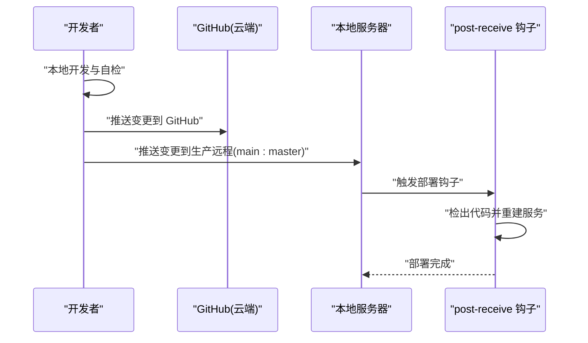
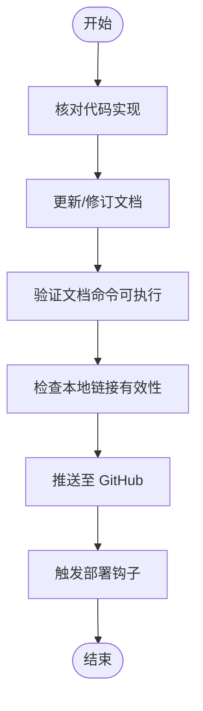
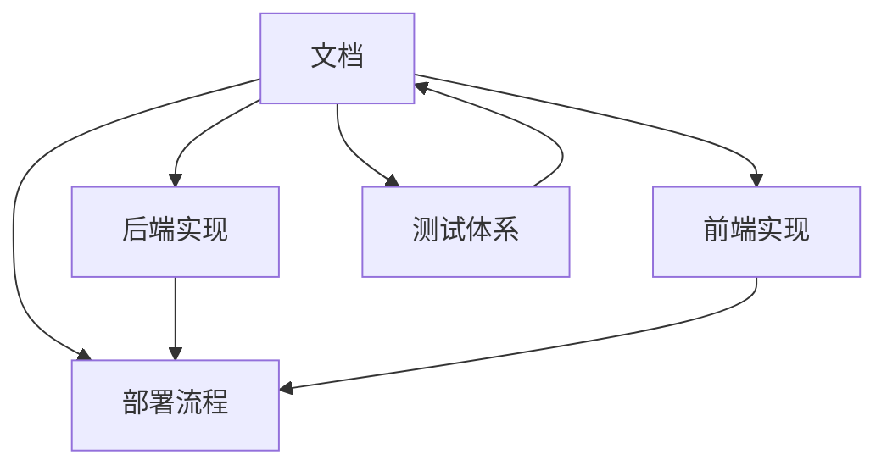

# 文档维护与更新机制

<cite>
**本文引用的文件**
- [README.md](file://README.md)
- [docs/README.md](file://docs/README.md)
- [ARCHITECTURE.md](file://ARCHITECTURE.md)
- [SYSTEM_ARCHITECTURE.md](file://SYSTEM_ARCHITECTURE.md)
- [DEPLOYMENT.md](file://DEPLOYMENT.md)
- [docs/01-总览/PROJECT_STATUS.md](file://docs/01-总览/PROJECT_STATUS.md)
- [docs/01-总览/TESTING_STRATEGY.md](file://docs/01-总览/TESTING_STRATEGY.md)
- [docs/01-总览/ACCEPTANCE_CHECKLIST.md](file://docs/01-总览/ACCEPTANCE_CHECKLIST.md)
- [docs/01-总览/AI_DEVELOPMENT_GUIDE.md](file://docs/01-总览/AI_DEVELOPMENT_GUIDE.md)
- [docs/03-产品与流程/USER_ROLE_PERMISSION_MATRIX.md](file://docs/03-产品与流程/USER_ROLE_PERMISSION_MATRIX.md)
- [docs/05-部署与运维/GIT_DEPLOY_GUIDE.md](file://docs/05-部署与运维/GIT_DEPLOY_GUIDE.md)
- [docs/05-部署与运维/TROUBLESHOOTING.md](file://docs/05-部署与运维/TROUBLESHOOTING.md)
- [.gitignore](file://.gitignore)
</cite>

## 目录
1. [简介](#简介)
2. [项目结构](#项目结构)
3. [核心组件](#核心组件)
4. [架构总览](#架构总览)
5. [详细组件分析](#详细组件分析)
6. [依赖分析](#依赖分析)
7. [性能考虑](#性能考虑)
8. [故障排查指南](#故障排查指南)
9. [结论](#结论)
10. [附录](#附录)

## 简介
本文件为 MDAMS 原型项目的“文档维护与更新机制”专项文档，聚焦于文档分类与组织、编写规范、版本管理与同步、质量控制、贡献指南、搜索与导航优化、文档与代码同步机制，以及配套模板与检查清单。目标是建立一套可执行、可追溯、可持续演进的文档治理体系，确保文档与代码、流程、测试保持一致，降低知识传递成本，提升团队协作效率。

## 项目结构
项目采用“docs/ 为正式文档主目录”的统一入口，配合根 README 提供快速通道。文档按主题分区组织，涵盖总览、架构设计、产品与流程、实施方案、部署与运维、参考资料、图示、研究等八大板块，便于读者按需检索与学习。

**图表来源**
- [docs/README.md:1-76](file://docs/README.md#L1-L76)
- [README.md:188-213](file://README.md#L188-L213)

**章节来源**
- [docs/README.md:1-76](file://docs/README.md#L1-L76)
- [README.md:67-80](file://README.md#L67-L80)

## 核心组件
- 文档入口与索引：docs/README.md 作为正式文档总入口，提供目录结构、建议阅读顺序与核心入口清单。
- 分区化组织：按“总览、架构设计、产品与流程、实施方案、部署与运维、参考资料、图示、研究”划分，确保主题清晰、职责明确。
- 与代码协同：文档中大量引用后端路由、前端组件、测试文件与配置，强调“以实现为准”的事实来源。
- 版本与同步：通过 Git Push-to-Deploy 工作流与部署钩子，实现文档与代码的同步发布。
- 质量保障：测试策略、验收清单与排障手册共同构成文档质量控制闭环。

**章节来源**
- [docs/README.md:9-26](file://docs/README.md#L9-L26)
- [docs/01-总览/PROJECT_STATUS.md:109-116](file://docs/01-总览/PROJECT_STATUS.md#L109-L116)
- [docs/05-部署与运维/GIT_DEPLOY_GUIDE.md:19-50](file://docs/05-部署与运维/GIT_DEPLOY_GUIDE.md#L19-L50)

## 架构总览
文档维护与更新机制的总体架构围绕“入口统一、分区有序、事实驱动、流程闭环”展开，结合 Git 工作流与部署钩子，确保文档与代码同步演进。

**图表来源**
- [docs/README.md:1-76](file://docs/README.md#L1-L76)
- [docs/01-总览/TESTING_STRATEGY.md:134-192](file://docs/01-总览/TESTING_STRATEGY.md#L134-L192)
- [docs/05-部署与运维/GIT_DEPLOY_GUIDE.md:19-50](file://docs/05-部署与运维/GIT_DEPLOY_GUIDE.md#L19-L50)

## 详细组件分析

### 文档分类与组织结构
- 总览（01-总览）：项目状态、测试策略、验收清单、工作日志、AI 开发指南等，提供宏观视角与基础事实。
- 架构设计（02-架构设计）：系统架构、API 路由、认证与 IIIF 集成、数据采集架构、平台适配器等，支撑技术决策与实现。
- 产品与流程（03-产品与流程）：角色权限矩阵、菜单可见性矩阵、工作流指南、图像记录工作台指南等，连接业务与技术。
- 实施方案（04-实施方案）：各阶段实施基线与归档方案，沉淀阶段性成果与经验。
- 部署与运维（05-部署与运维）：部署指南、环境变量、Git Push-to-Deploy、脚本与作业、排障手册等，保障可运维性。
- 参考资料（06-参考资料）：元数据参考、样例、导入映射等，提供权威参考。
- 图示（07-图示）：架构图与图源文件，辅助理解与沟通。
- 研究（08-研究）：研究计划、标准映射、评估框架等，推动理论与实践融合。

**章节来源**
- [docs/README.md:9-26](file://docs/README.md#L9-L26)
- [docs/01-总览/PROJECT_STATUS.md:109-116](file://docs/01-总览/PROJECT_STATUS.md#L109-L116)

### 文档编写规范
- 模板格式
  - 标题层级：使用统一的标题层级，确保层次清晰。
  - 目录与索引：在文档顶部提供目录与索引，便于导航。
  - 引用与链接：优先使用相对链接，确保本地与线上一致性；对关键实现进行文件路径引用。
- 语言风格
  - 以事实为准：所有结论以代码实现为准，避免主观臆测。
  - 简洁明了：使用短句与要点式表达，突出关键信息。
  - 术语统一：同一概念在全文保持一致表述。
- 图表标准
  - 使用 Mermaid 图表描述架构与流程，确保可读性与一致性。
  - 图表与正文一一对应，配有简要说明与来源标注。

**章节来源**
- [docs/01-总览/TESTING_STRATEGY.md:10-16](file://docs/01-总览/TESTING_STRATEGY.md#L10-L16)
- [docs/01-总览/AI_DEVELOPMENT_GUIDE.md:1-120](file://docs/01-总览/AI_DEVELOPMENT_GUIDE.md#L1-L120)
- [ARCHITECTURE.md:1-90](file://ARCHITECTURE.md#L1-L90)

### 文档版本管理与同步机制
- Git 工作流
  - 本地开发：在本地完成变更与自检，提交到本地分支。
  - 云端备份：推送到 GitHub 作为备份与协作中心。
  - 生产触发：通过 Git Push-to-Deploy 将变更推送到本地服务器，触发部署钩子。
- 部署钩子
  - 服务器端配置 bare 仓库与 post-receive 钩子，自动检出代码并重建服务。
  - 钩子日志用于问题定位与审计。
- 变更追踪
  - 通过提交信息与工作日志记录变更范围、验证结果与备注，确保可追溯。
  - 对关键文档（如 README、项目状态、测试策略、部署说明）进行人工核对，避免与实现脱节。

**图表来源**
- [docs/05-部署与运维/GIT_DEPLOY_GUIDE.md:19-50](file://docs/05-部署与运维/GIT_DEPLOY_GUIDE.md#L19-L50)

**章节来源**
- [docs/05-部署与运维/GIT_DEPLOY_GUIDE.md:1-78](file://docs/05-部署与运维/GIT_DEPLOY_GUIDE.md#L1-L78)
- [docs/05-部署与运维/TROUBLESHOOTING.md:71-78](file://docs/05-部署与运维/TROUBLESHOOTING.md#L71-L78)
- [docs/01-总览/WORK_LOG.md:310-314](file://docs/01-总览/WORK_LOG.md#L310-L314)

### 文档质量控制流程
- 审核标准
  - 以实现为准：所有结论与说明必须与代码实现一致。
  - 关键命令可执行：文档中列出的命令应能在当前环境中直接执行并通过。
  - 链接有效：本地链接检查无断链。
- 更新频率
  - 随实现同步更新：新增功能或变更后及时补充或修订文档。
  - 定期核对：按月/季度对核心文档进行核对与梳理。
- 维护责任
  - 按分区负责：各分区文档由相应模块负责人或领域专家维护。
  - 跨模块协调：涉及多模块的变更由技术负责人协调统一。

**章节来源**
- [docs/01-总览/TESTING_STRATEGY.md:184-192](file://docs/01-总览/TESTING_STRATEGY.md#L184-L192)
- [docs/01-总览/ACCEPTANCE_CHECKLIST.md:75-96](file://docs/01-总览/ACCEPTANCE_CHECKLIST.md#L75-L96)
- [docs/01-总览/PROJECT_STATUS.md:147-153](file://docs/01-总览/PROJECT_STATUS.md#L147-L153)

### 文档贡献指南
- 编写要求
  - 以实现为准：所有技术说明必须与代码实现一致。
  - 结构清晰：遵循分区组织与标题层级规范。
  - 图表规范：使用 Mermaid 图表并标注来源。
- 提交流程
  - 在本地完成自检与核对，确保命令可执行、链接有效。
  - 提交到 GitHub，等待审查与合并。
- 评审标准
  - 事实一致性：与实现一致。
  - 可操作性：命令与步骤可执行。
  - 可读性：语言简洁、结构清晰、图表规范。

**章节来源**
- [docs/01-总览/AI_DEVELOPMENT_GUIDE.md:84-120](file://docs/01-总览/AI_DEVELOPMENT_GUIDE.md#L84-L120)
- [docs/01-总览/TESTING_STRATEGY.md:146-173](file://docs/01-总览/TESTING_STRATEGY.md#L146-L173)

### 文档搜索与导航优化策略
- 统一入口：以 docs/README.md 为单一正式入口，减少重复入口导致的认知负担。
- 分区导航：按主题分区组织，提供清晰的导航路径与建议阅读顺序。
- 关键词与标签：在文档中使用关键词与标签，便于检索与关联。
- 链接一致性：确保文档间与文档与代码间的链接稳定可靠，定期检查断链。

**章节来源**
- [docs/README.md:28-38](file://docs/README.md#L28-L38)
- [docs/01-总览/PROJECT_STATUS.md:147-153](file://docs/01-总览/PROJECT_STATUS.md#L147-L153)

### 文档与代码同步维护机制
- 以实现为准的事实来源：权限矩阵、API 路由、测试策略等均以代码实现为依据。
- 测试与文档联动：测试策略覆盖关键模块，文档中列出的命令与测试用例相互印证。
- 部署与发布：通过 Git Push-to-Deploy 与钩子实现文档与代码同步发布，确保一致性。

**图表来源**
- [docs/01-总览/TESTING_STRATEGY.md:134-192](file://docs/01-总览/TESTING_STRATEGY.md#L134-L192)
- [docs/05-部署与运维/GIT_DEPLOY_GUIDE.md:19-50](file://docs/05-部署与运维/GIT_DEPLOY_GUIDE.md#L19-L50)

**章节来源**
- [docs/03-产品与流程/USER_ROLE_PERMISSION_MATRIX.md:1-194](file://docs/03-产品与流程/USER_ROLE_PERMISSION_MATRIX.md#L1-L194)
- [docs/01-总览/TESTING_STRATEGY.md:134-192](file://docs/01-总览/TESTING_STRATEGY.md#L134-L192)

## 依赖分析
文档维护机制与项目其他组件存在紧密耦合关系：
- 与后端/前端实现：权限矩阵、API 路由、菜单可见性等以代码实现为准。
- 与测试体系：测试策略与验收清单共同保障文档质量与可验证性。
- 与部署流程：Git Push-to-Deploy 与钩子确保文档与代码同步发布。

**图表来源**
- [docs/03-产品与流程/USER_ROLE_PERMISSION_MATRIX.md:1-194](file://docs/03-产品与流程/USER_ROLE_PERMISSION_MATRIX.md#L1-L194)
- [docs/01-总览/TESTING_STRATEGY.md:134-192](file://docs/01-总览/TESTING_STRATEGY.md#L134-L192)
- [docs/05-部署与运维/GIT_DEPLOY_GUIDE.md:19-50](file://docs/05-部署与运维/GIT_DEPLOY_GUIDE.md#L19-L50)

**章节来源**
- [docs/03-产品与流程/USER_ROLE_PERMISSION_MATRIX.md:1-194](file://docs/03-产品与流程/USER_ROLE_PERMISSION_MATRIX.md#L1-L194)
- [docs/01-总览/TESTING_STRATEGY.md:134-192](file://docs/01-总览/TESTING_STRATEGY.md#L134-L192)

## 性能考虑
- 文档体积与加载：采用分区组织与统一入口，减少一次性加载压力。
- 链接与导航：清晰的目录与分区导航提升检索效率。
- 发布与同步：通过 Git Push-to-Deploy 与钩子实现快速同步，降低维护成本。

## 故障排查指南
- 启动类问题：优先检查容器状态、健康检查与环境变量。
- 资源与挂载问题：确认路径映射、目录可写与预览图生成。
- IIIF 与 Mirador 问题：检查服务地址、代理配置与资源可见范围。
- 登录与权限问题：核对用户角色、权限判定与菜单可见性。
- 申请与导出问题：确认用户权限与流程状态。

**章节来源**
- [docs/05-部署与运维/TROUBLESHOOTING.md:6-242](file://docs/05-部署与运维/TROUBLESHOOTING.md#L6-L242)

## 结论
通过统一的文档入口、分区化的组织结构、以实现为准的编写规范、严格的测试与验收流程、以及 Git Push-to-Deploy 的同步机制，MDAMS 原型项目建立了可执行、可追溯、可持续演进的文档维护与更新机制。建议持续完善分区文档覆盖度，强化跨模块协同与质量控制，确保文档始终与代码、流程、测试保持一致。

## 附录

### 文档模板与检查清单
- 文档模板
  - 标题层级：统一使用 H1-H3 标题，确保层次清晰。
  - 目录与索引：在文档顶部提供目录与索引。
  - 引用与链接：优先使用相对链接，关键实现使用文件路径引用。
  - 图表：使用 Mermaid 图表并标注来源。
- 检查清单
  - 事实一致性：与代码实现一致。
  - 命令可执行：文档中列出的命令可直接执行并通过。
  - 链接有效：本地链接检查无断链。
  - 结构清晰：分区明确、导航顺畅。

**章节来源**
- [docs/01-总览/TESTING_STRATEGY.md:184-192](file://docs/01-总览/TESTING_STRATEGY.md#L184-L192)
- [docs/01-总览/ACCEPTANCE_CHECKLIST.md:75-96](file://docs/01-总览/ACCEPTANCE_CHECKLIST.md#L75-L96)