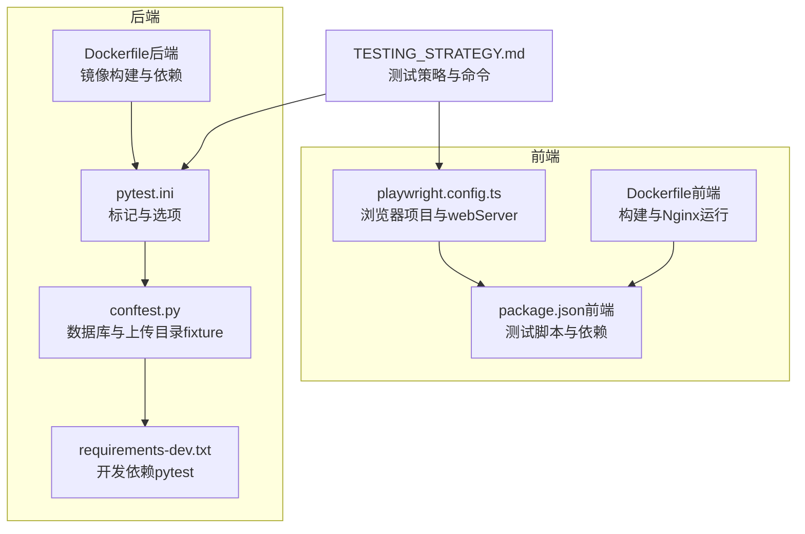
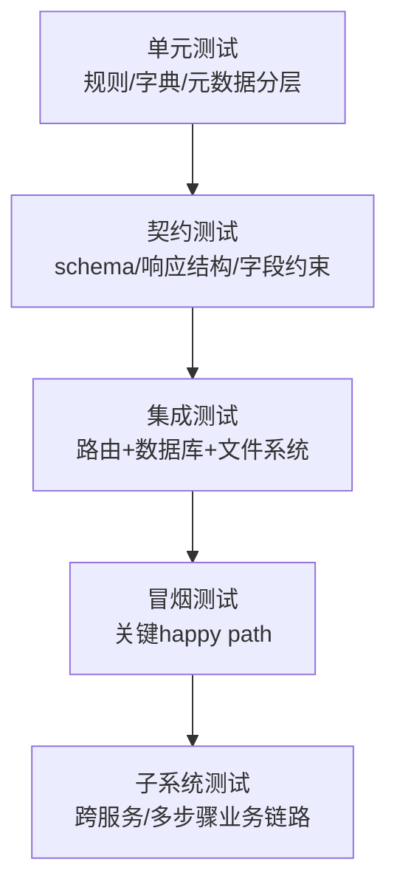
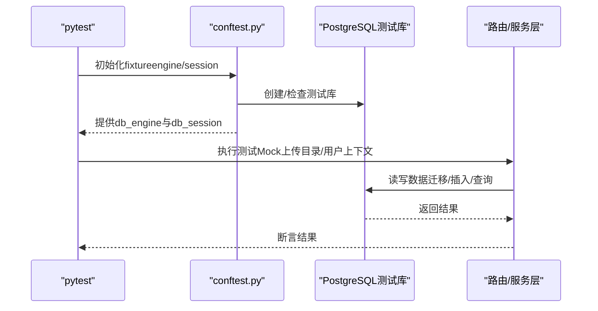
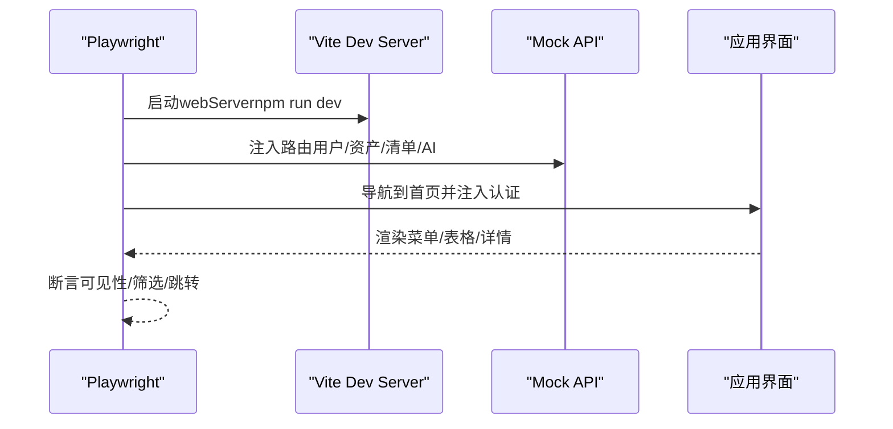
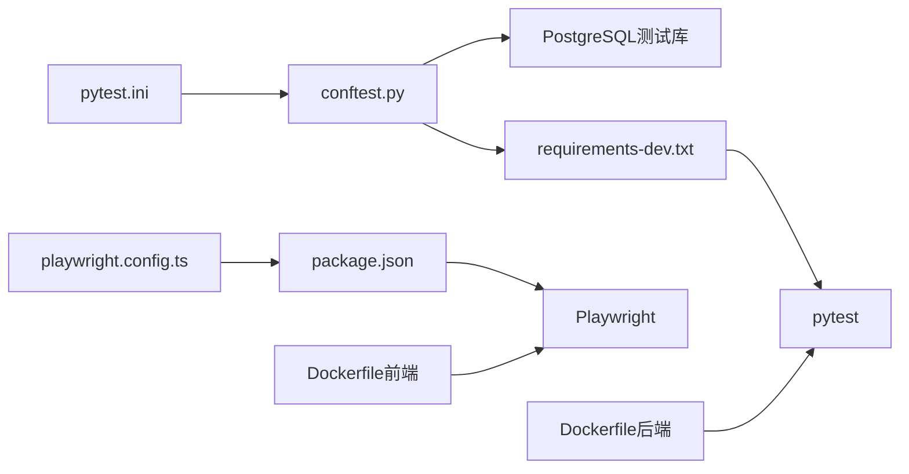

# 测试与质量保证

<cite>
**本文引用的文件**
- [pytest.ini](file://pytest.ini)
- [conftest.py](file://backend/tests/conftest.py)
- [requirements-dev.txt](file://backend/requirements-dev.txt)
- [Dockerfile（后端）](file://backend/Dockerfile)
- [Dockerfile（前端）](file://frontend/Dockerfile)
- [playwright.config.ts](file://frontend/playwright.config.ts)
- [package.json（前端）](file://frontend/package.json)
- [TESTING_STRATEGY.md](file://docs/01-总览/TESTING_STRATEGY.md)
- [test_health.py](file://backend/tests/test_health.py)
- [test_config.py](file://backend/tests/test_config.py)
- [test_permissions.py](file://backend/tests/test_permissions.py)
- [test_image_records.py](file://backend/tests/test_image_records.py)
- [test_platform_directory.py](file://backend/tests/test_platform_directory.py)
- [dashboard.spec.ts](file://frontend/tests/dashboard.spec.ts)
- [mirador-ai.spec.ts](file://frontend/tests/mirador-ai.spec.ts)
</cite>

## 目录
1. [引言](#引言)
2. [项目结构](#项目结构)
3. [核心组件](#核心组件)
4. [架构总览](#架构总览)
5. [详细组件分析](#详细组件分析)
6. [依赖关系分析](#依赖关系分析)
7. [性能考虑](#性能考虑)
8. [故障排查指南](#故障排查指南)
9. [结论](#结论)
10. [附录](#附录)

## 引言
本文件面向MDAMS原型项目的测试与质量保证，系统化梳理测试金字塔分层策略（单元测试、契约测试、集成测试、冒烟测试、子系统测试），总结后端pytest实践（标记体系、数据库测试、Mock策略）、前端Playwright回归测试实践，以及API与集成测试的实施方法。同时给出性能与负载测试建议、覆盖率与质量指标、持续集成与自动化测试流程、缺陷管理与回归测试机制，以及测试数据与环境配置要点。

## 项目结构
- 后端采用Python+FastAPI+SQLAlchemy，测试通过pytest组织，数据库测试通过PostgreSQL会话级fixture完成。
- 前端采用Vite+React+Playwright，测试通过Playwright配置与脚本执行。
- 文档中明确测试分层、常用命令与完成标准，便于团队遵循。

**图表来源**
- [pytest.ini:1-9](file://pytest.ini#L1-L9)
- [conftest.py:1-112](file://backend/tests/conftest.py#L1-L112)
- [requirements-dev.txt:1-3](file://backend/requirements-dev.txt#L1-L3)
- [Dockerfile（后端）:1-52](file://backend/Dockerfile#L1-L52)
- [playwright.config.ts:1-36](file://frontend/playwright.config.ts#L1-L36)
- [package.json（前端）:1-42](file://frontend/package.json#L1-L42)
- [Dockerfile（前端）:1-28](file://frontend/Dockerfile#L1-L28)
- [TESTING_STRATEGY.md:1-192](file://docs/01-总览/TESTING_STRATEGY.md#L1-L192)

**章节来源**
- [pytest.ini:1-9](file://pytest.ini#L1-L9)
- [conftest.py:1-112](file://backend/tests/conftest.py#L1-L112)
- [requirements-dev.txt:1-3](file://backend/requirements-dev.txt#L1-L3)
- [Dockerfile（后端）:1-52](file://backend/Dockerfile#L1-L52)
- [playwright.config.ts:1-36](file://frontend/playwright.config.ts#L1-L36)
- [package.json（前端）:1-42](file://frontend/package.json#L1-L42)
- [Dockerfile（前端）:1-28](file://frontend/Dockerfile#L1-L28)
- [TESTING_STRATEGY.md:1-192](file://docs/01-总览/TESTING_STRATEGY.md#L1-L192)

## 核心组件
- 测试标记与分层
  - 标记定义：unit（单元/规则）、contract（契约/响应结构）、integration（集成/路由+数据库+文件系统）、smoke（冒烟/关键路径）、system（子系统/多步链路）。
  - 建议：新功能至少补一个契约或集成测试；缺陷修复优先在最窄层补测；冒烟测试保持小而稳。
- 后端pytest配置
  - 使用严格标记模式，统一PostgreSQL测试数据库URL推导与自动创建，提供数据库引擎与会话fixture，注入上传目录Mock。
- 前端Playwright配置
  - 多浏览器项目（Chromium/Firefox/WebKit），CI下重试与并行控制，本地开发通过webServer启动Vite，HTML报告输出。
- 文档与命令一致性
  - 文档中列出的后端/前端命令均可直接执行，确保团队可快速落地。

**章节来源**
- [pytest.ini:1-9](file://pytest.ini#L1-L9)
- [conftest.py:1-112](file://backend/tests/conftest.py#L1-L112)
- [playwright.config.ts:1-36](file://frontend/playwright.config.ts#L1-L36)
- [package.json（前端）:1-42](file://frontend/package.json#L1-L42)
- [TESTING_STRATEGY.md:1-192](file://docs/01-总览/TESTING_STRATEGY.md#L1-L192)

## 架构总览
测试金字塔与职责划分如下：

- 单元测试：覆盖纯逻辑与规则，例如权限解析与断言、配置加载逻辑等。
- 契约测试：验证API响应结构、字段约束与状态码，确保接口契约稳定。
- 集成测试：组合路由、数据库与文件系统，覆盖真实请求路径与副作用。
- 冒烟测试：关键路径快速验证，保证健康检查、启动与基本路由可用。
- 子系统测试：跨模块/跨服务的端到端业务链路，作为金字塔顶端的补充。

**图表来源**
- [TESTING_STRATEGY.md:17-28](file://docs/01-总览/TESTING_STRATEGY.md#L17-L28)

**章节来源**
- [TESTING_STRATEGY.md:1-192](file://docs/01-总览/TESTING_STRATEGY.md#L1-L192)

## 详细组件分析

### 后端pytest实践
- 标记体系与执行顺序
  - 通过pytest.ini定义标记，配合TESTING_STRATEGY.md中的执行顺序，形成从单元到子系统的闭环。
- 数据库测试与环境隔离
  - conftest.py负责测试数据库URL推导、管理员连接、数据库存在性检查与创建、表级清理与重建、会话fixture。
  - 默认使用PostgreSQL，支持通过环境变量覆盖；测试期间自动切换DATABASE_URL。
- Mock与上传目录
  - 通过monkeypatch临时替换配置中的上传目录，结合内存图片生成与文件上传，验证文件系统行为。
- 典型测试用例
  - 健康检查与就绪检查：验证数据库与上传目录状态上报与异常路径。
  - 权限与可见范围：验证用户上下文解析、权限校验与集合范围访问控制。
  - 图像记录工作流：覆盖草稿、提交、退回、校验与文化对象匹配等关键路径。
  - 平台目录聚合：验证资源聚合、过滤、详情映射与搜索。

**图表来源**
- [conftest.py:85-112](file://backend/tests/conftest.py#L85-L112)
- [test_health.py:23-52](file://backend/tests/test_health.py#L23-L52)
- [test_permissions.py:14-42](file://backend/tests/test_permissions.py#L14-L42)
- [test_image_records.py:53-133](file://backend/tests/test_image_records.py#L53-L133)
- [test_platform_directory.py:38-106](file://backend/tests/test_platform_directory.py#L38-L106)

**章节来源**
- [pytest.ini:1-9](file://pytest.ini#L1-L9)
- [conftest.py:1-112](file://backend/tests/conftest.py#L1-L112)
- [requirements-dev.txt:1-3](file://backend/requirements-dev.txt#L1-L3)
- [Dockerfile（后端）:1-52](file://backend/Dockerfile#L1-L52)
- [TESTING_STRATEGY.md:1-192](file://docs/01-总览/TESTING_STRATEGY.md#L1-L192)
- [test_health.py:1-53](file://backend/tests/test_health.py#L1-L53)
- [test_permissions.py:1-43](file://backend/tests/test_permissions.py#L1-L43)
- [test_image_records.py:1-200](file://backend/tests/test_image_records.py#L1-L200)
- [test_platform_directory.py:1-107](file://backend/tests/test_platform_directory.py#L1-L107)

### 前端Playwright实践
- 配置与项目矩阵
  - 多浏览器项目、重试策略、trace收集、webServer自动启动Vite，CI下限制并发。
- 回归测试覆盖
  - 登录态初始化、菜单可见性、统一平台目录与详情、图像记录工作台、不同角色入口差异。
- 数据与路由Mock
  - 通过page.route拦截API，返回预置的用户、资产、清单与AI交互响应，确保测试稳定与可重复。
- 用例组织
  - 以describe分组角色与场景，断言UI元素可见性、表格内容、筛选与跳转行为。

**图表来源**
- [playwright.config.ts:1-36](file://frontend/playwright.config.ts#L1-L36)
- [package.json（前端）:1-42](file://frontend/package.json#L1-L42)
- [dashboard.spec.ts:291-311](file://frontend/tests/dashboard.spec.ts#L291-L311)
- [mirador-ai.spec.ts:108-127](file://frontend/tests/mirador-ai.spec.ts#L108-L127)

**章节来源**
- [playwright.config.ts:1-36](file://frontend/playwright.config.ts#L1-L36)
- [package.json（前端）:1-42](file://frontend/package.json#L1-L42)
- [dashboard.spec.ts:1-764](file://frontend/tests/dashboard.spec.ts#L1-L764)
- [mirador-ai.spec.ts:1-267](file://frontend/tests/mirador-ai.spec.ts#L1-L267)

### API与集成测试实施
- 后端集成测试要点
  - 使用db_session与上传目录fixture，构造真实请求路径，断言路由行为与数据库状态变更。
  - 示例：图像记录工作流（创建/更新/提交/退回）、平台目录聚合（资源计数、过滤、详情映射）。
- 前端集成测试要点
  - 通过Mock API模拟后端响应，验证前端与后端的契约一致性与UI交互稳定性。
  - 示例：统一平台目录搜索、角色可见性差异、AI面板交互与确认流程。

**章节来源**
- [test_image_records.py:53-133](file://backend/tests/test_image_records.py#L53-L133)
- [test_platform_directory.py:38-106](file://backend/tests/test_platform_directory.py#L38-L106)
- [dashboard.spec.ts:659-762](file://frontend/tests/dashboard.spec.ts#L659-L762)
- [mirador-ai.spec.ts:239-266](file://frontend/tests/mirador-ai.spec.ts#L239-L266)

### 冒烟测试与子系统测试
- 冒烟测试
  - 健康检查与就绪检查：验证数据库连通性、上传目录可用性与HTTP状态码。
  - 配置与启动：验证dotenv加载优先级与关键启动路径。
- 子系统测试
  - 覆盖跨模块业务链路，如图像记录工作流、平台目录聚合与访问控制、AI面板交互等。

**章节来源**
- [test_health.py:23-52](file://backend/tests/test_health.py#L23-L52)
- [test_config.py:6-35](file://backend/tests/test_config.py#L6-L35)
- [TESTING_STRATEGY.md:134-192](file://docs/01-总览/TESTING_STRATEGY.md#L134-L192)

## 依赖关系分析
- 后端
  - pytest.ini与conftest.py共同驱动测试执行与数据库环境准备。
  - requirements-dev.txt声明pytest版本，Dockerfile提供镜像构建与依赖安装。
- 前端
  - playwright.config.ts与package.json共同定义测试执行方式与脚本。
  - Dockerfile定义构建与运行环境，前端测试在本地或CI中通过webServer启动。

**图表来源**
- [pytest.ini:1-9](file://pytest.ini#L1-L9)
- [conftest.py:1-112](file://backend/tests/conftest.py#L1-L112)
- [requirements-dev.txt:1-3](file://backend/requirements-dev.txt#L1-L3)
- [playwright.config.ts:1-36](file://frontend/playwright.config.ts#L1-L36)
- [package.json（前端）:1-42](file://frontend/package.json#L1-L42)
- [Dockerfile（后端）:1-52](file://backend/Dockerfile#L1-L52)
- [Dockerfile（前端）:1-28](file://frontend/Dockerfile#L1-L28)

**章节来源**
- [pytest.ini:1-9](file://pytest.ini#L1-L9)
- [conftest.py:1-112](file://backend/tests/conftest.py#L1-L112)
- [requirements-dev.txt:1-3](file://backend/requirements-dev.txt#L1-L3)
- [playwright.config.ts:1-36](file://frontend/playwright.config.ts#L1-L36)
- [package.json（前端）:1-42](file://frontend/package.json#L1-L42)
- [Dockerfile（后端）:1-52](file://backend/Dockerfile#L1-L52)
- [Dockerfile（前端）:1-28](file://frontend/Dockerfile#L1-L28)

## 性能考虑
- 性能测试与负载测试建议
  - 后端：使用pytest与aiohttp客户端进行基准测试，关注路由延迟、数据库查询耗时与并发下的吞吐量；对文件上传/下载与IIIF生成进行压力测试。
  - 前端：使用Lighthouse或WebPageTest评估首屏时间、交互延迟与渲染性能；对AI面板与3D查看器进行帧率与内存占用监控。
- 资源与镜像优化
  - 后端Dockerfile已针对ImageMagick与libvips进行镜像优化；前端Dockerfile启用Nginx静态服务与构建缓存。
- CI集成
  - 在CI中增加性能基线对比与阈值告警，避免回归。

[本节为通用指导，无需特定文件引用]

## 故障排查指南
- 后端数据库不可用
  - 确认TEST_DATABASE_URL或DATABASE_URL推导正确，主机名已转换为localhost；检查管理员数据库连接与测试库创建权限。
- 上传目录缺失
  - 确认monkeypatch已注入上传目录；检查文件写入权限与路径存在性。
- 前端webServer未启动
  - 检查playwright.config.ts中的webServer命令与端口；确保本地未占用端口或在CI中复用已有进程。
- 权限与角色问题
  - 使用权限测试用例定位用户上下文解析与可见范围判断；核对角色与集合范围参数。
- 集成测试失败
  - 逐步缩小范围：先验证路由行为，再检查数据库状态与文件系统副作用；必要时开启trace与日志。

**章节来源**
- [conftest.py:21-71](file://backend/tests/conftest.py#L21-L71)
- [test_health.py:45-52](file://backend/tests/test_health.py#L45-L52)
- [playwright.config.ts:30-34](file://frontend/playwright.config.ts#L30-L34)
- [test_permissions.py:33-42](file://backend/tests/test_permissions.py#L33-L42)

## 结论
MDAMS原型项目已建立清晰的测试金字塔与分层策略，后端通过pytest与PostgreSQL测试库实现高保真集成测试，前端通过Playwright覆盖关键用户旅程与角色差异。建议在现有基础上进一步完善测试标签与目录分层、补充平台适配器与三维上传类型测试，并在CI中引入性能与覆盖率基线，持续提升质量与交付效率。

[本节为总结，无需特定文件引用]

## 附录

### 测试金字塔与执行顺序
- 建议日常开发顺序：后端pytest → 前端lint → 前端build → 前端playwright test。
- 关键模块覆盖：配置、健康检查、权限、图像记录、平台目录、三维链路、AI面板。

**章节来源**
- [TESTING_STRATEGY.md:78-96](file://docs/01-总览/TESTING_STRATEGY.md#L78-L96)

### 质量指标与覆盖率
- 覆盖率目标建议
  - 后端：语句/分支/行/函数综合覆盖率≥80%，关键路径≥90%。
  - 前端：组件与交互关键路径覆盖率≥85%，UI回归用例≥关键入口100%。
- 质量指标
  - 冒烟测试通过率100%；缺陷修复回归用例补足率≥100%；CI失败率≤1%。

[本节为通用指导，无需特定文件引用]

### 持续集成与自动化测试
- CI建议
  - 分阶段流水线：安装依赖 → 后端pytest（含数据库） → 前端lint/build → 前端playwright test → 性能基线对比 → 产物发布。
  - 并行策略：前端多浏览器项目并行，后端按模块分片执行。
- 自动化触发
  - PR与主干保护：强制通过冒烟与关键路径测试；失败自动标注与阻断合并。

[本节为通用指导，无需特定文件引用]

### 缺陷管理与回归测试机制
- 缺陷修复策略
  - 优先在最窄层补测（规则→契约→集成→前端），确保根因可追踪。
- 回归测试
  - 关键入口与角色差异用例纳入冒烟；重大变更补充子系统测试；文档命令与测试保持同步校验。

**章节来源**
- [TESTING_STRATEGY.md:146-173](file://docs/01-总览/TESTING_STRATEGY.md#L146-L173)

### 测试数据管理与环境配置
- 测试数据库
  - 通过环境变量TEST_DATABASE_URL或基于DATABASE_URL推导；自动创建测试库并使用localhost主机。
- 上传目录
  - 使用tmp_path创建临时上传目录并通过monkeypatch注入，避免污染生产数据。
- 前端Mock
  - 通过page.route注入用户、资产、清单与AI响应，确保测试稳定与可重复。

**章节来源**
- [conftest.py:21-82](file://backend/tests/conftest.py#L21-L82)
- [dashboard.spec.ts:291-311](file://frontend/tests/dashboard.spec.ts#L291-L311)
- [mirador-ai.spec.ts:108-127](file://frontend/tests/mirador-ai.spec.ts#L108-L127)