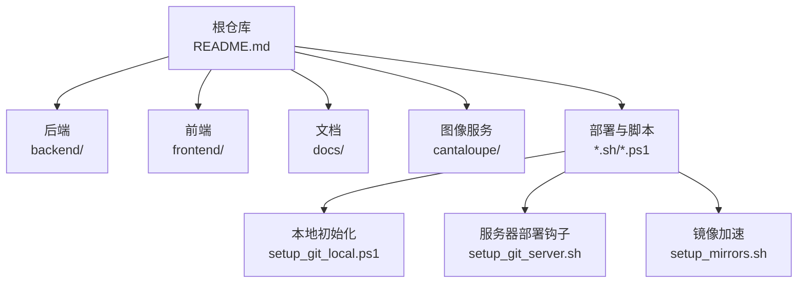
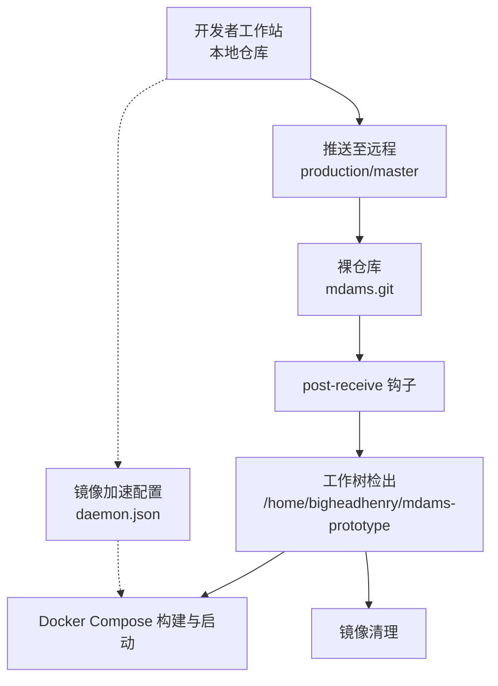
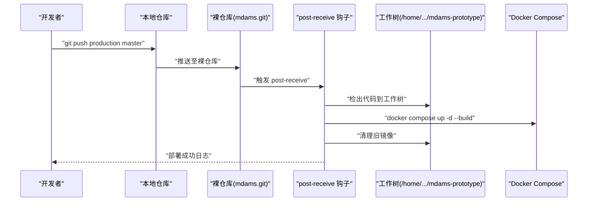
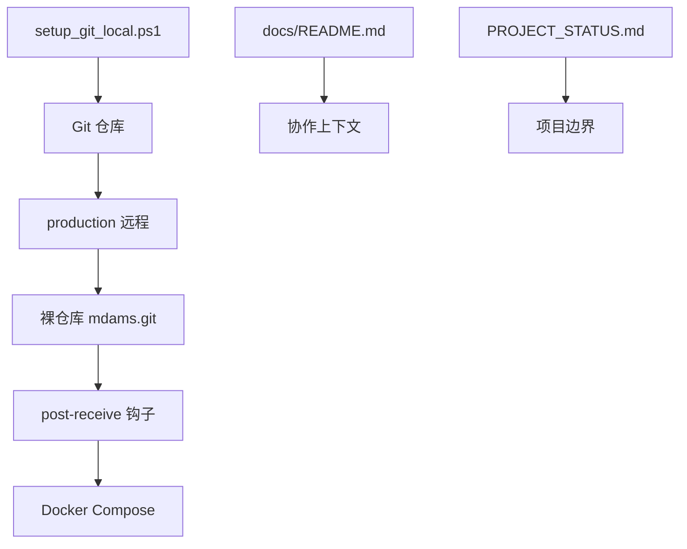

# 版本控制与协作流程

<cite>
**本文引用的文件**
- [README.md](file://README.md)
- [setup_git_local.ps1](file://setup_git_local.ps1)
- [setup_git_server.sh](file://setup_git_server.sh)
- [setup_mirrors.sh](file://setup_mirrors.sh)
- [docs/README.md](file://docs/README.md)
- [docs/01-总览/PROJECT_STATUS.md](file://docs/01-总览/PROJECT_STATUS.md)
- [docs/01-总览/TESTING_STRATEGY.md](file://docs/01-总览/TESTING_STRATEGY.md)
- [WORKFLOW_GUIDE.md](file://WORKFLOW_GUIDE.md)
</cite>

## 目录
1. [简介](#简介)
2. [项目结构](#项目结构)
3. [核心组件](#核心组件)
4. [架构总览](#架构总览)
5. [详细组件分析](#详细组件分析)
6. [依赖分析](#依赖分析)
7. [性能考虑](#性能考虑)
8. [故障排查指南](#故障排查指南)
9. [结论](#结论)
10. [附录](#附录)

## 简介
本文件为 MDAMS 原型项目的版本控制与协作流程规范，结合仓库现有脚本与文档，给出可落地的 Git 分支策略、提交规范、代码审查流程、版本标签与发布管理、冲突解决与合并最佳实践、Git 工作流图与操作示例、团队协作规范与沟通机制，以及备份与镜像策略。目标是在保证演示与持续开发能力的同时，提升协作效率与可追溯性，为后续平台化演进打下坚实基础。

## 项目结构
- 仓库采用多模块结构：后端、前端、文档、图像服务、部署脚本与测试。
- 文档统一归档在 docs/，便于维护与溯源。
- 提供本地初始化、远程服务器部署与 Docker 镜像加速脚本，支撑快速部署与回滚。

图表来源
- [README.md:1-213](file://README.md#L1-L213)
- [docs/README.md:1-76](file://docs/README.md#L1-L76)
- [setup_git_local.ps1:1-29](file://setup_git_local.ps1#L1-L29)
- [setup_git_server.sh:1-70](file://setup_git_server.sh#L1-L70)
- [setup_mirrors.sh:1-59](file://setup_mirrors.sh#L1-L59)

章节来源
- [README.md:67-79](file://README.md#L67-L79)
- [docs/README.md:9-27](file://docs/README.md#L9-L27)

## 核心组件
- 本地初始化与首次提交：通过 PowerShell 脚本初始化本地仓库、添加文件、提交初始版本，并配置生产远程。
- 服务器部署钩子：在裸仓库上配置 post-receive 钩子，触发工作树检出、环境变量注入、Docker 重建与清理。
- 镜像加速：自动检测 Docker 配置路径，写入 daemon.json 并重启服务，提高镜像拉取速度。
- 文档与状态：docs/README.md 提供文档入口与建议阅读顺序；PROJECT_STATUS.md 明确当前阶段与边界；TESTING_STRATEGY.md 提供测试策略与命令。

章节来源
- [setup_git_local.ps1:8-29](file://setup_git_local.ps1#L8-L29)
- [setup_git_server.sh:19-66](file://setup_git_server.sh#L19-L66)
- [setup_mirrors.sh:8-59](file://setup_mirrors.sh#L8-L59)
- [docs/README.md:28-38](file://docs/README.md#L28-L38)
- [docs/01-总览/PROJECT_STATUS.md:117-136](file://docs/01-总览/PROJECT_STATUS.md#L117-L136)
- [docs/01-总览/TESTING_STRATEGY.md:78-96](file://docs/01-总览/TESTING_STRATEGY.md#L78-L96)

## 架构总览
本节从版本控制与协作视角，给出基于现有脚本与文档的 Git 工作流架构图，涵盖本地开发、推送部署与回滚、镜像加速与部署稳定性保障。

图表来源
- [setup_git_server.sh:19-66](file://setup_git_server.sh#L19-L66)
- [setup_mirrors.sh:30-59](file://setup_mirrors.sh#L30-L59)
- [setup_git_local.ps1:17-28](file://setup_git_local.ps1#L17-L28)

## 详细组件分析

### Git 分支策略
- 主分支保护
  - 生产分支：master 作为受保护主分支，用于承载可发布版本与稳定基线。
  - 服务器端裸仓库配置 post-receive 钩子，强制通过该流程进行部署，确保变更可追溯与可回滚。
- 功能分支命名
  - 建议采用 feature/模块/主题 的命名方式，例如 feature/image-record-validation，便于追踪与审查。
- 发布分支管理
  - 建议引入 release/vX.Y.Z 作为发布分支，合并前完成测试与变更日志核对，最终合并至 master 并打标签。
- 合并策略
  - master 合并采用快进或非快进合并均可，但建议保留完整提交历史以便审计；必要时使用 squash 合并以精简提交。

章节来源
- [setup_git_server.sh:19-66](file://setup_git_server.sh#L19-L66)
- [docs/01-总览/PROJECT_STATUS.md:117-136](file://docs/01-总览/PROJECT_STATUS.md#L117-L136)

### 提交规范与消息格式
- 提交类型与语义
  - feat：新功能
  - fix：缺陷修复
  - docs：文档更新
  - style：不影响代码含义的更改（空格、格式等）
  - refactor：既不修复错误也不添加功能的重构
  - perf：性能优化
  - test：新增或修改测试
  - chore：构建过程或辅助工具的变动
- 描述规范
  - 使用动宾短语，简洁明了，避免冗长。
  - 首字母小写，句末不加句号。
- 关联 Issue
  - 在提交信息末尾追加 #Issue编号，便于关联与追踪。
- 示例参考
  - 参考仓库中已有提交风格，如 “✨ 新增: 图片上传格式验证功能”。

章节来源
- [WORKFLOW_GUIDE.md:23](file://WORKFLOW_GUIDE.md#L23)

### 代码审查流程
- Pull Request 模板
  - 建议在 .github/PULL_REQUEST_TEMPLATE.md 中定义模板，包含：变更摘要、影响范围、测试策略、风险评估、关联 Issue。
- 审查标准
  - 代码质量：遵循项目风格与静态检查要求。
  - 功能正确性：新增/修改功能需有相应测试覆盖。
  - 文档一致性：变更涉及文档需同步更新。
  - 安全与权限：涉及鉴权、范围控制的变更需重点审查。
- 合并条件
  - 至少一名维护者批准。
  - CI 通过（后端 pytest、前端 lint/build/test）。
  - 无未处理评论。
  - 通过 post-receive 钩子部署验证（如涉及后端/部署相关变更）。

章节来源
- [docs/01-总览/TESTING_STRATEGY.md:146-173](file://docs/01-总览/TESTING_STRATEGY.md#L146-L173)
- [docs/01-总览/TESTING_STRATEGY.md:184-192](file://docs/01-总览/TESTING_STRATEGY.md#L184-L192)

### 版本标签与发布管理
- 语义化版本
  - 采用 vMAJOR.MINOR.PATCH，遵循语义化版本规范，主版本号用于破坏性变更，次版本号用于向后兼容的功能变更，补丁版本用于向后兼容的问题修正。
- 变更日志
  - 使用 docs/01-总览/WORK_LOG.md 记录阶段性变更与里程碑，作为发布说明的基础素材。
- 发布说明
  - 基于变更日志生成发布说明，突出功能、修复、已知问题与升级注意事项。
- 标签与分支
  - 在 release 分支合并至 master 后打标签，标签与发布说明同步发布。

章节来源
- [docs/01-总览/WORK_LOG.md:1-40](file://docs/01-总览/WORK_LOG.md#L1-L40)

### 冲突解决与分支合并最佳实践
- 频繁同步主线
  - 开发前先同步 master，减少后期冲突。
- 小步提交与频繁推送
  - 将大任务拆分为小提交，降低冲突概率并便于审查。
- 冲突解决
  - 使用 IDE 或命令行工具解决冲突，解决后进行本地测试，确保功能正常。
- 合并后验证
  - 通过 post-receive 钩子部署验证，确保后端/前端均能正常运行。

章节来源
- [setup_git_server.sh:37-58](file://setup_git_server.sh#L37-L58)

### Git 工作流图与操作示例
- 本地开发到生产的典型流程
  - 初始化本地仓库、添加远程、提交初始版本。
  - 创建功能分支、提交、推送至远程。
  - 发起 PR、审查、合并至 master。
  - 服务器端通过 post-receive 钩子自动部署。
- 操作示例
  - 本地初始化与推送：参见本地脚本与推送命令。
  - 服务器部署：post-receive 钩子负责检出、构建与清理。

图表来源
- [setup_git_server.sh:23-66](file://setup_git_server.sh#L23-L66)
- [setup_git_local.ps1:26-28](file://setup_git_local.ps1#L26-L28)

章节来源
- [setup_git_local.ps1:8-29](file://setup_git_local.ps1#L8-L29)
- [setup_git_server.sh:19-66](file://setup_git_server.sh#L19-L66)

### 团队协作规范与沟通机制
- 文档统一入口：以 docs/README.md 为唯一正式文档入口，避免历史文档分散。
- 建议阅读顺序：按 PROJECT_STATUS.md、SETUP_AND_DEPLOYMENT.md、USER_ROLE_PERMISSION_MATRIX.md、WORKFLOW_GUIDE.md、ARCHITECTURE.md、TESTING_STRATEGY.md 的顺序阅读，确保背景与现状一致。
- 沟通与评审：PR 审查需在 GitHub 上进行，评论与批准流程透明化；重大变更需在团队会议中同步。

章节来源
- [docs/README.md:28-38](file://docs/README.md#L28-L38)
- [docs/01-总览/PROJECT_STATUS.md:137-146](file://docs/01-总览/PROJECT_STATUS.md#L137-L146)

### 备份与镜像策略
- 镜像加速
  - 使用 setup_mirrors.sh 自动检测 Docker 配置路径，写入 daemon.json 并重启服务，提高镜像拉取速度。
- 服务器部署与回滚
  - 通过 post-receive 钩子自动部署，若部署失败可回退到上一版本；建议保留最近 N 次镜像以便回滚。
- 本地备份
  - 建议定期备份 .env、关键配置与重要文档，防止本地丢失。

章节来源
- [setup_mirrors.sh:8-59](file://setup_mirrors.sh#L8-L59)
- [setup_git_server.sh:37-58](file://setup_git_server.sh#L37-L58)

## 依赖分析
- 本地脚本依赖 Git 与 SSH，用于初始化仓库与推送。
- 服务器脚本依赖裸仓库、post-receive 钩子与 Docker Compose，用于自动部署。
- 文档与状态文件为协作提供上下文与边界说明。

图表来源
- [setup_git_local.ps1:1-29](file://setup_git_local.ps1#L1-L29)
- [setup_git_server.sh:19-66](file://setup_git_server.sh#L19-L66)
- [docs/README.md:1-76](file://docs/README.md#L1-L76)
- [docs/01-总览/PROJECT_STATUS.md:99-136](file://docs/01-总览/PROJECT_STATUS.md#L99-L136)

章节来源
- [setup_git_local.ps1:1-29](file://setup_git_local.ps1#L1-L29)
- [setup_git_server.sh:1-70](file://setup_git_server.sh#L1-L70)
- [docs/README.md:1-76](file://docs/README.md#L1-L76)
- [docs/01-总览/PROJECT_STATUS.md:99-136](file://docs/01-总览/PROJECT_STATUS.md#L99-L136)

## 性能考虑
- 镜像加速：通过 daemon.json 配置多个镜像源，显著提升拉取速度，减少等待时间。
- 部署清理：post-receive 钩子在部署后清理旧镜像，避免磁盘占用增长。
- 测试前置：遵循 TESTING_STRATEGY.md 的执行顺序，尽早暴露问题，减少回滚成本。

章节来源
- [setup_mirrors.sh:30-59](file://setup_mirrors.sh#L30-L59)
- [setup_git_server.sh:56-58](file://setup_git_server.sh#L56-L58)
- [docs/01-总览/TESTING_STRATEGY.md:78-96](file://docs/01-总览/TESTING_STRATEGY.md#L78-L96)

## 故障排查指南
- 本地初始化失败
  - 检查 Git 是否安装且在 PATH 中；确认远程地址与凭据可用。
- 推送失败
  - 确认远程名称与 URL 正确；检查网络与 SSH 权限。
- 服务器部署失败
  - 查看部署日志；确认环境变量、Docker Compose 文件与服务端口；必要时回退至上一版本。
- 镜像拉取慢
  - 检查 daemon.json 是否正确写入；确认 Docker 服务已重启；更换镜像源。

章节来源
- [setup_git_local.ps1:1-6](file://setup_git_local.ps1#L1-L6)
- [setup_git_server.sh:23-66](file://setup_git_server.sh#L23-L66)
- [setup_mirrors.sh:30-59](file://setup_mirrors.sh#L30-L59)

## 结论
本规范在现有仓库脚本与文档基础上，明确了分支策略、提交规范、审查流程、版本与发布管理、冲突解决与合并实践、工作流图与操作示例、团队协作与沟通机制，以及备份与镜像策略。建议团队在实践中持续完善模板与流程，确保版本控制与协作高效、可追溯、可回滚。

## 附录
- 相关文档入口与建议阅读顺序见 docs/README.md。
- 当前阶段与边界说明见 PROJECT_STATUS.md。
- 测试策略与命令见 TESTING_STRATEGY.md。
- 提交示例参考 WORKFLOW_GUIDE.md。

章节来源
- [docs/README.md:28-38](file://docs/README.md#L28-L38)
- [docs/01-总览/PROJECT_STATUS.md:117-136](file://docs/01-总览/PROJECT_STATUS.md#L117-L136)
- [docs/01-总览/TESTING_STRATEGY.md:78-96](file://docs/01-总览/TESTING_STRATEGY.md#L78-L96)
- [WORKFLOW_GUIDE.md:23](file://WORKFLOW_GUIDE.md#L23)