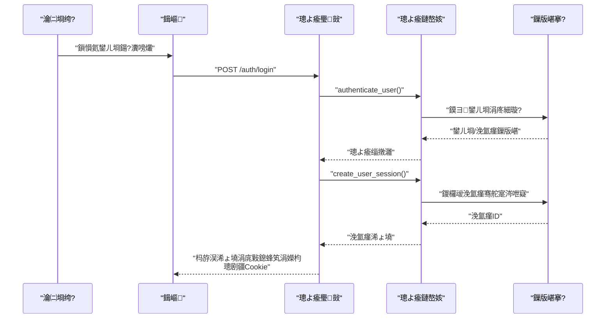
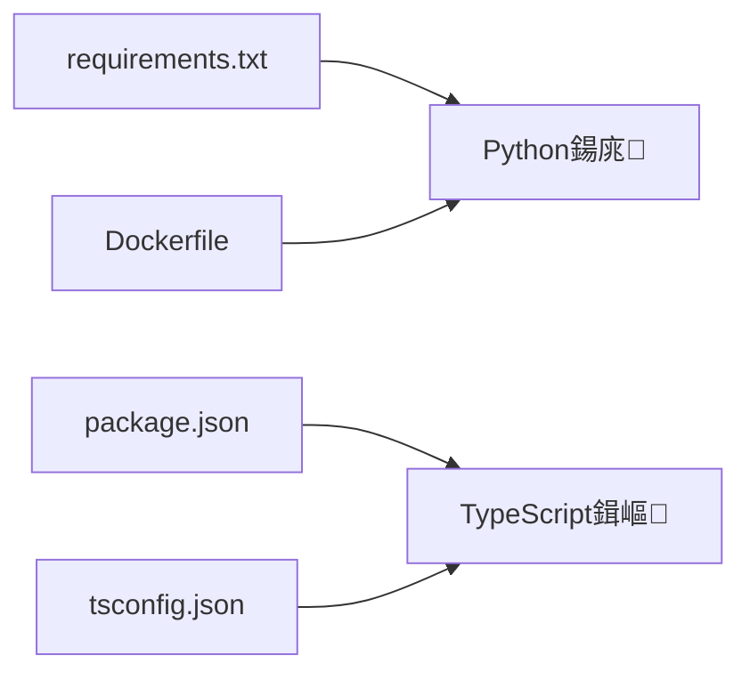

# 椤圭洰缁撴瀯涓庢ā鍧楀垝鍒?
<cite>
**鏈枃寮曠敤鐨勬枃浠?*
- [backend/app/main.py](file://backend/app/main.py)
- [backend/app/config.py](file://backend/app/config.py)
- [backend/app/database.py](file://backend/app/database.py)
- [backend/app/models.py](file://backend/app/models.py)
- [backend/app/routers/auth.py](file://backend/app/routers/auth.py)
- [backend/app/services/auth.py](file://backend/app/services/auth.py)
- [backend/app/schemas.py](file://backend/app/schemas.py)
- [backend/Dockerfile](file://backend/Dockerfile)
- [backend/requirements.txt](file://backend/requirements.txt)
- [frontend/src/main.tsx](file://frontend/src/main.tsx)
- [frontend/src/App.tsx](file://frontend/src/App.tsx)
- [frontend/src/auth/permissions.ts](file://frontend/src/auth/permissions.ts)
- [frontend/src/types/assets.ts](file://frontend/src/types/assets.ts)
- [frontend/package.json](file://frontend/package.json)
- [frontend/tsconfig.json](file://frontend/tsconfig.json)
</cite>

## 鐩綍
1. [寮曡█](#寮曡█)
2. [椤圭洰缁撴瀯](#椤圭洰缁撴瀯)
3. [鏍稿績缁勪欢](#鏍稿績缁勪欢)
4. [鏋舵瀯鎬昏](#鏋舵瀯鎬昏)
5. [璇︾粏缁勪欢鍒嗘瀽](#璇︾粏缁勪欢鍒嗘瀽)
6. [渚濊禆鍒嗘瀽](#渚濊禆鍒嗘瀽)
7. [鎬ц兘鑰冭檻](#鎬ц兘鑰冭檻)
8. [鏁呴殰鎺掓煡鎸囧崡](#鏁呴殰鎺掓煡鎸囧崡)
9. [缁撹](#缁撹)
10. [闄勫綍](#闄勫綍)

## 寮曡█
鏈枃浠堕潰鍚慚DAMS鍘熷瀷椤圭洰鐨勫紑鍙戣€呬笌缁存姢鑰咃紝绯荤粺鎬ф⒊鐞嗗悗绔笌鍓嶇鐨勬ā鍧楃粍缁囥€佽亴璐ｈ竟鐣屻€佷緷璧栧叧绯讳笌鎺ュ彛璁捐锛屾槑纭叡浜被鍨嬩笌鍏叡缁勪欢鐨勮璁″師鍒欙紝缁欏嚭閰嶇疆绠＄悊涓庣幆澧冨垎绂荤瓥鐣ャ€佹祴璇曠粍缁囨柟寮忎互鍙婃ā鍧楀鍏ュ鍑烘渶浣冲疄璺碉紝骞舵彁渚涢」鐩粨鏋勫浘涓庝緷璧栧叧绯诲浘锛屽府鍔╁揩閫熺悊瑙ｄ笌杩唬銆?
## 椤圭洰缁撴瀯
- 鍚庣閲囩敤FastAPI + SQLAlchemy + Celery鐨勫垎灞傛灦鏋勶紝鎸夊姛鑳藉煙鍒掑垎涓簉outers銆乻ervices銆乵odels銆乽tils绛夌洰褰曪紱閰嶇疆闆嗕腑浜巆onfig.py锛屾暟鎹簱杩炴帴涓庝細璇濈敱database.py缁熶竴绠＄悊锛涘叆鍙ｅ簲鐢ㄥ湪main.py涓垵濮嬪寲璺敱涓庝腑闂翠欢銆?- 鍓嶇鍩轰簬Vite + React + TypeScript锛岀粍浠舵寜鍔熻兘鍩熺粍缁囧湪src/components锛岀被鍨嬪畾涔夐泦涓湪src/types锛屾潈闄愪笌鑿滃崟瑙勫垯鍦╯rc/auth锛屽叆鍙ｅ湪src/main.tsx锛屾瀯寤轰笌娴嬭瘯鑴氭湰鍦╬ackage.json涓畾涔夈€?
```mermaid
graph TB
subgraph "鍚庣"
M["app/main.py<br/>搴旂敤鍏ュ彛涓庤矾鐢辨敞鍐?]
CFG["app/config.py<br/>閰嶇疆鍔犺浇涓庣幆澧冨彉閲?]
DB["app/database.py<br/>寮曟搸涓庝細璇濆伐鍘?]
MD["app/models.py<br/>ORM妯″瀷"]
RT_AUTH["app/routers/auth.py<br/>璁よ瘉璺敱"]
SV_AUTH["app/services/auth.py<br/>璁よ瘉鏈嶅姟"]
SCH["app/schemas.py<br/>Pydantic妯″瀷"]
end
subgraph "鍓嶇"
FE_MAIN["frontend/src/main.tsx<br/>React鍏ュ彛"]
APP["frontend/src/App.tsx<br/>搴旂敤鏍圭粍浠?]
PERM["frontend/src/auth/permissions.ts<br/>鏉冮檺涓庤彍鍗曡鍒?]
TYPES["frontend/src/types/assets.ts<br/>绫诲瀷瀹氫箟"]
PKG["frontend/package.json<br/>鑴氭湰涓庝緷璧?]
TSC["frontend/tsconfig.json<br/>缂栬瘧閰嶇疆"]
end
M --> RT_AUTH
M --> DB
M --> CFG
RT_AUTH --> SV_AUTH
RT_AUTH --> SCH
SV_AUTH --> MD
SV_AUTH --> DB
APP --> PERM
APP --> TYPES
FE_MAIN --> APP
PKG --> FE_MAIN
TSC --> FE_MAIN
```

**鍥捐〃鏉ユ簮**
- [backend/app/main.py:1-86](file://backend/app/main.py#L1-L86)
- [backend/app/config.py:1-72](file://backend/app/config.py#L1-L72)
- [backend/app/database.py:1-17](file://backend/app/database.py#L1-L17)
- [backend/app/models.py:1-307](file://backend/app/models.py#L1-L307)
- [backend/app/routers/auth.py:1-83](file://backend/app/routers/auth.py#L1-L83)
- [backend/app/services/auth.py:1-143](file://backend/app/services/auth.py#L1-L143)
- [backend/app/schemas.py:1-200](file://backend/app/schemas.py#L1-L200)
- [frontend/src/main.tsx:1-11](file://frontend/src/main.tsx#L1-L11)
- [frontend/src/App.tsx:1-905](file://frontend/src/App.tsx#L1-L905)
- [frontend/src/auth/permissions.ts:1-111](file://frontend/src/auth/permissions.ts#L1-L111)
- [frontend/src/types/assets.ts:1-621](file://frontend/src/types/assets.ts#L1-L621)
- [frontend/package.json:1-42](file://frontend/package.json#L1-L42)
- [frontend/tsconfig.json:1-23](file://frontend/tsconfig.json#L1-L23)

**绔犺妭鏉ユ簮**
- [backend/app/main.py:1-86](file://backend/app/main.py#L1-L86)
- [backend/app/config.py:1-72](file://backend/app/config.py#L1-L72)
- [backend/app/database.py:1-17](file://backend/app/database.py#L1-L17)
- [backend/app/models.py:1-307](file://backend/app/models.py#L1-L307)
- [backend/app/routers/auth.py:1-83](file://backend/app/routers/auth.py#L1-L83)
- [backend/app/services/auth.py:1-143](file://backend/app/services/auth.py#L1-L143)
- [backend/app/schemas.py:1-200](file://backend/app/schemas.py#L1-L200)
- [frontend/src/main.tsx:1-11](file://frontend/src/main.tsx#L1-L11)
- [frontend/src/App.tsx:1-905](file://frontend/src/App.tsx#L1-L905)
- [frontend/src/auth/permissions.ts:1-111](file://frontend/src/auth/permissions.ts#L1-L111)
- [frontend/src/types/assets.ts:1-621](file://frontend/src/types/assets.ts#L1-L621)
- [frontend/package.json:1-42](file://frontend/package.json#L1-L42)
- [frontend/tsconfig.json:1-23](file://frontend/tsconfig.json#L1-L23)

## 鏍稿績缁勪欢
- 搴旂敤鍏ュ彛涓庤矾鐢辨敞鍐岋細鍦╩ain.py涓垱寤篎astAPI瀹炰緥銆佸垵濮嬪寲鏁版嵁搴撹〃涓庣瀛愭暟鎹€佹敞鍐屽仴搴锋鏌ャ€佽璇併€佽祫浜с€佸簲鐢ㄣ€丄I銆佷笅杞姐€佸叆搴撱€侀暅鍍忚褰曘€佷笁缁淬€佸钩鍙扮瓑璺敱銆?- 閰嶇疆绠＄悊锛歝onfig.py璐熻矗鎸夊氨杩戝師鍒欎粠椤圭洰鍚戝鏌ユ壘.env鏂囦欢锛屽悎骞剁幆澧冨彉閲忥紝鎻愪緵鏁版嵁搴撱€丷edis銆佷笂浼犵洰褰曘€丄PI涓嶤antaloupe璁块棶鍦板潃銆佸ぇ妯″瀷涓庝汉鑴歌瘑鍒瓑閰嶇疆椤广€?- 鏁版嵁搴撲笌妯″瀷锛歞atabase.py鍒涘缓SQLAlchemy寮曟搸涓庝細璇濆伐鍘傦紱models.py瀹氫箟璧勪骇銆佺敤鎴枫€佽鑹层€佷細璇濄€侀暅鍍忛噰闆嗚〃鍗曘€侀暅鍍忚褰曘€佸簲鐢ㄣ€佷笁缁磋祫浜с€侀泦鍚堝璞°€佺敓浜ц褰曠瓑妯″瀷鍙婂叧绯汇€?- 璁よ瘉涓庢潈闄愶細routers/auth.py鎻愪緵鑾峰彇璁よ瘉涓婁笅鏂囥€佸垪鍑虹敤鎴枫€佺櫥褰曠櫥鍑烘帴鍙ｏ紱services/auth.py瀹炵幇瀵嗙爜鍝堝笇銆佷細璇濅护鐗岀敓鎴愪笌瀛樺偍銆佺敤鎴疯璇併€侀粯璁よ鑹蹭笌鐢ㄦ埛绉嶅瓙鏁版嵁娉ㄥ叆锛泂chemas.py瀹氫箟璁よ瘉鐩稿叧鍝嶅簲涓庤姹傛ā鍨嬨€?- 鍓嶇鍏ュ彛涓庢牴缁勪欢锛歠rontend/src/main.tsx鎸傝浇React鏍硅妭鐐癸紱frontend/src/App.tsx鎵胯浇鍏ㄥ眬鐘舵€併€佽彍鍗曟覆鏌撱€佹潈闄愭帶鍒躲€丄PI璋冪敤涓庨〉闈㈠垏鎹紱鏉冮檺涓庤彍鍗曡鍒欏湪frontend/src/auth/permissions.ts锛涚被鍨嬪畾涔夐泦涓湪frontend/src/types/assets.ts銆?
**绔犺妭鏉ユ簮**
- [backend/app/main.py:1-86](file://backend/app/main.py#L1-L86)
- [backend/app/config.py:1-72](file://backend/app/config.py#L1-L72)
- [backend/app/database.py:1-17](file://backend/app/database.py#L1-L17)
- [backend/app/models.py:1-307](file://backend/app/models.py#L1-L307)
- [backend/app/routers/auth.py:1-83](file://backend/app/routers/auth.py#L1-L83)
- [backend/app/services/auth.py:1-143](file://backend/app/services/auth.py#L1-L143)
- [backend/app/schemas.py:1-200](file://backend/app/schemas.py#L1-L200)
- [frontend/src/main.tsx:1-11](file://frontend/src/main.tsx#L1-L11)
- [frontend/src/App.tsx:1-905](file://frontend/src/App.tsx#L1-L905)
- [frontend/src/auth/permissions.ts:1-111](file://frontend/src/auth/permissions.ts#L1-L111)
- [frontend/src/types/assets.ts:1-621](file://frontend/src/types/assets.ts#L1-L621)

## 鏋舵瀯鎬昏
鍚庣閲囩敤鈥滆矾鐢?鏈嶅姟-妯″瀷鈥濅笁灞傜粨鏋勶紝璺敱璐熻矗HTTP鎺ュ彛涓庡弬鏁版牎楠岋紝鏈嶅姟灏佽涓氬姟閫昏緫涓庢暟鎹闂紝妯″瀷瀹氫箟鏁版嵁搴撶粨鏋勪笌鍏崇郴锛涘墠绔€氳繃Axios璋冪敤鍚庣API锛屼娇鐢≧eact缁勪欢涓庣被鍨嬬郴缁熻繘琛岀姸鎬佺鐞嗕笌UI娓叉煋锛涘鍣ㄥ寲閫氳繃Dockerfile瀹夎绯荤粺渚濊禆涓嶱ython渚濊禆锛岃繍琛寀vicorn鏈嶅姟銆?
```mermaid
graph TB
Client["娴忚鍣?瀹㈡埛绔?]
FE["鍓嶇搴旂敤<br/>React + Axios"]
API["鍚庣API<br/>FastAPI"]
AUTH_RT["璁よ瘉璺敱<br/>/auth/*"]
AUTH_SVC["璁よ瘉鏈嶅姟<br/>瀵嗙爜/浼氳瘽/鏉冮檺"]
DB["鏁版嵁搴?br/>PostgreSQL"]
REDIS["缂撳瓨/闃熷垪<br/>Redis"]
CANTALOUPE["鍥惧儚鏈嶅姟<br/>Cantaloupe IIIF"]
Client --> FE
FE --> API
API --> AUTH_RT
AUTH_RT --> AUTH_SVC
AUTH_SVC --> DB
API --> DB
API --> REDIS
API --> CANTALOUPE
```

**鍥捐〃鏉ユ簮**
- [backend/app/main.py:64-86](file://backend/app/main.py#L64-L86)
- [backend/app/routers/auth.py:1-83](file://backend/app/routers/auth.py#L1-L83)
- [backend/app/services/auth.py:1-143](file://backend/app/services/auth.py#L1-L143)
- [backend/app/config.py:42-72](file://backend/app/config.py#L42-L72)
- [frontend/src/App.tsx:140-205](file://frontend/src/App.tsx#L140-L205)

**绔犺妭鏉ユ簮**
- [backend/app/main.py:64-86](file://backend/app/main.py#L64-L86)
- [backend/app/config.py:42-72](file://backend/app/config.py#L42-L72)
- [frontend/src/App.tsx:140-205](file://frontend/src/App.tsx#L140-L205)

## 璇︾粏缁勪欢鍒嗘瀽

### 鍚庣锛氳璇佷笌鏉冮檺妯″潡
- 璺敱灞傦細/auth涓婁笅鏂囨煡璇€佺敤鎴峰垪琛ㄣ€佺櫥褰曪紙璁剧疆浼氳瘽Cookie锛夈€佺櫥鍑猴紙娓呯悊浼氳瘽锛夈€傝繑鍥炴ā鍨嬫潵鑷猻chemas.py銆?- 鏈嶅姟灞傦細鎻愪緵瀵嗙爜鍝堝笇銆佷細璇濅护鐗岀敓鎴愩€佷細璇濊繃鏈熷垽鏂笌鍒犻櫎銆佺敤鎴疯璇侊紱鍒濆鍖栭粯璁よ鑹蹭笌鐢ㄦ埛鏁版嵁锛岀‘淇濆紑鍙戠幆澧冨彲鐢ㄣ€?- 妯″瀷灞傦細User銆丷ole銆乁serRole銆乁serSession绛夛紝鏀拺璁よ瘉涓庢潈闄愪綋绯汇€?


**鍥捐〃鏉ユ簮**
- [backend/app/routers/auth.py:53-83](file://backend/app/routers/auth.py#L53-L83)
- [backend/app/services/auth.py:102-143](file://backend/app/services/auth.py#L102-L143)
- [backend/app/schemas.py:1-200](file://backend/app/schemas.py#L1-L200)

**绔犺妭鏉ユ簮**
- [backend/app/routers/auth.py:1-83](file://backend/app/routers/auth.py#L1-L83)
- [backend/app/services/auth.py:1-143](file://backend/app/services/auth.py#L1-L143)
- [backend/app/schemas.py:1-200](file://backend/app/schemas.py#L1-L200)

### 鍓嶇锛氭潈闄愪笌鑿滃崟鎺у埗
- 鏉冮檺鏋氫妇涓庤彍鍗曟槧灏勶細閫氳繃鏉冮檺鍚嶇О涓庤彍鍗曢敭鐨勮鍒欐槧灏勶紝鍔ㄦ€佸喅瀹氬彲瑙佽彍鍗曢」涓庢寜閽潈闄愩€?- 搴旂敤鏍圭粍浠讹細鏍规嵁璁よ瘉涓婁笅鏂囨覆鏌撲晶杈规爮鑿滃崟銆佷华琛ㄧ洏銆佽〃鏍间笌鍗＄墖锛涢€氳繃Axios璋冪敤鍚庣API鑾峰彇璧勬簮涓庡簲鐢ㄦ暟鎹紱鏈湴瀛樺偍浠ょ墝骞跺湪璇锋眰澶翠腑鎼哄甫銆?
```mermaid
flowchart TD
Start(["搴旂敤鍚姩"]) --> LoadToken["璇诲彇鏈湴瀛樺偍鐨勪护鐗?]
LoadToken --> FetchUsers["GET /api/auth/users"]
FetchUsers --> HasToken{"瀛樺湪鏈夋晥浠ょ墝锛?}
HasToken --> |鏄瘄 FetchContext["GET /api/auth/context"]
HasToken --> |鍚 Init["鍒濆鍖栫姸鎬?]
FetchContext --> SetAuth["璁剧疆璁よ瘉涓婁笅鏂?]
SetAuth --> RenderMenus["璁＄畻鍙鑿滃崟閿?]
RenderMenus --> RenderPage["娓叉煋瀵瑰簲椤甸潰"]
Init --> RenderPage
RenderPage --> Loop["杞澶勭悊涓殑璧勪骇鐘舵€?]
```

**鍥捐〃鏉ユ簮**
- [frontend/src/App.tsx:150-212](file://frontend/src/App.tsx#L150-L212)
- [frontend/src/auth/permissions.ts:84-111](file://frontend/src/auth/permissions.ts#L84-L111)

**绔犺妭鏉ユ簮**
- [frontend/src/App.tsx:1-905](file://frontend/src/App.tsx#L1-L905)
- [frontend/src/auth/permissions.ts:1-111](file://frontend/src/auth/permissions.ts#L1-L111)

### 鍏变韩绫诲瀷涓庡叕鍏辩粍浠?- 鍏变韩绫诲瀷锛氬墠绔痶ypes/assets.ts瀹氫箟璧勪骇銆侀暅鍍忚褰曘€佷笁缁磋祫婧愩€佺敓鍛藉懆鏈熶笌鍏冩暟鎹眰绛夋帴鍙ｏ紝淇濊瘉鍓嶅悗绔绾︿竴鑷淬€?- 鍏叡缁勪欢锛氬墠绔痗omponents鐩綍涓嬪寘鍚祫浜ц鎯呫€侀暅鍍忚褰曞伐浣滃彴銆佷笁缁寸鐞嗐€佺粺涓€璧勬簮璇︽儏绛夌粍浠讹紝閬靛惊鍗曚竴鑱岃矗涓庡彲澶嶇敤鍘熷垯銆?
**绔犺妭鏉ユ簮**
- [frontend/src/types/assets.ts:1-621](file://frontend/src/types/assets.ts#L1-L621)
- [frontend/src/App.tsx:1-905](file://frontend/src/App.tsx#L1-L905)

## 渚濊禆鍒嗘瀽
- 鍚庣渚濊禆锛欶astAPI銆丼QLAlchemy銆丆elery銆丷edis銆丳illow銆丱penCV銆丱NNXRuntime銆両nsightFace绛夛紱Dockerfile涓畨瑁卨ibvips銆両mageMagick涓嶦xifTool绛夌郴缁熶緷璧栥€?- 鍓嶇渚濊禆锛歊eact銆丄nt Design銆丮irador銆乼hree.js銆乵odel-viewer銆丄xios銆丳laywright绛夛紱TypeScript涓ユ牸妯″紡涓嶦SNext妯″潡瑙ｆ瀽銆?


**鍥捐〃鏉ユ簮**
- [backend/requirements.txt:1-18](file://backend/requirements.txt#L1-L18)
- [backend/Dockerfile:1-52](file://backend/Dockerfile#L1-L52)
- [frontend/package.json:1-42](file://frontend/package.json#L1-L42)
- [frontend/tsconfig.json:1-23](file://frontend/tsconfig.json#L1-L23)

**绔犺妭鏉ユ簮**
- [backend/requirements.txt:1-18](file://backend/requirements.txt#L1-L18)
- [backend/Dockerfile:1-52](file://backend/Dockerfile#L1-L52)
- [frontend/package.json:1-42](file://frontend/package.json#L1-L42)
- [frontend/tsconfig.json:1-23](file://frontend/tsconfig.json#L1-L23)

## 鎬ц兘鑰冭檻
- 鍚庣锛氶拡瀵筍QLite鐨勬ā寮忓吋瀹规€у鐞嗕笌绱㈠紩浼樺寲锛岄伩鍏嶉噸澶岮LTER璇彞锛涙暟鎹簱杩炴帴姹犱笌浼氳瘽绠＄悊闇€缁撳悎瀹為檯骞跺彂鍦烘櫙璋冩暣锛涘浘鍍忓鐞嗕笌浜鸿劯璇嗗埆寤鸿寮傛浠诲姟涓庣紦瀛橀厤鍚堛€?- 鍓嶇锛氱粍浠舵噿鍔犺浇涓庤櫄鎷熸粴鍔ㄧ敤浜庡ぇ鏁版嵁琛ㄦ牸锛涘浘鐗囬瑙堜笌IIIF娓呭崟鎸夐渶鍔犺浇锛涚被鍨嬩弗鏍兼鏌ュ噺灏戣繍琛屾椂閿欒銆?
## 鏁呴殰鎺掓煡鎸囧崡
- 璁よ瘉闂锛氭鏌ヤ細璇滳ookie鏄惁姝ｇ‘璁剧疆涓庤繃鏈燂紱鏍稿鐧诲綍鍑嵁涓庨粯璁ょ瀛愮敤鎴凤紱鏌ョ湅鍚庣鏃ュ織涓庢暟鎹簱浼氳瘽琛ㄣ€?- 鏁版嵁搴撻棶棰橈細纭DATABASE_URL涓嶱ostgreSQL杩為€氭€э紱妫€鏌ヨ縼绉讳笌绱㈠紩鏄惁瀛樺湪锛涘叧娉⊿QLite鍏煎鎬ц剼鏈墽琛岀粨鏋溿€?- 鍓嶇闂锛氱‘璁xios榛樿璇锋眰澶存槸鍚﹀寘鍚护鐗岋紱妫€鏌ヨ彍鍗曟潈闄愭槧灏勪笌鍙鎬э紱瀹氫綅缁勪欢娓叉煋涓嶢PI璋冪敤閾捐矾銆?
**绔犺妭鏉ユ簮**
- [backend/app/routers/auth.py:53-83](file://backend/app/routers/auth.py#L53-L83)
- [backend/app/services/auth.py:102-143](file://backend/app/services/auth.py#L102-L143)
- [frontend/src/App.tsx:140-205](file://frontend/src/App.tsx#L140-L205)

## 缁撹
鏈」鐩噰鐢ㄦ竻鏅扮殑鍚庣鍒嗗眰涓庡墠绔粍浠跺寲缁撴瀯锛岄€氳繃鍏变韩绫诲瀷涓庢潈闄愯鍒欏疄鐜板墠鍚庣鍗忎綔锛涢厤缃泦涓寲涓庡鍣ㄥ寲閮ㄧ讲鎻愬崌鍙淮鎶ゆ€с€傚缓璁寔缁畬鍠勬祴璇曡鐩栥€佸紓姝ヤ换鍔′笌缂撳瓨绛栫暐锛屽苟淇濇寔绫诲瀷濂戠害涓庢潈闄愮煩闃电殑涓€鑷存紨杩涖€?
## 闄勫綍

### 妯″潡鑱岃矗涓庡懡鍚嶈鑼?- 鍚庣
  - routers锛氫粎澶勭悊HTTP璇锋眰涓庡搷搴旓紝涓嶅寘鍚笟鍔￠€昏緫
  - services锛氬皝瑁呴鍩熶笟鍔′笌鏁版嵁璁块棶锛屽彲琚涓矾鐢卞鐢?  - models锛氫粎瀹氫箟鏁版嵁缁撴瀯涓庡叧绯伙紝涓嶅寘鍚涓?  - utils锛氶€氱敤宸ュ叿鍑芥暟锛岄伩鍏嶈法妯″潡鑰﹀悎
  - 鍛藉悕锛氭ā鍧楀悕灏忓啓锛岀被鍚嶉噰鐢ㄩ┘宄帮紝甯搁噺鍏ㄥぇ鍐?- 鍓嶇
  - components锛氭寜鍔熻兘鍩熸媶鍒嗭紝鍗曚竴鑱岃矗
  - types锛氶泦涓畾涔夋帴鍙ｄ笌鑱斿悎绫诲瀷
  - auth锛氭潈闄愪笌鑿滃崟瑙勫垯
  - 鍛藉悕锛氱粍浠堕瀛楁瘝澶у啓锛屽父閲忎笌鏋氫妇鍏ㄥぇ鍐?
### 閰嶇疆绠＄悊涓庣幆澧冨垎绂?- 浼樺厛绾э細椤圭洰鏍圭洰褰曞悜澶栨煡鎵?env鏂囦欢锛屾渶杩戠殑鐢熸晥锛涙湭璁剧疆鐨勭幆澧冨彉閲忎娇鐢ㄩ粯璁ゅ€?- 鍏抽敭閰嶇疆锛氭暟鎹簱銆丷edis銆佷笂浼犵洰褰曘€丄PI涓嶤antaloupe鍏紑鍦板潃銆佸ぇ妯″瀷涓庝汉鑴歌瘑鍒弬鏁?- 寤鸿锛氭晱鎰熶俊鎭斁鍏ョ幆澧冨彉閲忥紝涓嶅悓鐜浣跨敤涓嶅悓.env鏂囦欢

### 娴嬭瘯鏂囦欢缁勭粐
- 鍚庣锛歵ests鐩綍鎸夊姛鑳芥ā鍧楀懡鍚嶏紝pytest.ini閰嶇疆娴嬭瘯鍙戠幇涓庢彃浠?- 鍓嶇锛歅laywright娴嬭瘯浣嶄簬tests鐩綍锛宲ackage.json涓畾涔塼est鑴氭湰

### 妯″潡瀵煎叆涓庡鍑烘渶浣冲疄璺?- 鍚庣锛氬湪__init__.py涓樉寮忓鍑烘ā鍧楋紝閬垮厤寰幆瀵煎叆锛涜矾鐢卞湪main.py缁熶竴娉ㄥ唽
- 鍓嶇锛氫娇鐢ㄦ槑纭殑鐩稿璺緞瀵煎叆锛涚被鍨嬩笌宸ュ叿鍑芥暟闆嗕腑瀵煎嚭锛岀粍浠舵寜闇€寮曞叆
