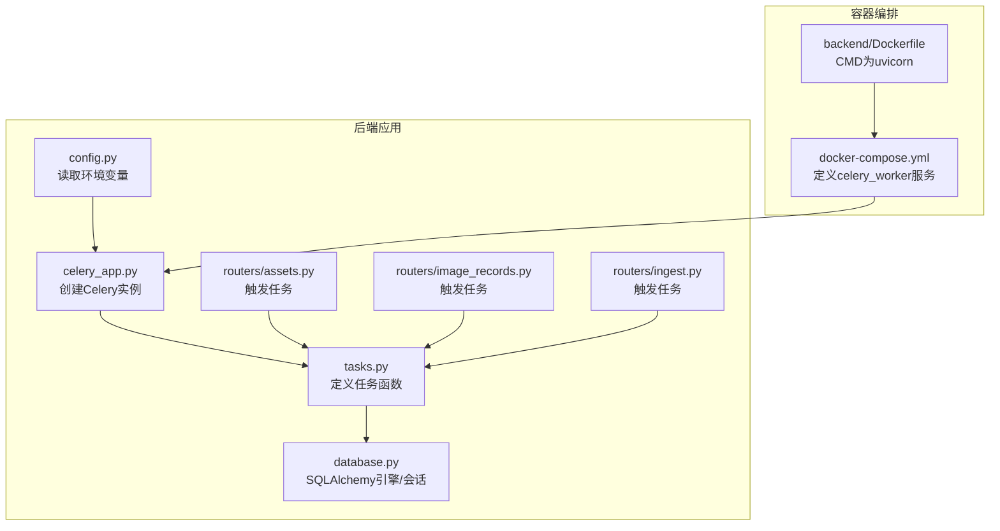
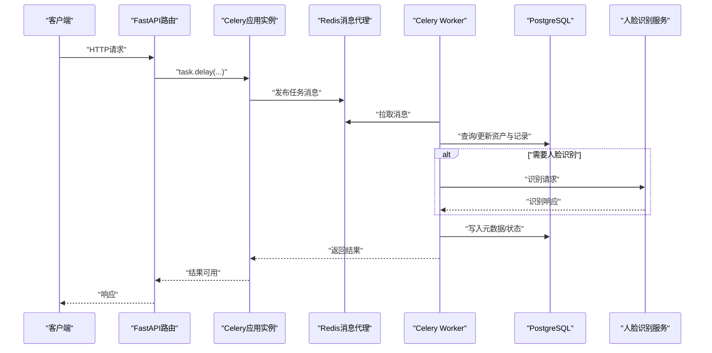
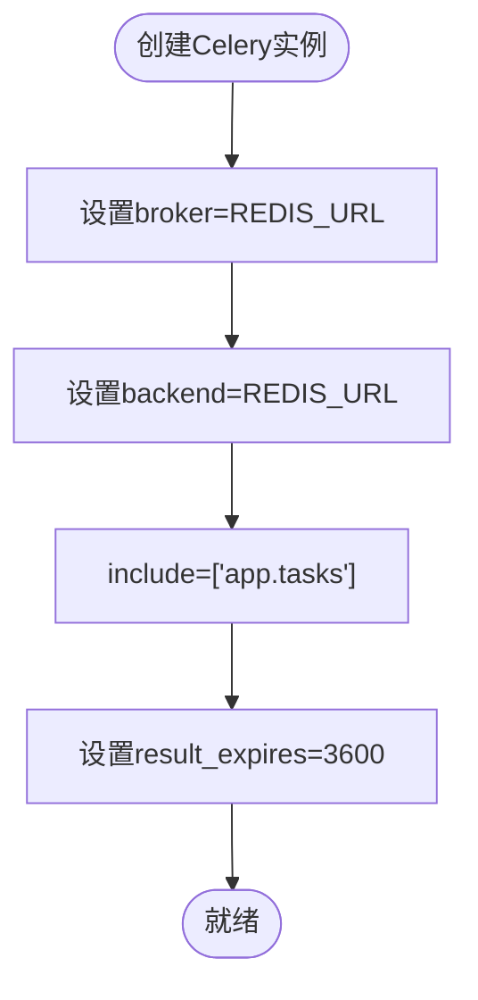
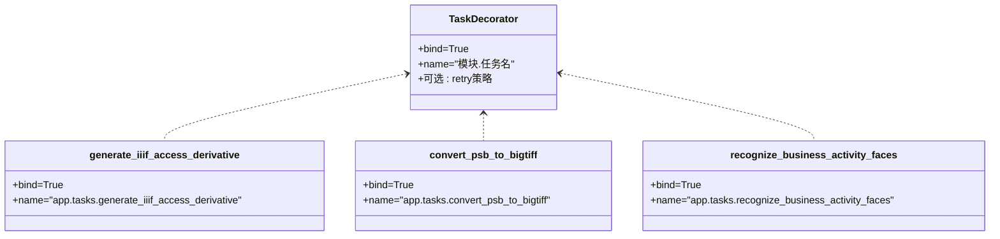
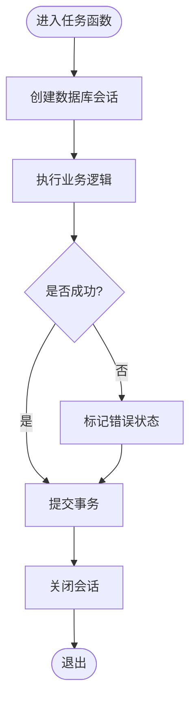
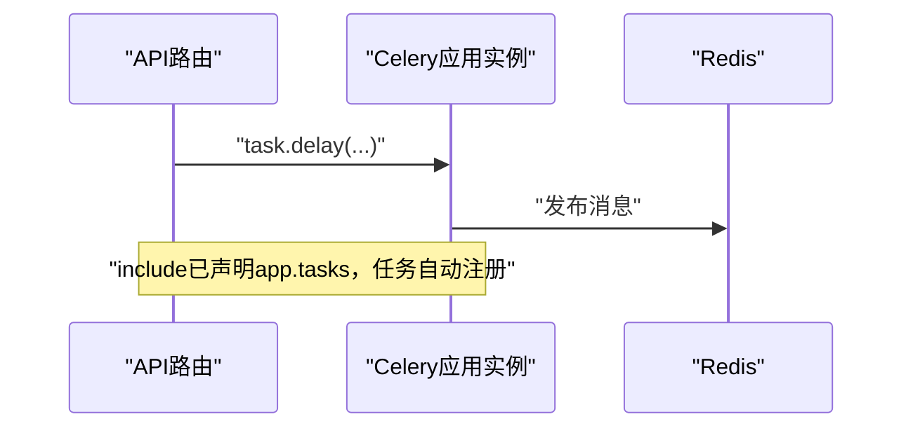
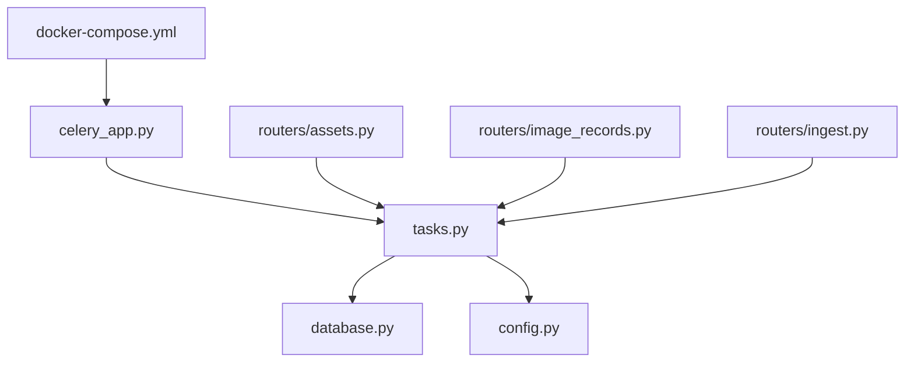

# Celery任务设计与配置

<cite>
**本文引用的文件**
- [celery_app.py](file://backend/app/celery_app.py)
- [tasks.py](file://backend/app/tasks.py)
- [config.py](file://backend/app/config.py)
- [database.py](file://backend/app/database.py)
- [docker-compose.yml](file://docker-compose.yml)
- [Dockerfile](file://backend/Dockerfile)
- [main.py](file://backend/app/main.py)
- [assets.py](file://backend/app/routers/assets.py)
- [image_records.py](file://backend/app/routers/image_records.py)
- [ingest.py](file://backend/app/routers/ingest.py)
</cite>

## 目录
1. [简介](#简介)
2. [项目结构](#项目结构)
3. [核心组件](#核心组件)
4. [架构总览](#架构总览)
5. [详细组件分析](#详细组件分析)
6. [依赖分析](#依赖分析)
7. [性能考虑](#性能考虑)
8. [故障排查指南](#故障排查指南)
9. [结论](#结论)
10. [附录](#附录)

## 简介
本文件面向MDAMS原型项目的Celery任务设计与配置，围绕以下目标展开：Celery应用实例的初始化与配置（Redis连接、结果后端、任务发现）、任务装饰器使用（bind参数、任务名称、重试机制）、任务函数编写规范（数据库会话、异常处理、事务控制）、任务注册与发现机制、任务配置示例与常见问题、以及Celery Worker启动与监控建议。内容基于仓库中的实际实现进行提炼与可视化说明。

## 项目结构
与Celery相关的关键文件分布如下：
- 应用入口与配置：backend/app/celery_app.py
- 任务定义：backend/app/tasks.py
- 全局配置（含Redis、人脸特征开关等）：backend/app/config.py
- 数据库引擎与会话工厂：backend/app/database.py
- Worker启动与环境变量注入：docker-compose.yml
- 后端镜像构建与运行命令：backend/Dockerfile
- API路由中触发任务：backend/app/routers/assets.py、backend/app/routers/image_records.py、backend/app/routers/ingest.py

**图表来源**
- [celery_app.py:1-19](file://backend/app/celery_app.py#L1-L19)
- [tasks.py:1-262](file://backend/app/tasks.py#L1-L262)
- [config.py:1-72](file://backend/app/config.py#L1-L72)
- [database.py:1-17](file://backend/app/database.py#L1-L17)
- [docker-compose.yml:37-64](file://docker-compose.yml#L37-L64)
- [Dockerfile:1-52](file://backend/Dockerfile#L1-L52)
- [assets.py:120-140](file://backend/app/routers/assets.py#L120-L140)
- [image_records.py:910-975](file://backend/app/routers/image_records.py#L910-L975)
- [ingest.py:160-175](file://backend/app/routers/ingest.py#L160-L175)

**章节来源**
- [celery_app.py:1-19](file://backend/app/celery_app.py#L1-L19)
- [tasks.py:1-262](file://backend/app/tasks.py#L1-L262)
- [config.py:1-72](file://backend/app/config.py#L1-L72)
- [database.py:1-17](file://backend/app/database.py#L1-L17)
- [docker-compose.yml:1-131](file://docker-compose.yml#L1-L131)
- [Dockerfile:1-52](file://backend/Dockerfile#L1-L52)
- [assets.py:120-140](file://backend/app/routers/assets.py#L120-L140)
- [image_records.py:910-975](file://backend/app/routers/image_records.py#L910-L975)
- [ingest.py:160-175](file://backend/app/routers/ingest.py#L160-L175)

## 核心组件
- Celery应用实例：通过backend/app/celery_app.py创建，指定broker与backend均为Redis地址，并声明include的任务模块路径，同时设置结果过期时间。
- 任务函数：位于backend/app/tasks.py，包含生成IIIF访问衍生图、PSB转大 TIFF衍生图、人脸识别三项任务；均使用bind=True以便在任务内部访问self上下文。
- 配置加载：backend/app/config.py统一从环境变量加载DATABASE_URL、REDIS_URL、人脸特征相关开关与阈值等；这些变量由docker-compose.yml注入到容器。
- 数据库会话：backend/app/database.py提供SQLAlchemy引擎与SessionLocal，任务内通过SessionLocal()创建会话，确保每个任务独立的数据库事务。
- 任务触发点：在API路由中（assets.py、image_records.py、ingest.py）调用任务的delay方法将任务入队。

**章节来源**
- [celery_app.py:1-19](file://backend/app/celery_app.py#L1-L19)
- [tasks.py:150-262](file://backend/app/tasks.py#L150-L262)
- [config.py:42-72](file://backend/app/config.py#L42-L72)
- [database.py:1-17](file://backend/app/database.py#L1-L17)
- [assets.py:120-140](file://backend/app/routers/assets.py#L120-L140)
- [image_records.py:910-975](file://backend/app/routers/image_records.py#L910-L975)
- [ingest.py:160-175](file://backend/app/routers/ingest.py#L160-L175)

## 架构总览
下图展示了从API到Celery Worker再到数据库与外部服务的完整链路。

**图表来源**
- [celery_app.py:1-19](file://backend/app/celery_app.py#L1-L19)
- [tasks.py:150-262](file://backend/app/tasks.py#L150-L262)
- [config.py:42-72](file://backend/app/config.py#L42-L72)
- [database.py:1-17](file://backend/app/database.py#L1-L17)
- [docker-compose.yml:37-64](file://docker-compose.yml#L37-L64)

## 详细组件分析

### Celery应用实例初始化与配置
- 实例创建：在celery_app.py中创建Celery实例，指定broker与backend均为REDIS_URL，include包含app.tasks模块，使任务自动被发现与注册。
- 结果后端：broker与backend均指向同一Redis实例，便于统一管理消息与结果。
- 结果过期：通过conf.update设置result_expires，控制任务结果在Redis中的保留时间。
- 启动入口：当直接运行celery_app.py时，会启动Celery应用；但通常由docker-compose以命令形式启动worker。

**图表来源**
- [celery_app.py:5-15](file://backend/app/celery_app.py#L5-L15)

**章节来源**
- [celery_app.py:1-19](file://backend/app/celery_app.py#L1-L19)
- [config.py:42-44](file://backend/app/config.py#L42-L44)

### 任务装饰器与命名规范
- bind参数：所有任务均使用bind=True，允许在任务函数内部通过self访问上下文信息（如重试、进度、任务ID等）。
- 任务名称：显式指定name参数，采用“模块名.函数名”的命名，例如app.tasks.generate_iiif_access_derivative，便于在监控与日志中清晰识别。
- 重试机制：当前实现未显式配置retry或max_retries等参数；若需增强可靠性，可在装饰器中增加重试策略并在异常分支调用self.retry(...)。

**图表来源**
- [tasks.py:150-187](file://backend/app/tasks.py#L150-L187)

**章节来源**
- [tasks.py:150-187](file://backend/app/tasks.py#L150-L187)

### 任务函数编写规范
- 数据库会话管理：每个任务内部通过SessionLocal()创建会话，执行完成后在finally中关闭，避免会话泄漏。
- 异常处理：捕获通用异常与特定异常（如人脸识别客户端错误），在失败时写入错误状态与消息，并提交事务。
- 事务控制：成功路径commit一次；异常路径也commit以持久化错误状态；确保数据一致性。
- 业务逻辑：任务函数内完成查询、处理、写回等操作，必要时调用外部服务（如人脸识别）并更新资产与记录的元数据。

**图表来源**
- [tasks.py:150-262](file://backend/app/tasks.py#L150-L262)
- [database.py:1-17](file://backend/app/database.py#L1-L17)

**章节来源**
- [tasks.py:150-262](file://backend/app/tasks.py#L150-L262)
- [database.py:1-17](file://backend/app/database.py#L1-L17)

### 任务注册与发现机制
- 自动发现：在celery_app.py中通过include=["app.tasks"]声明任务模块，Celery在启动时自动扫描并注册该模块内的任务。
- 任务导入：tasks.py中定义的任务函数在应用启动时被导入，无需额外手动注册。
- 触发方式：在API路由中通过delay方法将任务入队，例如在assets.py、image_records.py、ingest.py中对generate_iiif_access_derivative与recognize_business_activity_faces的调用。

**图表来源**
- [celery_app.py:9-10](file://backend/app/celery_app.py#L9-L10)
- [assets.py:120-140](file://backend/app/routers/assets.py#L120-L140)
- [image_records.py:910-975](file://backend/app/routers/image_records.py#L910-L975)
- [ingest.py:160-175](file://backend/app/routers/ingest.py#L160-L175)

**章节来源**
- [celery_app.py:9-10](file://backend/app/celery_app.py#L9-L10)
- [assets.py:120-140](file://backend/app/routers/assets.py#L120-L140)
- [image_records.py:910-975](file://backend/app/routers/image_records.py#L910-L975)
- [ingest.py:160-175](file://backend/app/routers/ingest.py#L160-L175)

### 任务配置示例与常见问题
- Redis连接与结果后端：在celery_app.py中统一使用REDIS_URL作为broker与backend；请确保REDIS_URL在运行环境中正确设置。
- 任务名称与命名规范：建议遵循“模块.函数名”格式，便于监控与排障。
- 重试机制：当前未显式配置重试；如需增强稳定性，可在装饰器中添加retry策略并在异常时调用self.retry(...)。
- 人脸特征开关：通过config.py中的FACE_RECOGNITION_ENABLED控制是否启用人脸识别任务；docker-compose.yml中注入该变量，确保容器内生效。
- 并发与日志：docker-compose.yml中以--concurrency=1限制并发，便于资源受限场景下的稳定运行；日志级别为info。

**章节来源**
- [celery_app.py:1-19](file://backend/app/celery_app.py#L1-L19)
- [config.py:60-64](file://backend/app/config.py#L60-L64)
- [docker-compose.yml:41-41](file://docker-compose.yml#L41-L41)

### Celery Worker启动与监控
- 启动命令：docker-compose.yml中定义celery_worker服务，command为celery -A app.celery_app worker --loglevel=info --concurrency=1，直接使用app.celery_app作为入口。
- 环境变量：容器启动时注入DATABASE_URL、REDIS_URL、人脸特征相关变量等，确保任务运行所需配置可用。
- 监控建议：可结合Redis键空间事件与任务结果过期策略进行监控；在生产环境可调整并发数与日志级别，并引入任务追踪工具（如Flower）进行可视化监控。

**章节来源**
- [docker-compose.yml:37-64](file://docker-compose.yml#L37-L64)
- [Dockerfile:51-52](file://backend/Dockerfile#L51-L52)

## 依赖分析
- Celery应用依赖于Redis作为消息代理与结果后端，依赖于任务模块app.tasks中的具体任务定义。
- 任务函数依赖于数据库会话工厂SessionLocal与SQLAlchemy引擎，依赖于config.py中的配置项（如人脸特征开关）。
- API路由在业务流程中触发任务，形成从HTTP请求到异步任务的解耦。

**图表来源**
- [celery_app.py:1-19](file://backend/app/celery_app.py#L1-L19)
- [tasks.py:1-262](file://backend/app/tasks.py#L1-L262)
- [database.py:1-17](file://backend/app/database.py#L1-L17)
- [config.py:1-72](file://backend/app/config.py#L1-L72)
- [docker-compose.yml:37-64](file://docker-compose.yml#L37-L64)
- [assets.py:120-140](file://backend/app/routers/assets.py#L120-L140)
- [image_records.py:910-975](file://backend/app/routers/image_records.py#L910-L975)
- [ingest.py:160-175](file://backend/app/routers/ingest.py#L160-L175)

**章节来源**
- [celery_app.py:1-19](file://backend/app/celery_app.py#L1-L19)
- [tasks.py:1-262](file://backend/app/tasks.py#L1-L262)
- [database.py:1-17](file://backend/app/database.py#L1-L17)
- [config.py:1-72](file://backend/app/config.py#L1-L72)
- [docker-compose.yml:37-64](file://docker-compose.yml#L37-L64)
- [assets.py:120-140](file://backend/app/routers/assets.py#L120-L140)
- [image_records.py:910-975](file://backend/app/routers/image_records.py#L910-L975)
- [ingest.py:160-175](file://backend/app/routers/ingest.py#L160-L175)

## 性能考虑
- 并发控制：当前docker-compose.yml中将--concurrency设为1，适合资源受限或CPU密集型任务串行化处理；若任务主要为IO密集型且Redis与数据库性能充足，可适当提高并发数。
- 结果缓存与过期：result_expires=3600意味着任务结果在Redis中保留1小时，有助于快速查询与调试；在高吞吐场景下应关注Redis内存占用。
- 外部服务调用：人脸识别等外部服务存在网络与超时风险，建议在config.py中合理设置超时参数，并在任务中增加重试与降级策略。

## 故障排查指南
- 任务无法被发现：检查celery_app.py中的include是否包含app.tasks，确认任务函数已正确定义并被导入。
- Redis连接失败：核对REDIS_URL是否正确注入到容器环境变量，确认Redis服务可达。
- 数据库事务异常：检查任务中是否在异常路径也提交了事务，确保错误状态被持久化。
- 人脸特征任务未执行：确认FACE_RECOGNITION_ENABLED为1，且外部人脸识别服务可用；检查config.py中的相关阈值与超时配置。
- Worker日志与并发：通过--loglevel=info与--concurrency参数观察任务执行情况，必要时调整并发数与日志级别。

**章节来源**
- [celery_app.py:1-19](file://backend/app/celery_app.py#L1-L19)
- [config.py:60-72](file://backend/app/config.py#L60-L72)
- [docker-compose.yml:41-41](file://docker-compose.yml#L41-L41)
- [tasks.py:150-262](file://backend/app/tasks.py#L150-L262)

## 结论
本项目基于Celery实现了异步任务的解耦与扩展，通过Redis作为消息代理与结果后端，结合明确的任务命名与会话管理规范，保障了任务的可靠执行。建议在现有基础上完善重试与监控策略，并根据实际负载调整并发与超时参数，以进一步提升系统的稳定性与可观测性。

## 附录
- 任务触发位置参考：
  - [assets.py:120-140](file://backend/app/routers/assets.py#L120-L140)
  - [image_records.py:910-975](file://backend/app/routers/image_records.py#L910-L975)
  - [ingest.py:160-175](file://backend/app/routers/ingest.py#L160-L175)
- Worker启动命令与环境变量：
  - [docker-compose.yml:37-64](file://docker-compose.yml#L37-L64)
  - [Dockerfile:51-52](file://backend/Dockerfile#L51-L52)