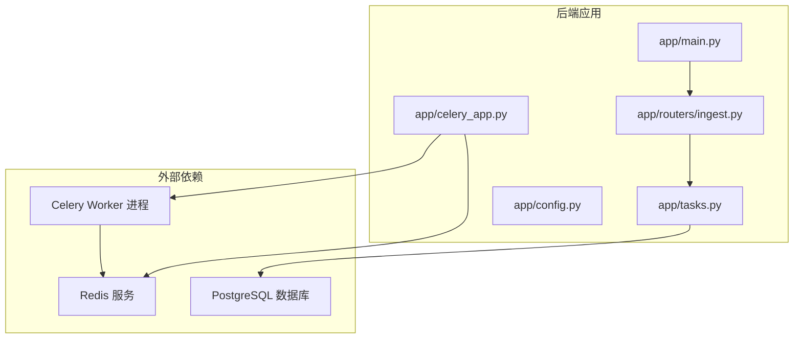
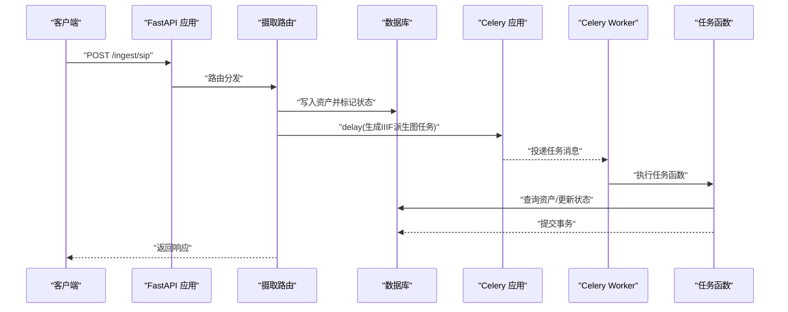
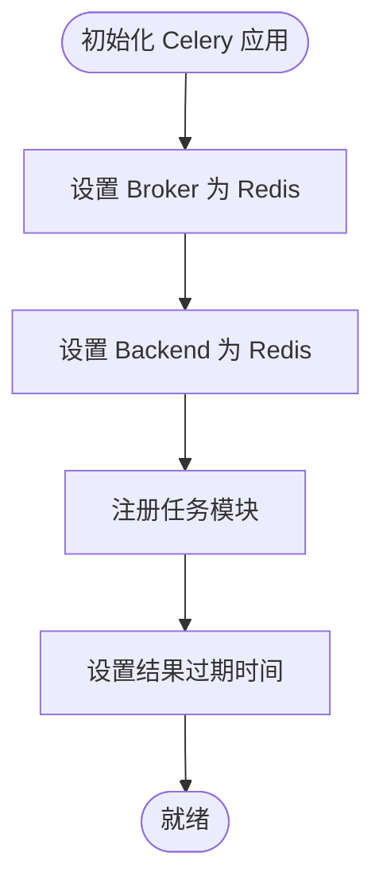
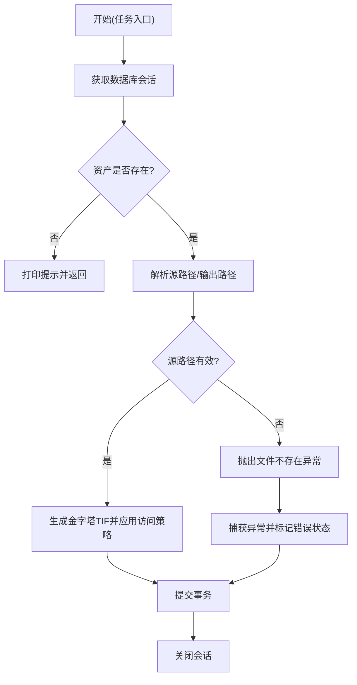
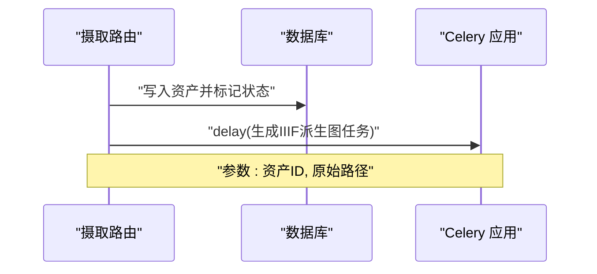
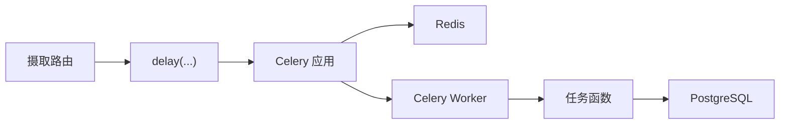

# 任务调度策略

<cite>
**本文引用的文件**
- [celery_app.py](file://backend/app/celery_app.py)
- [tasks.py](file://backend/app/tasks.py)
- [config.py](file://backend/app/config.py)
- [ingest.py](file://backend/app/routers/ingest.py)
- [main.py](file://backend/app/main.py)
- [requirements.txt](file://backend/requirements.txt)
- [TROUBLESHOOTING.md](file://docs/05-部署与运维/TROUBLESHOOTING.md)
</cite>

## 目录
1. [引言](#引言)
2. [项目结构](#项目结构)
3. [核心组件](#核心组件)
4. [架构总览](#架构总览)
5. [详细组件分析](#详细组件分析)
6. [依赖分析](#依赖分析)
7. [性能考虑](#性能考虑)
8. [故障排查指南](#故障排查指南)
9. [结论](#结论)
10. [附录](#附录)

## 引言
本文件面向MDAMS原型项目的任务调度策略，聚焦于基于Celery的任务执行体系。文档从系统架构、组件职责、数据与控制流、错误处理与性能优化等方面进行系统化梳理，并结合现有代码实现给出可操作的配置示例与最佳实践，帮助开发者与运维人员理解并高效维护任务调度子系统。

## 项目结构
围绕任务调度的关键文件与职责如下：
- 应用入口与路由：FastAPI应用注册各业务路由，其中数据摄取路由在完成入库后触发后台任务。
- Celery应用：集中配置Broker与Backend，统一注册任务模块。
- 任务定义：定义具体的后台任务，如生成IIIF派生图、人脸识别等。
- 配置：数据库、Redis、人脸识别等运行时参数。
- 依赖声明：明确Celery与Redis版本，确保运行环境一致性。
- 故障排查：提供常见问题定位路径与日志查看方式。

**图表来源**
- [main.py:64-86](file://backend/app/main.py#L64-L86)
- [ingest.py:29-178](file://backend/app/routers/ingest.py#L29-L178)
- [celery_app.py:5-19](file://backend/app/celery_app.py#L5-L19)
- [tasks.py:151-262](file://backend/app/tasks.py#L151-L262)
- [config.py:42-46](file://backend/app/config.py#L42-L46)

**章节来源**
- [main.py:64-86](file://backend/app/main.py#L64-L86)
- [ingest.py:29-178](file://backend/app/routers/ingest.py#L29-L178)
- [celery_app.py:5-19](file://backend/app/celery_app.py#L5-L19)
- [tasks.py:151-262](file://backend/app/tasks.py#L151-L262)
- [config.py:42-46](file://backend/app/config.py#L42-L46)

## 核心组件
- Celery应用与配置
  - 使用Redis作为Broker与Backend，集中注册任务模块，设置结果过期时间。
  - 提供启动入口，便于直接运行Celery Worker。
- 任务定义
  - 生成IIIF访问派生图：根据资产ID与可选原始路径生成金字塔TIF并应用访问策略。
  - PSB转BigTIFF：复用上述任务逻辑。
  - 人脸识别：根据记录与资产状态决定是否执行，支持阈值与客户端错误处理。
- 路由触发
  - 摄取路由在入库成功且需要派生图时，异步提交生成任务。
- 配置中心
  - 提供数据库URL、Redis URL、人脸识别开关与阈值等关键参数。
- 依赖与版本
  - 明确Celery与Redis版本，保证运行一致性。

**章节来源**
- [celery_app.py:5-19](file://backend/app/celery_app.py#L5-L19)
- [tasks.py:151-262](file://backend/app/tasks.py#L151-L262)
- [ingest.py:169-170](file://backend/app/routers/ingest.py#L169-L170)
- [config.py:42-72](file://backend/app/config.py#L42-L72)
- [requirements.txt:10](file://backend/requirements.txt#L10)

## 架构总览
下图展示从HTTP请求到后台任务执行的整体流程，以及任务执行期间的数据与控制流。

**图表来源**
- [ingest.py:29-178](file://backend/app/routers/ingest.py#L29-L178)
- [celery_app.py:5-19](file://backend/app/celery_app.py#L5-L19)
- [tasks.py:151-182](file://backend/app/tasks.py#L151-L182)

## 详细组件分析

### Celery应用与任务注册
- Broker与Backend：均使用Redis URL，确保消息与结果存储的一致性。
- 结果过期：设置结果保留时间为1小时，避免长期占用内存。
- 任务模块注册：include指定任务模块，确保Worker能发现并执行任务。

**图表来源**
- [celery_app.py:5-19](file://backend/app/celery_app.py#L5-L19)

**章节来源**
- [celery_app.py:5-19](file://backend/app/celery_app.py#L5-L19)

### 任务定义与执行语义
- 生成IIIF访问派生图
  - 输入：资产ID与可选原始路径；内部根据资产信息推导输出路径并生成金字塔TIF，随后应用访问策略。
  - 错误处理：捕获异常并标记资产错误状态，提交事务，关闭会话。
- PSB转BigTIFF
  - 直接复用生成IIIF派生图任务，传入PSB原始路径。
- 人脸识别
  - 条件执行：当功能开关开启、记录类型匹配、资产仍为当前版本时才执行。
  - 参数校验：对宽度/高度进行容错转换；对客户端错误与未知异常分别处理并落库失败状态。

**图表来源**
- [tasks.py:151-182](file://backend/app/tasks.py#L151-L182)

**章节来源**
- [tasks.py:151-182](file://backend/app/tasks.py#L151-L182)
- [tasks.py:184-187](file://backend/app/tasks.py#L184-L187)
- [tasks.py:189-262](file://backend/app/tasks.py#L189-L262)

### 路由触发与参数传递
- 摄取路由在入库完成后，依据资产状态决定是否提交生成任务。
- 通过delay异步提交任务，传入资产ID与原始文件路径，实现轻量HTTP响应与后台处理解耦。

**图表来源**
- [ingest.py:169-170](file://backend/app/routers/ingest.py#L169-L170)

**章节来源**
- [ingest.py:169-170](file://backend/app/routers/ingest.py#L169-L170)

### 配置与运行参数
- 关键参数
  - 数据库URL、Redis URL：用于连接数据库与消息中间件。
  - 人脸识别开关、阈值、超时、模型路径等：影响人脸识别任务的行为与性能。
- 环境加载策略：按就近原则加载.env文件，避免重复覆盖。

**章节来源**
- [config.py:42-72](file://backend/app/config.py#L42-L72)

### 依赖与版本
- Celery与Redis版本固定，确保任务序列化、反序列化与消息协议兼容。
- 其他运行时依赖（如图像处理、人脸识别）在requirements中声明。

**章节来源**
- [requirements.txt:10](file://backend/requirements.txt#L10)

## 依赖分析
- 组件耦合
  - 路由与任务：通过delay耦合，职责清晰，便于扩展。
  - 任务与数据库：每个任务内部建立独立会话，降低跨任务共享状态的风险。
  - Celery与Redis：统一Broker/Backend，简化运维。
- 外部依赖
  - PostgreSQL：持久化资产与元数据。
  - Redis：消息队列与结果存储。
  - 人脸识别服务：可选依赖，受配置开关控制。

**图表来源**
- [ingest.py:169-170](file://backend/app/routers/ingest.py#L169-L170)
- [celery_app.py:5-19](file://backend/app/celery_app.py#L5-L19)
- [tasks.py:151-182](file://backend/app/tasks.py#L151-L182)

**章节来源**
- [ingest.py:169-170](file://backend/app/routers/ingest.py#L169-L170)
- [celery_app.py:5-19](file://backend/app/celery_app.py#L5-L19)
- [tasks.py:151-182](file://backend/app/tasks.py#L151-L182)

## 性能考虑
- 并发与并发度
  - 通过增加Celery Worker实例与合理设置并发参数，提升吞吐；需结合CPU与I/O瓶颈评估。
- 队列与优先级
  - 当前未显式配置队列与优先级；建议按任务类型拆分队列，并为高优先级任务设置更高权重。
- 结果存储与清理
  - 已设置结果过期时间，避免长期占用内存；可根据业务需求调整过期策略。
- I/O与磁盘
  - 生成金字塔TIF涉及大量磁盘读写，建议将上传目录与输出目录挂载到高性能存储，并确保磁盘空间充足。
- 人脸识别
  - 受限于外部服务与模型大小，建议在任务中加入重试与超时控制，避免阻塞队列。

[本节为通用性能建议，无需特定文件引用]

## 故障排查指南
- 启动与连接
  - 检查后端容器、数据库与Redis状态；确认环境变量与URL配置正确。
- 日志定位
  - 查看后端、Redis与Celery Worker的日志，定位任务投递与执行异常。
- 常见问题
  - 上传文件不可见：确认宿主机目录映射与可写权限。
  - 预览图不显示：确认派生图生成任务已执行且输出路径可读。
  - 人脸识别失败：检查外部服务可用性、阈值与模型路径配置。

**章节来源**
- [TROUBLESHOOTING.md:71-84](file://docs/05-部署与运维/TROUBLESHOOTING.md#L71-L84)

## 结论
MDAMS的后台任务体系以Celery为核心，结合FastAPI路由在关键节点触发异步任务，实现了数据摄取与派生图生成的解耦。当前实现简洁可靠，具备良好的扩展性。建议后续引入队列与优先级配置、完善监控与告警、细化错误重试与超时策略，以进一步提升稳定性与可观测性。

## 附录

### 任务调度配置示例（基于现有实现）
- Celery应用配置要点
  - Broker与Backend：使用Redis URL。
  - 结果过期：设置合理的过期时间。
  - 任务模块：include指定任务模块。
- 路由触发
  - 在入库成功且需要派生图时，调用delay提交任务，传入资产ID与原始路径。
- 人脸识别开关
  - 通过配置项启用/禁用，并设置阈值与超时。

**章节来源**
- [celery_app.py:5-19](file://backend/app/celery_app.py#L5-L19)
- [ingest.py:169-170](file://backend/app/routers/ingest.py#L169-L170)
- [config.py:60-72](file://backend/app/config.py#L60-L72)