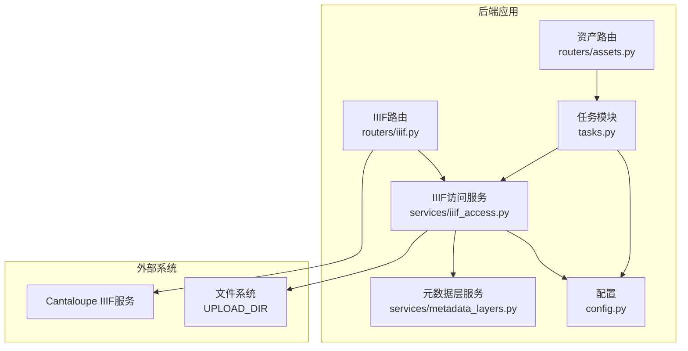
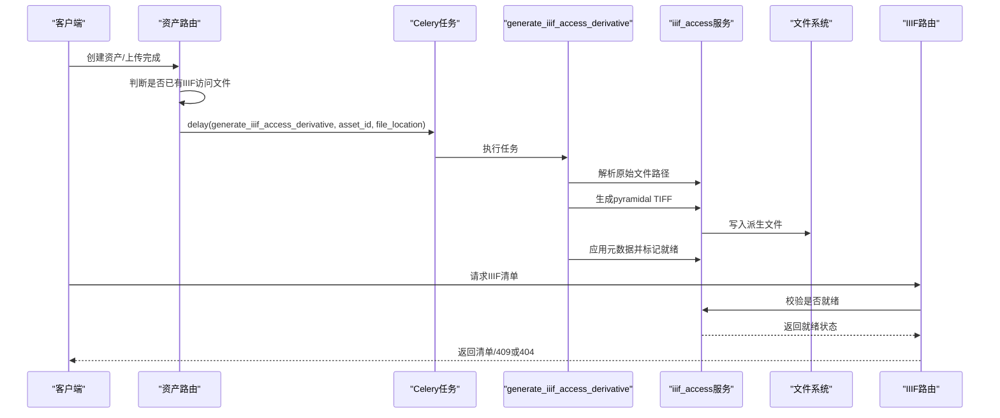
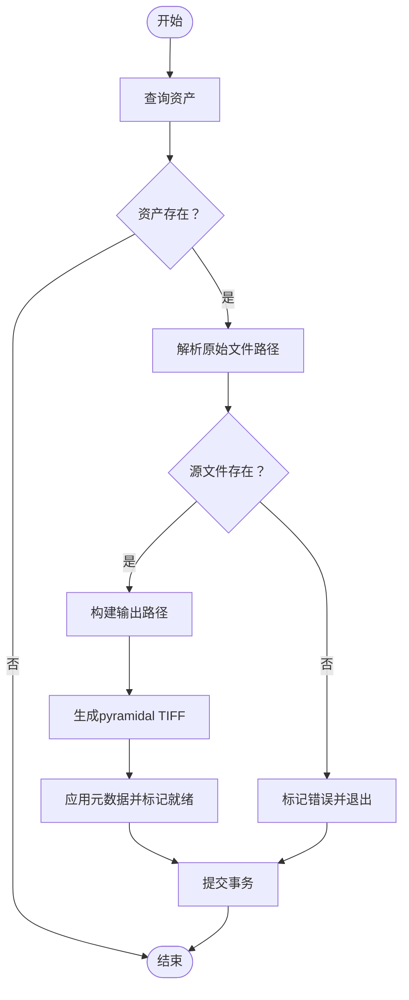
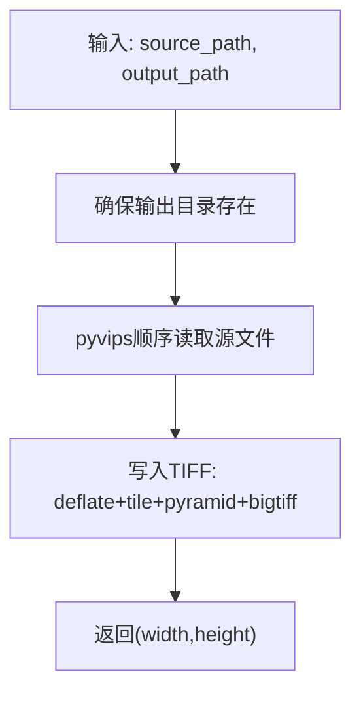
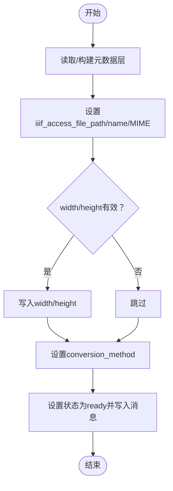
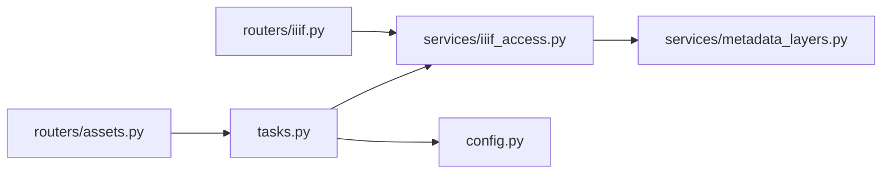

# IIIF派生文件生成

<cite>
**本文引用的文件**
- [tasks.py](file://backend/app/tasks.py)
- [iiif_access.py](file://backend/app/services/iiif_access.py)
- [metadata_layers.py](file://backend/app/services/metadata_layers.py)
- [config.py](file://backend/app/config.py)
- [assets.py](file://backend/app/routers/assets.py)
- [iiif.py](file://backend/app/routers/iiif.py)
- [test_iiif_access_phase1.py](file://backend/tests/test_iiif_access_phase1.py)
- [IMAGE_IIIF_ACCESS_FORMAT_PHASE1_PLAN.md](file://docs/04-实施方案/IMAGE_IIIF_ACCESS_FORMAT_PHASE1_PLAN.md)
- [derivative_policy.py](file://backend/app/services/derivative_policy.py)
- [backfill_pyramidal_tiffs.py](file://backend/scripts/backfill_pyramidal_tiffs.py)
</cite>

## 目录
1. [简介](#简介)
2. [项目结构](#项目结构)
3. [核心组件](#核心组件)
4. [架构总览](#架构总览)
5. [详细组件分析](#详细组件分析)
6. [依赖分析](#依赖分析)
7. [性能考虑](#性能考虑)
8. [故障排查指南](#故障排查指南)
9. [结论](#结论)
10. [附录](#附录)

## 简介
本文件面向IIIF派生文件生成任务，聚焦generate_iiif_access_derivative任务的实现原理与使用方法，涵盖以下要点：
- pyramidal TIFF的生成算法与尺寸金字塔构建
- 压缩参数与存储格式（BigTIFF、tiled、pyramid、deflate）
- 任务参数含义与验证规则（asset_id查找、original_path处理）
- apply_iiif_access_derivative函数的工作机制（文件路径构建、权限设置、元数据更新）
- 执行过程中的异常处理与错误恢复
- 任务调用示例与性能优化建议

## 项目结构
与IIIF派生文件生成直接相关的后端模块分布如下：
- 任务定义与调度：backend/app/tasks.py
- IIIF访问派生文件服务：backend/app/services/iiif_access.py
- 元数据层与字段规范：backend/app/services/metadata_layers.py
- 配置项（上传目录、Cantaloupe地址等）：backend/app/config.py
- 资产路由（触发任务与状态更新）：backend/app/routers/assets.py
- IIIF清单路由（校验派生文件可用性）：backend/app/routers/iiif.py
- 测试用例（覆盖任务行为与输出）：backend/tests/test_iiif_access_phase1.py
- 实施方案文档（格式与策略说明）：docs/04-实施方案/IMAGE_IIIF_ACCESS_FORMAT_PHASE1_PLAN.md
- 衍生策略（规则推断）：backend/app/services/derivative_policy.py
- 后补脚本（批量生成pyramidal TIFF）：backend/scripts/backfill_pyramidal_tiffs.py

图表来源
- [tasks.py:151-181](file://backend/app/tasks.py#L151-L181)
- [iiif_access.py:182-258](file://backend/app/services/iiif_access.py#L182-L258)
- [assets.py:120-133](file://backend/app/routers/assets.py#L120-L133)
- [iiif.py:138-136](file://backend/app/routers/iiif.py#L138-L136)

章节来源
- [tasks.py:151-181](file://backend/app/tasks.py#L151-L181)
- [iiif_access.py:182-258](file://backend/app/services/iiif_access.py#L182-L258)
- [assets.py:120-133](file://backend/app/routers/assets.py#L120-L133)
- [iiif.py:138-136](file://backend/app/routers/iiif.py#L138-L136)

## 核心组件
- generate_iiif_access_derivative：Celery任务，负责加载资产、解析源文件路径、生成pyramidal TIFF、更新元数据并标记就绪。
- generate_pyramidal_tiff_access_copy：基于pyvips的图像转换函数，生成带金字塔、平铺、BigTIFF的TIFF文件。
- apply_iiif_access_derivative：将生成结果写入资产元数据的技术层，设置文件名、MIME类型、尺寸、转换方法，并更新状态。
- get_asset_original_file_path/build_iiif_access_output_path：用于从资产元数据或文件路径中解析原始文件路径与派生文件输出路径。
- requires_iiif_access_derivative/is_iiif_ready：根据技术元数据判断是否需要生成派生文件以及当前是否已就绪。
- 资产路由与IIIF路由：在资产入库时触发任务，在请求IIIF清单时校验派生文件可用性。

章节来源
- [tasks.py:151-181](file://backend/app/tasks.py#L151-L181)
- [iiif_access.py:187-258](file://backend/app/services/iiif_access.py#L187-L258)
- [iiif_access.py:45-56](file://backend/app/services/iiif_access.py#L45-L56)
- [iiif_access.py:182-184](file://backend/app/services/iiif_access.py#L182-L184)
- [iiif_access.py:103-112](file://backend/app/services/iiif_access.py#L103-L112)
- [iiif.py:138-136](file://backend/app/routers/iiif.py#L138-L136)

## 架构总览
下图展示从资产入库到IIIF可用的关键流程与组件交互。

图表来源
- [assets.py:120-133](file://backend/app/routers/assets.py#L120-L133)
- [tasks.py:151-181](file://backend/app/tasks.py#L151-L181)
- [iiif_access.py:187-258](file://backend/app/services/iiif_access.py#L187-L258)
- [iiif.py:138-136](file://backend/app/routers/iiif.py#L138-L136)

## 详细组件分析

### 任务：generate_iiif_access_derivative
- 触发入口：资产路由在入库完成后若未检测到IIIF访问文件，则通过Celery异步触发该任务。
- 参数解析：
  - asset_id：目标资产ID，用于数据库查询。
  - original_path：可选，若传入则优先使用；否则通过get_asset_original_file_path从资产元数据或文件路径解析。
- 处理流程：
  - 查询资产并校验存在性。
  - 解析源文件路径并检查文件是否存在。
  - 生成输出路径（基于UPLOAD_DIR/derivatives/asset-{id}/iiif-access.pyramidal.tiff）。
  - 调用generate_pyramidal_tiff_access_copy生成pyramidal TIFF，返回宽高。
  - 调用apply_iiif_access_derivative写入元数据并标记“ready”。
  - 异常捕获：记录错误状态与消息，提交事务并关闭会话。
- 关键点：
  - 采用pyvips顺序访问模式读取源文件，避免内存压力。
  - 生成文件包含金字塔、平铺、BigTIFF，便于IIIF高效分块读取与缩放。

图表来源
- [tasks.py:151-181](file://backend/app/tasks.py#L151-L181)
- [iiif_access.py:187-199](file://backend/app/services/iiif_access.py#L187-L199)
- [iiif_access.py:230-258](file://backend/app/services/iiif_access.py#L230-L258)

章节来源
- [tasks.py:151-181](file://backend/app/tasks.py#L151-L181)
- [assets.py:120-133](file://backend/app/routers/assets.py#L120-L133)

### 生成算法与参数：generate_pyramidal_tiff_access_copy
- 输入：源文件路径、输出文件路径。
- 算法步骤：
  - 确保输出目录存在。
  - 使用pyvips顺序访问模式加载源文件。
  - 写出TIFF文件，参数包括：
    - compression="deflate"：无损压缩，适合大图像且兼容性好。
    - tile=True：启用平铺。
    - tile_width/tile_height=256：IIIF常用瓦片大小。
    - pyramid=True：生成多分辨率金字塔。
    - bigtiff=True：支持超大文件偏移。
- 输出：返回图像宽度与高度（像素）。

图表来源
- [iiif_access.py:187-199](file://backend/app/services/iiif_access.py#L187-L199)

章节来源
- [iiif_access.py:187-199](file://backend/app/services/iiif_access.py#L187-L199)
- [IMAGE_IIIF_ACCESS_FORMAT_PHASE1_PLAN.md:79-119](file://docs/04-实施方案/IMAGE_IIIF_ACCESS_FORMAT_PHASE1_PLAN.md#L79-L119)

### 文件路径构建与元数据更新：apply_iiif_access_derivative
- 路径与文件名：
  - 将iiif_access_file_path、iiif_access_file_name写入技术元数据。
  - MIME类型固定为image/tiff。
- 尺寸与转换方法：
  - 若width/height>0则写入技术元数据。
  - conversion_method记录生成方法标识。
- 状态与消息：
  - 设置资产状态为“ready”，process_message提示就绪。
- 权限设置：
  - 该函数不直接操作文件系统权限，但生成的文件位于UPLOAD_DIR下，应遵循系统默认权限策略。

图表来源
- [iiif_access.py:230-258](file://backend/app/services/iiif_access.py#L230-L258)

章节来源
- [iiif_access.py:230-258](file://backend/app/services/iiif_access.py#L230-L258)

### 资产元数据与技术字段
- 技术元数据字段（节选）：
  - original_file_path/name/size/mime_type：原始文件信息
  - iiif_access_file_path/name/mime_type：IIIF访问文件信息
  - preview_image_path/name/mime_type：预览图信息
  - conversion_method：转换方法标识
  - derivative_rule_id/strategy/priority/target_format/source_family/reason/thresholds：衍生策略相关信息
  - width/height：图像尺寸
  - error_message：错误信息
- 字段用途：
  - 用于资产详情、IIIF清单、下载与Bag打包等场景。
  - 作为是否需要生成派生文件的判定依据。

章节来源
- [metadata_layers.py:48-86](file://backend/app/services/metadata_layers.py#L48-L86)

### 派生策略与就绪判定
- requires_iiif_access_derivative：当派生优先级为required，或策略为generate_pyramidal_tiff且源文件族为psb/tiff，或规则ID为特定值时，需要生成派生文件。
- is_iiif_ready：资产状态为ready且存在有效的IIIF访问文件（允许回退到原始文件）即视为就绪。

章节来源
- [iiif_access.py:45-56](file://backend/app/services/iiif_access.py#L45-L56)
- [iiif_access.py:176-179](file://backend/app/services/iiif_access.py#L176-L179)

### 任务参数与验证规则
- asset_id：
  - 必填，用于数据库查询资产。
  - 若不存在，任务直接返回并打印提示。
- original_path：
  - 可选，若传入则优先使用。
  - 若未传入，通过get_asset_original_file_path从技术元数据或资产文件路径解析。
  - 若解析结果为空或文件不存在，抛出FileNotFoundError并进入错误分支。
- 输出路径：
  - 基于UPLOAD_DIR与固定目录结构生成，文件名为iiif-access.pyramidal.tiff。
- 权限与可见性：
  - 任务本身不直接设置文件系统权限，但生成文件位于UPLOAD_DIR下，应遵循系统默认权限策略。

章节来源
- [tasks.py:151-181](file://backend/app/tasks.py#L151-L181)
- [iiif_access.py:103-112](file://backend/app/services/iiif_access.py#L103-L112)
- [iiif_access.py:182-184](file://backend/app/services/iiif_access.py#L182-L184)

### IIIF清单与可用性校验
- IIIF路由在生成清单前会解析源文件路径：
  - 优先使用IIIF访问文件，允许回退到原始文件。
  - 若需要派生文件而尚未生成，返回409；否则找不到源文件返回404。
- 这保证了只有在派生文件就绪时才对外暴露访问。

章节来源
- [iiif.py:111-135](file://backend/app/routers/iiif.py#L111-L135)

### 测试用例与行为验证
- 测试覆盖：
  - 生成任务运行后，资产状态变为ready，技术元数据包含iiif_access_file_path与original_file_path，且两者不同。
  - 当派生文件存在时，清单指向派生文件；下载与Bag打包同时包含原始与派生文件。
  - 对于强制要求派生文件的资产，若尚未生成则返回409。
- 用例参考：
  - [test_iiif_access_phase1.py:148-174](file://backend/tests/test_iiif_access_phase1.py#L148-L174)
  - [test_iiif_access_phase1.py:92-125](file://backend/tests/test_iiif_access_phase1.py#L92-L125)

章节来源
- [test_iiif_access_phase1.py:148-174](file://backend/tests/test_iiif_access_phase1.py#L148-L174)
- [test_iiif_access_phase1.py:92-125](file://backend/tests/test_iiif_access_phase1.py#L92-L125)

## 依赖分析
- 组件耦合：
  - generate_iiif_access_derivative依赖iiif_access服务的路径解析、生成与元数据写入。
  - IIIF路由依赖requires_iiif_access_derivative与is_iiif_ready进行可用性判定。
  - 资产路由在入库后决定是否触发任务。
- 外部依赖：
  - pyvips：图像读取与写入。
  - 文件系统：读写源文件与派生文件。
  - 配置：UPLOAD_DIR、CANTALOUPE_PUBLIC_URL等。

图表来源
- [tasks.py:151-181](file://backend/app/tasks.py#L151-L181)
- [iiif_access.py:182-258](file://backend/app/services/iiif_access.py#L182-L258)
- [assets.py:120-133](file://backend/app/routers/assets.py#L120-L133)
- [iiif.py:138-136](file://backend/app/routers/iiif.py#L138-L136)

章节来源
- [tasks.py:151-181](file://backend/app/tasks.py#L151-L181)
- [iiif_access.py:182-258](file://backend/app/services/iiif_access.py#L182-L258)
- [assets.py:120-133](file://backend/app/routers/assets.py#L120-L133)
- [iiif.py:138-136](file://backend/app/routers/iiif.py#L138-L136)

## 性能考虑
- 图像读写：
  - 使用pyvips顺序访问模式，降低内存占用，适合超大图像。
  - 平铺（256×256）与金字塔减少IIIF请求时的网络与解码开销。
- 存储与I/O：
  - BigTIFF支持超大文件偏移，避免标准TIFF限制。
  - deflate压缩在保持像素精度的同时显著减小体积。
- 批量处理：
  - 提供后补脚本，按策略批量生成pyramidal TIFF，避免单次任务压力过大。
- 资源隔离：
  - 生成任务独立于主业务流程，通过Celery异步执行，避免阻塞API响应。

章节来源
- [iiif_access.py:187-199](file://backend/app/services/iiif_access.py#L187-L199)
- [IMAGE_IIIF_ACCESS_FORMAT_PHASE1_PLAN.md:79-119](file://docs/04-实施方案/IMAGE_IIIF_ACCESS_FORMAT_PHASE1_PLAN.md#L79-L119)
- [backfill_pyramidal_tiffs.py:76-169](file://backend/scripts/backfill_pyramidal_tiffs.py#L76-L169)

## 故障排查指南
- 常见错误与处理：
  - 资产不存在：任务直接返回，打印提示。检查asset_id是否正确。
  - 源文件缺失：抛出FileNotFoundError并标记错误状态。确认original_path或技术元数据中的original_file_path是否正确。
  - 生成失败：捕获异常并记录error_message，状态置为error。检查磁盘空间、权限与pyvips可用性。
- 排查步骤：
  - 检查资产状态与process_message。
  - 查看技术元数据中的error_message与conversion_method。
  - 确认输出文件是否存在且可被IIIF服务访问。
  - 在IIIF路由中触发清单请求，观察返回状态（409/404）以定位问题。
- 相关实现：
  - 错误标记与消息写入：[_mark_asset_error:23-43](file://backend/app/tasks.py#L23-L43)
  - IIIF可用性校验与错误返回：[iiif.py:111-135](file://backend/app/routers/iiif.py#L111-L135)

章节来源
- [tasks.py:23-43](file://backend/app/tasks.py#L23-L43)
- [iiif.py:111-135](file://backend/app/routers/iiif.py#L111-L135)

## 结论
generate_iiif_access_derivative任务通过pyramidal TIFF的生成与元数据更新，实现了对大型图像的IIIF高效访问。其设计强调：
- 保留原始文件，生成独立的访问派生文件；
- 采用金字塔、平铺与BigTIFF提升IIIF性能与兼容性；
- 严格的参数校验与错误处理保障稳定性；
- 与路由层协同，确保在就绪状态下对外提供服务。

## 附录

### 任务调用示例
- 同步运行（测试/调试）：
  - 调用路径：[tasks.py:184-186](file://backend/app/tasks.py#L184-L186)
  - 示例：generate_iiif_access_derivative.run(asset_id, original_path)
- 异步延迟（生产）：
  - 调用路径：[assets.py:130-131](file://backend/app/routers/assets.py#L130-L131)
  - 示例：generate_iiif_access_derivative.delay(asset_id, file_location)

章节来源
- [tasks.py:184-186](file://backend/app/tasks.py#L184-L186)
- [assets.py:130-131](file://backend/app/routers/assets.py#L130-L131)

### 任务参数说明
- asset_id：整数，资产唯一标识。
- original_path：字符串（可选），源文件绝对路径。若未提供，将从资产元数据解析。
- 输出文件：固定命名为iiif-access.pyramidal.tiff，存放于UPLOAD_DIR/derivatives/asset-{id}/目录。

章节来源
- [tasks.py:151-181](file://backend/app/tasks.py#L151-L181)
- [iiif_access.py:182-184](file://backend/app/services/iiif_access.py#L182-L184)

### 生成参数与策略
- 压缩：deflate（无损）
- 平铺：256×256
- 金字塔：开启
- 大文件：BigTIFF
- 规则来源：derivative_policy.py中的规则推断

章节来源
- [iiif_access.py:187-199](file://backend/app/services/iiif_access.py#L187-L199)
- [derivative_policy.py:87-113](file://backend/app/services/derivative_policy.py#L87-L113)