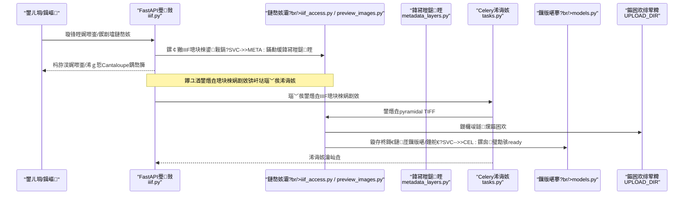
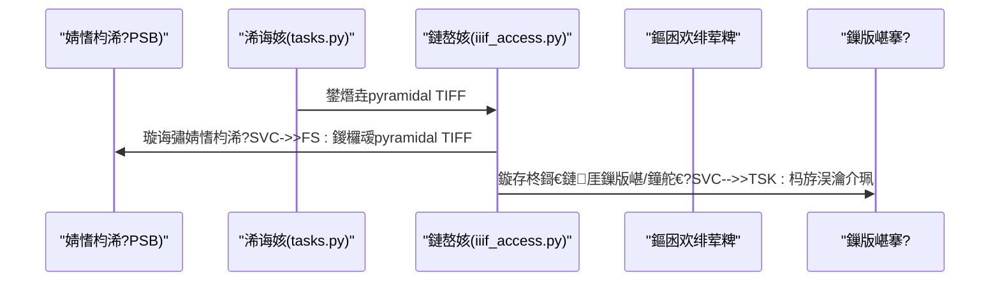
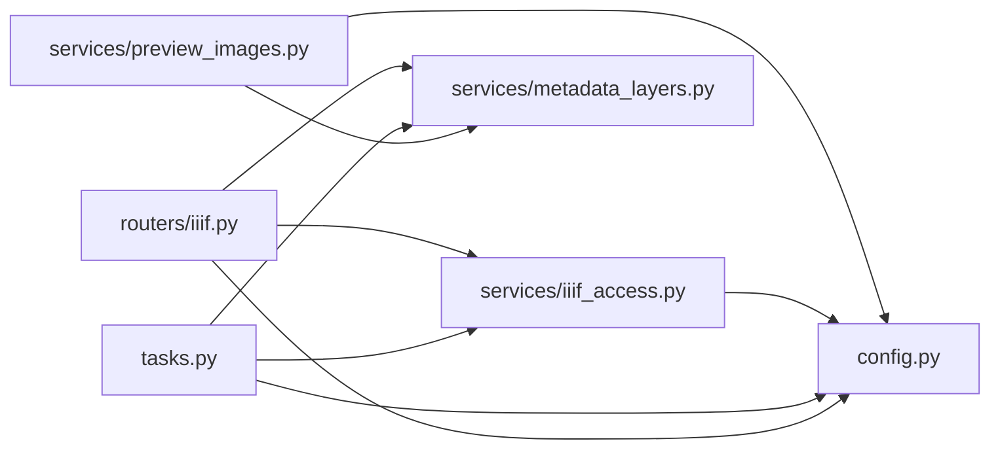

# 鍥惧儚澶勭悊宸ヤ綔娴佺▼

<cite>
**鏈枃寮曠敤鐨勬枃浠?*
- [backend/app/services/iiif_access.py](file://backend/app/services/iiif_access.py)
- [backend/app/services/preview_images.py](file://backend/app/services/preview_images.py)
- [backend/app/services/derivative_policy.py](file://backend/app/services/derivative_policy.py)
- [backend/app/services/metadata_layers.py](file://backend/app/services/metadata_layers.py)
- [backend/app/tasks.py](file://backend/app/tasks.py)
- [backend/app/routers/iiif.py](file://backend/app/routers/iiif.py)
- [backend/app/celery_app.py](file://backend/app/celery_app.py)
- [backend/app/config.py](file://backend/app/config.py)
- [backend/scripts/backfill_pyramidal_tiffs.py](file://backend/scripts/backfill_pyramidal_tiffs.py)
- [docs/03-浜у搧涓庢祦绋?IMAGE_DERIVATIVE_POLICY.md](file://docs/03-浜у搧涓庢祦绋?IMAGE_DERIVATIVE_POLICY.md)
- [backend/tests/test_iiif_access_phase1.py](file://backend/tests/test_iiif_access_phase1.py)
- [backend/tests/test_preview_images.py](file://backend/tests/test_preview_images.py)
- [backend/app/models.py](file://backend/app/models.py)
</cite>

## 鐩綍
1. [绠€浠媇(#绠€浠?
2. [椤圭洰缁撴瀯](#椤圭洰缁撴瀯)
3. [鏍稿績缁勪欢](#鏍稿績缁勪欢)
4. [鏋舵瀯鎬昏](#鏋舵瀯鎬昏)
5. [璇︾粏缁勪欢鍒嗘瀽](#璇︾粏缁勪欢鍒嗘瀽)
6. [渚濊禆鍒嗘瀽](#渚濊禆鍒嗘瀽)
7. [鎬ц兘鑰冭檻](#鎬ц兘鑰冭檻)
8. [鏁呴殰鎺掓煡鎸囧崡](#鏁呴殰鎺掓煡鎸囧崡)
9. [缁撹](#缁撹)
10. [闄勫綍](#闄勫綍)

## 绠€浠?鏈枃浠堕潰鍚慚DAMS鍘熷瀷椤圭洰鐨勫浘鍍忓鐞嗗伐浣滄祦绋嬶紝鑱氱劍浠ヤ笅鐩爣锛?- IIIF娲剧敓鏂囦欢鐢熸垚娴佺▼锛歱yramidal TIFF鐨勫垱寤恒€佸昂瀵歌绠椼€佽川閲忔帶鍒?- 棰勮鍥剧敓鎴愭満鍒讹細缂╃暐鍥惧垱寤恒€佹牸寮忚浆鎹€佺紦瀛樼瓥鐣?- 鍥惧儚鏍煎紡杞崲娴佺▼锛歅SB鍒癟IFF鐨勮浆鎹€侀鑹茬┖闂村鐞嗐€佸厓鏁版嵁淇濈暀
- 鎵归噺澶勭悊涓庡洖濉换鍔★細鍘嗗彶鏁版嵁澶勭悊銆佸閲忔洿鏂般€佽繘搴﹁窡韪?- 浠诲姟璋冪敤绀轰緥涓庡弬鏁伴厤缃細Celery浠诲姟銆佽矾鐢辨帴鍙ｃ€佽剼鏈弬鏁?- 澶辫触鍥炴粴涓庨敊璇仮澶嶇瓥鐣ワ細鐘舵€佹爣璁般€佸厓鏁版嵁鍐欏叆銆佸箓绛夊鐞?
## 椤圭洰缁撴瀯
涓庡浘鍍忓鐞嗙洿鎺ョ浉鍏崇殑鏍稿績妯″潡鍒嗗竷濡備笅锛?- 鏈嶅姟灞傦細璐熻矗绛栫暐鍒ゆ柇銆佹淳鐢熺敓鎴愩€侀瑙堢敓鎴愩€佸厓鏁版嵁灞傛瀯寤?- 浠诲姟灞傦細鍩轰簬Celery鐨勪换鍔＄紪鎺掞紝寮傛鎵ц娲剧敓鐢熸垚涓庡洖濉?- 璺敱灞傦細瀵瑰鏆撮湶IIIF娓呭崟涓庝唬鐞嗘帴鍙ｏ紝椹卞姩娲剧敓鍙敤鎬ф牎楠?- 鑴氭湰灞傦細鎵归噺鍥炲～鑴氭湰锛屾敮鎸佸巻鍙叉暟鎹笌澧為噺鏇存柊
- 閰嶇疆灞傦細涓婁紶鐩綍銆丷edis闃熷垪銆丆antaloupe鍦板潃绛夎繍琛屾椂鍙傛暟

```mermaid
graph TB
subgraph "鍚庣鏈嶅姟"
S1["鏈嶅姟: 娲剧敓绛栫暐<br/>derivative_policy.py"]
S2["鏈嶅姟: IIIF璁块棶娲剧敓<br/>iiif_access.py"]
S3["鏈嶅姟: 棰勮鍥剧敓鎴?br/>preview_images.py"]
S4["鏈嶅姟: 鍏冩暟鎹眰<br/>metadata_layers.py"]
T["浠诲姟: Celery浠诲姟<br/>tasks.py"]
R["璺敱: IIIF鎺ュ彛<br/>routers/iiif.py"]
C["閰嶇疆: 搴旂敤閰嶇疆<br/>config.py"]
M["妯″瀷: 璧勪骇/璁板綍<br/>models.py"]
end
subgraph "鑴氭湰涓庢枃妗?
B["鑴氭湰: 鍥炲～pyramidal TIFF<br/>scripts/backfill_pyramidal_tiffs.py"]
D["鏂囨。: 娲剧敓绛栫暐璇存槑<br/>docs/IMAGE_DERIVATIVE_POLICY.md"]
end
R --> S2
R --> S4
T --> S2
T --> S4
S2 --> S1
S3 --> S4
B --> S1
B --> S2
B --> M
T --> M
R --> C
S2 --> C
S3 --> C
```

**鍥捐〃鏉ユ簮**
- [backend/app/services/derivative_policy.py:1-113](file://backend/app/services/derivative_policy.py#L1-L113)
- [backend/app/services/iiif_access.py:45-213](file://backend/app/services/iiif_access.py#L45-L213)
- [backend/app/services/preview_images.py:1-104](file://backend/app/services/preview_images.py#L1-L104)
- [backend/app/services/metadata_layers.py:1-200](file://backend/app/services/metadata_layers.py#L1-L200)
- [backend/app/tasks.py:151-182](file://backend/app/tasks.py#L151-L182)
- [backend/app/routers/iiif.py:138-303](file://backend/app/routers/iiif.py#L138-L303)
- [backend/app/config.py:42-46](file://backend/app/config.py#L42-L46)
- [backend/scripts/backfill_pyramidal_tiffs.py:103-169](file://backend/scripts/backfill_pyramidal_tiffs.py#L103-L169)
- [docs/03-浜у搧涓庢祦绋?IMAGE_DERIVATIVE_POLICY.md:1-26](file://docs/03-浜у搧涓庢祦绋?IMAGE_DERIVATIVE_POLICY.md#L1-L26)

**绔犺妭鏉ユ簮**
- [backend/app/services/derivative_policy.py:1-113](file://backend/app/services/derivative_policy.py#L1-L113)
- [backend/app/services/iiif_access.py:45-213](file://backend/app/services/iiif_access.py#L45-L213)
- [backend/app/services/preview_images.py:1-104](file://backend/app/services/preview_images.py#L1-L104)
- [backend/app/services/metadata_layers.py:1-200](file://backend/app/services/metadata_layers.py#L1-L200)
- [backend/app/tasks.py:151-182](file://backend/app/tasks.py#L151-L182)
- [backend/app/routers/iiif.py:138-303](file://backend/app/routers/iiif.py#L138-L303)
- [backend/app/config.py:42-46](file://backend/app/config.py#L42-L46)
- [backend/scripts/backfill_pyramidal_tiffs.py:103-169](file://backend/scripts/backfill_pyramidal_tiffs.py#L103-L169)
- [docs/03-浜у搧涓庢祦绋?IMAGE_DERIVATIVE_POLICY.md:1-26](file://docs/03-浜у搧涓庢祦绋?IMAGE_DERIVATIVE_POLICY.md#L1-L26)

## 鏍稿績缁勪欢
- 娲剧敓绛栫暐鏈嶅姟锛氭牴鎹簮鏂囦欢绫诲瀷銆佸ぇ灏忋€佸儚绱犳暟鎺ㄥ鏄惁闇€瑕佺敓鎴恜yramidal TIFF鍙婁紭鍏堢骇
- IIIF璁块棶娲剧敓鏈嶅姟锛氱敓鎴恜yramidal TIFF锛屽～鍏呮妧鏈厓鏁版嵁锛屾爣璁拌祫浜т负ready
- 棰勮鍥炬湇鍔★細鍩轰簬pyramidal TIFF鎴栧師鍥剧敓鎴愰瑙堝浘锛屾敮鎸丒XIF鏃嬭浆銆侀€忔槑搴﹀悎鎴愩€丣PEG鍘嬬缉
- 鍏冩暟鎹眰鏈嶅姟锛氱粺涓€鏋勫缓core/management/technical/raw_metadata缁撴瀯锛屾敮鎾慖IIF涓庣晫闈㈠睍绀?- Celery浠诲姟锛氬紓姝ョ敓鎴怚IIF璁块棶娲剧敓銆丳SB杞珺igTIFF銆佷汉鑴歌瘑鍒瓑
- IIIF璺敱锛氭牎楠屾淳鐢熷彲鐢ㄦ€э紝浠ｇ悊Cantaloupe璇锋眰锛屾敞鍏anifest涓巌nfo.json
- 鍥炲～鑴氭湰锛氭壒閲忔壂鎻忚祫浜э紝鎸夌瓥鐣ョ敓鎴恜yramidal TIFF骞跺洖濉厓鏁版嵁

**绔犺妭鏉ユ簮**
- [backend/app/services/derivative_policy.py:55-113](file://backend/app/services/derivative_policy.py#L55-L113)
- [backend/app/services/iiif_access.py:187-213](file://backend/app/services/iiif_access.py#L187-L213)
- [backend/app/services/preview_images.py:85-104](file://backend/app/services/preview_images.py#L85-L104)
- [backend/app/services/metadata_layers.py:1-200](file://backend/app/services/metadata_layers.py#L1-L200)
- [backend/app/tasks.py:151-182](file://backend/app/tasks.py#L151-L182)
- [backend/app/routers/iiif.py:138-303](file://backend/app/routers/iiif.py#L138-L303)
- [backend/scripts/backfill_pyramidal_tiffs.py:103-169](file://backend/scripts/backfill_pyramidal_tiffs.py#L103-L169)

## 鏋舵瀯鎬昏
涓嬪浘灞曠ず浜嗕粠璧勪骇鍏ュ簱鍒癐IIF璁块棶鍙敤鐨勫叧閿矾寰勶紝浠ュ強棰勮鍥剧敓鎴愪笌鍥炲～鑴氭湰鐨勯泦鎴愩€?


**鍥捐〃鏉ユ簮**
- [backend/app/routers/iiif.py:138-303](file://backend/app/routers/iiif.py#L138-L303)
- [backend/app/services/iiif_access.py:187-213](file://backend/app/services/iiif_access.py#L187-L213)
- [backend/app/services/preview_images.py:85-104](file://backend/app/services/preview_images.py#L85-L104)
- [backend/app/services/metadata_layers.py:1-200](file://backend/app/services/metadata_layers.py#L1-L200)
- [backend/app/tasks.py:151-182](file://backend/app/tasks.py#L151-L182)
- [backend/app/models.py:6-26](file://backend/app/models.py#L6-L26)

## 璇︾粏缁勪欢鍒嗘瀽

### IIIF娲剧敓鐢熸垚娴佺▼锛坧yramidal TIFF锛?- 瑙﹀彂鏉′欢锛氭淳鐢熺瓥鐣ュ垽瀹氫负鈥滅敓鎴恜yramidal TIFF鈥濓紝鎴栬祫浜ц姹傗€滃繀闇€鈥濇淳鐢?- 鐢熸垚閫昏緫锛氫娇鐢╬yvips璇诲彇婧愭枃浠讹紝鍐欏叆甯︾摝鐗囦笌閲戝瓧濉旂殑BigTIFF锛岃缃帇缂┿€佺摝鐗囧昂瀵搞€侀噾瀛楀
- 灏哄璁＄畻锛氫粠婧愭枃浠惰鍙栧搴?楂樺害锛屼綔涓烘妧鏈厓鏁版嵁鍐欏洖
- 璐ㄩ噺鎺у埗锛歵ile灏哄鍥哄畾锛屽帇缂╅噰鐢╠eflate锛岄噾瀛楀寮€鍚紝閬垮厤strip浠ヤ繚鐣欏鍒嗚鲸鐜?- 鍏冩暟鎹洖濉細璁板綍鍘熷鏂囦欢淇℃伅銆佽闂枃浠惰矾寰勩€佽浆鎹㈡柟娉曘€佸楂樸€丮IME绫诲瀷绛?- 鐘舵€佹爣璁帮細鎴愬姛鍚庡皢璧勪骇鐘舵€佺疆涓簉eady锛屽啓鍏ュ鐞嗘秷鎭?
```mermaid
flowchart TD
Start(["寮€濮?]) --> CheckPolicy["妫€鏌ユ淳鐢熺瓥鐣?br/>derivative_policy.py"]
CheckPolicy --> |闇€瑕亅 BuildOutput["鏋勫缓杈撳嚭璺緞<br/>iiif_access.py"]
CheckPolicy --> |涓嶉渶瑕亅 Skip["璺宠繃鐢熸垚"]
BuildOutput --> ReadSource["璇诲彇婧愭枃浠?br/>pyvips"]
ReadSource --> WriteTiff["鍐欏叆pyramidal TIFF<br/>tile/pyramid/bigtiff"]
WriteTiff --> UpdateMeta["鏇存柊鎶€鏈厓鏁版嵁<br/>metadata_layers.py"]
UpdateMeta --> MarkReady["鏍囪璧勪骇ready<br/>tasks.py"]
MarkReady --> End(["缁撴潫"])
Skip --> End
```

**鍥捐〃鏉ユ簮**
- [backend/app/services/derivative_policy.py:55-113](file://backend/app/services/derivative_policy.py#L55-L113)
- [backend/app/services/iiif_access.py:187-213](file://backend/app/services/iiif_access.py#L187-L213)
- [backend/app/services/metadata_layers.py:1-200](file://backend/app/services/metadata_layers.py#L1-L200)
- [backend/app/tasks.py:151-182](file://backend/app/tasks.py#L151-L182)

**绔犺妭鏉ユ簮**
- [backend/app/services/iiif_access.py:187-213](file://backend/app/services/iiif_access.py#L187-L213)
- [backend/app/tasks.py:151-182](file://backend/app/tasks.py#L151-L182)
- [backend/app/services/metadata_layers.py:1-200](file://backend/app/services/metadata_layers.py#L1-L200)

### 棰勮鍥剧敓鎴愭満鍒?- 鐢熸垚鏉ユ簮锛氫紭鍏堜娇鐢↖IIF璁块棶鏂囦欢锛涜嫢涓嶅瓨鍦ㄥ垯鍥為€€鍒版妧鏈厓鏁版嵁涓殑棰勮鏂囦欢鎴栧師鍥撅紱鏈€鍚庡洖閫€鍒拌祫浜у綋鍓嶆枃浠?- 缂╂斁绛栫暐锛氭寜鏈€澶у搴﹂檺鍒惰繘琛岀缉鏀撅紝淇濇寔绾垫í姣?- 鏍煎紡杞崲锛氳嫢婧愪负4閫氶亾锛屽厛鍋氱櫧鑹茶儗鏅墎骞冲寲锛涙渶缁堣緭鍑篔PEG锛岃缃川閲忋€佷紭鍖栫紪鐮併€侀殧琛屾壂鎻?- 缂撳瓨绛栫暐锛氶瑙堟枃浠跺悕鍖呭惈婧愭枃浠剁殑mtime+size鎸囩汗锛屾簮鍙樺寲鍗崇敓鎴愭柊鏂囦欢锛岄伩鍏嶉檲鏃х紦瀛?- 澶囬€夋柟妗堬細pyvips澶辫触鏃跺洖閫€鍒癙illow锛岀‘淇濆吋瀹规€?
```mermaid
flowchart TD
PStart(["寮€濮?]) --> PickSource["閫夋嫨棰勮婧?br/>preview_images.py"]
PickSource --> Exists{"婧愭枃浠跺瓨鍦紵"}
Exists --> |鍚 Fail["杩斿洖None"]
Exists --> |鏄瘄 EnsureDir["纭繚杈撳嚭鐩綍"]
EnsureDir --> TryPyvips["灏濊瘯pyvips鐢熸垚"]
TryPyvips --> PyvipsOK{"鎴愬姛锛?}
PyvipsOK --> |鏄瘄 Done["杩斿洖棰勮璺緞"]
PyvipsOK --> |鍚 TryPillow["鍥為€€Pillow鐢熸垚"]
TryPillow --> PillowOK{"鎴愬姛锛?}
PillowOK --> |鏄瘄 Done
PillowOK --> |鍚 Fail
```

**鍥捐〃鏉ユ簮**
- [backend/app/services/preview_images.py:85-104](file://backend/app/services/preview_images.py#L85-L104)

**绔犺妭鏉ユ簮**
- [backend/app/services/preview_images.py:1-104](file://backend/app/services/preview_images.py#L1-L104)

### 鍥惧儚鏍煎紡杞崲娴佺▼锛圥SB鍒癟IFF锛?- 瑙﹀彂鏉′欢锛歅SB婧愭枃浠舵垨绛栫暐瑙勫垯瑕佹眰鐢熸垚pyramidal TIFF
- 杞崲绛栫暐锛氫娇鐢╬yvips鐢熸垚pyramidal TIFF锛屽惎鐢ㄩ噾瀛楀涓嶣igTIFF锛屼繚璇佸ぇ鏂囦欢绋冲畾璇诲彇
- 鍏冩暟鎹繚鐣欙細璁板綍鍘熷鏂囦欢璺緞/澶у皬/MIME銆佽闂枃浠惰矾寰?澶у皬/MIME銆佽浆鎹㈡柟娉曘€佸楂?- 鐘舵€佹洿鏂帮細鏍囪璧勪骇ready锛屽啓鍏ュ鐞嗘秷鎭?


**鍥捐〃鏉ユ簮**
- [backend/app/tasks.py:184-186](file://backend/app/tasks.py#L184-L186)
- [backend/app/services/iiif_access.py:187-213](file://backend/app/services/iiif_access.py#L187-L213)

**绔犺妭鏉ユ簮**
- [backend/app/tasks.py:184-186](file://backend/app/tasks.py#L184-L186)
- [backend/app/services/iiif_access.py:187-213](file://backend/app/services/iiif_access.py#L187-L213)

### 鎵归噺澶勭悊涓庡洖濉换鍔?- 鎵弿绛栫暐锛氶亶鍘嗚祫浜э紝鎸夋淳鐢熺瓥鐣ヨ繃婊ゅ€欓€夛紱妫€鏌ョ幇鏈夎闂枃浠舵槸鍚﹀瓨鍦ㄤ笖闈炲己鍒惰鐩?- 鐢熸垚涓庡洖濉細鐢熸垚pyramidal TIFF锛屾洿鏂版妧鏈厓鏁版嵁锛堝師濮嬫枃浠躲€佽闂枃浠躲€佽浆鎹㈡柟娉曘€佸楂橈級锛屾洿鏂拌祫浜ф枃浠惰矾寰勪笌MIME绫诲瀷锛屾爣璁皉eady
- 杩涘害缁熻锛氳褰曞凡杞崲銆佸凡璺宠繃銆佸け璐ユ暟閲忥紝鏀寔闄愬埗澶勭悊鏁伴噺
- 骞傜瓑鎬э細閫氳繃瀛樺湪鎬ф鏌ヤ笌寮哄埗瑕嗙洊寮€鍏抽伩鍏嶉噸澶嶇敓鎴?
```mermaid
flowchart TD
BStart(["寮€濮?]) --> QueryAssets["鏌ヨ璧勪骇鍒楄〃"]
QueryAssets --> Loop{"閫愪釜澶勭悊"}
Loop --> CheckCandidate["鏄惁澶у浘鍊欓€夛紵"]
CheckCandidate --> |鍚 Skip["璺宠繃"]
CheckCandidate --> |鏄瘄 CheckAccess["妫€鏌ヨ闂枃浠跺瓨鍦紵"]
CheckAccess --> |瀛樺湪涓旈潪寮哄埗| Skip
CheckAccess --> |涓嶅瓨鍦ㄦ垨寮哄埗| Convert["鐢熸垚pyramidal TIFF"]
Convert --> UpdateAsset["鏇存柊璧勪骇涓庡厓鏁版嵁"]
UpdateAsset --> Next["涓嬩竴涓?]
Skip --> Next
Next --> Loop
Loop --> |缁撴潫| BEnd(["缁熻涓庨€€鍑?])
```

**鍥捐〃鏉ユ簮**
- [backend/scripts/backfill_pyramidal_tiffs.py:103-169](file://backend/scripts/backfill_pyramidal_tiffs.py#L103-L169)

**绔犺妭鏉ユ簮**
- [backend/scripts/backfill_pyramidal_tiffs.py:103-169](file://backend/scripts/backfill_pyramidal_tiffs.py#L103-L169)

### 浠诲姟璋冪敤绀轰緥涓庡弬鏁伴厤缃?- Celery浠诲姟
  - 鐢熸垚IIIF璁块棶娲剧敓锛歡enerate_iiif_access_derivative(asset_id, original_path)
  - PSB杞珺igTIFF锛歝onvert_psb_to_bigtiff(asset_id, original_path)
- 璺敱鎺ュ彛
  - 鑾峰彇娓呭崟锛欸ET /iiif/{asset_id}/manifest
  - 浠ｇ悊鍥剧墖鏈嶅姟锛欸ET /iiif/{asset_id}/service/{image_path}
- 閰嶇疆鍙傛暟
  - UPLOAD_DIR锛氫笂浼犱笌娲剧敓鏂囦欢鏍圭洰褰?  - REDIS_URL锛欳elery闃熷垪
  - API_PUBLIC_URL / CANTALOUPE_PUBLIC_URL锛氬澶朥RL涓嶤antaloupe鍦板潃

**绔犺妭鏉ユ簮**
- [backend/app/tasks.py:151-186](file://backend/app/tasks.py#L151-L186)
- [backend/app/routers/iiif.py:138-303](file://backend/app/routers/iiif.py#L138-L303)
- [backend/app/config.py:42-46](file://backend/app/config.py#L42-L46)

### 澶辫触鍥炴粴涓庨敊璇仮澶?- 閿欒鎹曡幏锛氫换鍔′腑鎹曡幏寮傚父锛屾爣璁拌祫浜х姸鎬佷负error锛屽啓鍏ラ敊璇秷鎭埌鎶€鏈厓鏁版嵁
- 鍏冩暟鎹洖濉細缁熶竴閫氳繃鍏冩暟鎹眰閲嶅缓锛岀‘淇濆瓧娈典竴鑷存€?- 骞傜瓑澶勭悊锛氬洖濉剼鏈笌浠诲姟鍧囧寘鍚瓨鍦ㄦ€ф鏌ヤ笌寮哄埗瑕嗙洊寮€鍏筹紝閬垮厤閲嶅鍐欏叆
- 鐘舵€佹仮澶嶏細璧勪骇鐘舵€佷负error鏃讹紝璺敱杩斿洖409鎻愮ず娲剧敓鏈氨缁紝渚夸簬鍓嶇寮曞閲嶆柊瑙﹀彂

```mermaid
flowchart TD
EStart(["浠诲姟寮€濮?]) --> TryOp["鎵ц鐢熸垚鎿嶄綔"]
TryOp --> Ok{"鎴愬姛锛?}
Ok --> |鏄瘄 Commit["鎻愪氦浜嬪姟"]
Ok --> |鍚 MarkErr["鏍囪error骞跺啓鍏ラ敊璇秷鎭?]
MarkErr --> Rollback["鍥炴粴/閲嶈瘯绛栫暐"]
Rollback --> Commit
Commit --> EEnd(["缁撴潫"])
```

**鍥捐〃鏉ユ簮**
- [backend/app/tasks.py:23-44](file://backend/app/tasks.py#L23-L44)

**绔犺妭鏉ユ簮**
- [backend/app/tasks.py:23-44](file://backend/app/tasks.py#L23-L44)

## 渚濊禆鍒嗘瀽
- 缁勪欢鑰﹀悎
  - 璺敱渚濊禆鏈嶅姟灞傝繘琛屾淳鐢熷彲鐢ㄦ€ф牎楠屼笌鍏冩暟鎹瀯寤?  - 浠诲姟渚濊禆鏈嶅姟灞傜敓鎴愭淳鐢熷苟鏇存柊鏁版嵁搴?  - 棰勮鏈嶅姟渚濊禆鍏冩暟鎹眰涓庨厤缃眰
- 澶栭儴渚濊禆
  - Redis锛欳elery闃熷垪
  - pyvips锛氬浘鍍忚鍐欎笌閲戝瓧濉旂敓鎴?  - Pillow锛欽PEG鐢熸垚涓嶦XIF澶勭悊鍥為€€
  - Cantaloupe锛欼IIF鍥惧儚鏈嶅姟浠ｇ悊



**鍥捐〃鏉ユ簮**
- [backend/app/routers/iiif.py:138-303](file://backend/app/routers/iiif.py#L138-L303)
- [backend/app/services/iiif_access.py:187-213](file://backend/app/services/iiif_access.py#L187-L213)
- [backend/app/services/preview_images.py:1-104](file://backend/app/services/preview_images.py#L1-L104)
- [backend/app/services/metadata_layers.py:1-200](file://backend/app/services/metadata_layers.py#L1-L200)
- [backend/app/tasks.py:151-182](file://backend/app/tasks.py#L151-L182)
- [backend/app/config.py:42-46](file://backend/app/config.py#L42-L46)

**绔犺妭鏉ユ簮**
- [backend/app/routers/iiif.py:138-303](file://backend/app/routers/iiif.py#L138-L303)
- [backend/app/services/iiif_access.py:187-213](file://backend/app/services/iiif_access.py#L187-L213)
- [backend/app/services/preview_images.py:1-104](file://backend/app/services/preview_images.py#L1-L104)
- [backend/app/services/metadata_layers.py:1-200](file://backend/app/services/metadata_layers.py#L1-L200)
- [backend/app/tasks.py:151-182](file://backend/app/tasks.py#L151-L182)
- [backend/app/config.py:42-46](file://backend/app/config.py#L42-L46)

## 鎬ц兘鑰冭檻
- 鐡︾墖涓庨噾瀛楀锛歱yramidal TIFF閰嶅悎256脳256鐡︾墖锛屾樉钁楅檷浣庡ぇ鍥鹃甯у姞杞藉欢杩?- 鍘嬬缉绛栫暐锛歞eflate鍘嬬缉鍦ㄨ川閲忎笌浣撶Н闂村彇寰楀钩琛★紝閫傚悎IIIF鍦烘櫙
- 棰勮鍥撅細鏈€澶у搴﹂檺鍒朵笌JPEG璐ㄩ噺鍙傛暟鎺у埗棰勮浣撶Н涓庡姞杞介€熷害
- 寮傛澶勭悊锛欳elery闃熷垪瑙ｈ€︾敓鎴愪笌璇锋眰锛屾彁鍗囧苟鍙戝悶鍚?- 缂撳瓨鎸囩汗锛氶瑙堟枃浠跺悕鍖呭惈婧愭枃浠秏time+size锛岄伩鍏嶉檲鏃х紦瀛樺甫鏉ョ殑棰濆IO

## 鏁呴殰鎺掓煡鎸囧崡
- IIIF娓呭崟鎶ラ敊锛氭鏌ヨ祫浜х姸鎬佷笌鎶€鏈厓鏁版嵁涓殑璁块棶鏂囦欢璺緞鏄惁瀛樺湪
- 棰勮鍥句负绌猴細纭婧愭枃浠跺瓨鍦ㄤ笖鍙锛涜嫢pyvips澶辫触锛屾鏌illow渚濊禆涓庢潈闄?- 鍥炲～鑴氭湰鏈敓鎴愶細纭娲剧敓绛栫暐鍖归厤銆佽闂枃浠朵笉瀛樺湪鎴栦娇鐢ㄥ己鍒惰鐩栭€夐」
- 浠诲姟澶辫触锛氭煡鐪嬩换鍔℃棩蹇椾笌璧勪骇閿欒娑堟伅锛岀‘璁ゆ簮鏂囦欢璺緞涓庣鐩樼┖闂?
**绔犺妭鏉ユ簮**
- [backend/app/routers/iiif.py:138-303](file://backend/app/routers/iiif.py#L138-L303)
- [backend/app/services/preview_images.py:85-104](file://backend/app/services/preview_images.py#L85-L104)
- [backend/scripts/backfill_pyramidal_tiffs.py:103-169](file://backend/scripts/backfill_pyramidal_tiffs.py#L103-L169)
- [backend/app/tasks.py:23-44](file://backend/app/tasks.py#L23-L44)

## 缁撹
鏈伐浣滄祦绋嬩互鈥滅瓥鐣ラ┍鍔?寮傛娲剧敓+鍏冩暟鎹粺涓€鈥濈殑鏂瑰紡锛屽疄鐜颁簡浠嶱SB/TIFF鍒皃yramidal TIFF鐨勭ǔ瀹氳浆鎹紝缁撳悎棰勮鍥句笌IIIF浠ｇ悊锛屾弧瓒冲ぇ瑙勬ā鍥惧儚鐨勯珮鏁堟祻瑙堜笌闀挎湡淇濆瓨闇€姹傘€傞€氳繃鍥炲～鑴氭湰涓庝换鍔＄殑骞傜瓑璁捐锛岃兘澶熷畨鍏ㄥ湴瀵瑰巻鍙叉暟鎹繘琛屽閲忔洿鏂帮紝骞跺湪澶辫触鏃舵彁渚涙竻鏅扮殑鐘舵€佷笌鍏冩暟鎹弽棣堛€?
## 闄勫綍
- 娲剧敓绛栫暐鍙傝€冿細瑙佹枃妗ｈ鏄庯紝鏄庣‘涓嶅悓婧愭牸寮忕殑闃堝€间笌鎺ㄨ崘绛栫暐
- 娴嬭瘯楠岃瘉锛氬寘鍚獻IIF娲剧敓涓庨瑙堝浘鐢熸垚鐨勫崟鍏冩祴璇曪紝纭繚鍏抽敭璺緞姝ｇ‘鎬?
**绔犺妭鏉ユ簮**
- [docs/03-浜у搧涓庢祦绋?IMAGE_DERIVATIVE_POLICY.md:1-26](file://docs/03-浜у搧涓庢祦绋?IMAGE_DERIVATIVE_POLICY.md#L1-L26)
- [backend/tests/test_iiif_access_phase1.py:159-173](file://backend/tests/test_iiif_access_phase1.py#L159-L173)
- [backend/tests/test_preview_images.py:40-63](file://backend/tests/test_preview_images.py#L40-L63)
