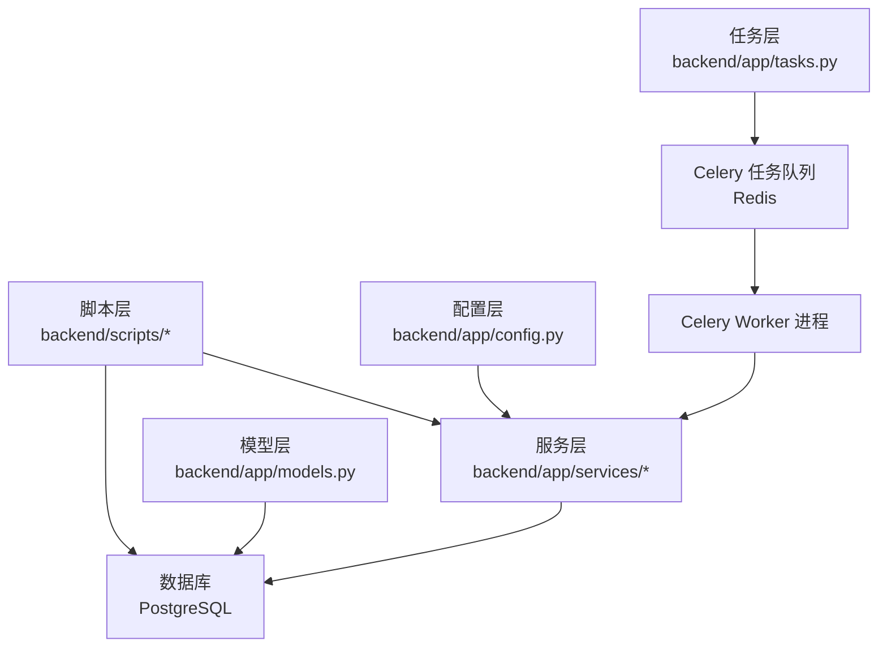
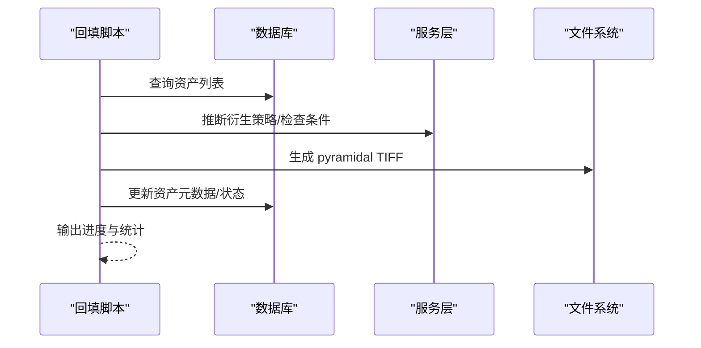
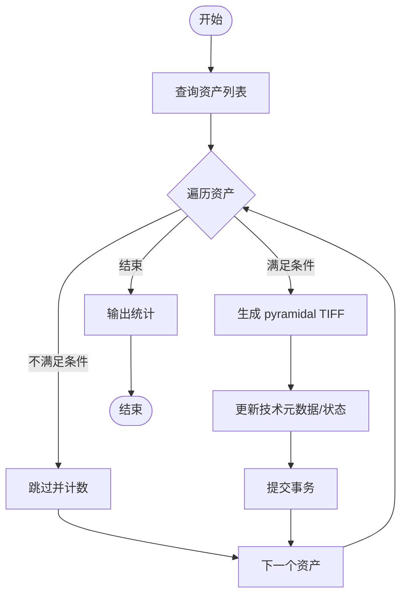
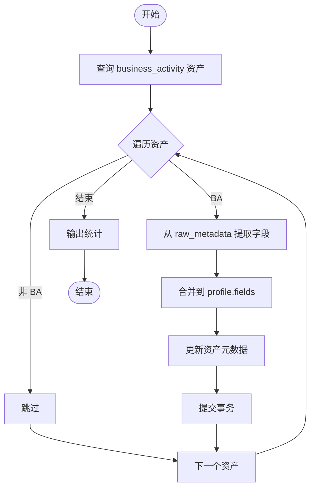
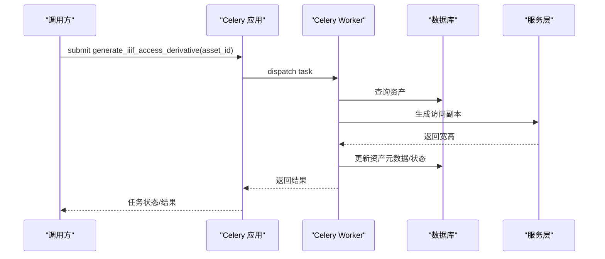
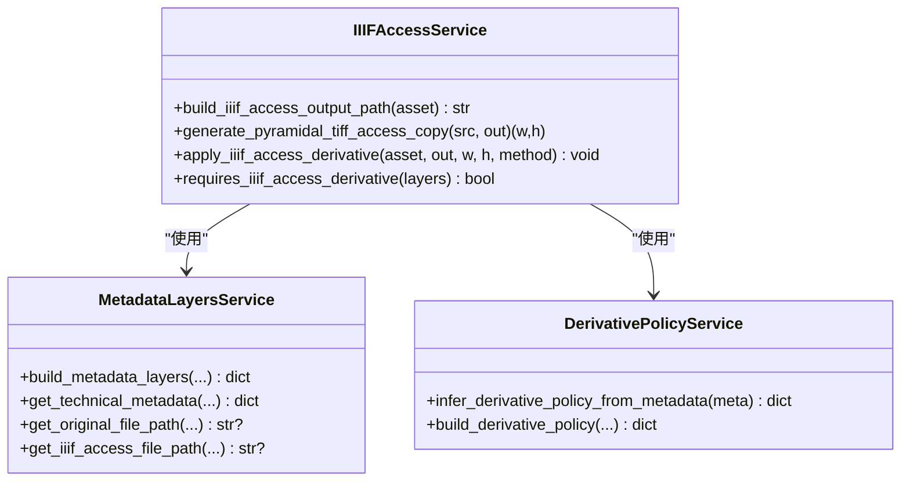
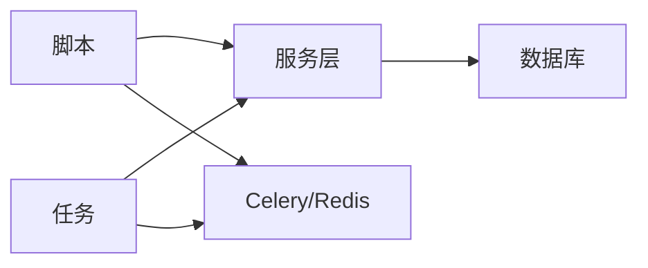

# 批量回填处理

<cite>
**本文引用的文件**
- [backfill_pyramidal_tiffs.py](file://backend/scripts/backfill_pyramidal_tiffs.py)
- [backfill_reference_business_activity.py](file://backend/scripts/backfill_reference_business_activity.py)
- [tasks.py](file://backend/app/tasks.py)
- [celery_app.py](file://backend/app/celery_app.py)
- [models.py](file://backend/app/models.py)
- [iiif_access.py](file://backend/app/services/iiif_access.py)
- [metadata_layers.py](file://backend/app/services/metadata_layers.py)
- [derivative_policy.py](file://backend/app/services/derivative_policy.py)
- [config.py](file://backend/app/config.py)
- [SCRIPT_AND_JOB_GUIDE.md](file://docs/05-部署与运维/SCRIPT_AND_JOB_GUIDE.md)
- [TROUBLESHOOTING.md](file://docs/05-部署与运维/TROUBLESHOOTING.md)
- [README.md](file://README.md)
</cite>

## 目录
1. [简介](#简介)
2. [项目结构](#项目结构)
3. [核心组件](#核心组件)
4. [架构总览](#架构总览)
5. [详细组件分析](#详细组件分析)
6. [依赖分析](#依赖分析)
7. [性能考虑](#性能考虑)
8. [故障排除指南](#故障排除指南)
9. [结论](#结论)
10. [附录](#附录)

## 简介
本文件聚焦于批量回填处理任务，围绕历史数据的批量补全与修复展开，涵盖两大类任务：
- 资产扫描与状态检查：识别需要生成 IIIF 访问副本的大图资产，并进行条件过滤与跳过逻辑。
- 批量任务创建与执行：通过脚本驱动资产扫描与转换，或通过 Celery 异步任务队列提交处理任务。

文档还详细说明回填脚本的工作原理（数据过滤条件、任务队列提交、进度监控）、性能优化策略（并发控制、内存管理、错误重试）、状态跟踪与日志记录（进度报告、错误汇总、完成通知），以及配置参数与执行示例，并提供监控与故障排除指南。

## 项目结构
与批量回填相关的后端代码主要分布在以下模块：
- 脚本层：位于 backend/scripts，负责离线批量处理历史数据。
- 任务层：位于 backend/app/tasks.py，定义 Celery 异步任务，用于在线或后台批量处理。
- 服务层：位于 backend/app/services，提供 IIIF 访问副本生成、元数据分层构建、衍生策略推断等能力。
- 配置与模型：backend/app/config.py 提供环境变量与路径配置；backend/app/models.py 定义资产与记录的数据模型。

图表来源
- [backfill_pyramidal_tiffs.py:1-199](file://backend/scripts/backfill_pyramidal_tiffs.py#L1-L199)
- [tasks.py:1-262](file://backend/app/tasks.py#L1-L262)
- [celery_app.py:1-19](file://backend/app/celery_app.py#L1-L19)
- [config.py:1-72](file://backend/app/config.py#L1-L72)

章节来源
- [README.md:67-79](file://README.md#L67-L79)
- [SCRIPT_AND_JOB_GUIDE.md:1-102](file://docs/05-部署与运维/SCRIPT_AND_JOB_GUIDE.md#L1-L102)

## 核心组件
- 脚本组件
  - backfill_pyramidal_tiffs.py：扫描资产，识别符合条件的大图 TIFF/PSB，生成 pyramidal TIFF 访问副本，更新技术元数据与状态。
  - backfill_reference_business_activity.py：从参考资源的原始元数据中提取业务活动字段，回填到现有资产的 profile 字段。
- 任务组件
  - generate_iiif_access_derivative：Celery 任务，生成 IIIF 访问副本并应用到资产。
  - recognize_business_activity_faces：人脸识别任务，基于业务活动记录与资产生成人脸识别元数据。
- 服务组件
  - iiif_access.py：IIIF 访问副本生成、路径解析、状态标记等。
  - metadata_layers.py：元数据分层构建与查询工具。
  - derivative_policy.py：根据文件大小、像素数与格式家族推断衍生策略。
- 配置与模型
  - config.py：数据库、Redis、上传目录、人脸识别等配置。
  - models.py：Asset、ImageRecord 等模型定义。

章节来源
- [backfill_pyramidal_tiffs.py:1-199](file://backend/scripts/backfill_pyramidal_tiffs.py#L1-L199)
- [backfill_reference_business_activity.py:1-100](file://backend/scripts/backfill_reference_business_activity.py#L1-L100)
- [tasks.py:1-262](file://backend/app/tasks.py#L1-L262)
- [iiif_access.py:1-259](file://backend/app/services/iiif_access.py#L1-L259)
- [metadata_layers.py:1-636](file://backend/app/services/metadata_layers.py#L1-L636)
- [derivative_policy.py:1-168](file://backend/app/services/derivative_policy.py#L1-L168)
- [config.py:1-72](file://backend/app/config.py#L1-L72)
- [models.py:1-307](file://backend/app/models.py#L1-L307)

## 架构总览
批量回填处理的整体流程分为两类：
- 离线脚本批量回填：脚本扫描数据库中的资产，按条件过滤并生成 IIIF 访问副本，更新资产元数据与状态。
- 在线/后台任务批量回填：通过 Celery 任务队列提交任务，异步生成 IIIF 访问副本或进行人脸识别等处理。

图表来源
- [backfill_pyramidal_tiffs.py:76-195](file://backend/scripts/backfill_pyramidal_tiffs.py#L76-L195)
- [iiif_access.py:187-259](file://backend/app/services/iiif_access.py#L187-L259)
- [metadata_layers.py:412-507](file://backend/app/services/metadata_layers.py#L412-L507)

## 详细组件分析

### 组件A：大图访问副本批量回填（脚本）
- 功能概述
  - 扫描资产表，识别满足条件的大图 TIFF/PSB，生成 pyramidal TIFF 访问副本，更新技术元数据（原始文件信息、访问文件信息、尺寸、转换方法等），并将资产状态置为 ready。
- 数据过滤条件
  - 文件后缀与 MIME 类型：限定为 TIFF/PSB 或特定 TIFF MIME 类型。
  - 技术元数据：排除已存在 pyramidal 转换或已存在 IIIF 访问文件路径的情况。
  - 衍生策略：仅当衍生策略为生成 pyramidal TIFF 且非强制保留原图时才处理。
  - 存在性检查：源文件存在且可访问。
- 任务队列提交
  - 该脚本为离线脚本，不直接提交 Celery 任务；如需批量任务化，可在脚本中封装调用 generate_iiif_access_derivative 任务。
- 进度监控
  - 控制台输出每条资产的处理状态（跳过/转换/失败），并在结束时打印统计结果。
- 错误处理
  - 转换异常被捕获并记录，不影响整体遍历；跳过与失败计数用于统计。

图表来源
- [backfill_pyramidal_tiffs.py:107-194](file://backend/scripts/backfill_pyramidal_tiffs.py#L107-L194)

章节来源
- [backfill_pyramidal_tiffs.py:30-47](file://backend/scripts/backfill_pyramidal_tiffs.py#L30-L47)
- [backfill_pyramidal_tiffs.py:123-138](file://backend/scripts/backfill_pyramidal_tiffs.py#L123-L138)
- [backfill_pyramidal_tiffs.py:141-187](file://backend/scripts/backfill_pyramidal_tiffs.py#L141-L187)
- [derivative_policy.py:72-142](file://backend/app/services/derivative_policy.py#L72-L142)
- [iiif_access.py:45-56](file://backend/app/services/iiif_access.py#L45-L56)

### 组件B：业务活动字段批量回填（脚本）
- 功能概述
  - 从参考资源的原始元数据中提取业务活动字段（主要地点、主要人物），回填到现有资产的 profile.fields 中。
- 数据过滤条件
  - 仅处理 profile.key 为 business_activity 的资产。
  - 从 raw_metadata 的多层级结构中查找参考资源的统一元数据层，按优先级选择字段值。
- 任务队列提交
  - 该脚本为离线脚本，不直接提交 Celery 任务。
- 进度监控
  - 控制台输出每次更新的资产 ID 与字段变化，结束时打印更新数量。

图表来源
- [backfill_reference_business_activity.py:40-95](file://backend/scripts/backfill_reference_business_activity.py#L40-L95)

章节来源
- [backfill_reference_business_activity.py:44-53](file://backend/scripts/backfill_reference_business_activity.py#L44-L53)
- [backfill_reference_business_activity.py:59-82](file://backend/scripts/backfill_reference_business_activity.py#L59-L82)

### 组件C：Celery 异步任务（批量任务创建）
- 任务定义
  - generate_iiif_access_derivative：生成 IIIF 访问副本并应用到资产，异常时标记错误状态与技术元数据。
  - recognize_business_activity_faces：对业务活动记录与资产执行人脸识别，更新元数据与状态。
- 任务队列提交
  - 通过 Celery 应用实例提交任务；任务绑定数据库会话，确保事务安全。
- 进度监控
  - 任务内部打印错误与成功信息；可通过 Celery 结果后端查询任务状态与结果。

图表来源
- [tasks.py:151-182](file://backend/app/tasks.py#L151-L182)
- [celery_app.py:5-15](file://backend/app/celery_app.py#L5-L15)

章节来源
- [tasks.py:151-182](file://backend/app/tasks.py#L151-L182)
- [tasks.py:189-261](file://backend/app/tasks.py#L189-L261)
- [celery_app.py:1-19](file://backend/app/celery_app.py#L1-L19)

### 组件D：服务层（IIIF 访问副本与元数据）
- IIIF 访问副本生成
  - 生成输出路径、调用 pyvips 生成 pyramidal TIFF、应用到资产并更新技术元数据。
- 元数据分层
  - 将核心、管理、技术、profile、raw_metadata 等分层构建，支持字段合并与查询。
- 衍生策略
  - 根据文件大小、像素数与格式家族推断衍生规则，决定是否生成 pyramidal TIFF。

图表来源
- [iiif_access.py:182-259](file://backend/app/services/iiif_access.py#L182-L259)
- [metadata_layers.py:412-507](file://backend/app/services/metadata_layers.py#L412-L507)
- [derivative_policy.py:144-167](file://backend/app/services/derivative_policy.py#L144-L167)

章节来源
- [iiif_access.py:187-259](file://backend/app/services/iiif_access.py#L187-L259)
- [metadata_layers.py:412-507](file://backend/app/services/metadata_layers.py#L412-L507)
- [derivative_policy.py:72-142](file://backend/app/services/derivative_policy.py#L72-L142)

## 依赖分析
- 组件耦合
  - 脚本依赖服务层（元数据分层、衍生策略、IIIF 访问生成）与数据库模型。
  - Celery 任务依赖服务层与数据库会话，保证事务一致性。
- 外部依赖
  - 数据库：PostgreSQL。
  - 任务队列：Redis。
  - 图像处理：pyvips。
- 潜在循环依赖
  - 服务层之间通过函数调用解耦，未发现循环依赖迹象。

图表来源
- [backfill_pyramidal_tiffs.py:97-101](file://backend/scripts/backfill_pyramidal_tiffs.py#L97-L101)
- [tasks.py:1-21](file://backend/app/tasks.py#L1-L21)
- [celery_app.py:3-10](file://backend/app/celery_app.py#L3-L10)

章节来源
- [models.py:6-26](file://backend/app/models.py#L6-L26)
- [config.py:42-46](file://backend/app/config.py#L42-L46)

## 性能考虑
- 并发控制
  - 脚本默认顺序处理，可通过限制处理数量与分批执行降低峰值资源占用。
  - Celery 任务通过 worker 数量与并发设置控制吞吐，避免同时大量生成大图导致磁盘与内存压力。
- 内存管理
  - 生成 pyramidal TIFF 时使用顺序访问模式，减少内存峰值；建议在磁盘空间充足的前提下进行批量生成。
- 错误重试
  - 脚本对单个资产转换异常进行捕获并继续处理；建议在任务层面引入重试策略与幂等设计。
- I/O 优化
  - 优先使用绝对路径与本地挂载目录，减少跨网络存储的 I/O 延迟。
- 批处理策略
  - 对于大规模回填，建议分批执行（limit 参数）并结合进度监控，避免长时间锁表。

章节来源
- [backfill_pyramidal_tiffs.py:82-83](file://backend/scripts/backfill_pyramidal_tiffs.py#L82-L83)
- [tasks.py:151-182](file://backend/app/tasks.py#L151-L182)
- [config.py:44-46](file://backend/app/config.py#L44-L46)

## 故障排除指南
- 数据库连接问题
  - 检查 DATABASE_URL 与容器健康状态；必要时使用本地独立测试库。
- Redis/Celery 问题
  - 检查 Redis 连接与 worker 日志；确认任务队列可用。
- 文件路径问题
  - 确认上传目录可写且路径正确；脚本会输出跳过与失败原因。
- IIIF 访问副本生成失败
  - 检查源文件是否存在与可读；确认磁盘空间与权限；查看任务错误日志。
- 业务活动字段回填无效
  - 确认资产 profile.key 为 business_activity；检查 raw_metadata 层级结构是否正确。

章节来源
- [TROUBLESHOOTING.md:51-84](file://docs/05-部署与运维/TROUBLESHOOTING.md#L51-L84)
- [backfill_pyramidal_tiffs.py:117-147](file://backend/scripts/backfill_pyramidal_tiffs.py#L117-L147)
- [backfill_reference_business_activity.py:44-53](file://backend/scripts/backfill_reference_business_activity.py#L44-L53)

## 结论
批量回填处理通过脚本与 Celery 任务两种方式，实现了对历史数据的高效补全与修复。脚本适合离线大规模处理，任务适合在线或后台批量处理。通过合理的过滤条件、状态跟踪与错误处理，能够有效保障回填质量与系统稳定性。建议在生产环境中结合并发控制、内存管理与重试策略，确保回填过程的可控与可观测。

## 附录

### 配置参数与执行示例
- 环境变量
  - DATABASE_URL：数据库连接串。
  - UPLOAD_DIR：上传目录（包含 derivatives 子目录）。
  - REDIS_URL：Redis 连接串。
  - CANTALOUPE_PUBLIC_URL：IIIF 服务地址。
- 回填脚本参数
  - backfill_pyramidal_tiffs.py
    - --database-url：数据库连接串。
    - --upload-dir：上传目录。
    - --dry-run：仅打印将要执行的操作，不实际写入。
    - --force：即使已存在访问文件也强制重建。
    - --limit：限制处理数量（0 表示不限制）。
  - backfill_reference_business_activity.py
    - --database-url：数据库连接串。
- Celery 任务
  - generate_iiif_access_derivative(asset_id, original_path=None)
  - recognize_business_activity_faces(record_id, asset_id)

章节来源
- [config.py:42-46](file://backend/app/config.py#L42-L46)
- [backfill_pyramidal_tiffs.py:76-83](file://backend/scripts/backfill_pyramidal_tiffs.py#L76-L83)
- [backfill_reference_business_activity.py:23-26](file://backend/scripts/backfill_reference_business_activity.py#L23-L26)
- [tasks.py:151-182](file://backend/app/tasks.py#L151-L182)
- [tasks.py:189-261](file://backend/app/tasks.py#L189-L261)