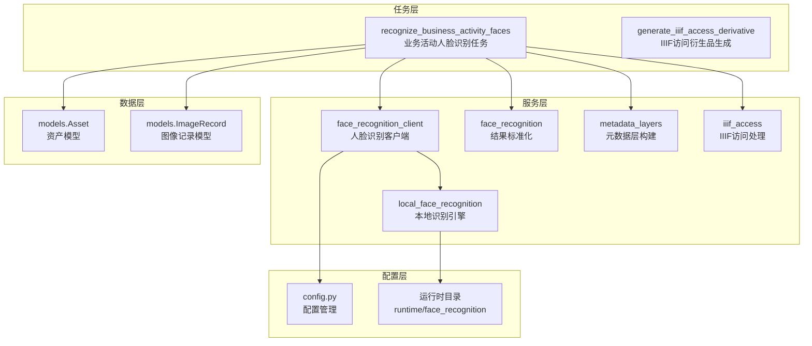
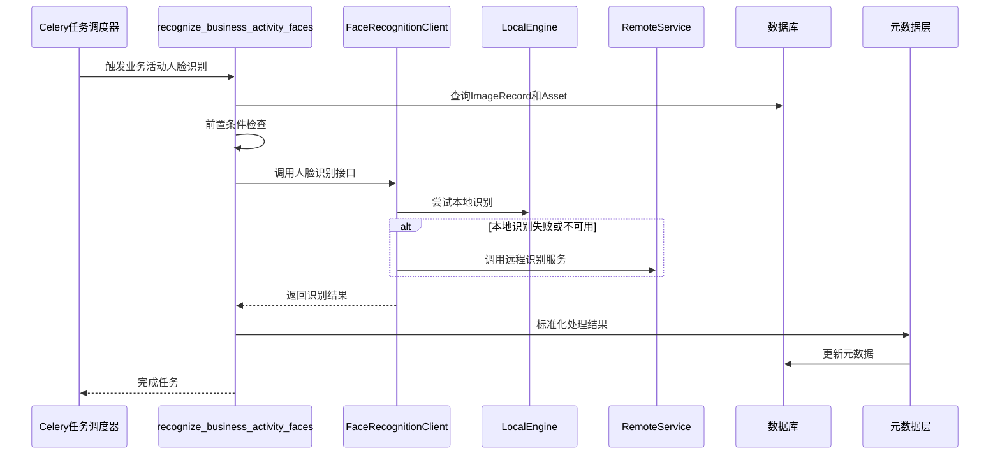
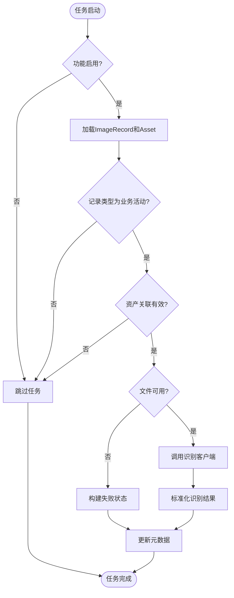
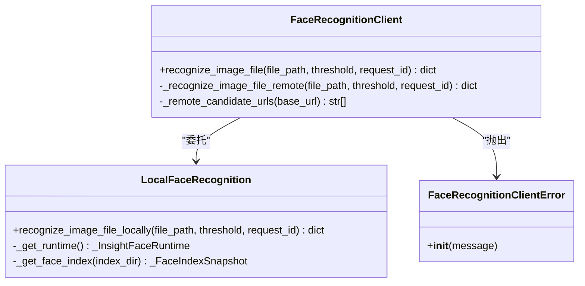
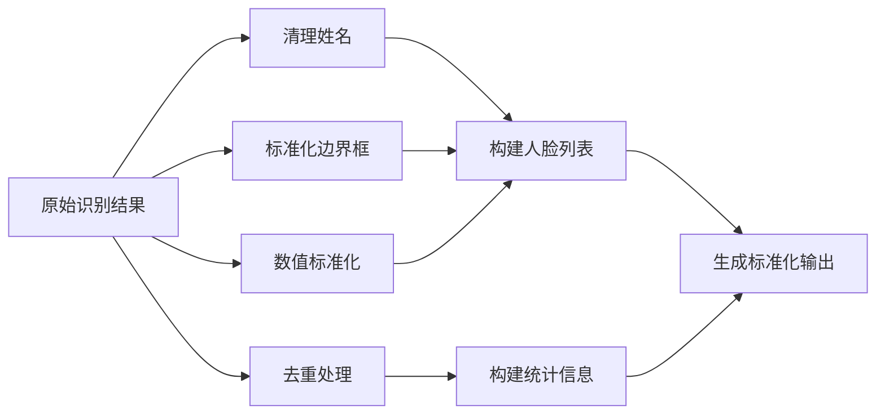
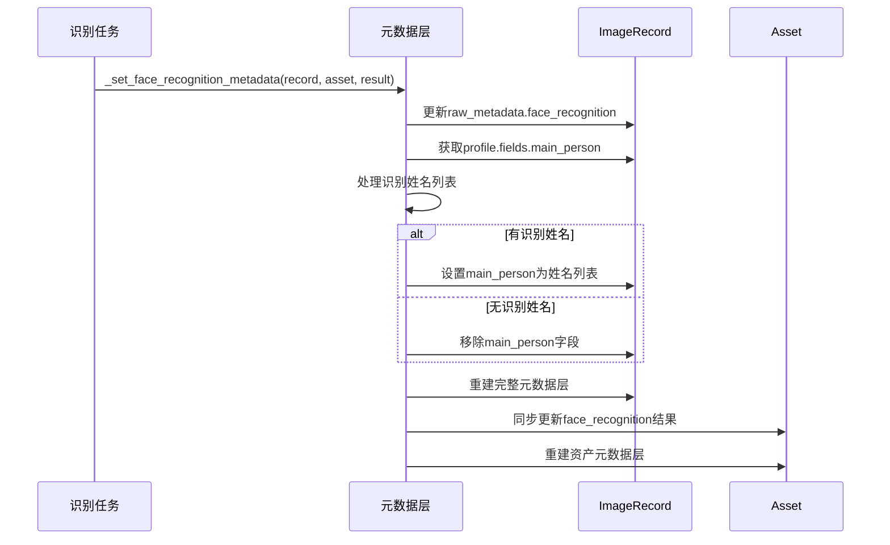
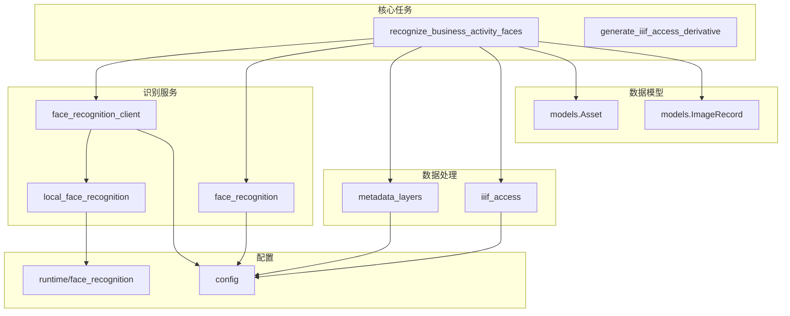

# 面部识别处理流程

<cite>
**本文档引用的文件**
- [face_recognition.py](file://backend/app/services/face_recognition.py)
- [face_recognition_client.py](file://backend/app/services/face_recognition_client.py)
- [tasks.py](file://backend/app/tasks.py)
- [models.py](file://backend/app/models.py)
- [local_face_recognition.py](file://backend/app/services/local_face_recognition.py)
- [config.py](file://backend/app/config.py)
- [metadata_layers.py](file://backend/app/services/metadata_layers.py)
- [iiif_access.py](file://backend/app/services/iiif_access.py)
- [README.md](file://backend/runtime/face_recognition/README.md)
- [test_face_recognition_client.py](file://backend/tests/test_face_recognition_client.py)
</cite>

## 目录
1. [简介](#简介)
2. [项目结构](#项目结构)
3. [核心组件](#核心组件)
4. [架构概览](#架构概览)
5. [详细组件分析](#详细组件分析)
6. [依赖关系分析](#依赖关系分析)
7. [性能考虑](#性能考虑)
8. [故障排除指南](#故障排除指南)
9. [结论](#结论)
10. [附录](#附录)

## 简介
本文档详细介绍了MDAMS原型项目中的面部识别处理流程，重点涵盖以下方面：
- recognize_business_activity_faces任务的实现逻辑
- 业务活动记录的识别流程、阈值设置、识别结果的标准化处理
- 人脸识别客户端的集成方式，包括请求参数构建、响应数据解析、错误处理机制
- 识别结果的元数据更新流程，包括profile字段的设置、main_person字段的生成规则
- 任务执行的前置条件检查，包括记录状态验证、资产关联检查、文件可用性检查
- 识别任务的配置参数和性能调优建议

## 项目结构
面部识别功能在后端应用中采用模块化设计，主要涉及以下关键模块：
- 任务调度：Celery任务定义和执行
- 服务层：人脸识别客户端、本地识别引擎、元数据处理
- 数据模型：资产和图像记录的数据库模型
- 配置管理：人脸识别相关的环境变量配置
- 运行时支持：本地识别模型和索引目录



**图表来源**
- [tasks.py:189-262](file://backend/app/tasks.py#L189-L262)
- [face_recognition_client.py:91-134](file://backend/app/services/face_recognition_client.py#L91-L134)
- [local_face_recognition.py:282-346](file://backend/app/services/local_face_recognition.py#L282-L346)

**章节来源**
- [tasks.py:1-262](file://backend/app/tasks.py#L1-L262)
- [models.py:6-174](file://backend/app/models.py#L6-L174)

## 核心组件
本节详细介绍面部识别系统的核心组件及其职责分工：

### 任务调度组件
- **recognize_business_activity_faces**：专门针对业务活动记录的人脸识别任务
- **generate_iiif_access_derivative**：IIIF访问衍生品生成任务

### 服务组件
- **face_recognition_client**：统一的人脸识别客户端，支持本地和远程识别
- **local_face_recognition**：本地人脸识别引擎，基于InsightFace框架
- **face_recognition**：识别结果标准化和元数据处理工具
- **metadata_layers**：元数据层构建和管理

### 配置组件
- **config.py**：人脸识别相关配置参数管理
- **运行时目录**：本地识别模型和索引文件存储

**章节来源**
- [tasks.py:189-262](file://backend/app/tasks.py#L189-L262)
- [face_recognition_client.py:91-134](file://backend/app/services/face_recognition_client.py#L91-L134)
- [local_face_recognition.py:282-346](file://backend/app/services/local_face_recognition.py#L282-L346)

## 架构概览
面部识别系统采用分层架构设计，实现了清晰的职责分离和扩展性：



**图表来源**
- [tasks.py:189-262](file://backend/app/tasks.py#L189-L262)
- [face_recognition_client.py:91-134](file://backend/app/services/face_recognition_client.py#L91-L134)

## 详细组件分析

### 业务活动人脸识别任务
recognize_business_activity_faces是专门针对业务活动记录的人脸识别任务，具有以下特点：

#### 前置条件检查
任务执行前进行严格的前置条件验证：
- 功能开关检查：确保人脸识别功能已启用
- 记录类型验证：仅处理profile_key为"business_activity"的记录
- 资产关联检查：验证记录当前关联的资产ID
- 文件可用性检查：确认源文件存在且可访问

#### 识别流程
1. **文件准备**：获取资产原始文件路径
2. **识别调用**：通过face_recognition_client进行识别
3. **结果处理**：使用face_recognition进行标准化
4. **元数据更新**：通过metadata_layers更新记录和资产元数据



**图表来源**
- [tasks.py:189-262](file://backend/app/tasks.py#L189-L262)

**章节来源**
- [tasks.py:189-262](file://backend/app/tasks.py#L189-L262)

### 人脸识别客户端集成
face_recognition_client提供了统一的人脸识别接口，支持多种识别模式：

#### 支持的识别模式
- **本地识别**：使用InsightFace框架进行离线识别
- **远程识别**：调用外部人脸识别服务
- **自动模式**：优先尝试本地识别，失败时回退到远程识别

#### 请求参数构建
客户端自动处理以下参数：
- **阈值设置**：支持传入自定义阈值或使用全局配置
- **请求ID**：为每个识别请求生成唯一标识符
- **超时控制**：配置HTTP请求超时时间
- **文件上传**：支持二进制文件流上传

#### 错误处理机制
客户端实现了多层次的错误处理：
- **配置错误**：检查基础URL和功能开关
- **网络错误**：处理HTTP请求异常和连接超时
- **服务错误**：解析服务端返回的错误信息
- **格式错误**：验证JSON响应的有效性



**图表来源**
- [face_recognition_client.py:91-134](file://backend/app/services/face_recognition_client.py#L91-L134)
- [local_face_recognition.py:282-346](file://backend/app/services/local_face_recognition.py#L282-L346)

**章节来源**
- [face_recognition_client.py:91-134](file://backend/app/services/face_recognition_client.py#L91-L134)
- [local_face_recognition.py:282-346](file://backend/app/services/local_face_recognition.py#L282-L346)

### 识别结果标准化处理
face_recognition模块负责将不同来源的识别结果标准化为统一格式：

#### 标准化字段
- **状态信息**：success/no_face/failed
- **识别统计**：face_count、recognized_count、recognized_names
- **人脸详情**：每张人脸的face_index、name、confidence、score、bbox
- **元数据**：threshold、provider、last_run_at、image_width、image_height

#### 数据清理和转换
- **名称清理**：去除空白字符，处理None值
- **坐标标准化**：确保bbox格式为整数列表
- **置信度计算**：从相似度分数转换为0-1范围的置信度
- **去重处理**：保持识别名称的顺序唯一性



**图表来源**
- [face_recognition.py:86-140](file://backend/app/services/face_recognition.py#L86-L140)

**章节来源**
- [face_recognition.py:86-140](file://backend/app/services/face_recognition.py#L86-L140)

### 元数据更新流程
识别结果通过metadata_layers模块更新到记录和资产的元数据中：

#### 更新策略
- **原始元数据**：将face_recognition结果写入raw_metadata
- **业务活动配置**：根据profile_key为"business_activity"的记录更新main_person字段
- **双重更新**：同时更新ImageRecord和关联Asset的元数据

#### main_person字段生成规则
对于业务活动记录，main_person字段的生成遵循以下规则：
- **有识别结果**：将所有识别到的姓名用中文顿号连接
- **无识别结果**：移除现有的main_person字段
- **字段含义**：表示该业务活动中出现的主要人物



**图表来源**
- [tasks.py:80-149](file://backend/app/tasks.py#L80-L149)
- [metadata_layers.py:141-150](file://backend/app/services/metadata_layers.py#L141-L150)

**章节来源**
- [tasks.py:80-149](file://backend/app/tasks.py#L80-L149)
- [metadata_layers.py:141-150](file://backend/app/services/metadata_layers.py#L141-L150)

## 依赖关系分析

### 组件依赖图


**图表来源**
- [tasks.py:1-262](file://backend/app/tasks.py#L1-L262)
- [face_recognition_client.py:1-134](file://backend/app/services/face_recognition_client.py#L1-L134)
- [local_face_recognition.py:1-346](file://backend/app/services/local_face_recognition.py#L1-L346)

### 关键依赖关系
- **任务到服务**：recognize_business_activity_faces依赖多个服务模块
- **客户端到引擎**：face_recognition_client委托给local_face_recognition
- **服务到配置**：所有服务都依赖config模块获取配置参数
- **元数据到模型**：metadata_layers处理models中的数据结构

**章节来源**
- [tasks.py:1-262](file://backend/app/tasks.py#L1-L262)
- [face_recognition_client.py:1-134](file://backend/app/services/face_recognition_client.py#L1-L134)

## 性能考虑

### 识别性能优化
1. **缓存机制**
   - 本地识别运行时缓存：避免重复初始化InsightFace实例
   - 面部索引缓存：缓存聚类中心向量减少计算开销
   - 线程安全保证：使用锁机制保护共享资源

2. **模型优化**
   - CUDA执行提供程序优先：利用GPU加速推理
   - 模型文件预加载：确保模型文件完整性检查
   - 向量归一化优化：使用数值稳定性改进

3. **内存管理**
   - 浮点数向量归一化：防止数值溢出
   - 缓存失效策略：基于文件修改时间的智能缓存更新

### 网络性能优化
1. **请求优化**
   - URL候选地址轮询：提高服务可用性
   - 超时参数配置：平衡响应时间和可靠性
   - 文件流传输：避免大文件内存占用

2. **错误恢复**
   - 多级回退机制：本地失败自动切换远程
   - 错误聚合：收集所有可能的错误原因

### 存储性能优化
1. **文件系统**
   - 运行时目录结构：models和index分离存储
   - 模型文件完整性：ONNX模型文件校验
   - 索引文件格式：pickle序列化嵌入向量

2. **数据库性能**
   - 元数据层构建：批量更新减少数据库往返
   - 字段选择性更新：只更新modified标记的字段

**章节来源**
- [local_face_recognition.py:173-202](file://backend/app/services/local_face_recognition.py#L173-L202)
- [face_recognition_client.py:58-75](file://backend/app/services/face_recognition_client.py#L58-L75)

## 故障排除指南

### 常见问题诊断
1. **功能未启用**
   - 检查FACE_RECOGNITION_ENABLED配置
   - 验证任务是否被正确调度

2. **本地识别失败**
   - 确认InsightFace依赖安装
   - 检查模型文件完整性
   - 验证CUDA执行提供程序可用性

3. **远程识别错误**
   - 检查FACE_RECOGNITION_BASE_URL配置
   - 验证网络连接和防火墙设置
   - 确认服务端API可用性

4. **文件访问问题**
   - 验证源文件路径和权限
   - 检查文件是否存在且可读
   - 确认磁盘空间充足

### 错误处理策略
1. **配置错误**
   - 提供明确的错误消息
   - 指导正确的配置步骤

2. **运行时错误**
   - 记录详细的错误堆栈
   - 提供故障排除建议

3. **数据不一致**
   - 实施回滚机制
   - 维护一致性检查

### 调试技巧
1. **日志分析**
   - 启用详细日志记录
   - 分析任务执行时间线

2. **单元测试**
   - 使用测试用例验证功能
   - 模拟各种错误场景

3. **性能监控**
   - 监控识别延迟
   - 跟踪资源使用情况

**章节来源**
- [face_recognition_client.py:12-13](file://backend/app/services/face_recognition_client.py#L12-L13)
- [local_face_recognition.py:14-15](file://backend/app/services/local_face_recognition.py#L14-L15)
- [test_face_recognition_client.py:67-84](file://backend/tests/test_face_recognition_client.py#L67-L84)

## 结论
MDAMS项目的面部识别系统展现了良好的架构设计和工程实践：

### 主要优势
1. **模块化设计**：清晰的职责分离和依赖关系
2. **容错机制**：多层次的错误处理和回退策略
3. **性能优化**：缓存、并行处理和资源管理
4. **扩展性**：支持本地和远程识别模式
5. **数据完整性**：标准化的数据处理和一致性保证

### 最佳实践
1. **配置管理**：集中化的配置参数管理
2. **元数据层**：统一的元数据结构和更新机制
3. **任务编排**：Celery任务的合理组织和调度
4. **测试覆盖**：完整的单元测试和集成测试

### 改进建议
1. **监控增强**：添加更详细的性能指标和告警
2. **缓存策略**：优化缓存失效和更新机制
3. **错误报告**：提供更友好的错误诊断信息
4. **文档完善**：补充更多的使用示例和最佳实践

## 附录

### 配置参数参考
| 参数名 | 默认值 | 描述 |
|--------|--------|------|
| FACE_RECOGNITION_ENABLED | 0 | 是否启用人脸识别功能 |
| FACE_RECOGNITION_PROVIDER | local | 识别提供程序(local/remote/auto) |
| FACE_RECOGNITION_BASE_URL | http://host.docker.internal:8010 | 远程识别服务基础URL |
| FACE_RECOGNITION_TIMEOUT_SECONDS | 30 | 识别请求超时时间(秒) |
| FACE_RECOGNITION_THRESHOLD | 0.5 | 识别阈值 |
| FACE_RECOGNITION_MODEL_ROOT | runtime/face_recognition | 模型文件根目录 |
| FACE_RECOGNITION_MODEL_NAME | buffalo_l | 模型名称 |
| FACE_RECOGNITION_INDEX_DIR | runtime/face_recognition/index | 面部索引目录 |
| FACE_RECOGNITION_STRICT_LOCAL_MODELS | 1 | 是否严格检查模型文件 |

### 运行时目录结构
```bash
runtime/face_recognition/
├── models/
│   └── buffalo_l/
│       ├── 1k3d68.onnx
│       ├── 2d106det.onnx
│       ├── det_10g.onnx
│       ├── genderage.onnx
│       └── w600k_r50.onnx
└── index/
    ├── meta.json
    └── embeddings.pkl
```

### 识别结果字段说明
| 字段名 | 类型 | 描述 |
|--------|------|------|
| status | string | 识别状态(success/no_face/failed) |
| threshold | float | 使用的识别阈值 |
| face_count | int | 检测到的人脸数量 |
| recognized_count | int | 识别到的人物数量 |
| recognized_names | array | 识别到的姓名列表 |
| faces | array | 详细的人脸信息数组 |
| image_width | int | 图像宽度(可选) |
| image_height | int | 图像高度(可选) |