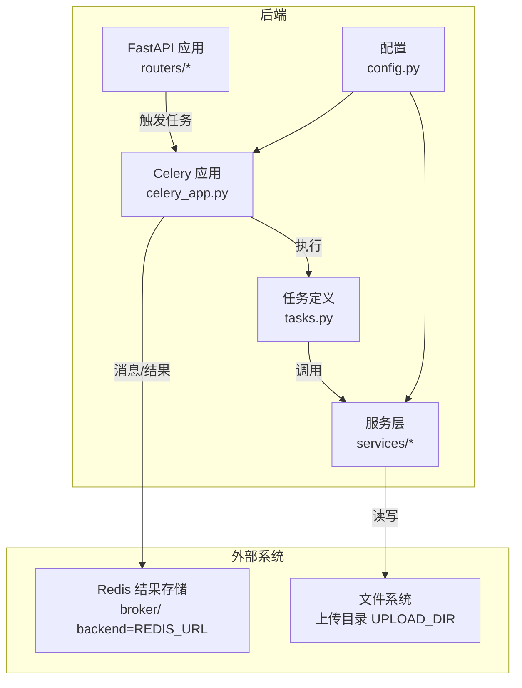
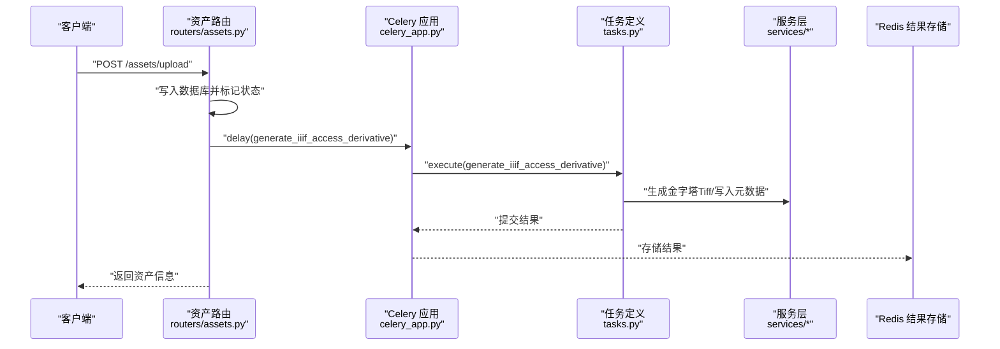
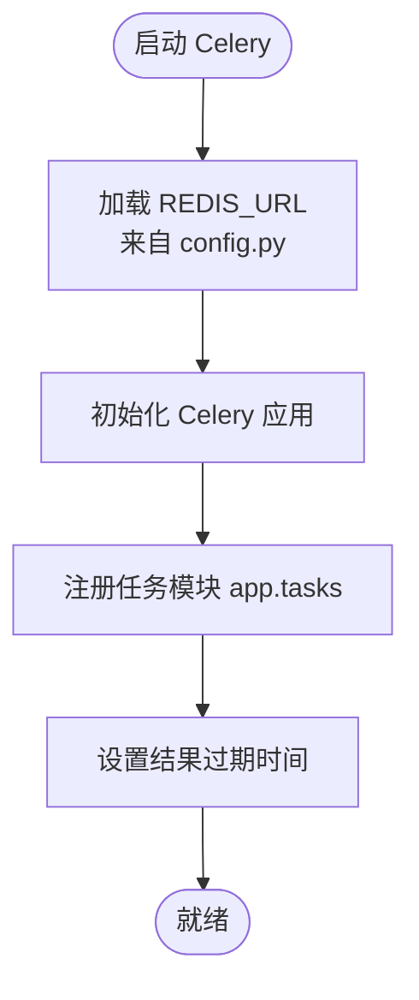
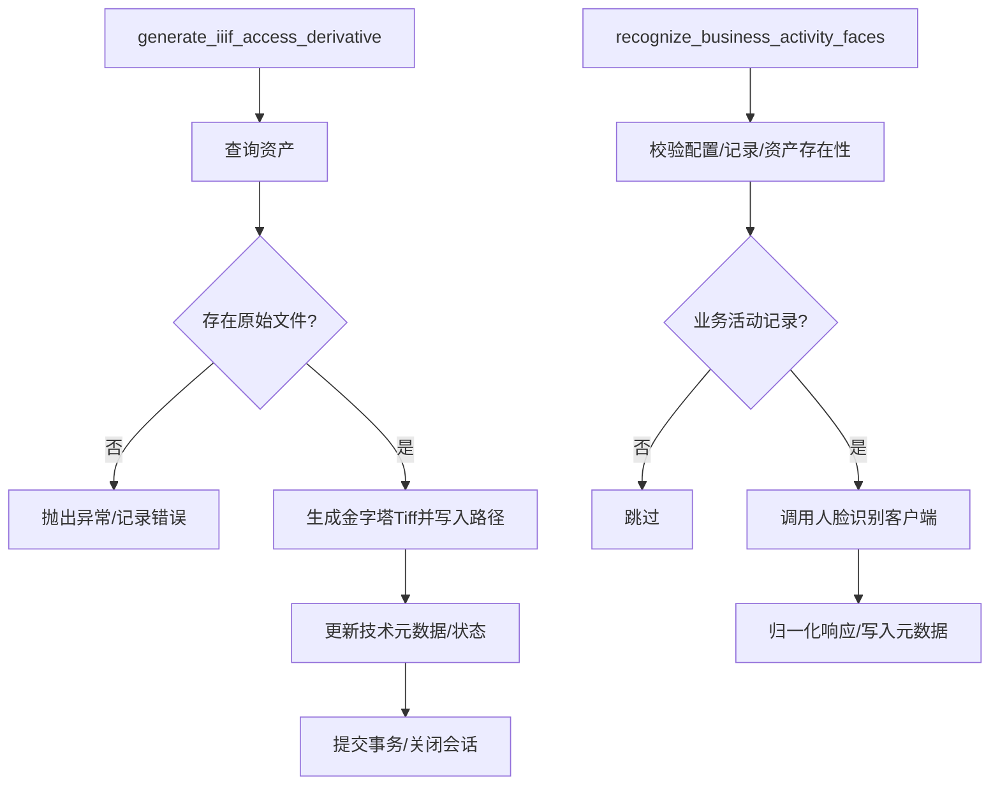
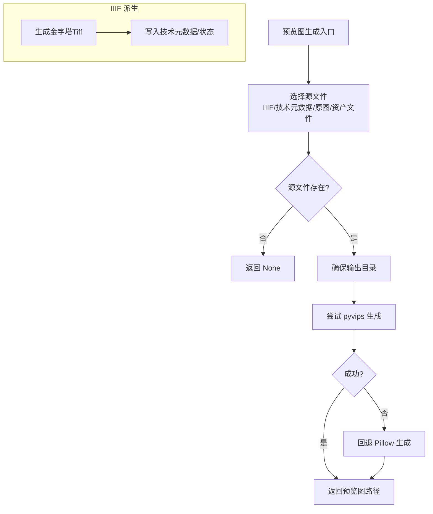
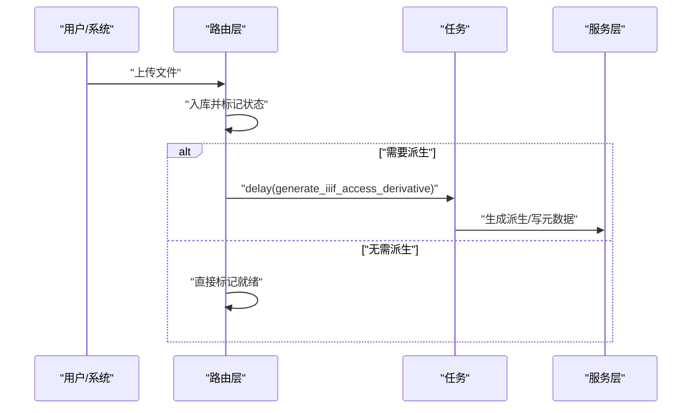
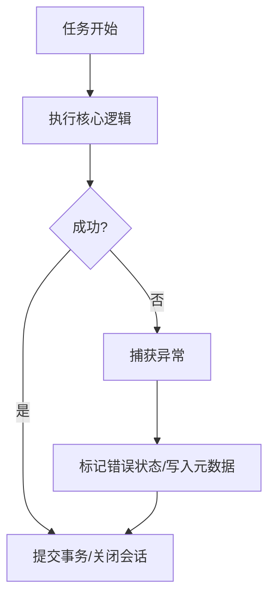
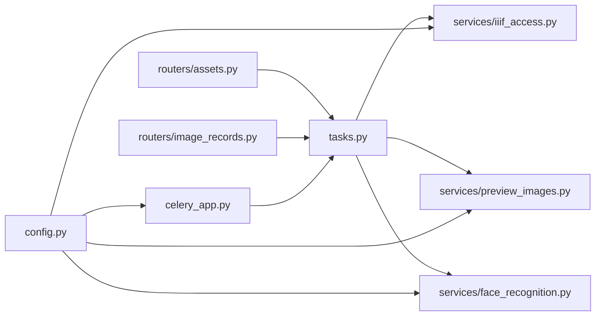

# 异步任务与处理

<cite>
**本文引用的文件**
- [backend/app/celery_app.py](file://backend/app/celery_app.py)
- [backend/app/tasks.py](file://backend/app/tasks.py)
- [backend/app/config.py](file://backend/app/config.py)
- [backend/app/services/iiif_access.py](file://backend/app/services/iiif_access.py)
- [backend/app/services/preview_images.py](file://backend/app/services/preview_images.py)
- [backend/app/services/face_recognition.py](file://backend/app/services/face_recognition.py)
- [backend/app/routers/assets.py](file://backend/app/routers/assets.py)
- [backend/app/routers/image_records.py](file://backend/app/routers/image_records.py)
- [backend/scripts/backfill_pyramidal_tiffs.py](file://backend/scripts/backfill_pyramidal_tiffs.py)
</cite>

## 目录
1. [简介](#简介)
2. [项目结构](#项目结构)
3. [核心组件](#核心组件)
4. [架构总览](#架构总览)
5. [详细组件分析](#详细组件分析)
6. [依赖分析](#依赖分析)
7. [性能考虑](#性能考虑)
8. [故障排查指南](#故障排查指南)
9. [结论](#结论)
10. [附录](#附录)

## 简介
本文件面向MDAMS原型项目的异步任务与处理系统，围绕Celery任务队列的设计与配置、图像处理流程（预览图生成、派生文件创建、格式转换、质量检查）、任务调度与执行策略（定时/周期性、手动触发、批量处理）、错误处理与重试机制（异常捕获、重试策略、死信队列、告警通知）、任务监控与性能优化（状态跟踪、执行时间统计、资源使用监控、并发控制）、配置管理（队列/优先级/超时/内存限制）以及开发调试最佳实践进行系统化说明。文档同时提供具体任务示例与配置模板，帮助开发者快速理解与扩展。

## 项目结构
后端采用FastAPI + Celery架构，任务定义集中在tasks模块，Celery应用在celery_app中初始化，配置通过config统一加载。图像处理服务位于services目录，路由层负责触发任务与返回结果。

图表来源
- [backend/app/celery_app.py:1-19](file://backend/app/celery_app.py#L1-L19)
- [backend/app/tasks.py:151-262](file://backend/app/tasks.py#L151-L262)
- [backend/app/config.py:42-46](file://backend/app/config.py#L42-L46)

章节来源
- [backend/app/celery_app.py:1-19](file://backend/app/celery_app.py#L1-L19)
- [backend/app/config.py:42-46](file://backend/app/config.py#L42-L46)

## 核心组件
- Celery应用与配置：初始化Redis作为broker与backend，注册任务模块，设置结果过期时间。
- 任务定义：包含IIIF访问派生生成、PSB转大尺寸金字塔Tiff、人脸识别等。
- 服务层：提供IIIF派生生成、预览图生成、人脸识别响应归一化等工具函数。
- 路由层：接收上传请求，根据资产状态决定是否投递异步任务；提供预览图接口。
- 批处理脚本：支持对历史资产批量生成金字塔Tiff派生。

章节来源
- [backend/app/celery_app.py:5-15](file://backend/app/celery_app.py#L5-L15)
- [backend/app/tasks.py:151-262](file://backend/app/tasks.py#L151-L262)
- [backend/app/services/iiif_access.py:182-259](file://backend/app/services/iiif_access.py#L182-L259)
- [backend/app/services/preview_images.py:85-105](file://backend/app/services/preview_images.py#L85-L105)
- [backend/app/services/face_recognition.py:48-140](file://backend/app/services/face_recognition.py#L48-L140)
- [backend/app/routers/assets.py:54-134](file://backend/app/routers/assets.py#L54-L134)
- [backend/scripts/backfill_pyramidal_tiffs.py:76-199](file://backend/scripts/backfill_pyramidal_tiffs.py#L76-L199)

## 架构总览
下图展示从上传到派生生成、预览图生成与人脸识别的端到端流程，以及任务在Celery中的执行路径。

图表来源
- [backend/app/routers/assets.py:54-134](file://backend/app/routers/assets.py#L54-L134)
- [backend/app/celery_app.py:5-15](file://backend/app/celery_app.py#L5-L15)
- [backend/app/tasks.py:151-182](file://backend/app/tasks.py#L151-L182)
- [backend/app/services/iiif_access.py:182-259](file://backend/app/services/iiif_access.py#L182-L259)

## 详细组件分析

### Celery应用与配置
- 初始化：以“meam_worker”命名空间，使用REDIS_URL作为broker与backend，include注册任务模块。
- 结果存储：设置result_expires为3600秒，便于清理过期结果。
- 启动方式：可直接运行celery_app.py启动worker。

图表来源
- [backend/app/celery_app.py:5-15](file://backend/app/celery_app.py#L5-L15)
- [backend/app/config.py:42-46](file://backend/app/config.py#L42-L46)

章节来源
- [backend/app/celery_app.py:5-15](file://backend/app/celery_app.py#L5-L15)
- [backend/app/config.py:42-46](file://backend/app/config.py#L42-L46)

### 任务定义与执行策略
- 生成IIIF访问派生：根据资产原始文件路径生成金字塔Tiff派生，更新技术元数据与状态。
- PSB转大尺寸金字塔Tiff：委托给生成IIIF访问派生任务。
- 人脸识别：按记录与资产维度触发，支持阈值、宽高归一化与失败态写入。

图表来源
- [backend/app/tasks.py:151-182](file://backend/app/tasks.py#L151-L182)
- [backend/app/tasks.py:189-262](file://backend/app/tasks.py#L189-L262)

章节来源
- [backend/app/tasks.py:151-182](file://backend/app/tasks.py#L151-L182)
- [backend/app/tasks.py:189-262](file://backend/app/tasks.py#L189-L262)

### 图像处理流程（预览图、派生文件、格式转换、质量检查）
- 预览图生成：优先使用IIIF访问文件或原图，按最大宽度缩放并输出JPG；失败回退至Pillow路径。
- IIIF派生生成：基于pyvips生成带瓦片与金字塔的大Tiff，记录宽高与转换方法。
- 批量补建：脚本扫描符合策略的资产，批量生成金字塔Tiff并更新元数据。

图表来源
- [backend/app/services/preview_images.py:85-105](file://backend/app/services/preview_images.py#L85-L105)
- [backend/app/services/iiif_access.py:182-259](file://backend/app/services/iiif_access.py#L182-L259)
- [backend/scripts/backfill_pyramidal_tiffs.py:108-199](file://backend/scripts/backfill_pyramidal_tiffs.py#L108-L199)

章节来源
- [backend/app/services/preview_images.py:85-105](file://backend/app/services/preview_images.py#L85-L105)
- [backend/app/services/iiif_access.py:182-259](file://backend/app/services/iiif_access.py#L182-L259)
- [backend/scripts/backfill_pyramidal_tiffs.py:108-199](file://backend/scripts/backfill_pyramidal_tiffs.py#L108-L199)

### 任务调度与执行策略
- 手动触发：上传路由在资产状态为processing时，调用delay投递生成IIIF派生任务。
- 批量处理：脚本扫描数据库资产，按策略与条件批量生成派生文件。
- 周期性/定时：当前仓库未发现周期性任务定义；可在Celery Beat中扩展。

图表来源
- [backend/app/routers/assets.py:54-134](file://backend/app/routers/assets.py#L54-L134)
- [backend/app/tasks.py:151-182](file://backend/app/tasks.py#L151-L182)
- [backend/scripts/backfill_pyramidal_tiffs.py:108-199](file://backend/scripts/backfill_pyramidal_tiffs.py#L108-L199)

章节来源
- [backend/app/routers/assets.py:54-134](file://backend/app/routers/assets.py#L54-L134)
- [backend/scripts/backfill_pyramidal_tiffs.py:108-199](file://backend/scripts/backfill_pyramidal_tiffs.py#L108-L199)

### 错误处理与重试机制
- 异常捕获：任务内捕获通用异常与特定客户端异常，记录错误状态与消息。
- 失败态写入：将失败信息写入技术元数据，保证状态一致性。
- 重试策略：当前未见自动重试配置；建议结合Celery重试参数与死信交换机实现。
- 告警通知：当前未见告警集成；建议接入消息队列或日志聚合系统。

图表来源
- [backend/app/tasks.py:175-181](file://backend/app/tasks.py#L175-L181)
- [backend/app/tasks.py:248-261](file://backend/app/tasks.py#L248-L261)

章节来源
- [backend/app/tasks.py:175-181](file://backend/app/tasks.py#L175-L181)
- [backend/app/tasks.py:248-261](file://backend/app/tasks.py#L248-L261)

### 任务监控与性能优化
- 状态跟踪：任务绑定self，可通过任务实例查询状态；结果存储于Redis。
- 执行时间统计：可在任务包装器中埋点或通过外部指标系统采集。
- 资源使用监控：建议结合容器监控与pyvips进程资源限制。
- 并发控制：通过Celery worker数量与队列并发度调节；避免同时生成大量大文件导致磁盘与CPU压力。

章节来源
- [backend/app/celery_app.py:13-15](file://backend/app/celery_app.py#L13-L15)

### 配置管理
- 运行时配置：数据库URL、Redis URL、上传目录、公开URL、人脸识别开关与参数等。
- 任务相关：可扩展队列名称、路由规则、重试策略、超时与内存限制等。

章节来源
- [backend/app/config.py:42-72](file://backend/app/config.py#L42-L72)

### 开发与调试最佳实践
- 单元测试：针对任务与服务函数编写测试，覆盖异常分支。
- 本地调试：使用Celery本地模式或禁用异步路径验证逻辑。
- 日志规范：在任务中打印关键步骤与错误上下文，便于定位问题。
- 性能压测：对大图生成与批量脚本进行吞吐与延迟压测，调整并发与批大小。

## 依赖分析
- 路由层依赖任务模块与服务层，用于触发与处理异步任务。
- 任务模块依赖数据库会话、服务层与配置，完成数据持久化与处理。
- 服务层依赖配置与文件系统，完成文件读写与元数据构建。

图表来源
- [backend/app/routers/assets.py:22, 131](file://backend/app/routers/assets.py#L22,L131)
- [backend/app/routers/image_records.py:47](file://backend/app/routers/image_records.py#L47)
- [backend/app/tasks.py:151-262](file://backend/app/tasks.py#L151-L262)
- [backend/app/services/iiif_access.py:182-259](file://backend/app/services/iiif_access.py#L182-L259)
- [backend/app/services/preview_images.py:85-105](file://backend/app/services/preview_images.py#L85-L105)
- [backend/app/services/face_recognition.py:48-140](file://backend/app/services/face_recognition.py#L48-L140)
- [backend/app/celery_app.py:5-15](file://backend/app/celery_app.py#L5-L15)
- [backend/app/config.py:42-72](file://backend/app/config.py#L42-L72)

章节来源
- [backend/app/routers/assets.py:22, 131](file://backend/app/routers/assets.py#L22,L131)
- [backend/app/routers/image_records.py:47](file://backend/app/routers/image_records.py#L47)
- [backend/app/tasks.py:151-262](file://backend/app/tasks.py#L151-L262)

## 性能考虑
- IO密集型：预览图与派生文件生成依赖磁盘IO，建议使用SSD与合适的并发度。
- CPU密集型：pyvips生成金字塔Tiff对CPU有压力，建议限制并发并观察系统负载。
- 内存控制：大图处理需关注内存峰值，必要时分块或降低分辨率。
- 缓存与去重：预览图指纹与派生文件路径可做缓存，减少重复计算。

## 故障排查指南
- 任务未执行：检查Celery worker是否启动、Redis连通性与任务注册。
- 生成失败：查看任务日志与错误状态写入的技术元数据字段。
- 文件缺失：确认原始文件路径与存在性，检查上传目录权限。
- 人脸识别异常：检查客户端地址、超时与阈值配置。

章节来源
- [backend/app/tasks.py:175-181](file://backend/app/tasks.py#L175-L181)
- [backend/app/tasks.py:248-261](file://backend/app/tasks.py#L248-L261)

## 结论
MDAMS原型的异步任务体系以Celery为核心，结合服务层与路由层实现了从上传到派生生成、预览图与人脸识别的完整流程。当前具备良好的扩展性与可维护性，建议后续完善重试与死信、监控与告警、以及周期性任务与队列优先级配置，以进一步提升稳定性与可观测性。

## 附录

### 任务示例与配置模板
- 投递生成IIIF派生任务
  - 调用路径参考：[backend/app/routers/assets.py:131](file://backend/app/routers/assets.py#L131)
  - 任务定义参考：[backend/app/tasks.py:151-182](file://backend/app/tasks.py#L151-L182)
- 批量生成金字塔Tiff
  - 脚本入口参考：[backend/scripts/backfill_pyramidal_tiffs.py:76-199](file://backend/scripts/backfill_pyramidal_tiffs.py#L76-L199)
- 配置项参考
  - Redis/数据库/上传目录/人脸识别开关与阈值等：[backend/app/config.py:42-72](file://backend/app/config.py#L42-L72)