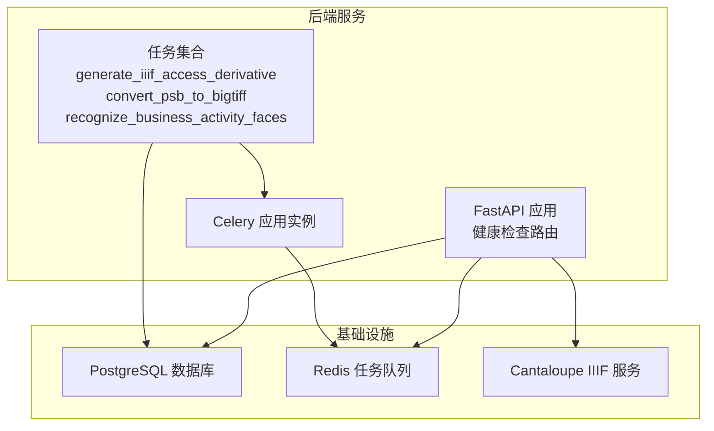
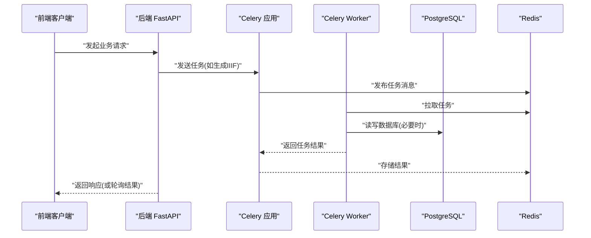
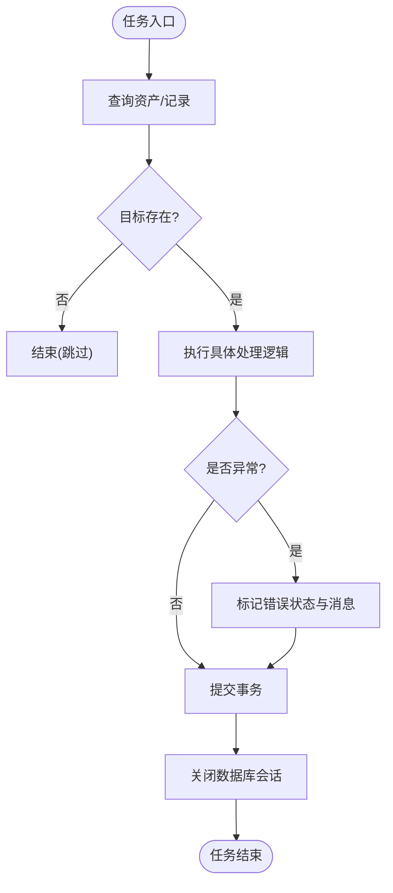
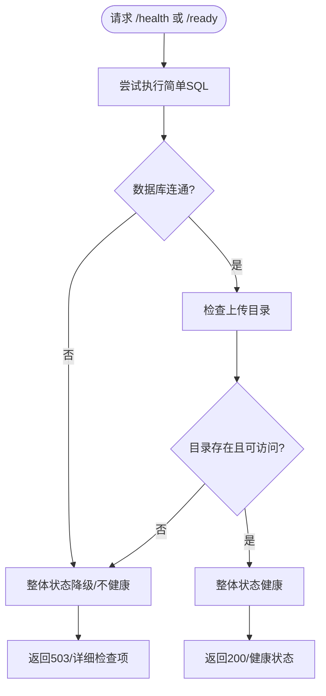
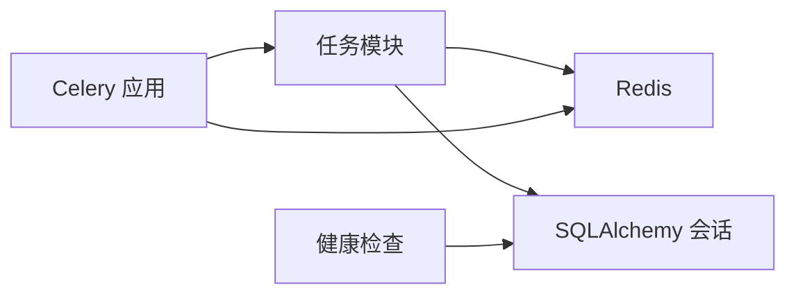

# 监控与性能优化

<cite>
**本文引用的文件**
- [backend/app/celery_app.py](file://backend/app/celery_app.py)
- [backend/app/tasks.py](file://backend/app/tasks.py)
- [backend/app/config.py](file://backend/app/config.py)
- [backend/app/routers/health.py](file://backend/app/routers/health.py)
- [backend/requirements.txt](file://backend/requirements.txt)
- [docker-compose.yml](file://docker-compose.yml)
- [docs/05-部署与运维/ENVIRONMENT_VARIABLES.md](file://docs/05-部署与运维/ENVIRONMENT_VARIABLES.md)
- [docs/05-部署与运维/TROUBLESHOOTING.md](file://docs/05-部署与运维/TROUBLESHOOTING.md)
</cite>

## 目录
1. [简介](#简介)
2. [项目结构](#项目结构)
3. [核心组件](#核心组件)
4. [架构总览](#架构总览)
5. [详细组件分析](#详细组件分析)
6. [依赖分析](#依赖分析)
7. [性能考虑](#性能考虑)
8. [故障排查指南](#故障排查指南)
9. [结论](#结论)
10. [附录](#附录)

## 简介
本文件面向MDAMS原型项目的监控与性能优化，聚焦于Celery任务的可观测性与调优，涵盖任务执行时间、队列长度、Worker状态、成功率等关键指标的采集与分析；同时给出并发数、内存与CPU资源分配等优化策略，并结合现有健康检查与环境变量配置，提供可落地的监控告警与仪表板使用建议。

## 项目结构
围绕监控与性能优化的关键文件与职责如下：
- Celery应用与任务定义：Celery应用实例化、任务注册与基础配置；任务函数实现（如生成IIIF派生图、PSB转大 TIFF、人脸识别）。
- 健康检查路由：提供/health与/ready端点，覆盖数据库与上传目录检查，便于整体健康度观测。
- 环境变量与容器编排：Redis连接、任务并发、libvips参数、端口映射等，直接影响任务执行与资源使用。
- 依赖声明：包含Celery、Redis、pyvips等，决定性能与资源消耗特性。

图表来源
- [backend/app/routers/health.py:1-60](file://backend/app/routers/health.py#L1-L60)
- [backend/app/celery_app.py:1-19](file://backend/app/celery_app.py#L1-L19)
- [backend/app/tasks.py:150-262](file://backend/app/tasks.py#L150-L262)
- [docker-compose.yml:1-131](file://docker-compose.yml#L1-L131)

章节来源
- [backend/app/celery_app.py:1-19](file://backend/app/celery_app.py#L1-L19)
- [backend/app/tasks.py:150-262](file://backend/app/tasks.py#L150-L262)
- [backend/app/routers/health.py:1-60](file://backend/app/routers/health.py#L1-L60)
- [docker-compose.yml:1-131](file://docker-compose.yml#L1-L131)

## 核心组件
- Celery应用与任务
  - 应用实例绑定Redis作为消息代理与结果后端，包含任务模块注册。
  - 任务包括：生成IIIF访问级金字塔图、PSB转大 TIFF、人脸识别标注。
- 健康检查
  - 提供/health与/ready端点，检查数据库连通性与上传目录可用性，返回整体健康状态与HTTP状态码。
- 环境变量与容器
  - 通过环境变量控制Redis连接、任务并发、libvips磁盘阈值与并发、JVM堆大小等，影响任务吞吐与资源占用。

章节来源
- [backend/app/celery_app.py:1-19](file://backend/app/celery_app.py#L1-L19)
- [backend/app/tasks.py:150-262](file://backend/app/tasks.py#L150-L262)
- [backend/app/routers/health.py:14-41](file://backend/app/routers/health.py#L14-L41)
- [docs/05-部署与运维/ENVIRONMENT_VARIABLES.md:1-86](file://docs/05-部署与运维/ENVIRONMENT_VARIABLES.md#L1-L86)
- [docker-compose.yml:37-64](file://docker-compose.yml#L37-L64)

## 架构总览
下图展示任务执行与监控相关的关键交互：前端请求触发后端路由，后端调度Celery任务，任务通过Redis队列分发到Worker，执行完成后结果写入Redis；健康检查端点用于观测后端整体健康度。

图表来源
- [backend/app/celery_app.py:5-15](file://backend/app/celery_app.py#L5-L15)
- [backend/app/tasks.py:150-262](file://backend/app/tasks.py#L150-L262)
- [backend/app/routers/health.py:52-59](file://backend/app/routers/health.py#L52-L59)

## 详细组件分析

### Celery应用与任务
- 应用初始化
  - 绑定Redis作为broker与backend，include注册任务模块。
  - 结果过期时间配置，避免历史结果长期占用空间。
- 任务实现
  - 生成IIIF访问级金字塔图：查询资产、定位原文件、生成输出、应用派生图元数据、提交事务。
  - PSB转大 TIFF：委托给生成IIIF任务执行。
  - 人脸识别：根据记录与资产状态校验，调用人脸识别客户端，归一化响应并写回元数据。
- 错误处理
  - 任务内捕获异常，标记资产错误状态与消息，确保数据库提交与关闭。

图表来源
- [backend/app/tasks.py:150-262](file://backend/app/tasks.py#L150-L262)

章节来源
- [backend/app/celery_app.py:5-15](file://backend/app/celery_app.py#L5-L15)
- [backend/app/tasks.py:150-262](file://backend/app/tasks.py#L150-L262)

### 健康检查与就绪检查
- /health与/ready均基于数据库连通性与上传目录可用性进行判断，返回整体健康状态与HTTP状态码。
- 未达健康状态时抛出503，便于反向代理或编排系统及时发现异常。

图表来源
- [backend/app/routers/health.py:14-41](file://backend/app/routers/health.py#L14-L41)

章节来源
- [backend/app/routers/health.py:14-41](file://backend/app/routers/health.py#L14-L41)

### 环境变量与容器编排
- 关键变量
  - Redis连接：REDIS_URL
  - 任务并发：celery_worker命令行参数--concurrency
  - libvips参数：VIPS_DISC_THRESHOLD、VIPS_CONCURRENCY
  - 上传目录与NAS挂载：UPLOAD_DIR、HOST_MUSEUM_PATH
  - IIIF公共URL：API_PUBLIC_URL、CANTALOUPE_PUBLIC_URL
- 容器资源限制
  - 数据库容器设置了内存上限，避免资源争用导致不稳定。

章节来源
- [docs/05-部署与运维/ENVIRONMENT_VARIABLES.md:20-74](file://docs/05-部署与运维/ENVIRONMENT_VARIABLES.md#L20-L74)
- [docker-compose.yml:37-64](file://docker-compose.yml#L37-L64)
- [docker-compose.yml:84-102](file://docker-compose.yml#L84-L102)

## 依赖分析
- 组件耦合
  - 任务依赖数据库会话与服务层函数，间接依赖Redis完成异步执行。
  - 健康检查仅依赖数据库与文件系统，耦合度低。
- 外部依赖
  - Celery与Redis用于任务队列；PostgreSQL用于持久化；pyvips用于图像处理。
- 潜在风险
  - 缺少任务执行时间、队列长度、Worker存活率等指标采集；缺少统一监控告警与仪表板。

图表来源
- [backend/app/tasks.py:1-262](file://backend/app/tasks.py#L1-L262)
- [backend/app/celery_app.py:1-19](file://backend/app/celery_app.py#L1-L19)
- [backend/app/routers/health.py:1-60](file://backend/app/routers/health.py#L1-L60)

章节来源
- [backend/requirements.txt:1-18](file://backend/requirements.txt#L1-L18)
- [backend/app/tasks.py:1-262](file://backend/app/tasks.py#L1-L262)
- [backend/app/celery_app.py:1-19](file://backend/app/celery_app.py#L1-L19)
- [backend/app/routers/health.py:1-60](file://backend/app/routers/health.py#L1-L60)

## 性能考虑
- 并发与资源分配
  - 任务并发：通过celery_worker命令行参数--concurrency控制；建议结合CPU核数与任务类型（CPU密集/IO密集）逐步调优。
  - libvips参数：VIPS_DISC_THRESHOLD与VIPS_CONCURRENCY影响内存与磁盘使用，适合在低内存环境中降低峰值占用。
  - 数据库容器内存限制：避免与其他服务争抢资源。
- 任务执行时间与成功率
  - 建议在任务入口与出口埋点，统计任务耗时与成功/失败次数，形成执行时间分布与成功率趋势。
- 队列长度与积压
  - 通过Redis键空间统计与任务投递速率对比，识别队列积压风险。
- 资源使用监控
  - CPU、内存、磁盘IO、网络带宽：建议结合容器监控与系统指标采集，关注Worker与数据库峰值时段。

[本节为通用性能指导，不直接分析具体文件]

## 故障排查指南
- 启动类问题
  - 前端无法访问：检查前端容器状态、端口占用与后端日志。
  - 后端健康检查失败：检查后端容器、数据库连接与Redis连接。
  - 数据库连接异常：核对数据库容器状态、凭据与连接串。
  - Redis或Worker异常：检查Redis服务与Worker日志。
- 资源与挂载问题
  - 上传文件找不到：核对宿主机目录映射与可写权限。
  - 预览图不显示：确认资产与生成结果路径。
  - 参考资源导入异常：确认参考目录完整性与脚本执行路径。
- IIIF与Mirador问题
  - Manifest可打开但图像加载失败：检查CANTALOUPE_PUBLIC_URL与Nginx代理配置。
  - owner_only资源不可见：核对用户角色与资源可见性范围。
- 登录与权限问题
  - 登录失败：确认用户存在、默认密码与token状态。
  - 菜单显示正常但按钮不可用：权限判定与后端接口兜底检查。

章节来源
- [docs/05-部署与运维/TROUBLESHOOTING.md:16-242](file://docs/05-部署与运维/TROUBLESHOOTING.md#L16-L242)

## 结论
- 现状：项目已具备基本的健康检查与Celery任务执行能力，但缺乏任务层面的指标采集与可视化监控。
- 建议：引入任务执行时间、队列长度、Worker状态与成功率等指标，结合Redis与系统监控完善告警与仪表板；通过环境变量与容器编排参数精细化调优资源使用。

[本节为总结性内容，不直接分析具体文件]

## 附录

### 监控与性能优化实践清单
- 指标采集
  - 任务执行时间：在任务开始与结束处记录时间戳，计算耗时。
  - 成功率：统计任务成功/失败次数，计算成功率。
  - 队列长度：通过Redis键空间统计任务队列长度。
  - Worker状态：定期探测Worker存活与心跳。
- 告警与阈值
  - 队列积压阈值：例如超过N条未消费。
  - 执行超时阈值：例如P分位耗时超过T秒。
  - 失败率阈值：例如连续M次失败或窗口期内失败率超过X%。
  - Worker离线阈值：例如连续N分钟无心跳。
- 通知渠道
  - 邮件、IM群组、Webhook等，按严重级别分级通知。
- 仪表板
  - 展示任务吞吐、耗时分布、队列长度、Worker负载、错误趋势等。

[本节为概念性内容，不直接分析具体文件]