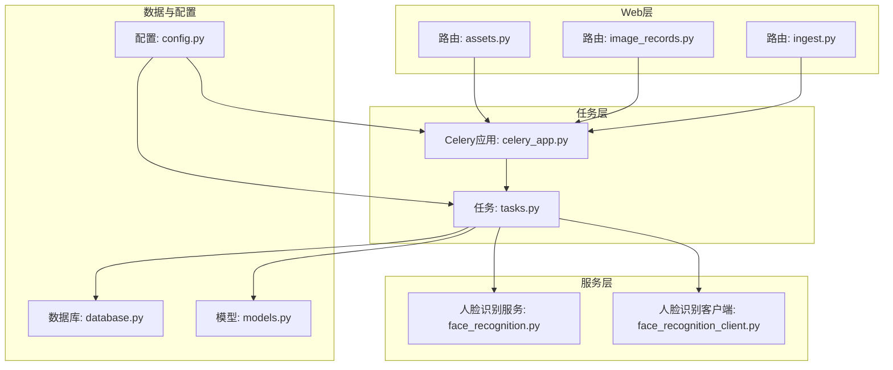
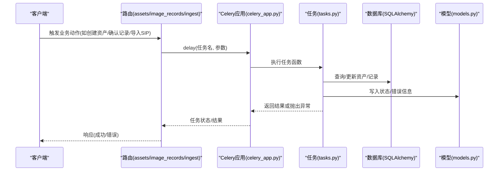
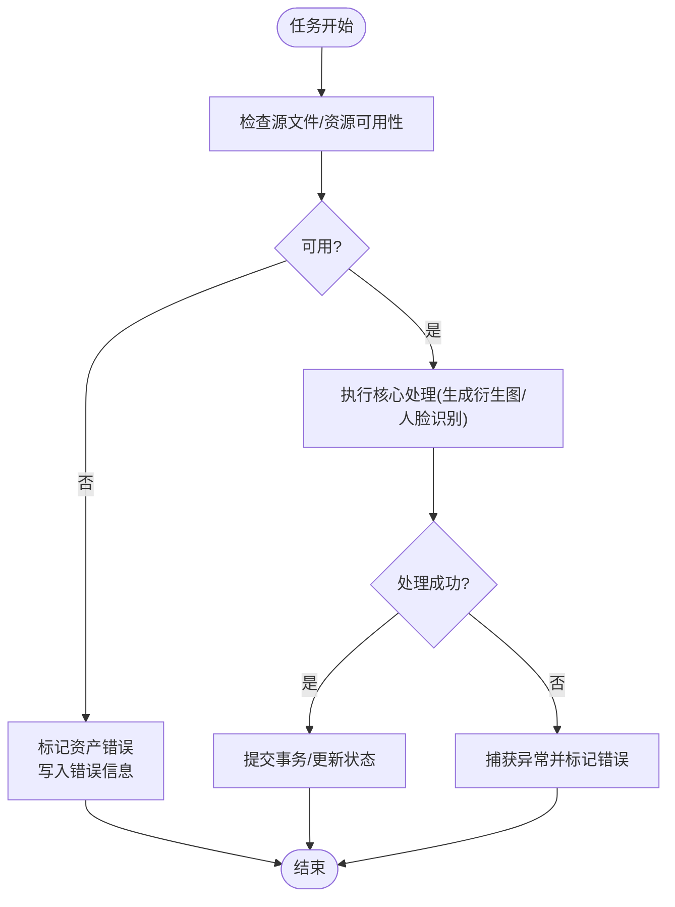
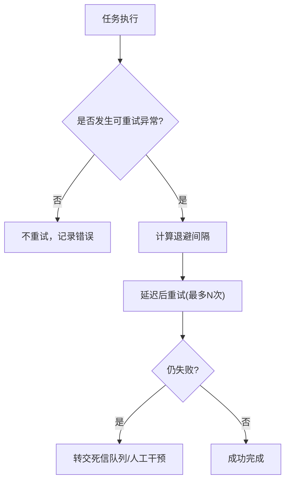
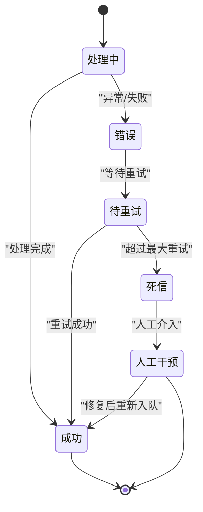
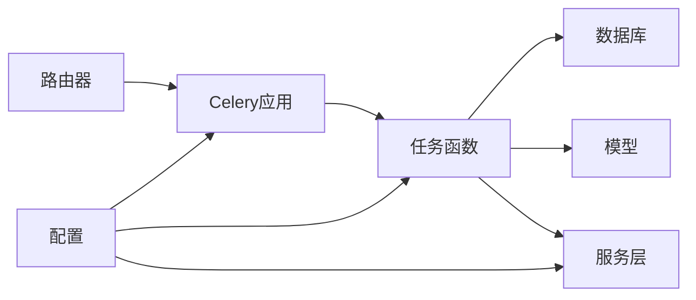

# 错误处理与重试机制

<cite>
**本文引用的文件**
- [backend/app/celery_app.py](file://backend/app/celery_app.py)
- [backend/app/tasks.py](file://backend/app/tasks.py)
- [backend/app/config.py](file://backend/app/config.py)
- [backend/app/database.py](file://backend/app/database.py)
- [backend/app/models.py](file://backend/app/models.py)
- [backend/app/routers/assets.py](file://backend/app/routers/assets.py)
- [backend/app/routers/image_records.py](file://backend/app/routers/image_records.py)
- [backend/app/routers/ingest.py](file://backend/app/routers/ingest.py)
- [backend/app/services/face_recognition.py](file://backend/app/services/face_recognition.py)
- [backend/app/services/face_recognition_client.py](file://backend/app/services/face_recognition_client.py)
</cite>

## 目录
1. [引言](#引言)
2. [项目结构](#项目结构)
3. [核心组件](#核心组件)
4. [架构总览](#架构总览)
5. [详细组件分析](#详细组件分析)
6. [依赖分析](#依赖分析)
7. [性能考虑](#性能考虑)
8. [故障排查指南](#故障排查指南)
9. [结论](#结论)
10. [附录](#附录)

## 引言
本文件聚焦于MDAMS原型项目的“错误处理与重试机制”，围绕任务异常的分类与处理策略、重试机制配置、死信队列使用、错误监控与告警、任务状态检查与恢复等方面进行系统性梳理，并结合现有代码实现给出可操作的建议与最佳实践。

## 项目结构
后端采用FastAPI + Celery架构：Web路由触发任务入队，Celery工作进程执行具体任务；数据库通过SQLAlchemy管理，Redis作为消息中间件与结果后端。与错误处理直接相关的关键模块如下：
- 任务定义与调度：Celery应用与任务函数
- 配置项：数据库、Redis、人脸识别等运行时参数
- 数据模型：资产与记录的状态字段用于错误标记
- 路由器：在业务流程中触发任务并处理异常
- 服务层：人脸识别客户端与响应归一化工具

**图表来源**
- [backend/app/celery_app.py:1-19](file://backend/app/celery_app.py#L1-L19)
- [backend/app/tasks.py:151-262](file://backend/app/tasks.py#L151-L262)
- [backend/app/config.py:42-72](file://backend/app/config.py#L42-L72)
- [backend/app/database.py:1-17](file://backend/app/database.py#L1-L17)
- [backend/app/models.py:6-26](file://backend/app/models.py#L6-L26)
- [backend/app/routers/assets.py:130](file://backend/app/routers/assets.py#L130)
- [backend/app/routers/image_records.py:914](file://backend/app/routers/image_records.py#L914)
- [backend/app/routers/ingest.py:169](file://backend/app/routers/ingest.py#L169)
- [backend/app/services/face_recognition.py:48-140](file://backend/app/services/face_recognition.py#L48-L140)
- [backend/app/services/face_recognition_client.py:91-134](file://backend/app/services/face_recognition_client.py#L91-L134)

**章节来源**
- [backend/app/celery_app.py:1-19](file://backend/app/celery_app.py#L1-L19)
- [backend/app/tasks.py:151-262](file://backend/app/tasks.py#L151-L262)
- [backend/app/config.py:42-72](file://backend/app/config.py#L42-L72)
- [backend/app/database.py:1-17](file://backend/app/database.py#L1-L17)
- [backend/app/models.py:6-26](file://backend/app/models.py#L6-L26)
- [backend/app/routers/assets.py:130](file://backend/app/routers/assets.py#L130)
- [backend/app/routers/image_records.py:914](file://backend/app/routers/image_records.py#L914)
- [backend/app/routers/ingest.py:169](file://backend/app/routers/ingest.py#L169)
- [backend/app/services/face_recognition.py:48-140](file://backend/app/services/face_recognition.py#L48-L140)
- [backend/app/services/face_recognition_client.py:91-134](file://backend/app/services/face_recognition_client.py#L91-L134)

## 核心组件
- Celery应用与任务
  - 应用初始化包含Broker/Backend均为Redis，任务模块注册为app.tasks
  - 结果过期时间默认1小时
  - 参考路径：[backend/app/celery_app.py:1-19](file://backend/app/celery_app.py#L1-L19)
- 任务函数
  - 生成IIIF访问衍生图任务：捕获异常并标记资产错误状态与错误信息
  - 人脸识别任务：区分客户端错误与未预期异常，分别写入失败状态或回退到失败状态
  - 参考路径：
    - [backend/app/tasks.py:151-182](file://backend/app/tasks.py#L151-L182)
    - [backend/app/tasks.py:189-262](file://backend/app/tasks.py#L189-L262)
- 配置
  - 数据库URL、Redis URL、上传目录、人脸识别开关与阈值、超时等
  - 参考路径：[backend/app/config.py:42-72](file://backend/app/config.py#L42-L72)
- 数据模型
  - 资产与三維资产均包含状态字段与处理信息字段，便于错误标记
  - 参考路径：[backend/app/models.py:6-26](file://backend/app/models.py#L6-L26)
- 路由器
  - 在资产创建、图像记录确认、SIP导入等流程中触发任务入队
  - 对部分路由中的异常进行打印或返回错误信息
  - 参考路径：
    - [backend/app/routers/assets.py:130](file://backend/app/routers/assets.py#L130)
    - [backend/app/routers/image_records.py:914](file://backend/app/routers/image_records.py#L914)
    - [backend/app/routers/ingest.py:169](file://backend/app/routers/ingest.py#L169)
    - [backend/app/routers/assets.py:245-246](file://backend/app/routers/assets.py#L245-L246)

**章节来源**
- [backend/app/celery_app.py:1-19](file://backend/app/celery_app.py#L1-L19)
- [backend/app/tasks.py:151-262](file://backend/app/tasks.py#L151-L262)
- [backend/app/config.py:42-72](file://backend/app/config.py#L42-L72)
- [backend/app/models.py:6-26](file://backend/app/models.py#L6-L26)
- [backend/app/routers/assets.py:130](file://backend/app/routers/assets.py#L130)
- [backend/app/routers/image_records.py:914](file://backend/app/routers/image_records.py#L914)
- [backend/app/routers/ingest.py:169](file://backend/app/routers/ingest.py#L169)
- [backend/app/routers/assets.py:245-246](file://backend/app/routers/assets.py#L245-L246)

## 架构总览
下图展示从Web请求到任务执行、异常处理与状态更新的整体流程。

**图表来源**
- [backend/app/routers/assets.py:130](file://backend/app/routers/assets.py#L130)
- [backend/app/routers/image_records.py:914](file://backend/app/routers/image_records.py#L914)
- [backend/app/routers/ingest.py:169](file://backend/app/routers/ingest.py#L169)
- [backend/app/celery_app.py:1-19](file://backend/app/celery_app.py#L1-L19)
- [backend/app/tasks.py:151-262](file://backend/app/tasks.py#L151-L262)
- [backend/app/models.py:6-26](file://backend/app/models.py#L6-L26)

## 详细组件分析

### 任务异常分类与处理策略
- 数据库异常
  - 现状：任务内部使用数据库会话进行查询与提交，异常时会标记资产错误并提交事务，随后关闭会话
  - 影响：若数据库连接失败或并发冲突，任务会进入错误状态并记录错误信息
  - 参考路径：
    - [backend/app/tasks.py:151-182](file://backend/app/tasks.py#L151-L182)
    - [backend/app/database.py:1-17](file://backend/app/database.py#L1-L17)
- 文件系统异常
  - 现状：任务在生成IIIF衍生图时检查源文件是否存在，不存在则抛出异常；删除资产时对文件删除异常仅打印错误
  - 影响：文件缺失或权限不足会导致任务失败并标记错误；删除流程对异常采取静默记录
  - 参考路径：
    - [backend/app/tasks.py:161-163](file://backend/app/tasks.py#L161-L163)
    - [backend/app/routers/assets.py:245-246](file://backend/app/routers/assets.py#L245-L246)
- 网络异常（人脸识别）
  - 现状：远程识别通过HTTP客户端调用，遇到HTTP错误或JSON解析失败、返回体不符合预期时抛出自定义异常；本地识别失败时按策略回退
  - 影响：网络波动或服务不可用导致识别失败，任务记录失败状态
  - 参考路径：
    - [backend/app/services/face_recognition_client.py:35-88](file://backend/app/services/face_recognition_client.py#L35-L88)
    - [backend/app/services/face_recognition_client.py:91-134](file://backend/app/services/face_recognition_client.py#L91-L134)
    - [backend/app/services/face_recognition.py:66-83](file://backend/app/services/face_recognition.py#L66-L83)

**图表来源**
- [backend/app/tasks.py:151-182](file://backend/app/tasks.py#L151-L182)
- [backend/app/tasks.py:189-262](file://backend/app/tasks.py#L189-L262)
- [backend/app/services/face_recognition_client.py:91-134](file://backend/app/services/face_recognition_client.py#L91-L134)

**章节来源**
- [backend/app/tasks.py:151-182](file://backend/app/tasks.py#L151-L182)
- [backend/app/tasks.py:189-262](file://backend/app/tasks.py#L189-L262)
- [backend/app/routers/assets.py:245-246](file://backend/app/routers/assets.py#L245-L246)
- [backend/app/services/face_recognition_client.py:35-88](file://backend/app/services/face_recognition_client.py#L35-L88)
- [backend/app/services/face_recognition_client.py:91-134](file://backend/app/services/face_recognition_client.py#L91-L134)
- [backend/app/services/face_recognition.py:66-83](file://backend/app/services/face_recognition.py#L66-L83)

### 重试机制配置
- 现状
  - Celery应用未显式配置自动重试策略（如max_retries、retry_backoff等）
  - 任务函数未使用Celery的retry或自定义异常重试装饰器
  - 结果过期时间为1小时
- 建议
  - 在任务装饰器中启用自动重试与退避策略
  - 针对幂等性高的任务（如生成IIIF衍生图）可启用幂等重试
  - 对网络类异常（如HTTP错误）设置指数退避
- 参考路径：
  - [backend/app/celery_app.py:13-15](file://backend/app/celery_app.py#L13-L15)
  - [backend/app/tasks.py:151-182](file://backend/app/tasks.py#L151-L182)

**图表来源**
- [backend/app/celery_app.py:13-15](file://backend/app/celery_app.py#L13-L15)
- [backend/app/tasks.py:151-182](file://backend/app/tasks.py#L151-L182)

**章节来源**
- [backend/app/celery_app.py:13-15](file://backend/app/celery_app.py#L13-L15)
- [backend/app/tasks.py:151-182](file://backend/app/tasks.py#L151-L182)

### 死信队列（DLQ）使用
- 现状
  - 未见显式的死信队列配置或异常转移逻辑
- 建议
  - 为高优先级或关键任务启用死信交换机与队列
  - 将超过最大重试次数的任务投递至DLQ，保留原始消息与上下文
  - 提供DLQ监控与人工干预接口（如重新入队、强制终止）
- 参考路径：
  - [backend/app/celery_app.py:5-10](file://backend/app/celery_app.py#L5-L10)

**章节来源**
- [backend/app/celery_app.py:5-10](file://backend/app/celery_app.py#L5-L10)

### 错误监控与告警
- 现状
  - 任务内对异常进行打印输出，未见集中日志记录与告警通道
  - 路由层对部分异常仅返回错误信息或打印
- 建议
  - 使用结构化日志记录异常详情（任务ID、参数、堆栈、时间戳）
  - 集成告警系统（如邮件/SMS/IM），对高频错误与长时间阻塞任务触发告警
  - 提供错误统计报表（按任务类型、异常类型、时间窗口聚合）
- 参考路径：
  - [backend/app/tasks.py:179](file://backend/app/tasks.py#L179)
  - [backend/app/routers/assets.py:245-246](file://backend/app/routers/assets.py#L245-L246)

**章节来源**
- [backend/app/tasks.py:179](file://backend/app/tasks.py#L179)
- [backend/app/routers/assets.py:245-246](file://backend/app/routers/assets.py#L245-L246)

### 任务状态检查与恢复
- 现状
  - 资产与记录模型包含状态字段与处理信息，任务在异常时写入错误状态与错误信息
  - 路由器在创建/导入流程中根据是否存在访问文件决定状态并触发任务
- 建议
  - 提供任务状态查询接口（基于Celery结果后端）
  - 支持手动重试（针对幂等任务）与强制终止（清理资源）
  - 对处于“error”状态的任务提供恢复指引（修复源文件/网络/配置后重试）
- 参考路径：
  - [backend/app/models.py:6-26](file://backend/app/models.py#L6-L26)
  - [backend/app/tasks.py:23-44](file://backend/app/tasks.py#L23-L44)
  - [backend/app/routers/assets.py:120-133](file://backend/app/routers/assets.py#L120-L133)
  - [backend/app/routers/image_records.py:906-916](file://backend/app/routers/image_records.py#L906-L916)
  - [backend/app/routers/ingest.py:160-178](file://backend/app/routers/ingest.py#L160-L178)

**图表来源**
- [backend/app/models.py:6-26](file://backend/app/models.py#L6-L26)
- [backend/app/tasks.py:23-44](file://backend/app/tasks.py#L23-L44)
- [backend/app/routers/assets.py:120-133](file://backend/app/routers/assets.py#L120-L133)
- [backend/app/routers/image_records.py:906-916](file://backend/app/routers/image_records.py#L906-L916)
- [backend/app/routers/ingest.py:160-178](file://backend/app/routers/ingest.py#L160-L178)

**章节来源**
- [backend/app/models.py:6-26](file://backend/app/models.py#L6-L26)
- [backend/app/tasks.py:23-44](file://backend/app/tasks.py#L23-L44)
- [backend/app/routers/assets.py:120-133](file://backend/app/routers/assets.py#L120-L133)
- [backend/app/routers/image_records.py:906-916](file://backend/app/routers/image_records.py#L906-L916)
- [backend/app/routers/ingest.py:160-178](file://backend/app/routers/ingest.py#L160-L178)

## 依赖分析
- 组件耦合
  - 路由器依赖Celery应用进行任务入队
  - 任务函数依赖数据库会话、模型、服务层（人脸识别）
  - 配置模块贯穿应用各层，影响任务行为（如人脸识别开关、超时）
- 外部依赖
  - Redis：消息中间件与结果后端
  - PostgreSQL：持久化存储
  - HTTP客户端：人脸识别远程服务

**图表来源**
- [backend/app/routers/assets.py:130](file://backend/app/routers/assets.py#L130)
- [backend/app/routers/image_records.py:914](file://backend/app/routers/image_records.py#L914)
- [backend/app/routers/ingest.py:169](file://backend/app/routers/ingest.py#L169)
- [backend/app/celery_app.py:1-19](file://backend/app/celery_app.py#L1-L19)
- [backend/app/tasks.py:151-262](file://backend/app/tasks.py#L151-L262)
- [backend/app/config.py:42-72](file://backend/app/config.py#L42-L72)

**章节来源**
- [backend/app/routers/assets.py:130](file://backend/app/routers/assets.py#L130)
- [backend/app/routers/image_records.py:914](file://backend/app/routers/image_records.py#L914)
- [backend/app/routers/ingest.py:169](file://backend/app/routers/ingest.py#L169)
- [backend/app/celery_app.py:1-19](file://backend/app/celery_app.py#L1-L19)
- [backend/app/tasks.py:151-262](file://backend/app/tasks.py#L151-L262)
- [backend/app/config.py:42-72](file://backend/app/config.py#L42-L72)

## 性能考虑
- 任务粒度与幂等性
  - 将大任务拆分为小任务，提升并发与容错能力
  - 对可重复执行的任务启用幂等重试，避免重复处理
- 超时与资源限制
  - 合理设置任务超时与网络请求超时，防止资源占用
  - 控制批处理大小，避免内存峰值过高
- 缓存与去重
  - 利用缓存减少重复计算，对重复输入进行去重处理

## 故障排查指南
- 常见问题
  - 源文件缺失：检查上传目录与文件路径，确认权限与存在性
  - 数据库连接失败：检查连接字符串与网络连通性
  - 人脸识别失败：检查远程服务地址、超时与鉴权配置
- 排查步骤
  - 查看任务日志与异常堆栈
  - 核对资产状态与错误信息字段
  - 验证Redis与数据库健康状态
  - 对网络异常进行连通性测试
- 参考路径：
  - [backend/app/tasks.py:161-163](file://backend/app/tasks.py#L161-L163)
  - [backend/app/tasks.py:179](file://backend/app/tasks.py#L179)
  - [backend/app/routers/assets.py:245-246](file://backend/app/routers/assets.py#L245-L246)
  - [backend/app/services/face_recognition_client.py:91-134](file://backend/app/services/face_recognition_client.py#L91-L134)

**章节来源**
- [backend/app/tasks.py:161-163](file://backend/app/tasks.py#L161-L163)
- [backend/app/tasks.py:179](file://backend/app/tasks.py#L179)
- [backend/app/routers/assets.py:245-246](file://backend/app/routers/assets.py#L245-L246)
- [backend/app/services/face_recognition_client.py:91-134](file://backend/app/services/face_recognition_client.py#L91-L134)

## 结论
当前实现已具备基础的错误标记与状态更新能力，但尚未形成完整的重试与死信处理闭环。建议在Celery层引入自动重试与退避策略，在应用层完善日志与告警体系，并建立死信队列与人工干预流程，以提升系统的可靠性与可维护性。

## 附录
- 最佳实践清单
  - 明确异常分类与重试策略（幂等/非幂等）
  - 设置合理的最大重试次数与退避间隔
  - 建立统一的日志格式与告警规则
  - 为关键任务配置死信队列与恢复流程
  - 提供任务状态查询与手动干预接口
- 参考路径：
  - [backend/app/celery_app.py:13-15](file://backend/app/celery_app.py#L13-L15)
  - [backend/app/tasks.py:151-182](file://backend/app/tasks.py#L151-L182)
  - [backend/app/services/face_recognition.py:66-83](file://backend/app/services/face_recognition.py#L66-L83)