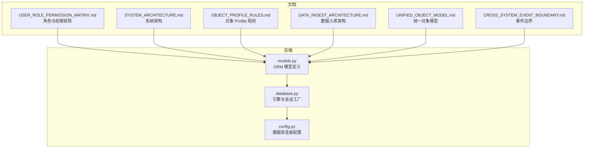
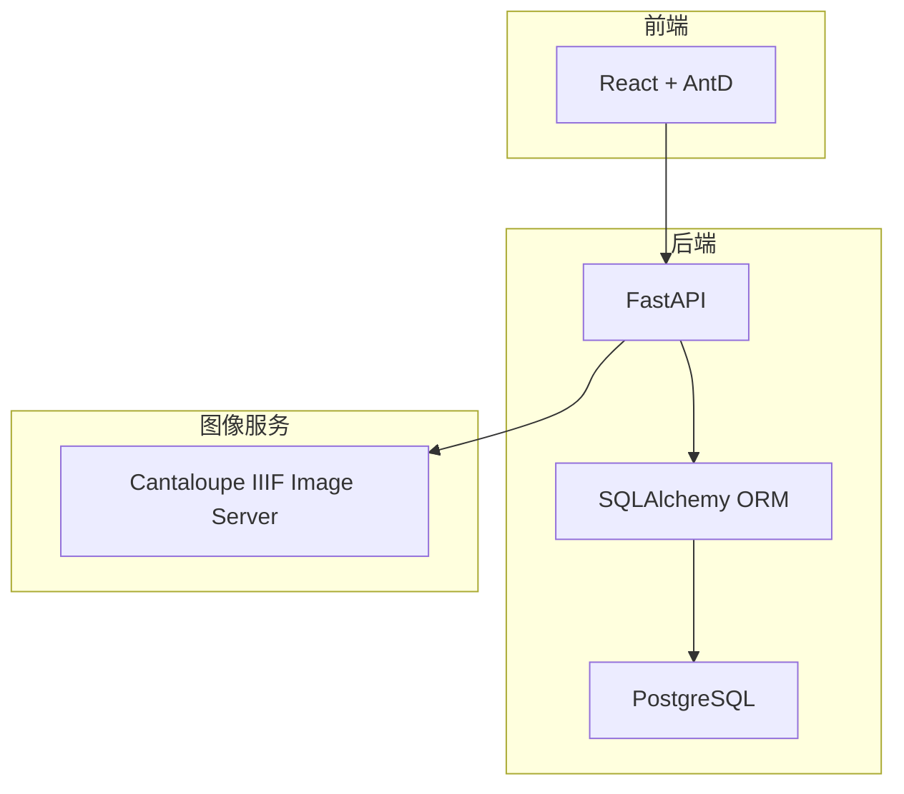
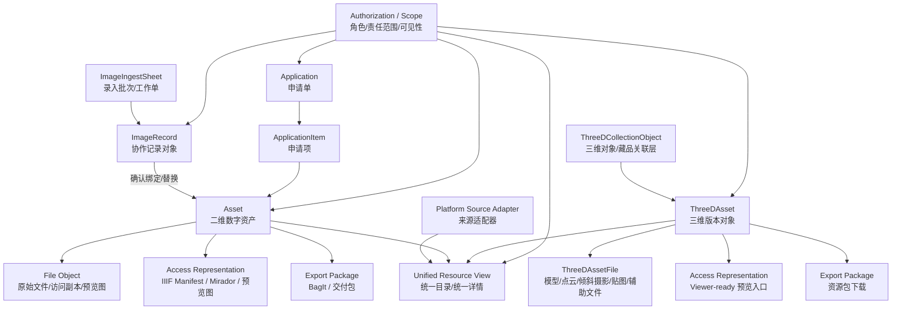
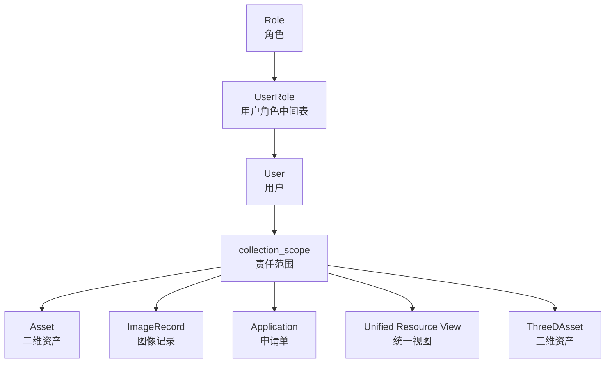
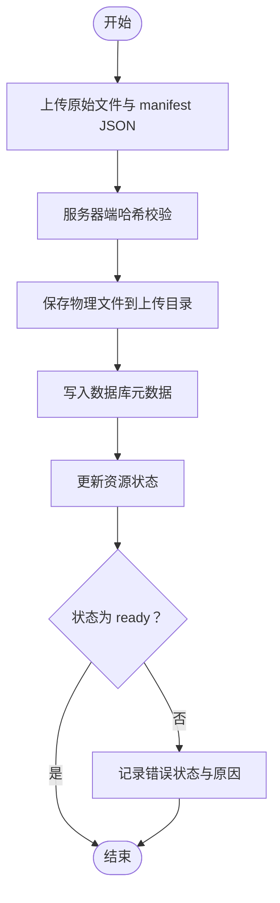
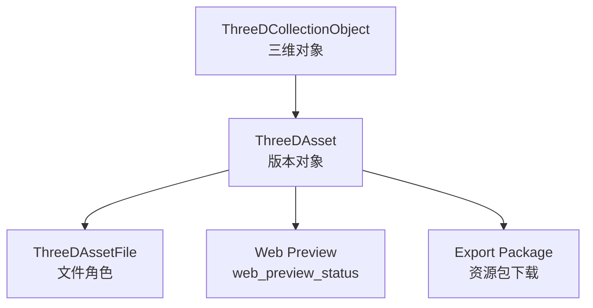
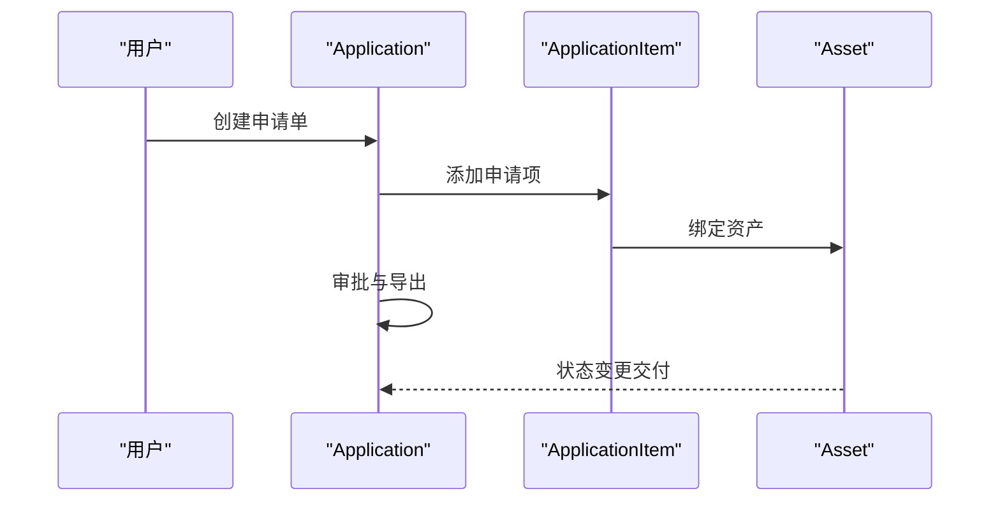
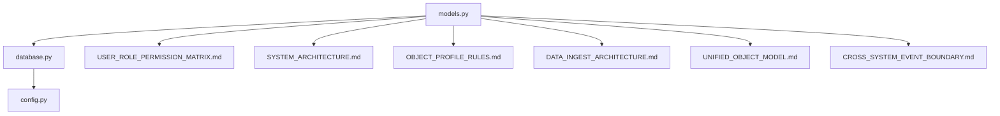

# 实体关系模型

<cite>
**本文引用的文件**
- [models.py](file://backend/app/models.py)
- [database.py](file://backend/app/database.py)
- [config.py](file://backend/app/config.py)
- [SYSTEM_ARCHITECTURE.md](file://docs/02-架构设计/SYSTEM_ARCHITECTURE.md)
- [USER_ROLE_PERMISSION_MATRIX.md](file://docs/03-产品与流程/USER_ROLE_PERMISSION_MATRIX.md)
- [DATA_INGEST_ARCHITECTURE.md](file://docs/02-架构设计/DATA_INGEST_ARCHITECTURE.md)
- [OBJECT_PROFILE_RULES.md](file://docs/03-产品与流程/OBJECT_PROFILE_RULES.md)
- [UNIFIED_OBJECT_MODEL.md](file://docs/08-研究/统一对象模型（UNIFIED_OBJECT_MODEL）.md)
- [CROSS_SYSTEM_EVENT_BOUNDARY.md](file://docs/08-研究/跨子系统最小事件边界（CROSS_SYSTEM_EVENT_BOUNDARY）.md)
</cite>

## 目录
1. [简介](#简介)
2. [项目结构](#项目结构)
3. [核心实体](#核心实体)
4. [架构总览](#架构总览)
5. [详细组件分析](#详细组件分析)
6. [依赖分析](#依赖分析)
7. [性能考量](#性能考量)
8. [故障排查指南](#故障排查指南)
9. [结论](#结论)
10. [附录](#附录)

## 简介
本文件系统化梳理 MDAMS 原型项目的数据库实体关系模型，聚焦核心实体及其业务含义、字段设计、约束与规则，以及实体间的一对一、一对多、多对多关系。文档同时说明外键约束的设计原则、级联删除/更新策略、引用完整性保障机制，并结合统一对象模型与权限范围控制，给出完整的 ER 图与业务场景示例，帮助读者快速理解并正确使用该数据模型。

## 项目结构
后端使用 SQLAlchemy ORM 定义数据模型，数据库连接通过配置文件注入，整体采用 PostgreSQL 作为持久化存储。系统通过统一对象模型将二维资产、图像记录、三维资源、申请流程与权限范围有机整合为统一框架。

图表来源
- [models.py:1-307](file://backend/app/models.py#L1-L307)
- [database.py:1-17](file://backend/app/database.py#L1-L17)
- [config.py:42-46](file://backend/app/config.py#L42-L46)
- [USER_ROLE_PERMISSION_MATRIX.md:1-194](file://docs/03-产品与流程/USER_ROLE_PERMISSION_MATRIX.md#L1-L194)
- [SYSTEM_ARCHITECTURE.md:1-119](file://docs/02-架构设计/SYSTEM_ARCHITECTURE.md#L1-L119)
- [OBJECT_PROFILE_RULES.md:1-124](file://docs/03-产品与流程/OBJECT_PROFILE_RULES.md#L1-L124)
- [DATA_INGEST_ARCHITECTURE.md:1-107](file://docs/02-架构设计/DATA_INGEST_ARCHITECTURE.md#L1-L107)
- [UNIFIED_OBJECT_MODEL.md:1-130](file://docs/08-研究/统一对象模型（UNIFIED_OBJECT_MODEL）.md#L1-L130)
- [CROSS_SYSTEM_EVENT_BOUNDARY.md:1-311](file://docs/08-研究/跨子系统最小事件边界（CROSS_SYSTEM_EVENT_BOUNDARY）.md#L1-L311)

章节来源
- [models.py:1-307](file://backend/app/models.py#L1-L307)
- [database.py:1-17](file://backend/app/database.py#L1-L17)
- [config.py:42-46](file://backend/app/config.py#L42-L46)

## 核心实体
本节逐项说明核心实体的业务含义、字段设计、约束与规则，并给出字段级别的复杂度与性能影响分析（索引、JSON 存储、默认值等）。

- 资产（Asset）
  - 业务含义：二维数字资产的本体对象，承载文件路径、MIME 类型、文件大小、可见性范围、元数据、状态与与图像记录的绑定关系。
  - 关键字段与约束
    - 主键 id，整数自增，建立索引
    - filename、file_path、mime_type、file_size：字符串/整数，用于文件定位与技术元数据
    - visibility_scope：字符串，默认 open，建立索引，配合权限矩阵控制可见性
    - collection_object_id：整数，可空，用于与藏品对象关联
    - image_record_id：整数，外键到 image_records.id，ondelete=SET NULL，唯一且索引，表示与图像记录的绑定
    - metadata_info：JSON，存储 Exif/IPTC 等扩展元数据
    - resource_type：字符串，默认 image_2d_cultural_object
    - status：字符串，默认 processing，枚举值 processing/ready/error
    - created_at：时间戳，默认服务器时间
    - process_message：字符串，可空，用于处理错误信息
  - 复杂度与性能
    - 索引：filename、file_path、visibility_scope、collection_object_id、image_record_id，有利于检索与过滤
    - JSON 存储：metadata_info 便于灵活扩展，但查询时需注意 JSON 路径索引与函数调用开销
    - 默认值与服务器时间：减少应用层逻辑，提升一致性
  - 业务规则
    - 与 ImageRecord 一对一绑定（unique），当图像记录完成匹配后，资产进入 ready 状态
    - 可见性受 visibility_scope 与权限矩阵共同控制

- 用户（User）
  - 业务含义：系统用户，支持角色分配、会话管理与多条图像记录的创建/提交/指派关系
  - 关键字段与约束
    - 主键 id，唯一索引
    - username：唯一、索引、非空
    - display_name：非空
    - password_hash：非空
    - is_active：布尔，默认 True
    - collection_scope：JSON，用于责任范围控制
    - metadata_info：JSON
    - created_at：时间戳
    - 多对多关系：roles（UserRole）
    - 一对多关系：sessions（UserSession）、created_image_records、submitted_image_records、assigned_image_records
  - 复杂度与性能
    - username 唯一索引，登录与鉴权效率高
    - JSON 字段便于扩展，查询时需谨慎
  - 业务规则
    - 会话与角色均支持级联删除/孤儿删除，确保用户删除后相关数据清理

- 角色（Role）
  - 业务含义：权限角色定义，与用户通过中间表 UserRole 关联
  - 关键字段与约束
    - 主键 id，唯一索引
    - key：唯一、索引、非空，角色键
    - label、description、metadata_info：字符串/JSON
    - 多对多关系：users（UserRole）

- 用户角色（UserRole）
  - 业务含义：用户与角色的多对多中间表
  - 关键字段与约束
    - 主键 id，索引
    - user_id、role_id：外键，ondelete=CASCADE，索引，非空
    - created_at：时间戳
  - 业务规则
    - 用户或角色删除时，中间表级联删除，保证引用完整性

- 用户会话（UserSession）
  - 业务含义：用户登录会话，支持 token 唯一性与过期控制
  - 关键字段与约束
    - 主键 id，索引
    - user_id：外键，ondelete=CASCADE，索引，非空
    - session_token：唯一、索引、非空
    - expires_at：非空
    - created_at：时间戳
  - 业务规则
    - 用户删除时，会话级联删除

- 图像采集工作单（ImageIngestSheet）
  - 业务含义：二维图像采集批次/工作单，承载项目信息与状态
  - 关键字段与约束
    - 主键 id，索引
    - sheet_no：唯一、索引、非空
    - title、status、image_type、project_type、project_name、photographer、photographer_org、copyright_owner、capture_time、remark：字符串/JSON
    - created_by_user_id、assigned_photographer_user_id：外键，ondelete=SET NULL，索引
    - metadata_info：JSON
    - created_at、updated_at：时间戳，默认服务器时间，更新时自动更新
    - 一对多关系：items（ImageRecord）
  - 业务规则
    - 与用户的关系使用 SET NULL，避免硬删除导致数据丢失

- 图像记录（ImageRecord）
  - 业务含义：二维图像元数据与状态的协作对象，不等于资产本体
  - 关键字段与约束
    - 主键 id，索引
    - sheet_id：外键，ondelete=CASCADE，索引，可空
    - line_no：整数，可空
    - record_no：唯一、索引、非空
    - title、status、resource_type、visibility_scope、collection_object_id、profile_key：字符串/整数/索引
    - metadata_info：JSON
    - created_by_user_id、submitted_by_user_id、assigned_photographer_user_id：外键，ondelete=SET NULL，索引
    - created_at、updated_at、submitted_at：时间戳
    - 一对一关系：asset（Asset）
    - 多对一关系：sheet（ImageIngestSheet）
    - 多对多关系：created_by_user/submitted_by_user/assigned_photographer_user（User）
  - 业务规则
    - 与资产一对一绑定，与工作单一对多，与用户多对多（创建/提交/指派）
    - 可见性受 visibility_scope 与权限矩阵共同控制

- 应用（Application）
  - 业务含义：资源利用申请单，承载申请人、目的、状态与审批信息
  - 关键字段与约束
    - 主键 id，索引
    - application_no：唯一、索引、非空
    - requester_name、requester_org、contact_email、purpose、usage_scope：字符串
    - status：字符串，默认 submitted，索引
    - review_note：字符串，可空
    - created_at、submitted_at、reviewed_at：时间戳
    - 一对多关系：items（ApplicationItem）

- 应用项（ApplicationItem）
  - 业务含义：申请单中的具体资产项
  - 关键字段与约束
    - 主键 id，索引
    - application_id：外键，ondelete=CASCADE，索引，非空
    - asset_id：外键，ondelete=RESTRICT，索引，非空（防止误删仍在申请中的资产）
    - requested_variant、delivery_format、note：字符串
    - created_at：时间戳
    - 多对一关系：application（Application）、asset（Asset）

- 三维资产（ThreeDAsset）
  - 业务含义：三维资源的版本化对象，承载文件、元数据、状态与版本控制
  - 关键字段与约束
    - 主键 id，索引
    - collection_object_id：外键，ondelete=SET NULL，索引，可空
    - resource_group、filename、file_path、file_size、mime_type：字符串/整数
    - metadata_info：JSON
    - created_at：时间戳，默认服务器时间
    - resource_type：字符串，默认 three_d_model
    - status：字符串，默认 processing，枚举值 processing/ready/error
    - process_message：字符串，可空
    - version_label、version_order：字符串/整数，默认值
    - is_current、is_web_preview：布尔，默认值
    - web_preview_status、web_preview_reason：字符串
    - storage_tier、preservation_status、preservation_note：字符串
    - 一对多关系：files（ThreeDAssetFile）、production_records（ThreeDProductionRecord）
    - 多对一关系：collection_object（ThreeDCollectionObject）

- 三维资产文件（ThreeDAssetFile）
  - 业务含义：三维资产的组成文件，支持多种角色与排序
  - 关键字段与约束
    - 主键 id，索引
    - asset_id：外键，ondelete=CASCADE，索引，非空
    - role、role_label、filename、actual_filename、file_path、file_size、mime_type：字符串/整数
    - sort_order：整数，默认 0
    - is_primary：布尔，默认 False
    - created_at：时间戳
    - 多对一关系：asset（ThreeDAsset）

- 三维集合对象（ThreeDCollectionObject）
  - 业务含义：三维对象/藏品关联层，承载对象编号、名称、类型、集合单元与摘要
  - 关键字段与约束
    - 主键 id，索引
    - object_number、object_name、object_type、collection_unit：字符串，索引
    - summary、keywords、metadata_info：字符串/JSON
    - created_at：时间戳
    - 一对多关系：assets（ThreeDAsset）

- 三维生产记录（ThreeDProductionRecord）
  - 业务含义：三维资源的生产事件记录，承载阶段、事件类型、状态、参与者与证据
  - 关键字段与约束
    - 主键 id，索引
    - asset_id：外键，ondelete=CASCADE，索引，非空
    - stage、event_type、status：字符串，索引
    - actor、description、evidence、metadata_info：字符串/JSON
    - occurred_at：时间戳，默认服务器时间
    - 多对一关系：asset（ThreeDAsset）

章节来源
- [models.py:6-307](file://backend/app/models.py#L6-L307)

## 架构总览
系统采用微服务架构，后端通过 FastAPI + SQLAlchemy 提供 REST API，数据库为 PostgreSQL。统一对象模型将二维资产、图像记录、三维资源、申请流程与权限范围整合为统一框架，支持 IIIF 清单生成与 Mirador 查看器集成。

图表来源
- [SYSTEM_ARCHITECTURE.md:16-68](file://docs/02-架构设计/SYSTEM_ARCHITECTURE.md#L16-L68)
- [models.py:1-307](file://backend/app/models.py#L1-L307)

## 详细组件分析

### 统一对象模型与业务场景
统一对象模型将核心对象与控制语义层清晰分离，强调“以数字资产为核心、以协作对象和扩展对象为补充、以视图层和表示层为外部表达、以权限范围为控制语义”。

图表来源
- [UNIFIED_OBJECT_MODEL.md:36-63](file://docs/08-研究/统一对象模型（UNIFIED_OBJECT_MODEL）.md#L36-L63)

章节来源
- [UNIFIED_OBJECT_MODEL.md:1-130](file://docs/08-研究/统一对象模型（UNIFIED_OBJECT_MODEL）.md#L1-L130)

### 权限与可见性控制
权限矩阵定义了角色到权限的映射，结合可见性范围（open/owner_only）与责任范围（collection_scope），实现细粒度的访问控制。

图表来源
- [USER_ROLE_PERMISSION_MATRIX.md:114-127](file://docs/03-产品与流程/USER_ROLE_PERMISSION_MATRIX.md#L114-L127)
- [models.py:28-111](file://backend/app/models.py#L28-L111)

章节来源
- [USER_ROLE_PERMISSION_MATRIX.md:1-194](file://docs/03-产品与流程/USER_ROLE_PERMISSION_MATRIX.md#L1-L194)
- [models.py:28-111](file://backend/app/models.py#L28-L111)

### 二维入库与元数据分层
二维资源采用分离式 SIP 风格上传与分层元数据组织，入库后状态从 processing 推进到 ready 或错误状态。

图表来源
- [DATA_INGEST_ARCHITECTURE.md:24-61](file://docs/02-架构设计/DATA_INGEST_ARCHITECTURE.md#L24-L61)

章节来源
- [DATA_INGEST_ARCHITECTURE.md:1-107](file://docs/02-架构设计/DATA_INGEST_ARCHITECTURE.md#L1-L107)

### 三维资源版本化与 Web 展示
三维资源采用版本化资源包方式，支持多个版本与多种文件角色，通过 web_preview_status 决定是否进入前端展示。

图表来源
- [models.py:215-307](file://backend/app/models.py#L215-L307)
- [DATA_INGEST_ARCHITECTURE.md:72-87](file://docs/02-架构设计/DATA_INGEST_ARCHITECTURE.md#L72-L87)

章节来源
- [models.py:215-307](file://backend/app/models.py#L215-L307)
- [DATA_INGEST_ARCHITECTURE.md:72-87](file://docs/02-架构设计/DATA_INGEST_ARCHITECTURE.md#L72-L87)

### 申请与交付流程
申请单与申请项构成资源利用的审批与交付链路，资产状态与申请状态相互影响。

图表来源
- [models.py:176-213](file://backend/app/models.py#L176-L213)

章节来源
- [models.py:176-213](file://backend/app/models.py#L176-L213)

## 依赖分析
- 组件耦合与内聚
  - 模型层通过 SQLAlchemy relationship 建立实体间关系，内聚性良好
  - 外键约束与级联策略明确，降低循环依赖风险
- 直接与间接依赖
  - models.py 依赖 database.py 的 Base 与 engine
  - database.py 依赖 config.py 的 DATABASE_URL
  - 权限与可见性控制依赖 USER_ROLE_PERMISSION_MATRIX.md 的角色定义
- 外部依赖与集成点
  - 数据库：PostgreSQL
  - 图像服务：Cantaloupe IIIF Image Server
  - 前端：React + AntD，通过 API 与后端交互

图表来源
- [models.py:1-307](file://backend/app/models.py#L1-L307)
- [database.py:1-17](file://backend/app/database.py#L1-L17)
- [config.py:42-46](file://backend/app/config.py#L42-L46)
- [USER_ROLE_PERMISSION_MATRIX.md:1-194](file://docs/03-产品与流程/USER_ROLE_PERMISSION_MATRIX.md#L1-L194)
- [SYSTEM_ARCHITECTURE.md:1-119](file://docs/02-架构设计/SYSTEM_ARCHITECTURE.md#L1-L119)
- [OBJECT_PROFILE_RULES.md:1-124](file://docs/03-产品与流程/OBJECT_PROFILE_RULES.md#L1-L124)
- [DATA_INGEST_ARCHITECTURE.md:1-107](file://docs/02-架构设计/DATA_INGEST_ARCHITECTURE.md#L1-L107)
- [UNIFIED_OBJECT_MODEL.md:1-130](file://docs/08-研究/统一对象模型（UNIFIED_OBJECT_MODEL）.md#L1-L130)
- [CROSS_SYSTEM_EVENT_BOUNDARY.md:1-311](file://docs/08-研究/跨子系统最小事件边界（CROSS_SYSTEM_EVENT_BOUNDARY）.md#L1-L311)

章节来源
- [models.py:1-307](file://backend/app/models.py#L1-L307)
- [database.py:1-17](file://backend/app/database.py#L1-L17)
- [config.py:42-46](file://backend/app/config.py#L42-L46)

## 性能考量
- 索引策略
  - 高频查询字段（如 filename、visibility_scope、collection_object_id、record_no、sheet_no、application_no 等）建立索引，提升检索效率
- JSON 存储
  - metadata_info 使用 JSON 存储扩展元数据，便于灵活扩展，但查询时需避免全表扫描，建议在热点字段上建立索引或使用专用字段
- 级联策略
  - 用户/角色/会话删除时级联清理，避免悬挂数据；资产与图像记录绑定使用 SET NULL，避免硬删除导致数据丢失
- 事务与一致性
  - 使用 SQLAlchemy 的关系与外键约束保证引用完整性，结合服务器默认时间戳减少应用层逻辑

## 故障排查指南
- 外键冲突
  - 症状：插入/更新时提示违反外键约束
  - 排查：检查关联实体是否存在，特别是用户、工作单、资产、三维对象等
- 级联删除异常
  - 症状：删除用户后，相关会话/角色未清理
  - 排查：确认 ondelete=CASCADE 是否生效，检查中间表与关系定义
- 可见性范围问题
  - 症状：用户无法看到某些资源
  - 排查：核对 visibility_scope 与用户角色/责任范围，确保权限矩阵正确
- 三维资产状态异常
  - 症状：web_preview_status 与实际展示不一致
  - 排查：检查版本化资源包的文件角色与状态字段，确认生产记录与导出流程

章节来源
- [models.py:1-307](file://backend/app/models.py#L1-L307)
- [USER_ROLE_PERMISSION_MATRIX.md:114-127](file://docs/03-产品与流程/USER_ROLE_PERMISSION_MATRIX.md#L114-L127)

## 结论
MDAMS 原型项目的实体关系模型以统一对象模型为核心，围绕二维资产、图像记录、三维资源、申请流程与权限范围构建了清晰的数据架构。通过明确的外键约束、级联策略与索引设计，系统在保证引用完整性的同时兼顾了查询性能与扩展性。结合权限矩阵与可见性控制，系统实现了细粒度的访问治理。未来可在统一事件边界、对象 Profile 与元数据分层方面持续演进，进一步提升系统的规范性与可维护性。

## 附录
- 数据库连接配置
  - DATABASE_URL：PostgreSQL 连接串，用于创建引擎与会话工厂
- 统一对象模型要点
  - 数字资产为核心，图像记录为协作对象，三维资源为扩展对象，统一平台为视图层，权限范围为控制语义层
- 事件边界说明
  - 当前不建议直接引入统一事件表，建议先建立跨子系统最小事件边界，再评估是否推进为统一持久化

章节来源
- [config.py:42-46](file://backend/app/config.py#L42-L46)
- [UNIFIED_OBJECT_MODEL.md:1-130](file://docs/08-研究/统一对象模型（UNIFIED_OBJECT_MODEL）.md#L1-L130)
- [CROSS_SYSTEM_EVENT_BOUNDARY.md:277-292](file://docs/08-研究/跨子系统最小事件边界（CROSS_SYSTEM_EVENT_BOUNDARY）.md#L277-L292)