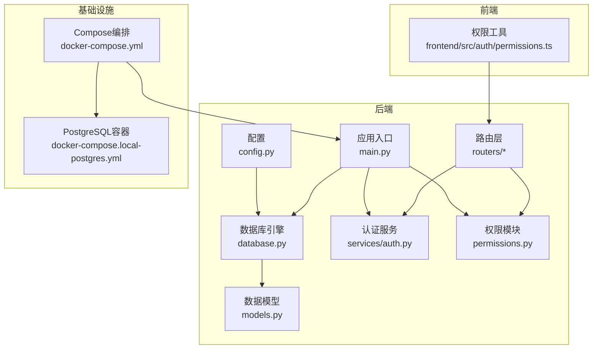
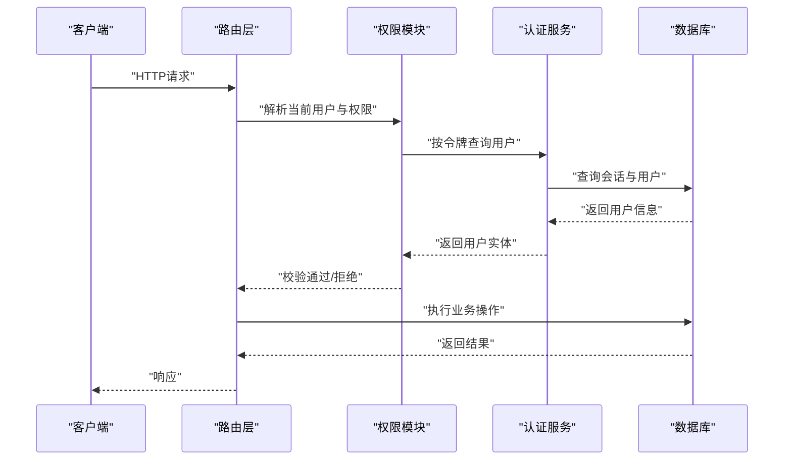
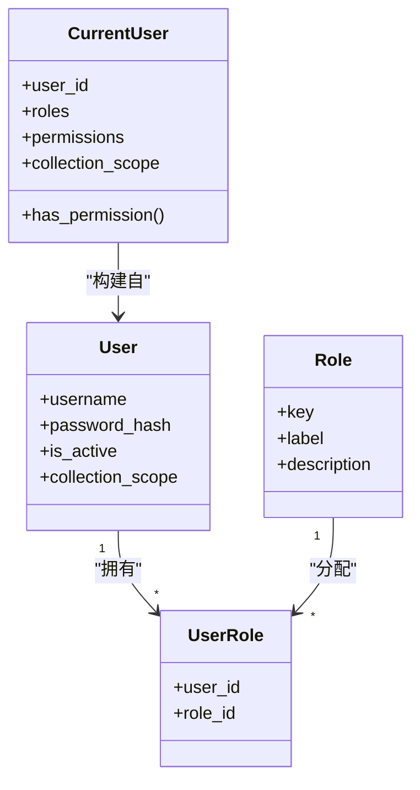
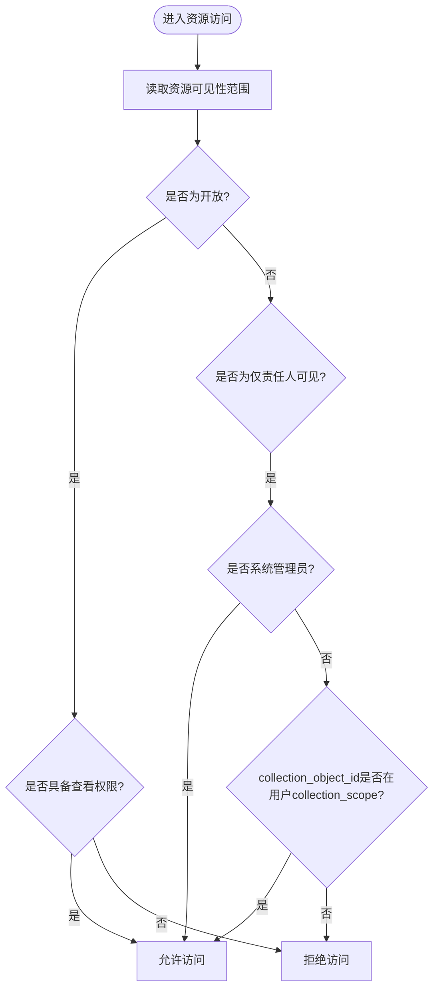
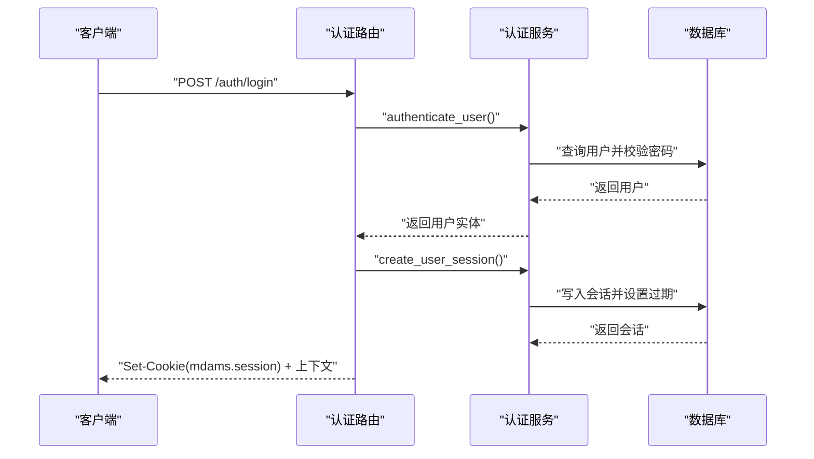
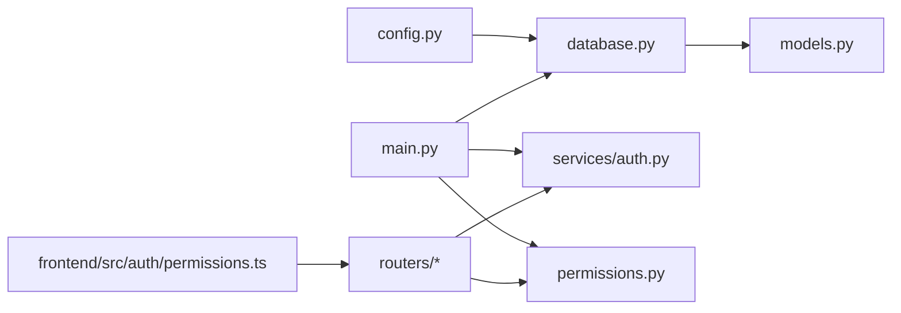

# 数据安全与权限

<cite>
**本文引用的文件**
- [backend/app/database.py](file://backend/app/database.py)
- [backend/app/config.py](file://backend/app/config.py)
- [backend/app/models.py](file://backend/app/models.py)
- [backend/app/permissions.py](file://backend/app/permissions.py)
- [backend/app/main.py](file://backend/app/main.py)
- [backend/app/services/auth.py](file://backend/app/services/auth.py)
- [backend/app/routers/auth.py](file://backend/app/routers/auth.py)
- [backend/app/routers/assets.py](file://backend/app/routers/assets.py)
- [backend/app/routers/image_records.py](file://backend/app/routers/image_records.py)
- [docker-compose.yml](file://docker-compose.yml)
- [docker-compose.local-postgres.yml](file://docker-compose.local-postgres.yml)
- [docs/03-产品与流程/USER_ROLE_PERMISSION_MATRIX.md](file://docs/03-产品与流程/USER_ROLE_PERMISSION_MATRIX.md)
- [docs/05-部署与运维/ENVIRONMENT_VARIABLES.md](file://docs/05-部署与运维/ENVIRONMENT_VARIABLES.md)
- [frontend/src/auth/permissions.ts](file://frontend/src/auth/permissions.ts)
</cite>

## 目录
1. [简介](#简介)
2. [项目结构](#项目结构)
3. [核心组件](#核心组件)
4. [架构总览](#架构总览)
5. [详细组件分析](#详细组件分析)
6. [依赖分析](#依赖分析)
7. [性能考虑](#性能考虑)
8. [故障排查指南](#故障排查指南)
9. [结论](#结论)
10. [附录](#附录)

## 简介
本文件面向MDAMS原型项目的数据库安全与权限，系统性梳理并说明以下方面：
- 数据库级别安全：用户权限管理、基于角色的访问控制（RBAC）、行级安全策略现状与扩展建议
- 敏感数据保护：数据加密、脱敏处理、访问审计日志的记录与分析
- 数据库连接安全：SSL/TLS、身份验证、网络访问控制
- 备份与恢复：备份数据加密、恢复过程审计
- 数据完整性：约束验证、触发器使用、一致性保证
- 安全配置示例、合规性要求与安全事件应急响应流程

## 项目结构
后端采用FastAPI + SQLAlchemy架构，数据库连接通过配置注入，权限控制贯穿路由层与服务层，前端菜单与可见性由权限矩阵驱动。

**图表来源**
- [backend/app/config.py:1-72](file://backend/app/config.py#L1-L72)
- [backend/app/database.py:1-17](file://backend/app/database.py#L1-L17)
- [backend/app/models.py:1-307](file://backend/app/models.py#L1-L307)
- [backend/app/main.py:1-86](file://backend/app/main.py#L1-L86)
- [backend/app/services/auth.py:1-143](file://backend/app/services/auth.py#L1-L143)
- [backend/app/permissions.py:1-255](file://backend/app/permissions.py#L1-L255)
- [docker-compose.yml:1-131](file://docker-compose.yml#L1-L131)
- [docker-compose.local-postgres.yml:1-19](file://docker-compose.local-postgres.yml#L1-L19)

**章节来源**
- [backend/app/config.py:1-72](file://backend/app/config.py#L1-L72)
- [backend/app/database.py:1-17](file://backend/app/database.py#L1-L17)
- [backend/app/models.py:1-307](file://backend/app/models.py#L1-L307)
- [backend/app/main.py:1-86](file://backend/app/main.py#L1-L86)
- [docker-compose.yml:1-131](file://docker-compose.yml#L1-L131)
- [docker-compose.local-postgres.yml:1-19](file://docker-compose.local-postgres.yml#L1-L19)

## 核心组件
- 数据库连接与会话
  - 通过配置加载数据库URL，创建引擎与会话工厂，提供依赖注入获取数据库会话。
- 权限与角色
  - 定义角色到权限映射，解析当前用户上下文，提供权限校验依赖。
- 认证服务
  - 用户密码哈希、会话令牌生成与存储、登录/登出流程。
- 路由层安全
  - 资产上传、列表、删除等接口均绑定权限依赖，确保最小授权。
- 前端菜单可见性
  - 基于权限集合控制菜单项展示。

**章节来源**
- [backend/app/database.py:1-17](file://backend/app/database.py#L1-L17)
- [backend/app/config.py:42-46](file://backend/app/config.py#L42-L46)
- [backend/app/permissions.py:17-94](file://backend/app/permissions.py#L17-L94)
- [backend/app/services/auth.py:44-143](file://backend/app/services/auth.py#L44-L143)
- [backend/app/routers/assets.py:54-134](file://backend/app/routers/assets.py#L54-L134)
- [frontend/src/auth/permissions.ts:84-98](file://frontend/src/auth/permissions.ts#L84-L98)

## 架构总览
后端通过依赖注入获取数据库会话，路由层在请求进入时进行权限校验，认证服务负责用户身份与会话生命周期管理。前端根据权限集合动态渲染菜单。

**图表来源**
- [backend/app/routers/auth.py:53-82](file://backend/app/routers/auth.py#L53-L82)
- [backend/app/services/auth.py:115-127](file://backend/app/services/auth.py#L115-L127)
- [backend/app/permissions.py:179-204](file://backend/app/permissions.py#L179-L204)

## 详细组件分析

### 数据库连接与安全配置
- 连接字符串
  - 通过环境变量DATABASE_URL注入，支持主机与容器内不同部署场景。
- 端口与网络
  - PostgreSQL容器暴露5432端口，Compose文件定义了环境变量映射。
- SSL/TLS与身份验证
  - 当前未启用SSL/TLS与证书校验；建议在生产环境启用SSL并配置客户端证书校验。
- 网络访问控制
  - 通过容器编排限制外部直连，建议结合防火墙策略与网络隔离。

**章节来源**
- [backend/app/config.py:42-46](file://backend/app/config.py#L42-L46)
- [docker-compose.yml:88-98](file://docker-compose.yml#L88-L98)
- [docker-compose.local-postgres.yml:6-12](file://docker-compose.local-postgres.yml#L6-L12)

### 用户权限管理与RBAC
- 角色与权限
  - 内置角色与权限映射集中定义，覆盖二维资源、三维资源、图像记录、利用申请等业务域。
- 当前默认用户
  - 种植默认用户集，包含系统管理员与各业务角色，便于快速验证。
- 权限依赖
  - 路由层广泛使用require_permission与require_any_permission，确保最小权限原则。

**图表来源**
- [backend/app/models.py:28-111](file://backend/app/models.py#L28-L111)
- [backend/app/permissions.py:102-151](file://backend/app/permissions.py#L102-L151)

**章节来源**
- [docs/03-产品与流程/USER_ROLE_PERMISSION_MATRIX.md:14-96](file://docs/03-产品与流程/USER_ROLE_PERMISSION_MATRIX.md#L14-L96)
- [backend/app/services/auth.py:15-41](file://backend/app/services/auth.py#L15-L41)
- [backend/app/permissions.py:17-94](file://backend/app/permissions.py#L17-L94)

### 行级安全策略
- 可见性范围
  - 资产与图像记录支持“开放”和“仅责任人可见”两种范围，系统管理员可绕过范围限制。
- 访问判定
  - 通过can_access_visibility_scope与路由层可见性判断函数实现，结合collection_scope进行范围匹配。

**图表来源**
- [backend/app/permissions.py:239-254](file://backend/app/permissions.py#L239-L254)
- [backend/app/routers/assets.py:201-207](file://backend/app/routers/assets.py#L201-L207)
- [backend/app/routers/image_records.py:578-596](file://backend/app/routers/image_records.py#L578-L596)

**章节来源**
- [docs/03-产品与流程/USER_ROLE_PERMISSION_MATRIX.md:114-127](file://docs/03-产品与流程/USER_ROLE_PERMISSION_MATRIX.md#L114-L127)
- [backend/app/permissions.py:239-254](file://backend/app/permissions.py#L239-L254)
- [backend/app/routers/assets.py:201-207](file://backend/app/routers/assets.py#L201-L207)
- [backend/app/routers/image_records.py:578-596](file://backend/app/routers/image_records.py#L578-L596)

### 敏感数据保护
- 密码与会话
  - 密码采用PBKDF2-HMAC-SHA256加盐哈希；会话令牌使用安全随机生成，带过期时间。
- 传输与存储
  - 当前未启用数据库侧加密与字段级加密；建议在生产环境启用列级加密与传输加密。
- 脱敏处理
  - 项目未实现自动脱敏；可在路由层或序列化层对敏感字段进行脱敏输出。
- 审计日志
  - 图像记录已内置审计轨迹写入逻辑，记录操作者、时间与备注；建议扩展到更多关键资源。

**章节来源**
- [backend/app/services/auth.py:44-56](file://backend/app/services/auth.py#L44-L56)
- [backend/app/services/auth.py:58-60](file://backend/app/services/auth.py#L58-L60)
- [backend/app/services/auth.py:102-112](file://backend/app/services/auth.py#L102-L112)
- [backend/app/routers/image_records.py:154-178](file://backend/app/routers/image_records.py#L154-L178)

### 数据完整性与一致性
- 约束与索引
  - 模型定义包含主键、唯一索引、外键与索引，确保基本一致性。
- 业务状态与流程
  - 资产与图像记录的状态字段配合元数据层，形成可追踪的生命周期。
- 事务与会话
  - 路由层操作在数据库会话内执行，失败时回滚，保证原子性。

**章节来源**
- [backend/app/models.py:6-26](file://backend/app/models.py#L6-L26)
- [backend/app/models.py:144-174](file://backend/app/models.py#L144-L174)
- [backend/app/main.py:61-62](file://backend/app/main.py#L61-L62)

### 认证与会话管理
- 登录/登出
  - 支持Cookie与Bearer Token两种认证方式；登录成功后设置安全Cookie并返回上下文。
- 会话有效期
  - 会话过期时间固定，建议按需调整并支持刷新机制。
- 默认用户与角色
  - 初始化脚本播种默认角色与用户，便于快速部署与测试。

**图表来源**
- [backend/app/routers/auth.py:53-68](file://backend/app/routers/auth.py#L53-L68)
- [backend/app/services/auth.py:136-143](file://backend/app/services/auth.py#L136-L143)
- [backend/app/services/auth.py:102-112](file://backend/app/services/auth.py#L102-L112)

**章节来源**
- [backend/app/routers/auth.py:53-82](file://backend/app/routers/auth.py#L53-L82)
- [backend/app/services/auth.py:136-143](file://backend/app/services/auth.py#L136-L143)

### 前端权限与菜单控制
- 菜单可见性
  - 基于权限集合判断菜单项展示，避免越权访问。
- 角色标签与权限名称
  - 前端维护角色与权限常量，与后端保持一致。

**章节来源**
- [frontend/src/auth/permissions.ts:84-98](file://frontend/src/auth/permissions.ts#L84-L98)
- [docs/03-产品与流程/USER_ROLE_PERMISSION_MATRIX.md:100-113](file://docs/03-产品与流程/USER_ROLE_PERMISSION_MATRIX.md#L100-L113)

## 依赖分析
后端组件间依赖清晰，权限模块与认证服务被路由层广泛依赖，数据库引擎贯穿所有业务层。

**图表来源**
- [backend/app/config.py:1-72](file://backend/app/config.py#L1-L72)
- [backend/app/database.py:1-17](file://backend/app/database.py#L1-L17)
- [backend/app/models.py:1-307](file://backend/app/models.py#L1-L307)
- [backend/app/main.py:1-86](file://backend/app/main.py#L1-L86)
- [backend/app/permissions.py:1-255](file://backend/app/permissions.py#L1-L255)
- [backend/app/services/auth.py:1-143](file://backend/app/services/auth.py#L1-L143)
- [frontend/src/auth/permissions.ts:1-111](file://frontend/src/auth/permissions.ts#L1-L111)

**章节来源**
- [backend/app/main.py:58-62](file://backend/app/main.py#L58-L62)
- [backend/app/routers/assets.py:10-13](file://backend/app/routers/assets.py#L10-L13)

## 性能考虑
- 数据库连接池与并发
  - 当前使用SQLAlchemy默认会话工厂，建议在生产环境配置连接池大小与超时参数。
- 上传与预览
  - 上传路径与预览生成涉及磁盘IO，建议优化存储与缓存策略。
- 日志与审计
  - 审计日志写入应异步化，避免阻塞主业务流程。

[本节为通用指导，无需具体文件来源]

## 故障排查指南
- 认证失败
  - 检查用户名/密码是否正确，确认会话是否过期。
- 权限不足
  - 确认当前用户角色与权限集合，核对菜单可见性规则。
- 数据库连接
  - 检查DATABASE_URL与容器网络，确认PostgreSQL服务可用。
- 审计日志缺失
  - 确认审计写入逻辑是否触发，检查元数据层结构。

**章节来源**
- [backend/app/routers/auth.py:54-58](file://backend/app/routers/auth.py#L54-L58)
- [backend/app/services/auth.py:136-143](file://backend/app/services/auth.py#L136-L143)
- [backend/app/routers/image_records.py:154-178](file://backend/app/routers/image_records.py#L154-L178)

## 结论
MDAMS原型已实现较为完善的RBAC与行级安全控制，权限与角色矩阵清晰，路由层最小授权原则得到贯彻。建议在生产环境中补齐数据库传输加密、列级加密、脱敏处理与统一审计事件层，完善备份与恢复的加密与审计流程，持续提升整体安全性与合规性。

[本节为总结，无需具体文件来源]

## 附录

### 安全配置示例（建议）
- 数据库连接
  - 启用SSL与证书校验，使用强密码与独立账号。
- 会话安全
  - 设置HttpOnly、Secure、SameSite属性，缩短会话有效期。
- 审计与日志
  - 将审计日志写入独立表并开启归档，定期轮转与备份。
- 备份与恢复
  - 备份数据加密存储，恢复过程记录操作人与时间戳。

**章节来源**
- [docs/05-部署与运维/ENVIRONMENT_VARIABLES.md:10-18](file://docs/05-部署与运维/ENVIRONMENT_VARIABLES.md#L10-L18)
- [backend/app/routers/auth.py:60-67](file://backend/app/routers/auth.py#L60-L67)

### 合规性要求说明
- 角色与权限矩阵
  - 以代码为准，确保角色职责分离与最小权限原则。
- 可见范围规则
  - “开放”与“仅责任人可见”的判定逻辑需与组织政策一致。
- 审计与追溯
  - 审计轨迹应满足可追溯、不可抵赖的要求。

**章节来源**
- [docs/03-产品与流程/USER_ROLE_PERMISSION_MATRIX.md:114-127](file://docs/03-产品与流程/USER_ROLE_PERMISSION_MATRIX.md#L114-L127)
- [backend/app/routers/image_records.py:154-178](file://backend/app/routers/image_records.py#L154-L178)

### 应急响应流程（建议）
- 发现异常
  - 快速定位受影响资源与操作人，冻结相关会话。
- 隔离与取证
  - 暂停相关功能，导出审计日志与数据库快照。
- 修复与验证
  - 修复漏洞后进行回归测试，验证权限与可见性。
- 复盘与改进
  - 更新安全策略与培训，完善监控告警。

[本节为流程建议，无需具体文件来源]