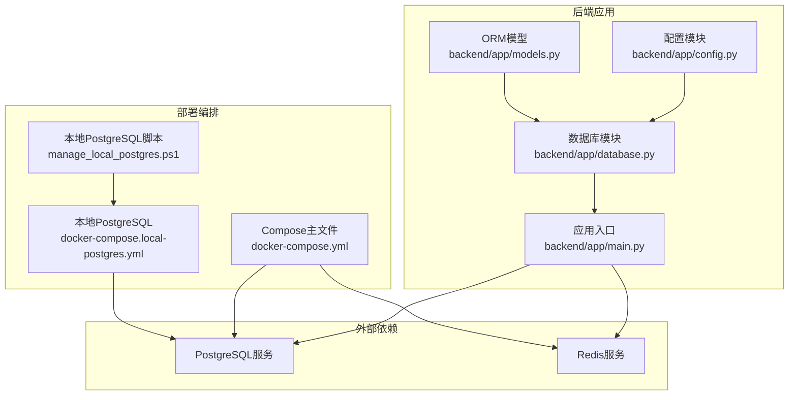
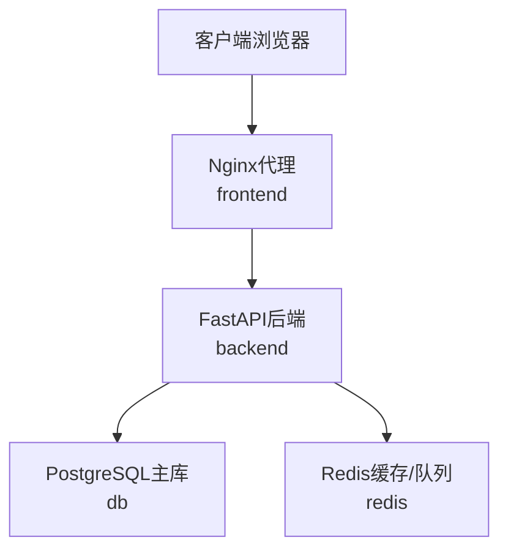
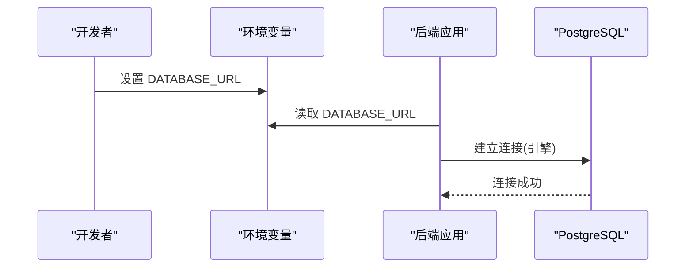
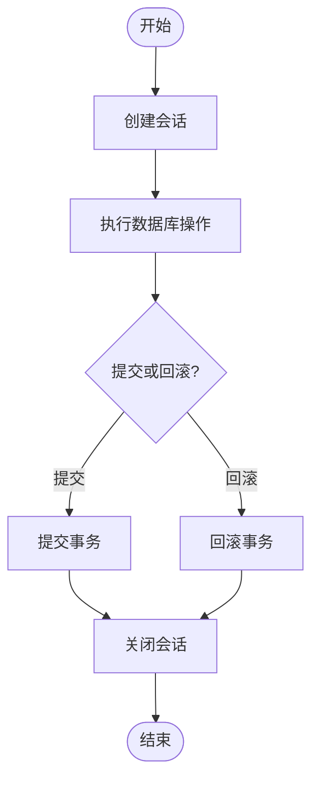
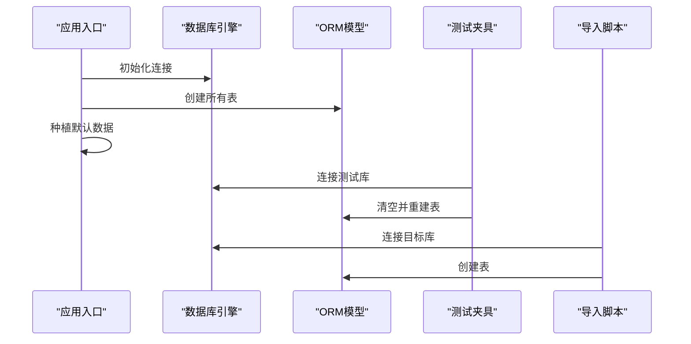
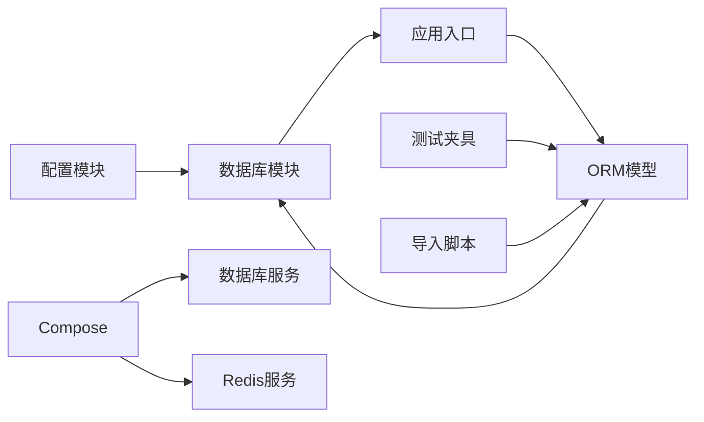

# 数据库架构设计

<cite>
**本文引用的文件**
- [backend/app/database.py](file://backend/app/database.py)
- [backend/app/config.py](file://backend/app/config.py)
- [backend/app/main.py](file://backend/app/main.py)
- [backend/app/models.py](file://backend/app/models.py)
- [docker-compose.yml](file://docker-compose.yml)
- [docker-compose.local-postgres.yml](file://docker-compose.local-postgres.yml)
- [manage_local_postgres.ps1](file://manage_local_postgres.ps1)
- [docs/05-部署与运维/ENVIRONMENT_VARIABLES.md](file://docs/05-部署与运维/ENVIRONMENT_VARIABLES.md)
- [docs/05-部署与运维/SETUP_AND_DEPLOYMENT.md](file://docs/05-部署与运维/SETUP_AND_DEPLOYMENT.md)
- [docs/05-部署与运维/TROUBLESHOOTING.md](file://docs/05-部署与运维/TROUBLESHOOTING.md)
- [backend/tests/conftest.py](file://backend/tests/conftest.py)
- [backend/scripts/import_2d_images.py](file://backend/scripts/import_2d_images.py)
- [backend/scripts/import_reference_manifests.py](file://backend/scripts/import_reference_manifests.py)
</cite>

## 目录
1. [引言](#引言)
2. [项目结构](#项目结构)
3. [核心组件](#核心组件)
4. [架构总览](#架构总览)
5. [详细组件分析](#详细组件分析)
6. [依赖分析](#依赖分析)
7. [性能考虑](#性能考虑)
8. [故障排查指南](#故障排查指南)
9. [结论](#结论)
10. [附录](#附录)

## 引言
本文件面向MDAMS原型项目的数据库架构设计，围绕数据库选型、连接配置、事务管理、初始化流程、高可用与集群思路、备份恢复、监控告警、性能调优、安全与加密等主题进行系统化说明。项目当前采用PostgreSQL作为主数据库，结合Docker Compose进行本地与开发环境部署，并通过环境变量统一管理数据库连接与运行参数。

## 项目结构
数据库相关的关键文件与职责如下：
- 配置层：集中于后端配置模块，负责加载环境变量并生成数据库连接串。
- 连接层：基于SQLAlchemy创建引擎与会话工厂，提供数据库会话生命周期管理。
- 初始化层：应用启动时创建表结构，测试环境通过夹具进行表级初始化。
- 部署层：通过Compose定义数据库服务、端口映射、卷与环境变量，支持本地独立PostgreSQL测试环境脚本。

**图表来源**
- [backend/app/config.py:42](file://backend/app/config.py#L42)
- [backend/app/database.py:1-17](file://backend/app/database.py#L1-L17)
- [backend/app/main.py:58-62](file://backend/app/main.py#L58-L62)
- [docker-compose.yml:84-97](file://docker-compose.yml#L84-L97)
- [docker-compose.local-postgres.yml:1-19](file://docker-compose.local-postgres.yml#L1-L19)
- [manage_local_postgres.ps1:57-71](file://manage_local_postgres.ps1#L57-L71)

**章节来源**
- [backend/app/config.py:42](file://backend/app/config.py#L42)
- [backend/app/database.py:1-17](file://backend/app/database.py#L1-L17)
- [backend/app/main.py:58-62](file://backend/app/main.py#L58-L62)
- [docker-compose.yml:84-97](file://docker-compose.yml#L84-L97)
- [docker-compose.local-postgres.yml:1-19](file://docker-compose.local-postgres.yml#L1-L19)
- [manage_local_postgres.ps1:57-71](file://manage_local_postgres.ps1#L57-L71)

## 核心组件
- 数据库连接配置
  - 通过环境变量DATABASE_URL统一配置，支持开发与生产环境切换。
  - 默认值指向Compose中的db服务，开发时可改为本地独立PostgreSQL实例。
- 连接引擎与会话
  - 使用SQLAlchemy创建引擎与会话工厂，关闭自动提交与自动刷新，确保显式事务控制。
  - 提供依赖注入式的会话生成器，保证每个请求/任务使用独立会话并在结束时关闭。
- ORM模型与初始化
  - 所有业务实体继承自统一Base，应用启动时创建所有表。
  - 测试环境通过夹具在内存或本地测试库上重建表结构，确保隔离性。
- 部署与环境变量
  - Compose定义数据库镜像、端口映射、卷与环境变量。
  - 本地提供独立PostgreSQL容器脚本，便于本机快速搭建测试环境。

**章节来源**
- [backend/app/config.py:42](file://backend/app/config.py#L42)
- [backend/app/database.py:1-17](file://backend/app/database.py#L1-L17)
- [backend/app/models.py:1-307](file://backend/app/models.py#L1-L307)
- [backend/app/main.py:58-62](file://backend/app/main.py#L58-L62)
- [docs/05-部署与运维/ENVIRONMENT_VARIABLES.md:10-18](file://docs/05-部署与运维/ENVIRONMENT_VARIABLES.md#L10-L18)
- [docker-compose.yml:84-97](file://docker-compose.yml#L84-L97)

## 架构总览
数据库架构围绕“单一主库 + 会话生命周期管理 + 显式事务控制”展开，配合Redis用于任务队列与缓存，Cantaloupe提供IIIF图像服务，前端通过Nginx代理访问后端与图像服务。

**图表来源**
- [docker-compose.yml:2-83](file://docker-compose.yml#L2-L83)
- [docker-compose.yml:84-127](file://docker-compose.yml#L84-L127)

**章节来源**
- [docker-compose.yml:2-83](file://docker-compose.yml#L2-L83)
- [docker-compose.yml:84-127](file://docker-compose.yml#L84-L127)

## 详细组件分析

### 数据库连接与配置
- 连接串来源
  - 后端从环境变量DATABASE_URL读取数据库连接串，Compose中将其透传至backend与celery_worker。
  - 本地独立PostgreSQL测试环境可通过脚本一键启动，测试连接串可覆盖TEST_DATABASE_URL。
- 环境变量约定
  - POSTGRES_USER/PASSWORD/DB用于初始化数据库服务。
  - API_PUBLIC_URL与CANTALOUPE_PUBLIC_URL用于生成对外访问链接，与数据库无直接耦合，但影响前端访问路径。
- 开发与生产差异
  - 开发：默认连接db服务；可替换为本地独立PostgreSQL实例。
  - 生产：通过云服务或自有数据库提供者，确保网络可达与安全策略（如SSL、防火墙）满足要求。

**图表来源**
- [backend/app/config.py:42](file://backend/app/config.py#L42)
- [docker-compose.yml:8-29](file://docker-compose.yml#L8-L29)
- [docs/05-部署与运维/ENVIRONMENT_VARIABLES.md:10-18](file://docs/05-部署与运维/ENVIRONMENT_VARIABLES.md#L10-L18)

**章节来源**
- [backend/app/config.py:42](file://backend/app/config.py#L42)
- [docker-compose.yml:8-29](file://docker-compose.yml#L8-L29)
- [docs/05-部署与运维/ENVIRONMENT_VARIABLES.md:10-18](file://docs/05-部署与运维/ENVIRONMENT_VARIABLES.md#L10-L18)

### 事务管理与会话生命周期
- 会话工厂
  - 使用SQLAlchemy会话工厂创建非自动提交、非自动刷新的会话，确保事务由调用方显式控制。
- 依赖注入
  - 提供get_db依赖生成器，在请求/任务处理期间创建会话，finally块中关闭会话，避免连接泄漏。
- 事务策略
  - 项目未引入全局连接池配置与事务装饰器，建议在需要时引入连接池参数与上下文管理器，以提升并发与稳定性。

**图表来源**
- [backend/app/database.py:11-16](file://backend/app/database.py#L11-L16)

**章节来源**
- [backend/app/database.py:1-17](file://backend/app/database.py#L1-L17)

### 数据库初始化流程
- 应用启动初始化
  - 应用入口在启动时创建所有表，并播种默认认证数据。
- 测试初始化
  - 测试夹具在每次会话前重建表结构，确保测试隔离与确定性。
- 脚本初始化
  - 导入脚本在执行前创建表，保证离线批处理场景下的表结构一致性。

**图表来源**
- [backend/app/main.py:58-62](file://backend/app/main.py#L58-L62)
- [backend/tests/conftest.py:102-111](file://backend/tests/conftest.py#L102-L111)
- [backend/scripts/import_2d_images.py:126](file://backend/scripts/import_2d_images.py#L126)
- [backend/scripts/import_reference_manifests.py:58](file://backend/scripts/import_reference_manifests.py#L58)

**章节来源**
- [backend/app/main.py:58-62](file://backend/app/main.py#L58-L62)
- [backend/tests/conftest.py:102-111](file://backend/tests/conftest.py#L102-L111)
- [backend/scripts/import_2d_images.py:126](file://backend/scripts/import_2d_images.py#L126)
- [backend/scripts/import_reference_manifests.py:58](file://backend/scripts/import_reference_manifests.py#L58)

### 数据库集群与高可用性设计
- 当前状态
  - 项目采用单实例PostgreSQL，通过卷持久化数据，容器重启后数据不丢失。
- 集群与高可用建议
  - 生产环境建议采用主从复制或托管数据库（如云数据库服务）以实现高可用与故障转移。
  - 结合连接池与读写分离策略，将只读查询路由至从库，降低主库压力。
  - 配置健康检查与自动故障转移，确保服务连续性。

[本节为概念性建议，无需列出章节来源]

### 数据库备份与恢复策略
- 备份
  - 利用PostgreSQL内置工具定期备份数据，结合Compose卷快照或外部存储策略。
- 恢复
  - 在新环境中恢复备份，校验数据完整性与应用版本兼容性。
- 测试
  - 在测试环境中模拟恢复流程，确保备份可用且可快速恢复。

[本节为通用运维建议，无需列出章节来源]

### 监控与告警机制
- 健康检查
  - 后端提供健康检查与就绪检查端点，可用于容器编排的存活/就绪探针。
- 日志
  - 通过Compose日志输出定位数据库连接、权限与网络问题。
- 告警
  - 建议在生产环境集成数据库监控（连接数、慢查询、错误率）与告警通道。

**章节来源**
- [docs/05-部署与运维/TROUBLESHOOTING.md:32-49](file://docs/05-部署与运维/TROUBLESHOOTING.md#L32-L49)
- [docs/05-部署与运维/TROUBLESHOOTING.md:51-63](file://docs/05-部署与运维/TROUBLESHOOTING.md#L51-L63)

### 性能调优方案
- 连接池
  - 建议引入连接池参数（最大连接数、空闲连接、超时等），减少连接建立开销。
- 查询优化
  - 为高频查询字段建立索引，避免全表扫描；定期分析慢查询日志。
- 存储与IO
  - 使用SSD存储与合理卷挂载策略，提升IO性能。
- 并发与事务
  - 控制事务粒度，避免长时间持有锁；批量写入时合并事务以减少往返。

[本节为通用性能建议，无需列出章节来源]

### 安全配置与加密
- 访问控制
  - 严格限制数据库访问来源，生产环境使用专用子网与防火墙规则。
- 传输安全
  - 建议启用SSL/TLS连接，强制加密通信；在容器间通信时也应考虑加密。
- 凭据管理
  - 使用密钥管理服务或环境变量注入，避免明文存储在配置文件中。
- 加密与合规
  - 对敏感字段进行加密存储；遵循数据保护法规与组织安全策略。

[本节为通用安全建议，无需列出章节来源]

## 依赖分析
- 组件耦合
  - 配置模块与数据库模块强耦合（连接串来源），应用入口依赖数据库模块完成初始化。
  - 测试夹具与导入脚本依赖ORM模型与数据库引擎，形成测试与批处理的统一初始化路径。
- 外部依赖
  - Compose定义数据库与Redis服务，后端通过环境变量与容器网络访问。
- 循环依赖
  - 当前结构未发现循环依赖，模块职责清晰。

**图表来源**
- [backend/app/config.py:42](file://backend/app/config.py#L42)
- [backend/app/database.py:1-17](file://backend/app/database.py#L1-L17)
- [backend/app/main.py:58-62](file://backend/app/main.py#L58-L62)
- [backend/app/models.py:1-307](file://backend/app/models.py#L1-L307)
- [backend/tests/conftest.py:102-111](file://backend/tests/conftest.py#L102-L111)
- [backend/scripts/import_2d_images.py:126](file://backend/scripts/import_2d_images.py#L126)
- [docker-compose.yml:84-127](file://docker-compose.yml#L84-L127)

**章节来源**
- [backend/app/config.py:42](file://backend/app/config.py#L42)
- [backend/app/database.py:1-17](file://backend/app/database.py#L1-L17)
- [backend/app/main.py:58-62](file://backend/app/main.py#L58-L62)
- [backend/app/models.py:1-307](file://backend/app/models.py#L1-L307)
- [backend/tests/conftest.py:102-111](file://backend/tests/conftest.py#L102-L111)
- [backend/scripts/import_2d_images.py:126](file://backend/scripts/import_2d_images.py#L126)
- [docker-compose.yml:84-127](file://docker-compose.yml#L84-L127)

## 性能考虑
- 连接池参数
  - 建议根据并发与资源情况调整最大连接数、空闲连接与超时时间，避免连接争用。
- 事务与锁
  - 缩短事务持续时间，批量更新时合并提交，减少锁竞争。
- 索引与查询
  - 为高频过滤与排序字段建立索引；定期分析执行计划，优化慢查询。
- 存储与IO
  - 使用高性能存储介质，合理规划卷与数据目录，避免IO瓶颈。

[本节为通用性能建议，无需列出章节来源]

## 故障排查指南
- 启动类问题
  - 前端无法访问：检查前端容器状态、端口占用与代理配置。
  - 后端健康检查失败：检查后端容器、数据库连接串与Redis连接。
- 数据库连不上
  - 检查db容器状态、环境变量与主机名解析；本地独立PostgreSQL可使用脚本状态与日志命令。
- 资源与挂载
  - 上传文件找不到：确认宿主机路径存在、映射正确且可写。
- IIIF与Mirador
  - 检查CANTALOUPE_PUBLIC_URL与Nginx代理配置，确保前端能访问到IIIF服务。

**章节来源**
- [docs/05-部署与运维/TROUBLESHOOTING.md:16-84](file://docs/05-部署与运维/TROUBLESHOOTING.md#L16-L84)
- [docs/05-部署与运维/TROUBLESHOOTING.md:114-147](file://docs/05-部署与运维/TROUBLESHOOTING.md#L114-L147)

## 结论
MDAMS原型项目当前采用PostgreSQL作为主数据库，通过环境变量与Docker Compose实现灵活的开发与部署体验。数据库连接与会话管理遵循显式控制原则，应用与测试均在启动时完成表初始化。为进一步提升生产可用性，建议引入连接池、读写分离、集群与高可用方案，并完善备份恢复、监控告警与安全策略。

[本节为总结性内容，无需列出章节来源]

## 附录
- 环境变量参考
  - 数据库相关：POSTGRES_USER、POSTGRES_PASSWORD、POSTGRES_DB、DATABASE_URL、TEST_DATABASE_URL。
  - 公共URL：API_PUBLIC_URL、CANTALOUPE_PUBLIC_URL。
  - 端口与路径：FRONTEND_PORT、BACKEND_PORT、DB_PORT、REDIS_PORT、CANTALOUPE_PORT、HOST_MUSEUM_PATH、UPLOAD_DIR。
- 本地独立PostgreSQL
  - 使用脚本一键启动、查看、停止与重置本地PostgreSQL容器，便于本机测试与联调。

**章节来源**
- [docs/05-部署与运维/ENVIRONMENT_VARIABLES.md:10-81](file://docs/05-部署与运维/ENVIRONMENT_VARIABLES.md#L10-L81)
- [docs/05-部署与运维/SETUP_AND_DEPLOYMENT.md:111-151](file://docs/05-部署与运维/SETUP_AND_DEPLOYMENT.md#L111-L151)
- [manage_local_postgres.ps1:57-97](file://manage_local_postgres.ps1#L57-L97)