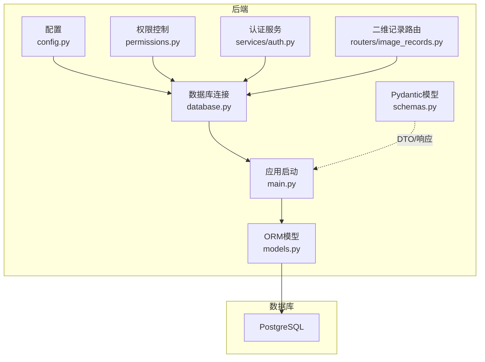
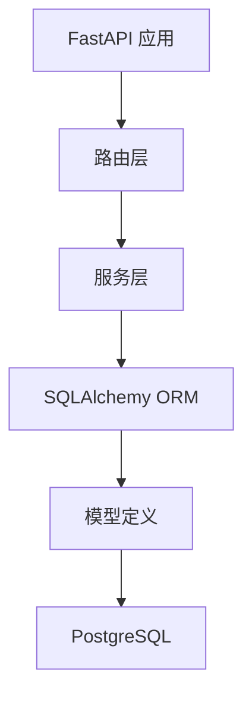
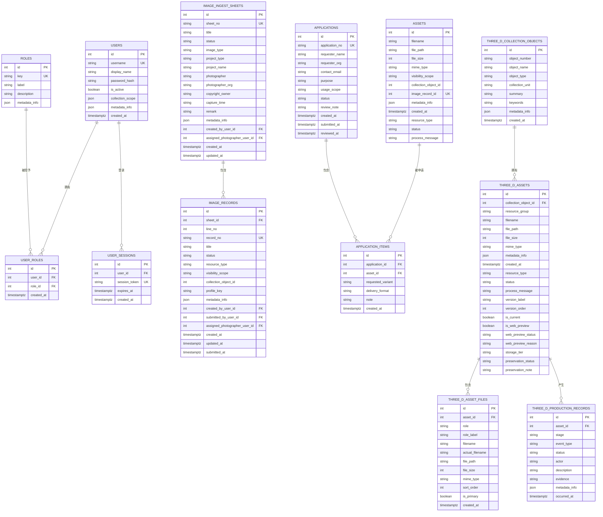
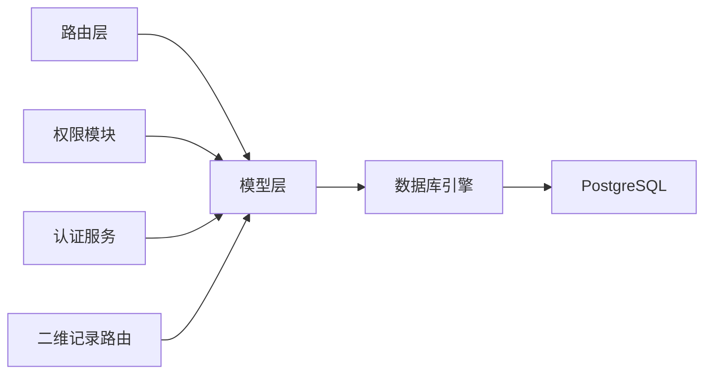

# 数据库设计与模型

<cite>
**本文引用的文件**
- [backend/app/database.py](file://backend/app/database.py)
- [backend/app/models.py](file://backend/app/models.py)
- [backend/app/main.py](file://backend/app/main.py)
- [backend/app/config.py](file://backend/app/config.py)
- [backend/app/schemas.py](file://backend/app/schemas.py)
- [backend/app/permissions.py](file://backend/app/permissions.py)
- [backend/app/services/auth.py](file://backend/app/services/auth.py)
- [backend/app/routers/image_records.py](file://backend/app/routers/image_records.py)
- [docker-compose.yml](file://docker-compose.yml)
- [backend/tests/conftest.py](file://backend/tests/conftest.py)
</cite>

## 目录
1. [简介](#简介)
2. [项目结构](#项目结构)
3. [核心组件](#核心组件)
4. [架构总览](#架构总览)
5. [详细组件分析](#详细组件分析)
6. [依赖分析](#依赖分析)
7. [性能考量](#性能考量)
8. [故障排查指南](#故障排查指南)
9. [结论](#结论)
10. [附录](#附录)

## 简介
本文件面向MDAMS原型项目的数据库设计与模型，系统梳理数据库架构、表结构、字段与约束、实体关系、索引与性能策略、数据访问模式、安全与审计、迁移与版本管理，以及ER图与SQL示例路径。目标是帮助开发者与运维人员快速理解并高效维护数据库层。

## 项目结构
数据库层由以下关键模块构成：
- 配置与连接：通过环境变量加载数据库URL，初始化引擎与会话工厂，提供依赖注入的数据库会话。
- ORM模型：基于SQLAlchemy声明式基类定义实体与关系，覆盖用户、角色、会话、二维资产与记录、三维资产与集合对象、应用与条目等。
- 应用启动：创建表结构，兼容SQLite差异，初始化认证数据。
- 权限与安全：基于角色的权限矩阵与可见性范围控制，结合会话令牌进行访问控制。
- 审计与日志：在元数据中追加审计轨迹，记录关键动作与参与者。
- 部署与测试：Compose编排PostgreSQL，测试夹具确保测试数据库可用并自动建表。

**图表来源**
- [backend/app/config.py:42](file://backend/app/config.py#L42)
- [backend/app/database.py:6-9](file://backend/app/database.py#L6-L9)
- [backend/app/main.py:58-60](file://backend/app/main.py#L58-L60)
- [docker-compose.yml:84-102](file://docker-compose.yml#L84-L102)

**章节来源**
- [backend/app/config.py:42](file://backend/app/config.py#L42)
- [backend/app/database.py:6-9](file://backend/app/database.py#L6-L9)
- [backend/app/main.py:58-60](file://backend/app/main.py#L58-L60)
- [docker-compose.yml:84-102](file://docker-compose.yml#L84-L102)

## 核心组件
- 数据库引擎与会话
  - 引擎从环境变量读取数据库URL，会话工厂配置非自动提交与刷新，提供依赖注入函数。
  - 参考路径：[backend/app/database.py:6-9](file://backend/app/database.py#L6-L9)
- ORM模型
  - 定义资产、用户、角色、会话、二维采集单据与记录、三维资产与集合对象、应用与条目等实体及关系。
  - 参考路径：[backend/app/models.py:6](file://backend/app/models.py#L6)
- 应用启动与建表
  - 启动时创建所有表，兼容SQLite列差异并添加唯一/普通索引。
  - 参考路径：[backend/app/main.py:58-60](file://backend/app/main.py#L58-L60)、[backend/app/main.py:21-56](file://backend/app/main.py#L21-L56)
- 权限与可见性
  - 角色-权限矩阵、会话令牌校验、可见性范围判定（公开/馆藏范围）。
  - 参考路径：[backend/app/permissions.py:17-94](file://backend/app/permissions.py#L17-L94)、[backend/app/permissions.py:239-254](file://backend/app/permissions.py#L239-L254)
- 审计与日志
  - 在二维记录元数据中追加审计轨迹，记录动作、参与者、时间与备注。
  - 参考路径：[backend/app/routers/image_records.py:154-178](file://backend/app/routers/image_records.py#L154-L178)
- 部署与测试
  - Compose编排PostgreSQL，测试夹具自动建表与断言数据库可用。
  - 参考路径：[docker-compose.yml:84-102](file://docker-compose.yml#L84-L102)、[backend/tests/conftest.py:85-111](file://backend/tests/conftest.py#L85-L111)

**章节来源**
- [backend/app/database.py:6-9](file://backend/app/database.py#L6-L9)
- [backend/app/models.py:6](file://backend/app/models.py#L6)
- [backend/app/main.py:21-56](file://backend/app/main.py#L21-L56)
- [backend/app/permissions.py:17-94](file://backend/app/permissions.py#L17-L94)
- [backend/app/routers/image_records.py:154-178](file://backend/app/routers/image_records.py#L154-L178)
- [docker-compose.yml:84-102](file://docker-compose.yml#L84-L102)
- [backend/tests/conftest.py:85-111](file://backend/tests/conftest.py#L85-L111)

## 架构总览
数据库层采用“配置驱动+SQLAlchemy ORM”的架构，通过依赖注入贯穿应用层，保证一致性与可测试性。PostgreSQL作为生产数据库，支持连接池与事务管理；测试环境通过独立数据库与自动建表保障隔离性。

**图表来源**
- [backend/app/main.py:64-86](file://backend/app/main.py#L64-L86)
- [backend/app/models.py:6](file://backend/app/models.py#L6)
- [docker-compose.yml:84-102](file://docker-compose.yml#L84-L102)

## 详细组件分析

### 实体关系设计（ER）
下图展示核心实体与关系，涵盖主键、外键、一对一/一对多/多对多、引用完整性与索引策略。

**图表来源**
- [backend/app/models.py:6](file://backend/app/models.py#L6)
- [backend/app/models.py:28](file://backend/app/models.py#L28)
- [backend/app/models.py:72](file://backend/app/models.py#L72)
- [backend/app/models.py:89](file://backend/app/models.py#L89)
- [backend/app/models.py:101](file://backend/app/models.py#L101)
- [backend/app/models.py:113](file://backend/app/models.py#L113)
- [backend/app/models.py:144](file://backend/app/models.py#L144)
- [backend/app/models.py:176](file://backend/app/models.py#L176)
- [backend/app/models.py:200](file://backend/app/models.py#L200)
- [backend/app/models.py:215](file://backend/app/models.py#L215)
- [backend/app/models.py:257](file://backend/app/models.py#L257)
- [backend/app/models.py:276](file://backend/app/models.py#L276)
- [backend/app/models.py:292](file://backend/app/models.py#L292)

**章节来源**
- [backend/app/models.py:6](file://backend/app/models.py#L6)

### 字段定义与约束
- 主键与唯一性
  - 所有实体主键均为自增整数；多处字段具有唯一性约束（用户名、会话令牌、二维/三维编号、记录编号等）。
  - 参考路径：[backend/app/models.py:9](file://backend/app/models.py#L9)、[backend/app/models.py:32](file://backend/app/models.py#L32)、[backend/app/models.py:106](file://backend/app/models.py#L106)、[backend/app/models.py:117](file://backend/app/models.py#L117)、[backend/app/models.py:150](file://backend/app/models.py#L150)、[backend/app/models.py:179](file://backend/app/models.py#L179)、[backend/app/models.py:219](file://backend/app/models.py#L219)、[backend/app/models.py:261](file://backend/app/models.py#L261)、[backend/app/models.py:296](file://backend/app/models.py#L296)
- 外键与引用完整性
  - 多处外键约束定义了严格的引用完整性，部分采用级联或限制策略（如应用条目对资产采用RESTRICT）。
  - 参考路径：[backend/app/models.py:16](file://backend/app/models.py#L16)、[backend/app/models.py:148](file://backend/app/models.py#L148)、[backend/app/models.py:204](file://backend/app/models.py#L204)、[backend/app/models.py:219](file://backend/app/models.py#L219)、[backend/app/models.py:260](file://backend/app/models.py#L260)、[backend/app/models.py:295](file://backend/app/models.py#L295)
- 索引与查询优化
  - 多处字段建立普通/唯一索引，加速过滤与去重；二维资产与记录存在唯一索引约束以保证业务唯一性。
  - 参考路径：[backend/app/models.py:10](file://backend/app/models.py#L10)、[backend/app/models.py:14](file://backend/app/models.py#L14)、[backend/app/models.py:119](file://backend/app/models.py#L119)、[backend/app/models.py:120](file://backend/app/models.py#L120)、[backend/app/models.py:155](file://backend/app/models.py#L155)、[backend/app/models.py:156](file://backend/app/models.py#L156)、[backend/app/models.py:220](file://backend/app/models.py#L220)、[backend/app/models.py:262](file://backend/app/models.py#L262)、[backend/app/models.py:298](file://backend/app/models.py#L298)、[backend/app/main.py:47-56](file://backend/app/main.py#L47-L56)
- 时间戳与默认值
  - 使用带时区的时间戳，默认值通过服务器函数设置；更新时自动写入更新时间。
  - 参考路径：[backend/app/models.py:18](file://backend/app/models.py#L18)、[backend/app/models.py:132](file://backend/app/models.py#L132)、[backend/app/models.py:162](file://backend/app/models.py#L162)、[backend/app/models.py:271](file://backend/app/models.py#L271)、[backend/app/models.py:304](file://backend/app/models.py#L304)

**章节来源**
- [backend/app/models.py:6](file://backend/app/models.py#L6)
- [backend/app/main.py:47-56](file://backend/app/main.py#L47-L56)

### 数据访问模式
- ORM映射与查询
  - 使用relationship定义实体间关系，支持级联删除与孤儿对象清理；查询通过SessionLocal获取会话，配合依赖注入。
  - 参考路径：[backend/app/models.py:24](file://backend/app/models.py#L24)、[backend/app/models.py:40](file://backend/app/models.py#L40)、[backend/app/database.py:11-16](file://backend/app/database.py#L11-L16)
- 事务管理与连接池
  - 会话工厂未启用自动提交/刷新，适合手动事务控制；生产环境由容器编排与数据库服务提供连接池。
  - 参考路径：[backend/app/database.py:7](file://backend/app/database.py#L7)、[docker-compose.yml:84-102](file://docker-compose.yml#L84-L102)
- 查询构建与DTO
  - Pydantic模型用于请求/响应序列化，避免直接暴露ORM对象；路由层负责组装复杂查询与聚合。
  - 参考路径：[backend/app/schemas.py:7](file://backend/app/schemas.py#L7)、[backend/app/schemas.py:121](file://backend/app/schemas.py#L121)

**章节来源**
- [backend/app/models.py:24](file://backend/app/models.py#L24)
- [backend/app/database.py:11-16](file://backend/app/database.py#L11-L16)
- [backend/app/schemas.py:7](file://backend/app/schemas.py#L7)

### 数据安全与访问控制
- 角色与权限
  - 基于角色的权限矩阵覆盖二维/三维资源管理、申请审核、平台访问等；系统管理员拥有最高权限。
  - 参考路径：[backend/app/permissions.py:17-94](file://backend/app/permissions.py#L17-L94)
- 会话与令牌
  - 会话令牌唯一且带过期时间；路由层支持多种认证入口（Bearer、Cookie、Header）。
  - 参考路径：[backend/app/models.py:106](file://backend/app/models.py#L106)、[backend/app/permissions.py:179-204](file://backend/app/permissions.py#L179-L204)
- 可见性范围
  - 资源可见性分为公开与仅馆藏责任人可见；馆藏责任人通过collection_scope进行范围限定。
  - 参考路径：[backend/app/models.py:14](file://backend/app/models.py#L14)、[backend/app/permissions.py:239-254](file://backend/app/permissions.py#L239-L254)
- 审计日志
  - 二维记录在元数据中追加审计轨迹，记录动作、参与者、时间与备注，便于回溯。
  - 参考路径：[backend/app/routers/image_records.py:154-178](file://backend/app/routers/image_records.py#L154-L178)

**章节来源**
- [backend/app/permissions.py:17-94](file://backend/app/permissions.py#L17-L94)
- [backend/app/models.py:14](file://backend/app/models.py#L14)
- [backend/app/routers/image_records.py:154-178](file://backend/app/routers/image_records.py#L154-L178)

### 数据模型演进与设计决策
- 范式化与反范式化
  - 采用关系型范式设计，通过外键与关系保持数据一致性；在元数据字段中存储JSON，兼顾灵活性与查询成本平衡。
  - 参考路径：[backend/app/models.py:17](file://backend/app/models.py#L17)、[backend/app/models.py:128](file://backend/app/models.py#L128)、[backend/app/models.py:225](file://backend/app/models.py#L225)
- 性能权衡
  - 通过索引提升常见查询性能；对高频过滤字段建立索引；在二维资产与记录上建立唯一索引避免重复绑定。
  - 参考路径：[backend/app/models.py:10](file://backend/app/models.py#L10)、[backend/app/models.py:14](file://backend/app/models.py#L14)、[backend/app/main.py:47-56](file://backend/app/main.py#L47-L56)
- 扩展性考虑
  - 三维资产支持多文件角色与版本化，便于长期保存与多形态导出；生产记录保留阶段事件，支撑审计与溯源。
  - 参考路径：[backend/app/models.py:242](file://backend/app/models.py#L242)、[backend/app/models.py:243](file://backend/app/models.py#L243)、[backend/app/models.py:292](file://backend/app/models.py#L292)

**章节来源**
- [backend/app/models.py:17](file://backend/app/models.py#L17)
- [backend/app/main.py:47-56](file://backend/app/main.py#L47-L56)

### 数据库迁移与版本管理
- 当前状态
  - 启动时自动创建表，兼容SQLite列差异；测试夹具在每次运行前重建表结构。
  - 参考路径：[backend/app/main.py:58-60](file://backend/app/main.py#L58-L60)、[backend/tests/conftest.py:103-104](file://backend/tests/conftest.py#L103-L104)
- 建议方案
  - 引入迁移工具（如Alembic），建立迁移链以替代启动式建表，确保生产环境可追踪变更。
  - 参考路径：[docs/README.md:63-76](file://docs/README.md#L63-L76)

**章节来源**
- [backend/app/main.py:58-60](file://backend/app/main.py#L58-L60)
- [backend/tests/conftest.py:103-104](file://backend/tests/conftest.py#L103-L104)

## 依赖分析
- 组件耦合
  - 路由层依赖数据库会话与模型；权限模块依赖用户与角色模型；审计模块依赖二维记录模型。
- 外部依赖
  - PostgreSQL提供关系型存储；Redis用于缓存（在配置中定义）；CORS中间件支持跨域。
- 循环依赖
  - 模型间通过外键与relationship定义关系，未发现循环导入；权限与认证服务通过会话令牌解耦。

**图表来源**
- [backend/app/models.py:6](file://backend/app/models.py#L6)
- [backend/app/permissions.py:9-11](file://backend/app/permissions.py#L9-L11)
- [backend/app/services/auth.py:7](file://backend/app/services/auth.py#L7)
- [backend/app/routers/image_records.py:154](file://backend/app/routers/image_records.py#L154)

**章节来源**
- [backend/app/models.py:6](file://backend/app/models.py#L6)
- [backend/app/permissions.py:9-11](file://backend/app/permissions.py#L9-L11)
- [backend/app/services/auth.py:7](file://backend/app/services/auth.py#L7)
- [backend/app/routers/image_records.py:154](file://backend/app/routers/image_records.py#L154)

## 性能考量
- 索引策略
  - 对常用过滤字段（如用户名、会话令牌、二维/三维编号、记录编号、可见性范围、类型、状态、时间戳）建立索引，提升查询效率。
  - 参考路径：[backend/app/models.py:32](file://backend/app/models.py#L32)、[backend/app/models.py:106](file://backend/app/models.py#L106)、[backend/app/models.py:117](file://backend/app/models.py#L117)、[backend/app/models.py:150](file://backend/app/models.py#L150)、[backend/app/models.py:14](file://backend/app/models.py#L14)、[backend/app/models.py:119](file://backend/app/models.py#L119)、[backend/app/models.py:120](file://backend/app/models.py#L120)、[backend/app/models.py:156](file://backend/app/models.py#L156)、[backend/app/models.py:220](file://backend/app/models.py#L220)、[backend/app/models.py:262](file://backend/app/models.py#L262)、[backend/app/models.py:298](file://backend/app/models.py#L298)
- 查询优化
  - 使用relationship预加载常用关联，减少N+1查询；对高频统计场景考虑物化视图或汇总表。
- 分区策略
  - 建议按时间维度（如创建时间）对大表进行分区，降低扫描范围。
- 缓存机制
  - Redis可用于热点数据缓存与会话存储，需结合失效策略与一致性保证。
  - 参考路径：[backend/app/config.py:43](file://backend/app/config.py#L43)

**章节来源**
- [backend/app/models.py:32](file://backend/app/models.py#L32)
- [backend/app/models.py:106](file://backend/app/models.py#L106)
- [backend/app/models.py:117](file://backend/app/models.py#L117)
- [backend/app/models.py:150](file://backend/app/models.py#L150)
- [backend/app/models.py:14](file://backend/app/models.py#L14)
- [backend/app/models.py:119](file://backend/app/models.py#L119)
- [backend/app/models.py:120](file://backend/app/models.py#L120)
- [backend/app/models.py:156](file://backend/app/models.py#L156)
- [backend/app/models.py:220](file://backend/app/models.py#L220)
- [backend/app/models.py:262](file://backend/app/models.py#L262)
- [backend/app/models.py:298](file://backend/app/models.py#L298)
- [backend/app/config.py:43](file://backend/app/config.py#L43)

## 故障排查指南
- 启动建表失败
  - 检查数据库URL与凭据；确认PostgreSQL服务可用；测试夹具可辅助定位问题。
  - 参考路径：[backend/app/main.py:58-60](file://backend/app/main.py#L58-L60)、[backend/tests/conftest.py:85-98](file://backend/tests/conftest.py#L85-L98)
- SQLite兼容性
  - 启动时自动补全缺失列并创建索引；生产环境建议使用PostgreSQL。
  - 参考路径：[backend/app/main.py:21-56](file://backend/app/main.py#L21-L56)
- 权限不足
  - 核对角色-权限矩阵与会话令牌有效性；检查可见性范围与馆藏责任人集合。
  - 参考路径：[backend/app/permissions.py:17-94](file://backend/app/permissions.py#L17-L94)、[backend/app/permissions.py:239-254](file://backend/app/permissions.py#L239-L254)
- 审计不可用
  - 确认二维记录元数据字段存在且可写；检查路由层审计逻辑是否触发。
  - 参考路径：[backend/app/routers/image_records.py:154-178](file://backend/app/routers/image_records.py#L154-L178)

**章节来源**
- [backend/app/main.py:21-56](file://backend/app/main.py#L21-L56)
- [backend/app/main.py:58-60](file://backend/app/main.py#L58-L60)
- [backend/tests/conftest.py:85-98](file://backend/tests/conftest.py#L85-L98)
- [backend/app/permissions.py:17-94](file://backend/app/permissions.py#L17-L94)
- [backend/app/permissions.py:239-254](file://backend/app/permissions.py#L239-L254)
- [backend/app/routers/image_records.py:154-178](file://backend/app/routers/image_records.py#L154-L178)

## 结论
MDAMS数据库层以SQLAlchemy ORM为核心，围绕用户/角色/会话、二维采集与记录、三维资产与集合对象、应用与条目构建完整实体关系，辅以索引与约束保障一致性与性能。当前通过启动式建表与测试夹具满足原型需求，建议后续引入迁移工具完善版本管理与生产可追踪性。配合权限与审计机制，整体设计在功能完备性与可维护性之间取得良好平衡。

## 附录

### SQL示例（路径）
- 创建二维资产唯一索引（资产绑定唯一性）
  - 示例路径：[backend/app/main.py:47-50](file://backend/app/main.py#L47-L50)
- 为二维记录sheet_id建立索引
  - 示例路径：[backend/app/main.py:52-56](file://backend/app/main.py#L52-L56)
- 初始化认证数据（角色与会话）
  - 示例路径：[backend/app/services/auth.py:62-73](file://backend/app/services/auth.py#L62-L73)