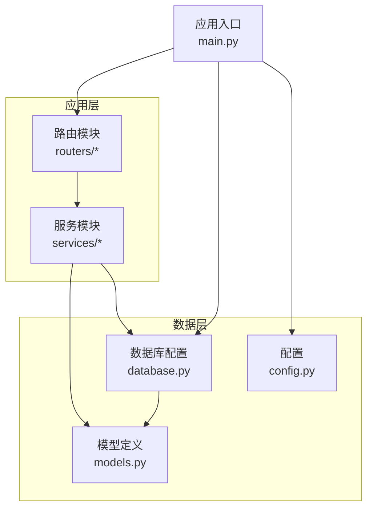
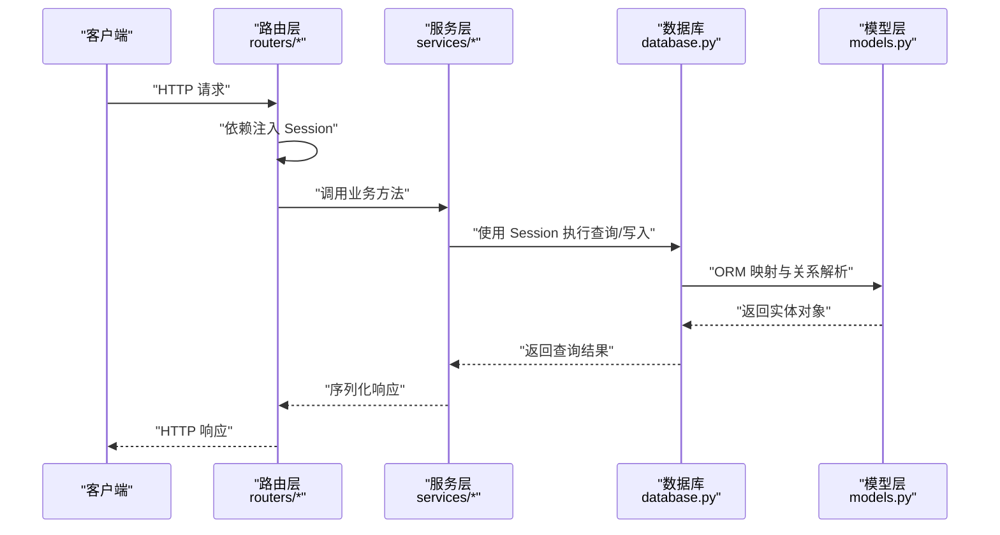
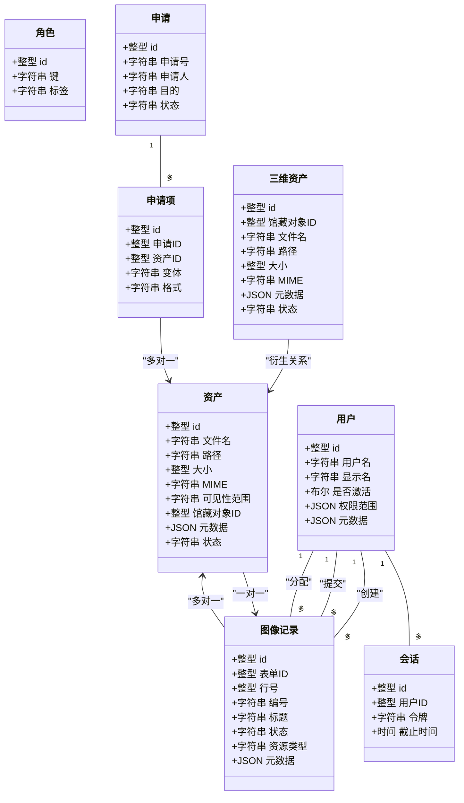
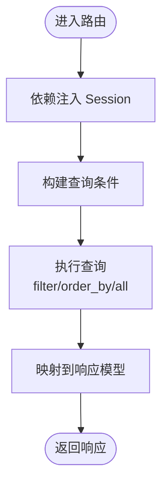
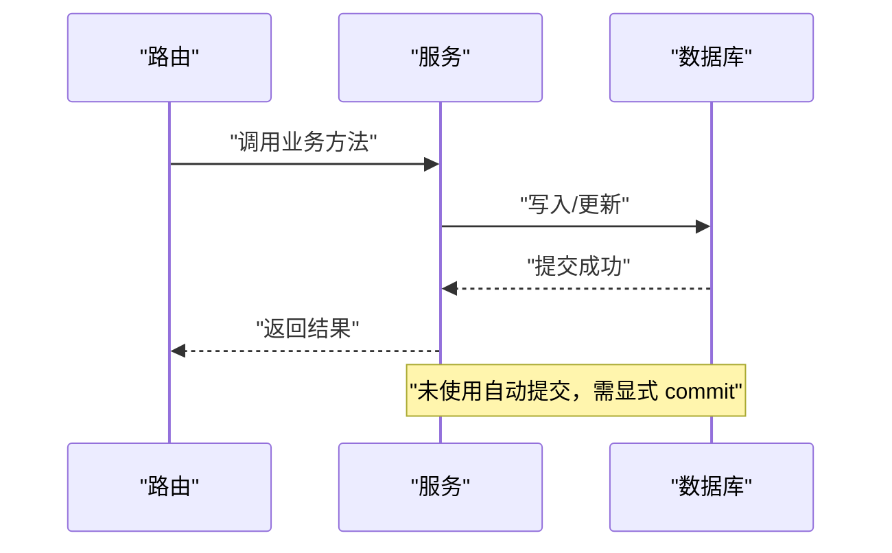
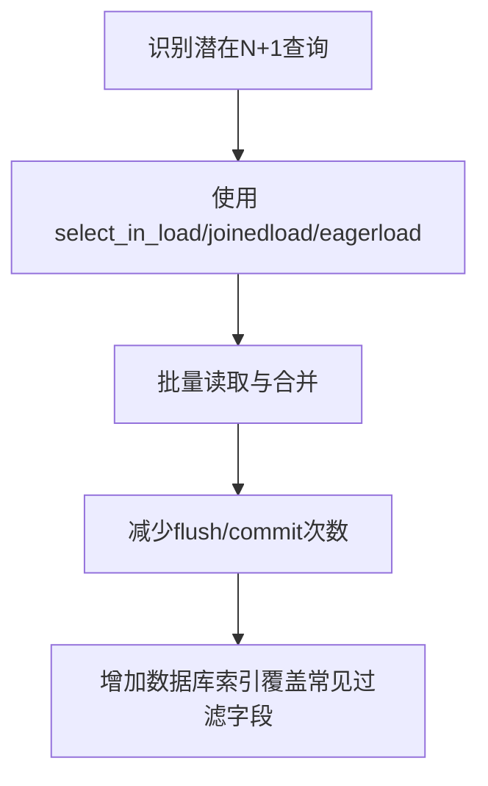
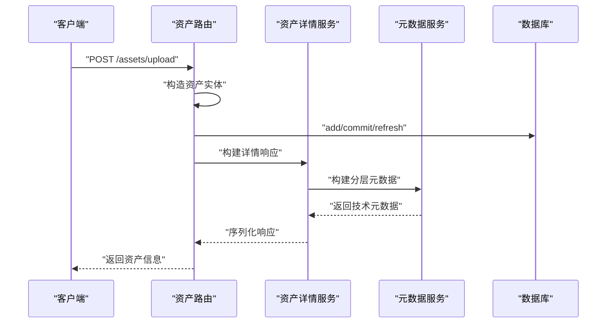
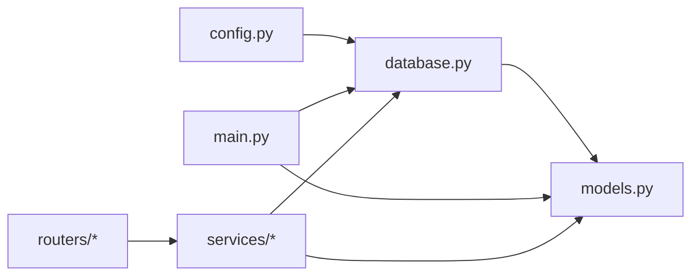

# 数据访问模式

<cite>
**本文引用的文件**
- [backend/app/database.py](file://backend/app/database.py)
- [backend/app/models.py](file://backend/app/models.py)
- [backend/app/config.py](file://backend/app/config.py)
- [backend/app/main.py](file://backend/app/main.py)
- [backend/app/routers/auth.py](file://backend/app/routers/auth.py)
- [backend/app/routers/assets.py](file://backend/app/routers/assets.py)
- [backend/app/routers/image_records.py](file://backend/app/routers/image_records.py)
- [backend/app/services/auth.py](file://backend/app/services/auth.py)
- [backend/app/services/asset_detail.py](file://backend/app/services/asset_detail.py)
- [backend/app/services/metadata_layers.py](file://backend/app/services/metadata_layers.py)
</cite>

## 目录
1. [引言](#引言)
2. [项目结构](#项目结构)
3. [核心组件](#核心组件)
4. [架构总览](#架构总览)
5. [详细组件分析](#详细组件分析)
6. [依赖分析](#依赖分析)
7. [性能考虑](#性能考虑)
8. [故障排查指南](#故障排查指南)
9. [结论](#结论)
10. [附录](#附录)

## 引言
本文件面向MDAMS原型项目的后端数据访问层，系统性梳理ORM映射配置、查询构建与使用、数据访问层设计模式（Repository与Unit of Work）、查询优化策略（批量、延迟与预加载）、事务管理（自动提交、手动事务、嵌套事务）、连接池与并发控制、以及常见问题与性能优化建议。文档以实际源码为依据，配合可视化图示帮助读者快速理解与落地实践。

## 项目结构
后端采用FastAPI + SQLAlchemy的典型分层组织：路由层负责HTTP接口与依赖注入；服务层封装业务逻辑与数据访问；模型层定义ORM实体与关系；数据库层集中管理引擎、会话与基础模型基类；配置层统一环境变量与默认值；入口文件负责应用初始化与表结构创建。

图表来源
- [backend/app/main.py:58-62](file://backend/app/main.py#L58-L62)
- [backend/app/database.py:1-17](file://backend/app/database.py#L1-L17)
- [backend/app/models.py:1-307](file://backend/app/models.py#L1-L307)

章节来源
- [backend/app/main.py:58-62](file://backend/app/main.py#L58-L62)
- [backend/app/database.py:1-17](file://backend/app/database.py#L1-L17)
- [backend/app/config.py:42-46](file://backend/app/config.py#L42-L46)

## 核心组件
- 数据库引擎与会话
  - 使用SQLAlchemy创建引擎与会话工厂，禁用自动提交与自动刷新，通过依赖注入提供短生命周期会话。
  - 提供get_db生成器，确保每次请求结束时关闭会话，避免连接泄漏。
- ORM模型与关系映射
  - 定义了资产、用户、角色、会话、图像记录、申请、三维资产等核心实体，建立一对多、一对一、多对多关系，并通过外键约束与级联策略保证数据一致性。
- 查询构建与使用
  - 路由层通过依赖注入获取Session，直接使用ORM查询构建器进行过滤、排序与聚合。
- 事务管理
  - 默认未开启自动提交，需要显式commit或回滚；部分服务中存在多次flush与commit以确保状态一致。
- 连接池与并发
  - 未显式配置连接池参数，默认使用SQLAlchemy默认行为；当前实现未体现显式的连接池参数化。

章节来源
- [backend/app/database.py:1-17](file://backend/app/database.py#L1-L17)
- [backend/app/models.py:6-25](file://backend/app/models.py#L6-L25)
- [backend/app/models.py:28-70](file://backend/app/models.py#L28-L70)
- [backend/app/routers/auth.py:30-50](file://backend/app/routers/auth.py#L30-L50)
- [backend/app/services/auth.py:62-99](file://backend/app/services/auth.py#L62-L99)

## 架构总览
下图展示从HTTP请求到数据库访问的关键交互路径，以及与模型层的关系映射。

图表来源
- [backend/app/routers/assets.py:54-133](file://backend/app/routers/assets.py#L54-L133)
- [backend/app/routers/image_records.py:509-560](file://backend/app/routers/image_records.py#L509-L560)
- [backend/app/services/asset_detail.py:189-384](file://backend/app/services/asset_detail.py#L189-L384)
- [backend/app/database.py:11-16](file://backend/app/database.py#L11-L16)
- [backend/app/models.py:6-25](file://backend/app/models.py#L6-L25)

## 详细组件分析

### ORM模型与关系映射
- 实体与字段
  - 资产、用户、角色、会话、图像记录、申请、三维资产等实体均继承自Base，具备主键、索引与常用字段。
- 关系映射
  - 一对多：用户与角色、会话、创建/提交/分配的图像记录；图像记录与资产、会话与用户等。
  - 一对一：资产与图像记录（唯一外键）。
  - 外键约束与级联：如删除用户时级联删除会话与角色关联；删除图像记录时级联删除其资产绑定。
- 元数据存储
  - JSON字段用于存储结构化元数据，便于扩展与跨子系统共享。

图表来源
- [backend/app/models.py:6-25](file://backend/app/models.py#L6-L25)
- [backend/app/models.py:28-70](file://backend/app/models.py#L28-L70)
- [backend/app/models.py:144-174](file://backend/app/models.py#L144-L174)
- [backend/app/models.py:176-213](file://backend/app/models.py#L176-L213)
- [backend/app/models.py:215-254](file://backend/app/models.py#L215-L254)

章节来源
- [backend/app/models.py:6-25](file://backend/app/models.py#L6-L25)
- [backend/app/models.py:28-70](file://backend/app/models.py#L28-L70)
- [backend/app/models.py:144-174](file://backend/app/models.py#L144-L174)
- [backend/app/models.py:176-213](file://backend/app/models.py#L176-L213)
- [backend/app/models.py:215-254](file://backend/app/models.py#L215-L254)

### 查询构建与使用
- 路由层依赖注入
  - 通过依赖函数get_db提供Session，确保每个请求拥有独立会话，避免跨请求污染。
- 查询模式
  - 路由中直接使用ORM查询构建器进行过滤、排序与列表截取；服务层封装复杂查询与元数据处理。
- 元数据查询
  - 服务层通过元数据工具函数解析与构建分层元数据，支持多字段查找与合并。

图表来源
- [backend/app/routers/assets.py:32-51](file://backend/app/routers/assets.py#L32-L51)
- [backend/app/routers/assets.py:209-219](file://backend/app/routers/assets.py#L209-L219)
- [backend/app/routers/auth.py:30-50](file://backend/app/routers/auth.py#L30-L50)
- [backend/app/services/metadata_layers.py:412-540](file://backend/app/services/metadata_layers.py#L412-L540)

章节来源
- [backend/app/routers/assets.py:32-51](file://backend/app/routers/assets.py#L32-L51)
- [backend/app/routers/assets.py:209-219](file://backend/app/routers/assets.py#L209-L219)
- [backend/app/routers/auth.py:30-50](file://backend/app/routers/auth.py#L30-L50)
- [backend/app/services/metadata_layers.py:412-540](file://backend/app/services/metadata_layers.py#L412-L540)

### 事务管理策略
- 默认行为
  - 会话工厂未启用autocommit，需显式commit或回滚；路由与服务中普遍采用提交与刷新以确保状态一致。
- 事务边界
  - 在认证与种子数据初始化中，服务层执行多步写入后统一commit，保证原子性。
- 嵌套事务
  - 代码中未出现显式嵌套事务；若需嵌套，应在上层事务内使用savepoint/rollback-to-savepoint策略。

图表来源
- [backend/app/services/auth.py:62-99](file://backend/app/services/auth.py#L62-L99)
- [backend/app/services/auth.py:102-112](file://backend/app/services/auth.py#L102-L112)
- [backend/app/database.py:6-7](file://backend/app/database.py#L6-L7)

章节来源
- [backend/app/services/auth.py:62-99](file://backend/app/services/auth.py#L62-L99)
- [backend/app/services/auth.py:102-112](file://backend/app/services/auth.py#L102-L112)
- [backend/app/database.py:6-7](file://backend/app/database.py#L6-L7)

### 连接池配置与并发控制
- 连接池
  - 未显式配置连接池参数；默认行为可能不满足生产高并发场景。
- 并发访问
  - 依赖注入提供短生命周期会话，避免长事务与连接占用；路由层按请求创建会话，适合高并发。
- 建议
  - 生产环境建议显式配置pool_size、max_overflow、pool_recycle等参数，结合连接泄漏检测与超时设置。

章节来源
- [backend/app/database.py:6-7](file://backend/app/database.py#L6-L7)
- [backend/app/main.py:58-62](file://backend/app/main.py#L58-L62)

### 数据访问层设计模式
- Repository模式
  - 代码中未抽象通用仓储接口；路由与服务直接使用ORM查询构建器，属于“直连模式”。
- Unit of Work模式
  - 通过依赖注入的Session承担UnitOfWork职责，负责事务边界与持久化上下文。
- 改进建议
  - 抽象仓储接口与泛型仓储实现，统一CRUD与查询方法，提升可测试性与可维护性。

章节来源
- [backend/app/routers/assets.py:54-133](file://backend/app/routers/assets.py#L54-L133)
- [backend/app/routers/image_records.py:509-560](file://backend/app/routers/image_records.py#L509-L560)
- [backend/app/database.py:11-16](file://backend/app/database.py#L11-L16)

### 查询优化技术
- 延迟加载与预加载
  - 模型中已定义关系，但路由与服务层未显式使用joinedload/eagerload等策略；默认延迟加载可能导致N+1查询。
- 批量操作
  - 服务层存在多次flush/commit，建议在批量写入时减少往返次数，合并事务。
- 索引与过滤
  - 模型字段已添加索引（如filename、record_no、visibility_scope等），路由层应充分利用过滤条件与排序字段。

图表来源
- [backend/app/models.py:10-19](file://backend/app/models.py#L10-L19)
- [backend/app/models.py:147-163](file://backend/app/models.py#L147-L163)
- [backend/app/routers/assets.py:209-219](file://backend/app/routers/assets.py#L209-L219)

章节来源
- [backend/app/models.py:10-19](file://backend/app/models.py#L10-L19)
- [backend/app/models.py:147-163](file://backend/app/models.py#L147-L163)
- [backend/app/routers/assets.py:209-219](file://backend/app/routers/assets.py#L209-L219)

### 典型数据访问流程示例
- 资产上传与状态更新
  - 路由接收文件与表单，构造资产实体，写入数据库并触发异步派生任务。
  - 服务层根据元数据构建分层信息，决定就绪或待处理状态。
- 图像记录与资产绑定
  - 服务层校验唯一性与状态，更新记录与资产绑定关系，记录审计轨迹。

图表来源
- [backend/app/routers/assets.py:54-133](file://backend/app/routers/assets.py#L54-L133)
- [backend/app/services/asset_detail.py:189-384](file://backend/app/services/asset_detail.py#L189-L384)
- [backend/app/services/metadata_layers.py:412-540](file://backend/app/services/metadata_layers.py#L412-L540)

章节来源
- [backend/app/routers/assets.py:54-133](file://backend/app/routers/assets.py#L54-L133)
- [backend/app/services/asset_detail.py:189-384](file://backend/app/services/asset_detail.py#L189-L384)
- [backend/app/services/metadata_layers.py:412-540](file://backend/app/services/metadata_layers.py#L412-L540)

## 依赖分析
- 路由依赖服务，服务依赖模型与数据库会话；入口文件负责初始化表结构与种子数据。
- 配置层提供数据库URL等环境变量，贯穿应用启动与运行。

图表来源
- [backend/app/config.py:42-46](file://backend/app/config.py#L42-L46)
- [backend/app/database.py:1-17](file://backend/app/database.py#L1-L17)
- [backend/app/models.py:1-307](file://backend/app/models.py#L1-L307)
- [backend/app/main.py:58-62](file://backend/app/main.py#L58-L62)

章节来源
- [backend/app/config.py:42-46](file://backend/app/config.py#L42-L46)
- [backend/app/database.py:1-17](file://backend/app/database.py#L1-L17)
- [backend/app/models.py:1-307](file://backend/app/models.py#L1-L307)
- [backend/app/main.py:58-62](file://backend/app/main.py#L58-L62)

## 性能考虑
- 连接池参数化：建议在生产环境显式配置连接池大小与回收策略，降低连接获取开销。
- 查询优化：优先使用预加载策略避免N+1；对高频过滤字段建立索引；避免一次性加载大列表，采用分页与投影。
- 事务批处理：合并多次写入为单个事务，减少flush/commit次数。
- 缓存与去重：对只读查询引入Redis缓存，对重复计算结果进行缓存。
- 异步任务：派生任务与耗时处理放入Celery队列，避免阻塞请求线程。

## 故障排查指南
- 连接泄漏
  - 确认每个请求均通过依赖注入获取Session并在finally中关闭；避免在长生命周期对象中持有Session。
- 事务未提交
  - 检查服务层是否遗漏commit；对幂等写入场景使用try/except包裹并回滚异常分支。
- N+1查询
  - 使用joinedload/eagerload预加载必要关系；对列表页仅投影必要字段。
- 字段缺失或类型错误
  - 检查模型索引与外键定义；路由层对输入进行标准化与类型转换。
- 种子数据不一致
  - 初始化阶段先清理旧数据再重建，确保唯一性约束不冲突。

章节来源
- [backend/app/database.py:11-16](file://backend/app/database.py#L11-L16)
- [backend/app/services/auth.py:62-99](file://backend/app/services/auth.py#L62-L99)
- [backend/app/routers/assets.py:32-51](file://backend/app/routers/assets.py#L32-L51)

## 结论
MDAMS原型项目采用直连ORM的轻量数据访问模式，路由层通过依赖注入获取Session，服务层直接使用ORM查询构建器完成业务逻辑。模型层提供了完善的实体与关系映射，支撑资产、用户、图像记录等核心业务。当前实现简洁清晰，适合原型验证；在生产环境中建议引入仓储抽象、连接池参数化、查询优化与缓存策略，以提升稳定性与性能。

## 附录
- 关键实现路径参考
  - 数据库会话与依赖：[backend/app/database.py:11-16](file://backend/app/database.py#L11-L16)
  - 模型定义与关系：[backend/app/models.py:6-25](file://backend/app/models.py#L6-L25)
  - 路由查询示例：[backend/app/routers/assets.py:209-219](file://backend/app/routers/assets.py#L209-L219)
  - 服务层事务提交：[backend/app/services/auth.py:62-99](file://backend/app/services/auth.py#L62-L99)
  - 元数据分层构建：[backend/app/services/metadata_layers.py:412-540](file://backend/app/services/metadata_layers.py#L412-L540)