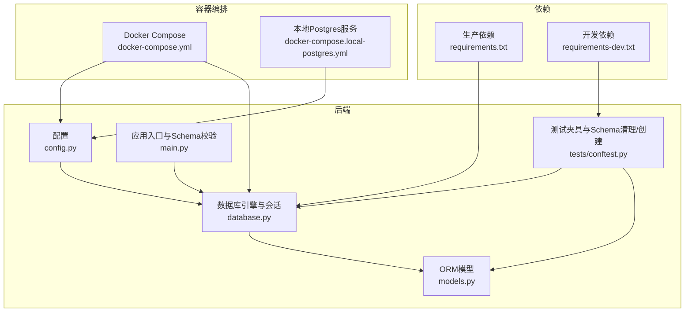
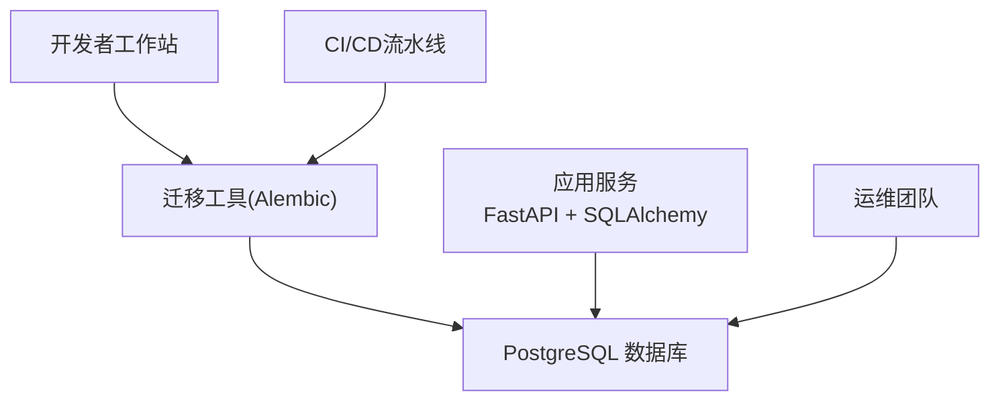
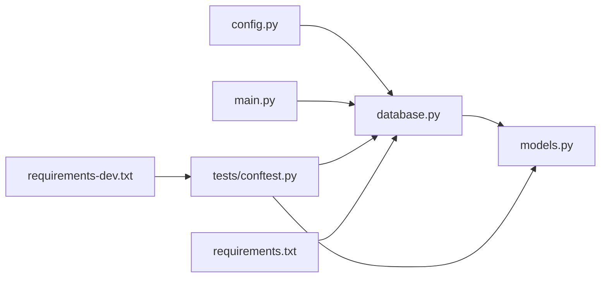

# 迁移与版本管理

<cite>
**本文引用的文件**
- [backend/app/database.py](file://backend/app/database.py)
- [backend/app/config.py](file://backend/app/config.py)
- [backend/app/models.py](file://backend/app/models.py)
- [backend/app/main.py](file://backend/app/main.py)
- [backend/tests/conftest.py](file://backend/tests/conftest.py)
- [docker-compose.yml](file://docker-compose.yml)
- [docker-compose.local-postgres.yml](file://docker-compose.local-postgres.yml)
- [backend/requirements.txt](file://backend/requirements.txt)
- [backend/requirements-dev.txt](file://backend/requirements-dev.txt)
</cite>

## 目录
1. [简介](#简介)
2. [项目结构](#项目结构)
3. [核心组件](#核心组件)
4. [架构总览](#架构总览)
5. [详细组件分析](#详细组件分析)
6. [依赖分析](#依赖分析)
7. [性能考虑](#性能考虑)
8. [故障排查指南](#故障排查指南)
9. [结论](#结论)
10. [附录](#附录)

## 简介
本文件面向MDAMS原型项目的数据库迁移与版本管理，目标是建立一套可追溯、可回滚、可重复的数据库演进体系。当前仓库未内置Alembic或其他迁移工具，但已具备基于SQLAlchemy的ORM模型与数据库连接基础设施。本文将围绕以下主题展开：
- 数据库版本控制策略：迁移脚本编写规范、版本号管理、回滚机制设计
- 迁移工具使用：如何引入并使用Alembic进行自动/手动迁移；迁移依赖关系管理
- Schema变更管理流程：开发、测试、生产三环境迁移策略
- 数据迁移注意事项：备份、迁移测试、回滚预案
- 初始化脚本与部署：种子数据导入、索引重建、统计信息更新
- 具体迁移示例、版本发布流程与问题排查

## 项目结构
本项目采用后端Python+FastAPI+SQLAlchemy+PostgreSQL的典型架构。数据库连接通过配置文件注入，ORM模型集中定义在models中，应用启动时可按需执行Schema校验与初始化。

**图表来源**
- [backend/app/config.py:42](file://backend/app/config.py#L42)
- [backend/app/database.py:1-17](file://backend/app/database.py#L1-L17)
- [backend/app/models.py:1-307](file://backend/app/models.py#L1-L307)
- [backend/app/main.py:1-40](file://backend/app/main.py#L1-L40)
- [backend/tests/conftest.py:1-111](file://backend/tests/conftest.py#L1-L111)
- [docker-compose.yml:1-131](file://docker-compose.yml#L1-L131)
- [docker-compose.local-postgres.yml:1-19](file://docker-compose.local-postgres.yml#L1-L19)
- [backend/requirements.txt:1-18](file://backend/requirements.txt#L1-L18)
- [backend/requirements-dev.txt:1-3](file://backend/requirements-dev.txt#L1-L3)

**章节来源**
- [backend/app/config.py:42](file://backend/app/config.py#L42)
- [backend/app/database.py:1-17](file://backend/app/database.py#L1-L17)
- [backend/app/models.py:1-307](file://backend/app/models.py#L1-L307)
- [backend/app/main.py:1-40](file://backend/app/main.py#L1-L40)
- [backend/tests/conftest.py:1-111](file://backend/tests/conftest.py#L1-L111)
- [docker-compose.yml:1-131](file://docker-compose.yml#L1-L131)
- [docker-compose.local-postgres.yml:1-19](file://docker-compose.local-postgres.yml#L1-L19)
- [backend/requirements.txt:1-18](file://backend/requirements.txt#L1-L18)
- [backend/requirements-dev.txt:1-3](file://backend/requirements-dev.txt#L1-L3)

## 核心组件
- 数据库连接与会话
  - 通过配置文件读取数据库URL，创建SQLAlchemy引擎与会话工厂，并提供依赖注入函数。
  - 参考路径：[backend/app/database.py:1-17](file://backend/app/database.py#L1-L17)
- ORM模型
  - 定义了资产、用户、角色、会话、图像记录、申请、三维资源等核心实体及关系。
  - 参考路径：[backend/app/models.py:1-307](file://backend/app/models.py#L1-L307)
- 应用启动与Schema校验
  - 在非SQLite环境下，应用启动时可进行Schema兼容性检查与必要修正（当前代码针对SQLite做了兼容处理，但未对PostgreSQL做自动迁移）。
  - 参考路径：[backend/app/main.py:21-40](file://backend/app/main.py#L21-L40)
- 测试夹具
  - 测试中通过drop_all/create_all快速重置Schema，便于隔离测试。
  - 参考路径：[backend/tests/conftest.py:101-111](file://backend/tests/conftest.py#L101-L111)
- 配置与容器编排
  - 通过环境变量注入数据库URL；Compose文件提供Postgres服务与卷挂载。
  - 参考路径：[backend/app/config.py:42](file://backend/app/config.py#L42)，[docker-compose.yml:84-102](file://docker-compose.yml#L84-L102)，[docker-compose.local-postgres.yml:1-19](file://docker-compose.local-postgres.yml#L1-L19)

**章节来源**
- [backend/app/database.py:1-17](file://backend/app/database.py#L1-L17)
- [backend/app/models.py:1-307](file://backend/app/models.py#L1-L307)
- [backend/app/main.py:21-40](file://backend/app/main.py#L21-L40)
- [backend/tests/conftest.py:101-111](file://backend/tests/conftest.py#L101-L111)
- [backend/app/config.py:42](file://backend/app/config.py#L42)
- [docker-compose.yml:84-102](file://docker-compose.yml#L84-L102)
- [docker-compose.local-postgres.yml:1-19](file://docker-compose.local-postgres.yml#L1-L19)

## 架构总览
下图展示了从应用到数据库的交互路径，以及迁移工具（建议引入的Alembic）在整体架构中的位置。

[此图为概念性架构示意，不对应具体源码文件，故无“图表来源”]

## 详细组件分析

### 数据库连接与会话（database.py）
- 责任：创建引擎、会话工厂、声明式基类，提供依赖注入函数
- 关键点：
  - 引擎由配置文件提供的DATABASE_URL驱动
  - 会话工厂默认关闭自动提交与自动刷新，适合事务控制
  - Base用于后续Schema创建/迁移
- 复杂度：O(1) 初始化，运行时按需创建会话
- 性能影响：连接池大小与超时可通过环境变量或额外配置扩展

**章节来源**
- [backend/app/database.py:1-17](file://backend/app/database.py#L1-L17)

### ORM模型（models.py）
- 责任：定义数据库表结构、字段类型、索引、外键约束、关系映射
- 关键点：
  - 模型均继承自Base，统一参与迁移
  - 包含多对多/一对多关系、级联删除策略
  - 字段注释与索引标注清晰，利于迁移后索引重建
- 复杂度：模型定义为静态结构，迁移时根据差异生成DDL

**章节来源**
- [backend/app/models.py:1-307](file://backend/app/models.py#L1-L307)

### 应用启动与Schema校验（main.py）
- 责任：应用启动时进行Schema兼容性检查
- 关键点：
  - 当前仅对SQLite做了列兼容性检查与补充
  - PostgreSQL未实现自动迁移逻辑，需引入迁移工具
- 建议：在启动阶段增加迁移检查与执行步骤（见“迁移工具使用”）

**章节来源**
- [backend/app/main.py:21-40](file://backend/app/main.py#L21-L40)

### 测试夹具（tests/conftest.py）
- 责任：测试前清理旧Schema，创建新Schema，确保测试隔离
- 关键点：
  - 使用drop_all/create_all快速重置
  - 支持通过环境变量指定测试数据库URL
- 复杂度：每次测试开始/结束执行一次Schema重建，成本可控

**章节来源**
- [backend/tests/conftest.py:101-111](file://backend/tests/conftest.py#L101-L111)

### 配置与容器编排（config.py, docker-compose.yml, docker-compose.local-postgres.yml）
- 责任：提供数据库连接参数与运行环境
- 关键点：
  - DATABASE_URL来自环境变量，支持不同环境覆盖
  - Compose文件提供Postgres服务与持久化卷
  - 本地Postgres镜像用于开发调试

**章节来源**
- [backend/app/config.py:42](file://backend/app/config.py#L42)
- [docker-compose.yml:84-102](file://docker-compose.yml#L84-L102)
- [docker-compose.local-postgres.yml:1-19](file://docker-compose.local-postgres.yml#L1-L19)

### 迁移工具使用（建议引入Alembic）
- 目标：建立自动/手动迁移能力，管理版本号与回滚
- 步骤概览：
  1) 安装与初始化
     - 在生产依赖中加入迁移工具（如alembic），并在项目根目录初始化
     - 参考依赖文件路径：[backend/requirements.txt:1-18](file://backend/requirements.txt#L1-L18)
  2) 自动迁移生成
     - 基于当前ORM模型生成初始迁移脚本
     - 后续每次模型变更后，先生成迁移脚本，再手动审阅
  3) 手动迁移编辑
     - 对生成的脚本进行业务语义校验、索引重建、统计信息更新等
  4) 迁移依赖关系管理
     - 保持迁移脚本顺序稳定，避免跨版本回滚导致的依赖断裂
  5) 版本号管理
     - 使用递增版本号，配合标签与分支策略，确保可追踪
- 注意事项：
  - 生产环境禁止自动迁移，必须人工审批
  - 每次迁移前进行备份与测试验证

[本节为通用实践说明，不直接分析具体源码文件，故无“章节来源”]

### 数据库Schema变更管理流程
- 开发环境
  - 本地使用本地Postgres镜像或Docker Compose服务
  - 模型变更后立即生成迁移脚本并本地验证
- 测试环境
  - 使用独立测试数据库（测试夹具已提供Schema重置能力）
  - CI中执行迁移与回归测试
- 生产环境
  - 通过运维流程审批后执行
  - 建议先在预生产环境演练，再灰度发布

[本节为通用流程说明，不直接分析具体源码文件，故无“章节来源”]

### 数据迁移注意事项
- 备份
  - 迁移前对生产库进行完整备份
- 迁移测试
  - 在测试/预生产环境执行相同迁移脚本
- 回滚预案
  - 准备回滚脚本与数据恢复方案
  - 严格记录迁移时间、版本、负责人与影响范围

[本节为通用流程说明，不直接分析具体源码文件，故无“章节来源”]

### 数据库初始化脚本与部署
- 初始化步骤
  - 创建数据库与用户（由容器编排负责）
  - 执行迁移至最新版本
  - 导入种子数据（如角色、默认用户等）
- 种子数据导入
  - 通过服务层或脚本批量插入基础数据
- 索引重建与统计信息更新
  - 大型表迁移后建议重建索引与更新统计信息，提升查询性能

[本节为通用流程说明，不直接分析具体源码文件，故无“章节来源”]

### 具体迁移示例与版本发布流程
- 示例场景
  - 新增字段：在模型中添加字段后，生成迁移脚本，审阅DDL，执行迁移
  - 删除字段：谨慎处理，先迁移数据，再删除字段
  - 约束变更：注意外键与唯一性约束的顺序
- 发布流程
  - 开发完成 → 生成迁移脚本 → 代码审查 → 测试验证 → 预生产演练 → 生产发布 → 回滚预案就绪

[本节为通用流程说明，不直接分析具体源码文件，故无“章节来源”]

## 依赖分析
- 组件耦合
  - database.py与config.py强耦合（依赖DATABASE_URL）
  - models.py与database.Base强耦合（继承关系）
  - main.py与database.py弱耦合（仅使用引擎与Base）
  - tests/conftest.py与database.Base强耦合（用于Schema重置）
- 外部依赖
  - PostgreSQL驱动（psycopg2-binary）
  - 测试框架（pytest）
- 潜在风险
  - 缺少迁移工具可能导致生产环境Schema漂移
  - 测试中drop_all/create_all与生产迁移策略存在差异

**图表来源**
- [backend/app/config.py:42](file://backend/app/config.py#L42)
- [backend/app/database.py:1-17](file://backend/app/database.py#L1-L17)
- [backend/app/models.py:1-307](file://backend/app/models.py#L1-L307)
- [backend/app/main.py:1-40](file://backend/app/main.py#L1-L40)
- [backend/tests/conftest.py:1-111](file://backend/tests/conftest.py#L1-L111)
- [backend/requirements.txt:1-18](file://backend/requirements.txt#L1-L18)
- [backend/requirements-dev.txt:1-3](file://backend/requirements-dev.txt#L1-L3)

**章节来源**
- [backend/app/config.py:42](file://backend/app/config.py#L42)
- [backend/app/database.py:1-17](file://backend/app/database.py#L1-L17)
- [backend/app/models.py:1-307](file://backend/app/models.py#L1-L307)
- [backend/app/main.py:1-40](file://backend/app/main.py#L1-L40)
- [backend/tests/conftest.py:1-111](file://backend/tests/conftest.py#L1-L111)
- [backend/requirements.txt:1-18](file://backend/requirements.txt#L1-L18)
- [backend/requirements-dev.txt:1-3](file://backend/requirements-dev.txt#L1-L3)

## 性能考虑
- 迁移期间的锁与阻塞
  - 大表DDL可能加锁，建议在低峰时段执行
- 索引与统计信息
  - 迁移后重建索引与更新统计信息，有助于查询优化
- 连接池与并发
  - 生产环境建议通过环境变量或配置调整连接池参数

[本节提供一般性指导，不直接分析具体源码文件，故无“章节来源”]

## 故障排查指南
- 迁移失败
  - 检查迁移脚本语法与业务约束
  - 确认数据库权限与连接参数正确
- 测试失败
  - 确保测试数据库可用且Schema已按测试夹具重建
  - 检查测试数据库URL解析逻辑
- 启动异常
  - 确认DATABASE_URL环境变量正确注入
  - 检查Postgres服务状态与端口映射

**章节来源**
- [backend/tests/conftest.py:21-36](file://backend/tests/conftest.py#L21-L36)
- [backend/tests/conftest.py:85-98](file://backend/tests/conftest.py#L85-L98)
- [docker-compose.yml:84-102](file://docker-compose.yml#L84-L102)

## 结论
- 当前仓库具备良好的ORM模型与数据库连接基础设施，但缺少正式的数据库迁移工具与流程
- 建议尽快引入并规范化迁移工具使用，明确版本号管理与回滚机制
- 将迁移纳入CI/CD与发布流程，确保变更可追踪、可回滚、可验证
- 在测试与生产环境中分别制定严格的迁移策略与应急预案

[本节为总结性内容，不直接分析具体源码文件，故无“章节来源”]

## 附录

### 迁移工具引入与使用（建议流程）
- 安装与初始化
  - 在生产依赖中加入迁移工具（如alembic），并在项目根目录初始化
  - 参考依赖文件路径：[backend/requirements.txt:1-18](file://backend/requirements.txt#L1-L18)
- 生成与审阅迁移脚本
  - 基于当前ORM模型生成初始迁移脚本
  - 手动审阅DDL，补充索引重建与统计信息更新
- 执行迁移
  - 开发/测试环境：自动执行迁移
  - 生产环境：人工审批后执行
- 回滚准备
  - 保留上一个版本的迁移脚本，准备回滚脚本

[本节为通用流程说明，不直接分析具体源码文件，故无“章节来源”]

### 数据库初始化与种子数据
- 初始化步骤
  - 创建数据库与用户（由容器编排负责）
  - 执行迁移至最新版本
  - 导入种子数据（如角色、默认用户等）
- 种子数据导入
  - 通过服务层或脚本批量插入基础数据
- 索引重建与统计信息更新
  - 大型表迁移后建议重建索引与更新统计信息，提升查询性能

[本节为通用流程说明，不直接分析具体源码文件，故无“章节来源”]