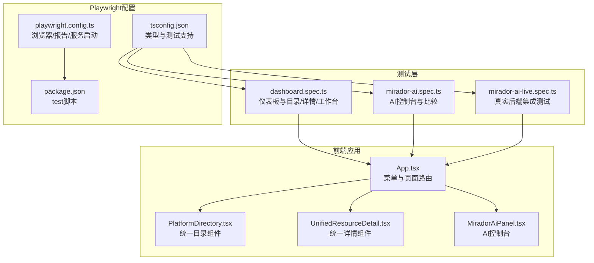
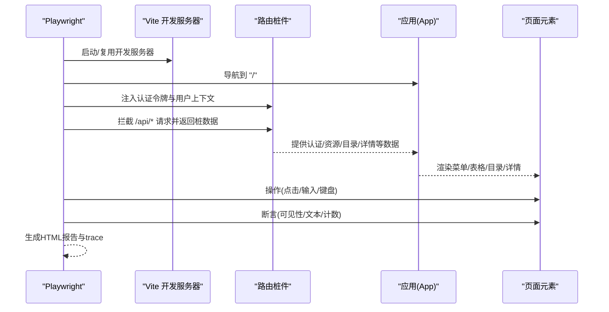
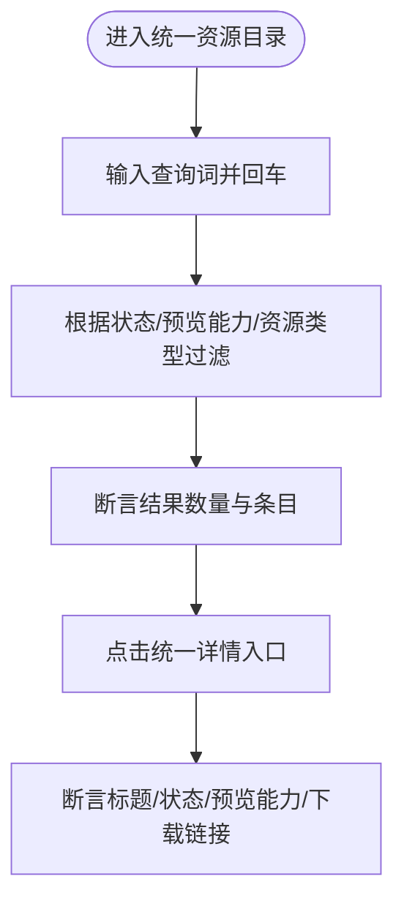
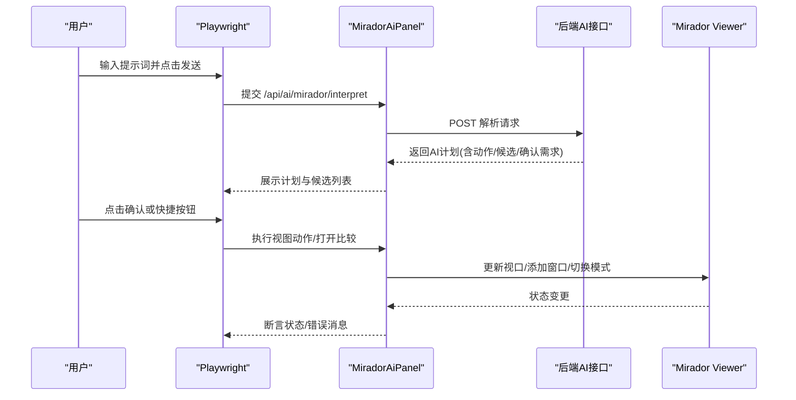
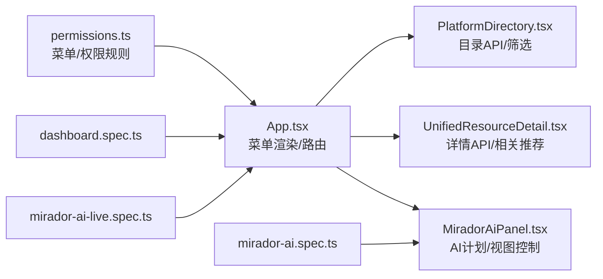

# 前端测试实践

<cite>
**本文引用的文件**
- [playwright.config.ts](file://frontend/playwright.config.ts)
- [package.json](file://frontend/package.json)
- [tsconfig.json](file://frontend/tsconfig.json)
- [main.tsx](file://frontend/src/main.tsx)
- [App.tsx](file://frontend/src/App.tsx)
- [permissions.ts](file://frontend/src/auth/permissions.ts)
- [PlatformDirectory.tsx](file://frontend/src/components/PlatformDirectory.tsx)
- [UnifiedResourceDetail.tsx](file://frontend/src/components/UnifiedResourceDetail.tsx)
- [MiradorAiPanel.tsx](file://frontend/src/MiradorAiPanel.tsx)
- [dashboard.spec.ts](file://frontend/tests/dashboard.spec.ts)
- [mirador-ai.spec.ts](file://frontend/tests/mirador-ai.spec.ts)
- [mirador-ai-live.spec.ts](file://frontend/tests/mirador-ai-live.spec.ts)
</cite>

## 目录
1. [引言](#引言)
2. [项目结构](#项目结构)
3. [核心组件](#核心组件)
4. [架构总览](#架构总览)
5. [详细组件分析](#详细组件分析)
6. [依赖分析](#依赖分析)
7. [性能考虑](#性能考虑)
8. [故障排查指南](#故障排查指南)
9. [结论](#结论)
10. [附录](#附录)

## 引言
本文件面向MDAMS原型项目的前端测试实践，围绕Playwright测试框架在本项目中的配置与使用展开，覆盖测试环境设置、浏览器配置、测试报告生成；并系统梳理前端测试策略与编写技巧，包括登录态初始化、菜单可见性、统一平台目录与统一详情、图像记录工作台、不同角色页面入口差异等重点场景；同时总结组件测试与用户交互测试方法、页面对象模式、异步处理、截图与视频录制等最佳实践，并给出仪表板、Mirador AI、AI实时功能等具体测试案例与落地建议。

## 项目结构
前端测试位于frontend/tests目录，Playwright配置位于frontend/playwright.config.ts，测试脚本通过package.json中的test命令触发。测试文件采用describe/it风格组织，结合路由桩件与本地存储注入，模拟真实用户上下文与后端接口响应，确保跨浏览器一致性与稳定性。

图表来源
- [App.tsx:100-905](file://frontend/src/App.tsx#L100-L905)
- [PlatformDirectory.tsx:1-273](file://frontend/src/components/PlatformDirectory.tsx#L1-L273)
- [UnifiedResourceDetail.tsx:1-470](file://frontend/src/components/UnifiedResourceDetail.tsx#L1-L470)
- [MiradorAiPanel.tsx:1-948](file://frontend/src/MiradorAiPanel.tsx#L1-L948)
- [dashboard.spec.ts:1-764](file://frontend/tests/dashboard.spec.ts#L1-L764)
- [mirador-ai.spec.ts:1-267](file://frontend/tests/mirador-ai.spec.ts#L1-L267)
- [mirador-ai-live.spec.ts:1-56](file://frontend/tests/mirador-ai-live.spec.ts#L1-L56)
- [playwright.config.ts:1-36](file://frontend/playwright.config.ts#L1-L36)
- [package.json:1-42](file://frontend/package.json#L1-L42)
- [tsconfig.json:1-23](file://frontend/tsconfig.json#L1-L23)

章节来源
- [playwright.config.ts:1-36](file://frontend/playwright.config.ts#L1-L36)
- [package.json:1-42](file://frontend/package.json#L1-L42)
- [tsconfig.json:1-23](file://frontend/tsconfig.json#L1-L23)

## 核心组件
- Playwright配置与运行时
  - 测试目录、并行、重试与CI行为、报告格式、trace收集、多浏览器项目、开发服务器启动与复用。
- 测试脚本与组织
  - 使用describe/it分组测试，每个测试文件聚焦特定功能域（仪表板、AI控制台、实时集成）。
- 页面对象与路由桩
  - 通过page.addInitScript注入认证令牌，page.route拦截关键API，返回预置数据，保证测试稳定与可重复。
- 断言与可视化
  - 使用data-testid属性定位元素，结合expect进行可见性、文本、计数等断言；利用trace与HTML报告辅助问题定位。

章节来源
- [playwright.config.ts:3-35](file://frontend/playwright.config.ts#L3-L35)
- [dashboard.spec.ts:1-764](file://frontend/tests/dashboard.spec.ts#L1-L764)
- [mirador-ai.spec.ts:1-267](file://frontend/tests/mirador-ai.spec.ts#L1-L267)
- [mirador-ai-live.spec.ts:1-56](file://frontend/tests/mirador-ai-live.spec.ts#L1-L56)

## 架构总览
以下序列图展示了典型测试流程：Playwright启动Vite开发服务器，加载应用，注入认证上下文，路由拦截API，渲染页面并执行用户交互与断言。

图表来源
- [playwright.config.ts:30-35](file://frontend/playwright.config.ts#L30-L35)
- [dashboard.spec.ts:291-311](file://frontend/tests/dashboard.spec.ts#L291-L311)
- [mirador-ai.spec.ts:108-155](file://frontend/tests/mirador-ai.spec.ts#L108-L155)
- [App.tsx:100-905](file://frontend/src/App.tsx#L100-L905)

## 详细组件分析

### 仪表板与角色可见性测试
- 测试目标
  - 登录态初始化：通过localStorage注入令牌，拦截/auth/*与/applications*，返回可用用户与空申请列表。
  - 资源表与统计：断言资产表格存在、统计值正确、菜单项可见。
  - 角色差异：不同角色看到的菜单与资源应符合权限规则。
  - 统一资源目录：打开统一目录，支持搜索、筛选与跳转详情。
  - 统一资源详情：打开统一详情页，断言标题、状态、预览能力、下载链接等。
  - 影像信息录入工作台：针对“影像元数据录入员”角色断言菜单与列表可见。
  - 摄影师待上传池：针对“摄影上传人员”角色断言“Assigned upload workbench”可见与条目筛选。
  - 馆藏责任人作用域：断言仅能看到自身作用域内的资源，不能看到其他所有者仅有的资源。
- 关键实现要点
  - 登录态注入与上下文拦截：bootstrapAuthenticatedState与bootstrapCommonApi。
  - 目录与详情API：/api/platform/sources、/api/platform/resources、/api/assets/*。
  - 元素定位：data-testid与Ant Design组件选择器组合。
- 流程图（搜索与筛选）

图表来源
- [dashboard.spec.ts:673-694](file://frontend/tests/dashboard.spec.ts#L673-L694)
- [PlatformDirectory.tsx:155-273](file://frontend/src/components/PlatformDirectory.tsx#L155-L273)
- [UnifiedResourceDetail.tsx:86-470](file://frontend/src/components/UnifiedResourceDetail.tsx#L86-L470)

章节来源
- [dashboard.spec.ts:291-657](file://frontend/tests/dashboard.spec.ts#L291-L657)
- [permissions.ts:84-106](file://frontend/src/auth/permissions.ts#L84-L106)
- [PlatformDirectory.tsx:1-273](file://frontend/src/components/PlatformDirectory.tsx#L1-L273)
- [UnifiedResourceDetail.tsx:1-470](file://frontend/src/components/UnifiedResourceDetail.tsx#L1-L470)

### Mirador AI控制台与比较测试
- 测试目标
  - 打开AI面板：预览按钮触发后，AI面板可见，发送按钮可用。
  - 自然语言解析：输入提示词，断言AI计划、候选图列表、确认步骤。
  - 快捷视图控制：放大/缩小/平移/重置/适配窗口，断言视口变化与工作区模式切换。
  - 比较模式：打开第二张图，进入/退出比较模式，断言窗口数量与模式标签。
- 关键实现要点
  - 令牌注入与鉴权头：withAuthHeaders自动附加Authorization。
  - 视图控制：优先通过Viewer API，其次回退到查找并点击原生按钮。
  - AI计划执行：根据requires_confirmation决定是否需要二次确认。
  - 比较窗口：通过addWindow/focusWindow/removeWindow管理多窗口。
- 顺序图（自然语言到执行）

图表来源
- [mirador-ai.spec.ts:108-237](file://frontend/tests/mirador-ai.spec.ts#L108-L237)
- [MiradorAiPanel.tsx:581-652](file://frontend/src/MiradorAiPanel.tsx#L581-L652)
- [MiradorAiPanel.tsx:318-443](file://frontend/src/MiradorAiPanel.tsx#L318-L443)
- [MiradorAiPanel.tsx:445-491](file://frontend/src/MiradorAiPanel.tsx#L445-L491)

章节来源
- [mirador-ai.spec.ts:108-237](file://frontend/tests/mirador-ai.spec.ts#L108-L237)
- [MiradorAiPanel.tsx:185-188](file://frontend/src/MiradorAiPanel.tsx#L185-L188)
- [MiradorAiPanel.tsx:291-297](file://frontend/src/MiradorAiPanel.tsx#L291-L297)
- [MiradorAiPanel.tsx:318-443](file://frontend/src/MiradorAiPanel.tsx#L318-L443)
- [MiradorAiPanel.tsx:445-491](file://frontend/src/MiradorAiPanel.tsx#L445-L491)

### 实时集成测试（LIVE_MIRADOR_AI）
- 测试目标
  - 在启用LIVE_MIRADOR_AI=1的前提下，使用真实后端登录，断言AI控制台能正确执行缩放、适配、搜索与比较。
- 关键实现要点
  - test.skip条件：通过环境变量控制是否执行。
  - 登录请求与令牌注入：使用request.post与addInitScript。
  - 多步骤断言：包含状态文本与错误计数。

章节来源
- [mirador-ai-live.spec.ts:1-56](file://frontend/tests/mirador-ai-live.spec.ts#L1-L56)

### 组件测试与用户交互测试
- 组件测试
  - 通过data-testid暴露稳定的测试选择器，避免对组件内部实现细节的耦合。
  - 对于复杂交互（如比较模式），在测试中模拟多窗口与视口状态变化。
- 用户交互测试
  - 使用page.fill、page.click、page.keyboard.press等模拟用户输入与操作。
  - 结合page.route与page.addInitScript，构建稳定的测试上下文。
- 断言验证
  - 可见性：expect(element).toBeVisible()
  - 文本：expect(element).toHaveText()/toContainText()
  - 计数：expect(element).toHaveCount()
  - 启用/禁用：expect(button).toBeEnabled()/toBeDisabled()

章节来源
- [App.tsx:484-500](file://frontend/src/App.tsx#L484-L500)
- [App.tsx:528-550](file://frontend/src/App.tsx#L528-L550)
- [PlatformDirectory.tsx:121-148](file://frontend/src/components/PlatformDirectory.tsx#L121-L148)
- [MiradorAiPanel.tsx:659-761](file://frontend/src/MiradorAiPanel.tsx#L659-L761)

### Playwright编写技巧
- 测试用例组织
  - 使用describe分组：权限/角色/目录/详情/工作台/AI控制台等。
- 页面对象模式
  - 将bootstrap函数抽象为页面对象的初始化步骤，减少重复代码。
- 异步操作处理
  - 使用waitFor与didViewportChange等工具函数，确保UI状态稳定后再断言。
- 截图与视频录制
  - 配置trace: 'on-first-retry'，在重试时生成trace，便于定位问题。
- 报告与并行
  - HTML报告便于团队共享；fullyParallel提升执行效率；CI下retries与workers策略保障稳定性。

章节来源
- [playwright.config.ts:5-13](file://frontend/playwright.config.ts#L5-L13)
- [playwright.config.ts:15-28](file://frontend/playwright.config.ts#L15-L28)
- [dashboard.spec.ts:291-311](file://frontend/tests/dashboard.spec.ts#L291-L311)

## 依赖分析
- 应用与测试的依赖关系
  - App.tsx负责菜单渲染与页面切换，依赖权限模块permissions.ts决定可见菜单。
  - PlatformDirectory与UnifiedResourceDetail分别提供统一目录与详情的UI与API交互。
  - MiradorAiPanel封装AI控制台逻辑，依赖Mirador Viewer与后端AI接口。
- 测试对应用的依赖
  - 测试通过page.route拦截API，不依赖真实后端，提高稳定性。
  - 通过data-testid与Ant Design组件选择器组合，降低脆弱性。

图表来源
- [permissions.ts:84-106](file://frontend/src/auth/permissions.ts#L84-L106)
- [App.tsx:526-550](file://frontend/src/App.tsx#L526-L550)
- [PlatformDirectory.tsx:45-76](file://frontend/src/components/PlatformDirectory.tsx#L45-L76)
- [UnifiedResourceDetail.tsx:99-153](file://frontend/src/components/UnifiedResourceDetail.tsx#L99-L153)
- [MiradorAiPanel.tsx:237-948](file://frontend/src/MiradorAiPanel.tsx#L237-L948)
- [dashboard.spec.ts:1-764](file://frontend/tests/dashboard.spec.ts#L1-L764)
- [mirador-ai.spec.ts:1-267](file://frontend/tests/mirador-ai.spec.ts#L1-L267)
- [mirador-ai-live.spec.ts:1-56](file://frontend/tests/mirador-ai-live.spec.ts#L1-L56)

章节来源
- [permissions.ts:1-111](file://frontend/src/auth/permissions.ts#L1-L111)
- [App.tsx:100-905](file://frontend/src/App.tsx#L100-L905)

## 性能考虑
- 并行与重试
  - CI环境下启用重试与单worker，确保稳定性；本地开发可并行加速。
- 服务器复用
  - 开发服务器复用避免每次重启带来的冷启动开销。
- 断言与等待
  - 使用waitFor与状态轮询，避免盲目等待；合理设置超时与重试次数。
- 报告与trace
  - trace仅在首次重试启用，减少磁盘占用；HTML报告便于快速定位问题。

章节来源
- [playwright.config.ts:5-13](file://frontend/playwright.config.ts#L5-L13)
- [playwright.config.ts:30-35](file://frontend/playwright.config.ts#L30-L35)

## 故障排查指南
- 常见问题
  - 元素不可见：检查data-testid是否正确，确认菜单权限与可见性逻辑。
  - 断言失败：查看HTML报告与trace，核对API拦截是否命中预期路径。
  - 视图控制无效：确认Viewer API可用，必要时回退到原生按钮点击。
- 定位手段
  - trace：在首次重试时生成，包含网络与UI快照。
  - HTML报告：包含截图、日志与网络请求详情。
  - 环境变量：LIVE_MIRADOR_AI用于开关实时集成测试。

章节来源
- [playwright.config.ts:11-13](file://frontend/playwright.config.ts#L11-L13)
- [mirador-ai-live.spec.ts:3-8](file://frontend/tests/mirador-ai-live.spec.ts#L3-L8)

## 结论
本项目以Playwright为核心，结合路由桩与认证上下文注入，实现了稳定、可维护且覆盖面广的前端测试体系。通过角色驱动的测试策略与组件级断言，有效覆盖了仪表板、统一目录/详情、图像记录工作台以及Mirador AI控制台等关键路径。配合trace与HTML报告，能够高效定位问题并持续改进测试质量。

## 附录
- 测试数据准备
  - 使用bootstrap函数注入用户与权限上下文，拦截关键API返回固定数据集，确保测试可重复。
- 测试环境隔离
  - 通过page.route与localStorage注入，避免污染真实后端与用户数据。
- 测试结果分析
  - 优先查看HTML报告与trace；结合日志与断言失败点，快速定位问题根因。