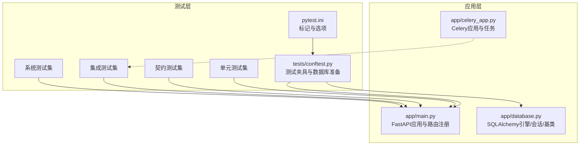
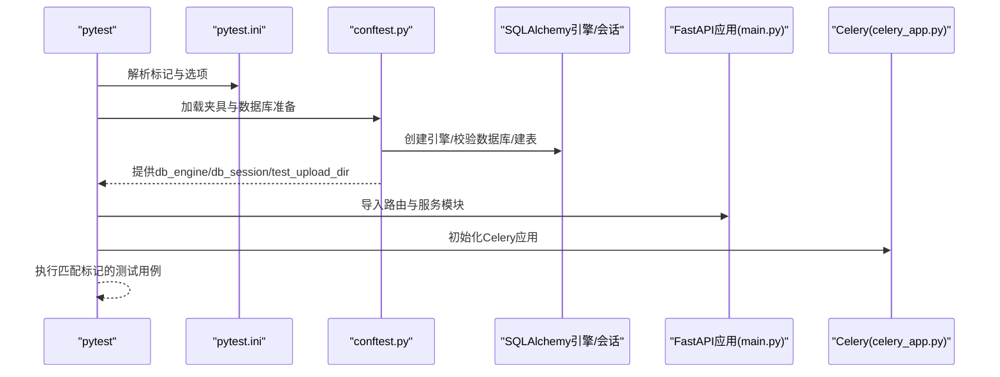
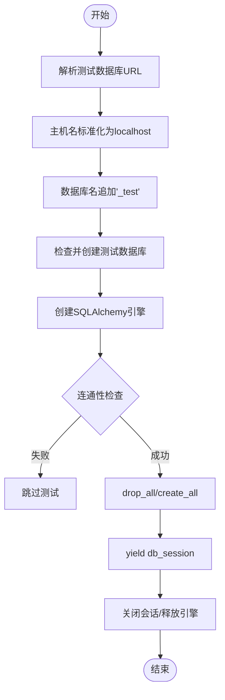
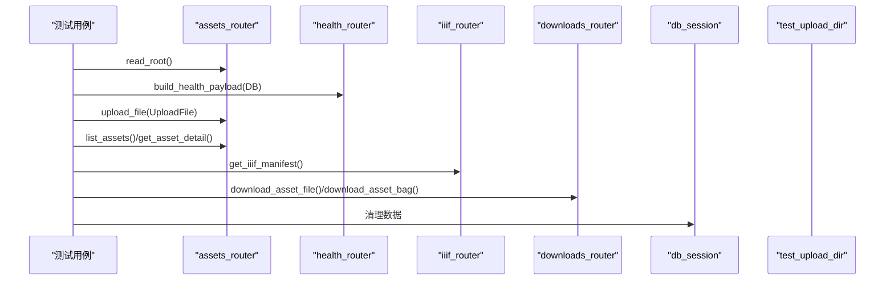
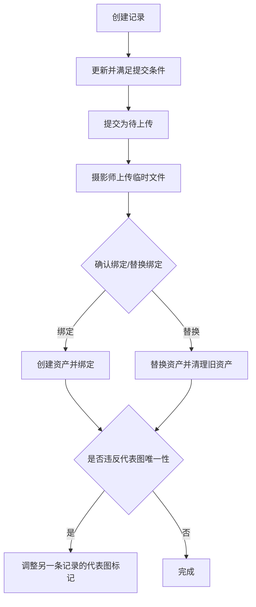
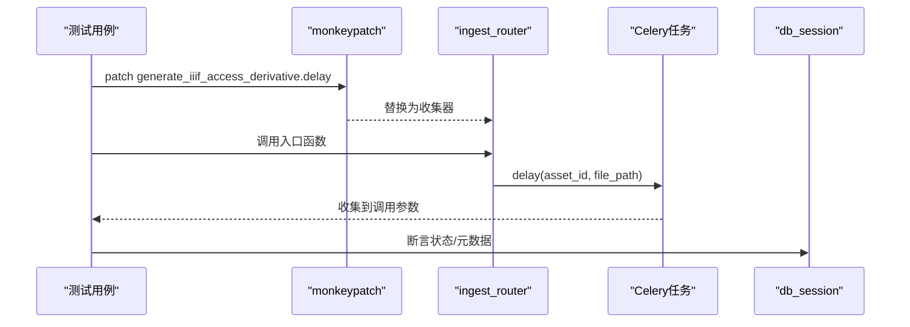
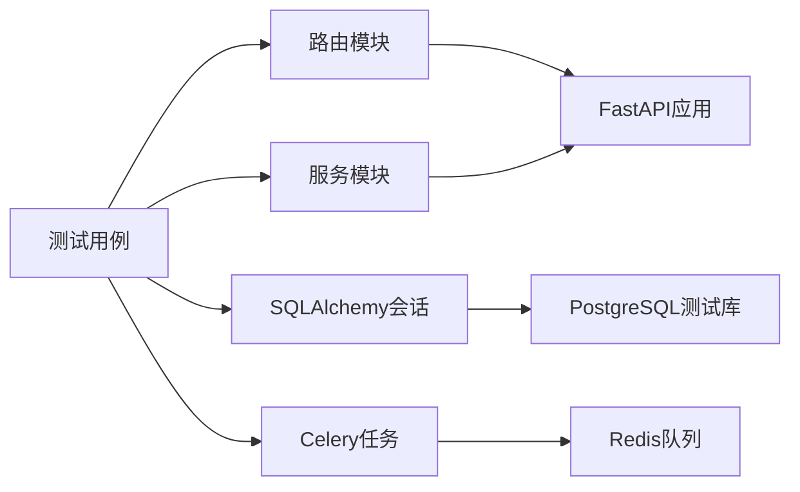

# 后端测试实践

<cite>
**本文引用的文件**
- [pytest.ini](file://pytest.ini)
- [backend/tests/conftest.py](file://backend/tests/conftest.py)
- [backend/app/main.py](file://backend/app/main.py)
- [backend/app/database.py](file://backend/app/database.py)
- [backend/app/celery_app.py](file://backend/app/celery_app.py)
- [backend/tests/test_output_contracts.py](file://backend/tests/test_output_contracts.py)
- [backend/tests/test_routes_smoke.py](file://backend/tests/test_routes_smoke.py)
- [backend/tests/test_permissions.py](file://backend/tests/test_permissions.py)
- [backend/tests/test_platform_directory.py](file://backend/tests/test_platform_directory.py)
- [backend/tests/test_three_d_production.py](file://backend/tests/test_three_d_production.py)
- [backend/tests/test_auth_service.py](file://backend/tests/test_auth_service.py)
- [backend/tests/test_image_records.py](file://backend/tests/test_image_records.py)
- [backend/tests/test_applications.py](file://backend/tests/test_applications.py)
- [backend/tests/test_asset_visibility.py](file://backend/tests/test_asset_visibility.py)
- [backend/tests/test_ingest.py](file://backend/tests/test_ingest.py)
</cite>

## 目录
1. [引言](#引言)
2. [项目结构](#项目结构)
3. [核心组件](#核心组件)
4. [架构总览](#架构总览)
5. [详细组件分析](#详细组件分析)
6. [依赖分析](#依赖分析)
7. [性能考虑](#性能考虑)
8. [故障排查指南](#故障排查指南)
9. [结论](#结论)
10. [附录](#附录)

## 引言
本文件面向MDAMS原型项目的后端测试实践，系统性梳理pytest框架在项目中的使用与配置，覆盖测试环境搭建、数据库连接与隔离、测试夹具（fixtures）的组织与复用；并分门别类讲解单元测试、契约测试（schema与响应结构）、集成测试（路由、数据库、文件系统）的编写方法与最佳实践。同时，结合项目现有测试用例，给出权限测试、图像记录测试、申请系统测试、平台目录测试、三维生产链路测试等实际案例解析，并介绍异步任务测试（Celery）与Mock机制的使用方式，以及测试覆盖率、性能测试与报告生成的建议路径。

## 项目结构
后端测试位于backend/tests目录，配合pytest配置与测试夹具集中于conftest.py，统一管理数据库测试环境、上传目录、会话生命周期等。应用入口FastAPI在main.py中注册路由与中间件，数据库引擎与会话工厂在database.py中定义，Celery任务在celery_app.py中初始化。

**图表来源**
- [pytest.ini:1-9](file://pytest.ini#L1-L9)
- [backend/tests/conftest.py:1-112](file://backend/tests/conftest.py#L1-L112)
- [backend/app/main.py:1-86](file://backend/app/main.py#L1-L86)
- [backend/app/database.py:1-17](file://backend/app/database.py#L1-L17)
- [backend/app/celery_app.py:1-19](file://backend/app/celery_app.py#L1-L19)

**章节来源**
- [pytest.ini:1-9](file://pytest.ini#L1-L9)
- [backend/tests/conftest.py:1-112](file://backend/tests/conftest.py#L1-L112)
- [backend/app/main.py:1-86](file://backend/app/main.py#L1-L86)
- [backend/app/database.py:1-17](file://backend/app/database.py#L1-L17)
- [backend/app/celery_app.py:1-19](file://backend/app/celery_app.py#L1-L19)

## 核心组件
- 测试标记与选项：通过pytest.ini定义unit、contract、integration、smoke、system等标记，便于按类型筛选与执行。
- 数据库测试夹具：自动解析测试数据库URL、确保数据库存在、创建引擎、按会话级创建/销毁表结构，保证测试隔离。
- 文件系统夹具：动态创建临时上传目录，通过monkeypatch注入配置，避免真实文件系统污染。
- 应用与路由：FastAPI应用在main.py中注册全部路由，测试直接调用路由函数或构造ASGI请求进行契约与集成测试。
- Celery异步任务：celery_app.py提供任务应用，测试中通过patch延迟任务行为，验证队列与结果处理。

**章节来源**
- [pytest.ini:1-9](file://pytest.ini#L1-L9)
- [backend/tests/conftest.py:70-112](file://backend/tests/conftest.py#L70-L112)
- [backend/app/main.py:64-86](file://backend/app/main.py#L64-L86)
- [backend/app/celery_app.py:1-19](file://backend/app/celery_app.py#L1-L19)

## 架构总览
下图展示测试执行的关键流程：pytest读取配置与标记，加载conftest中的夹具，建立数据库与会话，随后按测试类型执行单元/契约/集成/系统测试。

**图表来源**
- [pytest.ini:1-9](file://pytest.ini#L1-L9)
- [backend/tests/conftest.py:70-112](file://backend/tests/conftest.py#L70-L112)
- [backend/app/main.py:64-86](file://backend/app/main.py#L64-L86)
- [backend/app/celery_app.py:1-19](file://backend/app/celery_app.py#L1-L19)

## 详细组件分析

### 测试环境与夹具（fixtures）
- 数据库URL解析与准备
  - 优先从环境变量TEST_DATABASE_URL或PYTEST_DATABASE_URL解析；否则基于DATABASE_URL推导，将主机名标准化为localhost，并将数据库名追加"_test"后缀。
  - 使用“管理员”数据库（默认postgres）检查并创建测试数据库，确保测试可重复运行。
- 引擎与会话
  - 创建测试引擎并执行连通性检查，失败时跳过测试以避免阻塞。
  - 会话级fixture在每次测试前后重建表结构，确保测试隔离。
- 上传目录
  - 动态创建临时目录并通过monkeypatch注入应用配置，避免真实磁盘写入。

**图表来源**
- [backend/tests/conftest.py:21-98](file://backend/tests/conftest.py#L21-L98)

**章节来源**
- [backend/tests/conftest.py:14-112](file://backend/tests/conftest.py#L14-L112)

### 单元测试与契约测试
- 单元测试（unit）
  - 针对纯逻辑与规则的测试，如权限判定、认证服务种子数据等。
- 契约测试（contract）
  - 验证输出结构与schema，如IIIF清单字段、下载包结构与校验值、响应字段一致性等。

示例要点
- 权限测试：验证用户上下文解析、角色与权限、可见性作用域访问控制。
- 认证服务：验证角色与用户种子数据创建、登录与会话解析。
- 契约测试：构造最小化请求与假数据库查询对象，断言输出结构与字段。

**章节来源**
- [backend/tests/test_permissions.py:1-43](file://backend/tests/test_permissions.py#L1-L43)
- [backend/tests/test_auth_service.py:1-39](file://backend/tests/test_auth_service.py#L1-L39)
- [backend/tests/test_output_contracts.py:1-219](file://backend/tests/test_output_contracts.py#L1-L219)

### 集成测试（路由、数据库、文件系统）
- 路由冒烟测试：从根接口、健康检查、文件上传、资产列表、详情、IIIF清单、单文件与打包下载，串联完整链路，断言关键字段与状态。
- 平台目录测试：验证资源目录聚合、过滤与详情映射，包含画像与可移动文物两类档案的profile键值映射。
- 可见性与权限：断言公开与owner_only资源在不同用户下的访问差异，IIIF清单在隐藏资源上的拒绝行为。
- 入口与派生：验证SIP导入流程、校验值、元数据注入、大图派生队列行为。

**图表来源**
- [backend/tests/test_routes_smoke.py:66-130](file://backend/tests/test_routes_smoke.py#L66-L130)
- [backend/tests/test_platform_directory.py:38-107](file://backend/tests/test_platform_directory.py#L38-L107)
- [backend/tests/test_asset_visibility.py:75-124](file://backend/tests/test_asset_visibility.py#L75-L124)
- [backend/tests/test_ingest.py:30-170](file://backend/tests/test_ingest.py#L30-L170)

**章节来源**
- [backend/tests/test_routes_smoke.py:1-130](file://backend/tests/test_routes_smoke.py#L1-L130)
- [backend/tests/test_platform_directory.py:1-107](file://backend/tests/test_platform_directory.py#L1-L107)
- [backend/tests/test_asset_visibility.py:1-124](file://backend/tests/test_asset_visibility.py#L1-L124)
- [backend/tests/test_ingest.py:1-170](file://backend/tests/test_ingest.py#L1-L170)

### 图像记录测试（申请绑定、代表图唯一性、去重校验）
- 工作流：草稿创建、更新、提交、返回、摄影师上传与确认绑定、替换绑定。
- 业务约束：唯一性（一个可移动文物对象仅能有一个代表图）、重复哈希阻止绑定、上传队列与状态流转。
- Mock与探测：通过patch模拟文件探测与元数据提取，确保测试可控且稳定。

**图表来源**
- [backend/tests/test_image_records.py:431-734](file://backend/tests/test_image_records.py#L431-L734)

**章节来源**
- [backend/tests/test_image_records.py:1-933](file://backend/tests/test_image_records.py#L1-L933)

### 申请系统测试（创建、审批、导出）
- 申请创建与列表：断言编号、状态、条目数量与状态标签。
- 审批流程：断言审批后的状态、审查时间与备注。
- 导出流程：断言导出产物存在、状态变为已履行。

**章节来源**
- [backend/tests/test_applications.py:1-129](file://backend/tests/test_applications.py#L1-L129)

### 三维生产链路测试（事件顺序与元数据）
- 种子记录：为三维资产添加生产记录，断言阶段顺序、证据文件、保存状态等元信息。

**章节来源**
- [backend/tests/test_three_d_production.py:1-50](file://backend/tests/test_three_d_production.py#L1-L50)

### 异步任务测试（Celery）
- 任务应用：在celery_app.py中定义broker/backend与include的任务模块。
- 测试策略：通过patch将任务delay替换为收集器，断言队列行为与参数；或在集成测试中验证任务触发与副作用。

**图表来源**
- [backend/app/celery_app.py:1-19](file://backend/app/celery_app.py#L1-L19)
- [backend/tests/test_ingest.py:30-170](file://backend/tests/test_ingest.py#L30-L170)

**章节来源**
- [backend/app/celery_app.py:1-19](file://backend/app/celery_app.py#L1-L19)
- [backend/tests/test_ingest.py:30-170](file://backend/tests/test_ingest.py#L30-L170)

## 依赖分析
- 测试到应用的依赖
  - 测试通过导入路由模块与服务模块直接调用函数，或构造ASGI请求对象驱动路由。
  - conftest提供数据库与文件系统依赖，确保所有测试在同一隔离环境中运行。
- 外部依赖
  - SQLAlchemy用于数据库操作与会话管理。
  - Celery用于异步任务编排。
  - Pillow用于生成测试图片，ZipFile用于校验打包下载内容。

**图表来源**
- [backend/tests/conftest.py:70-112](file://backend/tests/conftest.py#L70-L112)
- [backend/app/main.py:64-86](file://backend/app/main.py#L64-L86)
- [backend/app/database.py:1-17](file://backend/app/database.py#L1-L17)
- [backend/app/celery_app.py:1-19](file://backend/app/celery_app.py#L1-L19)

**章节来源**
- [backend/tests/conftest.py:70-112](file://backend/tests/conftest.py#L70-L112)
- [backend/app/main.py:64-86](file://backend/app/main.py#L64-L86)
- [backend/app/database.py:1-17](file://backend/app/database.py#L1-L17)
- [backend/app/celery_app.py:1-19](file://backend/app/celery_app.py#L1-L19)

## 性能考虑
- 测试数据库与会话隔离：每次测试重建表结构，避免跨用例状态干扰，但可能增加测试时长。可通过并行执行与更细粒度的隔离策略优化。
- Mock与延迟任务：对耗时外部系统（如Cantaloupe、Redis）进行Mock，减少网络与IO开销。
- 二进制与大文件：测试中使用小尺寸图片与临时文件，避免真实大文件带来的I/O压力。
- 覆盖率与报告：建议结合pytest-cov生成覆盖率报告，定位未覆盖路径；结合pytest-html生成测试报告，辅助回归分析。

## 故障排查指南
- 数据库不可达
  - 现象：测试被跳过或报错。
  - 排查：确认TEST_DATABASE_URL/PYTEST_DATABASE_URL/DATABASE_URL环境变量；确保主机名可解析为localhost；确认管理员数据库可连接。
- 403/404断言失败
  - 现象：权限或文件缺失导致异常。
  - 排查：核对用户角色与可见性作用域；确认上传目录与文件存在；检查Mock的返回值与路径。
- 契约字段不一致
  - 现象：清单或下载包字段缺失或格式不符。
  - 排查：比对schema版本与字段映射；确认metadata_layers与profile键值；校验Zip文件结构与校验值。
- Celery队列未触发
  - 现象：异步任务未入队。
  - 排查：确认patch是否生效；检查任务名称与include配置；验证入口函数是否正确调用delay。

**章节来源**
- [backend/tests/conftest.py:87-98](file://backend/tests/conftest.py#L87-L98)
- [backend/tests/test_asset_visibility.py:107-114](file://backend/tests/test_asset_visibility.py#L107-L114)
- [backend/tests/test_output_contracts.py:150-185](file://backend/tests/test_output_contracts.py#L150-L185)
- [backend/tests/test_ingest.py:98-170](file://backend/tests/test_ingest.py#L98-L170)

## 结论
本项目的测试体系以pytest为核心，借助conftest统一管理数据库与文件系统夹具，结合路由直连与ASGI请求两种方式覆盖单元、契约与集成测试。通过Mock与patch有效隔离外部依赖，配合明确的测试标记与组织结构，形成可维护、可扩展的后端测试实践。建议持续完善覆盖率与报告体系，并在CI中引入并行执行与缓存策略以提升效率。

## 附录
- 标记说明
  - unit：纯工具函数与规则测试
  - contract：schema与响应结构契约测试
  - integration：路由、数据库、文件系统集成测试
  - smoke：关键路径冒烟测试
  - system：多步骤子系统测试

**章节来源**
- [pytest.ini:1-9](file://pytest.ini#L1-L9)