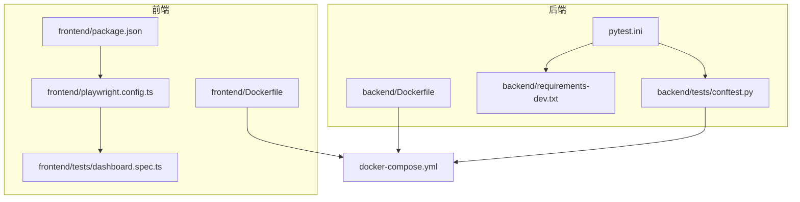
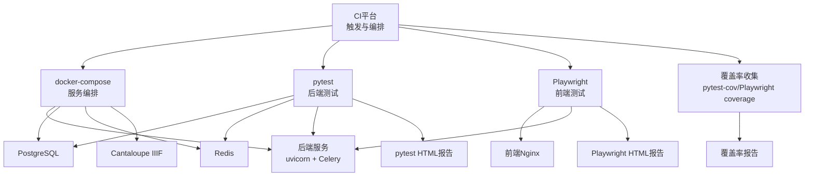
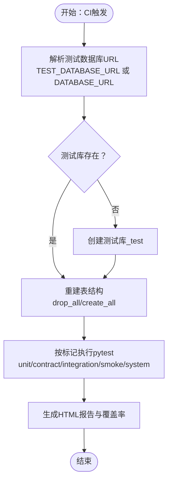
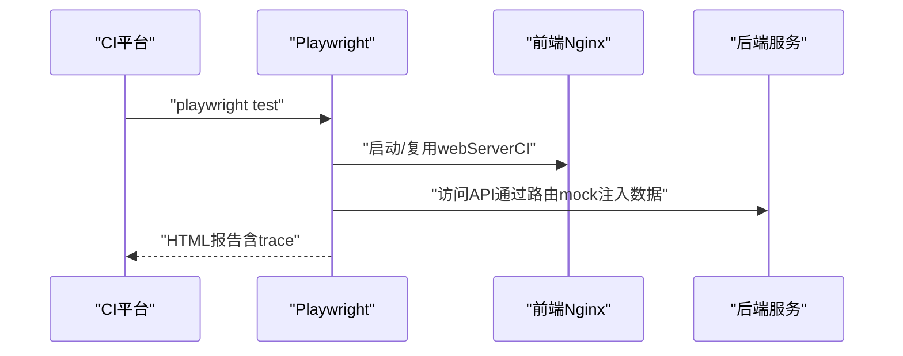
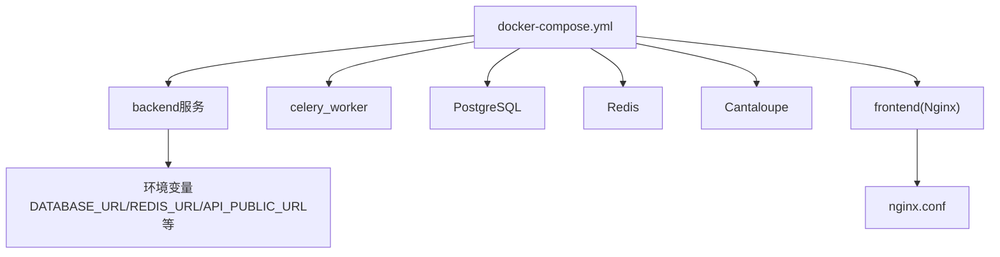
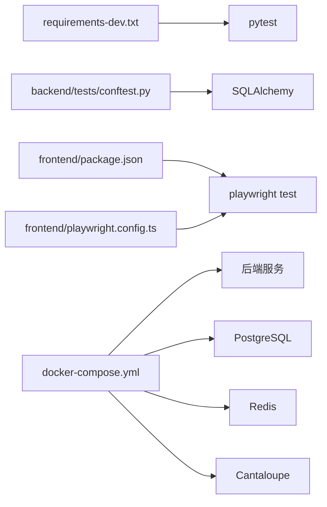

# 持续集成与自动化测试

<cite>
**本文引用的文件**
- [pytest.ini](file://pytest.ini)
- [backend/Dockerfile](file://backend/Dockerfile)
- [frontend/Dockerfile](file://frontend/Dockerfile)
- [docker-compose.yml](file://docker-compose.yml)
- [backend/tests/conftest.py](file://backend/tests/conftest.py)
- [frontend/playwright.config.ts](file://frontend/playwright.config.ts)
- [frontend/tests/dashboard.spec.ts](file://frontend/tests/dashboard.spec.ts)
- [docs/01-总览/TESTING_STRATEGY.md](file://docs/01-总览/TESTING_STRATEGY.md)
- [backend/requirements-dev.txt](file://backend/requirements-dev.txt)
- [frontend/package.json](file://frontend/package.json)
</cite>

## 目录
1. [引言](#引言)
2. [项目结构](#项目结构)
3. [核心组件](#核心组件)
4. [架构总览](#架构总览)
5. [详细组件分析](#详细组件分析)
6. [依赖分析](#依赖分析)
7. [性能考虑](#性能考虑)
8. [故障排查指南](#故障排查指南)
9. [结论](#结论)
10. [附录](#附录)

## 引言
本文件面向MDAMS原型项目的持续集成与自动化测试，系统梳理CI/CD流程中的测试自动化实践，涵盖测试在流水线中的执行策略与时机、测试报告生成与分析（pytest、Playwright、覆盖率）、触发机制（提交触发、定时任务、手动触发）、测试环境自动化配置（容器编排、依赖安装、数据库初始化、服务启动）、测试结果监控与通知、性能优化手段（并行执行、缓存与复用）、以及测试质量度量与持续改进方法。文档同时给出与仓库现有配置相对应的架构与流程图示，帮助读者快速落地。

## 项目结构
MDAMS采用前后端分离与容器化部署，测试体系围绕后端pytest与前端Playwright展开，配合docker-compose进行端到端环境编排。关键测试相关文件与配置如下：
- 后端测试运行与标记：pytest.ini、backend/tests/conftest.py、backend/requirements-dev.txt
- 前端测试运行与浏览器矩阵：frontend/playwright.config.ts、frontend/tests/dashboard.spec.ts、frontend/package.json
- 端到端环境编排：docker-compose.yml、backend/Dockerfile、frontend/Dockerfile

图表来源
- [pytest.ini:1-9](file://pytest.ini#L1-L9)
- [backend/tests/conftest.py:1-112](file://backend/tests/conftest.py#L1-L112)
- [backend/requirements-dev.txt:1-3](file://backend/requirements-dev.txt#L1-L3)
- [frontend/playwright.config.ts:1-36](file://frontend/playwright.config.ts#L1-L36)
- [frontend/tests/dashboard.spec.ts:1-764](file://frontend/tests/dashboard.spec.ts#L1-L764)
- [frontend/package.json:1-42](file://frontend/package.json#L1-L42)
- [backend/Dockerfile:1-52](file://backend/Dockerfile#L1-L52)
- [frontend/Dockerfile:1-28](file://frontend/Dockerfile#L1-L28)
- [docker-compose.yml:1-131](file://docker-compose.yml#L1-L131)

章节来源
- [pytest.ini:1-9](file://pytest.ini#L1-L9)
- [backend/tests/conftest.py:1-112](file://backend/tests/conftest.py#L1-L112)
- [frontend/playwright.config.ts:1-36](file://frontend/playwright.config.ts#L1-L36)
- [frontend/tests/dashboard.spec.ts:1-764](file://frontend/tests/dashboard.spec.ts#L1-L764)
- [backend/requirements-dev.txt:1-3](file://backend/requirements-dev.txt#L1-L3)
- [frontend/package.json:1-42](file://frontend/package.json#L1-L42)
- [backend/Dockerfile:1-52](file://backend/Dockerfile#L1-L52)
- [frontend/Dockerfile:1-28](file://frontend/Dockerfile#L1-L28)
- [docker-compose.yml:1-131](file://docker-compose.yml#L1-L131)

## 核心组件
- 后端测试运行与标记
  - pytest.ini定义了严格模式与测试标记（unit、contract、integration、smoke、system），指导CI中按标记选择性执行与报告输出。
- 前端测试运行与报告
  - playwright.config.ts启用完全并行、CI下重试、HTML报告、多浏览器项目矩阵，并通过webServer在CI中复用已有进程。
- 测试环境编排
  - docker-compose.yml集中管理后端、Redis、数据库、Cantaloupe等服务，便于CI一次性拉起完整环境。
- 测试夹具与数据库隔离
  - backend/tests/conftest.py负责测试数据库URL解析、自动创建测试库、会话级表重建与清理，确保测试隔离与可重复性。
- 前端测试数据模拟
  - frontend/tests/dashboard.spec.ts通过page.route拦截API，注入认证上下文与业务数据，支撑多角色、多入口的UI回归。

章节来源
- [pytest.ini:1-9](file://pytest.ini#L1-L9)
- [frontend/playwright.config.ts:1-36](file://frontend/playwright.config.ts#L1-L36)
- [docker-compose.yml:1-131](file://docker-compose.yml#L1-L131)
- [backend/tests/conftest.py:1-112](file://backend/tests/conftest.py#L1-L112)
- [frontend/tests/dashboard.spec.ts:1-764](file://frontend/tests/dashboard.spec.ts#L1-L764)

## 架构总览
下图展示CI流水线中测试执行的关键交互：pytest与Playwright分别在各自容器内运行，docker-compose提供共享的后端、数据库、Redis与Cantaloupe环境；测试报告通过HTML与CI平台集成，失败告警与通知可通过CI平台配置。

图表来源
- [docker-compose.yml:1-131](file://docker-compose.yml#L1-L131)
- [backend/Dockerfile:1-52](file://backend/Dockerfile#L1-L52)
- [frontend/Dockerfile:1-28](file://frontend/Dockerfile#L1-L28)
- [pytest.ini:1-9](file://pytest.ini#L1-L9)
- [frontend/playwright.config.ts:1-36](file://frontend/playwright.config.ts#L1-L36)

## 详细组件分析

### 后端测试：pytest与标记体系
- 标记与执行策略
  - 严格模式与标记定义确保CI中可按层筛选：unit（单元）、contract（契约）、integration（集成）、smoke（冒烟）、system（子系统）。
  - CI中建议结合标记选择性执行，例如仅运行integration或system层，缩短反馈周期。
- 数据库隔离与夹具
  - conftest.py解析TEST_DATABASE_URL或回退到DATABASE_URL推导测试库名（追加_test后缀），并在localhost上创建数据库，确保每次会话重建表结构，避免状态污染。
- 报告与覆盖率
  - 建议在CI中启用HTML报告与覆盖率（pytest-cov），将报告产物上传至CI平台，便于对比与归档。

图表来源
- [backend/tests/conftest.py:21-112](file://backend/tests/conftest.py#L21-L112)
- [pytest.ini:1-9](file://pytest.ini#L1-L9)

章节来源
- [pytest.ini:1-9](file://pytest.ini#L1-L9)
- [backend/tests/conftest.py:1-112](file://backend/tests/conftest.py#L1-L112)

### 前端测试：Playwright与多浏览器矩阵
- 并行与重试
  - CI环境下启用fullyParallel与retries，提升稳定性与吞吐；workers在CI中设为1以避免并发竞争。
- 多浏览器项目
  - Chromium、Firefox、WebKit三项目标，覆盖主流桌面浏览器差异。
- 内置Web Server
  - webServer.command在CI中复用已存在进程，减少冷启动开销。
- 报告与调试
  - HTML报告与trace在首次重试时开启，便于定位失败原因。

图表来源
- [frontend/playwright.config.ts:1-36](file://frontend/playwright.config.ts#L1-L36)
- [frontend/tests/dashboard.spec.ts:1-764](file://frontend/tests/dashboard.spec.ts#L1-L764)

章节来源
- [frontend/playwright.config.ts:1-36](file://frontend/playwright.config.ts#L1-L36)
- [frontend/tests/dashboard.spec.ts:1-764](file://frontend/tests/dashboard.spec.ts#L1-L764)

### 测试环境自动化配置
- 容器编排
  - docker-compose集中定义后端、Celery、Redis、数据库、Cantaloupe与前端Nginx，设置端口映射、环境变量与卷挂载，便于CI一键拉起。
- 后端镜像优化
  - backend/Dockerfile使用国内镜像源加速apt/pip，调整ImageMagick与libvips参数以适配大图处理与内存限制。
- 前端镜像优化
  - frontend/Dockerfile使用国内镜像源与Nginx，设置NODE_OPTIONS提升构建内存上限，避免N100低内存环境下的OOM。
- 环境变量与端口
  - 通过环境变量控制数据库连接、Redis、Cantaloupe、上传目录、人脸识别等参数，便于CI中动态注入。

图表来源
- [docker-compose.yml:1-131](file://docker-compose.yml#L1-L131)
- [backend/Dockerfile:1-52](file://backend/Dockerfile#L1-L52)
- [frontend/Dockerfile:1-28](file://frontend/Dockerfile#L1-L28)

章节来源
- [docker-compose.yml:1-131](file://docker-compose.yml#L1-L131)
- [backend/Dockerfile:1-52](file://backend/Dockerfile#L1-L52)
- [frontend/Dockerfile:1-28](file://frontend/Dockerfile#L1-L28)

### 测试报告生成与分析
- pytest报告
  - 建议在CI中启用HTML报告与覆盖率（pytest-cov），将报告产物上传至CI平台，支持历史趋势对比与失败详情定位。
- Playwright报告
  - HTML报告包含截图、视频与trace，CI中可配置归档与通知；结合多浏览器项目矩阵，便于识别浏览器特有问题。
- 覆盖率报告
  - 建议后端与前端分别统计覆盖率，CI中统一收敛到仪表板或报告平台，形成质量看板。

章节来源
- [pytest.ini:1-9](file://pytest.ini#L1-L9)
- [frontend/playwright.config.ts:1-36](file://frontend/playwright.config.ts#L1-L36)

### 触发机制与执行时机
- 代码提交触发
  - PR与主干推送触发后端pytest与前端Playwright；建议按标记分层执行，优先smoke与contract层快速反馈。
- 定时任务触发
  - 周期性运行integration与system层，覆盖长链路与跨服务行为。
- 手动触发
  - 支持在CI平台手动选择测试层或项目矩阵，便于回归验证与发布前检查。

章节来源
- [docs/01-总览/TESTING_STRATEGY.md:78-96](file://docs/01-总览/TESTING_STRATEGY.md#L78-L96)

### 测试结果监控与通知
- 失败告警
  - 将HTML报告与覆盖率结果作为告警依据，失败时触发邮件或IM通知。
- 报告邮件
  - CI平台可配置测试报告附件或链接发送给相关责任人。
- 状态可视化
  - 在CI平台仪表板展示测试通过率、失败用例TOP列表、覆盖率趋势与慢用例排行。

章节来源
- [frontend/playwright.config.ts:1-36](file://frontend/playwright.config.ts#L1-L36)
- [pytest.ini:1-9](file://pytest.ini#L1-L9)

## 依赖分析
- 后端pytest依赖
  - requirements-dev.txt声明pytest版本，conftest.py依赖SQLAlchemy进行数据库初始化与会话管理。
- 前端Playwright依赖
  - package.json声明playwright脚本与测试命令，playwright.config.ts定义运行参数与项目矩阵。
- 端到端依赖
  - docker-compose将后端、数据库、Redis、Cantaloupe与前端Nginx耦合，确保测试在真实环境中执行。

图表来源
- [backend/requirements-dev.txt:1-3](file://backend/requirements-dev.txt#L1-L3)
- [backend/tests/conftest.py:1-112](file://backend/tests/conftest.py#L1-L112)
- [frontend/package.json:1-42](file://frontend/package.json#L1-L42)
- [frontend/playwright.config.ts:1-36](file://frontend/playwright.config.ts#L1-L36)
- [docker-compose.yml:1-131](file://docker-compose.yml#L1-L131)

章节来源
- [backend/requirements-dev.txt:1-3](file://backend/requirements-dev.txt#L1-L3)
- [backend/tests/conftest.py:1-112](file://backend/tests/conftest.py#L1-L112)
- [frontend/package.json:1-42](file://frontend/package.json#L1-L42)
- [frontend/playwright.config.ts:1-36](file://frontend/playwright.config.ts#L1-L36)
- [docker-compose.yml:1-131](file://docker-compose.yml#L1-L131)

## 性能考虑
- 并行测试执行
  - 后端pytest可在本地启用并行（非CI环境），CI中建议串行或受限并行以避免资源争用。
  - 前端Playwright在CI中禁用fullyParallel，改为单worker，避免并发导致的不稳定。
- 测试数据缓存
  - 后端conftest.py按会话重建表结构，避免跨会话数据污染；可考虑在CI中缓存数据库初始化快照以缩短准备时间。
- 测试环境复用
  - Playwright webServer在CI中复用已有进程，减少冷启动；docker-compose服务持久化与卷挂载有助于复用缓存与依赖。
- 资源限制
  - docker-compose为数据库设置内存上限，避免CI资源不足导致的不稳定；前端与后端镜像均使用国内镜像源，提升下载速度。

章节来源
- [frontend/playwright.config.ts:1-36](file://frontend/playwright.config.ts#L1-L36)
- [backend/tests/conftest.py:1-112](file://backend/tests/conftest.py#L1-L112)
- [docker-compose.yml:88-102](file://docker-compose.yml#L88-L102)
- [backend/Dockerfile:1-52](file://backend/Dockerfile#L1-L52)
- [frontend/Dockerfile:1-28](file://frontend/Dockerfile#L1-L28)

## 故障排查指南
- 数据库连接失败
  - 检查TEST_DATABASE_URL或DATABASE_URL是否正确指向localhost（conftest.py会将db/postgres/postgresql替换为localhost），确认测试库存在且可创建。
- 测试超时或不稳定
  - 后端pytest：在CI中启用retries，必要时降低并发或分层执行；检查数据库与Redis健康状态。
  - 前端Playwright：启用trace与HTML报告，关注首重试失败的截图与日志；检查webServer端口占用与复用策略。
- 容器资源不足
  - 调整docker-compose中数据库内存限制，或在CI平台增加runner资源；前端与后端镜像使用国内镜像源，减少网络波动影响。
- 报告缺失
  - 确认pytest与Playwright的reporter配置，CI中正确归档HTML报告与覆盖率产物。

章节来源
- [backend/tests/conftest.py:21-112](file://backend/tests/conftest.py#L21-L112)
- [frontend/playwright.config.ts:1-36](file://frontend/playwright.config.ts#L1-L36)
- [docker-compose.yml:88-102](file://docker-compose.yml#L88-L102)

## 结论
MDAMS的测试体系以pytest与Playwright为核心，配合docker-compose实现端到端环境自动化。通过标记分层、并行与重试策略、HTML报告与覆盖率收集，以及CI触发与通知机制，可实现高效稳定的持续集成与自动化测试。建议在CI中进一步完善覆盖率阈值、慢用例监控与回归策略，持续提升测试质量与交付效率。

## 附录
- 常用命令参考（来自测试策略文档）
  - 后端pytest：在backend目录执行；支持按文件运行与标记过滤。
  - 前端Playwright：在frontend目录执行；支持按文件运行与浏览器矩阵选择。
- 测试策略要点
  - 新功能至少补一个契约或集成测试；缺陷修复优先在最窄层补测试；避免将所有行为塞入单一大用例。

章节来源
- [docs/01-总览/TESTING_STRATEGY.md:78-192](file://docs/01-总览/TESTING_STRATEGY.md#L78-L192)