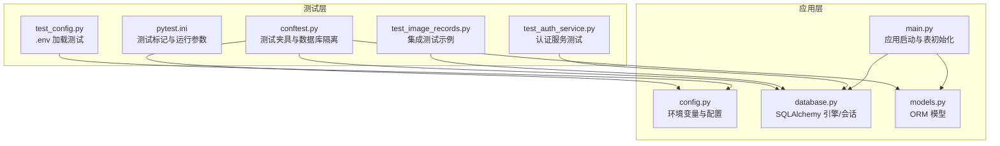
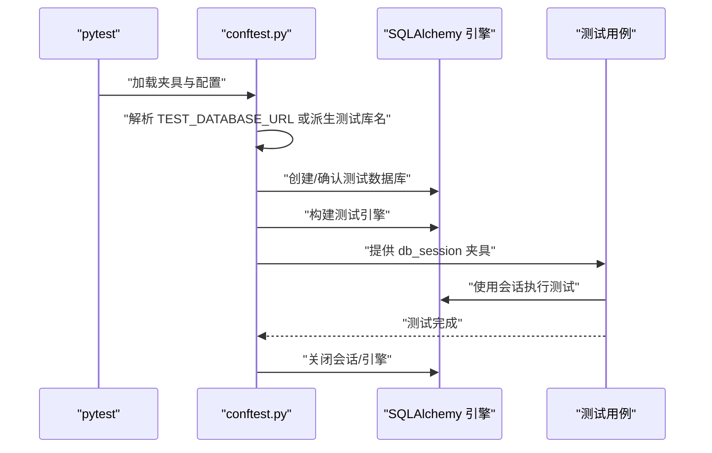
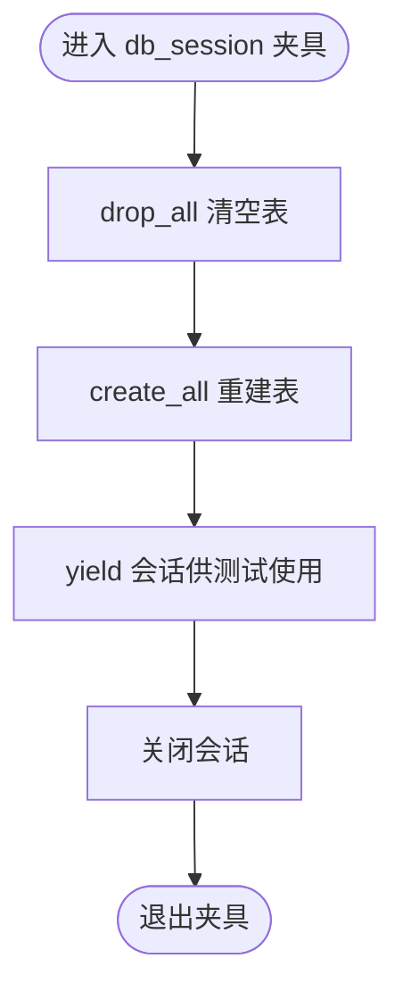
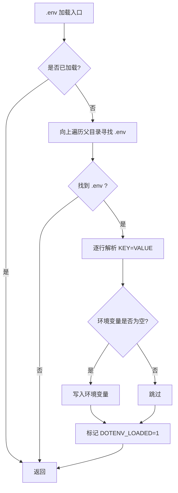
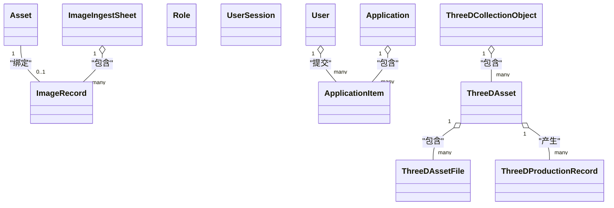
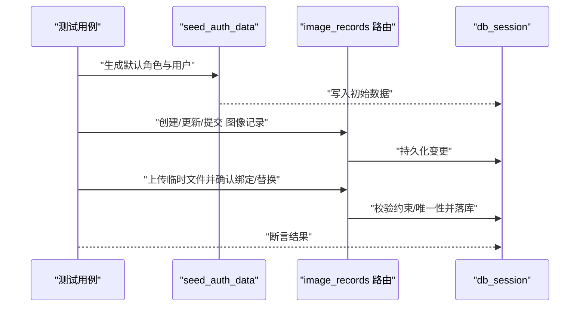
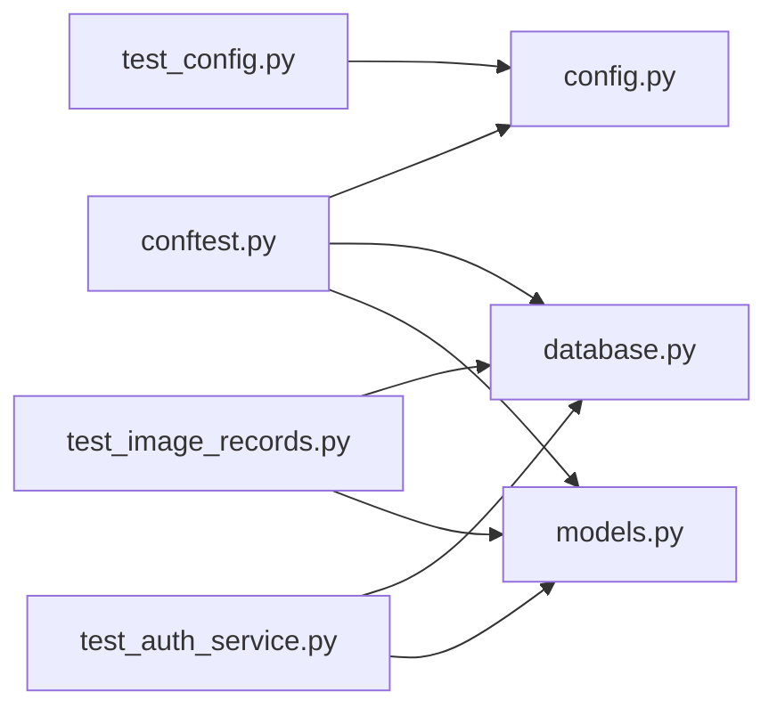

# 测试数据管理

<cite>
**本文引用的文件**
- [backend/tests/conftest.py](file://backend/tests/conftest.py)
- [pytest.ini](file://pytest.ini)
- [backend/app/config.py](file://backend/app/config.py)
- [backend/app/database.py](file://backend/app/database.py)
- [backend/app/models.py](file://backend/app/models.py)
- [backend/app/main.py](file://backend/app/main.py)
- [backend/tests/test_config.py](file://backend/tests/test_config.py)
- [backend/tests/test_auth_service.py](file://backend/tests/test_auth_service.py)
- [backend/tests/test_image_records.py](file://backend/tests/test_image_records.py)
</cite>

## 目录
1. [引言](#引言)
2. [项目结构](#项目结构)
3. [核心组件](#核心组件)
4. [架构总览](#架构总览)
5. [详细组件分析](#详细组件分析)
6. [依赖分析](#依赖分析)
7. [性能考量](#性能考量)
8. [故障排查指南](#故障排查指南)
9. [结论](#结论)
10. [附录](#附录)

## 引言
本文件围绕 MDAMS 原型项目的测试数据管理进行系统化梳理，重点覆盖以下方面：
- 测试数据的生成策略与管理方法：创建、维护与清理机制
- 数据库测试中的数据隔离技术：测试数据库的创建与销毁、事务回滚、批量插入与删除
- 测试环境的数据配置：测试数据库连接串、环境变量、测试配置文件管理
- 测试数据生命周期：测试前准备、测试中变更、测试后清理
- 最佳实践：数据一致性、性能优化、安全考虑
- Mock 数据的使用场景与实现：API Mock、数据库 Mock、文件系统 Mock
- 版本控制与共享机制建议

## 项目结构
本项目采用前后端分离与测试分层的组织方式，测试相关的关键位置如下：
- 后端测试入口与通用夹具：backend/tests/conftest.py
- 测试标记与运行配置：pytest.ini
- 应用配置加载与环境变量：backend/app/config.py
- 数据库引擎与会话：backend/app/database.py
- ORM 模型定义：backend/app/models.py
- 应用启动与表初始化：backend/app/main.py
- 典型测试用例：backend/tests/test_image_records.py、backend/tests/test_auth_service.py、backend/tests/test_config.py

图表来源
- [backend/tests/conftest.py:1-112](file://backend/tests/conftest.py#L1-L112)
- [pytest.ini:1-9](file://pytest.ini#L1-L9)
- [backend/app/config.py:1-72](file://backend/app/config.py#L1-L72)
- [backend/app/database.py:1-17](file://backend/app/database.py#L1-L17)
- [backend/app/models.py:1-307](file://backend/app/models.py#L1-L307)
- [backend/app/main.py:1-86](file://backend/app/main.py#L1-L86)

章节来源
- [backend/tests/conftest.py:1-112](file://backend/tests/conftest.py#L1-L112)
- [pytest.ini:1-9](file://pytest.ini#L1-L9)
- [backend/app/config.py:1-72](file://backend/app/config.py#L1-L72)
- [backend/app/database.py:1-17](file://backend/app/database.py#L1-L17)
- [backend/app/models.py:1-307](file://backend/app/models.py#L1-L307)
- [backend/app/main.py:1-86](file://backend/app/main.py#L1-L86)

## 核心组件
- 测试夹具与数据库隔离
  - 自动解析测试数据库 URL，支持从环境变量覆盖，默认基于主库名派生测试库名并确保以“_test”结尾
  - 使用管理员数据库连接串判断并创建测试数据库（若不存在），随后建立测试引擎
  - 在每个会话级夹具中，先清空所有表再重建，确保每次测试开始时的干净状态
- 配置加载与环境变量
  - 支持自底向上的 .env 文件加载，优先最近父目录的 .env，避免污染其他层级
  - 默认数据库、Redis、上传目录、外部服务地址等均通过环境变量注入
- ORM 模型与表初始化
  - 定义了资产、用户、角色、图像记录、申请、3D 资产等核心模型
  - 应用启动时创建所有表，并初始化默认认证数据

章节来源
- [backend/tests/conftest.py:14-112](file://backend/tests/conftest.py#L14-L112)
- [backend/app/config.py:5-72](file://backend/app/config.py#L5-L72)
- [backend/app/models.py:1-307](file://backend/app/models.py#L1-L307)
- [backend/app/main.py:58-63](file://backend/app/main.py#L58-L63)

## 架构总览
测试数据管理在本项目中的关键流程如下：
- 测试启动阶段：解析测试数据库 URL → 创建/确认测试数据库存在 → 初始化 SQLAlchemy 引擎与会话
- 测试执行阶段：每个测试在独立的会话中运行，使用已清理的干净表结构
- 测试结束阶段：会话关闭，数据库保持干净状态；可选地由上层脚本或 CI 清理测试数据库

图表来源
- [backend/tests/conftest.py:70-112](file://backend/tests/conftest.py#L70-L112)
- [backend/app/database.py:1-17](file://backend/app/database.py#L1-L17)

## 详细组件分析

### 测试夹具与数据库隔离
- 测试数据库 URL 解析与派生
  - 优先读取 TEST_DATABASE_URL 或 PYTEST_DATABASE_URL；否则基于 DATABASE_URL 派生测试库名（主机名替换为本地回环，数据库名追加“_test”）
  - 通过 ADMIN 数据库连接串判断并创建测试库（若不存在）
- 引擎与会话生命周期
  - 会话级夹具在进入时清空并重建所有表，在退出时关闭会话
  - 若无法连接测试数据库，则跳过该测试（避免阻塞）

图表来源
- [backend/tests/conftest.py:101-112](file://backend/tests/conftest.py#L101-L112)

章节来源
- [backend/tests/conftest.py:14-112](file://backend/tests/conftest.py#L14-L112)

### 配置加载与环境变量
- .env 加载策略
  - 从当前文件向外遍历查找 .env，找到即停止向上搜索，确保“最近优先”
  - 只在未设置的键上写入，避免覆盖已有环境变量
- 关键配置项
  - DATABASE_URL：默认 PostgreSQL 连接串
  - REDIS_URL：缓存/队列
  - UPLOAD_DIR：上传目录（测试中通过 monkeypatch 动态替换）
  - 外部服务地址：API_PUBLIC_URL、CANTALOUPE_PUBLIC_URL
  - 大模型服务：OPENAI/MOONSHOT 的兼容配置

图表来源
- [backend/app/config.py:5-37](file://backend/app/config.py#L5-L37)

章节来源
- [backend/app/config.py:1-72](file://backend/app/config.py#L1-L72)
- [backend/tests/test_config.py:6-36](file://backend/tests/test_config.py#L6-L36)

### ORM 模型与表初始化
- 模型概览
  - 资产、用户、角色、用户会话、图像采集表单、图像记录、申请、申请条目、3D 资产、3D 资产文件、3D 归档对象、3D 生产记录等
- 表初始化
  - 应用启动时调用 create_all 创建所有表，并初始化默认认证数据

图表来源
- [backend/app/models.py:1-307](file://backend/app/models.py#L1-L307)

章节来源
- [backend/app/models.py:1-307](file://backend/app/models.py#L1-L307)
- [backend/app/main.py:58-63](file://backend/app/main.py#L58-L63)

### 测试用例中的数据生成与验证
- 认证数据种子
  - 通过服务函数在测试前生成角色与用户，便于后续权限相关断言
- 图像记录流程测试
  - 包含草稿创建、提交、退回、上传临时文件、确认绑定/替换等完整流程
  - 使用内存 PNG 与二进制文件模拟上传，结合断言验证唯一性约束与代表性图片规则
- Mock 数据
  - 文化财产查询使用预定义与生成的 Mock 记录，确保测试稳定性与可重复性

图表来源
- [backend/tests/test_auth_service.py:16-39](file://backend/tests/test_auth_service.py#L16-L39)
- [backend/tests/test_image_records.py:53-112](file://backend/tests/test_image_records.py#L53-L112)
- [backend/tests/test_image_records.py:431-477](file://backend/tests/test_image_records.py#L431-L477)
- [backend/tests/test_image_records.py:478-553](file://backend/tests/test_image_records.py#L478-L553)

章节来源
- [backend/tests/test_auth_service.py:16-39](file://backend/tests/test_auth_service.py#L16-L39)
- [backend/tests/test_image_records.py:53-112](file://backend/tests/test_image_records.py#L53-L112)
- [backend/tests/test_image_records.py:431-477](file://backend/tests/test_image_records.py#L431-L477)
- [backend/tests/test_image_records.py:478-553](file://backend/tests/test_image_records.py#L478-L553)

## 依赖分析
- 测试夹具对数据库与配置的依赖
  - conftest 依赖 config 中的 DATABASE_URL 与环境变量解析逻辑
  - conftest 依赖 database 中的 Base 与引擎构造
- 测试用例对夹具与模型的依赖
  - 测试通过 db_session 获取会话，直接操作模型并断言
  - 部分测试通过 monkeypatch 修改配置（如上传目录）以隔离文件系统影响

图表来源
- [backend/tests/conftest.py:70-112](file://backend/tests/conftest.py#L70-L112)
- [backend/app/config.py:1-72](file://backend/app/config.py#L1-L72)
- [backend/app/database.py:1-17](file://backend/app/database.py#L1-L17)
- [backend/app/models.py:1-307](file://backend/app/models.py#L1-L307)
- [backend/tests/test_image_records.py:1-800](file://backend/tests/test_image_records.py#L1-L800)
- [backend/tests/test_auth_service.py:1-39](file://backend/tests/test_auth_service.py#L1-L39)
- [backend/tests/test_config.py:1-36](file://backend/tests/test_config.py#L1-L36)

章节来源
- [backend/tests/conftest.py:70-112](file://backend/tests/conftest.py#L70-L112)
- [backend/app/config.py:1-72](file://backend/app/config.py#L1-L72)
- [backend/app/database.py:1-17](file://backend/app/database.py#L1-L17)
- [backend/app/models.py:1-307](file://backend/app/models.py#L1-L307)
- [backend/tests/test_image_records.py:1-800](file://backend/tests/test_image_records.py#L1-L800)
- [backend/tests/test_auth_service.py:1-39](file://backend/tests/test_auth_service.py#L1-L39)
- [backend/tests/test_config.py:1-36](file://backend/tests/test_config.py#L1-L36)

## 性能考量
- 测试数据库隔离与表重建
  - 每次测试前 drop_all 再 create_all，确保数据干净但可能带来额外开销
  - 建议在需要大量测试时，评估是否可减少重建频率或使用更细粒度的清理策略
- 上传文件与 I/O
  - 测试中使用内存文件模拟上传，避免真实磁盘 I/O；如需真实文件场景，建议使用临时目录并及时清理
- 并发与会话
  - 使用独立会话避免跨测试干扰；如测试数量较多，注意连接池与并发限制

## 故障排查指南
- 测试数据库不可用
  - 现象：测试被跳过，提示 PostgreSQL 测试数据库不可用
  - 排查：检查 TEST_DATABASE_URL/PYTEST_DATABASE_URL/DATABASE_URL 是否正确；确认目标主机可达且测试库存在
- 表结构不一致
  - 现象：测试失败或迁移异常
  - 排查：确认 conftest 中的 drop_all/create_all 是否按预期执行；检查模型定义与实际数据库结构
- .env 加载冲突
  - 现象：配置值不符合预期
  - 排查：确认 .env 加载顺序与覆盖规则；避免在更高层级 .env 中意外覆盖
- 上传目录问题
  - 现象：文件上传相关测试失败
  - 排查：确认通过 monkeypatch 设置的 UPLOAD_DIR 是否生效；检查临时目录权限与清理策略

章节来源
- [backend/tests/conftest.py:85-98](file://backend/tests/conftest.py#L85-L98)
- [backend/tests/test_config.py:6-36](file://backend/tests/test_config.py#L6-L36)
- [backend/tests/test_image_records.py:431-477](file://backend/tests/test_image_records.py#L431-L477)

## 结论
本项目通过严格的测试夹具与数据库隔离策略，实现了测试数据的可控生成与清理，配合 .env 加载与配置注入，确保测试环境的一致性与可重复性。结合模型层的表初始化与服务层的种子数据，测试用例能够稳定地覆盖业务流程与边界条件。建议在持续集成中进一步优化重建策略与文件 I/O，以提升整体测试效率。

## 附录
- 测试标记与分类
  - 单元测试、契约测试、集成测试、冒烟测试、系统测试等标记已在 pytest.ini 中定义，便于按类别运行与筛选
- 数据库测试最佳实践
  - 使用独立测试库，避免与生产/开发库混淆
  - 在会话级夹具中进行表重建，确保每次测试的独立性
  - 对于大体量数据，考虑分批插入与批量清理，减少锁竞争
- Mock 数据管理
  - 将 Mock 数据集中管理，明确来源（预定义/生成），并在测试中显式声明其作用域
  - 对 Mock 的变更进行版本控制，确保回归测试的稳定性
- 版本控制与共享
  - 将测试数据（如 Mock 列表、固定样例）纳入版本控制，配合分支策略进行共享与演进
  - 对敏感数据进行脱敏处理，仅保留测试所需的最小信息集

章节来源
- [pytest.ini:1-9](file://pytest.ini#L1-L9)
- [backend/tests/test_image_records.py:162-227](file://backend/tests/test_image_records.py#L162-L227)