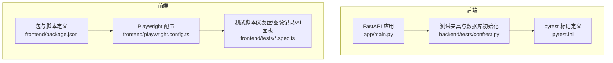
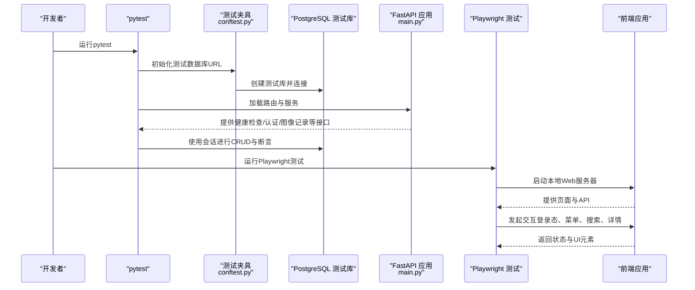
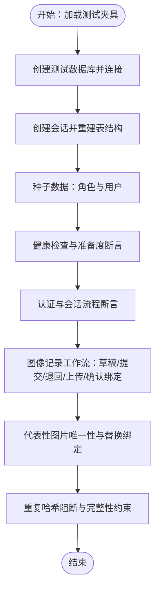
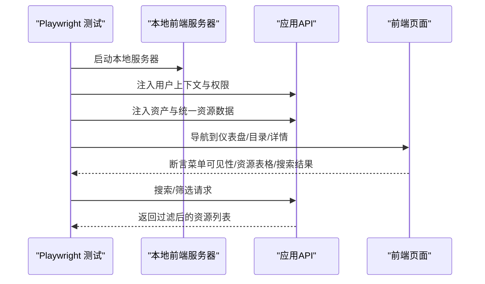
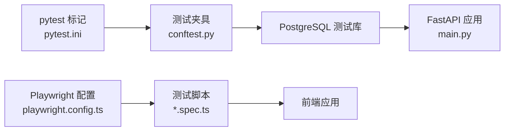

# 测试策略与实践

<cite>
**本文引用的文件**
- [测试策略.md](file://docs/01-总览/TESTING_STRATEGY.md)
- [pytest.ini](file://pytest.ini)
- [conftest.py](file://backend/tests/conftest.py)
- [main.py](file://backend/app/main.py)
- [Dockerfile（后端）](file://backend/Dockerfile)
- [playwright.config.ts](file://frontend/playwright.config.ts)
- [package.json](file://frontend/package.json)
- [test_health.py](file://backend/tests/test_health.py)
- [test_auth_service.py](file://backend/tests/test_auth_service.py)
- [test_image_records.py](file://backend/tests/test_image_records.py)
- [dashboard.spec.ts](file://frontend/tests/dashboard.spec.ts)
- [mirador-ai.spec.ts](file://frontend/tests/mirador-ai.spec.ts)
</cite>

## 目录
1. [引言](#引言)
2. [项目结构](#项目结构)
3. [核心组件](#核心组件)
4. [架构总览](#架构总览)
5. [详细组件分析](#详细组件分析)
6. [依赖分析](#依赖分析)
7. [性能考虑](#性能考虑)
8. [故障排查指南](#故障排查指南)
9. [结论](#结论)
10. [附录](#附录)

## 引言
本文件面向MDAMS原型项目的测试策略与实践，系统梳理后端pytest分层测试、前端Playwright回归测试、测试数据管理、持续集成与自动化测试、最佳实践与质量保障流程，并提供测试环境搭建与维护指南及示例配置模板。目标是帮助开发者在不同层级快速定位问题、提升交付质量与效率。

## 项目结构
- 后端采用FastAPI + SQLAlchemy，测试集中在backend/tests，通过pytest组织，使用标记区分单元、契约、集成、smoke与子系统测试。
- 前端采用Vite + React + Playwright，测试集中在frontend/tests，通过playwright.config.ts配置浏览器矩阵与Web服务器启动。
- 文档与策略位于docs/01-总览/TESTING_STRATEGY.md，明确分层策略、常用命令与完成标准。

**图表来源**
- [main.py:1-86](file://backend/app/main.py#L1-L86)
- [conftest.py:1-112](file://backend/tests/conftest.py#L1-L112)
- [pytest.ini:1-9](file://pytest.ini#L1-L9)
- [playwright.config.ts:1-36](file://frontend/playwright.config.ts#L1-L36)
- [package.json:1-42](file://frontend/package.json#L1-L42)

**章节来源**
- [测试策略.md:1-192](file://docs/01-总览/TESTING_STRATEGY.md#L1-L192)
- [pytest.ini:1-9](file://pytest.ini#L1-L9)
- [conftest.py:1-112](file://backend/tests/conftest.py#L1-L112)
- [playwright.config.ts:1-36](file://frontend/playwright.config.ts#L1-L36)
- [package.json:1-42](file://frontend/package.json#L1-L42)

## 核心组件
- 后端测试分层与标记
  - 单元测试：纯逻辑、规则、字典、元数据分层
  - 契约测试：schema、响应结构、字段约束
  - 集成测试：路由 + 数据库 + 文件系统行为
  - smoke测试：关键happy path
  - 子系统测试：跨多个服务函数和路由的业务链路
- 前端测试
  - ESLint静态检查、构建检查
  - Playwright回归测试，覆盖登录态、菜单可见性、统一平台目录与统一详情、图像记录工作台、不同角色下的页面入口差异
- 测试数据与环境
  - 后端统一PostgreSQL测试数据库，自动创建与连接；上传目录通过夹具注入
  - 前端通过本地Web服务器启动，Playwright按浏览器矩阵运行

**章节来源**
- [测试策略.md:6-96](file://docs/01-总览/TESTING_STRATEGY.md#L6-L96)
- [pytest.ini:1-9](file://pytest.ini#L1-L9)
- [conftest.py:1-112](file://backend/tests/conftest.py#L1-L112)
- [playwright.config.ts:1-36](file://frontend/playwright.config.ts#L1-L36)

## 架构总览
下图展示后端测试生命周期与关键组件交互，以及前端Playwright测试与应用的交互关系。

**图表来源**
- [conftest.py:70-112](file://backend/tests/conftest.py#L70-L112)
- [main.py:1-86](file://backend/app/main.py#L1-L86)
- [playwright.config.ts:30-35](file://frontend/playwright.config.ts#L30-L35)

## 详细组件分析

### 后端测试实践（pytest）
- 测试夹具与数据库
  - 自动解析TEST_DATABASE_URL或回退到DATABASE_URL推导测试库名，确保localhost连接与admin库创建数据库
  - 会话级初始化：每次会话重建表结构，确保测试隔离
  - 上传目录通过夹具注入，便于文件绑定与校验测试
- 健康检查与准备度测试
  - 覆盖数据库可用性、上传目录存在性等关键路径
  - 失败场景返回HTTP异常，状态码与checks信息断言
- 认证与会话测试
  - 种子数据创建角色与用户，验证登录、会话创建与解析
- 图像记录工作流测试
  - 覆盖草稿提交、退回、批量导入、摄影师上传与确认绑定、代表性图片唯一性、重复哈希阻断等复杂业务链路
  - 使用异步上传与临时令牌流程，模拟真实上传与校验

**图表来源**
- [conftest.py:70-112](file://backend/tests/conftest.py#L70-L112)
- [test_health.py:1-53](file://backend/tests/test_health.py#L1-L53)
- [test_auth_service.py:1-39](file://backend/tests/test_auth_service.py#L1-L39)
- [test_image_records.py:1-933](file://backend/tests/test_image_records.py#L1-L933)

**章节来源**
- [conftest.py:1-112](file://backend/tests/conftest.py#L1-L112)
- [test_health.py:1-53](file://backend/tests/test_health.py#L1-L53)
- [test_auth_service.py:1-39](file://backend/tests/test_auth_service.py#L1-L39)
- [test_image_records.py:1-933](file://backend/tests/test_image_records.py#L1-L933)

### 前端测试实践（Playwright）
- 配置要点
  - 并行执行、CI重试、多浏览器矩阵（Chromium/Firefox/Safari）、HTML报告、首次重试追踪
  - 本地Web服务器命令与端口、复用已有进程避免CI冲突
- 用例覆盖
  - 仪表盘：系统管理员可见菜单与资源表格、统一平台目录打开与搜索、统一详情页打开
  - 角色可见性：资源用户仅可见部分菜单
  - 图像记录工作台：元数据录入人员可打开工作台
  - 摄影师待上传池：可查看分配的待上传记录
  - 集合所有者作用域：仅显示自身集合范围内的资源
- API桩桩
  - 通过page.route拦截API，注入用户上下文、资产列表、统一资源目录、搜索过滤结果等

**图表来源**
- [playwright.config.ts:1-36](file://frontend/playwright.config.ts#L1-L36)
- [dashboard.spec.ts:1-764](file://frontend/tests/dashboard.spec.ts#L1-L764)
- [mirador-ai.spec.ts:1-267](file://frontend/tests/mirador-ai.spec.ts#L1-L267)

**章节来源**
- [playwright.config.ts:1-36](file://frontend/playwright.config.ts#L1-L36)
- [dashboard.spec.ts:1-764](file://frontend/tests/dashboard.spec.ts#L1-L764)
- [mirador-ai.spec.ts:1-267](file://frontend/tests/mirador-ai.spec.ts#L1-L267)

### 测试数据管理
- 后端
  - 测试数据库URL解析与自动创建，确保每次会话重建表结构，避免跨用例污染
  - 上传目录通过夹具注入，便于测试文件上传与绑定流程
- 前端
  - 通过page.route注入固定数据，确保用例可重复且与真实API解耦
  - 本地服务器复用策略减少CI中的冷启动开销

**章节来源**
- [conftest.py:21-112](file://backend/tests/conftest.py#L21-L112)
- [dashboard.spec.ts:291-657](file://frontend/tests/dashboard.spec.ts#L291-L657)
- [mirador-ai.spec.ts:108-237](file://frontend/tests/mirador-ai.spec.ts#L108-L237)

### 持续集成与自动化测试
- 后端
  - 使用pytest标记组织测试，便于按层筛选与CI分阶段执行
  - 建议在CI中按顺序执行：pytest → 前端ESLint → 前端构建 → Playwright
- 前端
  - ESLint与构建作为门禁检查；Playwright在CI中启用重试与HTML报告
- 报告与覆盖率
  - 建议在CI中集成覆盖率工具（如pytest-cov）与HTML报告，结合Playwright HTML报告统一归档

**章节来源**
- [测试策略.md:78-96](file://docs/01-总览/TESTING_STRATEGY.md#L78-L96)
- [pytest.ini:1-9](file://pytest.ini#L1-L9)
- [playwright.config.ts:6-13](file://frontend/playwright.config.ts#L6-L13)

### 测试最佳实践与质量保证流程
- 分层策略
  - 新功能至少补一个契约或集成测试；缺陷修复优先在最窄层补测
  - 避免将所有行为塞进单个超大端到端用例，保持smoke小而稳定
- 角色与入口回归
  - 权限改动需同时补后端与前端用例；菜单与入口变更需覆盖不同角色
- 文档与命令一致性
  - 文档中列出的命令应可直接执行，确保团队协作一致性

**章节来源**
- [测试策略.md:134-192](file://docs/01-总览/TESTING_STRATEGY.md#L134-L192)

## 依赖分析
- 后端
  - FastAPI应用在启动时创建数据库表并初始化种子数据，测试夹具确保数据库可用性与隔离
  - pytest标记用于分层组织，conftest负责数据库生命周期
- 前端
  - Playwright配置定义浏览器矩阵与Web服务器启动方式，测试脚本通过API桩桩与UI断言结合

**图表来源**
- [pytest.ini:1-9](file://pytest.ini#L1-L9)
- [conftest.py:1-112](file://backend/tests/conftest.py#L1-L112)
- [main.py:1-86](file://backend/app/main.py#L1-L86)
- [playwright.config.ts:1-36](file://frontend/playwright.config.ts#L1-L36)

**章节来源**
- [pytest.ini:1-9](file://pytest.ini#L1-L9)
- [conftest.py:1-112](file://backend/tests/conftest.py#L1-L112)
- [main.py:1-86](file://backend/app/main.py#L1-L86)
- [playwright.config.ts:1-36](file://frontend/playwright.config.ts#L1-L36)

## 性能考虑
- 后端
  - 使用PostgreSQL测试库替代SQLite，提升与生产一致的性能与并发表现
  - 会话级表重建确保隔离，但可能增加初始化时间；可在CI中缓存数据库或使用更细粒度的事务
- 前端
  - 并行执行与浏览器矩阵会增加资源消耗；建议在CI中限制workers数量并启用重试
  - 本地服务器复用可减少冷启动成本

**章节来源**
- [测试策略.md:106-116](file://docs/01-总览/TESTING_STRATEGY.md#L106-L116)
- [playwright.config.ts:5-8](file://frontend/playwright.config.ts#L5-L8)

## 故障排查指南
- 后端
  - 数据库不可用：检查TEST_DATABASE_URL或回退逻辑；确认admin库可连接并能创建数据库
  - 表结构不兼容：FastAPI启动时会处理SQLite兼容性；测试中使用会话重建表结构
  - 上传目录缺失：健康检查会返回503，检查上传目录夹具注入
- 前端
  - 本地服务器未启动：确认playwright.config.ts中的webServer配置与package.json脚本一致
  - 页面元素不可见：检查API桩桩是否正确注入，确认断言选择器与data-testid一致

**章节来源**
- [conftest.py:44-98](file://backend/tests/conftest.py#L44-L98)
- [main.py:21-62](file://backend/app/main.py#L21-L62)
- [test_health.py:36-52](file://backend/tests/test_health.py#L36-L52)
- [playwright.config.ts:30-35](file://frontend/playwright.config.ts#L30-L35)

## 结论
本项目采用清晰的分层测试策略：后端以pytest为核心，结合契约、集成与smoke测试；前端以Playwright为主，覆盖关键角色与入口。配合测试数据管理与CI流程，形成从单元到端到端的闭环质量保障。建议持续完善测试标签与目录分层、增强三维与平台适配器测试覆盖面，并在CI中引入覆盖率与性能指标，进一步提升交付质量与稳定性。

## 附录
- 常用命令
  - 后端pytest：进入backend目录，执行pytest命令；可指定单文件运行
  - 前端：ESLint检查、构建、Playwright测试；可指定测试文件运行
- 配置模板参考
  - 后端pytest.ini标记定义
  - 前端playwright.config.ts浏览器矩阵与Web服务器配置
  - 前端package.json脚本与依赖

**章节来源**
- [测试策略.md:97-133](file://docs/01-总览/TESTING_STRATEGY.md#L97-L133)
- [pytest.ini:1-9](file://pytest.ini#L1-L9)
- [playwright.config.ts:1-36](file://frontend/playwright.config.ts#L1-L36)
- [package.json:1-42](file://frontend/package.json#L1-L42)