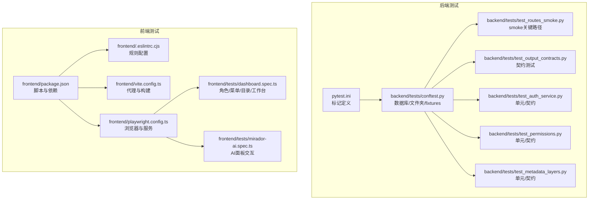
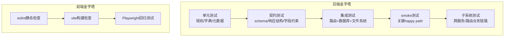
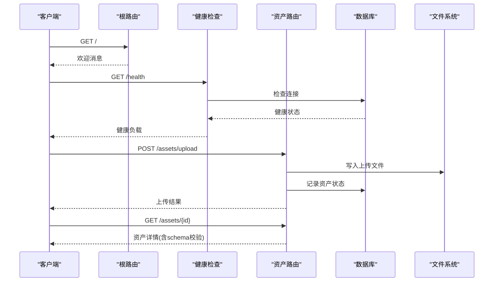
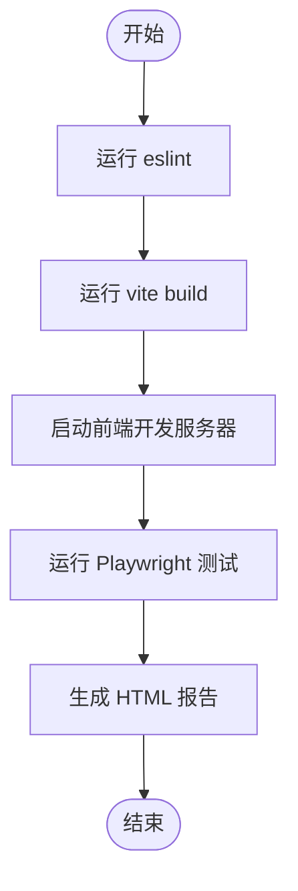
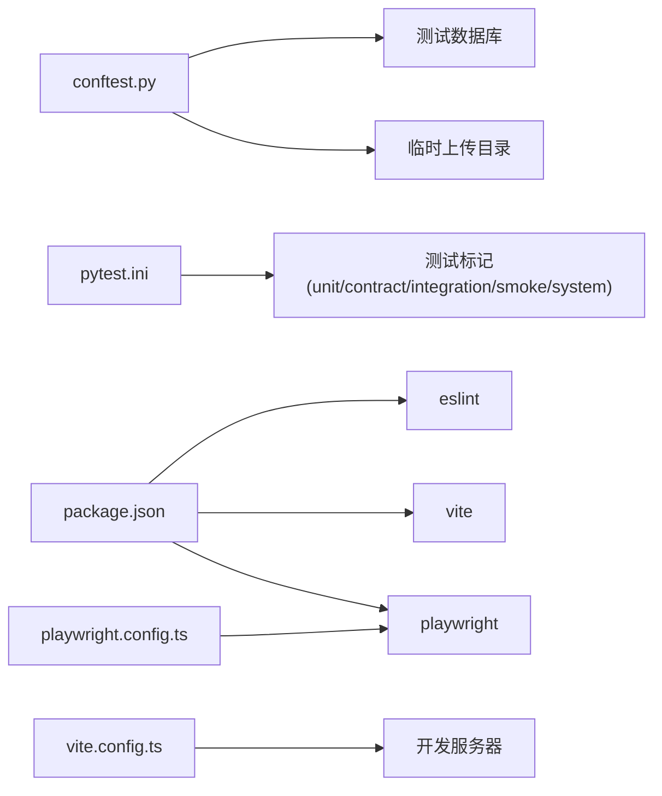

# 测试策略概览

<cite>
**本文引用的文件**
- [docs/01-总览/TESTING_STRATEGY.md](file://docs/01-总览/TESTING_STRATEGY.md)
- [pytest.ini](file://pytest.ini)
- [backend/tests/conftest.py](file://backend/tests/conftest.py)
- [backend/tests/test_routes_smoke.py](file://backend/tests/test_routes_smoke.py)
- [backend/tests/test_output_contracts.py](file://backend/tests/test_output_contracts.py)
- [backend/tests/test_auth_service.py](file://backend/tests/test_auth_service.py)
- [backend/tests/test_permissions.py](file://backend/tests/test_permissions.py)
- [backend/tests/test_metadata_layers.py](file://backend/tests/test_metadata_layers.py)
- [frontend/package.json](file://frontend/package.json)
- [frontend/playwright.config.ts](file://frontend/playwright.config.ts)
- [frontend/tests/dashboard.spec.ts](file://frontend/tests/dashboard.spec.ts)
- [frontend/tests/mirador-ai.spec.ts](file://frontend/tests/mirador-ai.spec.ts)
- [frontend/.eslintrc.cjs](file://frontend/.eslintrc.cjs)
- [frontend/vite.config.ts](file://frontend/vite.config.ts)
</cite>

## 目录
1. [引言](#引言)
2. [项目结构](#项目结构)
3. [核心组件](#核心组件)
4. [架构总览](#架构总览)
5. [详细组件分析](#详细组件分析)
6. [依赖分析](#依赖分析)
7. [性能考虑](#性能考虑)
8. [故障排查指南](#故障排查指南)
9. [结论](#结论)
10. [附录](#附录)

## 引言
本文件面向MDAMS原型项目的测试策略概览，系统阐述分层测试理念与实践，结合后端pytest与前端Playwright的实际落地，给出测试金字塔在本项目中的具体应用方式、各层级目标与职责划分、核心测试原则、分层构成、前端测试组合策略，以及推荐的测试执行顺序与常用命令。

## 项目结构
围绕测试策略，项目在后端与前端分别建立了明确的测试层次与工具链：
- 后端：通过pytest标记区分单元、契约、集成、smoke与子系统测试；以conftest统一数据库与文件系统测试环境；配合路由+数据库+文件系统的端到端关键路径验证。
- 前端：通过eslint静态检查、vite构建检查与Playwright回归测试形成“质量三道防线”。

**图表来源**
- [pytest.ini:1-9](file://pytest.ini#L1-L9)
- [backend/tests/conftest.py:1-112](file://backend/tests/conftest.py#L1-L112)
- [backend/tests/test_routes_smoke.py:1-130](file://backend/tests/test_routes_smoke.py#L1-L130)
- [backend/tests/test_output_contracts.py:1-219](file://backend/tests/test_output_contracts.py#L1-L219)
- [backend/tests/test_auth_service.py:1-39](file://backend/tests/test_auth_service.py#L1-L39)
- [backend/tests/test_permissions.py:1-43](file://backend/tests/test_permissions.py#L1-L43)
- [backend/tests/test_metadata_layers.py:1-113](file://backend/tests/test_metadata_layers.py#L1-L113)
- [frontend/package.json:1-42](file://frontend/package.json#L1-L42)
- [frontend/.eslintrc.cjs:1-21](file://frontend/.eslintrc.cjs#L1-L21)
- [frontend/vite.config.ts:1-42](file://frontend/vite.config.ts#L1-L42)
- [frontend/playwright.config.ts:1-36](file://frontend/playwright.config.ts#L1-L36)
- [frontend/tests/dashboard.spec.ts:1-764](file://frontend/tests/dashboard.spec.ts#L1-L764)
- [frontend/tests/mirador-ai.spec.ts:1-267](file://frontend/tests/mirador-ai.spec.ts#L1-L267)

**章节来源**
- [docs/01-总览/TESTING_STRATEGY.md:1-192](file://docs/01-总览/TESTING_STRATEGY.md#L1-L192)
- [pytest.ini:1-9](file://pytest.ini#L1-L9)
- [backend/tests/conftest.py:1-112](file://backend/tests/conftest.py#L1-L112)
- [frontend/package.json:1-42](file://frontend/package.json#L1-L42)
- [frontend/playwright.config.ts:1-36](file://frontend/playwright.config.ts#L1-L36)

## 核心组件
- 分层测试理念与金字塔应用：以“smoke小而稳”为门面，以“契约测试+集成测试”覆盖关键接口与端到端行为，以“单元测试”保障规则与字典正确性，以“子系统测试”覆盖跨服务链路。
- 核心测试原则：
  - 新功能至少补一个契约测试或集成测试
  - 缺陷修复必须补回归测试
  - smoke测试保持小而稳定
  - 前端回归重点覆盖登录态、菜单可见性、关键流程入口
- 测试分层构成：
  - 单元测试：纯逻辑、规则、字典、元数据分层
  - 契约测试：schema、响应结构、字段约束
  - 集成测试：路由+数据库+文件系统行为
  - smoke测试：关键happy path
  - 子系统测试：跨多个服务函数和路由的业务链路
- 前端测试策略：eslint静态检查、vite构建检查、Playwright回归测试
- 推荐执行顺序与常用命令：后端pytest → 前端eslint → 前端build → 前端playwright test

**章节来源**
- [docs/01-总览/TESTING_STRATEGY.md:6-96](file://docs/01-总览/TESTING_STRATEGY.md#L6-L96)

## 架构总览
下图展示测试金字塔在本项目的落地：从底层单元/契约测试到上层集成/smoke/子系统测试，前后端测试工具链协同，确保从规则到端到端行为的全面覆盖。

**图表来源**
- [docs/01-总览/TESTING_STRATEGY.md:17-44](file://docs/01-总览/TESTING_STRATEGY.md#L17-L44)
- [pytest.ini:3-8](file://pytest.ini#L3-L8)
- [frontend/package.json:6-12](file://frontend/package.json#L6-L12)

**章节来源**
- [docs/01-总览/TESTING_STRATEGY.md:17-44](file://docs/01-总览/TESTING_STRATEGY.md#L17-L44)

## 详细组件分析

### 后端测试分层与实践
- 单元测试（规则/字典/元数据）
  - 示例：元数据分层构建与字段提取逻辑的断言，覆盖不同档案类型的字段识别与必填项校验。
  - 关联文件：[backend/tests/test_metadata_layers.py:1-113](file://backend/tests/test_metadata_layers.py#L1-L113)
- 契约测试（schema/响应结构/字段约束）
  - 示例：IIIF清单契约（编码访问文件名、分层元数据）、下载BagIt契约（tag文件、存储完整性、缺失文件返回404）。
  - 关联文件：[backend/tests/test_output_contracts.py:121-219](file://backend/tests/test_output_contracts.py#L121-L219)
- 集成测试（路由+数据库+文件系统）
  - 示例：健康检查、上传文件、生成预览、生成IIIF清单、下载文件与BagIt包的端到端链路。
  - 关联文件：[backend/tests/test_routes_smoke.py:66-130](file://backend/tests/test_routes_smoke.py#L66-L130)
- smoke测试（关键happy path）
  - 示例：根路径欢迎信息、健康状态、上传文件落盘与状态、资产详情schema校验、IIIF清单与下载产物存在性。
  - 关联文件：[backend/tests/test_routes_smoke.py:66-130](file://backend/tests/test_routes_smoke.py#L66-L130)
- 子系统测试（跨服务/路由）
  - 示例：权限与可见范围控制、认证上下文解析、种子数据创建与会话建立。
  - 关联文件：
    - [backend/tests/test_permissions.py:14-43](file://backend/tests/test_permissions.py#L14-L43)
    - [backend/tests/test_auth_service.py:16-39](file://backend/tests/test_auth_service.py#L16-L39)

**图表来源**
- [backend/tests/test_routes_smoke.py:66-130](file://backend/tests/test_routes_smoke.py#L66-L130)

**章节来源**
- [backend/tests/test_metadata_layers.py:1-113](file://backend/tests/test_metadata_layers.py#L1-L113)
- [backend/tests/test_output_contracts.py:121-219](file://backend/tests/test_output_contracts.py#L121-L219)
- [backend/tests/test_routes_smoke.py:66-130](file://backend/tests/test_routes_smoke.py#L66-L130)
- [backend/tests/test_permissions.py:14-43](file://backend/tests/test_permissions.py#L14-L43)
- [backend/tests/test_auth_service.py:16-39](file://backend/tests/test_auth_service.py#L16-L39)

### 前端测试策略与实践
- eslint静态检查：保证语法、未使用变量、类型安全等基础质量。
  - 关联文件：[frontend/.eslintrc.cjs:1-21](file://frontend/.eslintrc.cjs#L1-L21)
- vite构建检查：本地代理与构建产物校验，确保开发体验与产物一致性。
  - 关联文件：[frontend/vite.config.ts:1-42](file://frontend/vite.config.ts#L1-L42)
- Playwright回归测试：覆盖登录态初始化、菜单可见性、统一平台目录与统一详情、图像记录工作台、不同角色下的页面入口差异。
  - 关联文件：
    - [frontend/tests/dashboard.spec.ts:1-764](file://frontend/tests/dashboard.spec.ts#L1-L764)
    - [frontend/tests/mirador-ai.spec.ts:1-267](file://frontend/tests/mirador-ai.spec.ts#L1-L267)
    - [frontend/playwright.config.ts:1-36](file://frontend/playwright.config.ts#L1-L36)

**图表来源**
- [frontend/package.json:6-12](file://frontend/package.json#L6-L12)
- [frontend/playwright.config.ts:30-35](file://frontend/playwright.config.ts#L30-L35)

**章节来源**
- [frontend/.eslintrc.cjs:1-21](file://frontend/.eslintrc.cjs#L1-L21)
- [frontend/vite.config.ts:1-42](file://frontend/vite.config.ts#L1-L42)
- [frontend/playwright.config.ts:1-36](file://frontend/playwright.config.ts#L1-L36)
- [frontend/tests/dashboard.spec.ts:1-764](file://frontend/tests/dashboard.spec.ts#L1-L764)
- [frontend/tests/mirador-ai.spec.ts:1-267](file://frontend/tests/mirador-ai.spec.ts#L1-L267)

### 测试标记与执行顺序
- pytest标记：unit、contract、integration、smoke、system，用于分层组织与选择性执行。
  - 关联文件：[pytest.ini:3-8](file://pytest.ini#L3-L8)
- 执行顺序建议：后端pytest → 前端eslint → 前端build → 前端playwright test。
  - 关联文件：[docs/01-总览/TESTING_STRATEGY.md:78-96](file://docs/01-总览/TESTING_STRATEGY.md#L78-L96)

**章节来源**
- [pytest.ini:3-8](file://pytest.ini#L3-L8)
- [docs/01-总览/TESTING_STRATEGY.md:78-96](file://docs/01-总览/TESTING_STRATEGY.md#L78-L96)

## 依赖分析
- 后端测试依赖关系
  - conftest统一提供数据库引擎与会话fixture，确保所有测试在隔离的测试数据库上运行。
  - 各测试文件通过pytest标记进行分层，便于按层级筛选执行。
- 前端测试依赖关系
  - package.json定义脚本与Playwright依赖；playwright.config.ts定义浏览器矩阵、报告器与webServer；vite配置提供代理与开发服务器；eslint规则保障代码质量。

**图表来源**
- [backend/tests/conftest.py:70-112](file://backend/tests/conftest.py#L70-L112)
- [pytest.ini:3-8](file://pytest.ini#L3-L8)
- [frontend/package.json:6-12](file://frontend/package.json#L6-L12)
- [frontend/playwright.config.ts:1-36](file://frontend/playwright.config.ts#L1-L36)
- [frontend/vite.config.ts:22-41](file://frontend/vite.config.ts#L22-L41)

**章节来源**
- [backend/tests/conftest.py:70-112](file://backend/tests/conftest.py#L70-L112)
- [pytest.ini:3-8](file://pytest.ini#L3-L8)
- [frontend/package.json:6-12](file://frontend/package.json#L6-L12)
- [frontend/playwright.config.ts:1-36](file://frontend/playwright.config.ts#L1-L36)
- [frontend/vite.config.ts:22-41](file://frontend/vite.config.ts#L22-L41)

## 性能考虑
- 后端测试数据库隔离与自动创建：通过conftest在本地快速准备测试数据库，减少环境准备时间。
- 前端测试并发与重试：Playwright支持多浏览器并行与CI重试，提升回归效率。
- 构建优化：vite配置按依赖拆分chunk，降低内存占用，提升构建速度。

**章节来源**
- [backend/tests/conftest.py:44-98](file://backend/tests/conftest.py#L44-L98)
- [frontend/playwright.config.ts:5-8](file://frontend/playwright.config.ts#L5-L8)
- [frontend/vite.config.ts:14-20](file://frontend/vite.config.ts#L14-L20)

## 故障排查指南
- 后端数据库不可用或URL不正确
  - 现象：测试跳过或报错
  - 处理：检查TEST_DATABASE_URL/PYTEST_DATABASE_URL/DATABASE_URL推导逻辑，确保测试数据库存在且可连接
  - 参考：[backend/tests/conftest.py:21-71](file://backend/tests/conftest.py#L21-L71)
- 前端Playwright无法启动或页面空白
  - 现象：测试超时或页面无内容
  - 处理：确认vite开发服务器已就绪、代理配置正确、baseURL与端口一致
  - 参考：
    - [frontend/playwright.config.ts:30-35](file://frontend/playwright.config.ts#L30-L35)
    - [frontend/vite.config.ts:22-41](file://frontend/vite.config.ts#L22-L41)
- 前端eslint违规导致构建失败
  - 现象：构建被阻断
  - 处理：根据eslint规则修正问题或调整规则级别
  - 参考：[frontend/.eslintrc.cjs:12-18](file://frontend/.eslintrc.cjs#L12-L18)

**章节来源**
- [backend/tests/conftest.py:21-71](file://backend/tests/conftest.py#L21-L71)
- [frontend/playwright.config.ts:30-35](file://frontend/playwright.config.ts#L30-L35)
- [frontend/vite.config.ts:22-41](file://frontend/vite.config.ts#L22-L41)
- [frontend/.eslintrc.cjs:12-18](file://frontend/.eslintrc.cjs#L12-L18)

## 结论
本项目以测试金字塔为核心，后端通过pytest分层与conftest统一环境，前端通过eslint+vite+Playwright形成闭环质量保障。建议在新增功能与缺陷修复时严格遵循“契约/集成至少一项+回归补测”的原则，持续完善子系统与跨模块链路测试，确保系统稳定性与可维护性。

## 附录
- 推荐执行顺序与常用命令
  - 后端pytest：进入backend目录，执行pytest
  - 前端eslint：进入frontend目录，执行npm run lint
  - 前端build：进入frontend目录，执行npm run build
  - 前端playwright：进入frontend目录，执行npm run test
  - 参考：[docs/01-总览/TESTING_STRATEGY.md:78-133](file://docs/01-总览/TESTING_STRATEGY.md#L78-L133)

**章节来源**
- [docs/01-总览/TESTING_STRATEGY.md:78-133](file://docs/01-总览/TESTING_STRATEGY.md#L78-L133)