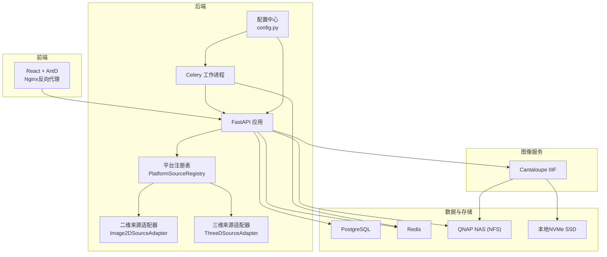
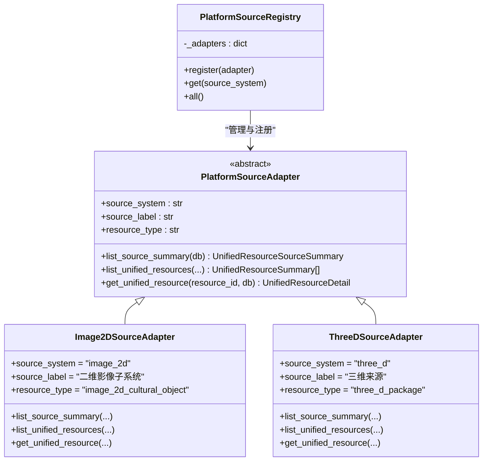
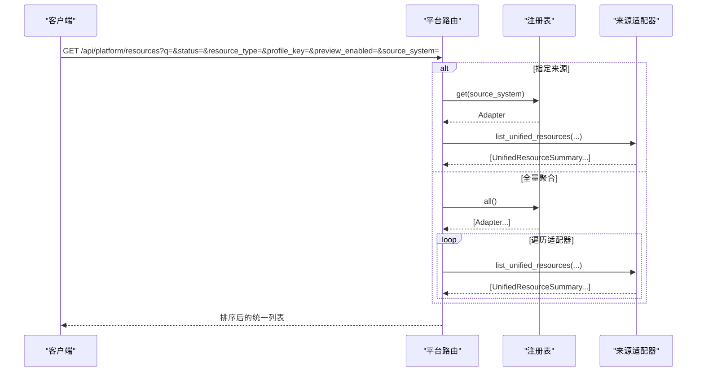
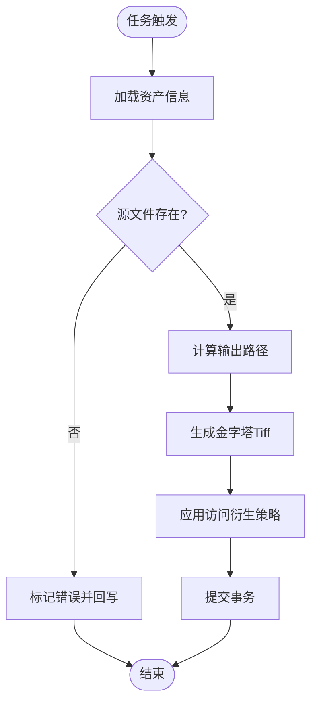
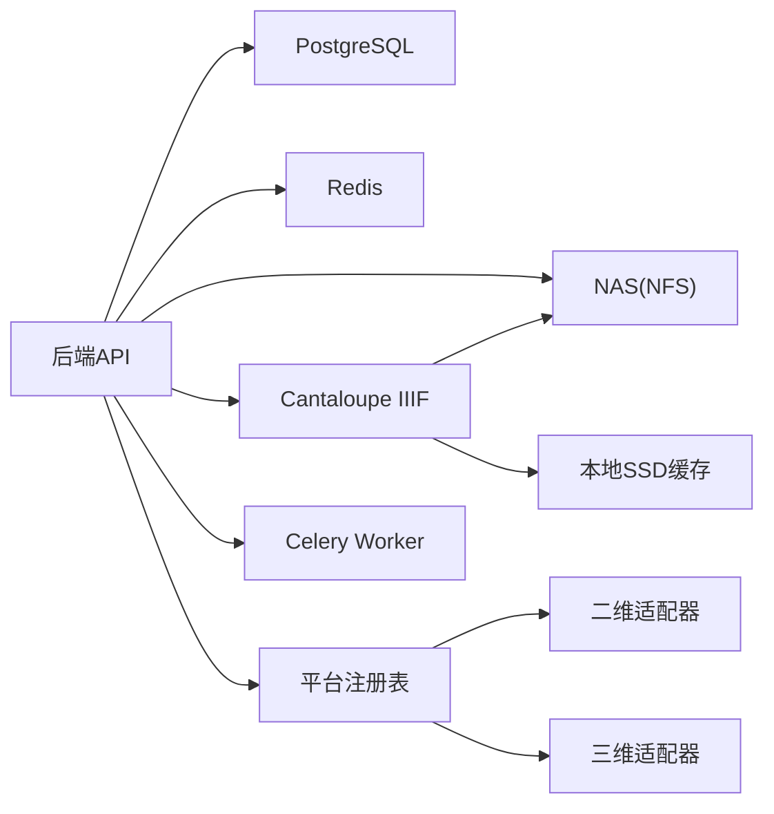
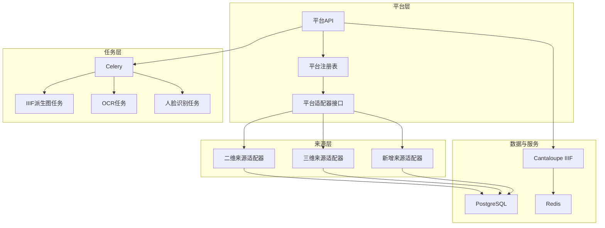

# 扩展性设计

<cite>
**本文引用的文件**
- [backend/app/main.py](file://backend/app/main.py)
- [backend/app/config.py](file://backend/app/config.py)
- [backend/app/platform/base.py](file://backend/app/platform/base.py)
- [backend/app/platform/registry.py](file://backend/app/platform/registry.py)
- [backend/app/platform/image_source.py](file://backend/app/platform/image_source.py)
- [backend/app/platform/three_d_source.py](file://backend/app/platform/three_d_source.py)
- [backend/app/routers/platform.py](file://backend/app/routers/platform.py)
- [backend/app/celery_app.py](file://backend/app/celery_app.py)
- [backend/app/tasks.py](file://backend/app/tasks.py)
- [backend/app/models.py](file://backend/app/models.py)
- [backend/app/schemas.py](file://backend/app/schemas.py)
- [docs/02-架构设计/SYSTEM_ARCHITECTURE.md](file://docs/02-架构设计/SYSTEM_ARCHITECTURE.md)
- [docs/02-架构设计/PLATFORM_SOURCE_ADAPTERS.md](file://docs/02-架构设计/PLATFORM_SOURCE_ADAPTERS.md)
</cite>

## 目录
1. [简介](#简介)
2. [项目结构](#项目结构)
3. [核心组件](#核心组件)
4. [架构总览](#架构总览)
5. [详细组件分析](#详细组件分析)
6. [依赖分析](#依赖分析)
7. [性能考虑](#性能考虑)
8. [故障排查指南](#故障排查指南)
9. [结论](#结论)
10. [附录](#附录)

## 简介
本设计文档聚焦于MDAMS原型项目的可扩展性架构与未来发展方向，围绕水平扩展能力、性能优化策略、监控告警机制、扩展点设计（平台适配器模式、插件化架构、模块化设计）展开。同时，结合现有文档与代码，给出元数据提取（libvips、ExifTool集成）、OCR集成（Tesseract + IIIF Annotation）、权限控制（JWT认证、IP授权）、AI智能处理等未来功能扩展计划与实施建议，并提供扩展性架构图与未来路线图，帮助开发者理解系统的演进方向。

## 项目结构
系统采用前后端分离与容器化编排，后端基于FastAPI + SQLAlchemy，平台层通过适配器模式聚合多来源资源；任务处理采用Celery + Redis；图像服务通过Cantaloupe提供IIIF能力；数据库使用PostgreSQL，文件存储采用NAS挂载与本地SSD缓存相结合的混合存储架构。

图表来源
- [docs/02-架构设计/SYSTEM_ARCHITECTURE.md:22-34](file://docs/02-架构设计/SYSTEM_ARCHITECTURE.md#L22-L34)
- [backend/app/main.py:64-86](file://backend/app/main.py#L64-L86)
- [backend/app/config.py:42-46](file://backend/app/config.py#L42-L46)
- [backend/app/platform/registry.py:8-22](file://backend/app/platform/registry.py#L8-L22)
- [backend/app/platform/image_source.py:196-227](file://backend/app/platform/image_source.py#L196-L227)
- [backend/app/platform/three_d_source.py:192-223](file://backend/app/platform/three_d_source.py#L192-L223)
- [backend/app/celery_app.py:5-15](file://backend/app/celery_app.py#L5-L15)

章节来源
- [docs/02-架构设计/SYSTEM_ARCHITECTURE.md:1-119](file://docs/02-架构设计/SYSTEM_ARCHITECTURE.md#L1-L119)
- [backend/app/main.py:1-86](file://backend/app/main.py#L1-L86)
- [backend/app/config.py:1-72](file://backend/app/config.py#L1-L72)

## 核心组件
- 平台适配器与注册表：通过抽象基类定义统一接口，注册表集中管理适配器实例，平台路由按需调用，实现“多来源统一聚合”的扩展点。
- 任务系统：Celery + Redis负责异步任务编排，如IIIF派生图生成、PSB转大图、人脸识别等，便于水平扩展与资源隔离。
- 配置中心：集中管理数据库、Redis、上传目录、Cantaloupe公共URL、AI服务（OpenAI/Moonshot）等环境变量，支持多环境切换与特性开关。
- 数据模型与序列化：统一的Pydantic模型与SQLAlchemy模型支撑平台聚合、详情拼装与对外输出。

章节来源
- [backend/app/platform/base.py:14-42](file://backend/app/platform/base.py#L14-L42)
- [backend/app/platform/registry.py:8-22](file://backend/app/platform/registry.py#L8-L22)
- [backend/app/routers/platform.py:1-65](file://backend/app/routers/platform.py#L1-L65)
- [backend/app/celery_app.py:1-19](file://backend/app/celery_app.py#L1-L19)
- [backend/app/tasks.py:1-262](file://backend/app/tasks.py#L1-L262)
- [backend/app/config.py:1-72](file://backend/app/config.py#L1-L72)
- [backend/app/models.py:1-307](file://backend/app/models.py#L1-L307)
- [backend/app/schemas.py:147-177](file://backend/app/schemas.py#L147-L177)

## 架构总览
平台适配器模式是系统扩展性的关键：平台路由仅负责调度与聚合，具体来源（二维图像、三维模型）通过各自的适配器实现“来源摘要、统一列表、统一详情”。新增来源只需实现适配器并注册，即可自动纳入平台聚合。

图表来源
- [backend/app/platform/base.py:14-42](file://backend/app/platform/base.py#L14-L42)
- [backend/app/platform/registry.py:8-22](file://backend/app/platform/registry.py#L8-L22)
- [backend/app/platform/image_source.py:196-227](file://backend/app/platform/image_source.py#L196-L227)
- [backend/app/platform/three_d_source.py:192-223](file://backend/app/platform/three_d_source.py#L192-L223)

章节来源
- [docs/02-架构设计/PLATFORM_SOURCE_ADAPTERS.md:1-122](file://docs/02-架构设计/PLATFORM_SOURCE_ADAPTERS.md#L1-L122)
- [backend/app/platform/base.py:1-42](file://backend/app/platform/base.py#L1-L42)
- [backend/app/platform/registry.py:1-24](file://backend/app/platform/registry.py#L1-L24)
- [backend/app/platform/image_source.py:1-228](file://backend/app/platform/image_source.py#L1-L228)
- [backend/app/platform/three_d_source.py:1-224](file://backend/app/platform/three_d_source.py#L1-L224)
- [backend/app/routers/platform.py:1-65](file://backend/app/routers/platform.py#L1-L65)

## 详细组件分析

### 平台适配器与注册表
- 适配器抽象：定义统一的来源摘要、统一列表、统一详情三类能力，确保平台层与来源内部业务解耦。
- 注册表：集中注册与发现适配器，平台路由按来源系统或全量聚合调用。
- 路由聚合：平台路由支持来源过滤、全文检索、状态/类型/预览等筛选参数，最终汇总排序返回。

图表来源
- [backend/app/routers/platform.py:20-48](file://backend/app/routers/platform.py#L20-L48)
- [backend/app/platform/registry.py:15-19](file://backend/app/platform/registry.py#L15-L19)
- [backend/app/platform/image_source.py:50-151](file://backend/app/platform/image_source.py#L50-L151)
- [backend/app/platform/three_d_source.py:70-158](file://backend/app/platform/three_d_source.py#L70-L158)

章节来源
- [backend/app/routers/platform.py:1-65](file://backend/app/routers/platform.py#L1-L65)
- [backend/app/platform/registry.py:1-24](file://backend/app/platform/registry.py#L1-L24)
- [backend/app/platform/base.py:1-42](file://backend/app/platform/base.py#L1-L42)
- [backend/app/platform/image_source.py:1-228](file://backend/app/platform/image_source.py#L1-L228)
- [backend/app/platform/three_d_source.py:1-224](file://backend/app/platform/three_d_source.py#L1-L224)

### 任务系统与异步处理
- Celery配置：以Redis作为Broker与Backend，任务模块include app.tasks，设置结果过期时间。
- 代表性任务：
  - 生成IIIF访问派生图：读取资产、生成金字塔Tiff、应用访问衍生规则、回写状态。
  - PSB转大图：复用上述任务。
  - 业务活动人脸识别人像：根据配置开关与阈值，调用人脸识别客户端，归并结果到记录与资产元数据层。

图表来源
- [backend/app/tasks.py:151-182](file://backend/app/tasks.py#L151-L182)
- [backend/app/celery_app.py:5-15](file://backend/app/celery_app.py#L5-L15)

章节来源
- [backend/app/celery_app.py:1-19](file://backend/app/celery_app.py#L1-L19)
- [backend/app/tasks.py:1-262](file://backend/app/tasks.py#L1-L262)

### 配置中心与环境管理
- 配置项覆盖顺序：优先使用环境变量，其次回退默认值；支持数据库连接、Redis、上传目录、Cantaloupe公共URL、AI服务（OpenAI/Moonshot兼容）、人脸识别开关与参数等。
- 特性开关：例如人脸识别启用标志、提供方、超时、阈值、模型根目录等，便于灰度与降级。

章节来源
- [backend/app/config.py:1-72](file://backend/app/config.py#L1-L72)

### 数据模型与序列化
- 统一响应模型：平台来源摘要、统一资源摘要/详情、资产详情、三维详情等，保证跨来源输出一致性。
- 数据模型：资产、图像记录、三维资产、用户与角色、应用与条目等，支撑平台聚合与业务流转。

章节来源
- [backend/app/schemas.py:147-177](file://backend/app/schemas.py#L147-L177)
- [backend/app/schemas.py:121-144](file://backend/app/schemas.py#L121-L144)
- [backend/app/schemas.py:571-601](file://backend/app/schemas.py#L571-L601)
- [backend/app/models.py:1-307](file://backend/app/models.py#L1-L307)

## 依赖分析
- 组件内聚与解耦：
  - 平台层与来源层通过适配器接口解耦，新增来源无需修改平台路由。
  - 任务层与业务层通过Celery解耦，便于水平扩展与资源隔离。
- 外部依赖：
  - 数据库：PostgreSQL（本地SSD）。
  - 缓存/队列：Redis（Broker/Backend）。
  - 文件存储：NAS（NFS），本地SSD缓存IIIF瓦片。
  - 图像服务：Cantaloupe IIIF。
  - 配置：环境变量与本地.env加载策略。

图表来源
- [docs/02-架构设计/SYSTEM_ARCHITECTURE.md:22-34](file://docs/02-架构设计/SYSTEM_ARCHITECTURE.md#L22-L34)
- [backend/app/config.py:42-46](file://backend/app/config.py#L42-L46)
- [backend/app/platform/registry.py:8-22](file://backend/app/platform/registry.py#L8-L22)

章节来源
- [docs/02-架构设计/SYSTEM_ARCHITECTURE.md:1-119](file://docs/02-架构设计/SYSTEM_ARCHITECTURE.md#L1-L119)
- [backend/app/config.py:1-72](file://backend/app/config.py#L1-L72)
- [backend/app/platform/registry.py:1-24](file://backend/app/platform/registry.py#L1-L24)

## 性能考虑
- 存储与缓存
  - 混合存储：热数据（缩略图、瓦片）走本地SSD，冷数据（原始TIFF/PSB）走NAS，降低IO压力。
  - Cantaloupe缓存：禁用堆内存缓存，依赖文件系统缓存，适配低内存硬件。
- 上传与处理
  - 流式上传：64KB分块写入，避免大文件内存峰值。
  - 异步处理：IIIF派生图、PSB转大图、人脸识别等放入Celery队列，提升吞吐与稳定性。
- 数据库与索引
  - SQLite兼容性初始化：自动添加新列与索引，保障演进中的Schema兼容。
  - 关键字段建立索引（如visibility_scope、collection_object_id、image_record_id等），减少查询成本。
- 并发与资源管理
  - 前端构建针对N100内存限制进行堆栈上限调整，后端任务并发由Celery worker数量与队列承载决定。
  - 通过环境变量控制AI服务超时与模型参数，避免长尾阻塞。

章节来源
- [docs/02-架构设计/SYSTEM_ARCHITECTURE.md:55-68](file://docs/02-架构设计/SYSTEM_ARCHITECTURE.md#L55-L68)
- [backend/app/main.py:21-60](file://backend/app/main.py#L21-L60)
- [backend/app/models.py:9-26](file://backend/app/models.py#L9-L26)
- [backend/app/config.py:58-72](file://backend/app/config.py#L58-L72)

## 故障排查指南
- 任务失败与状态回写
  - 生成IIIF派生图失败时，将资产状态置为error并写入错误信息到元数据层，便于定位问题。
- 人脸识别异常
  - 客户端错误与未知异常均会记录失败状态并回写到记录与资产元数据，便于审计与重试。
- 平台路由异常
  - 对未知资源ID与未找到资源进行明确的HTTP状态码返回，便于前端与网关层处理。

章节来源
- [backend/app/tasks.py:23-44](file://backend/app/tasks.py#L23-L44)
- [backend/app/tasks.py:236-261](file://backend/app/tasks.py#L236-L261)
- [backend/app/routers/platform.py:51-65](file://backend/app/routers/platform.py#L51-L65)

## 结论
MDAMS原型通过平台适配器模式实现了“多来源统一聚合”的扩展点，配合Celery异步任务与混合存储架构，在低功耗硬件上实现了IIIF高清图像服务能力。未来可在元数据提取、OCR叠加、权限控制与AI智能处理等方面持续演进，借助现有扩展点与配置中心，快速迭代并保持系统稳定。

## 附录

### 未来功能扩展计划与实施建议
- 元数据提取（libvips、ExifTool集成）
  - 在上传后或派生图生成前，增加libvips/ExifTool解析步骤，补充物理尺寸、色彩空间、拍摄参数等技术元数据，写入资产/记录元数据层。
  - 与现有元数据分层体系对接，确保统一输出。
- OCR集成（Tesseract + IIIF Annotation）
  - 使用Tesseract对图像进行OCR，生成文本层并以IIIF Annotation形式叠加在Manifest中，支持搜索与标注。
  - 可作为Celery任务异步执行，避免阻塞主线程。
- 权限控制（JWT认证、IP授权）
  - 引入JWT认证上下文，结合用户角色与集合范围，控制资源可见性与下载权限。
  - IP白名单/黑名单策略可与Cantaloupe访问控制联动，实现细粒度授权。
- AI智能处理
  - 基于Moonshot/OpenAI能力，扩展图像描述、标签生成、内容审核等AI能力，统一接入任务系统与元数据层。

章节来源
- [docs/02-架构设计/SYSTEM_ARCHITECTURE.md:114-119](file://docs/02-架构设计/SYSTEM_ARCHITECTURE.md#L114-L119)
- [backend/app/config.py:48-58](file://backend/app/config.py#L48-L58)

### 扩展性架构图（概念示意）

[此图为概念示意，不对应具体源文件，故无图表来源]