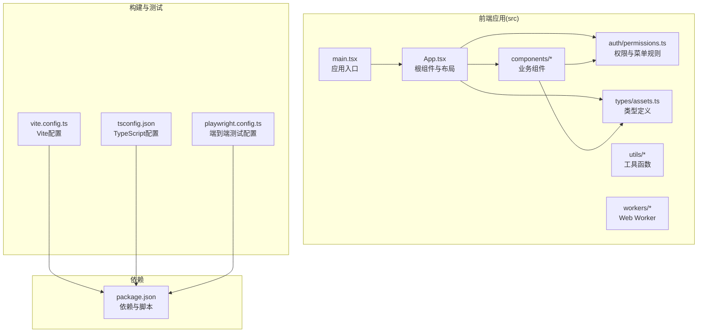
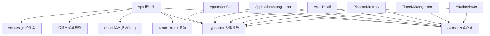
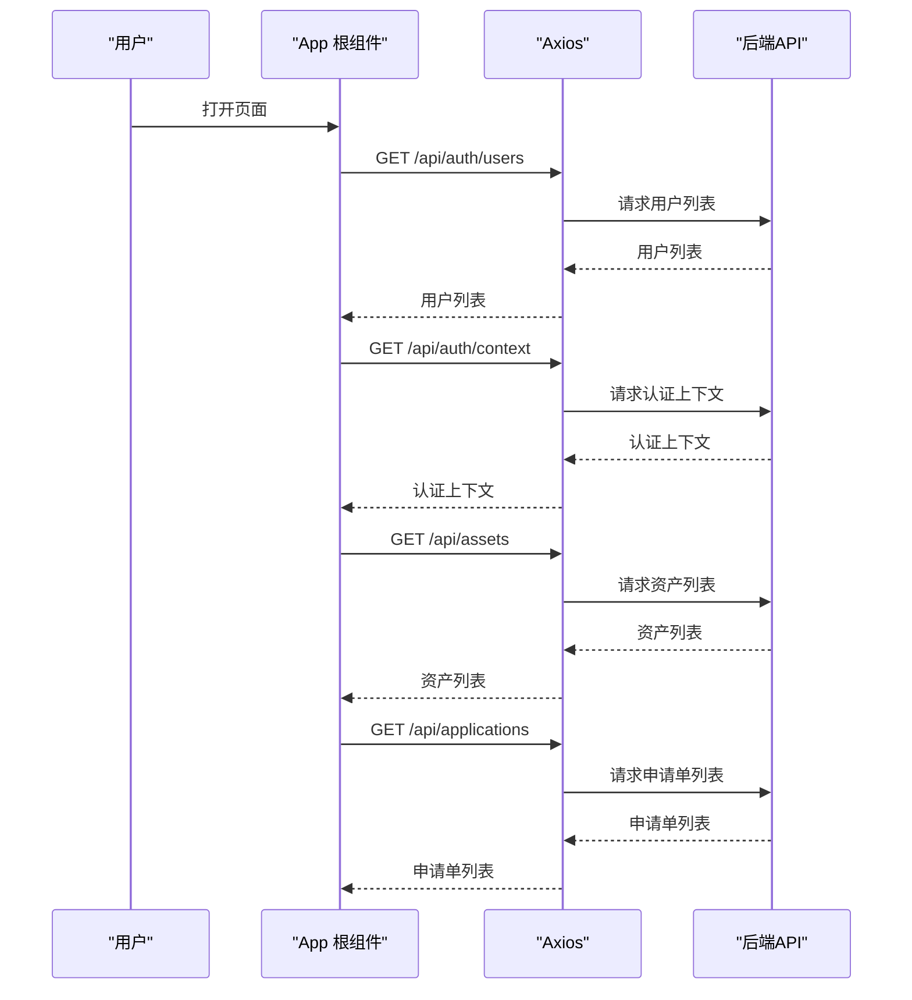
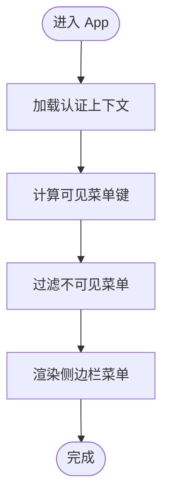
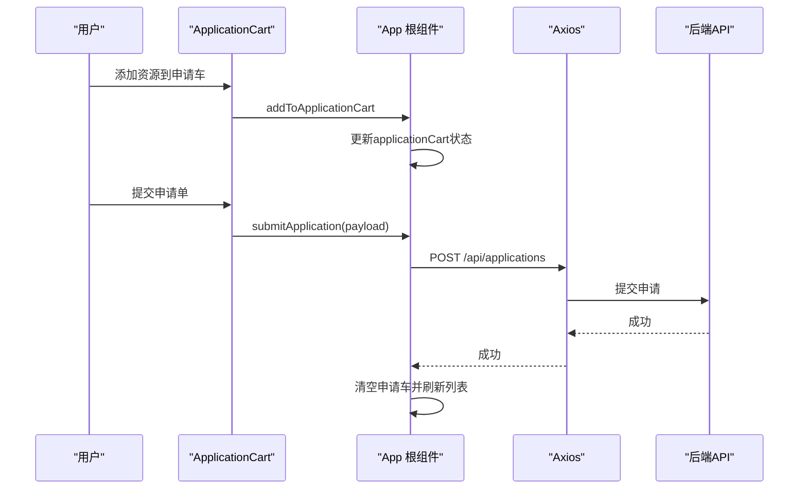
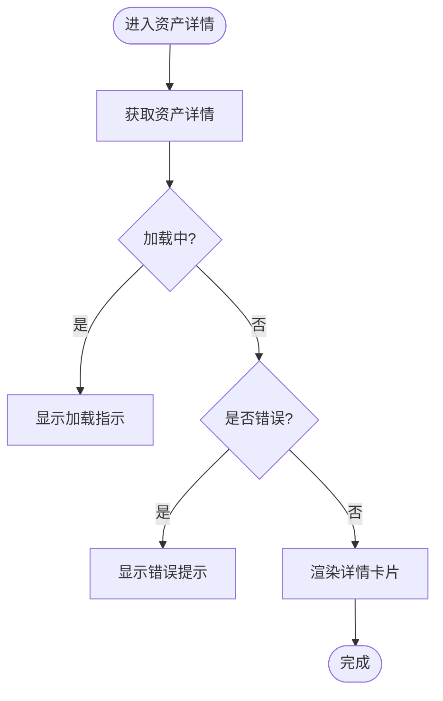
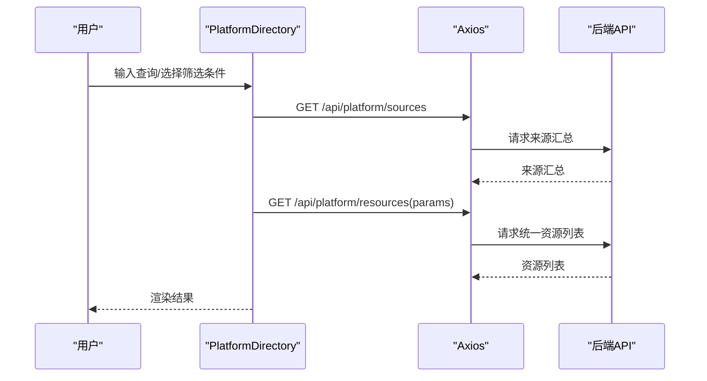
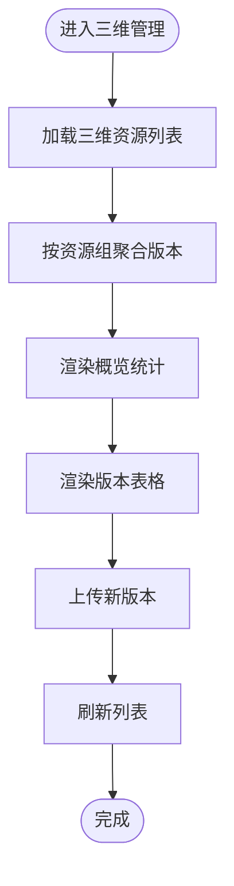
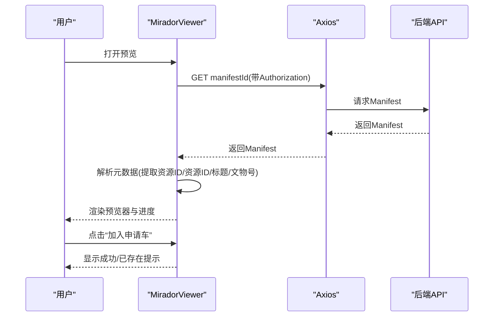
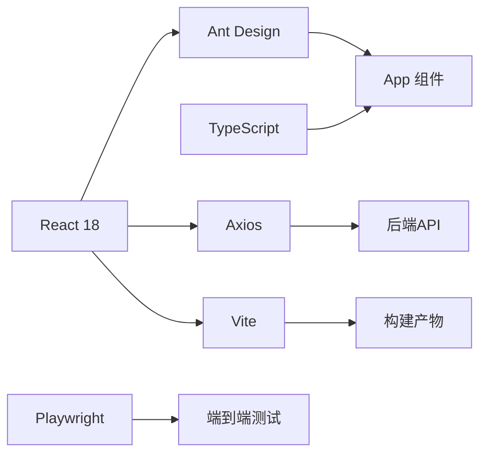

# 前端架构设计

<cite>
**本文档引用的文件**
- [frontend/package.json](file://frontend/package.json)
- [frontend/vite.config.ts](file://frontend/vite.config.ts)
- [frontend/tsconfig.json](file://frontend/tsconfig.json)
- [frontend/src/main.tsx](file://frontend/src/main.tsx)
- [frontend/src/App.tsx](file://frontend/src/App.tsx)
- [frontend/src/auth/permissions.ts](file://frontend/src/auth/permissions.ts)
- [frontend/src/types/assets.ts](file://frontend/src/types/assets.ts)
- [frontend/src/components/ApplicationCart.tsx](file://frontend/src/components/ApplicationCart.tsx)
- [frontend/src/components/ApplicationManagement.tsx](file://frontend/src/components/ApplicationManagement.tsx)
- [frontend/src/components/AssetDetail.tsx](file://frontend/src/components/AssetDetail.tsx)
- [frontend/src/components/PlatformDirectory.tsx](file://frontend/src/components/PlatformDirectory.tsx)
- [frontend/src/components/ThreeDManagement.tsx](file://frontend/src/components/ThreeDManagement.tsx)
- [frontend/src/MiradorViewer.tsx](file://frontend/src/MiradorViewer.tsx)
- [frontend/playwright.config.ts](file://frontend/playwright.config.ts)
</cite>

## 目录
1. [引言](#引言)
2. [项目结构](#项目结构)
3. [核心组件](#核心组件)
4. [架构总览](#架构总览)
5. [详细组件分析](#详细组件分析)
6. [依赖分析](#依赖分析)
7. [性能考虑](#性能考虑)
8. [故障排除指南](#故障排除指南)
9. [结论](#结论)
10. [附录](#附录)

## 引言
本文件面向MDAMS原型项目的前端团队与相关利益方，系统性阐述基于React 18 + TypeScript + Vite + Ant Design的前端架构设计。文档覆盖整体架构、组件层次、状态管理、路由与导航、API客户端、构建优化、类型系统、组件通信与事件处理、错误处理与边界控制等关键主题，并结合N100服务器的资源约束提出针对性优化建议。

## 项目结构
前端采用模块化组织，围绕功能域划分组件与类型定义，配合Vite进行快速开发与生产构建。核心目录与职责如下：
- src：应用源码
  - auth：权限与菜单规则
  - components：页面级与业务组件
  - types：全局类型定义
  - workers：Web Worker（如哈希计算）
  - utils：通用工具函数
  - 主入口：main.tsx、App.tsx
- 构建与测试：vite.config.ts、tsconfig.json、playwright.config.ts
- 依赖与脚本：package.json

图表来源
- [frontend/src/main.tsx:1-11](file://frontend/src/main.tsx#L1-L11)
- [frontend/src/App.tsx:1-905](file://frontend/src/App.tsx#L1-L905)
- [frontend/src/auth/permissions.ts:1-111](file://frontend/src/auth/permissions.ts#L1-L111)
- [frontend/src/types/assets.ts:1-621](file://frontend/src/types/assets.ts#L1-L621)
- [frontend/vite.config.ts:1-42](file://frontend/vite.config.ts#L1-L42)
- [frontend/tsconfig.json:1-23](file://frontend/tsconfig.json#L1-L23)
- [frontend/playwright.config.ts:1-36](file://frontend/playwright.config.ts#L1-L36)
- [frontend/package.json:1-42](file://frontend/package.json#L1-L42)

章节来源
- [frontend/src/main.tsx:1-11](file://frontend/src/main.tsx#L1-L11)
- [frontend/src/App.tsx:1-905](file://frontend/src/App.tsx#L1-L905)
- [frontend/vite.config.ts:1-42](file://frontend/vite.config.ts#L1-L42)
- [frontend/tsconfig.json:1-23](file://frontend/tsconfig.json#L1-L23)
- [frontend/playwright.config.ts:1-36](file://frontend/playwright.config.ts#L1-L36)
- [frontend/package.json:1-42](file://frontend/package.json#L1-L42)

## 核心组件
- 根组件与布局：App.tsx负责全局状态、菜单可见性、权限判断、侧边栏导航、内容区渲染与预览器弹窗。
- 权限与菜单：permissions.ts定义角色、权限、菜单键与可见性规则，支撑运行时菜单渲染与功能开关。
- 类型系统：assets.ts提供资产、申请、统一资源、三维资源等完整类型定义，贯穿API交互与组件属性。
- 业务组件：
  - ApplicationCart：二维影像申请草稿与提交
  - ApplicationManagement：申请审批与批量导出
  - AssetDetail：资产详情与技术元数据展示
  - PlatformDirectory：统一资源目录检索与跳转
  - ThreeDManagement：三维资源上传、版本管理与Web预览
  - MiradorViewer：IIIF预览器与AI辅助面板
- 构建与测试：Vite配置优化、TypeScript严格模式、Playwright多浏览器端到端测试。

章节来源
- [frontend/src/App.tsx:1-905](file://frontend/src/App.tsx#L1-L905)
- [frontend/src/auth/permissions.ts:1-111](file://frontend/src/auth/permissions.ts#L1-L111)
- [frontend/src/types/assets.ts:1-621](file://frontend/src/types/assets.ts#L1-L621)
- [frontend/src/components/ApplicationCart.tsx:1-131](file://frontend/src/components/ApplicationCart.tsx#L1-L131)
- [frontend/src/components/ApplicationManagement.tsx:1-293](file://frontend/src/components/ApplicationManagement.tsx#L1-L293)
- [frontend/src/components/AssetDetail.tsx:1-488](file://frontend/src/components/AssetDetail.tsx#L1-L488)
- [frontend/src/components/PlatformDirectory.tsx:1-273](file://frontend/src/components/PlatformDirectory.tsx#L1-L273)
- [frontend/src/components/ThreeDManagement.tsx:1-1043](file://frontend/src/components/ThreeDManagement.tsx#L1-L1043)
- [frontend/src/MiradorViewer.tsx:1-399](file://frontend/src/MiradorViewer.tsx#L1-L399)

## 架构总览
前端采用“容器组件 + 业务组件”的分层设计，App作为顶层容器协调状态与导航；各业务组件封装自身数据获取与UI逻辑；Ant Design提供一致的UI与交互体验；Vite提供快速开发与产物优化；TypeScript确保类型安全。

图表来源
- [frontend/src/App.tsx:1-905](file://frontend/src/App.tsx#L1-L905)
- [frontend/src/components/ApplicationCart.tsx:1-131](file://frontend/src/components/ApplicationCart.tsx#L1-L131)
- [frontend/src/components/ApplicationManagement.tsx:1-293](file://frontend/src/components/ApplicationManagement.tsx#L1-L293)
- [frontend/src/components/AssetDetail.tsx:1-488](file://frontend/src/components/AssetDetail.tsx#L1-L488)
- [frontend/src/components/PlatformDirectory.tsx:1-273](file://frontend/src/components/PlatformDirectory.tsx#L1-L273)
- [frontend/src/components/ThreeDManagement.tsx:1-1043](file://frontend/src/components/ThreeDManagement.tsx#L1-L1043)
- [frontend/src/MiradorViewer.tsx:1-399](file://frontend/src/MiradorViewer.tsx#L1-L399)
- [frontend/src/auth/permissions.ts:1-111](file://frontend/src/auth/permissions.ts#L1-L111)
- [frontend/src/types/assets.ts:1-621](file://frontend/src/types/assets.ts#L1-L621)

## 详细组件分析

### 应用根组件与状态管理
- 全局状态：应用上下文、用户信息、菜单键、资产列表、申请车、申请单列表、预览器状态等。
- 权限驱动：根据AuthContext动态计算可见菜单与按钮权限，避免无权限操作。
- 生命周期：启动时读取本地Token、拉取用户列表与认证上下文；定时刷新处理中的资产状态。
- API客户端：统一通过Axios发起请求，自动注入Authorization头；对错误进行提示与降级处理。
- 预览器：在全屏遮罩层内嵌入MiradorViewer，支持加入申请车与AI辅助面板。

图表来源
- [frontend/src/App.tsx:150-205](file://frontend/src/App.tsx#L150-L205)
- [frontend/src/App.tsx:213-251](file://frontend/src/App.tsx#L213-L251)
- [frontend/src/App.tsx:233-245](file://frontend/src/App.tsx#L233-L245)

章节来源
- [frontend/src/App.tsx:100-905](file://frontend/src/App.tsx#L100-L905)

### 权限与菜单系统
- 角色与权限枚举：roles、permissions定义清晰的授权维度。
- 菜单可见性：通过getVisibleMenuKeys与canAccessMenu计算当前用户可见菜单。
- 菜单键到权限映射：MENU_PERMISSION_RULES将菜单键与权限集合关联，便于统一控制。

图表来源
- [frontend/src/auth/permissions.ts:100-102](file://frontend/src/auth/permissions.ts#L100-L102)
- [frontend/src/App.tsx:116-123](file://frontend/src/App.tsx#L116-L123)

章节来源
- [frontend/src/auth/permissions.ts:1-111](file://frontend/src/auth/permissions.ts#L1-111)
- [frontend/src/App.tsx:116-139](file://frontend/src/App.tsx#L116-L139)

### 二维影像申请流程
- 申请车：支持添加、移除、备注编辑；提交时组装为申请单。
- 申请管理：支持审批、拒绝、批量导出交付包；状态筛选与批量操作。
- 与后端交互：通过Axios调用/api/applications相关接口，统一错误提示。

图表来源
- [frontend/src/components/ApplicationCart.tsx:22-131](file://frontend/src/components/ApplicationCart.tsx#L22-L131)
- [frontend/src/App.tsx:307-345](file://frontend/src/App.tsx#L307-L345)

章节来源
- [frontend/src/components/ApplicationCart.tsx:1-131](file://frontend/src/components/ApplicationCart.tsx#L1-L131)
- [frontend/src/components/ApplicationManagement.tsx:1-293](file://frontend/src/components/ApplicationManagement.tsx#L1-L293)
- [frontend/src/App.tsx:307-402](file://frontend/src/App.tsx#L307-L402)

### 资产详情与技术元数据
- 数据加载：按需加载资产详情，处理loading与错误场景。
- 生命周期与处理时间线：以列表形式展示处理过程与状态。
- 文件结构与衍生文件：主文件、原始文件与衍生文件的展示与下载。
- 技术元数据与分层元数据：按核心、管理、技术、类型专属与原始元数据分区块展示。
- 访问与输出：提供Mirador预览、查看IIIF Manifest、下载当前文件与BagIt包。

图表来源
- [frontend/src/components/AssetDetail.tsx:194-261](file://frontend/src/components/AssetDetail.tsx#L194-L261)

章节来源
- [frontend/src/components/AssetDetail.tsx:1-488](file://frontend/src/components/AssetDetail.tsx#L1-L488)

### 统一资源目录与来源汇总
- 多维筛选：查询词、状态、预览能力、资源类型、模板类型。
- 来源汇总：展示各子系统来源的资源数量与健康状态。
- 列表展示：统一资源ID、来源、标题、模板、状态、更新时间与操作按钮。

图表来源
- [frontend/src/components/PlatformDirectory.tsx:45-76](file://frontend/src/components/PlatformDirectory.tsx#L45-L76)
- [frontend/src/components/PlatformDirectory.tsx:155-273](file://frontend/src/components/PlatformDirectory.tsx#L155-L273)

章节来源
- [frontend/src/components/PlatformDirectory.tsx:1-273](file://frontend/src/components/PlatformDirectory.tsx#L1-L273)

### 三维资源管理
- 数字对象聚合：按资源组聚合版本，支持当前版本、Web预览版本与最新版本识别。
- 上传表单：支持模型、点云、倾斜摄影文件上传，以及元数据填写。
- 版本管理：表格展示版本标签、Web展示状态、文件数、状态与操作。
- 测试模型：内置示例模型，便于快速验证Web预览能力。

图表来源
- [frontend/src/components/ThreeDManagement.tsx:142-324](file://frontend/src/components/ThreeDManagement.tsx#L142-L324)
- [frontend/src/components/ThreeDManagement.tsx:523-800](file://frontend/src/components/ThreeDManagement.tsx#L523-L800)

章节来源
- [frontend/src/components/ThreeDManagement.tsx:1-1043](file://frontend/src/components/ThreeDManagement.tsx#L1-L1043)

### IIIF预览器与AI辅助
- 预览器：加载IIIF Manifest，解析元数据提取资源ID、资源ID、标题、文物号等，用于申请车集成。
- 认证透传：对/api与/auth路径自动附加Authorization头，保障受保护资源访问。
- 进度与统计：显示加载阶段、进度百分比与耗时统计，提升用户体验。
- AI辅助：与MiradorAiPanel协作，支持AI动作规划与执行。

图表来源
- [frontend/src/MiradorViewer.tsx:64-271](file://frontend/src/MiradorViewer.tsx#L64-L271)
- [frontend/src/MiradorViewer.tsx:387-394](file://frontend/src/MiradorViewer.tsx#L387-L394)

章节来源
- [frontend/src/MiradorViewer.tsx:1-399](file://frontend/src/MiradorViewer.tsx#L1-L399)

## 依赖分析
- React 18：并发特性与严格模式，提升渲染性能与开发体验。
- Ant Design：提供丰富UI组件与国际化支持，统一交互规范。
- Axios：HTTP客户端，统一拦截器与错误处理。
- Mirador：IIIF阅读器，支持自定义请求处理器与鉴权头透传。
- Three.js + @google/model-viewer：三维资源Web预览与展示。
- Vite：快速开发服务器、代理、代码分割与产物优化。
- TypeScript：强类型保障，减少运行时错误。
- Playwright：跨浏览器端到端测试，CI友好。

图表来源
- [frontend/package.json:13-26](file://frontend/package.json#L13-L26)
- [frontend/package.json:27-39](file://frontend/package.json#L27-L39)
- [frontend/vite.config.ts:1-42](file://frontend/vite.config.ts#L1-L42)
- [frontend/tsconfig.json:1-23](file://frontend/tsconfig.json#L1-L23)
- [frontend/playwright.config.ts:1-36](file://frontend/playwright.config.ts#L1-L36)

章节来源
- [frontend/package.json:1-42](file://frontend/package.json#L1-L42)
- [frontend/vite.config.ts:1-42](file://frontend/vite.config.ts#L1-L42)
- [frontend/tsconfig.json:1-23](file://frontend/tsconfig.json#L1-L23)
- [frontend/playwright.config.ts:1-36](file://frontend/playwright.config.ts#L1-L36)

## 性能考虑
- 代码分割与懒加载
  - Vite配置通过manualChunks将React、Ant Design、Mirador等第三方库拆分为独立chunk，降低重复打包与缓存命中成本。
  - 建议：对大型组件（如三维管理、统一资源目录）进一步按路由拆分，结合React.lazy实现按需加载。
- 构建优化
  - 目标环境设为esnext，充分利用现代浏览器特性。
  - 关闭Source Map以减小产物体积，生产环境谨慎开启。
  - 调整chunkSizeWarningLimit，避免大chunk导致警告干扰。
- 内存与渲染优化
  - 使用React.memo与useMemo/useCallback减少重渲染。
  - 表格与长列表使用虚拟滚动（如可引入相关库），降低DOM节点数量。
  - 及时清理定时器与事件监听器，避免内存泄漏。
- 网络与缓存
  - 对静态资源启用长效缓存策略，合理设置ETag/Cache-Control。
  - 对API响应进行轻量缓存（如查询结果缓存），减少重复请求。
- N100服务器优化要点
  - 控制并发请求数量，避免同时触发大量大图加载。
  - 预览器首次加载优先低分辨率，再异步生成高清切片，缩短首屏时间。
  - 限制同时打开的预览器实例数量，避免内存峰值过高。

章节来源
- [frontend/vite.config.ts:7-21](file://frontend/vite.config.ts#L7-L21)
- [frontend/src/App.tsx:253-263](file://frontend/src/App.tsx#L253-L263)
- [frontend/src/MiradorViewer.tsx:98-197](file://frontend/src/MiradorViewer.tsx#L98-L197)

## 故障排除指南
- 登录与认证
  - 若本地Token无效，应用会清除Token并重置状态；检查后端认证接口与CORS配置。
  - 建议：增加登录失败次数限制与更详细的错误提示。
- 预览器加载失败
  - 检查Manifest URL与鉴权头是否正确附加；确认后端IIIF服务可达。
  - 建议：在网络错误时显示重试按钮与详细错误信息。
- 申请提交失败
  - 捕获Axios错误并提示用户；记录错误日志以便排查。
  - 建议：对必填字段进行前端校验，减少无效请求。
- 三维资源上传失败
  - 检查文件类型与大小限制；确认multipart/form-data头部设置。
  - 建议：上传进度反馈与断点续传（如需要）。
- 端到端测试
  - Playwright配置包含多浏览器设备，确保在不同环境下稳定运行。
  - 建议：在CI中启用重试与trace收集，便于定位问题。

章节来源
- [frontend/src/App.tsx:166-181](file://frontend/src/App.tsx#L166-L181)
- [frontend/src/MiradorViewer.tsx:253-261](file://frontend/src/MiradorViewer.tsx#L253-L261)
- [frontend/src/components/ApplicationCart.tsx:55-64](file://frontend/src/components/ApplicationCart.tsx#L55-L64)
- [frontend/src/components/ThreeDManagement.tsx:213-248](file://frontend/src/components/ThreeDManagement.tsx#L213-L248)
- [frontend/playwright.config.ts:15-35](file://frontend/playwright.config.ts#L15-L35)

## 结论
本架构以React 18为核心，结合TypeScript强类型与Ant Design一致UI，通过Vite实现高效开发与优化构建，并以权限系统与组件化设计支撑复杂的多子系统业务场景。针对N100服务器的资源约束，已在构建、网络与渲染层面提出优化策略。建议持续完善路由级懒加载、虚拟滚动与缓存策略，进一步提升性能与稳定性。

## 附录
- 开发与测试
  - 开发服务器：Vite dev，端口3000，代理/api、/auth、/iiif至后端。
  - 端到端测试：Playwright多浏览器配置，支持CI运行。
- 类型系统
  - 所有API响应与组件属性均通过assets.ts类型定义约束，确保一致性与可维护性。

章节来源
- [frontend/vite.config.ts:22-41](file://frontend/vite.config.ts#L22-L41)
- [frontend/playwright.config.ts:1-36](file://frontend/playwright.config.ts#L1-L36)
- [frontend/src/types/assets.ts:1-621](file://frontend/src/types/assets.ts#L1-L621)