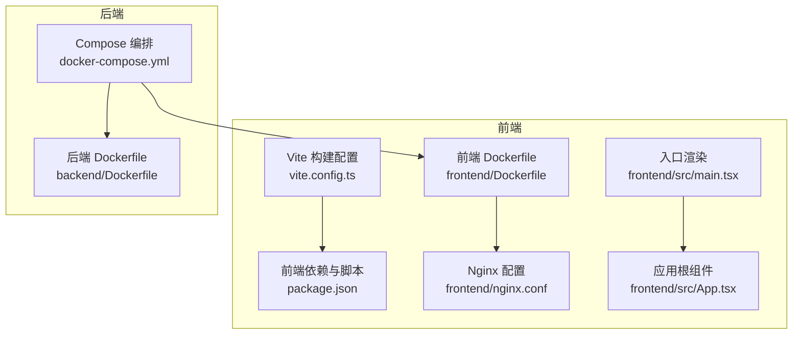
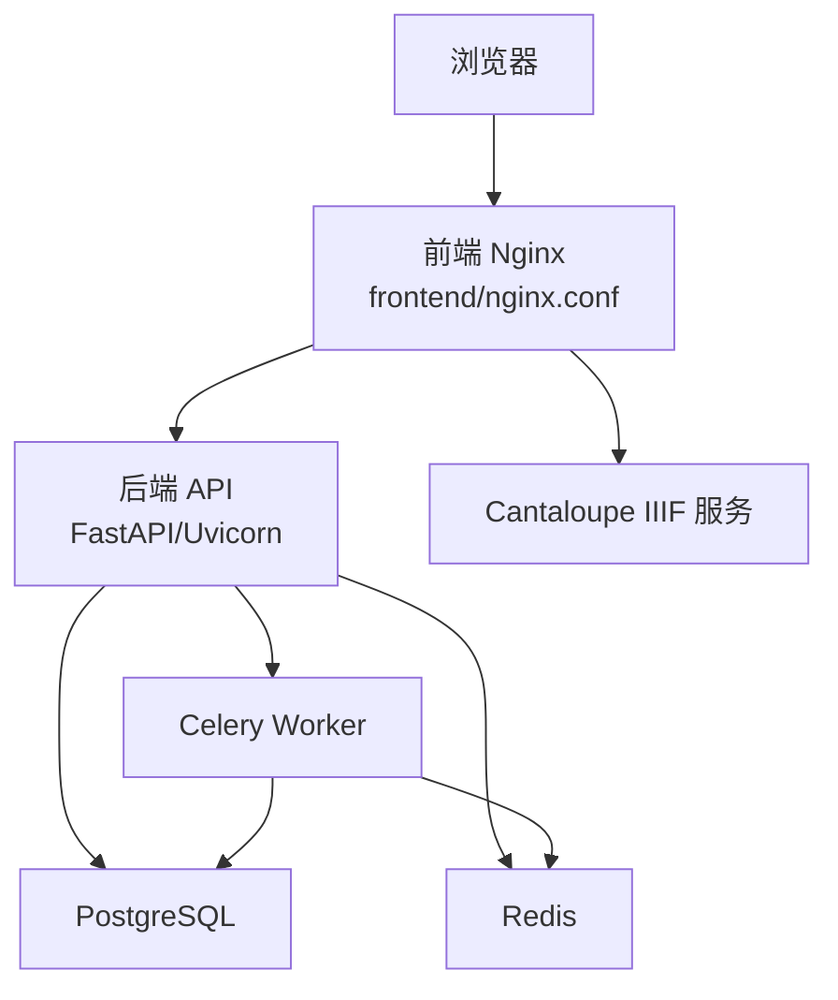
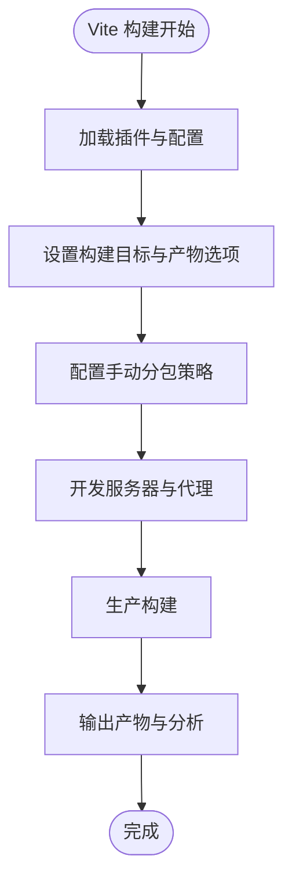
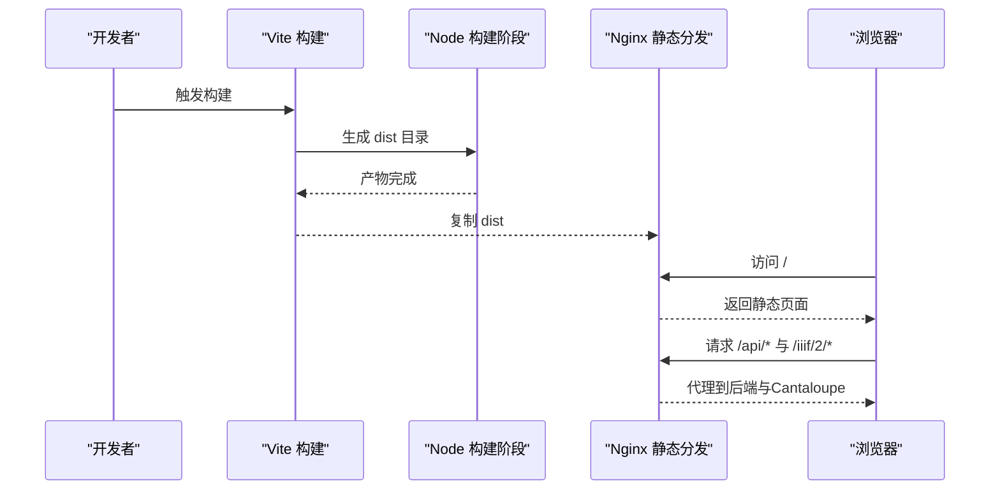
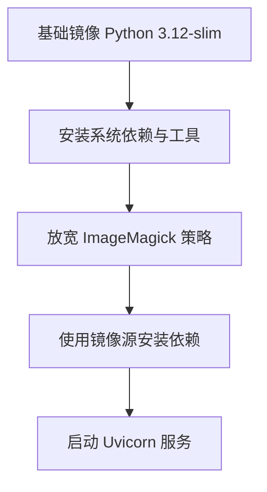
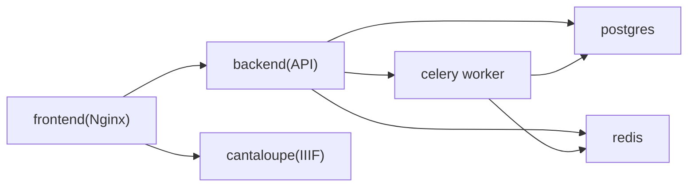
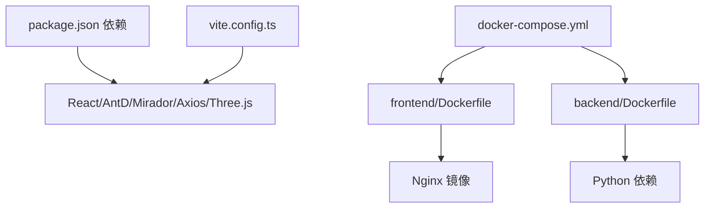

# 构建与性能优化

<cite>
**本文引用的文件**
- [vite.config.ts](file://frontend/vite.config.ts)
- [package.json](file://frontend/package.json)
- [Dockerfile（前端）](file://frontend/Dockerfile)
- [nginx.conf（前端）](file://frontend/nginx.conf)
- [Dockerfile（后端）](file://backend/Dockerfile)
- [docker-compose.yml](file://docker-compose.yml)
- [main.tsx](file://frontend/src/main.tsx)
- [App.tsx](file://frontend/src/App.tsx)
- [playwright.config.ts](file://frontend/playwright.config.ts)
- [SETUP_AND_DEPLOYMENT.md](file://docs/05-部署与运维/SETUP_AND_DEPLOYMENT.md)
- [TROUBLESHOOTING.md](file://docs/05-部署与运维/TROUBLESHOOTING.md)
</cite>

## 目录
1. [简介](#简介)
2. [项目结构](#项目结构)
3. [核心组件](#核心组件)
4. [架构总览](#架构总览)
5. [详细组件分析](#详细组件分析)
6. [依赖分析](#依赖分析)
7. [性能考量](#性能考量)
8. [故障排查指南](#故障排查指南)
9. [结论](#结论)
10. [附录](#附录)

## 简介
本文件聚焦于MDAMS原型项目的构建与性能优化，覆盖前端Vite构建配置优化（开发服务器、生产构建、代码分割）、前端性能优化技术（图片懒加载、组件懒加载、Bundle分析与优化）、Docker容器化部署优化（镜像体积、多阶段构建、缓存策略）、N100服务器环境下的性能调优（内存管理、并发处理、资源限制），以及性能监控与调试工具使用指南。目标是在保证功能完备的前提下，提升构建效率、运行性能与稳定性。

## 项目结构
前端采用Vite + React + TypeScript，后端采用Python/ASGI（Uvicorn + FastAPI），容器编排通过Compose实现；前端使用Nginx作为静态资源与反向代理服务器，统一暴露API与IIIF服务。

图表来源
- [vite.config.ts:1-42](file://frontend/vite.config.ts#L1-L42)
- [package.json:1-42](file://frontend/package.json#L1-L42)
- [nginx.conf:1-33](file://frontend/nginx.conf#L1-L33)
- [Dockerfile（前端）:1-28](file://frontend/Dockerfile#L1-L28)
- [main.tsx:1-11](file://frontend/src/main.tsx#L1-L11)
- [App.tsx:1-905](file://frontend/src/App.tsx#L1-L905)
- [Dockerfile（后端）:1-52](file://backend/Dockerfile#L1-L52)
- [docker-compose.yml:1-131](file://docker-compose.yml#L1-L131)

章节来源
- [vite.config.ts:1-42](file://frontend/vite.config.ts#L1-L42)
- [package.json:1-42](file://frontend/package.json#L1-L42)
- [nginx.conf:1-33](file://frontend/nginx.conf#L1-L33)
- [Dockerfile（前端）:1-28](file://frontend/Dockerfile#L1-L28)
- [Dockerfile（后端）:1-52](file://backend/Dockerfile#L1-L52)
- [docker-compose.yml:1-131](file://docker-compose.yml#L1-L131)
- [main.tsx:1-11](file://frontend/src/main.tsx#L1-L11)
- [App.tsx:1-905](file://frontend/src/App.tsx#L1-L905)

## 核心组件
- Vite构建配置：定义插件、目标环境、产物输出策略、开发服务器与代理、代码分割策略。
- 前端Dockerfile：多阶段构建、Alpine镜像、镜像源优化、构建内存上限设置、Nginx静态分发。
- Nginx配置：静态文件分发、API反向代理、IIIF代理、头部透传与请求体大小设置。
- 后端Dockerfile：系统依赖安装、ImageMagick/Policy放宽、PyPI镜像、JVM参数与熵源映射。
- Compose编排：服务间依赖、端口映射、卷挂载、资源限制、环境变量注入。

章节来源
- [vite.config.ts:1-42](file://frontend/vite.config.ts#L1-L42)
- [package.json:1-42](file://frontend/package.json#L1-L42)
- [Dockerfile（前端）:1-28](file://frontend/Dockerfile#L1-L28)
- [nginx.conf:1-33](file://frontend/nginx.conf#L1-L33)
- [Dockerfile（后端）:1-52](file://backend/Dockerfile#L1-L52)
- [docker-compose.yml:1-131](file://docker-compose.yml#L1-L131)

## 架构总览
前端通过Nginx统一暴露API与IIIF，后端提供REST与异步任务，Cantaloupe提供IIIF图像服务，PostgreSQL存储数据，Redis支撑缓存与Celery队列。

图表来源
- [nginx.conf:1-33](file://frontend/nginx.conf#L1-L33)
- [docker-compose.yml:1-131](file://docker-compose.yml#L1-L131)
- [Dockerfile（后端）:1-52](file://backend/Dockerfile#L1-L52)

章节来源
- [nginx.conf:1-33](file://frontend/nginx.conf#L1-L33)
- [docker-compose.yml:1-131](file://docker-compose.yml#L1-L131)
- [Dockerfile（后端）:1-52](file://backend/Dockerfile#L1-L52)

## 详细组件分析

### Vite构建配置与优化
- 插件与目标：启用React插件，目标为现代浏览器特性集，兼顾低内存设备（N100）。
- 生产构建优化：
  - 关闭SourceMap以减少产物体积与构建时间。
  - 调整警告阈值，避免大包触发告警干扰。
  - Rollup手动分包：将React生态、Ant Design与Mirador分别拆分为独立vendor块，提升缓存命中率与并行下载效率。
- 开发服务器：
  - 开放主机访问，便于局域网联调。
  - 代理规则：将/api、/auth、/iiif转发至后端，简化跨域与统一前缀。
- 建议补充：
  - 引入可视化Bundle分析（如rollup-plugin-visualizer）定位大依赖。
  - 对第三方库进行动态导入（按需加载）以进一步缩小首屏包体。
  - 在CI中开启压缩与哈希命名，确保产物可缓存。

图表来源
- [vite.config.ts:1-42](file://frontend/vite.config.ts#L1-L42)

章节来源
- [vite.config.ts:1-42](file://frontend/vite.config.ts#L1-L42)

### 前端Dockerfile与Nginx配置
- 多阶段构建：第一阶段使用Node-Alpine构建，第二阶段使用Nginx-Alpine提供静态分发，显著减小最终镜像体积。
- 镜像源优化：替换Alpine与NPM镜像源，提升依赖安装速度与可靠性。
- 构建内存限制：通过NODE_OPTIONS设置最大堆内存，缓解N100低内存场景下的构建失败风险。
- Nginx配置要点：
  - 静态文件根目录与索引页。
  - API代理：透传Host、IP与协议头，设置前缀以适配后端路由。
  - IIIF代理：将/iiif/2/转发至Cantaloupe，统一浏览器访问路径。

图表来源
- [Dockerfile（前端）:1-28](file://frontend/Dockerfile#L1-L28)
- [nginx.conf:1-33](file://frontend/nginx.conf#L1-L33)

章节来源
- [Dockerfile（前端）:1-28](file://frontend/Dockerfile#L1-L28)
- [nginx.conf:1-33](file://frontend/nginx.conf#L1-L33)

### 后端Dockerfile与运行参数
- 系统依赖：安装libvips及相关工具，满足图像处理需求。
- ImageMagick策略放宽：提高内存、磁盘、尺寸等阈值，适配大图处理与N100内存约束。
- Python依赖：使用国内镜像源加速安装。
- JVM参数与熵源：为Cantaloupe设置堆大小与熵源映射，改善启动与运行稳定性。

图表来源
- [Dockerfile（后端）:1-52](file://backend/Dockerfile#L1-L52)

章节来源
- [Dockerfile（后端）:1-52](file://backend/Dockerfile#L1-L52)

### Compose编排与资源限制
- 服务依赖：前端依赖后端与Cantaloupe；后端依赖数据库与Redis；Celery Worker依赖后端与Redis。
- 端口映射与环境变量：统一暴露前端端口，后端端口，数据库与Redis端口；Cantaloupe端口；设置API_PUBLIC_URL与CANTALOUPE_PUBLIC_URL。
- 资源限制：数据库容器设置内存上限，避免资源争用。
- 卷挂载：NAS直挂上传目录，保障大文件访问与持久化。

图表来源
- [docker-compose.yml:1-131](file://docker-compose.yml#L1-L131)

章节来源
- [docker-compose.yml:1-131](file://docker-compose.yml#L1-L131)

### 前端性能优化实践
- 图片懒加载：在缩略图组件中启用懒加载，降低初始渲染压力与带宽消耗。
- 组件懒加载：对重型页面（如三维管理、统一资源详情）采用动态导入，缩短首屏加载时间。
- Bundle分析与优化：在开发与CI中引入可视化分析，识别大体积依赖并实施拆分与按需加载。
- 资源缓存：利用Vite的代码分割策略与浏览器缓存，结合Nginx长期缓存策略，提升重复访问性能。

章节来源
- [App.tsx:438-446](file://frontend/src/App.tsx#L438-L446)
- [vite.config.ts:14-18](file://frontend/vite.config.ts#L14-L18)

### 前端测试与调试
- Playwright配置：本地开发时通过webServer启动Vite，统一测试基座；支持多浏览器并行。
- 建议：在CI中启用重试与报告，结合覆盖率与性能指标，形成闭环质量保障。

章节来源
- [playwright.config.ts:1-36](file://frontend/playwright.config.ts#L1-L36)

## 依赖分析
- 前端依赖与脚本：React、Ant Design、Mirador、Axios、Three.js等；脚本包含开发、构建、预览、Lint与测试。
- 容器间耦合：前端通过Nginx代理访问后端与Cantaloupe；后端依赖数据库与Redis；Celery Worker与Redis交互。
- 外部依赖：Alpine镜像源、NPM镜像源、PyPI镜像源，提升构建与安装效率。

图表来源
- [package.json:1-42](file://frontend/package.json#L1-L42)
- [vite.config.ts:1-42](file://frontend/vite.config.ts#L1-L42)
- [Dockerfile（前端）:1-28](file://frontend/Dockerfile#L1-L28)
- [Dockerfile（后端）:1-52](file://backend/Dockerfile#L1-L52)
- [docker-compose.yml:1-131](file://docker-compose.yml#L1-L131)

章节来源
- [package.json:1-42](file://frontend/package.json#L1-L42)
- [vite.config.ts:1-42](file://frontend/vite.config.ts#L1-L42)
- [Dockerfile（前端）:1-28](file://frontend/Dockerfile#L1-L28)
- [Dockerfile（后端）:1-52](file://backend/Dockerfile#L1-L52)
- [docker-compose.yml:1-131](file://docker-compose.yml#L1-L131)

## 性能考量
- N100低内存环境优化：
  - 前端构建：设置NODE_OPTIONS最大堆内存，必要时跳过类型检查以节省内存。
  - 后端图像处理：放宽ImageMagick策略，提升大图处理能力；合理设置libvips并发与磁盘阈值。
  - 容器资源：数据库容器设置内存上限，避免资源争用。
- 并发与限流：
  - 后端Celery并发控制为1，避免高并发对资源造成瞬时压力。
  - Nginx代理设置请求体大小为0（不限制），满足大文件上传场景。
- 缓存策略：
  - 前端：Vendor分包提升缓存命中；Nginx静态资源长期缓存。
  - 后端：Redis缓存热点数据与中间结果。
- 监控与可观测性：
  - 健康检查与就绪检查端点，便于编排与负载均衡。
  - 日志采集与错误追踪，结合测试报告形成闭环。

章节来源
- [Dockerfile（前端）:15-18](file://frontend/Dockerfile#L15-L18)
- [Dockerfile（后端）:31-41](file://backend/Dockerfile#L31-L41)
- [docker-compose.yml:41-41](file://docker-compose.yml#L41-L41)
- [nginx.conf:10-12](file://frontend/nginx.conf#L10-L12)
- [SETUP_AND_DEPLOYMENT.md:155-164](file://docs/05-部署与运维/SETUP_AND_DEPLOYMENT.md#L155-L164)

## 故障排查指南
- 前端无法打开：检查前端容器状态、端口占用、日志输出。
- 后端健康检查失败：访问健康与就绪端点，核对数据库与Redis连接。
- 数据库连接问题：确认容器状态、凭据与连接串、端口占用。
- Redis或Worker异常：检查Redis状态与日志，关注任务队列与并发设置。
- 上传文件找不到：确认宿主机路径映射与可写权限。
- 预览图不显示：检查资产预览生成、后端读取原始文件能力。
- IIIF与Mirador问题：核对CANTALOUPE_PUBLIC_URL、Nginx代理配置与Cantaloupe状态。
- 登录与权限：确认用户存在、默认密码、前端认证上下文获取与权限判定。

章节来源
- [TROUBLESHOOTING.md:1-242](file://docs/05-部署与运维/TROUBLESHOOTING.md#L1-L242)
- [SETUP_AND_DEPLOYMENT.md:1-253](file://docs/05-部署与运维/SETUP_AND_DEPLOYMENT.md#L1-L253)

## 结论
通过Vite的代码分割与开发代理优化、前端多阶段容器化与Nginx统一代理、后端镜像源与图像策略放宽、以及Compose的资源限制与依赖编排，MDAMS原型项目在N100低内存环境下实现了较为稳健的构建与运行。建议持续引入Bundle分析与性能测试，完善缓存与监控策略，以进一步提升用户体验与系统稳定性。

## 附录
- 部署与配置入口：参阅部署文档与环境变量说明，确保本地与服务器环境一致。
- 常见问题与排障：按建议顺序排查，优先查看容器状态与日志。

章节来源
- [SETUP_AND_DEPLOYMENT.md:1-253](file://docs/05-部署与运维/SETUP_AND_DEPLOYMENT.md#L1-L253)
- [TROUBLESHOOTING.md:1-242](file://docs/05-部署与运维/TROUBLESHOOTING.md#L1-L242)