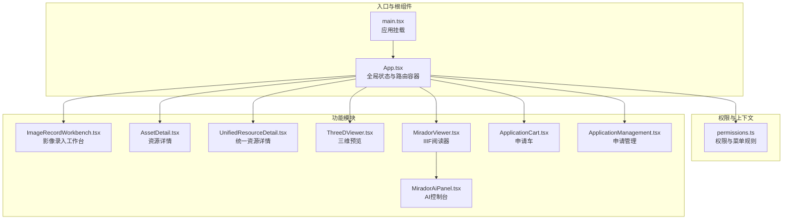
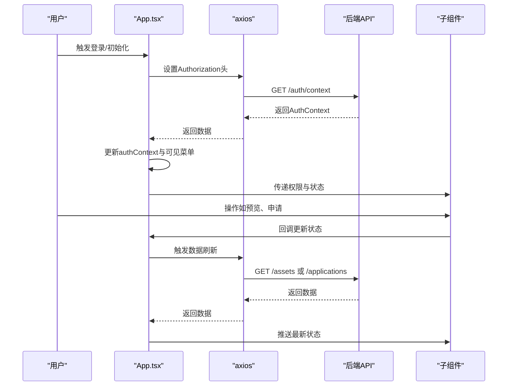
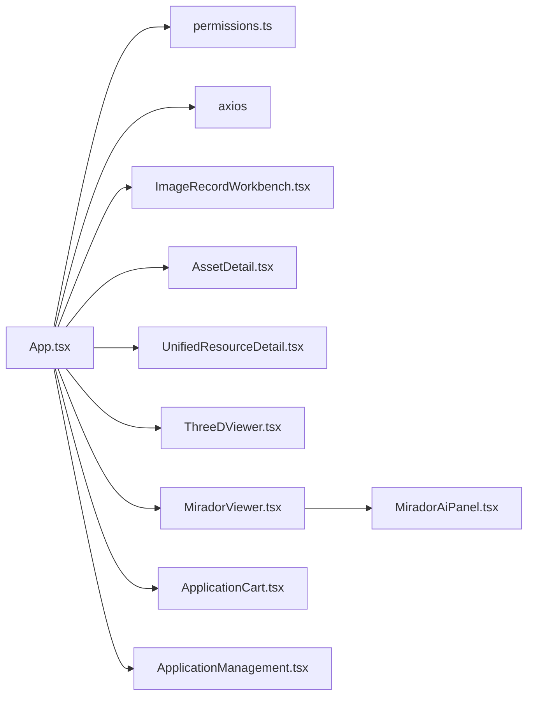

# 状态管理策略

<cite>
**本文档引用的文件**
- [App.tsx](file://frontend/src/App.tsx)
- [main.tsx](file://frontend/src/main.tsx)
- [permissions.ts](file://frontend/src/auth/permissions.ts)
- [ApplicationCart.tsx](file://frontend/src/components/ApplicationCart.tsx)
- [ApplicationManagement.tsx](file://frontend/src/components/ApplicationManagement.tsx)
- [AssetDetail.tsx](file://frontend/src/components/AssetDetail.tsx)
- [ImageRecordWorkbench.tsx](file://frontend/src/components/ImageRecordWorkbench.tsx)
- [UnifiedResourceDetail.tsx](file://frontend/src/components/UnifiedResourceDetail.tsx)
- [ThreeDViewer.tsx](file://frontend/src/components/ThreeDViewer.tsx)
- [MiradorViewer.tsx](file://frontend/src/MiradorViewer.tsx)
- [MiradorAiPanel.tsx](file://frontend/src/MiradorAiPanel.tsx)
- [assets.ts](file://frontend/src/types/assets.ts)
</cite>

## 目录
1. [引言](#引言)
2. [项目结构](#项目结构)
3. [核心组件](#核心组件)
4. [架构总览](#架构总览)
5. [详细组件分析](#详细组件分析)
6. [依赖分析](#依赖分析)
7. [性能考虑](#性能考虑)
8. [故障排查指南](#故障排查指南)
9. [结论](#结论)
10. [附录](#附录)

## 引言
本文件面向MDAMS原型项目的前端状态管理策略，系统性梳理全局状态、局部状态与组件状态的分层设计，深入解析React Hooks在状态管理中的应用模式，覆盖权限状态、用户上下文与应用状态的管理策略，并总结状态持久化方案与最佳实践。文档旨在帮助开发者快速理解与优化状态管理架构，提升可维护性与性能表现。

## 项目结构
前端采用以功能域划分的组织方式，围绕“资源管理、影像预览、三维展示、统一目录、申请管理”等模块构建。状态管理以React Hooks为核心，结合组件内局部状态与跨组件共享状态，形成清晰的分层结构。

图表来源
- [main.tsx:1-11](file://frontend/src/main.tsx#L1-L11)
- [App.tsx:100-205](file://frontend/src/App.tsx#L100-L205)
- [permissions.ts:1-111](file://frontend/src/auth/permissions.ts#L1-L111)
- [ImageRecordWorkbench.tsx:235-380](file://frontend/src/components/ImageRecordWorkbench.tsx#L235-L380)
- [AssetDetail.tsx:194-260](file://frontend/src/components/AssetDetail.tsx#L194-L260)
- [UnifiedResourceDetail.tsx:86-160](file://frontend/src/components/UnifiedResourceDetail.tsx#L86-L160)
- [ThreeDViewer.tsx:31-129](file://frontend/src/components/ThreeDViewer.tsx#L31-L129)
- [MiradorViewer.tsx:64-271](file://frontend/src/MiradorViewer.tsx#L64-L271)
- [MiradorAiPanel.tsx:237-800](file://frontend/src/MiradorAiPanel.tsx#L237-L800)
- [ApplicationCart.tsx:22-131](file://frontend/src/components/ApplicationCart.tsx#L22-L131)
- [ApplicationManagement.tsx:27-293](file://frontend/src/components/ApplicationManagement.tsx#L27-L293)

章节来源
- [main.tsx:1-11](file://frontend/src/main.tsx#L1-L11)
- [App.tsx:100-205](file://frontend/src/App.tsx#L100-L205)

## 核心组件
本项目的核心状态集中在根组件App.tsx中，负责：
- 全局应用状态：资产列表、申请车、申请单、菜单选择、预览开关、加载状态等
- 用户上下文与权限：登录态、角色与权限集合、可见菜单、权限判断
- 生命周期与副作用：初始化加载、定时轮询、本地存储同步、HTTP拦截器注入

章节来源
- [App.tsx:100-205](file://frontend/src/App.tsx#L100-L205)
- [App.tsx:213-251](file://frontend/src/App.tsx#L213-L251)
- [App.tsx:253-263](file://frontend/src/App.tsx#L253-L263)
- [App.tsx:307-402](file://frontend/src/App.tsx#L307-L402)
- [permissions.ts:96-111](file://frontend/src/auth/permissions.ts#L96-L111)

## 架构总览
整体采用“根组件集中管理 + 子组件局部状态”的分层架构。根组件负责全局状态与权限上下文，子组件根据自身职责管理局部状态，通过回调与props向下传递，实现状态的自顶向下流动与必要的跨组件通信。

图表来源
- [App.tsx:140-181](file://frontend/src/App.tsx#L140-L181)
- [App.tsx:160-164](file://frontend/src/App.tsx#L160-L164)
- [App.tsx:213-251](file://frontend/src/App.tsx#L213-L251)
- [App.tsx:307-402](file://frontend/src/App.tsx#L307-L402)

## 详细组件分析

### 全局状态管理（App.tsx）
- 状态定义与初始化
  - 应用级状态：资产列表、申请车、申请单、菜单键、预览开关、加载标志等
  - 用户上下文：AuthContext、可用用户列表、登录态、权限判断结果
- Hook使用模式
  - useState：定义应用级状态
  - useMemo：计算可见菜单、角色标签、权限判断结果，避免重复计算
  - useCallback：封装网络请求与交互逻辑，稳定引用以减少子组件重渲染
  - useEffect：初始化加载、定时轮询、本地存储同步、菜单一致性校验
- 权限与菜单
  - 基于AuthContext与权限规则动态生成可见菜单
  - 通过getVisibleMenuKeys与can函数进行权限判定
- 数据获取与轮询
  - 资产列表与申请单按需加载
  - 处理中资产自动轮询刷新
- 本地存储与HTTP拦截
  - 使用localStorage持久化token
  - 通过axios默认头注入Authorization

章节来源
- [App.tsx:100-205](file://frontend/src/App.tsx#L100-L205)
- [App.tsx:213-251](file://frontend/src/App.tsx#L213-L251)
- [App.tsx:253-263](file://frontend/src/App.tsx#L253-L263)
- [App.tsx:140-181](file://frontend/src/App.tsx#L140-L181)
- [permissions.ts:96-111](file://frontend/src/auth/permissions.ts#L96-L111)

### 权限状态与用户上下文（permissions.ts）
- 角色与权限枚举
  - 定义角色名、权限名、菜单与权限映射
- 上下文模型
  - AuthContext包含用户ID、显示名、角色、权限、责任范围、认证模式
- 工具函数
  - canAccessMenu：判断菜单可见性
  - getVisibleMenuKeys：计算可见菜单键
  - can：判断具体权限
  - getRoleLabels：角色标签映射

章节来源
- [permissions.ts:1-111](file://frontend/src/auth/permissions.ts#L1-L111)

### 局部状态与组件状态（子组件）
- 影像录入工作台（ImageRecordWorkbench.tsx）
  - 局部状态：表单值、加载状态、搜索条件、样本选项、匹配状态
  - Hook使用：useState、useMemo、useEffect、useCallback
  - 数据流：加载录入单列表、明细详情、样本查询、保存与提交
- 资源详情（AssetDetail.tsx）
  - 局部状态：详情数据、加载与错误状态、轮询控制
  - Hook使用：useState、useMemo、useEffect、useCallback
  - 数据流：加载资源详情、处理中轮询、预览能力判断
- 统一资源详情（UnifiedResourceDetail.tsx）
  - 局部状态：详情、相关资源、加载与错误状态
  - Hook使用：useState、useEffect、useMemo
  - 数据流：加载统一资源详情、相关资源推荐
- 三维预览（ThreeDViewer.tsx）
  - 局部状态：预览文件与能力信息
  - Hook使用：无状态组件，接收props驱动UI
- Mirador阅读器（MiradorViewer.tsx）
  - 局部状态：Manifest、预览阶段、进度、统计、候选资源
  - Hook使用：useState、useMemo、useEffect
  - 数据流：加载Manifest元数据、注入鉴权头、预览阶段跟踪
- AI控制台（MiradorAiPanel.tsx）
  - 局部状态：提示词、消息、日志、计划、目标、忙碌与错误
  - Hook使用：useState、useMemo
  - 数据流：自然语言解析、动作执行、比较模式切换、视图控制
- 申请车（ApplicationCart.tsx）
  - 局部状态：申请信息表单、申请明细列表
  - Hook使用：Form.useForm（Ant Design）
  - 数据流：表单校验、提交申请、更新备注与移除条目
- 申请管理（ApplicationManagement.tsx）
  - 局部状态：筛选状态、选中行、模态框、批量操作
  - Hook使用：useState、useMemo
  - 数据流：状态过滤、批量审批/拒绝、批量导出

章节来源
- [ImageRecordWorkbench.tsx:235-380](file://frontend/src/components/ImageRecordWorkbench.tsx#L235-L380)
- [AssetDetail.tsx:194-260](file://frontend/src/components/AssetDetail.tsx#L194-L260)
- [UnifiedResourceDetail.tsx:86-160](file://frontend/src/components/UnifiedResourceDetail.tsx#L86-L160)
- [ThreeDViewer.tsx:31-129](file://frontend/src/components/ThreeDViewer.tsx#L31-L129)
- [MiradorViewer.tsx:64-271](file://frontend/src/MiradorViewer.tsx#L64-L271)
- [MiradorAiPanel.tsx:237-800](file://frontend/src/MiradorAiPanel.tsx#L237-L800)
- [ApplicationCart.tsx:22-131](file://frontend/src/components/ApplicationCart.tsx#L22-L131)
- [ApplicationManagement.tsx:27-293](file://frontend/src/components/ApplicationManagement.tsx#L27-L293)

### React Hooks在状态管理中的应用模式
- useState
  - 用于定义组件内的局部状态，如加载、错误、表单值、UI开关等
- useEffect
  - 初始化加载、定时轮询、副作用清理
  - 在App.tsx中用于初始化、轮询与菜单一致性校验
- useMemo
  - 用于缓存计算结果，如可见菜单、角色标签、权限判断、表格过滤
  - 在App.tsx与子组件中广泛使用，降低重渲染成本
- useCallback
  - 用于稳定回调函数引用，避免子组件不必要的重渲染
  - 在App.tsx中封装网络请求与交互逻辑
- Form.useForm（Ant Design）
  - 用于复杂表单的局部状态管理，简化表单校验与联动

章节来源
- [App.tsx:116-139](file://frontend/src/App.tsx#L116-L139)
- [App.tsx:213-251](file://frontend/src/App.tsx#L213-L251)
- [ImageRecordWorkbench.tsx:264-280](file://frontend/src/components/ImageRecordWorkbench.tsx#L264-L280)
- [ApplicationCart.tsx:22-131](file://frontend/src/components/ApplicationCart.tsx#L22-L131)

### 权限状态、用户上下文与应用状态的管理策略
- 权限状态
  - 通过AuthContext与权限规则进行动态判定
  - 可见菜单与按钮权限基于can与getVisibleMenuKeys计算
- 用户上下文
  - 登录态通过localStorage持久化，启动时自动恢复
  - HTTP请求自动附加Authorization头
- 应用状态
  - 全局状态集中在App.tsx，子组件通过props与回调进行协作
  - 通过useMemo与useCallback确保状态更新的稳定性与性能

章节来源
- [App.tsx:140-181](file://frontend/src/App.tsx#L140-L181)
- [App.tsx:160-164](file://frontend/src/App.tsx#L160-L164)
- [permissions.ts:96-111](file://frontend/src/auth/permissions.ts#L96-L111)

### 状态持久化方案
- localStorage
  - 用于持久化认证token，实现自动登录与会话保持
  - 在MiradorViewer.tsx中对特定路径自动附加Authorization头
- sessionStorage
  - 本项目未直接使用sessionStorage；如需临时会话状态，可在组件内使用useState
- HTTP拦截
  - 通过axios默认头注入Authorization，避免每次请求重复设置

章节来源
- [App.tsx:140-148](file://frontend/src/App.tsx#L140-L148)
- [MiradorViewer.tsx:135-146](file://frontend/src/MiradorViewer.tsx#L135-L146)

### 状态规范化与订阅模式
- 状态规范化
  - 将API响应数据映射为类型安全的接口（assets.ts），便于跨组件共享与约束
- 订阅模式
  - 通过useEffect订阅数据变更（如轮询），在组件卸载时清理
  - 通过useMemo与useCallback稳定订阅回调，避免重复订阅

章节来源
- [assets.ts:1-621](file://frontend/src/types/assets.ts#L1-L621)
- [App.tsx:253-263](file://frontend/src/App.tsx#L253-L263)

## 依赖分析
- 组件耦合
  - App.tsx作为根容器，耦合度高但职责清晰，负责全局状态与权限
  - 子组件相对独立，通过props与回调进行解耦
- 外部依赖
  - axios：统一HTTP请求与拦截
  - Ant Design：UI组件与表单工具
  - Mirador：IIIF阅读器集成

图表来源
- [App.tsx:100-205](file://frontend/src/App.tsx#L100-L205)
- [permissions.ts:1-111](file://frontend/src/auth/permissions.ts#L1-L111)
- [MiradorViewer.tsx:64-271](file://frontend/src/MiradorViewer.tsx#L64-L271)
- [MiradorAiPanel.tsx:237-800](file://frontend/src/MiradorAiPanel.tsx#L237-L800)

## 性能考虑
- 渲染优化
  - 使用useMemo缓存计算结果，减少不必要的渲染
  - 使用useCallback稳定回调引用，避免子组件重渲染
- 数据获取
  - 按需加载与懒加载，避免一次性拉取大量数据
  - 处理中资源采用轮询，避免频繁请求
- UI体验
  - 加载状态与错误状态明确反馈
  - 预览阶段可视化进度与统计信息

## 故障排查指南
- 登录与权限问题
  - 检查localStorage中的token是否存在与有效
  - 确认后端返回的AuthContext是否正确
- 数据加载失败
  - 查看控制台错误信息与HTTP响应
  - 确认网络请求是否携带Authorization头
- 预览加载缓慢
  - 关注预览阶段与进度条，确认Manifest加载与切片生成耗时
- 申请流程异常
  - 检查权限canCreateApplications与canManageApplications
  - 确认申请车状态与提交payload

章节来源
- [App.tsx:140-181](file://frontend/src/App.tsx#L140-L181)
- [App.tsx:213-251](file://frontend/src/App.tsx#L213-L251)
- [MiradorViewer.tsx:199-271](file://frontend/src/MiradorViewer.tsx#L199-L271)

## 结论
MDAMS原型项目采用以React Hooks为核心的分层状态管理策略：根组件集中管理全局状态与权限上下文，子组件各自管理局部状态并通过props与回调协作。通过useMemo、useCallback、useEffect等Hook的合理使用，实现了高性能与可维护性的平衡。配合localStorage持久化与axios拦截器，形成了完整的认证与状态流转闭环。建议在后续迭代中进一步引入状态规范化与订阅模式的工程化实践，持续优化性能与可扩展性。

## 附录
- 最佳实践清单
  - 使用useMemo缓存昂贵计算
  - 使用useCallback稳定回调引用
  - 合理拆分组件，避免过度耦合
  - 明确状态来源与流向，避免多处写入同一状态
  - 对关键状态进行类型约束与单元测试