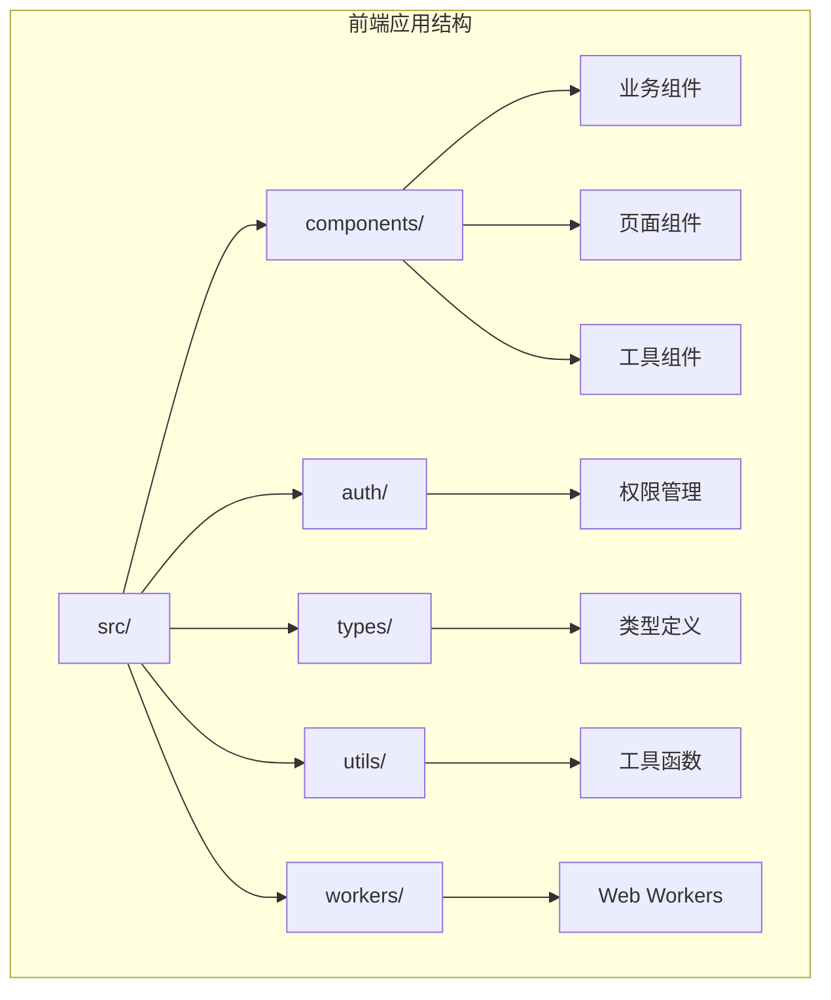
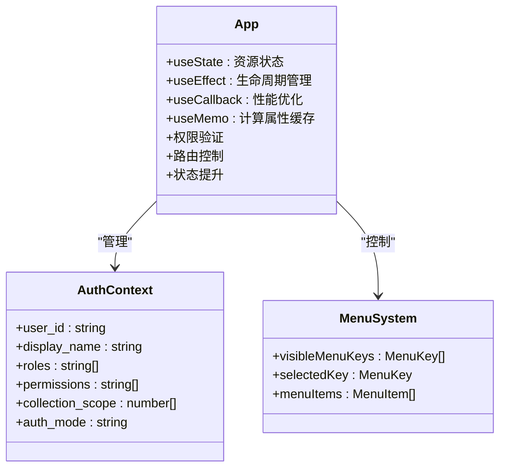
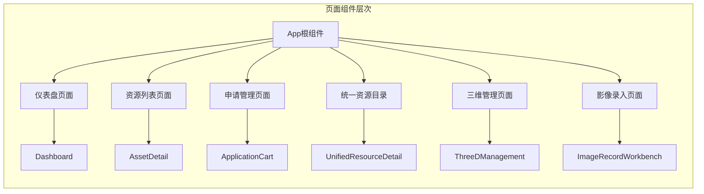
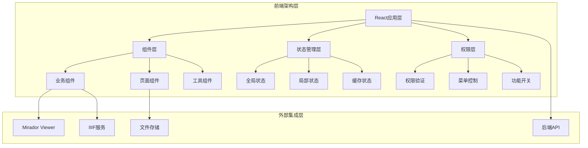
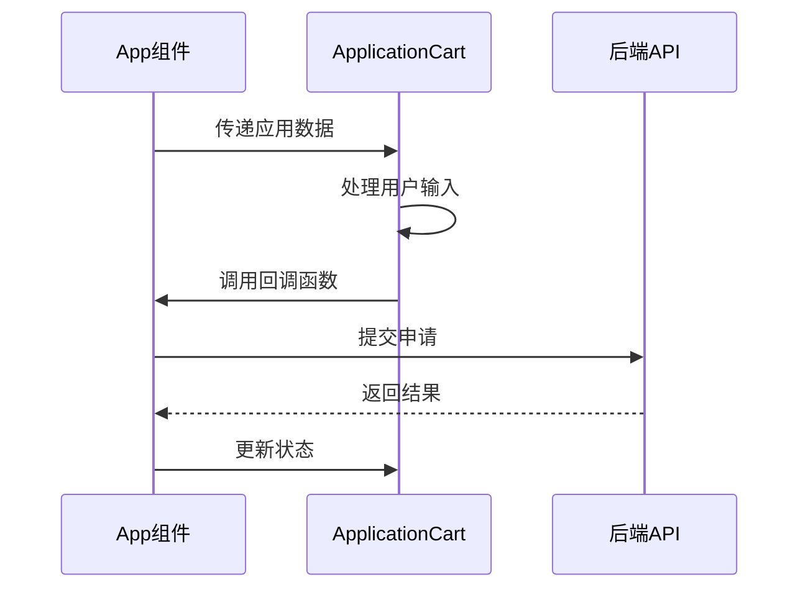
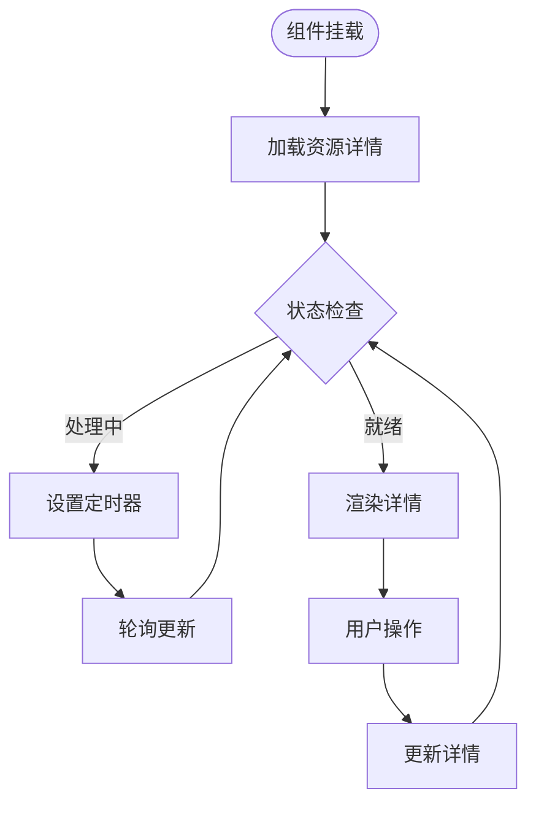
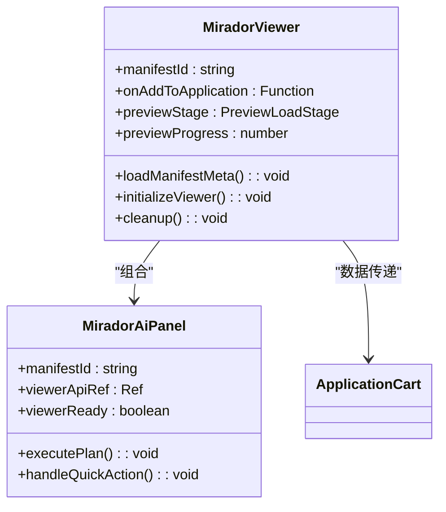
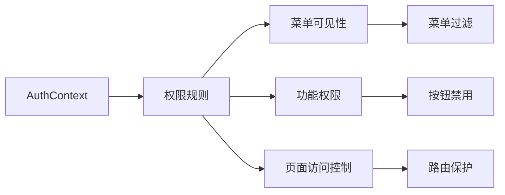

# 组件架构设计

<cite>
**本文档引用的文件**
- [App.tsx](file://frontend/src/App.tsx)
- [main.tsx](file://frontend/src/main.tsx)
- [ApplicationCart.tsx](file://frontend/src/components/ApplicationCart.tsx)
- [AssetDetail.tsx](file://frontend/src/components/AssetDetail.tsx)
- [MiradorViewer.tsx](file://frontend/src/MiradorViewer.tsx)
- [UnifiedResourceDetail.tsx](file://frontend/src/components/UnifiedResourceDetail.tsx)
- [IngestDemo.tsx](file://frontend/src/components/IngestDemo.tsx)
- [MiradorAiPanel.tsx](file://frontend/src/MiradorAiPanel.tsx)
- [permissions.ts](file://frontend/src/auth/permissions.ts)
- [assets.ts](file://frontend/src/types/assets.ts)
- [package.json](file://frontend/package.json)
- [vite.config.ts](file://frontend/vite.config.ts)
</cite>

## 目录
1. [引言](#引言)
2. [项目结构](#项目结构)
3. [核心组件](#核心组件)
4. [架构概览](#架构概览)
5. [详细组件分析](#详细组件分析)
6. [依赖分析](#依赖分析)
7. [性能考虑](#性能考虑)
8. [故障排除指南](#故障排除指南)
9. [结论](#结论)

## 引言

MDAMS原型项目采用React + TypeScript构建，实现了完整的数字资产管理系统的前端界面。该项目通过模块化的组件架构，提供了从资源浏览、预览、申请管理到三维模型展示的完整功能体系。

## 项目结构

前端项目采用清晰的模块化组织结构：



**图表来源**
- [main.tsx:1-11](file://frontend/src/main.tsx#L1-L11)
- [App.tsx:100-105](file://frontend/src/App.tsx#L100-L105)

**章节来源**
- [main.tsx:1-11](file://frontend/src/main.tsx#L1-L11)
- [package.json:1-42](file://frontend/package.json#L1-L42)

## 核心组件

### 应用根组件设计模式

App组件采用了复合组件设计模式，整合了状态管理、路由控制和权限验证：



**图表来源**
- [App.tsx:100-139](file://frontend/src/App.tsx#L100-L139)
- [permissions.ts:56-63](file://frontend/src/auth/permissions.ts#L56-L63)

### 页面级组件组织方式

项目采用基于功能域的组件组织方式，每个业务领域都有对应的页面组件：



**图表来源**
- [App.tsx:526-550](file://frontend/src/App.tsx#L526-L550)
- [App.tsx:773-791](file://frontend/src/App.tsx#L773-L791)

**章节来源**
- [App.tsx:100-403](file://frontend/src/App.tsx#L100-L403)

## 架构概览

### 系统架构设计



**图表来源**
- [App.tsx:140-181](file://frontend/src/App.tsx#L140-L181)
- [MiradorViewer.tsx:64-197](file://frontend/src/MiradorViewer.tsx#L64-L197)

### 组件间通信机制

项目实现了多种组件通信模式：

1. **Props传递模式**：父子组件间的数据传递
2. **状态提升模式**：跨层级组件的状态共享
3. **事件冒泡模式**：自定义事件的传播
4. **回调函数模式**：子组件向父组件的通知

**章节来源**
- [App.tsx:728-763](file://frontend/src/App.tsx#L728-L763)
- [ApplicationCart.tsx:8-20](file://frontend/src/components/ApplicationCart.tsx#L8-L20)

## 详细组件分析

### ApplicationCart组件分析

ApplicationCart组件展示了典型的受控组件模式：



**图表来源**
- [ApplicationCart.tsx:22-128](file://frontend/src/components/ApplicationCart.tsx#L22-L128)
- [App.tsx:307-345](file://frontend/src/App.tsx#L307-L345)

**章节来源**
- [ApplicationCart.tsx:1-131](file://frontend/src/components/ApplicationCart.tsx#L1-L131)

### AssetDetail组件分析

AssetDetail组件体现了复杂的数据加载和状态管理：



**图表来源**
- [AssetDetail.tsx:194-228](file://frontend/src/components/AssetDetail.tsx#L194-L228)
- [App.tsx:728-740](file://frontend/src/App.tsx#L728-L740)

**章节来源**
- [AssetDetail.tsx:1-488](file://frontend/src/components/AssetDetail.tsx#L1-L488)

### MiradorViewer组件分析

MiradorViewer组件展示了第三方库集成的最佳实践：



**图表来源**
- [MiradorViewer.tsx:64-197](file://frontend/src/MiradorViewer.tsx#L64-L197)
- [MiradorAiPanel.tsx:237-579](file://frontend/src/MiradorAiPanel.tsx#L237-L579)

**章节来源**
- [MiradorViewer.tsx:1-399](file://frontend/src/MiradorViewer.tsx#L1-L399)
- [MiradorAiPanel.tsx:1-800](file://frontend/src/MiradorAiPanel.tsx#L1-L800)

### 权限管理系统

权限系统采用声明式设计，通过配置驱动组件渲染：



**图表来源**
- [permissions.ts:96-106](file://frontend/src/auth/permissions.ts#L96-L106)
- [App.tsx:526-550](file://frontend/src/App.tsx#L526-L550)

**章节来源**
- [permissions.ts:1-111](file://frontend/src/auth/permissions.ts#L1-L111)

## 依赖分析

### 技术栈依赖

```mermaid
graph TB
subgraph "核心依赖"
A[React 18.2.0] --> B[React DOM]
A --> C[TypeScript]
D[Ant Design 5.12.5] --> E[UI组件库]
F[Axios 1.6.5] --> G[HTTP客户端]
end
subgraph "专业库"
H[Mirador 3.3.0] --> I[IIIF Viewer]
J[three.js 0.183.2] --> K[3D渲染]
L[@google/model-viewer] --> M[WebXR]
end
subgraph "构建工具"
N[Vite 5.0.8] --> O[开发服务器]
P[ESLint] --> Q[代码质量]
R[Playwright] --> S[端到端测试]
end
```

**图表来源**
- [package.json:13-26](file://frontend/package.json#L13-L26)
- [vite.config.ts:5-21](file://frontend/vite.config.ts#L5-L21)

### 代码分割策略

项目采用智能代码分割优化加载性能：

**章节来源**
- [vite.config.ts:14-19](file://frontend/vite.config.ts#L14-L19)

## 性能考虑

### 状态管理优化

1. **useMemo缓存计算结果**
2. **useCallback优化回调函数**
3. **条件渲染减少不必要的重渲染**
4. **懒加载大型组件**

### 数据加载优化

1. **轮询策略优化**：处理中状态每3秒轮询一次
2. **缓存策略**：本地存储认证令牌
3. **并发请求控制**：避免重复请求
4. **错误边界处理**：防止应用崩溃

### 渲染性能优化

1. **虚拟滚动**：大数据量表格的优化
2. **图片懒加载**：预览图的延迟加载
3. **组件卸载清理**：定时器和事件监听器的清理
4. **Web Workers**：CPU密集型任务的异步处理

## 故障排除指南

### 常见问题诊断

1. **权限相关问题**
   - 检查AuthContext中的权限数组
   - 验证菜单可见性计算逻辑
   - 确认用户角色映射正确

2. **资源加载问题**
   - 检查API响应格式
   - 验证文件路径和URL
   - 确认IIIF Manifest有效性

3. **预览功能问题**
   - 检查Mirador初始化状态
   - 验证认证头设置
   - 确认文件权限

**章节来源**
- [App.tsx:160-205](file://frontend/src/App.tsx#L160-L205)
- [MiradorViewer.tsx:199-271](file://frontend/src/MiradorViewer.tsx#L199-L271)

## 结论

MDAMS原型项目的组件架构展现了现代React应用的最佳实践：

1. **清晰的层次结构**：从根组件到业务组件的明确分工
2. **灵活的通信机制**：多种模式满足不同场景需求
3. **完善的权限体系**：基于角色的细粒度控制
4. **优秀的性能设计**：多维度的优化策略
5. **健壮的错误处理**：全面的异常情况处理

该架构为后续的功能扩展和维护奠定了坚实的基础，同时保持了良好的可读性和可维护性。