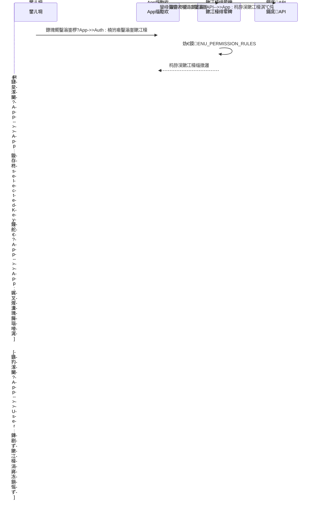
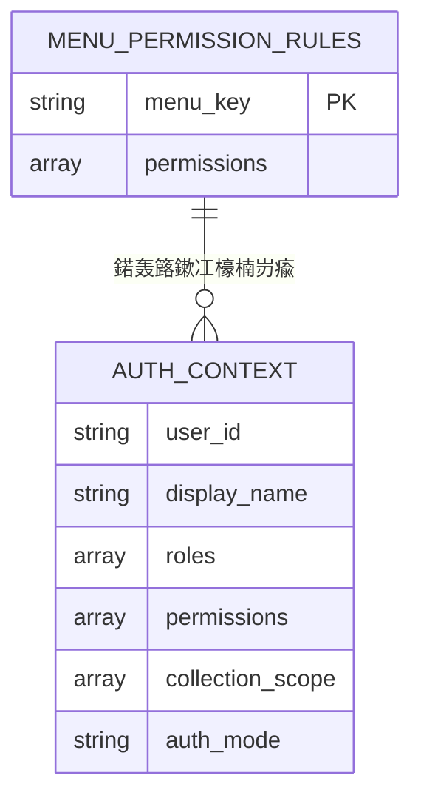
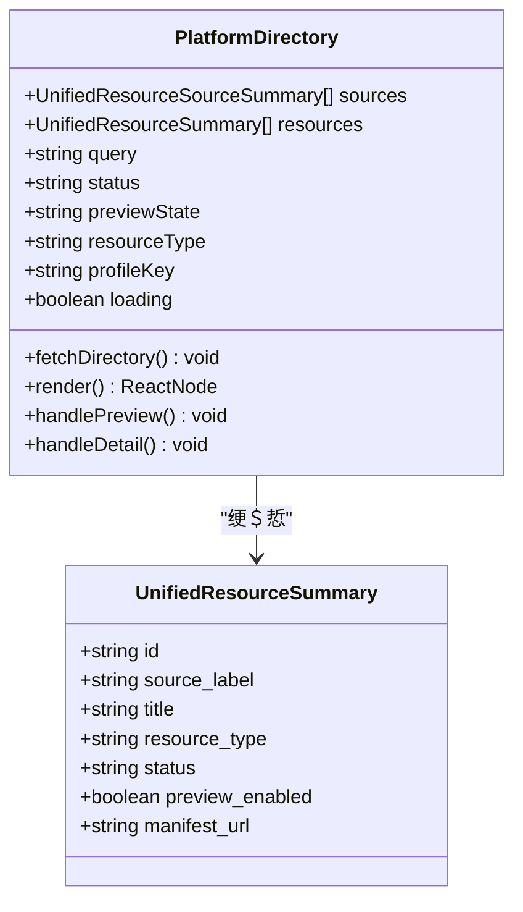
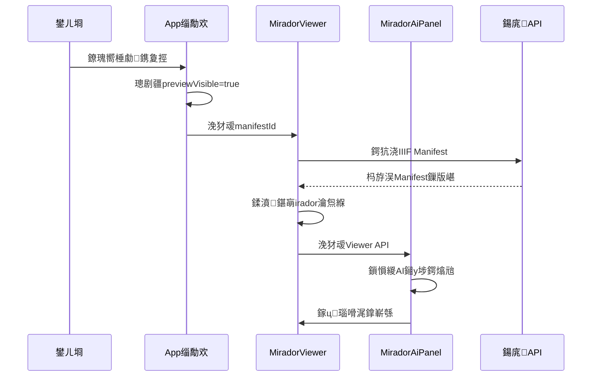

# 璺敱绯荤粺璁捐

<cite>
**鏈枃妗ｅ紩鐢ㄧ殑鏂囦欢**
- [frontend/src/App.tsx](file://frontend/src/App.tsx)
- [frontend/src/auth/permissions.ts](file://frontend/src/auth/permissions.ts)
- [frontend/src/MiradorViewer.tsx](file://frontend/src/MiradorViewer.tsx)
- [frontend/src/MiradorAiPanel.tsx](file://frontend/src/MiradorAiPanel.tsx)
- [frontend/src/components/AssetDetail.tsx](file://frontend/src/components/AssetDetail.tsx)
- [frontend/src/components/PlatformDirectory.tsx](file://frontend/src/components/PlatformDirectory.tsx)
- [frontend/vite.config.ts](file://frontend/vite.config.ts)
- [frontend/package.json](file://frontend/package.json)
- [frontend/tests/dashboard.spec.ts](file://frontend/tests/dashboard.spec.ts)
</cite>

## 鐩綍
1. [寮曡█](#寮曡█)
2. [椤圭洰缁撴瀯](#椤圭洰缁撴瀯)
3. [鏍稿績缁勪欢](#鏍稿績缁勪欢)
4. [鏋舵瀯姒傝](#鏋舵瀯姒傝)
5. [璇︾粏缁勪欢鍒嗘瀽](#璇︾粏缁勪欢鍒嗘瀽)
6. [渚濊禆鍒嗘瀽](#渚濊禆鍒嗘瀽)
7. [鎬ц兘鑰冭檻](#鎬ц兘鑰冭檻)
8. [鏁呴殰鎺掗櫎鎸囧崡](#鏁呴殰鎺掗櫎鎸囧崡)
9. [缁撹](#缁撹)

## 寮曡█

MDAMS鍘熷瀷椤圭洰鐨勫墠绔矾鐢辩郴缁熼噰鐢ㄤ簡涓€绉嶇嫭鐗圭殑"鏃犺矾鐢?鏋舵瀯璁捐銆傝椤圭洰骞舵湭浣跨敤浼犵粺鐨勫鎴风璺敱搴擄紙濡俁eact Router锛夛紝鑰屾槸閫氳繃鐘舵€佺鐞嗗拰缁勪欢娓叉煋鏉ュ疄鐜伴〉闈㈠鑸拰鍔熻兘鍒囨崲銆傝繖绉嶈璁″湪鍘熷瀷鐜涓彁渚涗簡绠€娲佺殑瀹炵幇鏂瑰紡锛屼絾鍦ㄧ敓浜х幆澧冧腑鍙兘闇€瑕佽€冭檻鏇村畬鍠勭殑璺敱瑙ｅ喅鏂规銆?
璇ヨ矾鐢辩郴缁熺殑鏍稿績鐗圭偣鍖呮嫭锛?- 鍩轰簬鐘舵€佺殑鐘舵€佺鐞嗚€岄潪URL鐘舵€?- 鍔ㄦ€佽彍鍗曠敓鎴愬拰鏉冮檺鎺у埗
- 宓屽缁勪欢缁撴瀯瀹炵幇椤甸潰鍒囨崲
- 闈㈠寘灞戝鑸殑妯℃嫙瀹炵幇
- 璺敱瀹堝崼鐨勬潈闄愰獙璇佹満鍒?
## 椤圭洰缁撴瀯

鍓嶇椤圭洰閲囩敤妯″潡鍖栫殑缁勭粐鏂瑰紡锛屼富瑕佸寘鍚互涓嬪叧閿洰褰曞拰鏂囦欢锛?
```mermaid
graph TB
subgraph "鍓嶇搴旂敤缁撴瀯"
A[main.tsx] --> B[App.tsx]
B --> C[鏉冮檺绠＄悊]
B --> D[缁勪欢闆嗗悎]
B --> E[瑙嗗浘瀹瑰櫒]
C --> F[permissions.ts]
D --> G[AssetDetail.tsx]
D --> H[PlatformDirectory.tsx]
D --> I[MiradorViewer.tsx]
D --> J[鍏朵粬涓氬姟缁勪欢]
E --> K[浠〃鏉胯鍥綸
E --> L[璧勬簮鍒楄〃瑙嗗浘]
E --> M[鐢宠杞﹁鍥綸
E --> N[骞冲彴鐩綍瑙嗗浘]
end
subgraph "鏋勫缓閰嶇疆"
O[vite.config.ts] --> P[浠ｇ爜鍒嗗壊]
O --> Q[浠ｇ悊閰嶇疆]
O --> R[鏋勫缓浼樺寲]
end
subgraph "娴嬭瘯鐜"
S[dashboard.spec.ts] --> T[Playwright娴嬭瘯]
S --> U[鏉冮檺楠岃瘉]
end
```

**鍥捐〃鏉ユ簮**
- [frontend/src/App.tsx:1-905](file://frontend/src/App.tsx#L1-L905)
- [frontend/src/auth/permissions.ts:1-111](file://frontend/src/auth/permissions.ts#L1-L111)
- [frontend/vite.config.ts:1-42](file://frontend/vite.config.ts#L1-L42)

**绔犺妭鏉ユ簮**
- [frontend/src/App.tsx:1-905](file://frontend/src/App.tsx#L1-L905)
- [frontend/vite.config.ts:1-42](file://frontend/vite.config.ts#L1-L42)

## 鏍稿績缁勪欢

### 搴旂敤涓荤粍浠?(App.tsx)

搴旂敤涓荤粍浠舵槸鏁翠釜璺敱绯荤粺鐨勬牳蹇冿紝璐熻矗绠＄悊鍏ㄥ眬鐘舵€佸拰椤甸潰娓叉煋閫昏緫銆傚畠瀹炵幇浜嗕互涓嬪叧閿姛鑳斤細

#### 鐘舵€佺鐞嗘灦鏋?- **璁よ瘉鐘舵€?*: `authContext` - 瀛樺偍鐢ㄦ埛璁よ瘉淇℃伅鍜屾潈闄?- **鑿滃崟鐘舵€?*: `selectedKey` - 褰撳墠閫変腑鐨勮彍鍗曢」
- **璧勬簮鐘舵€?*: `assets` - 浜岀淮璧勬簮鍒楄〃
- **搴旂敤鐘舵€?*: `applicationCart` - 鐢宠杞﹀唴瀹?- **棰勮鐘舵€?*: `previewVisible` - 棰勮鍣ㄦ樉绀虹姸鎬?
#### 鑿滃崟璺敱绯荤粺
搴旂敤瀹炵幇浜嗗熀浜嶢nt Design Menu缁勪欢鐨勮彍鍗曡矾鐢辩郴缁燂細

```mermaid
flowchart TD
A[鐢ㄦ埛鐐瑰嚮鑿滃崟] --> B{楠岃瘉鏉冮檺}
B --> |鏈夋潈闄恷 C[鏇存柊selectedKey]
B --> |鏃犳潈闄恷 D[闃绘瀵艰埅]
C --> E[閲嶆柊娓叉煋瀵瑰簲瑙嗗浘]
D --> F[鏄剧ず鏉冮檺涓嶈冻鎻愮ず]
G[鍒濆鍖栨椂] --> H[鑾峰彇鍙鑿滃崟]
H --> I[璁剧疆榛樿閫変腑椤筣
```

**鍥捐〃鏉ユ簮**
- [frontend/src/App.tsx:688-702](file://frontend/src/App.tsx#L688-L702)
- [frontend/src/auth/permissions.ts:100-102](file://frontend/src/auth/permissions.ts#L100-L102)

#### 鏉冮檺鎺у埗鏈哄埗
绯荤粺閫氳繃`MENU_PERMISSION_RULES`鏄犲皠瀹炵幇绮剧‘鐨勬潈闄愭帶鍒讹細

| 鑿滃崟椤?| 鏉冮檺瑕佹眰 |
|--------|----------|
| 鎬昏 (1) | dashboard.view |
| 浜岀淮璧勬簮 (2) | image.view |
| 鐢宠杞?(3) | application.create |
| 鍏ュ簱澶勭悊 (4) | image.upload, image.ingest_review, image.edit |
| 缁熶竴璧勬簮鐩綍 (5) | platform.view |
| 缁熶竴璧勬簮璇︽儏 (6) | platform.view |
| 涓夌淮绠＄悊 (7) | three_d.view |
| 鐢宠绠＄悊 (8) | application.view_all, application.review, application.export |
| 褰卞儚淇℃伅褰曞叆 (9) | image.record.list, image.record.view_ready_for_upload |

**绔犺妭鏉ユ簮**
- [frontend/src/App.tsx:100-905](file://frontend/src/App.tsx#L100-L905)
- [frontend/src/auth/permissions.ts:84-106](file://frontend/src/auth/permissions.ts#L84-L106)

## 鏋舵瀯姒傝

### 璺敱绯荤粺鏋舵瀯

```mermaid
graph TB
subgraph "鐢ㄦ埛鐣岄潰灞?
A[渚ц竟鏍忚彍鍗昡 --> B[鍐呭鍖哄煙]
B --> C[浠〃鏉胯鍥綸
B --> D[璧勬簮鍒楄〃瑙嗗浘]
B --> E[鐢宠杞﹁鍥綸
B --> F[骞冲彴鐩綍瑙嗗浘]
B --> G[棰勮鍣ㄨ鍥綸
end
subgraph "鐘舵€佺鐞嗗眰"
H[selectedKey鐘舵€乚 --> I[鑿滃崟娓叉煋]
H --> J[瑙嗗浘鍒囨崲]
K[authContext鐘舵€乚 --> L[鏉冮檺楠岃瘉]
L --> M[鑿滃崟杩囨护]
end
subgraph "鏉冮檺鎺у埗灞?
N[MENU_PERMISSION_RULES] --> O[canAccessMenu鍑芥暟]
O --> P[getVisibleMenuKeys鍑芥暟]
P --> Q[鍔ㄦ€佽彍鍗曠敓鎴怾
end
subgraph "鏁版嵁璁块棶灞?
R[API璇锋眰] --> S[璁よ瘉鏈嶅姟]
R --> T[璧勬簮鏈嶅姟]
R --> U[骞冲彴鏈嶅姟]
end
A --> H
C --> R
D --> R
E --> R
F --> R
G --> R
```

**鍥捐〃鏉ユ簮**
- [frontend/src/App.tsx:526-550](file://frontend/src/App.tsx#L526-L550)
- [frontend/src/auth/permissions.ts:84-102](file://frontend/src/auth/permissions.ts#L84-L102)

### 鏉冮檺楠岃瘉娴佺▼



**鍥捐〃鏉ユ簮**
- [frontend/src/App.tsx:688-702](file://frontend/src/App.tsx#L688-L702)
- [frontend/src/auth/permissions.ts:96-102](file://frontend/src/auth/permissions.ts#L96-L102)

## 璇︾粏缁勪欢鍒嗘瀽

### 鏉冮檺绠＄悊绯荤粺

#### 鑿滃崟鏉冮檺瑙勫垯瀹氫箟

鏉冮檺绯荤粺閫氳繃`MENU_PERMISSION_RULES`鏄犲皠瀹炵幇绮剧‘鐨勬潈闄愭帶鍒讹細



**鍥捐〃鏉ユ簮**
- [frontend/src/auth/permissions.ts:84-102](file://frontend/src/auth/permissions.ts#L84-L102)

#### 鏉冮檺楠岃瘉鍑芥暟

绯荤粺鎻愪緵浜嗕笁涓牳蹇冩潈闄愰獙璇佸嚱鏁帮細

1. **`canAccessMenu`**: 楠岃瘉鐢ㄦ埛鏄惁鍙互璁块棶鐗瑰畾鑿滃崟椤?2. **`getVisibleMenuKeys`**: 鑾峰彇鐢ㄦ埛鍙鐨勮彍鍗曢」鍒楄〃
3. **`can`**: 閫氱敤鏉冮檺妫€鏌ュ嚱鏁?
**绔犺妭鏉ユ簮**
- [frontend/src/auth/permissions.ts:96-111](file://frontend/src/auth/permissions.ts#L96-L111)

### 瑙嗗浘缁勪欢绯荤粺

#### 璧勬簮璇︽儏缁勪欢 (AssetDetail)

璧勬簮璇︽儏缁勪欢瀹炵幇浜嗗畬鏁寸殑璧勬簮淇℃伅灞曠ず鍜屾搷浣滃姛鑳斤細

```mermaid
flowchart TD
A[AssetDetail缁勪欢] --> B[鍔犺浇璧勬簮璇︽儏]
B --> C{鍔犺浇鎴愬姛?}
C --> |鏄瘄 D[娓叉煋璇︽儏淇℃伅]
C --> |鍚 E[鏄剧ず閿欒淇℃伅]
D --> F[棰勮鍔熻兘]
D --> G[涓嬭浇鍔熻兘]
D --> H[鐢宠杞﹀姛鑳絔
F --> I[MiradorViewer闆嗘垚]
G --> J[API涓嬭浇鎺ュ彛]
H --> K[addToApplicationCart鍥炶皟]
```

**鍥捐〃鏉ユ簮**
- [frontend/src/components/AssetDetail.tsx:194-488](file://frontend/src/components/AssetDetail.tsx#L194-L488)

#### 骞冲彴鐩綍缁勪欢 (PlatformDirectory)

骞冲彴鐩綍缁勪欢鎻愪緵浜嗙粺涓€璧勬簮鐩綍鐨勫畬鏁村姛鑳斤細



**鍥捐〃鏉ユ簮**
- [frontend/src/components/PlatformDirectory.tsx:25-273](file://frontend/src/components/PlatformDirectory.tsx#L25-L273)

**绔犺妭鏉ユ簮**
- [frontend/src/components/AssetDetail.tsx:194-488](file://frontend/src/components/AssetDetail.tsx#L194-L488)
- [frontend/src/components/PlatformDirectory.tsx:31-273](file://frontend/src/components/PlatformDirectory.tsx#L31-L273)

### 棰勮鍣ㄧ郴缁?
#### Mirador Viewer闆嗘垚

棰勮鍣ㄧ郴缁熼泦鎴愪簡Mirador IIIF鏌ョ湅鍣紝鎻愪緵浜嗕赴瀵岀殑鍥惧儚棰勮鍔熻兘锛?


**鍥捐〃鏉ユ簮**
- [frontend/src/App.tsx:852-898](file://frontend/src/App.tsx#L852-L898)
- [frontend/src/MiradorViewer.tsx:64-271](file://frontend/src/MiradorViewer.tsx#L64-L271)

#### AI鎺у埗闈㈡澘

AI鎺у埗闈㈡澘鎻愪緵浜嗘櫤鑳藉寲鐨勫浘鍍忔搷浣滃姛鑳斤細

```mermaid
flowchart TD
A[鐢ㄦ埛杈撳叆] --> B[AI瑙ｆ瀽]
B --> C[鐢熸垚鎿嶄綔璁″垝]
C --> D{闇€瑕佺‘璁?}
D --> |鏄瘄 E[绛夊緟鐢ㄦ埛纭]
D --> |鍚 F[鑷姩鎵ц]
E --> G[鐢ㄦ埛纭]
G --> F
F --> H[鎵ц瑙嗗浘鎿嶄綔]
H --> I[鏇存柊鐘舵€佸弽棣圿
J[蹇嵎鎿嶄綔] --> F
K[姣旇緝妯″紡] --> F
L[鎼滅储鍔熻兘] --> F
```

**鍥捐〃鏉ユ簮**
- [frontend/src/MiradorAiPanel.tsx:525-579](file://frontend/src/MiradorAiPanel.tsx#L525-L579)

**绔犺妭鏉ユ簮**
- [frontend/src/MiradorViewer.tsx:64-399](file://frontend/src/MiradorViewer.tsx#L64-L399)
- [frontend/src/MiradorAiPanel.tsx:237-948](file://frontend/src/MiradorAiPanel.tsx#L237-L948)

## 渚濊禆鍒嗘瀽

### 鏋勫缓閰嶇疆鍒嗘瀽

Vite閰嶇疆鏂囦欢灞曠ず浜嗛」鐩殑鏋勫缓浼樺寲绛栫暐锛?
```mermaid
graph LR
subgraph "鏋勫缓浼樺寲"
A[manualChunks] --> B[react-vendor]
A --> C[antd-vendor]
A --> D[mirador-vendor]
E[chunkSizeWarningLimit] --> F[2000KB]
G[sourcemap] --> H[false]
end
subgraph "寮€鍙戞湇鍔″櫒"
I[proxy] --> J[/api -> localhost:8000]
I --> K[/auth -> localhost:8000]
I --> L[/iiif -> localhost:8000]
end
```

**鍥捐〃鏉ユ簮**
- [frontend/vite.config.ts:7-21](file://frontend/vite.config.ts#L7-L21)
- [frontend/vite.config.ts:22-40](file://frontend/vite.config.ts#L22-L40)

### 渚濊禆鍏崇郴鍥?
```mermaid
graph TB
subgraph "杩愯鏃朵緷璧?
A[react@^18.2.0]
B[react-dom@^18.2.0]
C[antd@^5.12.5]
D[mirador@^3.3.0]
E[axios@^1.6.5]
F[react-router-dom@^6.21.1]
end
subgraph "寮€鍙戜緷璧?
G[@vitejs/plugin-react@^4.2.1]
H[typescript@^5.2.2]
I[eslint@^8.57.1]
J[playwright@^1.57.0]
end
A --> C
A --> F
D --> A
E --> A
```

**鍥捐〃鏉ユ簮**
- [frontend/package.json:13-26](file://frontend/package.json#L13-L26)
- [frontend/package.json:27-40](file://frontend/package.json#L27-L40)

**绔犺妭鏉ユ簮**
- [frontend/vite.config.ts:1-42](file://frontend/vite.config.ts#L1-L42)
- [frontend/package.json:1-42](file://frontend/package.json#L1-L42)

## 鎬ц兘鑰冭檻

### 浠ｇ爜鍒嗗壊绛栫暐

椤圭洰閲囩敤浜嗘櫤鑳界殑浠ｇ爜鍒嗗壊绛栫暐鏉ヤ紭鍖栧姞杞芥€ц兘锛?
1. **绗笁鏂瑰簱鍒嗙**: 灏哛eact銆丄nt Design鍜孧irador鍒嗗埆鎵撳寘鍒扮嫭绔媍hunk涓?2. **鎸夐渶鍔犺浇**: 缁勪欢閫氳繃鎳掑姞杞藉疄鐜板欢杩熷姞杞?3. **缂撳瓨浼樺寲**: 浣跨敤绋冲畾鐨刢hunk鍚嶇О鎻愰珮娴忚鍣ㄧ紦瀛樻晥鐜?
### 鍔犺浇浼樺寲鎶€鏈?
```mermaid
flowchart TD
A[搴旂敤鍚姩] --> B[鍔犺浇鏍稿績bundle]
B --> C[鏄剧ず楠ㄦ灦灞廬
C --> D[寮傛鍔犺浇绗笁鏂瑰簱]
D --> E[鏄剧ず鍩虹鍔熻兘]
E --> F[鎸夐渶鍔犺浇涓氬姟缁勪欢]
F --> G[瀹屾暣鐢ㄦ埛浣撻獙]
H[鍥剧墖浼樺寲] --> I[lazy loading]
H --> J[fallback鍥剧墖]
H --> K[CDN鍔犻€焆
L[API浼樺寲] --> M[璇锋眰鍚堝苟]
L --> N[缂撳瓨绛栫暐]
L --> O[閿欒閲嶈瘯]
```

### 鍐呭瓨绠＄悊

绯荤粺瀹炵幇浜嗗椤瑰唴瀛樼鐞嗙瓥鐣ワ細
- 缁勪欢鍗歌浇鏃舵竻鐞嗗畾鏃跺櫒鍜屼簨浠剁洃鍚櫒
- 棰勮鍣ㄥ疄渚嬬殑姝ｇ‘閿€姣?- 澶ч噺鏁版嵁鐨勫垎椤靛姞杞?
## 鏁呴殰鎺掗櫎鎸囧崡

### 甯歌闂璇婃柇

#### 鏉冮檺鐩稿叧闂

```mermaid
flowchart TD
A[鑿滃崟涓嶅彲瑙乚 --> B{妫€鏌ユ潈闄恾
B --> |鏃犳潈闄恷 C[楠岃瘉MENU_PERMISSION_RULES]
B --> |鏈夋潈闄恷 D[妫€鏌isibleMenuKeys]
E[鍔熻兘涓嶅彲鐢╙ --> F{妫€鏌ュ叿浣撴潈闄恾
F --> |鏃犳潈闄恷 G[楠岃瘉can鍑芥暟]
F --> |鏈夋潈闄恷 H[妫€鏌ョ粍浠舵潯浠舵覆鏌揮
I[棰勮澶辫触] --> J{妫€鏌anifest鍔犺浇}
J --> |澶辫触| K[楠岃瘉Authorization澶碷
J --> |鎴愬姛| L[妫€鏌irador鍒濆鍖朷
```

#### 鎬ц兘闂鎺掓煡

1. **棣栧睆鍔犺浇鎱?*: 妫€鏌hunk澶у皬鍜岀綉缁滅姸鍐?2. **鍐呭瓨娉勬紡**: 纭缁勪欢鍗歌浇鏃剁殑娓呯悊閫昏緫
3. **浜や簰鍗￠】**: 鍒嗘瀽閲嶆覆鏌撻鐜囧拰璁＄畻澶嶆潅搴?
**绔犺妭鏉ユ簮**
- [frontend/src/App.tsx:183-205](file://frontend/src/App.tsx#L183-L205)
- [frontend/src/MiradorViewer.tsx:199-271](file://frontend/src/MiradorViewer.tsx#L199-L271)

## 缁撹

MDAMS鍘熷瀷椤圭洰鐨勮矾鐢辩郴缁熷睍鐜颁簡鍒涙柊鐨勮璁℃€濊矾锛岄€氳繃鐘舵€佺鐞嗘浛浠ｄ紶缁熻矾鐢卞疄鐜颁簡鐏垫椿鐨勫姛鑳藉垏鎹€傝绯荤粺鐨勪富瑕佷紭鍔垮寘鎷細

### 璁捐浼樺娍
- **绠€娲佹€?*: 閬垮厤浜嗗鏉傜殑璺敱閰嶇疆锛岄檷浣庝簡瀛︿範鎴愭湰
- **鐏垫椿鎬?*: 鍩轰簬鐘舵€佺殑鍒囨崲鏇村姞鐩磋鍜屽彲鎺?- **鏉冮檺闆嗘垚**: 鏉冮檺绯荤粺涓嶶I娓叉煋娣卞害闆嗘垚
- **鎬ц兘浼樺寲**: 閫氳繃浠ｇ爜鍒嗗壊鍜屾噿鍔犺浇鎻愬崌鍔犺浇閫熷害

### 鎶€鏈壒鑹?- **鍔ㄦ€佽彍鍗曠敓鎴?*: 鏍规嵁鐢ㄦ埛鏉冮檺瀹炴椂璋冩暣鑿滃崟鏄剧ず
- **宓屽缁勪欢鏋舵瀯**: 閫氳繃缁勪欢缁勫悎瀹炵幇椤甸潰鍒囨崲
- **棰勮鍣ㄩ泦鎴?*: 娣卞害闆嗘垚Mirador IIIF鏌ョ湅鍣?- **AI杈呭姪鎺у埗**: 鎻愪緵鏅鸿兘鍖栫殑鍥惧儚鎿嶄綔鍔熻兘

### 鏀硅繘寤鸿
铏界劧璇ヨ璁″湪鍘熷瀷鐜涓〃鐜拌壇濂斤紝浣嗗湪鐢熶骇鐜涓缓璁€冭檻锛?- 闆嗘垚姝ｅ紡鐨勫鎴风璺敱搴?- 瀹炵幇娴忚鍣ㄥ墠杩涘悗閫€鏀寔
- 娣诲姞璺敱绾у埆鐨勯敊璇鐞?- 浼樺寲SEO鍙嬪ソ鎬?
杩欎釜璺敱绯荤粺涓篗DAMS椤圭洰鎻愪緵浜嗕竴涓潥瀹炵殑鎶€鏈熀纭€锛屽睍绀轰簡濡備綍鍦ㄤ繚鎸佺畝娲佹€х殑鍚屾椂瀹炵幇澶嶆潅鐨勫姛鑳介渶姹傘€
