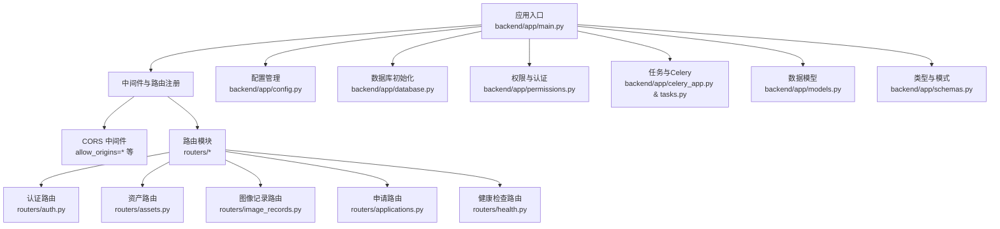
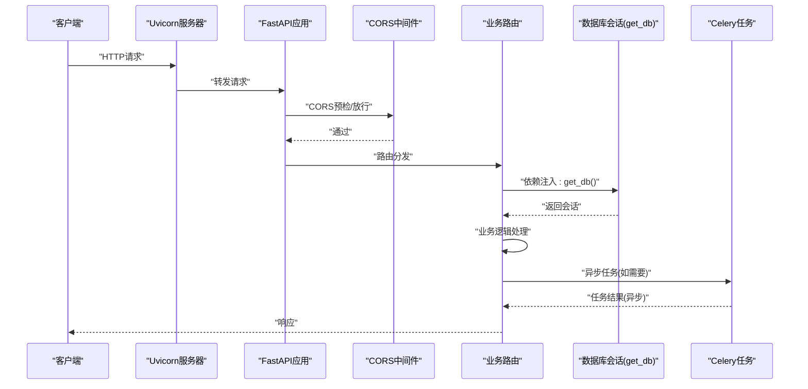
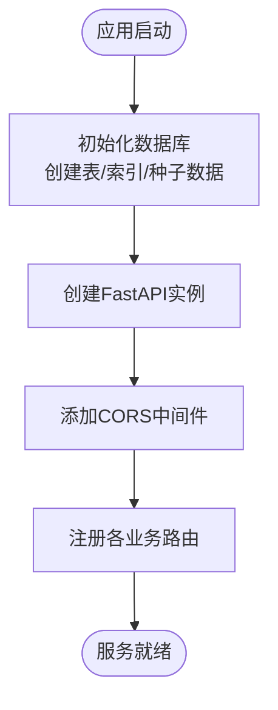
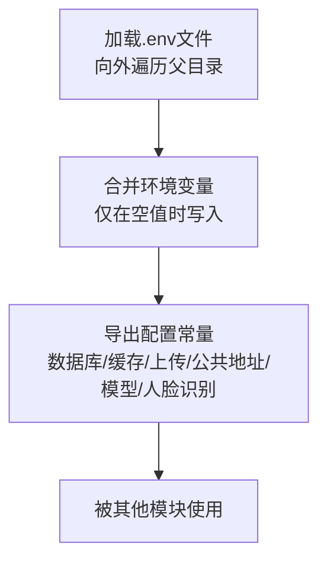
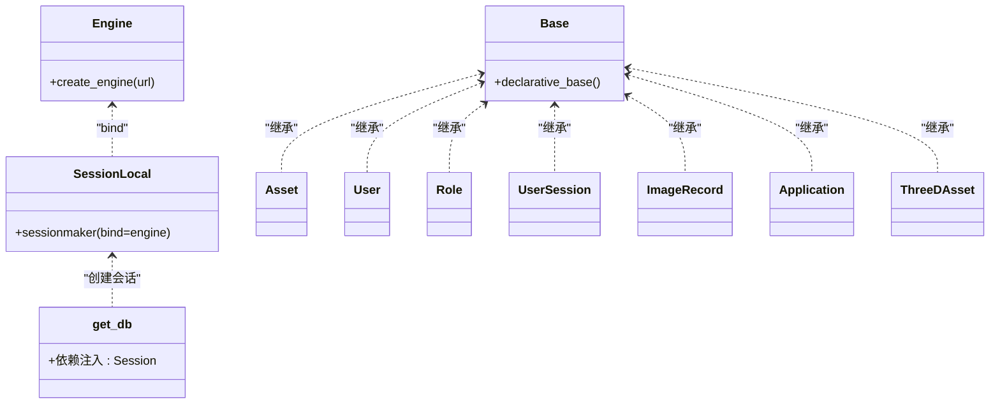
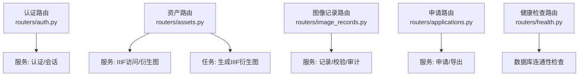
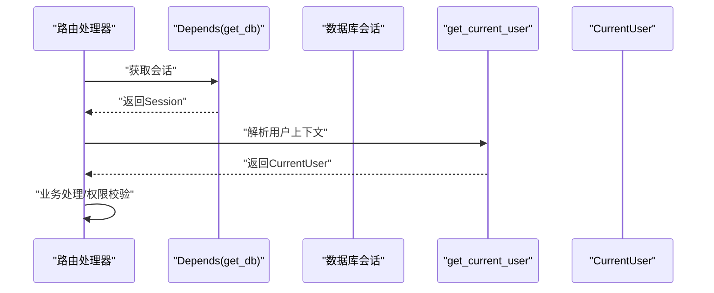
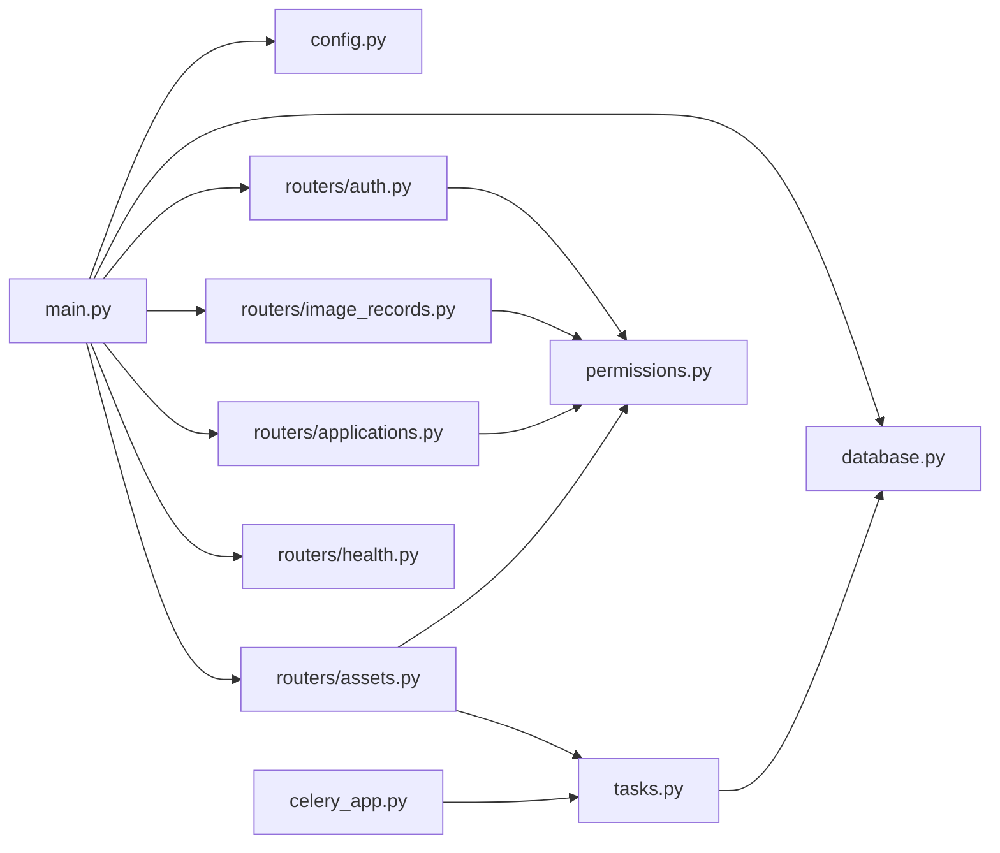

# FastAPI框架设计

<cite>
**本文引用的文件**
- [backend/app/main.py](file://backend/app/main.py)
- [backend/app/config.py](file://backend/app/config.py)
- [backend/app/database.py](file://backend/app/database.py)
- [backend/app/celery_app.py](file://backend/app/celery_app.py)
- [backend/app/models.py](file://backend/app/models.py)
- [backend/app/routers/__init__.py](file://backend/app/routers/__init__.py)
- [backend/app/routers/auth.py](file://backend/app/routers/auth.py)
- [backend/app/routers/health.py](file://backend/app/routers/health.py)
- [backend/app/routers/assets.py](file://backend/app/routers/assets.py)
- [backend/app/routers/image_records.py](file://backend/app/routers/image_records.py)
- [backend/app/routers/applications.py](file://backend/app/routers/applications.py)
- [backend/app/permissions.py](file://backend/app/permissions.py)
- [backend/app/schemas.py](file://backend/app/schemas.py)
- [backend/app/tasks.py](file://backend/app/tasks.py)
- [backend/requirements.txt](file://backend/requirements.txt)
</cite>

## 目录
1. [引言](#引言)
2. [项目结构](#项目结构)
3. [核心组件](#核心组件)
4. [架构总览](#架构总览)
5. [详细组件分析](#详细组件分析)
6. [依赖分析](#依赖分析)
7. [性能考虑](#性能考虑)
8. [故障排查指南](#故障排查指南)
9. [结论](#结论)
10. [附录](#附录)

## 引言
本设计文档聚焦于MDAMS原型项目的FastAPI应用，系统性阐述应用初始化流程、中间件与路由注册机制、CORS安全配置、路由模块化组织、依赖注入体系、配置管理与环境变量处理、数据库连接初始化，以及FastAPI特性最佳实践（类型注解、自动文档生成、性能优化）。文档以代码级分析为基础，辅以可视化图表，帮助读者快速理解并高效扩展该FastAPI后端。

## 项目结构
后端采用“按功能域分层+模块化路由”的组织方式：
- 应用入口与初始化：main.py负责创建FastAPI实例、加载数据库、注册中间件与路由。
- 配置管理：config.py集中读取环境变量与默认值，并支持向内层目录回溯查找.env文件。
- 数据访问：database.py定义SQLAlchemy引擎、会话工厂与依赖注入函数。
- 路由模块：routers目录下按业务域划分（认证、资产、图像记录、申请、健康检查等），每个模块独立声明APIRouter并导出router。
- 权限与认证：permissions.py定义用户上下文、角色-权限映射与权限校验依赖；services.auth提供登录、会话与默认数据种子。
- 数据模型：models.py定义ORM模型，用于数据库表结构与关系。
- 任务与异步：celery_app.py与tasks.py集成Celery，执行衍生图生成、人脸识别等后台任务。
- 类型与模式：schemas.py定义Pydantic模型，支撑请求/响应类型与自动文档生成。

**图表来源**
- [backend/app/main.py:64-86](file://backend/app/main.py#L64-L86)
- [backend/app/routers/auth.py:10](file://backend/app/routers/auth.py#L10)
- [backend/app/routers/assets.py:24](file://backend/app/routers/assets.py#L24)
- [backend/app/routers/image_records.py:50](file://backend/app/routers/image_records.py#L50)
- [backend/app/routers/applications.py:23](file://backend/app/routers/applications.py#L23)
- [backend/app/routers/health.py:11](file://backend/app/routers/health.py#L11)

**章节来源**
- [backend/app/main.py:1-86](file://backend/app/main.py#L1-L86)
- [backend/app/config.py:1-72](file://backend/app/config.py#L1-L72)
- [backend/app/database.py:1-17](file://backend/app/database.py#L1-L17)
- [backend/app/celery_app.py:1-19](file://backend/app/celery_app.py#L1-L19)
- [backend/app/models.py:1-307](file://backend/app/models.py#L1-L307)
- [backend/app/routers/__init__.py:1](file://backend/app/routers/__init__.py#L1)
- [backend/app/routers/auth.py:1-83](file://backend/app/routers/auth.py#L1-L83)
- [backend/app/routers/health.py:1-60](file://backend/app/routers/health.py#L1-L60)
- [backend/app/routers/assets.py:1-200](file://backend/app/routers/assets.py#L1-L200)
- [backend/app/routers/image_records.py:1-200](file://backend/app/routers/image_records.py#L1-L200)
- [backend/app/routers/applications.py:1-200](file://backend/app/routers/applications.py#L1-L200)
- [backend/app/permissions.py:1-255](file://backend/app/permissions.py#L1-L255)
- [backend/app/schemas.py:1-652](file://backend/app/schemas.py#L1-L652)
- [backend/app/tasks.py:1-262](file://backend/app/tasks.py#L1-L262)
- [backend/requirements.txt:1-18](file://backend/requirements.txt#L1-L18)

## 核心组件
- 应用实例与初始化
  - 创建FastAPI实例并设置标题。
  - 初始化数据库表结构，确保SQLite兼容性，填充默认认证数据。
  - 注册CORS中间件，允许跨域请求。
  - include所有业务路由模块。
- 配置管理
  - 支持从项目根向外查找.env文件，避免外部依赖。
  - 定义数据库URL、Redis URL、上传目录、API公共地址、Cantaloupe公共地址、大模型服务参数、人脸识别开关与参数等。
- 数据库与依赖注入
  - 使用SQLAlchemy创建引擎与会话工厂。
  - 提供get_db依赖，确保每个请求作用域内正确创建与关闭会话。
- 路由模块化
  - 每个路由模块独立定义APIRouter，按业务域命名标签，减少耦合。
- 权限与认证
  - 基于角色的权限映射，支持Cookie与Header两种认证来源，统一CurrentUser上下文。
- 任务与异步
  - Celery连接Redis，注册任务，后台执行衍生图生成与人脸识别等耗时操作。

**章节来源**
- [backend/app/main.py:21-86](file://backend/app/main.py#L21-L86)
- [backend/app/config.py:5-72](file://backend/app/config.py#L5-L72)
- [backend/app/database.py:1-17](file://backend/app/database.py#L1-L17)
- [backend/app/permissions.py:17-255](file://backend/app/permissions.py#L17-L255)
- [backend/app/celery_app.py:1-19](file://backend/app/celery_app.py#L1-L19)

## 架构总览
下图展示FastAPI应用启动到路由处理的关键路径，包括中间件、依赖注入、数据库与任务队列的交互。

**图表来源**
- [backend/app/main.py:64-86](file://backend/app/main.py#L64-L86)
- [backend/app/database.py:11-17](file://backend/app/database.py#L11-L17)
- [backend/app/routers/assets.py:54-134](file://backend/app/routers/assets.py#L54-L134)
- [backend/app/tasks.py:151-182](file://backend/app/tasks.py#L151-L182)

## 详细组件分析

### 应用初始化与中间件配置
- 初始化流程
  - 创建数据库表与索引，确保SQLite字段兼容性。
  - 种子默认认证数据，保证系统初始可用。
  - 创建FastAPI实例并设置标题。
  - 配置CORS中间件，允许任意源、凭证、方法与头，暴露全部头。
  - include所有路由模块。
- CORS安全配置
  - 允许通配符源、方法与头，便于前端联调。
  - 在生产环境中建议收窄allow_origins、allow_methods与allow_headers，避免过度放行。
- 路由注册机制
  - 通过include_router集中注册，保持入口简洁清晰。
  - 各路由模块内部独立声明前缀与标签，便于文档与调试。

**图表来源**
- [backend/app/main.py:21-86](file://backend/app/main.py#L21-L86)

**章节来源**
- [backend/app/main.py:21-86](file://backend/app/main.py#L21-L86)

### 配置管理与环境变量处理
- .env加载策略
  - 从当前文件向外遍历父目录，遇到.git或同时包含backend与frontend即停止，优先使用最近的.env。
  - 只在未设置的键上写入环境变量，避免覆盖。
- 关键配置项
  - 数据库与缓存：DATABASE_URL、REDIS_URL。
  - 文件与公共地址：UPLOAD_DIR、API_PUBLIC_URL、CANTALOUPE_PUBLIC_URL。
  - 大模型服务：OPENAI_*系列参数，Moonshot作为兼容默认值。
  - 人脸识别：开关、提供方、超时、阈值、模型根目录、索引目录、严格本地模式等。

**图表来源**
- [backend/app/config.py:5-72](file://backend/app/config.py#L5-L72)

**章节来源**
- [backend/app/config.py:5-72](file://backend/app/config.py#L5-L72)

### 数据库连接与依赖注入
- 连接初始化
  - 使用SQLAlchemy创建引擎，基于配置中的DATABASE_URL。
  - 创建会话工厂SessionLocal与基础Base类。
- 依赖注入
  - get_db提供请求级会话，try/finally确保关闭，避免连接泄漏。
- 模型定义
  - ORM模型覆盖资产、用户、角色、会话、图像记录、申请、三维资产等，支持关系映射与外键约束。

**图表来源**
- [backend/app/database.py:1-17](file://backend/app/database.py#L1-L17)
- [backend/app/models.py:1-307](file://backend/app/models.py#L1-L307)

**章节来源**
- [backend/app/database.py:1-17](file://backend/app/database.py#L1-L17)
- [backend/app/models.py:1-307](file://backend/app/models.py#L1-L307)

### 路由模块化组织结构
- 认证路由
  - 提供/context、/users、/login、/logout等端点，使用依赖注入获取数据库会话。
- 资产路由
  - 上传文件、构建元数据层、触发衍生图生成任务、查询上传文件列表等。
- 图像记录路由
  - 录入单据、批量导入、状态流转、绑定资产、文化对象查询、元数据校验与审计追踪。
- 申请路由
  - 创建申请、列出与查询申请、打包导出交付物。
- 健康检查路由
  - /health与/readiness，检查数据库连通性与上传目录存在性。

**图表来源**
- [backend/app/routers/auth.py:1-83](file://backend/app/routers/auth.py#L1-L83)
- [backend/app/routers/assets.py:1-200](file://backend/app/routers/assets.py#L1-L200)
- [backend/app/routers/image_records.py:1-200](file://backend/app/routers/image_records.py#L1-L200)
- [backend/app/routers/applications.py:1-200](file://backend/app/routers/applications.py#L1-L200)
- [backend/app/routers/health.py:1-60](file://backend/app/routers/health.py#L1-L60)

**章节来源**
- [backend/app/routers/auth.py:1-83](file://backend/app/routers/auth.py#L1-L83)
- [backend/app/routers/assets.py:1-200](file://backend/app/routers/assets.py#L1-L200)
- [backend/app/routers/image_records.py:1-200](file://backend/app/routers/image_records.py#L1-L200)
- [backend/app/routers/applications.py:1-200](file://backend/app/routers/applications.py#L1-L200)
- [backend/app/routers/health.py:1-60](file://backend/app/routers/health.py#L1-L60)

### 依赖注入系统使用
- get_db
  - 在路由函数中通过Depends(get_db)注入数据库会话，确保事务边界清晰。
- CurrentUser依赖
  - permissions.get_current_user解析Authorization或Cookie，构造统一用户上下文，支持权限校验与集合范围控制。
- 角色-权限映射
  - ROLE_PERMISSIONS定义角色到权限集合的映射，require_permission与require_any_permission提供便捷依赖。

**图表来源**
- [backend/app/database.py:11-17](file://backend/app/database.py#L11-L17)
- [backend/app/permissions.py:179-204](file://backend/app/permissions.py#L179-L204)

**章节来源**
- [backend/app/database.py:11-17](file://backend/app/database.py#L11-L17)
- [backend/app/permissions.py:17-255](file://backend/app/permissions.py#L17-L255)

### FastAPI特性应用最佳实践
- 类型注解与Pydantic模型
  - 所有请求/响应使用Pydantic模型（schemas.py），自动参与OpenAPI生成与运行时校验。
- 自动文档生成
  - FastAPI内置Swagger UI与ReDoc，结合标签与路由前缀，形成清晰的API文档结构。
- 性能优化策略
  - 使用Depends进行依赖注入，避免重复创建对象。
  - 将耗时任务放入Celery后台执行，路由快速返回。
  - 对大文件上传采用分块写入与异步衍生图生成，降低请求阻塞。
  - 仅在必要时加载图片尺寸等元数据，减少IO开销。

**章节来源**
- [backend/app/schemas.py:1-652](file://backend/app/schemas.py#L1-L652)
- [backend/app/routers/assets.py:54-134](file://backend/app/routers/assets.py#L54-L134)
- [backend/app/tasks.py:151-182](file://backend/app/tasks.py#L151-L182)

## 依赖分析
- 外部依赖
  - FastAPI、SQLAlchemy、Celery、Redis、Pydantic等。
- 内部依赖
  - main.py依赖config、database、routers与services（如认证种子）。
  - 各路由模块依赖database.get_db、models、schemas、permissions与services。
  - Celery任务依赖config、database.SessionLocal与models。

**图表来源**
- [backend/app/main.py:1-86](file://backend/app/main.py#L1-L86)
- [backend/app/routers/assets.py:1-200](file://backend/app/routers/assets.py#L1-L200)
- [backend/app/routers/image_records.py:1-200](file://backend/app/routers/image_records.py#L1-L200)
- [backend/app/routers/applications.py:1-200](file://backend/app/routers/applications.py#L1-L200)
- [backend/app/routers/health.py:1-60](file://backend/app/routers/health.py#L1-L60)
- [backend/app/celery_app.py:1-19](file://backend/app/celery_app.py#L1-L19)
- [backend/app/tasks.py:1-262](file://backend/app/tasks.py#L1-L262)

**章节来源**
- [backend/app/main.py:1-86](file://backend/app/main.py#L1-L86)
- [backend/app/celery_app.py:1-19](file://backend/app/celery_app.py#L1-L19)
- [backend/app/tasks.py:1-262](file://backend/app/tasks.py#L1-L262)

## 性能考虑
- 数据库连接
  - 使用get_db确保每请求一个会话，避免长生命周期连接导致资源占用。
- 异步任务
  - 衍生图生成与人脸识别等重任务交由Celery后台执行，路由层只做调度。
- 文件处理
  - 分块写入上传文件，避免内存峰值；仅在需要时解析图像尺寸。
- 缓存与中间件
  - 在生产环境收紧CORS白名单，减少不必要的预检请求。
- 依赖注入
  - 将昂贵对象（如OCR/人脸识别客户端）封装为依赖，按需创建与释放。

[本节为通用指导，无需具体文件引用]

## 故障排查指南
- 健康检查
  - /health与/readiness会检查数据库连通性与上传目录存在性，异常时返回非200状态码与错误详情。
- 认证失败
  - 401未授权通常来自无效或过期的会话令牌；确认Cookie或Header携带正确。
- 数据库问题
  - 若出现连接异常，检查DATABASE_URL与网络连通性；确认数据库已启动且可访问。
- 上传失败
  - 检查UPLOAD_DIR权限与磁盘空间；确认文件写入成功与衍生图生成任务已触发。

**章节来源**
- [backend/app/routers/health.py:14-60](file://backend/app/routers/health.py#L14-L60)
- [backend/app/permissions.py:179-204](file://backend/app/permissions.py#L179-L204)

## 结论
该FastAPI应用通过清晰的初始化流程、模块化的路由组织、完善的依赖注入与配置管理，实现了高内聚低耦合的后端架构。配合CORS中间件与健康检查、Celery异步任务，满足原型阶段的功能需求与可扩展性要求。建议在生产环境收紧CORS白名单、完善鉴权与审计日志，并持续优化数据库索引与任务队列监控。

## 附录
- 快速启动要点
  - 设置DATABASE_URL、REDIS_URL、UPLOAD_DIR等环境变量。
  - 启动数据库与Redis容器，确保连通。
  - 运行Uvicorn服务，访问Swagger UI查看自动生成的API文档。
- 推荐实践
  - 为敏感端点增加require_permission依赖。
  - 对大文件与批量操作使用分页与后台任务。
  - 在生产环境启用HTTPS与更严格的CORS策略。