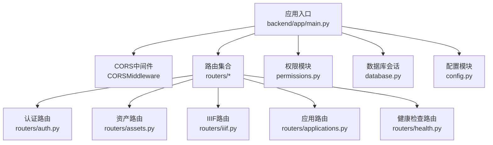
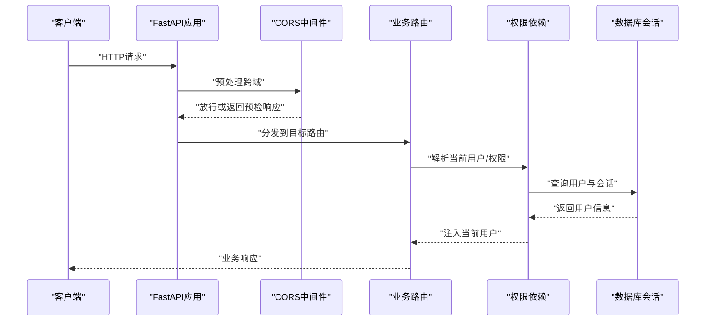
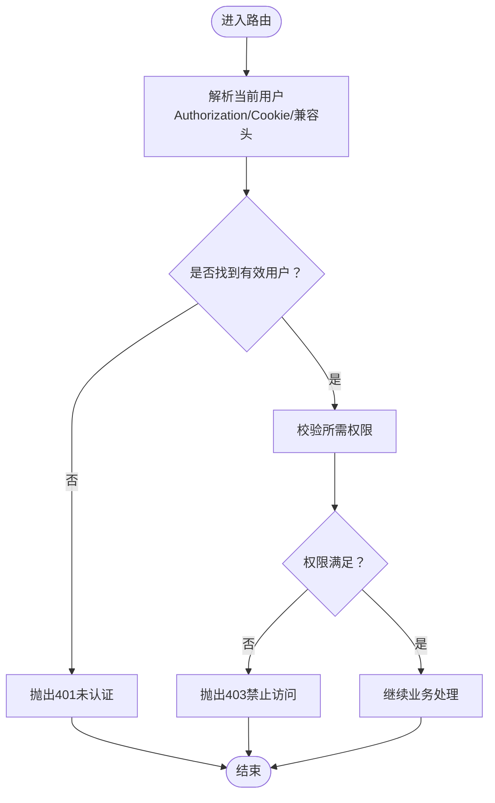
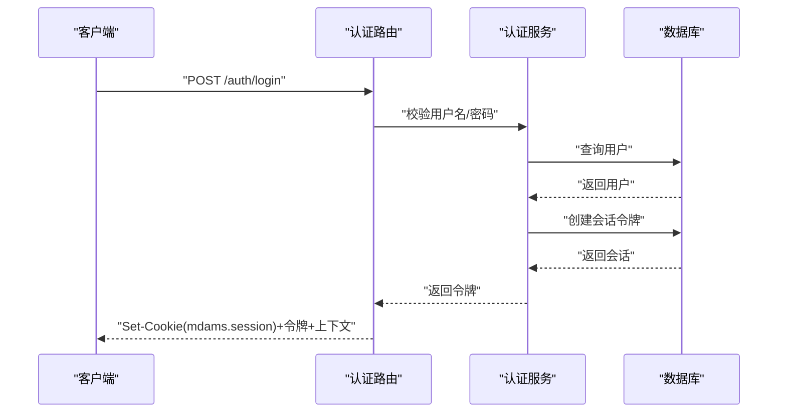
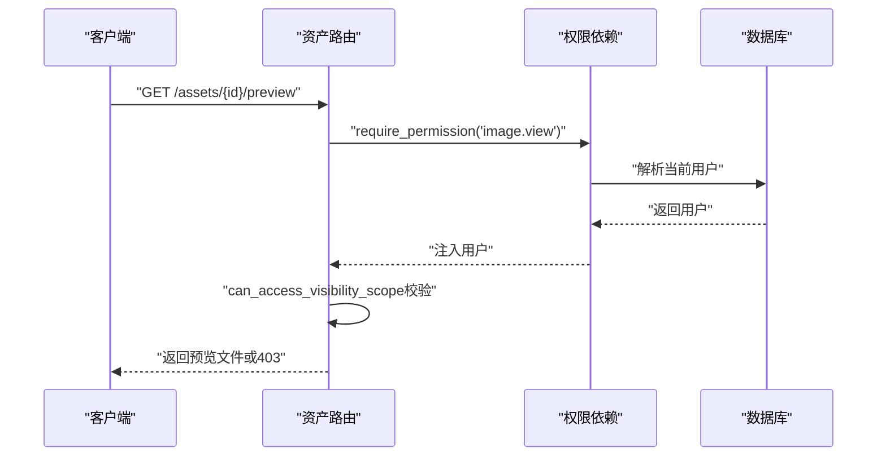
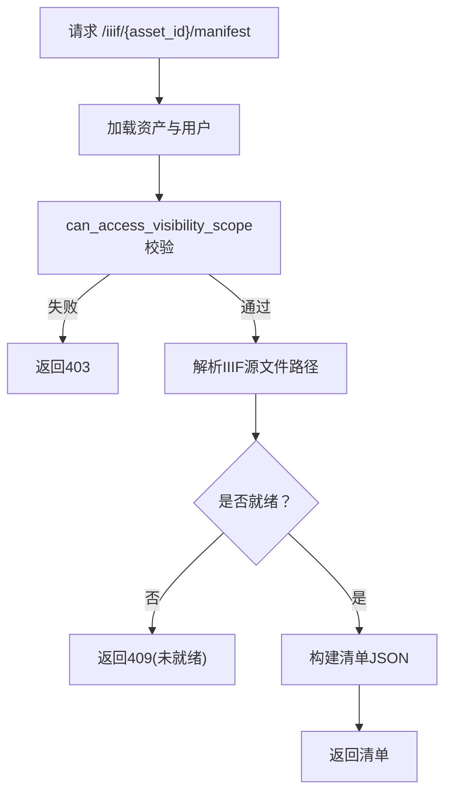
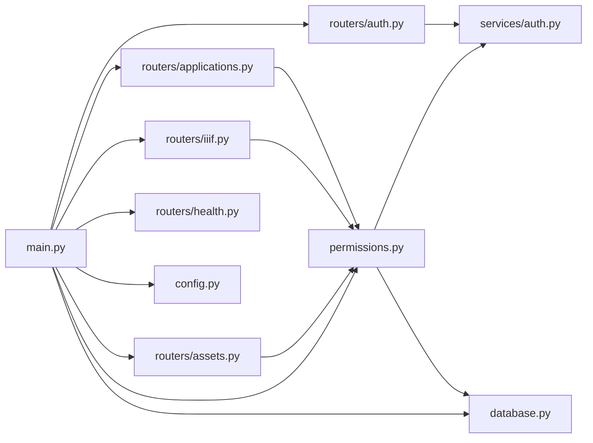
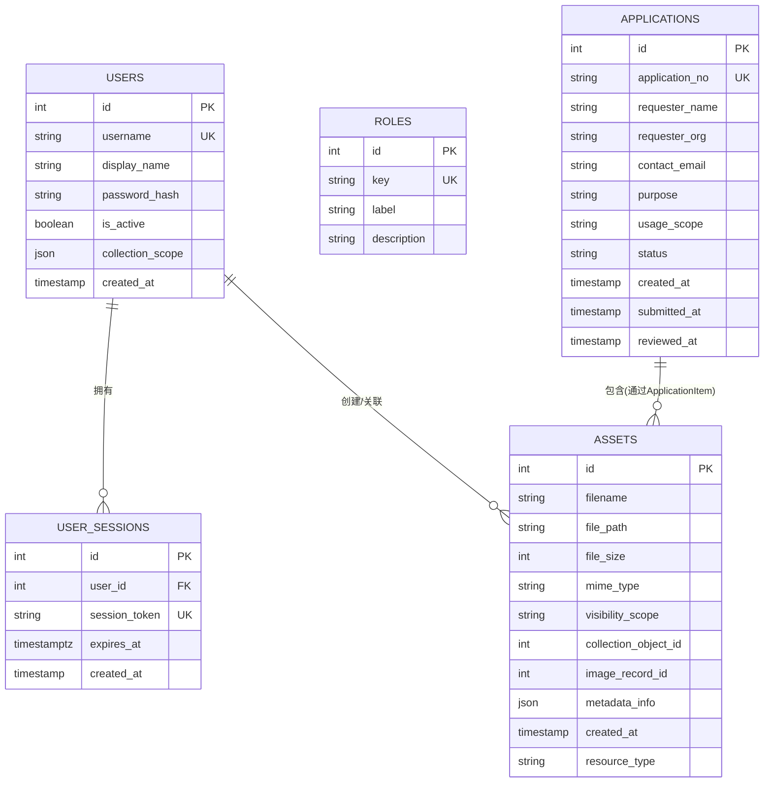

# 中间件架构

<cite>
**本文引用的文件**
- [backend/app/main.py](file://backend/app/main.py)
- [backend/app/config.py](file://backend/app/config.py)
- [backend/app/database.py](file://backend/app/database.py)
- [backend/app/permissions.py](file://backend/app/permissions.py)
- [backend/app/routers/auth.py](file://backend/app/routers/auth.py)
- [backend/app/routers/assets.py](file://backend/app/routers/assets.py)
- [backend/app/routers/iiif.py](file://backend/app/routers/iiif.py)
- [backend/app/routers/applications.py](file://backend/app/routers/applications.py)
- [backend/app/routers/health.py](file://backend/app/routers/health.py)
- [backend/app/services/auth.py](file://backend/app/services/auth.py)
- [backend/app/models.py](file://backend/app/models.py)
</cite>

## 目录
1. [引言](#引言)
2. [项目结构](#项目结构)
3. [核心组件](#核心组件)
4. [架构总览](#架构总览)
5. [详细组件分析](#详细组件分析)
6. [依赖分析](#依赖分析)
7. [性能考量](#性能考量)
8. [故障排查指南](#故障排查指南)
9. [结论](#结论)
10. [附录](#附录)

## 引言
本文件面向MDAMS原型项目的中间件架构，聚焦于FastAPI中间件的实现与集成方式，系统梳理CORS中间件配置、权限控制中间件、日志记录与异常处理机制，并结合实际路由与服务层依赖，给出中间件执行顺序、请求响应拦截流程、权限校验策略、以及开发最佳实践、性能优化与安全防护建议。文档旨在帮助开发者快速理解并扩展中间件体系。

## 项目结构
后端采用FastAPI应用入口集中注册中间件与路由的整体结构。应用启动时初始化数据库表与默认鉴权数据，随后注册CORS中间件与全部业务路由。权限控制通过依赖注入与权限装饰器在路由层实现，未使用自定义ASGI中间件。

图表来源
- [backend/app/main.py:64-86](file://backend/app/main.py#L64-L86)
- [backend/app/routers/auth.py:10](file://backend/app/routers/auth.py#L10)
- [backend/app/routers/assets.py:24](file://backend/app/routers/assets.py#L24)
- [backend/app/routers/iiif.py:21](file://backend/app/routers/iiif.py#L21)
- [backend/app/routers/applications.py:23](file://backend/app/routers/applications.py#L23)
- [backend/app/routers/health.py:11](file://backend/app/routers/health.py#L11)

章节来源
- [backend/app/main.py:1-86](file://backend/app/main.py#L1-L86)

## 核心组件
- CORS中间件：在应用启动时注册，允许跨域请求，支持通配符方法与头，暴露所有响应头。
- 权限控制：通过依赖注入解析当前用户，基于角色与权限矩阵进行授权；提供“任一权限”和“必须权限”的装饰器；支持可见性范围校验。
- 数据库会话：统一的SQLAlchemy会话工厂，贯穿各路由依赖。
- 配置模块：加载环境变量，提供数据库、Redis、上传目录、公开URL等配置项。
- 认证服务：密码哈希、会话令牌生成与过期校验、默认用户与角色种子数据。

章节来源
- [backend/app/main.py:66-73](file://backend/app/main.py#L66-L73)
- [backend/app/permissions.py:17-94](file://backend/app/permissions.py#L17-L94)
- [backend/app/database.py:11-16](file://backend/app/database.py#L11-L16)
- [backend/app/config.py:42-72](file://backend/app/config.py#L42-L72)
- [backend/app/services/auth.py:62-99](file://backend/app/services/auth.py#L62-L99)

## 架构总览
下图展示从客户端到路由处理、权限校验与数据库交互的总体流程，以及CORS中间件在请求进入时的拦截位置。

图表来源
- [backend/app/main.py:66-86](file://backend/app/main.py#L66-L86)
- [backend/app/permissions.py:179-204](file://backend/app/permissions.py#L179-L204)
- [backend/app/database.py:11-16](file://backend/app/database.py#L11-L16)

## 详细组件分析

### CORS中间件
- 注册位置：应用入口处集中添加。
- 配置要点：允许任意源、凭证、方法与头，暴露所有响应头，满足前端开发调试需求。
- 执行顺序：作为第一个中间件，优先处理预检请求与跨域头注入。

章节来源
- [backend/app/main.py:66-73](file://backend/app/main.py#L66-L73)

### 权限控制中间件与依赖
- 当前用户解析：支持从Authorization头（Bearer令牌）、Cookie（mdams.session）与兼容头（X-MDAMS-User、X-MDAMS-Collection-Scope）解析用户上下文。
- 角色-权限映射：内置多角色权限矩阵，覆盖图像、三维、应用、系统管理等维度。
- 可见性范围校验：根据资源可见性（open/owner_only）与用户馆藏范围判定访问权限。
- 装饰器授权：require_permission与require_any_permission在路由层强制校验，未通过抛出403错误。

图表来源
- [backend/app/permissions.py:179-204](file://backend/app/permissions.py#L179-L204)
- [backend/app/permissions.py:214-236](file://backend/app/permissions.py#L214-L236)
- [backend/app/permissions.py:239-254](file://backend/app/permissions.py#L239-L254)

章节来源
- [backend/app/permissions.py:102-151](file://backend/app/permissions.py#L102-L151)
- [backend/app/permissions.py:179-204](file://backend/app/permissions.py#L179-L204)
- [backend/app/permissions.py:214-236](file://backend/app/permissions.py#L214-L236)
- [backend/app/permissions.py:239-254](file://backend/app/permissions.py#L239-L254)

### 认证与会话
- 登录流程：用户名密码校验成功后创建会话令牌，写入Cookie并返回令牌与用户上下文。
- 会话存储：令牌存入数据库UserSession表，带过期时间；过期自动清理。
- 登出流程：删除对应会话令牌并清除Cookie。

图表来源
- [backend/app/routers/auth.py:53-68](file://backend/app/routers/auth.py#L53-L68)
- [backend/app/services/auth.py:136-142](file://backend/app/services/auth.py#L136-L142)
- [backend/app/services/auth.py:102-112](file://backend/app/services/auth.py#L102-L112)
- [backend/app/services/auth.py:129-133](file://backend/app/services/auth.py#L129-L133)

章节来源
- [backend/app/routers/auth.py:53-82](file://backend/app/routers/auth.py#L53-L82)
- [backend/app/services/auth.py:102-142](file://backend/app/services/auth.py#L102-L142)

### 资产与应用路由中的权限应用
- 资产上传：需要image.upload权限；可见性范围与馆藏ID规范化处理。
- 资产列表/详情/预览：需要image.view权限；同时进行可见性范围校验。
- 应用创建/审批/导出：按需要求application.create/review/export/view_all/view_own等权限；导出前校验状态。

图表来源
- [backend/app/routers/assets.py:254-291](file://backend/app/routers/assets.py#L254-L291)
- [backend/app/permissions.py:239-254](file://backend/app/permissions.py#L239-L254)

章节来源
- [backend/app/routers/assets.py:54-133](file://backend/app/routers/assets.py#L54-L133)
- [backend/app/routers/assets.py:209-265](file://backend/app/routers/assets.py#L209-L265)
- [backend/app/routers/applications.py:132-174](file://backend/app/routers/applications.py#L132-L174)
- [backend/app/routers/applications.py:203-232](file://backend/app/routers/applications.py#L203-L232)
- [backend/app/routers/applications.py:235-253](file://backend/app/routers/applications.py#L235-L253)

### IIIF访问与可见性控制
- 清单与图片代理：均要求image.view权限；对不可见资源直接返回403。
- 源文件路径解析：优先使用IIIF可访问派生文件，否则回退到原始文件；若仍不可用则返回404或409。
- 公开URL与反向代理：根据请求头与配置推断API与Cantaloupe基础URL，确保清单与服务地址正确。

图表来源
- [backend/app/routers/iiif.py:138-154](file://backend/app/routers/iiif.py#L138-L154)
- [backend/app/routers/iiif.py:57-63](file://backend/app/routers/iiif.py#L57-L63)
- [backend/app/routers/iiif.py:111-135](file://backend/app/routers/iiif.py#L111-L135)

章节来源
- [backend/app/routers/iiif.py:138-302](file://backend/app/routers/iiif.py#L138-L302)
- [backend/app/permissions.py:239-254](file://backend/app/permissions.py#L239-L254)

### 健康检查与异常处理
- 健康检查：检查数据库连通性与上传目录存在性，综合返回健康状态与HTTP状态码。
- 异常处理：路由中对不存在资源、权限不足、文件缺失等情况抛出HTTP异常，由FastAPI默认异常处理器统一处理。

章节来源
- [backend/app/routers/health.py:14-49](file://backend/app/routers/health.py#L14-L49)
- [backend/app/routers/applications.py:64-80](file://backend/app/routers/applications.py#L64-L80)

## 依赖分析
- 应用入口依赖：main.py依赖CORS中间件、数据库初始化、权限模块与各路由模块。
- 权限模块依赖：permissions.py依赖数据库会话、用户模型与认证服务；提供CurrentUser与权限装饰器。
- 路由依赖：各路由依赖数据库会话、权限依赖与具体服务；部分路由依赖配置模块。
- 认证服务依赖：services.auth.py依赖数据库模型与时间/加密工具；负责会话令牌与默认数据。

图表来源
- [backend/app/main.py:64-86](file://backend/app/main.py#L64-L86)
- [backend/app/permissions.py:9-11](file://backend/app/permissions.py#L9-L11)
- [backend/app/routers/assets.py:11](file://backend/app/routers/assets.py#L11)
- [backend/app/routers/iiif.py:13](file://backend/app/routers/iiif.py#L13)
- [backend/app/routers/applications.py:15](file://backend/app/routers/applications.py#L15)
- [backend/app/routers/auth.py:8](file://backend/app/routers/auth.py#L8)

章节来源
- [backend/app/main.py:64-86](file://backend/app/main.py#L64-L86)
- [backend/app/permissions.py:9-11](file://backend/app/permissions.py#L9-L11)
- [backend/app/routers/assets.py:11](file://backend/app/routers/assets.py#L11)
- [backend/app/routers/iiif.py:13](file://backend/app/routers/iiif.py#L13)
- [backend/app/routers/applications.py:15](file://backend/app/routers/applications.py#L15)
- [backend/app/routers/auth.py:8](file://backend/app/routers/auth.py#L8)

## 性能考量
- 会话令牌过期：会话包含UTC过期时间，过期即清理，避免无效令牌占用查询。
- 依赖注入开销：权限解析与数据库查询在每个受保护路由都会发生，建议在高并发场景下：
  - 使用连接池与合理的超时配置；
  - 对频繁调用的只读接口启用缓存（如用户权限快照）；
  - 合理拆分路由，减少不必要的权限检查层级。
- CORS配置：生产环境建议限制allow_origins为可信域名，避免通配符带来的安全风险与额外头部处理。

章节来源
- [backend/app/services/auth.py:102-126](file://backend/app/services/auth.py#L102-L126)
- [backend/app/main.py:66-73](file://backend/app/main.py#L66-L73)

## 故障排查指南
- 401未认证：确认Authorization头格式为Bearer令牌或Cookie mdams.session有效；检查会话是否过期。
- 403禁止访问：确认当前用户具备所需权限；核对可见性范围与馆藏范围。
- 404资源不存在：确认资产ID或应用ID正确；检查文件是否存在。
- 409 IIIF未就绪：等待派生文件生成或检查源文件可用性。
- 健康检查失败：检查数据库连通性与上传目录权限。

章节来源
- [backend/app/permissions.py:186-204](file://backend/app/permissions.py#L186-L204)
- [backend/app/permissions.py:214-236](file://backend/app/permissions.py#L214-L236)
- [backend/app/routers/iiif.py:134-135](file://backend/app/routers/iiif.py#L134-L135)
- [backend/app/routers/health.py:23-30](file://backend/app/routers/health.py#L23-L30)

## 结论
MDAMS原型项目采用“路由层权限控制+CORS中间件”的轻量中间件架构：CORS在应用入口统一处理跨域；权限控制通过依赖注入与装饰器在路由层实现，结合可见性范围与角色权限矩阵，形成清晰的访问控制闭环。该架构简单可靠，便于扩展与维护；在生产环境中建议收紧CORS白名单、引入更细粒度的缓存与限流策略，并完善全局异常与审计日志。

## 附录
- 数据模型概览：用户、角色、会话、资产、应用等核心实体及关系，支撑权限与访问控制。

图表来源
- [backend/app/models.py:28-110](file://backend/app/models.py#L28-L110)
- [backend/app/models.py:176-213](file://backend/app/models.py#L176-L213)