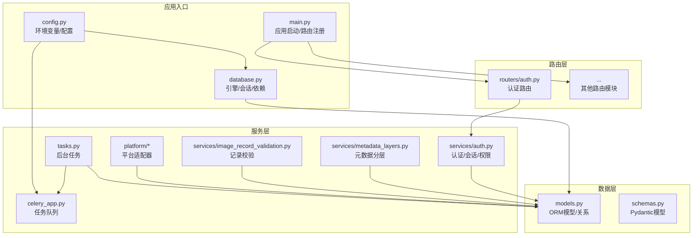
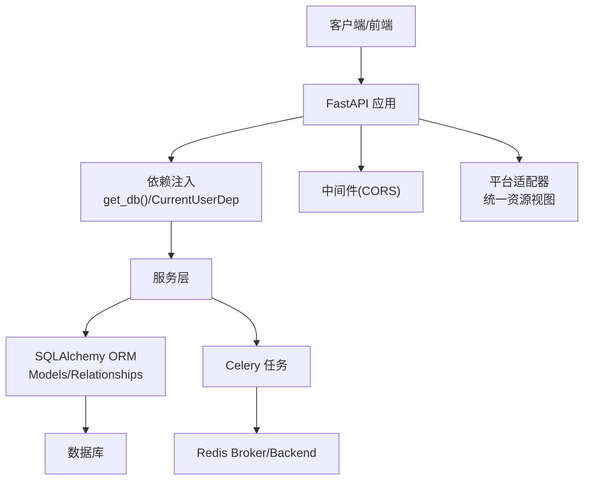
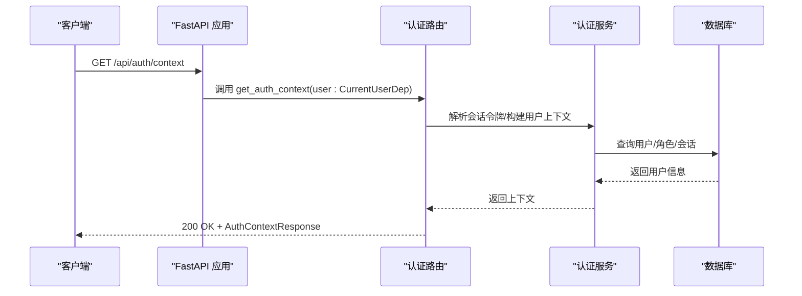
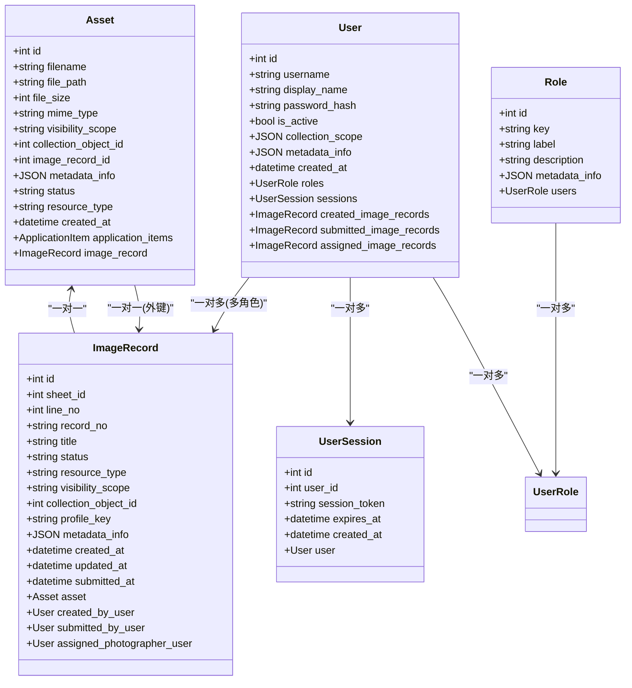
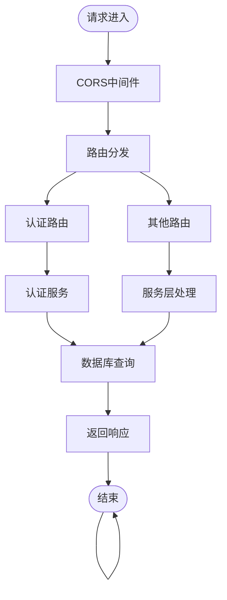
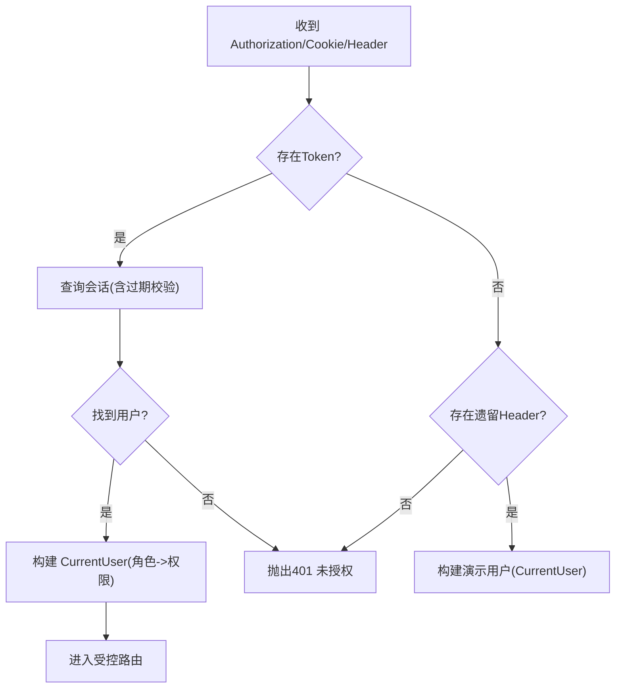
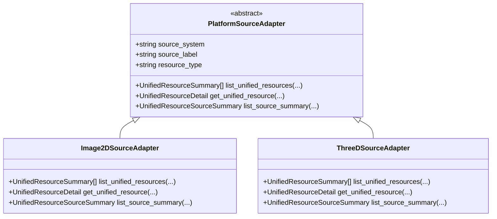
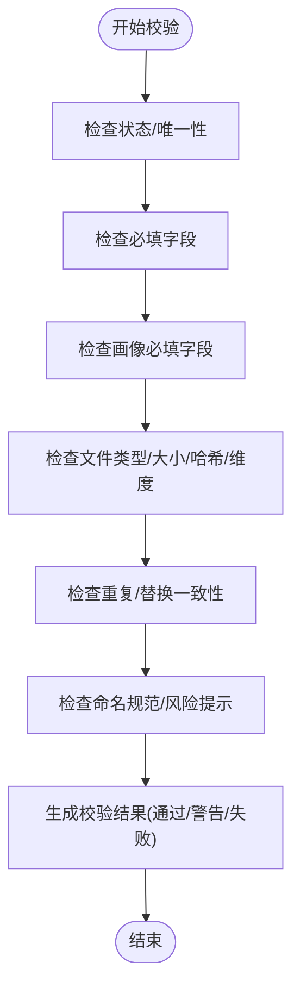
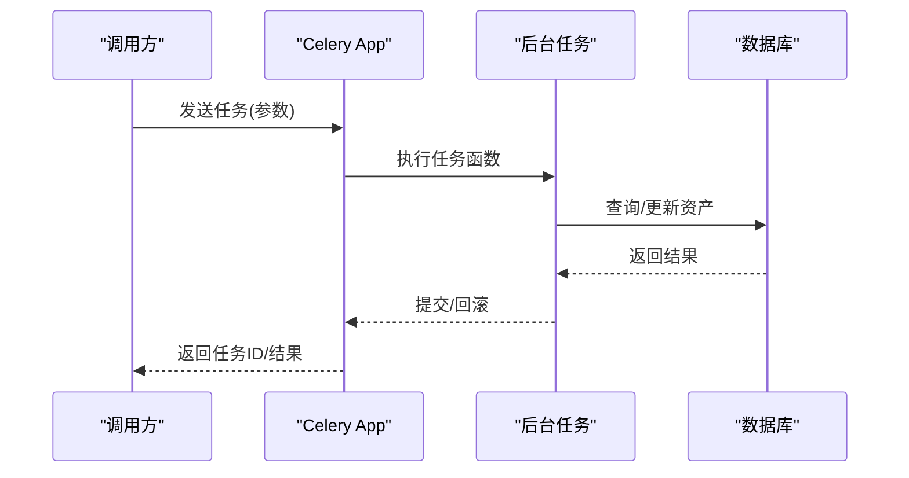
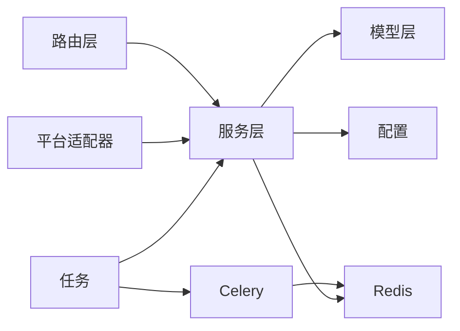

# 后端架构设计

<cite>
**本文档引用的文件**
- [backend/app/main.py](file://backend/app/main.py)
- [backend/app/config.py](file://backend/app/config.py)
- [backend/app/database.py](file://backend/app/database.py)
- [backend/app/models.py](file://backend/app/models.py)
- [backend/app/schemas.py](file://backend/app/schemas.py)
- [backend/app/routers/auth.py](file://backend/app/routers/auth.py)
- [backend/app/services/auth.py](file://backend/app/services/auth.py)
- [backend/app/permissions.py](file://backend/app/permissions.py)
- [backend/app/celery_app.py](file://backend/app/celery_app.py)
- [backend/app/tasks.py](file://backend/app/tasks.py)
- [backend/app/platform/base.py](file://backend/app/platform/base.py)
- [backend/app/platform/image_source.py](file://backend/app/platform/image_source.py)
- [backend/app/platform/three_d_source.py](file://backend/app/platform/three_d_source.py)
- [backend/app/services/image_record_validation.py](file://backend/app/services/image_record_validation.py)
- [backend/app/services/metadata_layers.py](file://backend/app/services/metadata_layers.py)
</cite>

## 目录
1. [引言](#引言)
2. [项目结构](#项目结构)
3. [核心组件](#核心组件)
4. [架构总览](#架构总览)
5. [详细组件分析](#详细组件分析)
6. [依赖分析](#依赖分析)
7. [性能考虑](#性能考虑)
8. [故障排查指南](#故障排查指南)
9. [结论](#结论)
10. [附录](#附录)

## 引言
本文件面向MDAMS原型项目的后端架构设计，围绕基于FastAPI + SQLAlchemy的Python后端进行系统性梳理。重点阐述整体设计模式（MVC分层、模块化组织）、FastAPI核心特性应用（依赖注入、Pydantic模型验证、异步处理思路）、SQLAlchemy ORM设计（模型定义、关系映射、会话管理）、路由与中间件体系、异常与权限控制、以及平台适配器与任务调度等关键主题。文档同时给出API设计原则、错误码规范建议与日志策略，帮助开发者快速理解并扩展系统。

## 项目结构
后端采用“应用包”组织方式，按职责划分为：入口与配置、数据库与模型、路由层、服务层、平台适配器、任务与Celery、工具与脚本等模块。核心入口负责初始化数据库、加载认证种子数据、注册路由；路由层承接HTTP请求；服务层封装业务逻辑；平台适配器抽象多源统一资源视图；Celery用于后台任务编排。

**图表来源**
- [backend/app/main.py:1-86](file://backend/app/main.py#L1-L86)
- [backend/app/config.py:1-72](file://backend/app/config.py#L1-L72)
- [backend/app/database.py:1-17](file://backend/app/database.py#L1-L17)
- [backend/app/models.py:1-307](file://backend/app/models.py#L1-L307)
- [backend/app/schemas.py:1-652](file://backend/app/schemas.py#L1-L652)
- [backend/app/routers/auth.py:1-83](file://backend/app/routers/auth.py#L1-L83)
- [backend/app/services/auth.py:1-143](file://backend/app/services/auth.py#L1-L143)
- [backend/app/services/metadata_layers.py:1-636](file://backend/app/services/metadata_layers.py#L1-L636)
- [backend/app/services/image_record_validation.py:1-563](file://backend/app/services/image_record_validation.py#L1-L563)
- [backend/app/platform/base.py:1-42](file://backend/app/platform/base.py#L1-L42)
- [backend/app/platform/image_source.py:1-228](file://backend/app/platform/image_source.py#L1-L228)
- [backend/app/platform/three_d_source.py:1-224](file://backend/app/platform/three_d_source.py#L1-L224)
- [backend/app/tasks.py:1-262](file://backend/app/tasks.py#L1-L262)
- [backend/app/celery_app.py:1-19](file://backend/app/celery_app.py#L1-L19)

**章节来源**
- [backend/app/main.py:1-86](file://backend/app/main.py#L1-L86)
- [backend/app/config.py:1-72](file://backend/app/config.py#L1-L72)
- [backend/app/database.py:1-17](file://backend/app/database.py#L1-L17)

## 核心组件
- 应用入口与生命周期
  - 初始化数据库表与SQLite兼容性迁移
  - 注册健康检查、认证、资产、应用、AI、下载、IIIF、导入、图像记录、三维、平台等路由
  - 种子化认证数据
- 配置中心
  - 支持从项目向外查找最近的.env文件，避免外部依赖
  - 提供数据库URL、Redis、上传目录、API与Cantaloupe公开地址等配置项
  - 面向Moonshot/Kimi的OpenAI兼容配置
- 数据库与模型
  - 使用SQLAlchemy声明式基类，定义资产、用户、角色、会话、图像记录、应用、三维资产等模型
  - 定义外键关系与反向关系，支持级联删除与孤儿对象清理
- 路由与服务
  - 认证路由提供上下文查询、用户列表、登录登出
  - 服务层实现密码哈希、会话令牌生成、用户会话查询与过期清理、权限解析与校验
- 平台适配器
  - 抽象统一资源视图，分别实现二维图像与三维资源的数据源适配
  - 提供资源汇总、搜索过滤、详情转换等能力
- 任务与Celery
  - 定义后台任务（如生成IIIF访问衍生品、PSB转大Tiff、人脸识别）
  - 通过Redis作为Broker与Backend

**章节来源**
- [backend/app/main.py:21-86](file://backend/app/main.py#L21-L86)
- [backend/app/config.py:5-72](file://backend/app/config.py#L5-L72)
- [backend/app/database.py:1-17](file://backend/app/database.py#L1-L17)
- [backend/app/models.py:1-307](file://backend/app/models.py#L1-L307)
- [backend/app/routers/auth.py:1-83](file://backend/app/routers/auth.py#L1-L83)
- [backend/app/services/auth.py:1-143](file://backend/app/services/auth.py#L1-L143)
- [backend/app/platform/base.py:1-42](file://backend/app/platform/base.py#L1-L42)
- [backend/app/platform/image_source.py:1-228](file://backend/app/platform/image_source.py#L1-L228)
- [backend/app/platform/three_d_source.py:1-224](file://backend/app/platform/three_d_source.py#L1-L224)
- [backend/app/tasks.py:1-262](file://backend/app/tasks.py#L1-L262)
- [backend/app/celery_app.py:1-19](file://backend/app/celery_app.py#L1-L19)

## 架构总览
系统采用“路由-服务-数据”的经典MVC分层，结合FastAPI的依赖注入与Pydantic模型实现强类型输入输出；SQLAlchemy负责数据持久化与关系建模；Celery承担异步任务编排；平台适配器统一多源资源视图，支撑上层统一检索与展示。

**图表来源**
- [backend/app/main.py:64-86](file://backend/app/main.py#L64-L86)
- [backend/app/database.py:11-17](file://backend/app/database.py#L11-L17)
- [backend/app/permissions.py:179-207](file://backend/app/permissions.py#L179-L207)
- [backend/app/celery_app.py:5-15](file://backend/app/celery_app.py#L5-L15)
- [backend/app/platform/base.py:14-42](file://backend/app/platform/base.py#L14-L42)

## 详细组件分析

### FastAPI与依赖注入
- 应用初始化
  - 创建FastAPI实例，启用CORS中间件
  - 在启动时创建表结构、执行SQLite兼容性迁移、种子化认证数据
  - 注册全部路由模块
- 依赖注入
  - 数据库依赖：get_db提供Session，确保try/finally关闭会话
  - 权限依赖：CurrentUserDep解析Cookie或Header中的会话令牌，构建当前用户上下文
- Pydantic模型
  - 以BaseModel定义响应与请求模型，使用ConfigDict(from_attributes=True)实现ORM对象到模型的序列化
  - 模型字段覆盖响应所需结构，包含状态、访问路径、输出链接、元数据分层等

**图表来源**
- [backend/app/routers/auth.py:25-28](file://backend/app/routers/auth.py#L25-L28)
- [backend/app/permissions.py:179-207](file://backend/app/permissions.py#L179-L207)
- [backend/app/services/auth.py:115-127](file://backend/app/services/auth.py#L115-L127)

**章节来源**
- [backend/app/main.py:64-86](file://backend/app/main.py#L64-L86)
- [backend/app/database.py:11-17](file://backend/app/database.py#L11-L17)
- [backend/app/schemas.py:1-652](file://backend/app/schemas.py#L1-L652)
- [backend/app/routers/auth.py:1-83](file://backend/app/routers/auth.py#L1-L83)
- [backend/app/permissions.py:179-207](file://backend/app/permissions.py#L179-L207)
- [backend/app/services/auth.py:115-127](file://backend/app/services/auth.py#L115-L127)

### SQLAlchemy ORM设计
- 模型与关系
  - 资产、用户、角色、会话、图像记录、应用、三维资产等模型定义主键、索引与外键
  - 关系使用relationship定义反向关系，支持级联删除与孤儿对象清理
- 会话与依赖
  - SessionLocal提供非自动提交/刷新的会话工厂
  - get_db依赖每次调用yield一个会话，并在finally中关闭
- 迁移与兼容
  - 启动时对SQLite进行列与索引补丁，保证Schema兼容

**图表来源**
- [backend/app/models.py:6-26](file://backend/app/models.py#L6-L26)
- [backend/app/models.py:28-70](file://backend/app/models.py#L28-L70)
- [backend/app/models.py:72-99](file://backend/app/models.py#L72-L99)
- [backend/app/models.py:101-111](file://backend/app/models.py#L101-L111)
- [backend/app/models.py:144-174](file://backend/app/models.py#L144-L174)

**章节来源**
- [backend/app/database.py:1-17](file://backend/app/database.py#L1-L17)
- [backend/app/models.py:1-307](file://backend/app/models.py#L1-L307)

### 路由系统与中间件
- 路由注册
  - 在main.py中集中include各模块路由，形成统一API前缀与标签
- 中间件
  - CORS中间件允许任意来源、凭证、方法与头，便于跨域调试
- 异常处理
  - 路由层通过HTTPException返回标准化错误
  - 权限依赖在未认证或会话过期时抛出401/403

**图表来源**
- [backend/app/main.py:66-86](file://backend/app/main.py#L66-L86)
- [backend/app/routers/auth.py:53-83](file://backend/app/routers/auth.py#L53-L83)
- [backend/app/permissions.py:179-207](file://backend/app/permissions.py#L179-L207)

**章节来源**
- [backend/app/main.py:64-86](file://backend/app/main.py#L64-L86)
- [backend/app/routers/auth.py:1-83](file://backend/app/routers/auth.py#L1-L83)
- [backend/app/permissions.py:179-207](file://backend/app/permissions.py#L179-L207)

### 权限与认证
- 会话令牌
  - 登录成功后生成会话令牌，写入Cookie并返回上下文
  - 会话过期自动清理
- 权限解析
  - 基于角色集合计算权限集合
  - 支持多来源认证：Bearer Token、Cookie、遗留Header
- 可访问范围
  - 对不同可见性范围与馆藏责任范围进行访问控制

**图表来源**
- [backend/app/services/auth.py:102-127](file://backend/app/services/auth.py#L102-L127)
- [backend/app/permissions.py:179-207](file://backend/app/permissions.py#L179-L207)

**章节来源**
- [backend/app/services/auth.py:1-143](file://backend/app/services/auth.py#L1-L143)
- [backend/app/permissions.py:1-255](file://backend/app/permissions.py#L1-L255)

### 平台适配器与统一资源视图
- 抽象接口
  - PlatformSourceAdapter定义统一资源汇总、查询与详情获取的契约
- 具体实现
  - 二维图像适配器：基于Asset构建统一资源列表与详情，支持关键词搜索、状态/类型过滤、预览可用性判断
  - 三维资源适配器：基于ThreeDAsset构建统一资源列表与详情，支持预览状态与版本信息
- 注册机制
  - 通过registry注册适配器，便于扩展新数据源

**图表来源**
- [backend/app/platform/base.py:14-42](file://backend/app/platform/base.py#L14-L42)
- [backend/app/platform/image_source.py:196-228](file://backend/app/platform/image_source.py#L196-L228)
- [backend/app/platform/three_d_source.py:192-224](file://backend/app/platform/three_d_source.py#L192-L224)

**章节来源**
- [backend/app/platform/base.py:1-42](file://backend/app/platform/base.py#L1-L42)
- [backend/app/platform/image_source.py:1-228](file://backend/app/platform/image_source.py#L1-L228)
- [backend/app/platform/three_d_source.py:1-224](file://backend/app/platform/three_d_source.py#L1-L224)

### 元数据分层与校验
- 元数据分层
  - 将原始元数据归并为core/management/technical/profile/raw_metadata等分层，支持字段别名与规范化
  - 推断衍生策略、校验文件完整性与尺寸
- 图像记录校验
  - 提交校验：检查状态、唯一性、必填字段、可见性范围、画像配置等
  - 绑定校验：校验文件类型、大小、哈希、维度、重复性、命名规范等
- 字段标签与画像定义
  - 内置多画像定义与必填字段映射，支持别名解析

**图表来源**
- [backend/app/services/image_record_validation.py:163-370](file://backend/app/services/image_record_validation.py#L163-L370)
- [backend/app/services/image_record_validation.py:372-563](file://backend/app/services/image_record_validation.py#L372-L563)
- [backend/app/services/metadata_layers.py:412-508](file://backend/app/services/metadata_layers.py#L412-L508)

**章节来源**
- [backend/app/services/metadata_layers.py:1-636](file://backend/app/services/metadata_layers.py#L1-L636)
- [backend/app/services/image_record_validation.py:1-563](file://backend/app/services/image_record_validation.py#L1-L563)

### 任务与Celery
- 任务定义
  - 生成IIIF访问衍生品、PSB转大Tiff、人脸识别等
- 任务执行
  - 任务内部使用SessionLocal创建会话，捕获异常并标记资产错误
- 队列配置
  - 使用Redis作为Broker与Backend，设置结果过期

**图表来源**
- [backend/app/tasks.py:151-182](file://backend/app/tasks.py#L151-L182)
- [backend/app/tasks.py:189-262](file://backend/app/tasks.py#L189-L262)
- [backend/app/celery_app.py:5-15](file://backend/app/celery_app.py#L5-L15)

**章节来源**
- [backend/app/tasks.py:1-262](file://backend/app/tasks.py#L1-L262)
- [backend/app/celery_app.py:1-19](file://backend/app/celery_app.py#L1-L19)

## 依赖分析
- 组件耦合
  - 路由依赖服务层，服务层依赖模型与配置
  - 平台适配器依赖服务层的元数据分层与访问工具
  - 任务依赖Celery与数据库，间接依赖服务层工具
- 外部依赖
  - FastAPI、SQLAlchemy、Celery、Redis、Pydantic
- 循环依赖
  - 通过模块拆分与延迟导入避免循环依赖

**图表来源**
- [backend/app/routers/auth.py:1-83](file://backend/app/routers/auth.py#L1-L83)
- [backend/app/services/auth.py:1-143](file://backend/app/services/auth.py#L1-L143)
- [backend/app/platform/image_source.py:1-228](file://backend/app/platform/image_source.py#L1-L228)
- [backend/app/platform/three_d_source.py:1-224](file://backend/app/platform/three_d_source.py#L1-L224)
- [backend/app/tasks.py:1-262](file://backend/app/tasks.py#L1-L262)
- [backend/app/celery_app.py:1-19](file://backend/app/celery_app.py#L1-L19)

**章节来源**
- [backend/app/routers/auth.py:1-83](file://backend/app/routers/auth.py#L1-L83)
- [backend/app/services/auth.py:1-143](file://backend/app/services/auth.py#L1-L143)
- [backend/app/platform/base.py:1-42](file://backend/app/platform/base.py#L1-L42)
- [backend/app/tasks.py:1-262](file://backend/app/tasks.py#L1-L262)
- [backend/app/celery_app.py:1-19](file://backend/app/celery_app.py#L1-L19)

## 性能考虑
- 数据库连接
  - 使用非自动提交/刷新的Session，减少开销；依赖注入确保会话及时关闭
- 查询优化
  - 为常用过滤字段建立索引（如visibility_scope、image_record_id、sheet_id等）
  - 分页与排序在服务层实现，避免一次性加载大量数据
- 缓存与队列
  - 利用Redis作为Celery Backend，缓存任务结果与中间态
- 异步处理
  - 采用Celery异步执行耗时任务（如衍生品生成、人脸识别），避免阻塞请求线程

[本节为通用指导，无需特定文件引用]

## 故障排查指南
- 认证相关
  - 401未授权：检查会话令牌是否有效、是否过期；确认Cookie或Header传递正确
  - 403权限不足：核对用户角色与权限映射，确认访问范围
- 数据库相关
  - SQLite Schema不一致：关注启动时的列与索引补丁；确保迁移脚本顺序
  - 会话泄漏：确认依赖注入的get_db是否在finally中关闭
- 任务相关
  - 任务失败：查看任务日志与异常堆栈；确认Redis连通性与Broker配置
  - 资产状态异常：检查任务中对资产状态与metadata_info的更新逻辑

**章节来源**
- [backend/app/permissions.py:179-207](file://backend/app/permissions.py#L179-L207)
- [backend/app/services/auth.py:102-127](file://backend/app/services/auth.py#L102-L127)
- [backend/app/main.py:21-60](file://backend/app/main.py#L21-L60)
- [backend/app/database.py:11-17](file://backend/app/database.py#L11-L17)
- [backend/app/tasks.py:175-181](file://backend/app/tasks.py#L175-L181)

## 结论
该后端架构以FastAPI为核心，结合SQLAlchemy实现清晰的分层与模块化组织；通过依赖注入与Pydantic模型强化了类型安全与接口契约；平台适配器统一多源资源视图，便于扩展；Celery异步任务提升吞吐与用户体验。整体设计遵循MVC与关注点分离原则，具备良好的可维护性与扩展性。

[本节为总结性内容，无需特定文件引用]

## 附录

### API设计原则
- 路由前缀与标签：按功能域划分前缀与标签，便于聚合与文档生成
- 请求/响应模型：统一使用Pydantic模型，明确字段含义与默认值
- 错误处理：使用HTTPException返回语义化状态码与错误信息
- 认证与权限：优先使用Bearer Token与Cookie；必要时保留遗留Header兼容

[本节为通用指导，无需特定文件引用]

### 错误码规范（建议）
- 400 参数错误：请求参数缺失或格式不合法
- 401 未授权：会话无效或过期
- 403 禁止访问：权限不足
- 404 资源不存在：实体不存在或ID非法
- 500 服务器错误：服务内部异常

[本节为通用指导，无需特定文件引用]

### 日志记录策略（建议）
- 请求级：记录请求方法、路径、参数摘要、响应状态与耗时
- 任务级：记录任务ID、参数、执行状态与异常堆栈
- 认证级：记录登录/登出、会话创建/销毁、权限变更
- 数据库级：记录慢查询与异常SQL

[本节为通用指导，无需特定文件引用]