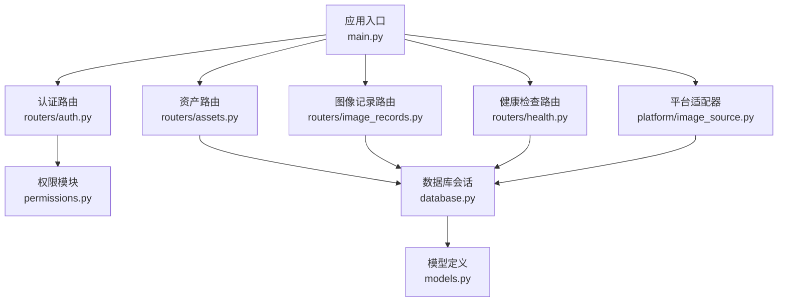
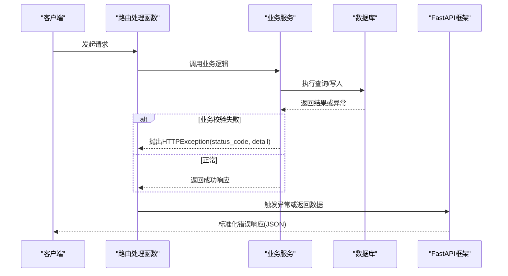
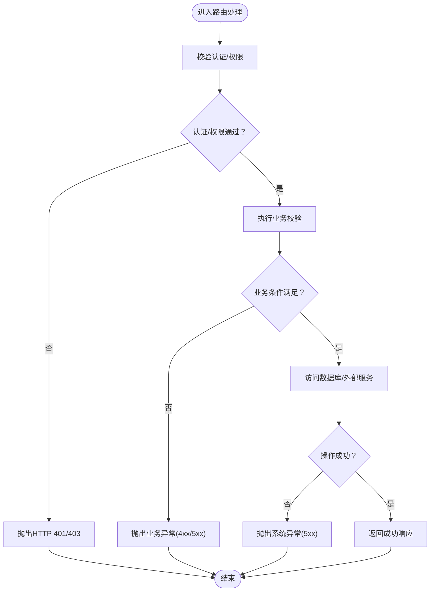
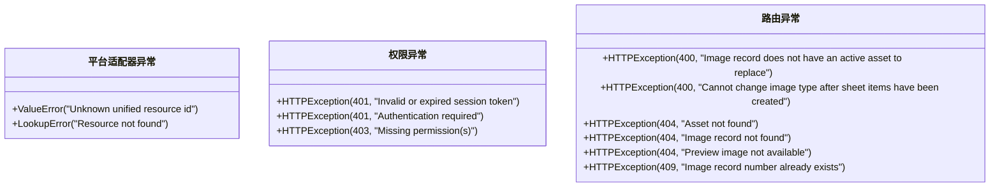
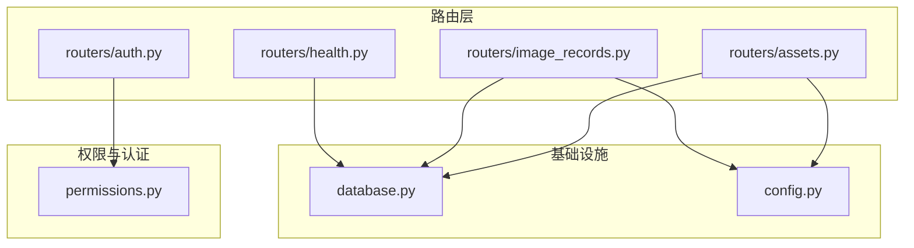

# 异常处理设计

<cite>
**本文档引用的文件**
- [main.py](file://backend/app/main.py)
- [config.py](file://backend/app/config.py)
- [database.py](file://backend/app/database.py)
- [permissions.py](file://backend/app/permissions.py)
- [auth.py](file://backend/app/routers/auth.py)
- [health.py](file://backend/app/routers/health.py)
- [assets.py](file://backend/app/routers/assets.py)
- [image_records.py](file://backend/app/routers/image_records.py)
- [image_source.py](file://backend/app/platform/image_source.py)
- [models.py](file://backend/app/models.py)
- [schemas.py](file://backend/app/schemas.py)
</cite>

## 目录
1. [引言](#引言)
2. [项目结构](#项目结构)
3. [核心组件](#核心组件)
4. [架构概览](#架构概览)
5. [详细组件分析](#详细组件分析)
6. [依赖分析](#依赖分析)
7. [性能考虑](#性能考虑)
8. [故障排除指南](#故障排除指南)
9. [结论](#结论)
10. [附录](#附录)

## 引言
本设计文档聚焦于MDAMS原型项目的异常处理机制，基于FastAPI框架对HTTPException的使用、自定义异常类定义以及全局异常处理器配置进行系统性分析。通过对业务异常、系统异常、网络异常的分类处理策略，结合错误响应格式标准化、错误码规范、调试信息处理等方面，提供可操作的最佳实践、日志记录策略和用户体验优化建议。

## 项目结构
后端采用FastAPI应用入口集中注册各路由模块，数据库连接通过SQLAlchemy会话管理，权限控制通过依赖注入实现。异常处理主要体现在各路由模块中对HTTPException的抛出与捕获，以及健康检查模块对HTTP状态码的动态返回。

**图表来源**
- [main.py:64-86](file://backend/app/main.py#L64-L86)
- [auth.py:1-83](file://backend/app/routers/auth.py#L1-L83)
- [assets.py:1-292](file://backend/app/routers/assets.py#L1-L292)
- [image_records.py:1-800](file://backend/app/routers/image_records.py#L1-L800)
- [health.py:14-60](file://backend/app/routers/health.py#L14-L60)
- [image_source.py:1-228](file://backend/app/platform/image_source.py#L1-L228)
- [database.py:1-17](file://backend/app/database.py#L1-L17)
- [models.py:1-307](file://backend/app/models.py#L1-L307)

**章节来源**
- [main.py:64-86](file://backend/app/main.py#L64-L86)
- [config.py:1-72](file://backend/app/config.py#L1-L72)
- [database.py:1-17](file://backend/app/database.py#L1-L17)

## 核心组件
- 应用入口与中间件：在应用启动时初始化数据库表、执行SQLite兼容性迁移，并注册CORS中间件，确保跨域请求安全。
- 权限与认证：通过依赖注入获取当前用户上下文，支持多种认证方式（Bearer Token、Cookie、Legacy Header），并在鉴权失败时抛出HTTP 401。
- 路由层异常：各路由模块在业务校验失败或资源不存在时抛出HTTPException，统一返回标准错误响应。
- 健康检查：根据数据库连接与上传目录状态动态决定HTTP状态码，异常时返回包含错误详情的负载。

**章节来源**
- [main.py:21-60](file://backend/app/main.py#L21-L60)
- [permissions.py:179-204](file://backend/app/permissions.py#L179-L204)
- [auth.py:54-68](file://backend/app/routers/auth.py#L54-L68)
- [health.py:14-49](file://backend/app/routers/health.py#L14-L49)

## 架构概览
异常处理在FastAPI中的典型流程：客户端发起请求 → 路由处理函数执行 → 业务逻辑校验 → 抛出HTTPException → FastAPI自动序列化为JSON响应 → 客户端接收标准化错误。

**图表来源**
- [assets.py:162-166](file://backend/app/routers/assets.py#L162-L166)
- [image_records.py:571-575](file://backend/app/routers/image_records.py#L571-L575)
- [health.py:44-49](file://backend/app/routers/health.py#L44-L49)

## 详细组件分析

### FastAPI异常处理机制与HTTPException使用
- 在认证路由中，当用户名或密码无效时抛出HTTP 401；在登出流程中，若存在Token则删除会话并清理Cookie。
- 在资产路由中，当资源不存在时抛出HTTP 404；当用户无权限访问时抛出HTTP 403；在预览图不可用时抛出HTTP 404。
- 在图像记录路由中，当记录不存在、重复编号冲突、分配摄影师角色不合法等情况抛出相应HTTP异常。
- 在健康检查路由中，根据数据库连通性与上传目录状态动态设置HTTP状态码，异常时返回包含错误详情的负载。

**图表来源**
- [auth.py:54-68](file://backend/app/routers/auth.py#L54-L68)
- [assets.py:162-166](file://backend/app/routers/assets.py#L162-L166)
- [assets.py:261-265](file://backend/app/routers/assets.py#L261-L265)
- [assets.py:274-281](file://backend/app/routers/assets.py#L274-L281)
- [image_records.py:571-575](file://backend/app/routers/image_records.py#L571-L575)
- [image_records.py:563-569](file://backend/app/routers/image_records.py#L563-L569)
- [image_records.py:599-609](file://backend/app/routers/image_records.py#L599-L609)
- [health.py:14-49](file://backend/app/routers/health.py#L14-L49)

**章节来源**
- [auth.py:54-68](file://backend/app/routers/auth.py#L54-L68)
- [assets.py:162-166](file://backend/app/routers/assets.py#L162-L166)
- [assets.py:261-265](file://backend/app/routers/assets.py#L261-L265)
- [assets.py:274-281](file://backend/app/routers/assets.py#L274-L281)
- [image_records.py:563-569](file://backend/app/routers/image_records.py#L563-L569)
- [image_records.py:571-575](file://backend/app/routers/image_records.py#L571-L575)
- [image_records.py:599-609](file://backend/app/routers/image_records.py#L599-L609)
- [health.py:14-49](file://backend/app/routers/health.py#L14-L49)

### 自定义异常类定义与使用场景
- 当资源ID格式不合法或资源不存在时，平台适配器抛出ValueError与LookupError，用于区分“未知ID”和“未找到资源”的语义差异。
- 在权限模块中，当会话Token无效或过期、或缺少认证时，抛出HTTP 401；当用户缺少所需权限时，抛出HTTP 403。
- 在路由层，针对业务规则（如唯一性约束、可见性范围、状态机转换）抛出HTTP 400/403/404/409等。

**图表来源**
- [image_source.py:156-161](file://backend/app/platform/image_source.py#L156-L161)
- [permissions.py:189-204](file://backend/app/permissions.py#L189-L204)
- [assets.py:162-166](file://backend/app/routers/assets.py#L162-L166)
- [assets.py:274-281](file://backend/app/routers/assets.py#L274-L281)
- [image_records.py:434-464](file://backend/app/routers/image_records.py#L434-L464)
- [image_records.py:617-624](file://backend/app/routers/image_records.py#L617-L624)
- [image_records.py:571-575](file://backend/app/routers/image_records.py#L571-L575)
- [image_records.py:563-569](file://backend/app/routers/image_records.py#L563-L569)

**章节来源**
- [image_source.py:156-161](file://backend/app/platform/image_source.py#L156-L161)
- [permissions.py:189-204](file://backend/app/permissions.py#L189-L204)
- [assets.py:162-166](file://backend/app/routers/assets.py#L162-L166)
- [assets.py:274-281](file://backend/app/routers/assets.py#L274-L281)
- [image_records.py:434-464](file://backend/app/routers/image_records.py#L434-L464)
- [image_records.py:617-624](file://backend/app/routers/image_records.py#L617-L624)
- [image_records.py:571-575](file://backend/app/routers/image_records.py#L571-L575)
- [image_records.py:563-569](file://backend/app/routers/image_records.py#L563-L569)

### 全局异常处理器配置
- 当前项目未显式注册自定义全局异常处理器，所有异常均通过HTTPException由FastAPI默认序列化为JSON响应。
- 建议在应用入口处注册全局异常处理器，以实现：
  - 统一错误响应格式（包含错误码、消息、时间戳、调试信息等字段）
  - 区分业务异常与系统异常，分别记录不同级别的日志
  - 对敏感信息进行脱敏处理（如避免泄露内部路径、堆栈详情）

**章节来源**
- [main.py:64-86](file://backend/app/main.py#L64-L86)

### 不同类型异常处理策略
- 业务异常（4xx）：由路由层直接抛出HTTPException，携带明确的错误描述；前端据此展示友好提示或引导用户修正输入。
- 系统异常（5xx）：由数据库访问失败、文件系统异常、第三方服务调用失败等触发；建议在全局异常处理器中捕获并返回标准化错误。
- 网络异常：在调用外部服务（如人脸识别、Cantaloupe）时，应设置超时与重试策略，并在异常时返回可恢复的错误码与重试建议。

**章节来源**
- [health.py:24-29](file://backend/app/routers/health.py#L24-L29)
- [config.py:58-67](file://backend/app/config.py#L58-L67)

### 错误响应格式标准化与错误码规范
- 标准化响应字段建议：
  - 时间戳：ISO 8601格式
  - 错误码：HTTP状态码或自定义业务码
  - 消息：人类可读的错误描述
  - 调试信息：仅在调试环境返回，生产环境隐藏
  - 请求ID：便于追踪与审计
- 错误码规范建议：
  - 400系列：参数校验失败、业务规则违反
  - 401：未认证或会话失效
  - 403：权限不足
  - 404：资源不存在
  - 409：冲突（如唯一性约束）
  - 500系列：服务器内部错误

**章节来源**
- [health.py:35-41](file://backend/app/routers/health.py#L35-L41)
- [assets.py:162-166](file://backend/app/routers/assets.py#L162-L166)
- [image_records.py:563-569](file://backend/app/routers/image_records.py#L563-L569)

### 调试信息处理
- 健康检查模块在数据库异常时将错误字符串写入响应负载，便于快速定位问题。
- 建议在全局异常处理器中：
  - 将异常信息记录到日志系统（区分级别）
  - 生成唯一请求ID并附加到响应头或日志上下文
  - 在生产环境隐藏堆栈详情与内部路径

**章节来源**
- [health.py:26-29](file://backend/app/routers/health.py#L26-L29)

### 最佳实践与用户体验优化
- 提示信息本地化：将错误消息翻译为多语言，提升国际化体验。
- 重试与降级：对外部服务调用设置指数退避重试与熔断降级策略。
- 前端友好提示：根据错误码映射到用户可理解的提示文案，必要时提供操作指引。
- 审计与追踪：为每个请求生成唯一ID，贯穿日志与监控系统，便于问题回溯。

**章节来源**
- [config.py:58-67](file://backend/app/config.py#L58-L67)

## 依赖分析
异常处理涉及的关键依赖关系如下：

**图表来源**
- [auth.py:1-83](file://backend/app/routers/auth.py#L1-L83)
- [assets.py:1-292](file://backend/app/routers/assets.py#L1-L292)
- [image_records.py:1-800](file://backend/app/routers/image_records.py#L1-L800)
- [health.py:1-60](file://backend/app/routers/health.py#L1-L60)
- [permissions.py:1-255](file://backend/app/permissions.py#L1-L255)
- [database.py:1-17](file://backend/app/database.py#L1-L17)
- [config.py:1-72](file://backend/app/config.py#L1-L72)

**章节来源**
- [auth.py:1-83](file://backend/app/routers/auth.py#L1-L83)
- [assets.py:1-292](file://backend/app/routers/assets.py#L1-L292)
- [image_records.py:1-800](file://backend/app/routers/image_records.py#L1-L800)
- [health.py:1-60](file://backend/app/routers/health.py#L1-L60)
- [permissions.py:1-255](file://backend/app/permissions.py#L1-L255)
- [database.py:1-17](file://backend/app/database.py#L1-L17)
- [config.py:1-72](file://backend/app/config.py#L1-L72)

## 性能考虑
- 异常路径应尽量避免昂贵的操作（如大文件IO、复杂计算），减少对正常路径的影响。
- 对频繁失败的外部服务调用，应引入缓存与熔断机制，降低异常传播风险。
- 日志记录应异步化，避免阻塞请求处理线程。

## 故障排除指南
- 认证失败：检查会话Token是否有效、是否过期；确认用户是否存在且处于激活状态。
- 权限不足：核对用户角色与权限矩阵，确认是否具备所需权限。
- 资源不存在：确认资源ID是否正确，数据库中是否存在对应记录。
- 数据库异常：检查连接字符串、数据库服务状态与网络连通性。
- 文件系统异常：确认上传目录权限与磁盘空间，排查文件锁与并发写入问题。

**章节来源**
- [permissions.py:189-204](file://backend/app/permissions.py#L189-L204)
- [assets.py:162-166](file://backend/app/routers/assets.py#L162-L166)
- [health.py:24-29](file://backend/app/routers/health.py#L24-L29)
- [database.py:11-17](file://backend/app/database.py#L11-L17)

## 结论
MDAMS原型项目的异常处理已较好地覆盖了认证、权限、业务规则与系统健康检查等关键场景，通过HTTPException实现了统一的错误响应。建议进一步完善全局异常处理器，统一错误格式与日志策略，增强调试信息的安全性与可追踪性，并在外围服务调用中引入重试与降级机制，以提升整体稳定性与用户体验。

## 附录
- 错误响应字段建议：timestamp、code、message、debug_info、request_id
- 健康检查响应字段：status、service、timestamp、checks、http_status
- 调试环境开关：通过环境变量控制是否返回详细错误信息

**章节来源**
- [health.py:35-41](file://backend/app/routers/health.py#L35-L41)
- [config.py:1-72](file://backend/app/config.py#L1-L72)