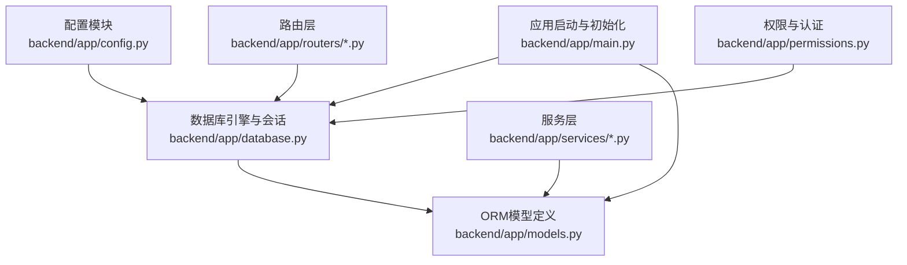
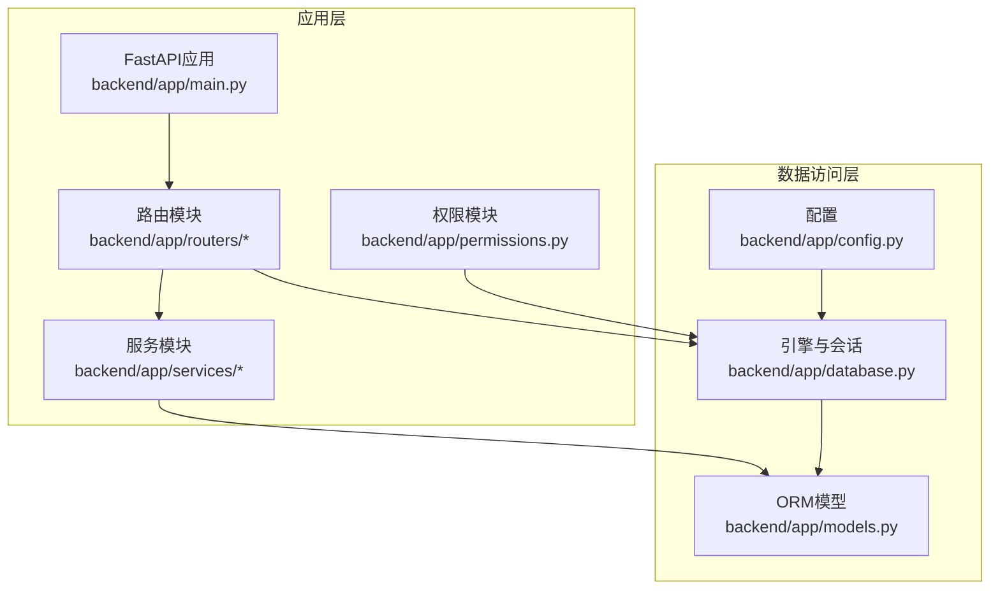
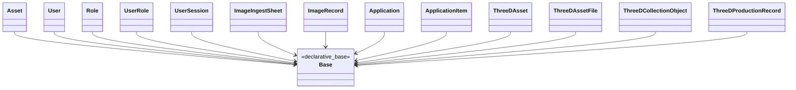
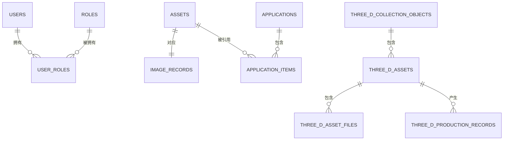
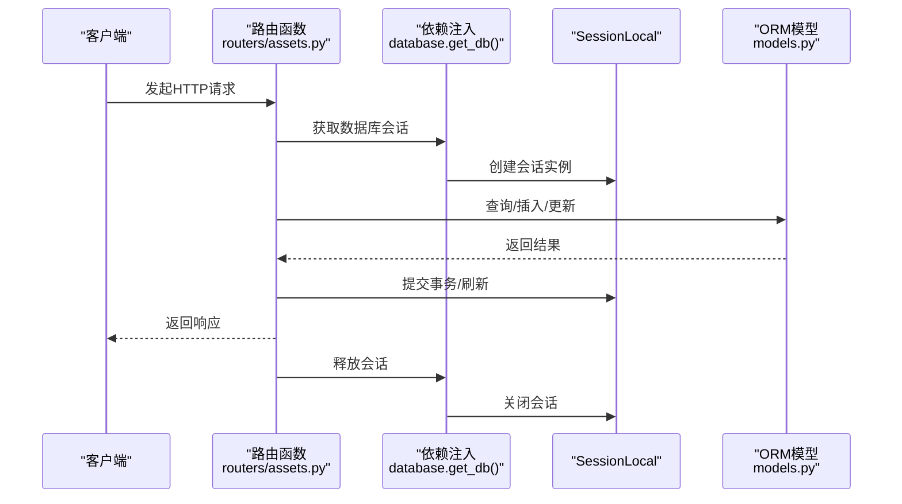
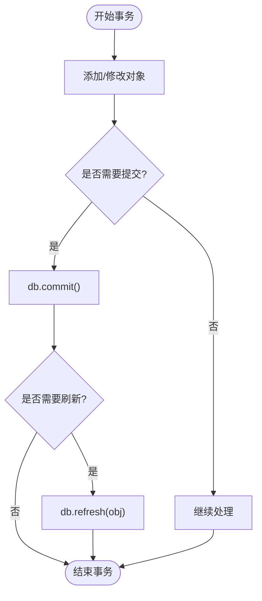
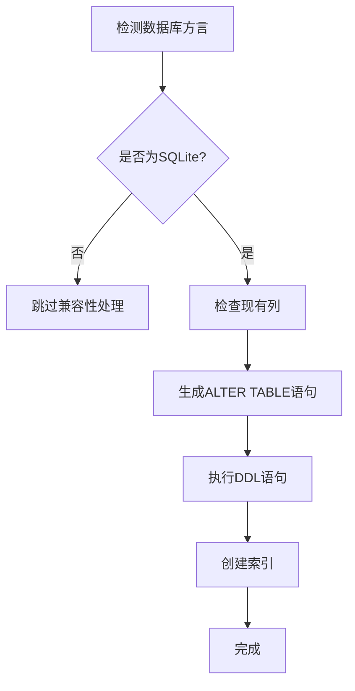
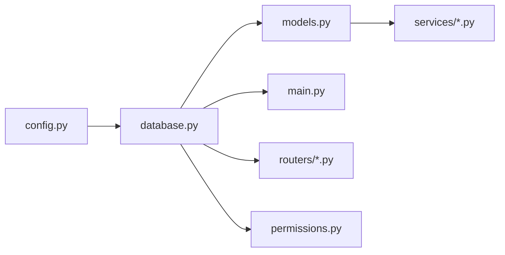

# 数据库ORM设计

<cite>
**本文引用的文件**
- [backend/app/database.py](file://backend/app/database.py)
- [backend/app/models.py](file://backend/app/models.py)
- [backend/app/config.py](file://backend/app/config.py)
- [backend/app/main.py](file://backend/app/main.py)
- [backend/app/routers/assets.py](file://backend/app/routers/assets.py)
- [backend/app/routers/applications.py](file://backend/app/routers/applications.py)
- [backend/app/permissions.py](file://backend/app/permissions.py)
- [backend/app/services/asset_detail.py](file://backend/app/services/asset_detail.py)
</cite>

## 目录
1. [简介](#简介)
2. [项目结构](#项目结构)
3. [核心组件](#核心组件)
4. [架构总览](#架构总览)
5. [详细组件分析](#详细组件分析)
6. [依赖分析](#依赖分析)
7. [性能考虑](#性能考虑)
8. [故障排查指南](#故障排查指南)
9. [结论](#结论)
10. [附录](#附录)

## 简介
本文件面向MDAMS原型项目的数据库ORM设计，围绕SQLAlchemy ORM的架构与实现进行系统化梳理，重点覆盖以下方面：
- Base类继承与模型定义规范
- 关系映射策略与外键约束
- 数据库连接池与Session生命周期管理
- 事务处理机制与并发控制
- 表结构兼容性与SQLite特殊处理
- 查询优化与性能调优建议
- 迁移与版本演进策略

目标是帮助开发者在不深入阅读源码的前提下，快速理解并正确使用ORM层，同时为后续扩展与维护提供清晰的设计依据。

## 项目结构
后端采用FastAPI + SQLAlchemy的典型分层组织方式：
- 配置层：读取环境变量，生成DATABASE_URL
- 引擎与会话层：创建引擎、会话工厂、依赖注入函数
- 模型层：基于Base的实体定义，包含关系与索引
- 路由层：业务接口，依赖注入获取Session并执行CRUD
- 服务层：封装业务逻辑，调用模型与工具函数
- 启动层：初始化表结构、种子数据与SQLite兼容性处理

图表来源
- [backend/app/config.py:42](file://backend/app/config.py#L42)
- [backend/app/database.py:1-17](file://backend/app/database.py#L1-L17)
- [backend/app/models.py:1-307](file://backend/app/models.py#L1-L307)
- [backend/app/main.py:58-62](file://backend/app/main.py#L58-L62)

章节来源
- [backend/app/config.py:1-72](file://backend/app/config.py#L1-L72)
- [backend/app/database.py:1-17](file://backend/app/database.py#L1-L17)
- [backend/app/main.py:58-62](file://backend/app/main.py#L58-L62)

## 核心组件
- 配置模块：从环境变量加载DATABASE_URL，默认指向PostgreSQL；支持自定义上传目录、公开URL等
- 引擎与会话：创建SQLAlchemy引擎与会话工厂，提供依赖注入函数以供路由使用
- 模型集合：涵盖资产、用户、角色、图像记录、申请单、3D资源等核心实体及其关系
- 应用启动：创建表结构、执行SQLite兼容性修复、初始化种子数据
- 路由与服务：通过依赖注入获取Session，执行增删改查与业务流程

章节来源
- [backend/app/config.py:42](file://backend/app/config.py#L42)
- [backend/app/database.py:6-16](file://backend/app/database.py#L6-L16)
- [backend/app/models.py:6-307](file://backend/app/models.py#L6-L307)
- [backend/app/main.py:58-62](file://backend/app/main.py#L58-L62)

## 架构总览
下图展示ORM层在系统中的位置与交互关系：

图表来源
- [backend/app/main.py:64-86](file://backend/app/main.py#L64-L86)
- [backend/app/routers/assets.py:8-13](file://backend/app/routers/assets.py#L8-L13)
- [backend/app/permissions.py:9-11](file://backend/app/permissions.py#L9-L11)
- [backend/app/database.py:1-17](file://backend/app/database.py#L1-L17)
- [backend/app/models.py:1-307](file://backend/app/models.py#L1-L307)
- [backend/app/config.py:42](file://backend/app/config.py#L42)

## 详细组件分析

### 1) Base类继承与模型定义规范
- 所有模型均继承自同一Base，确保统一的元数据注册与表结构管理
- 字段类型选择遵循可空性、唯一性与索引需求，如id为主键且建立索引
- JSON字段用于存储非结构化元数据，便于扩展与向后兼容
- 时间戳字段使用服务器默认值，减少应用侧时间一致性问题

图表来源
- [backend/app/models.py:1-307](file://backend/app/models.py#L1-L307)
- [backend/app/database.py:9](file://backend/app/database.py#L9)

章节来源
- [backend/app/models.py:1-307](file://backend/app/models.py#L1-L307)

### 2) 关系映射策略与外键约束
- 一对多/一对一：如Asset与ImageRecord（一对一）、User与UserRole/Role（一对多）
- 外键约束策略：
  - CASCADE：删除或更新主表时级联处理从表
  - SET NULL：删除主表时将从表外键置空，适用于可选关联
  - RESTRICT：限制删除/更新，保护引用完整性
- 级联删除孤儿对象：通过“delete-orphan”保证子实体随父实体删除而清理
- 多对多：通过中间表UserRole实现用户-角色映射

图表来源
- [backend/app/models.py:16, 93-94, 148, 204-205, 219, 261, 296:16-205](file://backend/app/models.py#L16-L205)
- [backend/app/models.py:295-306](file://backend/app/models.py#L295-L306)

章节来源
- [backend/app/models.py:16, 93-94, 148, 204-205, 219, 261, 296:16-205](file://backend/app/models.py#L16-L205)
- [backend/app/models.py:295-306](file://backend/app/models.py#L295-L306)

### 3) 数据库连接池管理与Session使用模式
- 引擎创建：通过DATABASE_URL构建SQLAlchemy引擎
- 会话工厂：使用sessionmaker创建SessionLocal，关闭自动提交与自动刷新，避免隐式提交带来的副作用
- 依赖注入：get_db提供依赖注入函数，每次请求创建新会话并在finally中关闭，确保资源释放
- 典型调用路径：路由函数通过Depends(get_db)获取Session，执行查询/写入后commit/refresh

图表来源
- [backend/app/routers/assets.py:59](file://backend/app/routers/assets.py#L59)
- [backend/app/database.py:11-16](file://backend/app/database.py#L11-L16)
- [backend/app/models.py:6-307](file://backend/app/models.py#L6-L307)

章节来源
- [backend/app/database.py:6-16](file://backend/app/database.py#L6-L16)
- [backend/app/routers/assets.py:54-133](file://backend/app/routers/assets.py#L54-L133)

### 4) 事务处理机制
- 显式事务：路由中在db.add/merge后调用db.commit，确保原子性
- 刷新对象：使用db.refresh获取最新状态，避免缓存不一致
- 批量读取优化：使用joinedload减少N+1查询，提升批量读取性能
- 示例场景：创建申请单时先flush获得主键，再批量插入明细项，最后commit

图表来源
- [backend/app/routers/applications.py:158-171](file://backend/app/routers/applications.py#L158-L171)
- [backend/app/routers/assets.py:126-128](file://backend/app/routers/assets.py#L126-L128)

章节来源
- [backend/app/routers/applications.py:132-174](file://backend/app/routers/applications.py#L132-L174)
- [backend/app/routers/assets.py:54-133](file://backend/app/routers/assets.py#L54-L133)

### 5) 表结构兼容性与SQLite特殊处理
- 启动阶段检测数据库方言，仅在SQLite时执行兼容性修复
- 动态添加缺失列（如visibility_scope、collection_object_id、image_record_id），并为关键列创建索引
- 对image_records补充sheet_id/line_no列，确保与PostgreSQL结构一致
- 使用原生SQL语句执行ALTER TABLE与CREATE INDEX，避免迁移工具依赖

图表来源
- [backend/app/main.py:21-57](file://backend/app/main.py#L21-L57)

章节来源
- [backend/app/main.py:21-57](file://backend/app/main.py#L21-L57)

### 6) 查询优化与性能调优
- 索引策略：对常用过滤/排序字段建立索引（如id、unique字段、外键、状态字段）
- 关系预加载：使用joinedload减少N+1查询，提升批量读取效率
- 分页与限制：列表接口支持skip/limit参数，结合索引避免全表扫描
- 元数据存储：JSON字段承载扩展信息，避免频繁新增表结构
- 服务层解耦：将复杂查询封装在服务层，路由层保持薄逻辑

章节来源
- [backend/app/routers/applications.py:178-189](file://backend/app/routers/applications.py#L178-L189)
- [backend/app/services/asset_detail.py:189-384](file://backend/app/services/asset_detail.py#L189-L384)

### 7) 权限与认证中的数据库交互
- 会话令牌校验：通过get_current_user从Header/Cookie解析令牌，查询User并构建当前用户上下文
- 角色与权限映射：根据用户角色汇总权限集合，支持细粒度访问控制
- 依赖注入：权限函数同样依赖get_db获取Session，确保认证流程与业务一致

章节来源
- [backend/app/permissions.py:179-200](file://backend/app/permissions.py#L179-L200)
- [backend/app/permissions.py:9](file://backend/app/permissions.py#L9)

## 依赖分析
- 配置依赖：DATABASE_URL决定连接目标（默认PostgreSQL）
- 引擎依赖：engine与SessionLocal贯穿所有模块
- 模型依赖：所有路由与服务依赖模型定义
- 启动依赖：main负责初始化表结构与兼容性处理

图表来源
- [backend/app/config.py:42](file://backend/app/config.py#L42)
- [backend/app/database.py:1-17](file://backend/app/database.py#L1-L17)
- [backend/app/models.py:1-307](file://backend/app/models.py#L1-L307)
- [backend/app/main.py:58-62](file://backend/app/main.py#L58-L62)

章节来源
- [backend/app/config.py:42](file://backend/app/config.py#L42)
- [backend/app/database.py:1-17](file://backend/app/database.py#L1-L17)
- [backend/app/models.py:1-307](file://backend/app/models.py#L1-L307)
- [backend/app/main.py:58-62](file://backend/app/main.py#L58-L62)

## 性能考虑
- 连接池与会话生命周期：避免长事务与持有会话过久，及时commit/refresh/close
- 查询优化：优先使用索引字段过滤，必要时使用joinedload减少往返
- 写入批量化：批量插入/更新时注意flush/commit时机，防止锁竞争
- 元数据扩展：通过JSON字段承载非结构化信息，降低表结构变更频率
- SQLite兼容：在开发/测试环境使用SQLite时，启用兼容性修复，确保行为与生产一致

## 故障排查指南
- 会话未关闭：确认路由中使用Depends(get_db)并在异常处理中释放会话
- 事务未提交：检查db.commit调用位置，确保写入成功
- SQLite列缺失：若出现列不存在错误，确认main启动时已执行兼容性修复
- 权限校验失败：检查Header/Cookie中的令牌是否有效，以及用户角色映射是否正确
- N+1查询：检查是否遗漏joinedload，或在循环中重复查询

章节来源
- [backend/app/database.py:11-16](file://backend/app/database.py#L11-L16)
- [backend/app/main.py:21-57](file://backend/app/main.py#L21-L57)
- [backend/app/permissions.py:179-200](file://backend/app/permissions.py#L179-L200)

## 结论
本ORM设计以清晰的分层与严格的依赖注入为核心，结合明确的关系映射与索引策略，在保证扩展性的同时兼顾了性能与稳定性。通过启动阶段的SQLite兼容性处理与显式事务管理，系统在不同环境下具备良好的一致性与可维护性。建议在后续迭代中引入正式迁移工具与更完善的监控指标，持续优化查询与事务性能。

## 附录
- 最佳实践清单
  - 明确外键约束策略，避免数据不一致
  - 为高频查询字段建立索引
  - 使用joinedload减少N+1查询
  - 显式commit/refresh，避免隐式提交
  - 在SQLite开发环境启用兼容性修复
  - 将复杂查询下沉至服务层，保持路由简洁