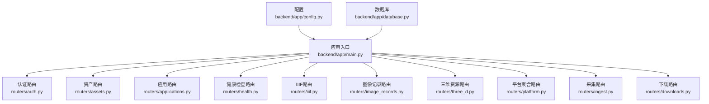
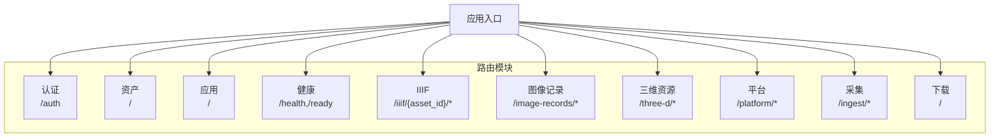
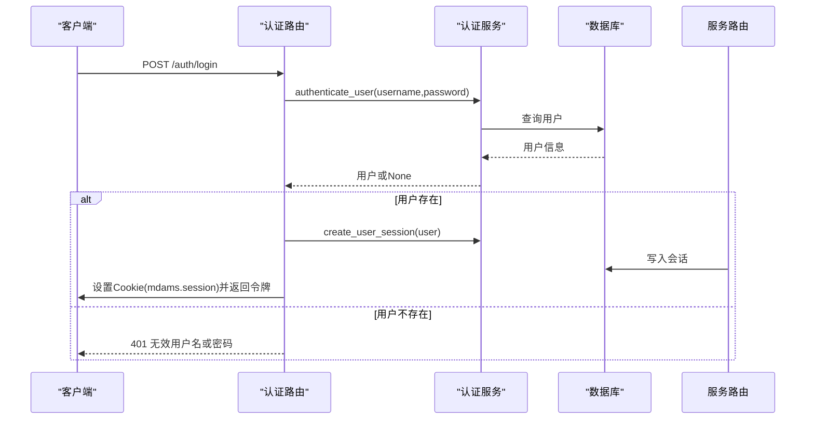
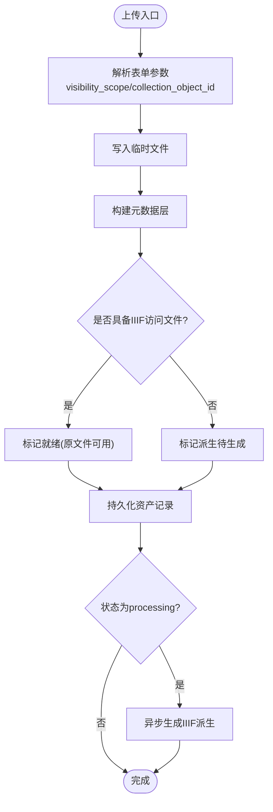
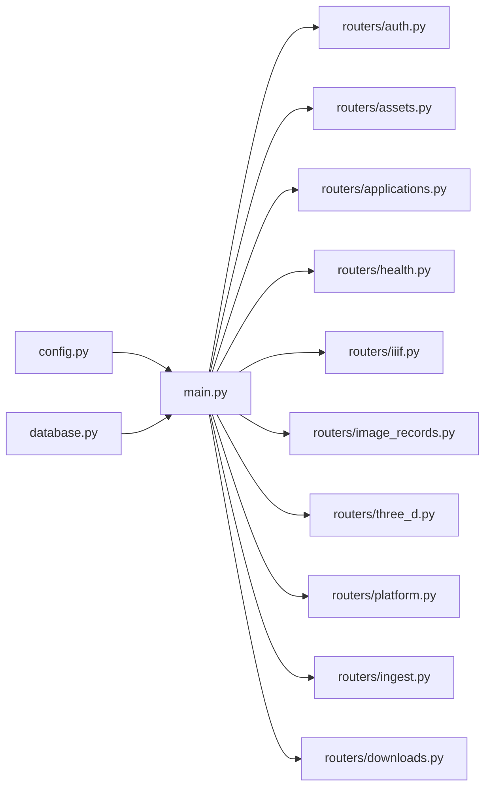

# 路由系统设计

<cite>
**本文档引用的文件**
- [backend/app/main.py](file://backend/app/main.py)
- [backend/app/routers/__init__.py](file://backend/app/routers/__init__.py)
- [backend/app/routers/auth.py](file://backend/app/routers/auth.py)
- [backend/app/routers/assets.py](file://backend/app/routers/assets.py)
- [backend/app/routers/applications.py](file://backend/app/routers/applications.py)
- [backend/app/routers/health.py](file://backend/app/routers/health.py)
- [backend/app/routers/iiif.py](file://backend/app/routers/iiif.py)
- [backend/app/routers/image_records.py](file://backend/app/routers/image_records.py)
- [backend/app/routers/three_d.py](file://backend/app/routers/three_d.py)
- [backend/app/routers/platform.py](file://backend/app/routers/platform.py)
- [backend/app/routers/ingest.py](file://backend/app/routers/ingest.py)
- [backend/app/routers/downloads.py](file://backend/app/routers/downloads.py)
- [backend/app/config.py](file://backend/app/config.py)
- [backend/app/database.py](file://backend/app/database.py)
</cite>

## 目录
1. [引言](#引言)
2. [项目结构](#项目结构)
3. [核心组件](#核心组件)
4. [架构概览](#架构概览)
5. [详细组件分析](#详细组件分析)
6. [依赖分析](#依赖分析)
7. [性能考虑](#性能考虑)
8. [故障排除指南](#故障排除指南)
9. [结论](#结论)
10. [附录](#附录)

## 引言
本设计文档聚焦于MDAMS原型项目的FastAPI路由系统，系统性梳理模块化组织结构、命名空间与URL模式设计，并深入解析认证、资产、应用、健康检查、IIIF、图像记录、三维资源、平台聚合、采集与下载等模块的路由定义。文档同时阐述路由装饰器的使用方式、依赖注入在路由中的应用、请求响应处理流程，并总结路由设计原则、RESTful API规范与错误处理机制。

## 项目结构
后端采用FastAPI应用入口集中注册各模块路由，路由按功能域拆分至独立文件，形成清晰的模块化组织：
- 应用入口：集中导入并include各模块router
- 路由模块：按领域划分，如认证、资产、应用、健康、IIIF、图像记录、三维、平台、采集、下载等
- 公共依赖：数据库会话、权限校验、配置常量等通过统一依赖注入

**图表来源**
- [backend/app/main.py:1-86](file://backend/app/main.py#L1-L86)
- [backend/app/routers/auth.py:1-83](file://backend/app/routers/auth.py#L1-L83)
- [backend/app/routers/assets.py:1-292](file://backend/app/routers/assets.py#L1-L292)
- [backend/app/routers/applications.py:1-254](file://backend/app/routers/applications.py#L1-L254)
- [backend/app/routers/health.py:1-60](file://backend/app/routers/health.py#L1-L60)
- [backend/app/routers/iiif.py:1-303](file://backend/app/routers/iiif.py#L1-L303)
- [backend/app/routers/image_records.py:1-800](file://backend/app/routers/image_records.py#L1-L800)
- [backend/app/routers/three_d.py:1-742](file://backend/app/routers/three_d.py#L1-L742)
- [backend/app/routers/platform.py:1-65](file://backend/app/routers/platform.py#L1-L65)
- [backend/app/routers/ingest.py:1-184](file://backend/app/routers/ingest.py#L1-L184)
- [backend/app/routers/downloads.py:1-119](file://backend/app/routers/downloads.py#L1-L119)
- [backend/app/config.py:1-72](file://backend/app/config.py#L1-L72)
- [backend/app/database.py:1-17](file://backend/app/database.py#L1-L17)

**章节来源**
- [backend/app/main.py:1-86](file://backend/app/main.py#L1-L86)
- [backend/app/routers/__init__.py:1-1](file://backend/app/routers/__init__.py#L1-L1)

## 核心组件
- 应用入口与中间件
  - 初始化数据库表与迁移兼容逻辑
  - 注入CORS中间件
  - 注册全部模块路由
- 数据库与依赖
  - SQLAlchemy引擎与会话工厂
  - get_db依赖提供数据库会话
- 配置
  - 环境变量加载与服务地址配置
  - 上传目录、Redis、API公共URL、Cantaloupe等

**章节来源**
- [backend/app/main.py:21-86](file://backend/app/main.py#L21-L86)
- [backend/app/database.py:1-17](file://backend/app/database.py#L1-L17)
- [backend/app/config.py:1-72](file://backend/app/config.py#L1-L72)

## 架构概览
路由系统遵循“模块化+命名空间”的组织方式，每个模块以APIRouter实例承载，部分模块设置前缀形成清晰的URL命名空间；通过依赖注入实现跨模块共享的数据库会话、当前用户与权限校验。

**图表来源**
- [backend/app/main.py:75-86](file://backend/app/main.py#L75-L86)
- [backend/app/routers/auth.py:10](file://backend/app/routers/auth.py#L10)
- [backend/app/routers/assets.py:24](file://backend/app/routers/assets.py#L24)
- [backend/app/routers/health.py:11](file://backend/app/routers/health.py#L11)
- [backend/app/routers/iiif.py:21](file://backend/app/routers/iiif.py#L21)
- [backend/app/routers/image_records.py:50](file://backend/app/routers/image_records.py#L50)
- [backend/app/routers/three_d.py:38](file://backend/app/routers/three_d.py#L38)
- [backend/app/routers/platform.py:12](file://backend/app/routers/platform.py#L12)
- [backend/app/routers/ingest.py:22](file://backend/app/routers/ingest.py#L22)
- [backend/app/routers/downloads.py:21](file://backend/app/routers/downloads.py#L21)

## 详细组件分析

### 认证路由（/auth）
- 路由前缀：/auth
- 主要端点
  - 获取认证上下文：GET /auth/context
  - 列出用户：GET /auth/users
  - 登录：POST /auth/login（设置会话Cookie）
  - 登出：POST /auth/logout（删除会话）
- 依赖与权限
  - 使用CurrentUserDep获取当前用户
  - 登录流程包含会话创建与Cookie设置
- 错误处理
  - 登录失败返回401
  - 会话删除时清理Cookie

**图表来源**
- [backend/app/routers/auth.py:53-83](file://backend/app/routers/auth.py#L53-L83)
- [backend/app/routers/auth.py:14-27](file://backend/app/routers/auth.py#L14-L27)

**章节来源**
- [backend/app/routers/auth.py:1-83](file://backend/app/routers/auth.py#L1-L83)

### 资产路由（/）
- 路由前缀：空（根路径）
- 主要端点
  - 根消息：GET /
  - 文件上传：POST /upload（multipart/form-data）
  - 资产列表：GET /assets
  - 删除资产：DELETE /assets/{asset_id}
  - 资产详情：GET /assets/{asset_id}
  - 预览图：GET /assets/{asset_id}/preview
  - 调试列出上传文件：GET /debug/files
- 关键特性
  - 上传支持可见性范围与集合对象ID的规范化
  - 预览图生成与缓存控制
  - 可见性范围与集合对象ID的多源判定
- 权限与可见性
  - 列表与详情均要求image.view权限
  - 删除需要image.delete权限
  - 通过can_access_visibility_scope进行访问控制

**图表来源**
- [backend/app/routers/assets.py:54-134](file://backend/app/routers/assets.py#L54-L134)
- [backend/app/routers/assets.py:136-159](file://backend/app/routers/assets.py#L136-L159)

**章节来源**
- [backend/app/routers/assets.py:1-292](file://backend/app/routers/assets.py#L1-L292)

### 应用路由（/）
- 路由前缀：空（根路径）
- 主要端点
  - 创建申请：POST /applications
  - 申请列表：GET /applications
  - 申请详情：GET /applications/{application_id}
  - 审批通过：POST /applications/{application_id}/approve
  - 审批拒绝：POST /applications/{application_id}/reject
  - 导出包：GET /applications/{application_id}/export（异步导出ZIP）
- 关键特性
  - 申请号自动生成
  - 导出包包含物理文件复制与清单生成
  - 状态流转与审核备注
- 权限
  - 创建需application.create
  - 查看需application.view_all或application.view_own
  - 审批需application.review
  - 导出需application.export

**章节来源**
- [backend/app/routers/applications.py:1-254](file://backend/app/routers/applications.py#L1-L254)

### 健康检查路由（/health,/ready）
- 路由前缀：空（根路径）
- 主要端点
  - 健康检查：GET /health
  - 就绪检查：GET /ready
- 校验内容
  - 数据库连通性
  - 上传目录存在性
  - 综合健康状态决定HTTP 200/503

**章节来源**
- [backend/app/routers/health.py:1-60](file://backend/app/routers/health.py#L1-L60)

### IIIF路由（/iiif/{asset_id}/*）
- 路由前缀：/iiif
- 主要端点
  - 清单：GET /iiif/{asset_id}/manifest
  - 图像服务代理：GET /iiif/{asset_id}/service/{image_path:path}
- 关键特性
  - 依据资产元数据动态生成IIIF清单
  - 代理Cantaloupe图像服务，必要时重写info.json的@id
  - 可见性控制与资产存在性校验
- 配置
  - 支持从环境变量或请求头推断API与Cantaloupe基础URL

**章节来源**
- [backend/app/routers/iiif.py:1-303](file://backend/app/routers/iiif.py#L1-L303)

### 图像记录路由（/image-records/*）
- 路由前缀：/image-records
- 主要端点
  - 轻量汇总、详情、保存、提交、绑定等大量CRUD与业务流程端点
  - 支持上传预处理、重复检测、绑定验证、审计追踪等
- 关键特性
  - 多层元数据建模（core、management、profile、raw_metadata）
  - 工作表与记录的关联与可见性控制
  - 与资产、人脸识别、派生策略等服务集成

**章节来源**
- [backend/app/routers/image_records.py:1-800](file://backend/app/routers/image_records.py#L1-L800)

### 三维资源路由（/three-d/*）
- 路由前缀：/three-d
- 主要端点
  - 元数据字典：GET /three-d/dictionary
  - 集合对象查询与详情：GET /three-d/collection-objects*
  - 三维资源上传：POST /three-d/upload（多文件角色归类）
  - 资源列表与详情：GET /three-d/resources*
  - 下载与文件级下载：GET /three-d/resources/{resource_id}/download
  - 文件下载：GET /three-d/resources/{resource_id}/files/{file_id}
  - 删除资源：DELETE /three-d/resources/{resource_id}
- 关键特性
  - 角色归类（模型、点云、斜摄影）与资源类型推断
  - 包装清单生成与预览准备
  - 可见性范围与集合对象ID控制

**章节来源**
- [backend/app/routers/three_d.py:1-742](file://backend/app/routers/three_d.py#L1-L742)

### 平台路由（/platform/*）
- 路由前缀：/platform
- 主要端点
  - 源系统列表：GET /platform/sources
  - 统一资源查询：GET /platform/resources
  - 统一资源详情：GET /platform/resources/{resource_id}
- 关键特性
  - 通过适配器注册表聚合多源数据
  - 支持按条件过滤与排序

**章节来源**
- [backend/app/routers/platform.py:1-65](file://backend/app/routers/platform.py#L1-L65)

### 采集路由（/ingest/*）
- 路由前缀：/ingest
- 主要端点
  - SIP（BagIt风格）采集：POST /ingest/sip（二进制文件+JSON清单）
- 关键特性
  - 客户端SHA256与服务端校验
  - EXIF元数据提取与尺寸推断
  - 元数据层构建与派生策略决策

**章节来源**
- [backend/app/routers/ingest.py:1-184](file://backend/app/routers/ingest.py#L1-L184)

### 下载路由（/）
- 路由前缀：空（根路径）
- 主要端点
  - 单文件下载：GET /assets/{asset_id}/download
  - BagIt打包下载：GET /assets/{asset_id}/download-bag（异步生成ZIP）
- 关键特性
  - 原始文件与IIIF派生文件的可选打包
  - 校验值计算与打包清单生成

**章节来源**
- [backend/app/routers/downloads.py:1-119](file://backend/app/routers/downloads.py#L1-L119)

## 依赖分析
- 应用入口对各模块路由的集中include，确保路由注册的一致性
- 各模块路由共享数据库依赖（get_db）与权限依赖（require_permission、CurrentUser）
- 配置模块提供统一的环境变量与服务地址，供路由与服务层使用

**图表来源**
- [backend/app/main.py:75-86](file://backend/app/main.py#L75-L86)
- [backend/app/config.py:1-72](file://backend/app/config.py#L1-L72)
- [backend/app/database.py:1-17](file://backend/app/database.py#L1-L17)

**章节来源**
- [backend/app/main.py:1-86](file://backend/app/main.py#L1-L86)

## 性能考虑
- 异步上传与派生生成
  - 资产上传与SIP采集在成功校验后可能触发异步任务生成IIIF派生，避免阻塞请求线程
- 缓存与代理
  - IIIF图像服务代理直接转发Cantaloupe响应，减少额外序列化开销
- 数据访问优化
  - 使用joinedload等策略减少N+1查询
- 文件系统
  - 上传目录存在性检查与权限校验，避免IO异常

[本节为通用指导，无需具体文件来源]

## 故障排除指南
- 认证与会话
  - 登录失败：检查用户名与密码是否正确，确认会话创建与Cookie设置
  - 登出后仍被拒绝：确认Cookie是否被正确删除
- 资产与下载
  - 上传后无法预览：检查IIIF派生状态与文件存在性
  - 下载失败：确认物理文件路径与权限
- 健康检查
  - /health返回非200：检查数据库连接与上传目录状态
- IIIF
  - 清单为空或404：确认资产可见性与派生文件可用性
  - 代理返回错误：检查Cantaloupe服务可达性与路径拼接

**章节来源**
- [backend/app/routers/auth.py:53-83](file://backend/app/routers/auth.py#L53-L83)
- [backend/app/routers/assets.py:136-159](file://backend/app/routers/assets.py#L136-L159)
- [backend/app/routers/health.py:14-60](file://backend/app/routers/health.py#L14-L60)
- [backend/app/routers/iiif.py:138-303](file://backend/app/routers/iiif.py#L138-L303)
- [backend/app/routers/downloads.py:39-119](file://backend/app/routers/downloads.py#L39-L119)

## 结论
该路由系统通过模块化与命名空间实现了清晰的功能边界，结合依赖注入与权限控制，保证了安全性与可维护性。RESTful设计贯穿各模块，错误处理与健康检查完善，为后续扩展与演进提供了良好基础。

## 附录

### 路由设计原则
- 模块化与命名空间：按功能域拆分路由，必要时使用前缀形成清晰URL层次
- 依赖注入：统一数据库会话与权限依赖，降低耦合
- 明确的HTTP语义：GET/POST/DELETE等与资源操作一一对应
- 错误即响应：明确的状态码与错误信息，便于前端与监控系统处理

### RESTful API规范要点
- 资源命名：使用名词复数形式，如/resources
- 过滤与分页：通过查询参数实现，如?q=&limit=
- 状态码：遵循2xx/4xx/5xx约定，错误响应包含描述信息
- 版本控制：建议在URL或头部引入版本标识（当前项目未显式实现）

### 错误处理机制
- 统一异常：使用HTTPException抛出明确错误
- 健康检查：综合数据库与文件系统状态，返回200或503
- 业务异常：在服务层与路由层分别捕获并转换为标准响应

[本节为通用指导，无需具体文件来源]