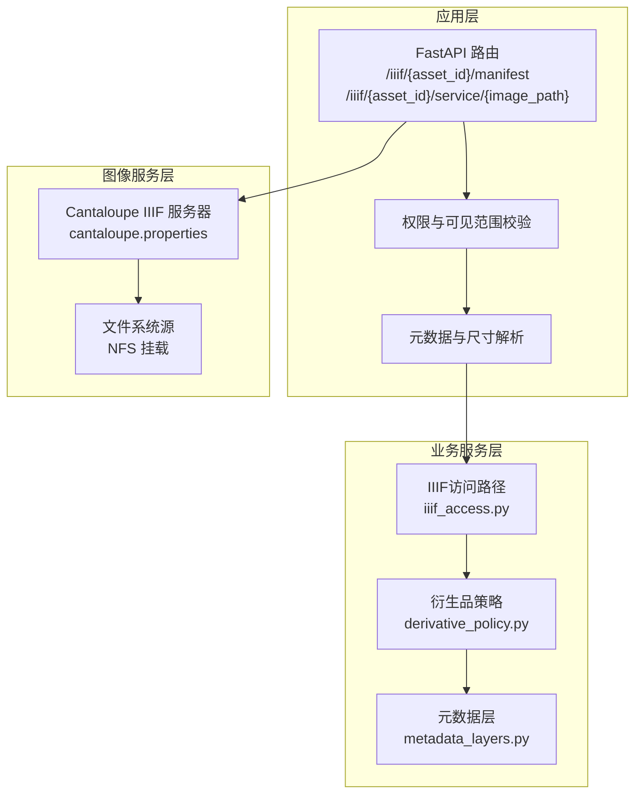
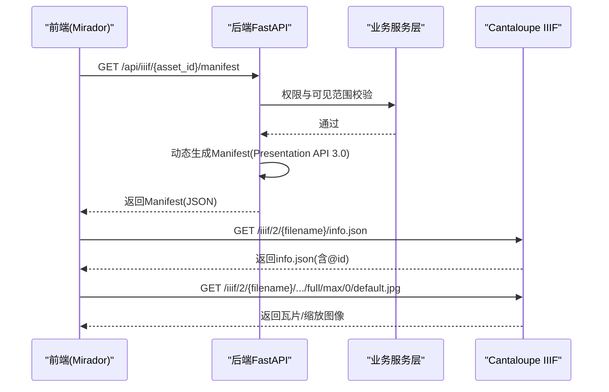
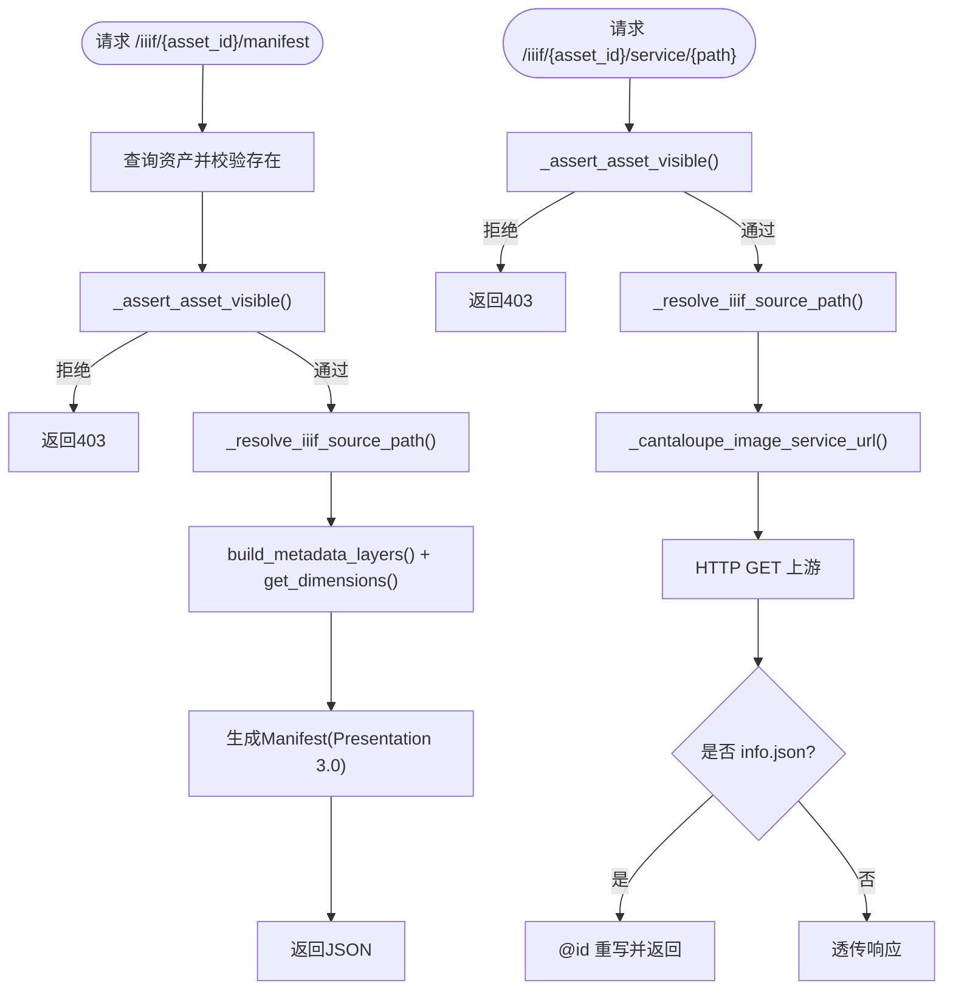
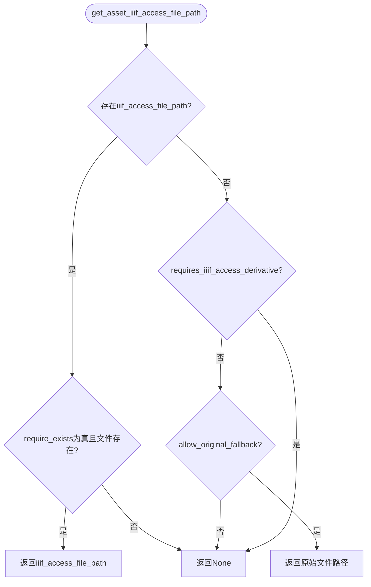
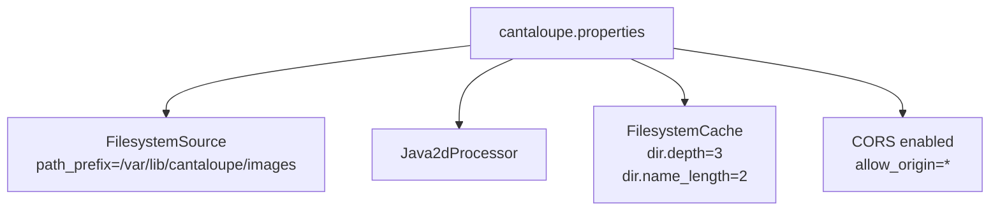
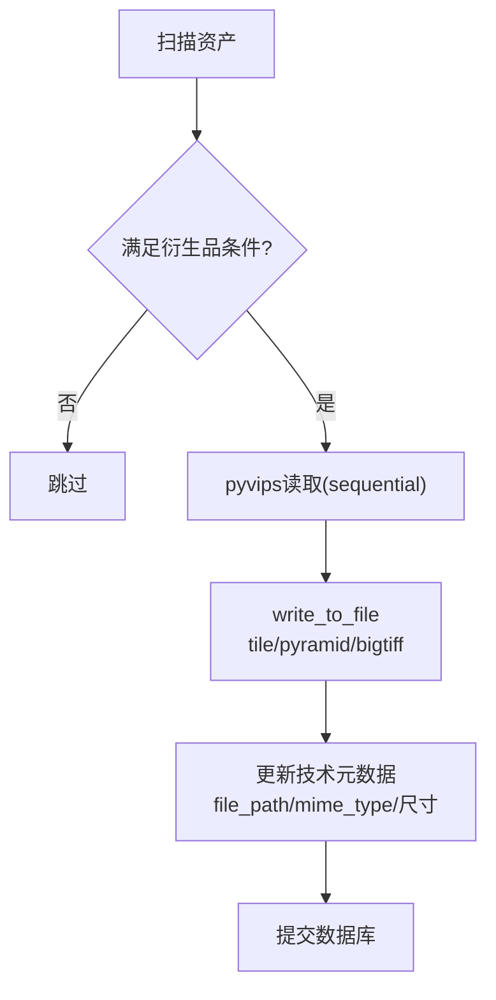
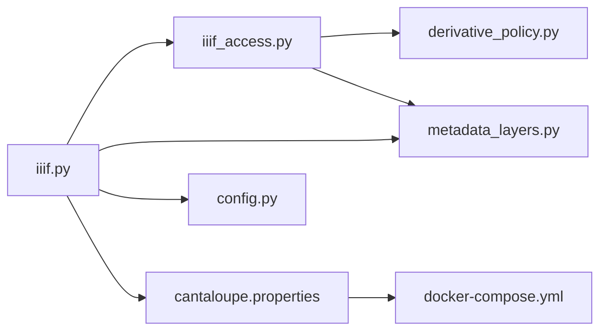

# 图像服务架构

<cite>
**本文引用的文件**
- [backend/app/routers/iiif.py](file://backend/app/routers/iiif.py)
- [backend/app/services/iiif_access.py](file://backend/app/services/iiif_access.py)
- [backend/app/services/metadata_layers.py](file://backend/app/services/metadata_layers.py)
- [backend/app/services/derivative_policy.py](file://backend/app/services/derivative_policy.py)
- [backend/app/config.py](file://backend/app/config.py)
- [backend/app/models.py](file://backend/app/models.py)
- [backend/scripts/backfill_pyramidal_tiffs.py](file://backend/scripts/backfill_pyramidal_tiffs.py)
- [cantaloupe.properties](file://cantaloupe.properties)
- [docker-compose.yml](file://docker-compose.yml)
- [docs/02-架构设计/AUTH_AND_IIIF_INTEGRATION_PLAN.md](file://docs/02-架构设计/AUTH_AND_IIIF_INTEGRATION_PLAN.md)
- [docs/05-部署与运维/CANTALOUPE_DEPLOY_NOTES.md](file://docs/05-部署与运维/CANTALOUPE_DEPLOY_NOTES.md)
- [docs/05-部署与运维/TROUBLESHOOTING.md](file://docs/05-部署与运维/TROUBLESHOOTING.md)
- [docs/01-总览/PROJECT_STATUS.md](file://docs/01-总览/PROJECT_STATUS.md)
</cite>

## 目录
1. [简介](#简介)
2. [项目结构](#项目结构)
3. [核心组件](#核心组件)
4. [架构总览](#架构总览)
5. [详细组件分析](#详细组件分析)
6. [依赖分析](#依赖分析)
7. [性能考量](#性能考量)
8. [故障排除指南](#故障排除指南)
9. [结论](#结论)
10. [附录](#附录)

## 简介
本文件面向MDAMS原型项目的图像服务子系统，聚焦Cantaloupe IIIF图像服务器的架构设计与优化策略，系统阐述：
- IIIF标准实现与Presentation API 3.0兼容性
- Canvas与Manifest的动态生成机制
- 图像处理流水线与内存优化（Java2dProcessor、流式读取）
- 文件系统缓存与NFS挂载的性能优化
- 瓦片生成算法与缩放金字塔构建策略
- 监控指标与性能基准测试建议
- 与NAS存储系统的集成方案与网络传输优化

## 项目结构
图像服务子系统由三层组成：
- 应用层路由与鉴权：FastAPI路由负责权限校验、Manifest动态生成与图像服务代理
- 业务服务层：衍生品策略、元数据层、IIIF访问路径解析
- 图像服务层：Cantaloupe IIIF服务器，基于文件系统源与Java2dProcessor进行流式处理与瓦片金字塔生成

**图表来源**
- [backend/app/routers/iiif.py:138-303](file://backend/app/routers/iiif.py#L138-L303)
- [backend/app/services/iiif_access.py:115-185](file://backend/app/services/iiif_access.py#L115-L185)
- [backend/app/services/metadata_layers.py:412-507](file://backend/app/services/metadata_layers.py#L412-L507)
- [backend/app/services/derivative_policy.py:55-57](file://backend/app/services/derivative_policy.py#L55-L57)
- [cantaloupe.properties:103-126](file://cantaloupe.properties#L103-L126)
- [docker-compose.yml:114-127](file://docker-compose.yml#L114-L127)

**章节来源**
- [backend/app/routers/iiif.py:138-303](file://backend/app/routers/iiif.py#L138-L303)
- [backend/app/services/iiif_access.py:115-185](file://backend/app/services/iiif_access.py#L115-L185)
- [backend/app/services/metadata_layers.py:412-507](file://backend/app/services/metadata_layers.py#L412-L507)
- [backend/app/services/derivative_policy.py:55-57](file://backend/app/services/derivative_policy.py#L55-L57)
- [cantaloupe.properties:103-126](file://cantaloupe.properties#L103-L126)
- [docker-compose.yml:114-127](file://docker-compose.yml#L114-L127)

## 核心组件
- FastAPI IIIF路由：实现Manifest/Presentation API 3.0兼容、Canvas/Annotation动态生成、图像服务代理与鉴权
- IIIF访问服务：根据资产元数据与衍生品策略，确定IIIF访问文件路径与MIME类型
- 元数据层：构建分层元数据（core/management/technical/profile/raw_metadata），提供尺寸、可见范围、集合对象ID等
- 衍生品策略：基于源文件类型、大小、像素阈值与规则ID，决定是否生成金字塔TIF衍生品
- Cantaloupe配置：启用文件系统源、选择Java2dProcessor、禁用内存缓存、启用文件系统缓存、流式读取
- Docker编排：NFS挂载直读、熵源挂载、JAVA_OPTS内存限制、反向代理与CORS

**章节来源**
- [backend/app/routers/iiif.py:138-303](file://backend/app/routers/iiif.py#L138-L303)
- [backend/app/services/iiif_access.py:115-185](file://backend/app/services/iiif_access.py#L115-L185)
- [backend/app/services/metadata_layers.py:412-507](file://backend/app/services/metadata_layers.py#L412-L507)
- [backend/app/services/derivative_policy.py:55-57](file://backend/app/services/derivative_policy.py#L55-L57)
- [cantaloupe.properties:103-126](file://cantaloupe.properties#L103-L126)
- [docker-compose.yml:114-127](file://docker-compose.yml#L114-L127)

## 架构总览
图像服务整体流程：
- 前端请求访问/iiif/{asset_id}/manifest，后端根据权限与可见范围校验后，动态生成Manifest
- Manifest中的图像服务地址指向Cantaloupe公开URL（当前未完全收口到后端代理）
- 前端Mirador通过/info.json与切片请求访问Cantaloupe
- Cantaloupe基于文件系统源与Java2dProcessor进行流式解码、瓦片金字塔生成与缓存

**图表来源**
- [backend/app/routers/iiif.py:138-254](file://backend/app/routers/iiif.py#L138-L254)
- [docs/02-架构设计/AUTH_AND_IIIF_INTEGRATION_PLAN.md:61-86](file://docs/02-架构设计/AUTH_AND_IIIF_INTEGRATION_PLAN.md#L61-L86)
- [cantaloupe.properties:133-147](file://cantaloupe.properties#L133-L147)

**章节来源**
- [backend/app/routers/iiif.py:138-254](file://backend/app/routers/iiif.py#L138-L254)
- [docs/02-架构设计/AUTH_AND_IIIF_INTEGRATION_PLAN.md:61-86](file://docs/02-架构设计/AUTH_AND_IIIF_INTEGRATION_PLAN.md#L61-L86)
- [cantaloupe.properties:133-147](file://cantaloupe.properties#L133-L147)

## 详细组件分析

### IIIF路由与鉴权
- 权限与可见范围：基于资源的visibility_scope与collection_object_id，结合当前用户权限与collection_scope进行校验
- Manifest动态生成：依据资产元数据与尺寸，生成Manifest/Presentation API 3.0结构，包含Canvas、AnnotationPage、Annotation与ImageService2
- 图像服务代理：提供/service/{image_path}代理，对info.json进行@id重写，其余透传；根据资产状态设置Cache-Control

**图表来源**
- [backend/app/routers/iiif.py:57-136](file://backend/app/routers/iiif.py#L57-L136)
- [backend/app/routers/iiif.py:138-254](file://backend/app/routers/iiif.py#L138-L254)
- [backend/app/routers/iiif.py:257-303](file://backend/app/routers/iiif.py#L257-L303)

**章节来源**
- [backend/app/routers/iiif.py:57-136](file://backend/app/routers/iiif.py#L57-L136)
- [backend/app/routers/iiif.py:138-254](file://backend/app/routers/iiif.py#L138-L254)
- [backend/app/routers/iiif.py:257-303](file://backend/app/routers/iiif.py#L257-L303)

### IIIF访问路径与衍生品策略
- 访问路径解析：优先使用已标记的iiif_access_file_path；若无需衍生品则回退到原始文件；不存在则报错
- 衍生品生成策略：基于源文件家族（psb/tiff/jpeg）、大小与像素阈值、规则ID，决定是否生成金字塔TIF衍生品
- 生成脚本：批量回填金字塔TIF，写入宽高、MIME类型、转换方法等技术元数据

**图表来源**
- [backend/app/services/iiif_access.py:115-140](file://backend/app/services/iiif_access.py#L115-L140)
- [backend/app/services/iiif_access.py:45-56](file://backend/app/services/iiif_access.py#L45-L56)
- [backend/scripts/backfill_pyramidal_tiffs.py:57-73](file://backend/scripts/backfill_pyramidal_tiffs.py#L57-L73)

**章节来源**
- [backend/app/services/iiif_access.py:115-140](file://backend/app/services/iiif_access.py#L115-L140)
- [backend/app/services/iiif_access.py:45-56](file://backend/app/services/iiif_access.py#L45-L56)
- [backend/scripts/backfill_pyramidal_tiffs.py:57-73](file://backend/scripts/backfill_pyramidal_tiffs.py#L57-L73)

### 元数据层与尺寸解析
- 分层元数据：core（资源标识、可见范围、集合对象ID、标题等）、management（业务管理字段）、technical（技术元数据，含衍生品与尺寸）、profile（档案字段集）
- 尺寸解析：优先从technical.width/height，否则从图像文件读取
- IIIF元数据条目：将分层元数据渲染为Manifest.metadata数组项

**章节来源**
- [backend/app/services/metadata_layers.py:412-507](file://backend/app/services/metadata_layers.py#L412-L507)
- [backend/app/services/metadata_layers.py:572-582](file://backend/app/services/metadata_layers.py#L572-L582)
- [backend/app/services/metadata_layers.py:584-635](file://backend/app/services/metadata_layers.py#L584-L635)

### 衍生品策略与规则
- 源文件家族：psb、tiff、jpeg
- 阈值：TIFF_SIZE_THRESHOLD_BYTES、TIFF_PIXEL_THRESHOLD、JPEG_SIZE_THRESHOLD_BYTES、JPEG_PIXEL_THRESHOLD
- 规则ID：psb_mandatory_access_bigtiff、tiff_large_pyramidal_tiled_copy
- 策略选择：当优先级为required、或策略为generate_pyramidal_tiff且源家族为psb/tiff时，要求生成衍生品

**章节来源**
- [backend/app/services/derivative_policy.py:23-26](file://backend/app/services/derivative_policy.py#L23-L26)
- [backend/app/services/derivative_policy.py:55-57](file://backend/app/services/derivative_policy.py#L55-L57)

### Cantaloupe配置与图像处理流水线
- 文件系统源：FilesystemSource，path_prefix指向/var/lib/cantaloupe/images，NFS挂载直读
- 处理器选择：自动策略+MIME偏好，TIFF/PNG/BMP使用Java2dProcessor，fallback为Java2dProcessor
- 内存优化：禁用内存缓存，启用文件系统缓存（FilesystemCache），目录深度与名称长度配置
- 流式读取：processor.stream_retrieval_strategy=STREAM，避免将完整图像加载到堆
- CORS与安全：关闭公开basic认证，开启CORS，允许跨域访问

**图表来源**
- [cantaloupe.properties:14-41](file://cantaloupe.properties#L14-L41)
- [cantaloupe.properties:87-126](file://cantaloupe.properties#L87-L126)
- [cantaloupe.properties:128-132](file://cantaloupe.properties#L128-L132)
- [cantaloupe.properties:138-147](file://cantaloupe.properties#L138-L147)

**章节来源**
- [cantaloupe.properties:14-41](file://cantaloupe.properties#L14-L41)
- [cantaloupe.properties:87-126](file://cantaloupe.properties#L87-L126)
- [cantaloupe.properties:128-132](file://cantaloupe.properties#L128-L132)
- [cantaloupe.properties:138-147](file://cantaloupe.properties#L138-L147)

### 瓦片生成与缩放金字塔
- libvips写入参数：tile=True、tile_width/height=256、pyramid=True、bigtiff=True、compression=deflate
- 生成脚本：遍历资产，对满足条件的TIFF/PSB生成金字塔TIF，回填技术元数据，更新文件路径与MIME类型
- 与Cantaloupe协同：后端生成的金字塔TIF可直接被Cantaloupe作为源文件读取，避免重复转换

**图表来源**
- [backend/scripts/backfill_pyramidal_tiffs.py:57-73](file://backend/scripts/backfill_pyramidal_tiffs.py#L57-L73)
- [backend/scripts/backfill_pyramidal_tiffs.py:140-188](file://backend/scripts/backfill_pyramidal_tiffs.py#L140-L188)

**章节来源**
- [backend/scripts/backfill_pyramidal_tiffs.py:57-73](file://backend/scripts/backfill_pyramidal_tiffs.py#L57-L73)
- [backend/scripts/backfill_pyramidal_tiffs.py:140-188](file://backend/scripts/backfill_pyramidal_tiffs.py#L140-L188)

### 认证与IIIF访问控制现状
- Manifest入口已受控，资产详情与列表入口亦受控
- 当前图像服务地址来自CANTALOUPE_PUBLIC_URL，Manifest中的图像服务id未切换为后端代理路径
- 风险：Manifest受控但切片访问未完全统一到应用认证入口

**章节来源**
- [docs/02-架构设计/AUTH_AND_IIIF_INTEGRATION_PLAN.md:61-96](file://docs/02-架构设计/AUTH_AND_IIIF_INTEGRATION_PLAN.md#L61-L96)

## 依赖分析
- 后端路由依赖业务服务层：权限校验、元数据解析、IIIF访问路径解析
- 业务服务层依赖：衍生品策略、元数据层、配置（上传目录、公共URL）
- Cantaloupe依赖：NFS挂载的图像目录、配置文件、反向代理与CORS设置
- Docker编排：NFS卷挂载、熵源挂载、JAVA_OPTS内存限制、前端Nginx反代

**图表来源**
- [backend/app/routers/iiif.py:14-19](file://backend/app/routers/iiif.py#L14-L19)
- [backend/app/services/iiif_access.py:9-11](file://backend/app/services/iiif_access.py#L9-L11)
- [backend/app/services/metadata_layers.py:7](file://backend/app/services/metadata_layers.py#L7)
- [backend/app/config.py:42-46](file://backend/app/config.py#L42-L46)
- [cantaloupe.properties:103-126](file://cantaloupe.properties#L103-L126)
- [docker-compose.yml:114-127](file://docker-compose.yml#L114-L127)

**章节来源**
- [backend/app/routers/iiif.py:14-19](file://backend/app/routers/iiif.py#L14-L19)
- [backend/app/services/iiif_access.py:9-11](file://backend/app/services/iiif_access.py#L9-L11)
- [backend/app/services/metadata_layers.py:7](file://backend/app/services/metadata_layers.py#L7)
- [backend/app/config.py:42-46](file://backend/app/config.py#L42-L46)
- [cantaloupe.properties:103-126](file://cantaloupe.properties#L103-L126)
- [docker-compose.yml:114-127](file://docker-compose.yml#L114-L127)

## 性能考量
- 内存优化
  - 后端libvips：通过VIPS_DISC_THRESHOLD与并发控制降低内存峰值
  - Cantaloupe：禁用内存缓存，使用SSD文件缓存；流式读取避免堆内存占用
- 存储I/O
  - 热数据（数据库、缩略图）使用本地NVMe SSD
  - 冷数据（原始PSB/TIFF大图）使用NAS（NFS）挂载直读
- 网络传输
  - 前端Nginx反代Cantaloupe，避免直接暴露8182端口与CORS问题
  - base_uri与Nginx路径转发配合，避免info.json中的@id重复拼接
- 缓存命中率
  - 文件系统缓存目录结构（dir.depth=3, dir.name_length=2）提升大规模文件组织效率
  - 首次访问生成金字塔与缓存，后续访问命中缓存

**章节来源**
- [docker-compose.yml:11-13](file://docker-compose.yml#L11-L13)
- [docker-compose.yml:114-127](file://docker-compose.yml#L114-L127)
- [cantaloupe.properties:103-126](file://cantaloupe.properties#L103-L126)
- [docs/05-部署与运维/CANTALOUPE_DEPLOY_NOTES.md:72-76](file://docs/05-部署与运维/CANTALOUPE_DEPLOY_NOTES.md#L72-L76)

## 故障排除指南
- 启动类问题
  - 前端/后端/数据库/Redis状态检查，查看健康与就绪接口
- 资源与挂载
  - HOST_MUSEUM_PATH映射正确、可写；上传目录映射到/app/uploads
- IIIF与Mirador
  - CANTALOUPE_PUBLIC_URL与前端Nginx /iiif/2/代理配置一致；确保后端权限校验通过
  - 若owner_only资源不可见，检查用户collection_scope与资源visibility_scope
- Cantaloupe部署
  - Java熵源挂载/dev/urandom，禁用文件日志，避免死锁
  - base_uri与Nginx路径转发配合，避免info.json @id重复
  - 构建缓存问题可通过强制重建或手动验证容器内配置

**章节来源**
- [docs/05-部署与运维/TROUBLESHOOTING.md:16-147](file://docs/05-部署与运维/TROUBLESHOOTING.md#L16-L147)
- [docs/05-部署与运维/CANTALOUPE_DEPLOY_NOTES.md:5-27](file://docs/05-部署与运维/CANTALOUPE_DEPLOY_NOTES.md#L5-L27)
- [docs/05-部署与运维/CANTALOUPE_DEPLOY_NOTES.md:30-76](file://docs/05-部署与运维/CANTALOUPE_DEPLOY_NOTES.md#L30-L76)

## 结论
MDAMS图像服务子系统以FastAPI路由为核心，结合业务服务层的元数据与衍生品策略，配合Cantaloupe IIIF服务器与NFS直读，形成了低内存占用、高可扩展性的图像服务架构。当前已完成Manifest级认证收口，建议下一步将图像服务id切换为后端代理路径，实现切片与info.json访问的统一鉴权，进一步收敛认证边界。

## 附录
- 项目状态与当前实现范围参见项目状态文档
- 配置与部署要点参见部署与运维相关文档

**章节来源**
- [docs/01-总览/PROJECT_STATUS.md:21-98](file://docs/01-总览/PROJECT_STATUS.md#L21-L98)