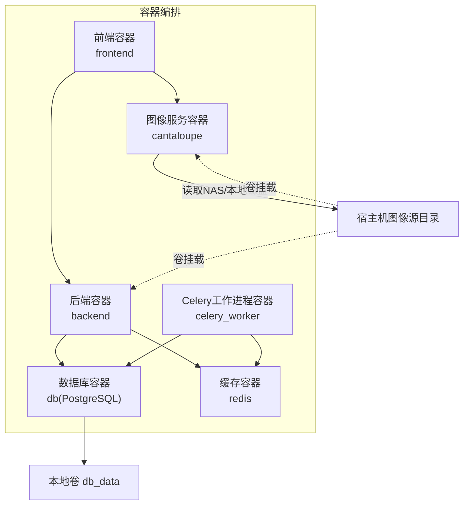
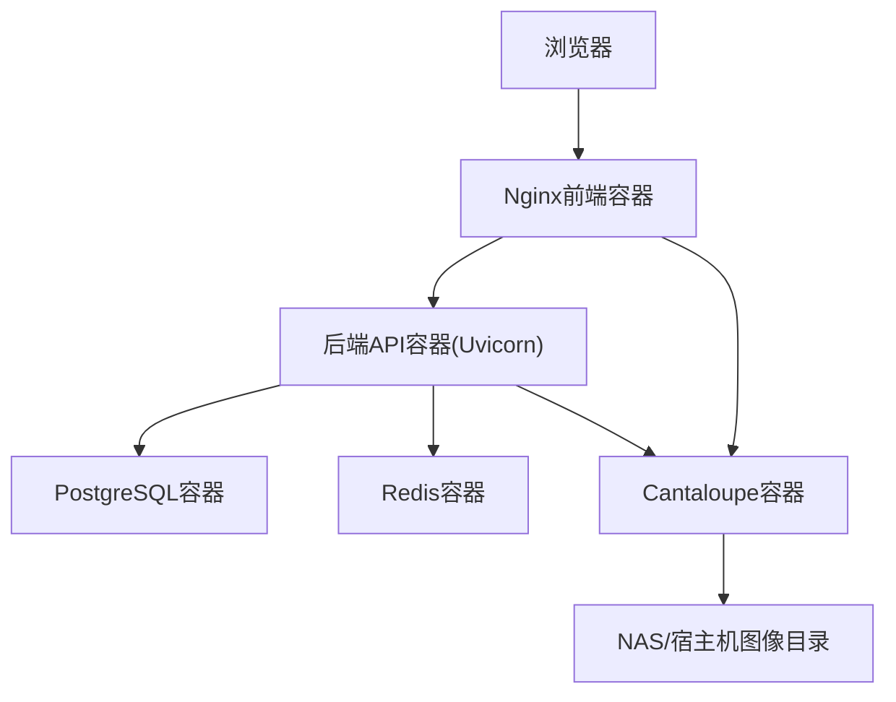
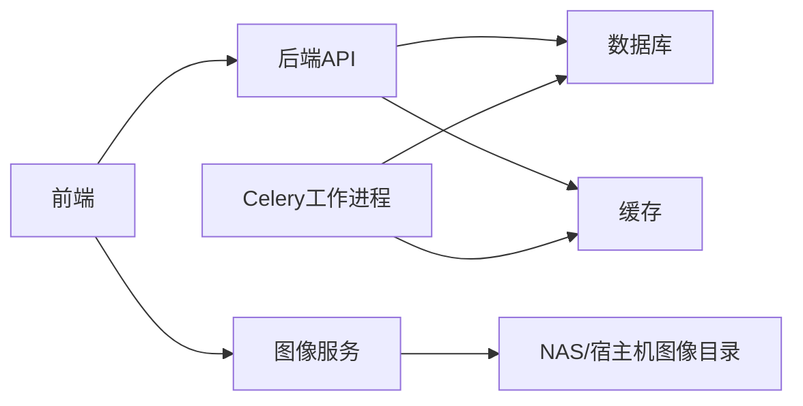

# 容器化架构

<cite>
**本文引用的文件**
- [docker-compose.yml](file://docker-compose.yml)
- [docker-compose.local-postgres.yml](file://docker-compose.local-postgres.yml)
- [backend/Dockerfile](file://backend/Dockerfile)
- [frontend/Dockerfile](file://frontend/Dockerfile)
- [cantaloupe/Dockerfile](file://cantaloupe/Dockerfile)
- [deploy.sh](file://deploy.sh)
- [publish.sh](file://publish.sh)
- [cantaloupe.properties](file://cantaloupe.properties)
- [backend/app/routers/health.py](file://backend/app/routers/health.py)
- [docs/05-部署与运维/ENVIRONMENT_VARIABLES.md](file://docs/05-部署与运维/ENVIRONMENT_VARIABLES.md)
</cite>

## 目录
1. [简介](#简介)
2. [项目结构](#项目结构)
3. [核心组件](#核心组件)
4. [架构总览](#架构总览)
5. [详细组件分析](#详细组件分析)
6. [依赖关系分析](#依赖关系分析)
7. [性能考量](#性能考量)
8. [故障排查指南](#故障排查指南)
9. [结论](#结论)
10. [附录](#附录)

## 简介
本文件面向MDAMS原型项目的容器化与多容器编排，围绕Docker Compose进行系统性梳理，明确各服务容器的职责划分（前端、后端API、数据库、图像服务），阐述容器间网络通信、数据卷挂载策略与环境变量配置管理；同时给出启动顺序依赖、健康检查机制与故障恢复策略，总结容器镜像构建优化、多阶段构建与安全加固要点，并对比开发与生产环境差异、部署脚本自动化流程以及监控告警集成方案。

## 项目结构
本项目采用分层与功能模块化的组织方式：
- 前端：基于Nginx静态资源服务，构建产物由多阶段Dockerfile产出
- 后端：Python FastAPI应用，提供REST API与Celery任务队列
- 数据库：PostgreSQL，持久化存储于本地卷
- 图像服务：Cantaloupe IIIF服务，负责高分辨率图像按需派生与传输
- 编排：Docker Compose统一编排，包含本地Postgres替代方案

图表来源
- [docker-compose.yml:1-131](file://docker-compose.yml#L1-L131)

章节来源
- [docker-compose.yml:1-131](file://docker-compose.yml#L1-L131)

## 核心组件
- 前端服务(frontend)
  - 多阶段构建：第一阶段Node打包，第二阶段Nginx提供静态服务
  - 通过Nginx反向代理对外提供80端口，便于与后端/图像服务协同
  - 依赖后端与Cantaloupe，启动顺序受depends_on约束
- 后端API服务(backend)
  - Python 3.12运行时，安装libvips及相关工具
  - 通过Uvicorn提供ASGI服务，监听0.0.0.0:8000
  - 依赖数据库与Redis，挂载NAS作为上传目录
- Celery工作进程(celery_worker)
  - 复用后端镜像，执行异步任务，依赖数据库与Redis
- 数据库服务(db)
  - PostgreSQL 16，使用本地SSD卷提升性能
  - 内存资源限制，避免过度占用宿主机资源
- 缓存服务(redis)
  - Redis 7，提供任务队列与会话缓存
- 图像服务(cantaloupe)
  - Java 11运行时，下载官方发布包并启动
  - 通过配置文件启用IIIF API与CORS，挂载NAS与配置文件

章节来源
- [frontend/Dockerfile:1-28](file://frontend/Dockerfile#L1-L28)
- [backend/Dockerfile:1-52](file://backend/Dockerfile#L1-L52)
- [cantaloupe/Dockerfile:1-43](file://cantaloupe/Dockerfile#L1-L43)
- [docker-compose.yml:1-131](file://docker-compose.yml#L1-L131)

## 架构总览
下图展示容器间交互与数据流向：前端通过Nginx访问后端API；后端访问数据库与Redis；图像服务从NAS读取原始图像并生成IIIF派生；前端与图像服务之间通过CORS协作。

图表来源
- [docker-compose.yml:1-131](file://docker-compose.yml#L1-L131)
- [cantaloupe.properties:1-162](file://cantaloupe.properties#L1-L162)

## 详细组件分析

### 前端服务(frontend)
- 构建策略
  - 多阶段：Node打包产物 → Nginx静态服务
  - 使用国内镜像源加速依赖安装与构建
- 网络与代理
  - 对外暴露80端口，通过Nginx统一入口
  - 依赖后端与Cantaloupe，确保启动顺序
- 配置与卷
  - 挂载自定义Nginx配置文件
  - 与后端共享上传目录卷，便于文件访问

章节来源
- [frontend/Dockerfile:1-28](file://frontend/Dockerfile#L1-L28)
- [docker-compose.yml:72-82](file://docker-compose.yml#L72-L82)

### 后端API服务(backend)
- 运行时与依赖
  - Python 3.12-slim，安装libvips与相关工具
  - 针对超大图像放宽ImageMagick安全策略
  - 使用国内镜像源加速pip安装
- 端口与命令
  - 监听0.0.0.0:8000，通过Uvicorn启动
- 环境变量
  - 数据库连接串、Redis连接串、图像处理参数、CORS相关URL等
  - 上传目录映射至NAS，便于与图像服务共享
- 健康检查
  - 提供/health与/ready接口，返回整体健康状态与子项检查结果

章节来源
- [backend/Dockerfile:1-52](file://backend/Dockerfile#L1-L52)
- [docker-compose.yml:2-30](file://docker-compose.yml#L2-L30)
- [backend/app/routers/health.py:1-60](file://backend/app/routers/health.py#L1-L60)

### Celery工作进程(celery_worker)
- 构建与命令
  - 复用后端镜像，以Celery Worker模式启动
  - 并发度与日志级别通过命令参数控制
- 依赖与卷
  - 与后端一致的环境变量与NAS卷挂载
- 重启策略
  - 始终重启，保证任务持续处理

章节来源
- [docker-compose.yml:37-64](file://docker-compose.yml#L37-L64)

### 数据库服务(db)
- 镜像与版本
  - PostgreSQL 16-alpine
- 环境变量
  - 用户名、密码、数据库名，映射至容器内初始化
- 存储与资源
  - 本地卷持久化数据
  - 限制内存上限，避免资源争用

章节来源
- [docker-compose.yml:84-102](file://docker-compose.yml#L84-L102)

### 缓存服务(redis)
- 镜像与版本
  - redis:7-alpine
- 端口与重启策略
  - 暴露6379端口，始终重启

章节来源
- [docker-compose.yml:65-71](file://docker-compose.yml#L65-L71)

### 图像服务(cantaloupe)
- 构建与运行
  - 下载官方发布包，Java 11运行
  - 暴露8182端口，启用IIIF API与CORS
- 配置与卷
  - 挂载配置文件与图像目录，传递宿主熵池
- 安全与兼容
  - 启用CORS，允许前端查看器跨域访问
  - 选择合适的处理器策略以适配不同格式

章节来源
- [cantaloupe/Dockerfile:1-43](file://cantaloupe/Dockerfile#L1-L43)
- [docker-compose.yml:105-128](file://docker-compose.yml#L105-L128)
- [cantaloupe.properties:1-162](file://cantaloupe.properties#L1-L162)

### 启动顺序与依赖
- 明确依赖
  - 后端与Celery工作进程依赖数据库与Redis
  - 前端依赖后端与Cantaloupe
  - 图像服务依赖NAS挂载与配置文件
- 依赖声明
  - 使用depends_on实现粗粒度顺序启动

章节来源
- [docker-compose.yml:33-36](file://docker-compose.yml#L33-L36)
- [docker-compose.yml:61-63](file://docker-compose.yml#L61-L63)
- [docker-compose.yml:80-82](file://docker-compose.yml#L80-L82)

### 健康检查与就绪检查
- 接口定义
  - /health：整体健康状态
  - /ready：就绪状态，通常用于Kubernetes就绪探针
- 检查内容
  - 数据库连通性
  - 上传目录存在性
- 返回行为
  - 健康返回200，否则返回503并携带详细检查项

章节来源
- [backend/app/routers/health.py:14-60](file://backend/app/routers/health.py#L14-L60)

### 网络通信机制
- 前端与后端
  - 前端通过Nginx反向代理访问后端API
- 前端与图像服务
  - 前端通过CORS访问Cantaloupe提供的IIIF资源
- 服务间通信
  - 后端通过服务名访问数据库与Redis
  - 图像服务通过卷访问NAS中的原始图像

章节来源
- [docker-compose.yml:72-82](file://docker-compose.yml#L72-L82)
- [docker-compose.yml:105-128](file://docker-compose.yml#L105-L128)
- [cantaloupe.properties:138-148](file://cantaloupe.properties#L138-L148)

### 数据卷挂载策略
- NAS共享
  - 后端与图像服务均将宿主机图像目录挂载到容器内，实现共享
- 数据持久化
  - PostgreSQL数据目录挂载到本地卷，避免容器删除导致数据丢失
- 配置挂载
  - 将Cantaloupe配置文件挂载到容器内指定路径

章节来源
- [docker-compose.yml:30-32](file://docker-compose.yml#L30-L32)
- [docker-compose.yml:58-60](file://docker-compose.yml#L58-L60)
- [docker-compose.yml:94-97](file://docker-compose.yml#L94-L97)
- [docker-compose.yml:114-117](file://docker-compose.yml#L114-L117)

### 环境变量配置管理
- 数据库与连接
  - POSTGRES_USER/PASSWORD/DB、DATABASE_URL、REDIS_URL
- 公共访问地址
  - API_PUBLIC_URL、CANTALOUPE_PUBLIC_URL
- 文件与路径
  - HOST_MUSEUM_PATH、UPLOAD_DIR
- 图像处理与JVM
  - VIPS_DISC_THRESHOLD、VIPS_CONCURRENCY、JAVA_OPTS
- 端口映射
  - FRONTEND_PORT、BACKEND_PORT、DB_PORT、REDIS_PORT、CANTALOUPE_PORT

章节来源
- [docker-compose.yml:8-29](file://docker-compose.yml#L8-L29)
- [docker-compose.yml:88-91](file://docker-compose.yml#L88-L91)
- [docker-compose.yml:120-127](file://docker-compose.yml#L120-L127)
- [docs/05-部署与运维/ENVIRONMENT_VARIABLES.md:10-86](file://docs/05-部署与运维/ENVIRONMENT_VARIABLES.md#L10-L86)

### 开发环境与生产环境差异
- 数据库
  - 开发：本地PostgreSQL镜像，端口映射到宿主
  - 生产：可替换为外部托管或云数据库（示例中提供本地Bitnami镜像）
- 存储
  - 开发：本地卷持久化
  - 生产：建议使用块存储或NAS共享，确保高可用与性能
- 端口与代理
  - 开发：前端Nginx端口映射到3000，便于本地联调
  - 生产：可通过反向代理统一入口与证书管理
- 镜像与构建
  - 开发：多阶段构建，减少最终镜像体积
  - 生产：建议固定版本与校验，启用只读根文件系统与最小权限

章节来源
- [docker-compose.yml:84-102](file://docker-compose.yml#L84-L102)
- [docker-compose.local-postgres.yml:1-19](file://docker-compose.local-postgres.yml#L1-L19)
- [docs/05-部署与运维/ENVIRONMENT_VARIABLES.md:65-86](file://docs/05-部署与运维/ENVIRONMENT_VARIABLES.md#L65-L86)

### 部署脚本自动化流程
- 部署脚本(deploy.sh)
  - 检测Docker是否存在
  - 创建本地数据目录
  - 执行docker compose up -d --build
  - 等待初始化后输出服务状态与访问地址
- 发布脚本(publish.sh)
  - 推送当前分支到GitHub与本地裸仓库，便于自动化部署

章节来源
- [deploy.sh:1-38](file://deploy.sh#L1-L38)
- [publish.sh:1-19](file://publish.sh#L1-L19)

### 监控告警集成方案
- 健康检查
  - 利用后端提供的/health与/ready接口，结合容器重启策略实现自愈
- 日志采集
  - 建议在生产环境启用集中式日志收集（如Fluent Bit/ELK），采集容器标准输出
- 性能指标
  - 结合Prometheus/Grafana监控CPU、内存、磁盘IO与数据库连接数
- 告警策略
  - 基于容器重启次数、健康检查失败率、响应时间与错误码阈值触发告警

章节来源
- [backend/app/routers/health.py:52-59](file://backend/app/routers/health.py#L52-L59)

## 依赖关系分析
- 组件耦合
  - 后端与数据库、Redis强耦合，Celery工作进程与其共享依赖
  - 前端与后端、图像服务弱耦合，主要通过HTTP协议交互
- 直接依赖
  - 后端依赖数据库与Redis
  - Celery依赖数据库与Redis
  - 前端依赖后端与图像服务
  - 图像服务依赖NAS与配置文件
- 外部依赖
  - 数据库与Redis镜像版本
  - 前端与后端构建镜像源（国内镜像）

图表来源
- [docker-compose.yml:1-131](file://docker-compose.yml#L1-L131)

章节来源
- [docker-compose.yml:1-131](file://docker-compose.yml#L1-L131)

## 性能考量
- 数据库性能
  - 使用本地SSD卷存放数据，降低I/O延迟
  - 限制容器内存上限，避免与其他服务争抢资源
- 图像处理
  - 通过环境变量调整libvips磁盘阈值与并发数，平衡内存与吞吐
  - 图像服务启用流式检索，避免将整图加载到堆内存
- 前端与后端
  - 多阶段构建减少最终镜像体积，缩短拉取与启动时间
  - Nginx静态服务提供高效资源交付

章节来源
- [docker-compose.yml:98-102](file://docker-compose.yml#L98-L102)
- [backend/Dockerfile:7-16](file://backend/Dockerfile#L7-L16)
- [backend/Dockerfile:46-47](file://backend/Dockerfile#L46-L47)
- [cantaloupe.properties:122-127](file://cantaloupe.properties#L122-L127)

## 故障排查指南
- 健康检查失败
  - 检查数据库连通性与连接串是否正确
  - 确认上传目录存在且具备读写权限
- 启动顺序问题
  - 确认depends_on声明的依赖服务已就绪
  - 查看容器日志定位具体错误
- CORS与跨域
  - 确认图像服务CORS配置允许前端来源
  - 核对公共URL环境变量与反向代理配置
- 镜像与构建
  - 检查国内镜像源可用性与pip/node安装日志
  - 清理构建缓存后重试

章节来源
- [backend/app/routers/health.py:14-41](file://backend/app/routers/health.py#L14-L41)
- [docker-compose.yml:33-36](file://docker-compose.yml#L33-L36)
- [docker-compose.yml:80-82](file://docker-compose.yml#L80-L82)
- [cantaloupe.properties:138-148](file://cantaloupe.properties#L138-L148)

## 结论
本容器化方案以Docker Compose实现多容器编排，清晰划分前端、后端、数据库、缓存与图像服务职责，通过卷挂载与环境变量实现灵活配置与数据共享。启动顺序与健康检查保障了服务稳定性，多阶段构建与镜像源优化提升了构建效率与可靠性。建议在生产环境进一步完善镜像固定版本、只读根文件系统、最小权限与集中式监控告警体系，以满足高可用与可观测性需求。

## 附录
- 端口与默认值参考
  - 前端：3000
  - 后端：8000
  - 数据库：5432
  - 缓存：6379
  - 图像服务：8182

章节来源
- [docs/05-部署与运维/ENVIRONMENT_VARIABLES.md:65-86](file://docs/05-部署与运维/ENVIRONMENT_VARIABLES.md#L65-L86)