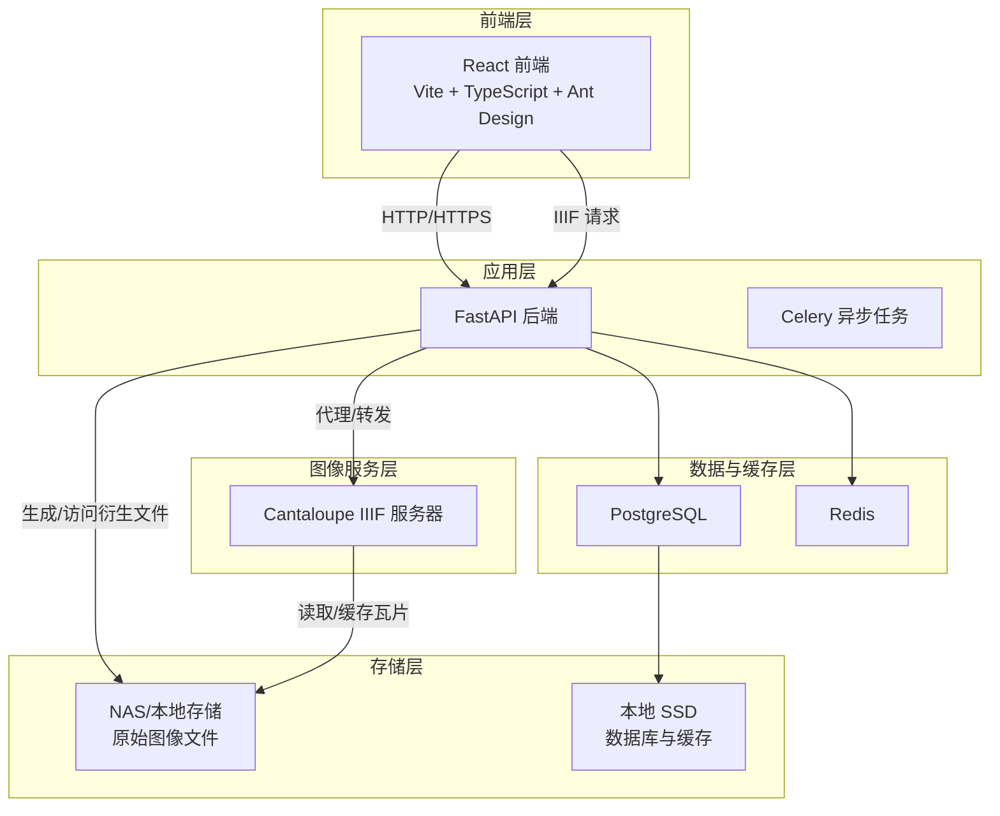
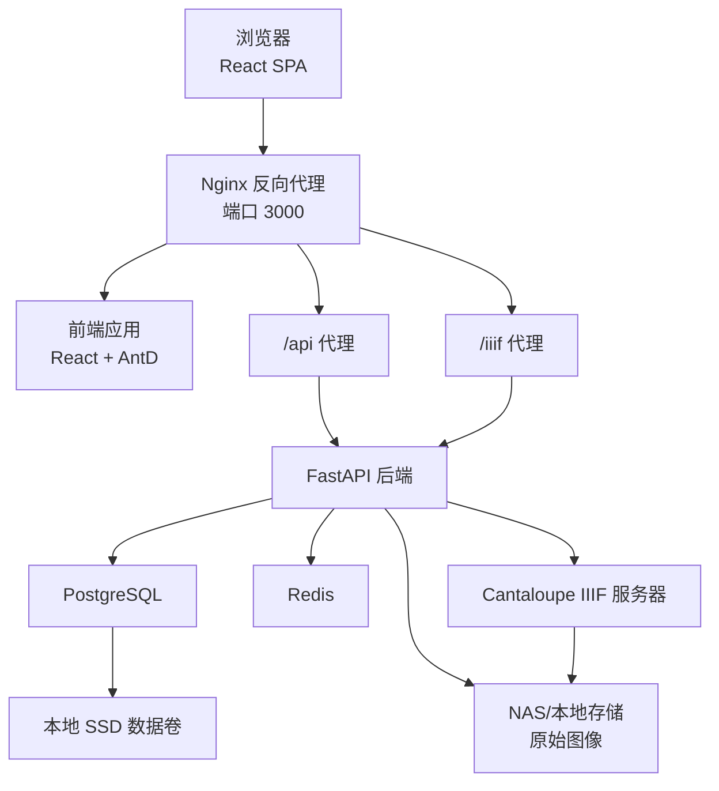
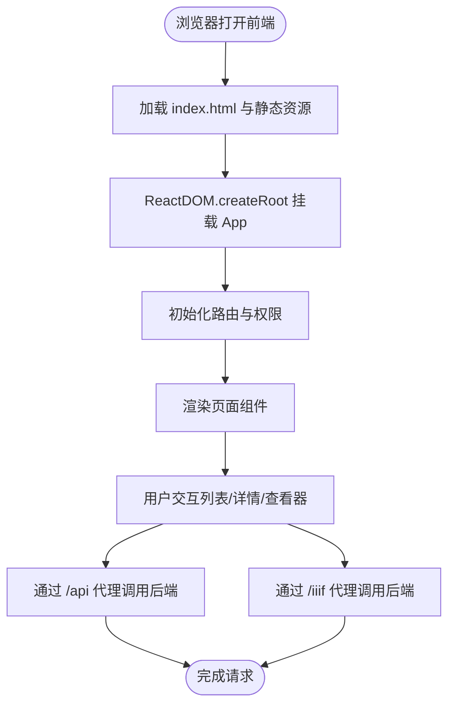
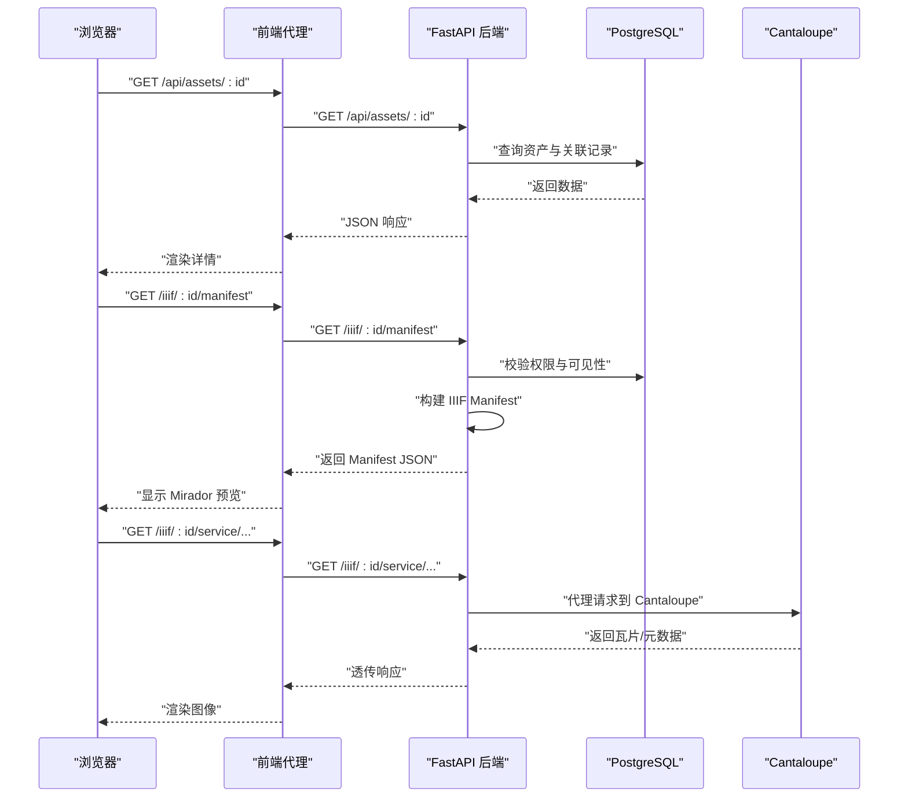
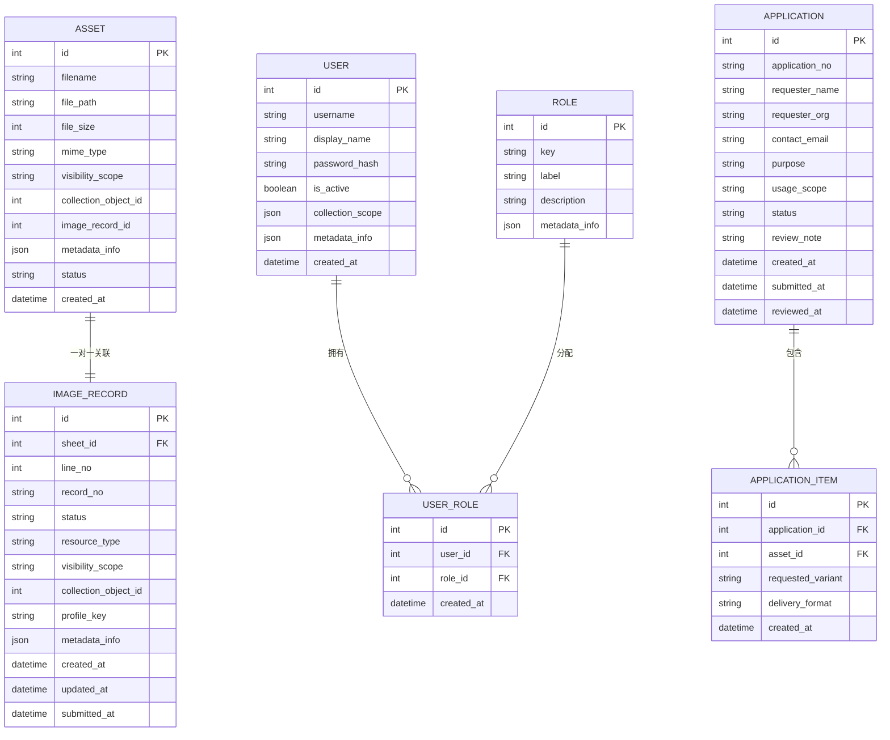
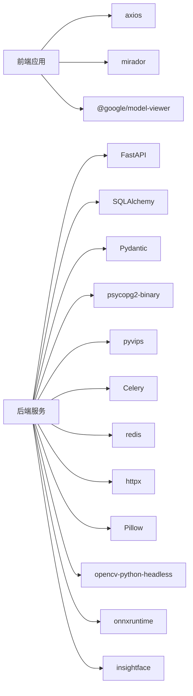

# 技术架构详解

<cite>
**本文引用的文件**
- [README.md](file://README.md)
- [SYSTEM_ARCHITECTURE.md](file://SYSTEM_ARCHITECTURE.md)
- [ARCHITECTURE.md](file://ARCHITECTURE.md)
- [backend/app/main.py](file://backend/app/main.py)
- [backend/app/config.py](file://backend/app/config.py)
- [backend/app/database.py](file://backend/app/database.py)
- [backend/app/models.py](file://backend/app/models.py)
- [backend/app/routers/iiif.py](file://backend/app/routers/iiif.py)
- [backend/app/services/iiif_access.py](file://backend/app/services/iiif_access.py)
- [backend/app/celery_app.py](file://backend/app/celery_app.py)
- [backend/requirements.txt](file://backend/requirements.txt)
- [frontend/package.json](file://frontend/package.json)
- [frontend/vite.config.ts](file://frontend/vite.config.ts)
- [frontend/src/main.tsx](file://frontend/src/main.tsx)
- [docker-compose.yml](file://docker-compose.yml)
</cite>

## 目录
1. [引言](#引言)
2. [项目结构](#项目结构)
3. [核心组件](#核心组件)
4. [架构总览](#架构总览)
5. [详细组件分析](#详细组件分析)
6. [依赖分析](#依赖分析)
7. [性能考虑](#性能考虑)
8. [故障排查指南](#故障排查指南)
9. [结论](#结论)
10. [附录](#附录)

## 引言
本文件面向MDAMS原型项目的四层技术架构进行深入解析，涵盖表现层（React前端应用）、业务层（FastAPI后端服务）、数据层（PostgreSQL数据库）、缓存层（Redis）、图像服务层（Cantaloupe IIIF）。文档从技术选型动机、核心组件职责、实现细节、数据流与组件关系等方面展开，帮助读者快速理解系统设计思路与落地方式。

## 项目结构
项目采用前后端分离与容器化编排的组织方式，核心目录与职责如下：
- backend：后端服务，包含FastAPI应用、路由、服务层、数据库模型与Celery异步任务。
- frontend：前端应用，React 18 + Vite + TypeScript + Ant Design，提供资产浏览、图像记录、三维模型查看等功能。
- cantaloupe：Cantaloupe IIIF服务的构建与配置。
- docs：项目正式文档，包含架构、部署、实施方案等专题文档。
- docker-compose.yml：容器编排定义，统一管理后端、前端、数据库、Redis、Cantaloupe等服务。

图表来源
- [docker-compose.yml:1-131](file://docker-compose.yml#L1-L131)
- [SYSTEM_ARCHITECTURE.md:22-34](file://SYSTEM_ARCHITECTURE.md#L22-L34)

章节来源
- [README.md:67-79](file://README.md#L67-L79)
- [docker-compose.yml:1-131](file://docker-compose.yml#L1-L131)

## 核心组件
本节概述四层架构的核心组件及其职责与技术要点。

- 表现层（React前端）
  - 技术栈：React 18、Vite、TypeScript、Ant Design
  - 职责：提供资产管理界面、Mirador IIIF查看器集成、三维模型查看器、权限驱动的菜单与页面渲染
  - 实现要点：Vite提供开发与构建工具链；Ant Design提供UI组件体系；前端通过代理将/api、/auth、/iiif请求转发至后端；TypeScript保障类型安全
  - 章节来源
    - [frontend/package.json:13-40](file://frontend/package.json#L13-L40)
    - [frontend/vite.config.ts:1-42](file://frontend/vite.config.ts#L1-L42)
    - [frontend/src/main.tsx:1-11](file://frontend/src/main.tsx#L1-L11)

- 业务层（FastAPI后端）
  - 技术栈：Python 3.12、FastAPI、SQLAlchemy、Pydantic
  - 职责：提供REST API、IIIF清单生成与图像代理、权限校验、异步任务调度、数据模型与业务逻辑
  - 实现要点：模块化路由组织；数据库连接与会话管理；配置中心集中管理环境变量；Celery + Redis实现异步任务
  - 章节来源
    - [backend/app/main.py:1-86](file://backend/app/main.py#L1-L86)
    - [backend/app/config.py:1-72](file://backend/app/config.py#L1-L72)
    - [backend/app/database.py:1-17](file://backend/app/database.py#L1-L17)
    - [backend/requirements.txt:1-18](file://backend/requirements.txt#L1-L18)
    - [backend/app/celery_app.py:1-19](file://backend/app/celery_app.py#L1-L19)

- 数据层（PostgreSQL）
  - 选型理由：关系型数据库适合结构化元数据存储与事务一致性；与SQLAlchemy ORM结合便于维护复杂实体关系
  - 实现要点：模型定义涵盖资产、用户、角色、应用、图像记录、三维资产等；通过索引与字段设计提升查询性能
  - 章节来源
    - [backend/app/models.py:1-307](file://backend/app/models.py#L1-L307)
    - [backend/app/database.py:1-17](file://backend/app/database.py#L1-L17)

- 缓存层（Redis）
  - 选型理由：作为Celery消息中间件与结果后端，支撑异步任务队列与状态持久化
  - 实现要点：通过环境变量配置连接；Celery应用在启动时绑定Redis作为broker与backend
  - 章节来源
    - [backend/app/celery_app.py:1-19](file://backend/app/celery_app.py#L1-L19)
    - [backend/app/config.py:43-43](file://backend/app/config.py#L43-L43)

- 图像服务层（Cantaloupe IIIF）
  - 选型理由：IIIF标准原生支持，提供深度缩放、瓦片化渲染与跨机构互操作能力
  - 实现要点：通过Nginx代理避免直接暴露端口；从NAS读取原始图像；基于文件系统缓存与本地SSD加速
  - 章节来源
    - [SYSTEM_ARCHITECTURE.md:55-61](file://SYSTEM_ARCHITECTURE.md#L55-L61)
    - [docker-compose.yml:103-128](file://docker-compose.yml#L103-L128)

## 架构总览
下图展示系统四层架构的组件关系与数据流向，体现前端、后端、数据库、缓存与图像服务之间的协作方式。

图表来源
- [ARCHITECTURE.md:7-50](file://ARCHITECTURE.md#L7-L50)
- [SYSTEM_ARCHITECTURE.md:22-34](file://SYSTEM_ARCHITECTURE.md#L22-L34)
- [docker-compose.yml:1-131](file://docker-compose.yml#L1-L131)

## 详细组件分析

### 表现层（React前端）
- 技术选型动机
  - React 18：并发特性与更好的用户体验
  - Vite：快速开发与构建，低内存占用适配N100
  - TypeScript：类型安全与可维护性
  - Ant Design：企业级UI组件与设计规范
- 核心职责
  - 资产列表与详情展示
  - Mirador IIIF查看器集成
  - 三维模型查看器（@google/model-viewer）
  - 权限驱动的页面与菜单渲染
- 实现细节
  - 构建优化：分包策略将React、AntD、Mirador拆分为独立chunk，降低首屏加载压力
  - 开发代理：将/api、/auth、/iiif请求转发至后端，解决跨域与开发调试问题
  - 应用入口：ReactDOM.createRoot挂载App组件，开启StrictMode保证开发期质量
- 章节来源
  - [frontend/package.json:13-40](file://frontend/package.json#L13-L40)
  - [frontend/vite.config.ts:5-41](file://frontend/vite.config.ts#L5-L41)
  - [frontend/src/main.tsx:1-11](file://frontend/src/main.tsx#L1-L11)

图表来源
- [frontend/vite.config.ts:22-41](file://frontend/vite.config.ts#L22-L41)
- [frontend/src/main.tsx:1-11](file://frontend/src/main.tsx#L1-L11)

### 业务层（FastAPI后端）
- 技术选型动机
  - FastAPI：高性能、自动生成OpenAPI文档、类型安全
  - SQLAlchemy：ORM映射与数据库抽象
  - Pydantic：数据验证与序列化
- 核心职责
  - REST API路由组织（认证、资产、应用、下载、健康检查、IIIF、采集、图像记录、平台、三维等）
  - IIIF清单生成与图像代理
  - 权限校验与可见性范围控制
  - 异步任务调度（Celery + Redis）
- 实现细节
  - 应用初始化：创建数据库表、兼容SQLite模式、种子数据、CORS中间件
  - 配置中心：集中读取环境变量（数据库、Redis、上传目录、公开URL等）
  - 数据库：引擎与会话工厂，提供依赖注入
  - IIIF路由：根据资产元数据生成Manifest，代理Cantaloupe图像服务，处理info.json重写与缓存控制
  - 服务层：IIIF访问策略与衍生文件生成（pyvips生成金字塔TIF），支持原文件回退与状态标记
- 章节来源
  - [backend/app/main.py:1-86](file://backend/app/main.py#L1-L86)
  - [backend/app/config.py:1-72](file://backend/app/config.py#L1-L72)
  - [backend/app/database.py:1-17](file://backend/app/database.py#L1-L17)
  - [backend/app/routers/iiif.py:1-303](file://backend/app/routers/iiif.py#L1-L303)
  - [backend/app/services/iiif_access.py:1-259](file://backend/app/services/iiif_access.py#L1-L259)
  - [backend/requirements.txt:1-18](file://backend/requirements.txt#L1-L18)

图表来源
- [backend/app/routers/iiif.py:138-303](file://backend/app/routers/iiif.py#L138-L303)
- [backend/app/services/iiif_access.py:115-185](file://backend/app/services/iiif_access.py#L115-L185)
- [docker-compose.yml:103-128](file://docker-compose.yml#L103-L128)

### 数据层（PostgreSQL）
- 选型考量
  - 结构化元数据存储、强一致事务、复杂关联查询
  - 与SQLAlchemy ORM结合，便于维护资产、用户、角色、应用、图像记录、三维资产等实体
- 核心实体关系
  - 资产（Asset）与图像记录（ImageRecord）一对一关联，支持唯一索引约束
  - 用户（User）与角色（Role）多对多，通过用户角色表（UserRole）维护
  - 应用（Application）与申请项（ApplicationItem）一对多
  - 三维资产（ThreeDAsset）与其文件（ThreeDAssetFile）、生产记录（ThreeDProductionRecord）等关联
- 章节来源
  - [backend/app/models.py:1-307](file://backend/app/models.py#L1-L307)

图表来源
- [backend/app/models.py:6-307](file://backend/app/models.py#L6-L307)

### 缓存层（Redis）
- 选型动机：作为Celery的消息代理与结果后端，支撑异步任务队列
- 实现要点：通过环境变量配置连接；Celery应用在启动时绑定Redis；任务结果过期时间设置
- 章节来源
  - [backend/app/celery_app.py:1-19](file://backend/app/celery_app.py#L1-L19)
  - [backend/app/config.py:43-43](file://backend/app/config.py#L43-L43)

### 图像服务层（Cantaloupe IIIF）
- 选型动机：IIIF标准原生支持，满足深度缩放与跨机构互操作
- 实现要点：Nginx代理避免直接暴露端口；从NAS读取原始图像；文件系统缓存+本地SSD加速；禁用堆内存缓存以适配低内存环境
- 章节来源
  - [SYSTEM_ARCHITECTURE.md:55-61](file://SYSTEM_ARCHITECTURE.md#L55-L61)
  - [docker-compose.yml:103-128](file://docker-compose.yml#L103-L128)

## 依赖分析
- 前端依赖
  - React、react-dom：应用框架与DOM渲染
  - antd、@ant-design/icons：UI组件与图标
  - axios：HTTP客户端
  - mirador：IIIF查看器
  - @google/model-viewer、three：三维模型查看
  - TypeScript、Vite、ESLint：开发与构建工具链
- 后端依赖
  - FastAPI、SQLAlchemy、Pydantic：Web框架、ORM与数据验证
  - psycopg2-binary：PostgreSQL驱动
  - aiofiles、httpx：异步文件与HTTP
  - Pillow、pyvips：图像处理与金字塔TIF生成
  - Celery、redis：异步任务与缓存
  - insightface、opencv-python-headless、onnxruntime：人脸识别与推理
- 章节来源
  - [frontend/package.json:13-40](file://frontend/package.json#L13-L40)
  - [backend/requirements.txt:1-18](file://backend/requirements.txt#L1-L18)

图表来源
- [frontend/package.json:13-40](file://frontend/package.json#L13-L40)
- [backend/requirements.txt:1-18](file://backend/requirements.txt#L1-L18)

## 性能考虑
- 前端性能
  - Vite构建优化：手动分包策略减少首屏体积；关闭SourceMap降低产物体积；警告阈值调优避免大包告警
  - 代理与缓存：通过Nginx代理减少跨域与TLS握手；后端对IIIF响应设置无缓存头以避免陈旧瓦片
- 后端性能
  - 数据库：合理索引与字段设计；SQLAlchemy会话生命周期管理；PostgreSQL内存限制与SSD数据卷
  - 异步任务：Celery + Redis解耦长耗时任务；任务并发控制与结果过期
  - 图像处理：pyvips顺序访问与金字塔TIF生成；IIIF瓦片尺寸与压缩参数优化
- 图像服务性能
  - Cantaloupe禁用堆内存缓存，仅使用文件系统缓存；NFS直读原始图像；本地SSD缓存瓦片
- 章节来源
  - [frontend/vite.config.ts:7-21](file://frontend/vite.config.ts#L7-L21)
  - [backend/app/routers/iiif.py:297-302](file://backend/app/routers/iiif.py#L297-L302)
  - [SYSTEM_ARCHITECTURE.md:57-60](file://SYSTEM_ARCHITECTURE.md#L57-L60)
  - [docker-compose.yml:98-102](file://docker-compose.yml#L98-L102)

## 故障排查指南
- 前端无法访问后端API
  - 检查Vite开发代理配置是否正确转发/api、/auth、/iiif请求
  - 章节来源
    - [frontend/vite.config.ts:22-41](file://frontend/vite.config.ts#L22-L41)

- IIIF图像无法加载
  - 确认后端IIIF路由是否正确生成Manifest与代理请求
  - 检查Cantaloupe服务是否正常，NFS挂载路径是否可达
  - 章节来源
    - [backend/app/routers/iiif.py:138-303](file://backend/app/routers/iiif.py#L138-L303)
    - [docker-compose.yml:103-128](file://docker-compose.yml#L103-L128)

- 数据库连接失败
  - 检查DATABASE_URL环境变量与PostgreSQL容器状态
  - 章节来源
    - [backend/app/config.py:42-42](file://backend/app/config.py#L42-L42)
    - [docker-compose.yml:84-102](file://docker-compose.yml#L84-L102)

- 异步任务未执行
  - 检查Redis连接与Celery worker是否启动
  - 章节来源
    - [backend/app/celery_app.py:1-19](file://backend/app/celery_app.py#L1-L19)
    - [docker-compose.yml:37-64](file://docker-compose.yml#L37-L64)

## 结论
MDAMS原型项目采用清晰的四层架构：前端以React/Vite/TS/antd构建，后端以FastAPI/SQLAlchemy为核心，数据与缓存分别采用PostgreSQL与Redis，图像服务采用Cantaloupe IIIF。该架构在原型阶段已覆盖二维图像、三维资源、统一平台、利用申请与权限体系，并通过容器化编排实现快速部署与演示。后续可在元数据提取、OCR叠加、权限治理等方面进一步增强。

## 附录
- 快速开始与端口映射
  - 前端：3000；后端API文档：8000；FileBrowser：8081；Cantaloupe：8182
  - 章节来源
    - [SYSTEM_ARCHITECTURE.md:108-113](file://SYSTEM_ARCHITECTURE.md#L108-L113)

- 默认测试账号与登录接口
  - 系统启动后自动播种测试用户，登录接口位于后端auth路由
  - 章节来源
    - [README.md:119-141](file://README.md#L119-L141)